# `access` — file-level dependencies

Arrows point from the file that does the `#include` to the file
it needs.  Ubiquitous modules (see [README](README.md)) are
omitted.  Node names are relative to the subsystem directory;
external nodes are grouped by their subsystem.

## Internal structure

### from `brin`

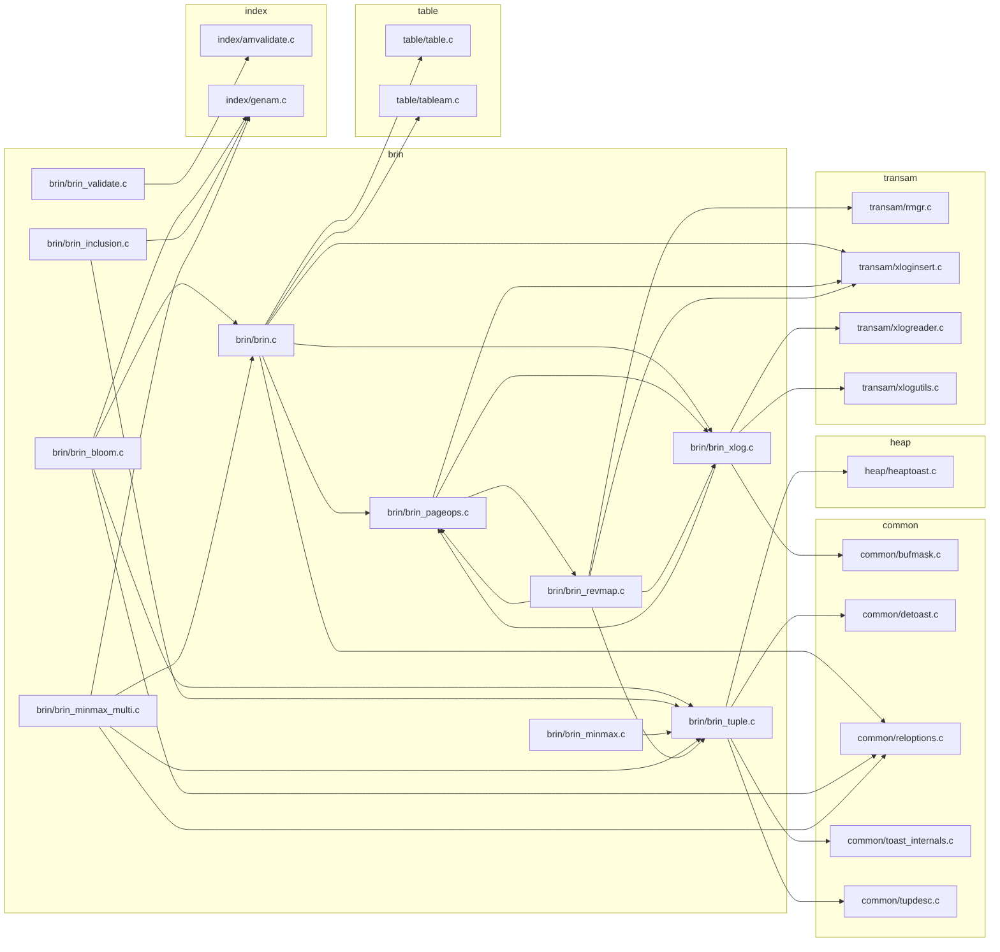

### from `common`

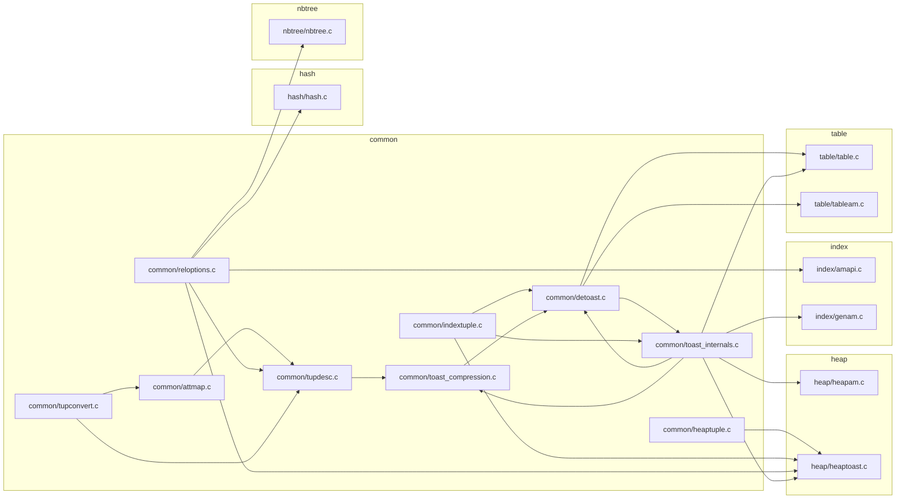

### from `gin`

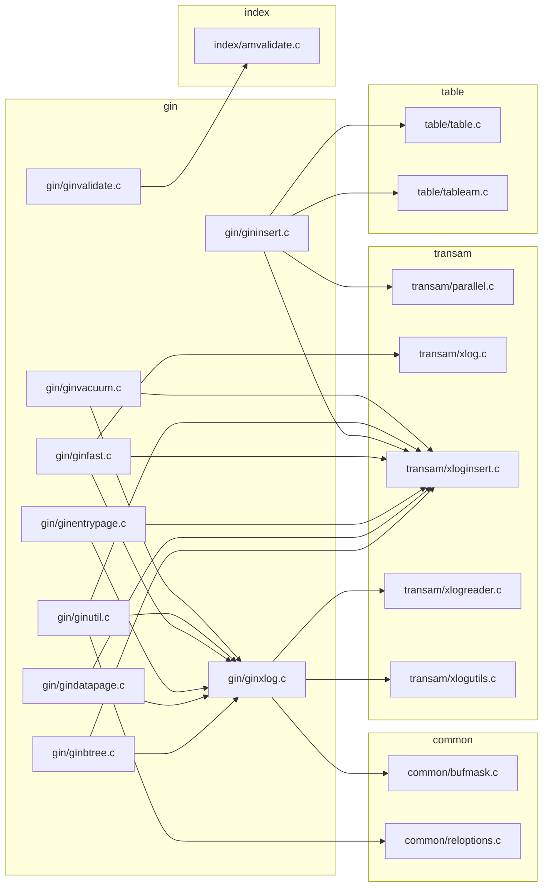

### from `gist`

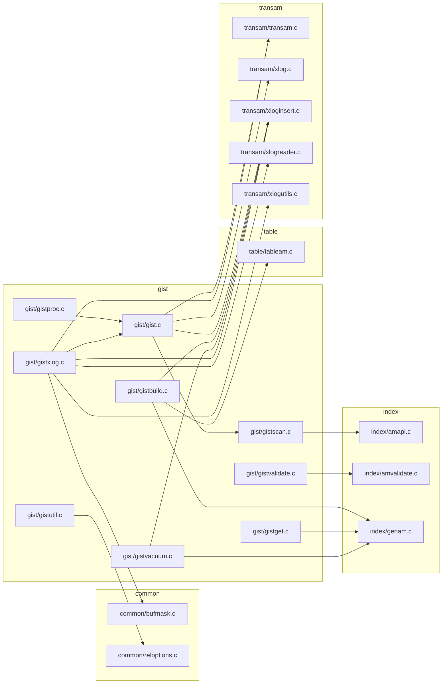

### from `hash`

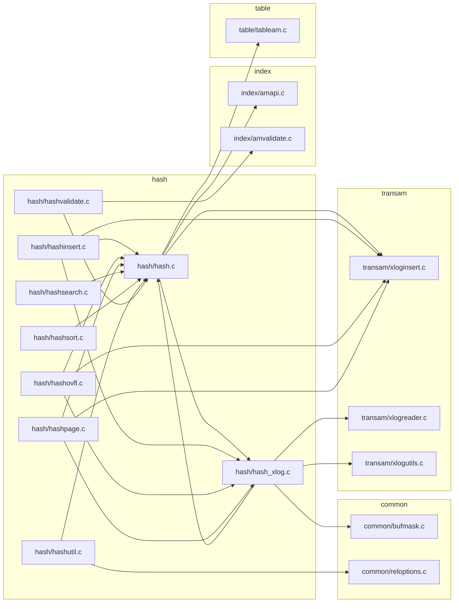

### from `heap`

```mermaid
graph LR
    subgraph "common"
        src_backend_access_common_bufmask_c["common/bufmask.c"]
        src_backend_access_common_detoast_c["common/detoast.c"]
        src_backend_access_common_syncscan_c["common/syncscan.c"]
        src_backend_access_common_tidstore_c["common/tidstore.c"]
        src_backend_access_common_toast_internals_c["common/toast_internals.c"]
    end
    subgraph "heap"
        src_backend_access_heap_heapam_c["heap/heapam.c"]
        src_backend_access_heap_heapam_handler_c["heap/heapam_handler.c"]
        src_backend_access_heap_heapam_indexscan_c["heap/heapam_indexscan.c"]
        src_backend_access_heap_heapam_visibility_c["heap/heapam_visibility.c"]
        src_backend_access_heap_heapam_xlog_c["heap/heapam_xlog.c"]
        src_backend_access_heap_heaptoast_c["heap/heaptoast.c"]
        src_backend_access_heap_hio_c["heap/hio.c"]
        src_backend_access_heap_pruneheap_c["heap/pruneheap.c"]
        src_backend_access_heap_rewriteheap_c["heap/rewriteheap.c"]
        src_backend_access_heap_vacuumlazy_c["heap/vacuumlazy.c"]
        src_backend_access_heap_visibilitymap_c["heap/visibilitymap.c"]
    end
    subgraph "index"
        src_backend_access_index_genam_c["index/genam.c"]
    end
    subgraph "table"
        src_backend_access_table_table_c["table/table.c"]
        src_backend_access_table_tableam_c["table/tableam.c"]
        src_backend_access_table_toast_helper_c["table/toast_helper.c"]
    end
    subgraph "transam"
        src_backend_access_transam_multixact_c["transam/multixact.c"]
        src_backend_access_transam_subtrans_c["transam/subtrans.c"]
        src_backend_access_transam_transam_c["transam/transam.c"]
        src_backend_access_transam_xlog_c["transam/xlog.c"]
        src_backend_access_transam_xloginsert_c["transam/xloginsert.c"]
        src_backend_access_transam_xlogreader_c["transam/xlogreader.c"]
        src_backend_access_transam_xlogutils_c["transam/xlogutils.c"]
    end
    src_backend_access_heap_heapam_c --> src_backend_access_common_syncscan_c
    src_backend_access_heap_heapam_c --> src_backend_access_heap_heapam_xlog_c
    src_backend_access_heap_heapam_c --> src_backend_access_heap_heaptoast_c
    src_backend_access_heap_heapam_c --> src_backend_access_heap_hio_c
    src_backend_access_heap_heapam_c --> src_backend_access_heap_visibilitymap_c
    src_backend_access_heap_heapam_c --> src_backend_access_table_table_c
    src_backend_access_heap_heapam_c --> src_backend_access_table_tableam_c
    src_backend_access_heap_heapam_c --> src_backend_access_transam_multixact_c
    src_backend_access_heap_heapam_c --> src_backend_access_transam_subtrans_c
    src_backend_access_heap_heapam_c --> src_backend_access_transam_xloginsert_c
    src_backend_access_heap_heapam_handler_c --> src_backend_access_common_syncscan_c
    src_backend_access_heap_heapam_handler_c --> src_backend_access_heap_heapam_c
    src_backend_access_heap_heapam_handler_c --> src_backend_access_heap_heaptoast_c
    src_backend_access_heap_heapam_handler_c --> src_backend_access_heap_rewriteheap_c
    src_backend_access_heap_heapam_handler_c --> src_backend_access_heap_visibilitymap_c
    src_backend_access_heap_heapam_handler_c --> src_backend_access_index_genam_c
    src_backend_access_heap_heapam_handler_c --> src_backend_access_table_tableam_c
    src_backend_access_heap_heapam_handler_c --> src_backend_access_transam_multixact_c
    src_backend_access_heap_heapam_indexscan_c --> src_backend_access_heap_heapam_c
    src_backend_access_heap_heapam_visibility_c --> src_backend_access_heap_heapam_c
    src_backend_access_heap_heapam_visibility_c --> src_backend_access_table_tableam_c
    src_backend_access_heap_heapam_visibility_c --> src_backend_access_transam_multixact_c
    src_backend_access_heap_heapam_visibility_c --> src_backend_access_transam_transam_c
    src_backend_access_heap_heapam_visibility_c --> src_backend_access_transam_xlog_c
    src_backend_access_heap_heapam_xlog_c --> src_backend_access_common_bufmask_c
    src_backend_access_heap_heapam_xlog_c --> src_backend_access_heap_heapam_c
    src_backend_access_heap_heapam_xlog_c --> src_backend_access_heap_visibilitymap_c
    src_backend_access_heap_heapam_xlog_c --> src_backend_access_transam_xlog_c
    src_backend_access_heap_heapam_xlog_c --> src_backend_access_transam_xlogreader_c
    src_backend_access_heap_heapam_xlog_c --> src_backend_access_transam_xlogutils_c
    src_backend_access_heap_heaptoast_c --> src_backend_access_common_detoast_c
    src_backend_access_heap_heaptoast_c --> src_backend_access_common_toast_internals_c
    src_backend_access_heap_heaptoast_c --> src_backend_access_heap_heapam_c
    src_backend_access_heap_heaptoast_c --> src_backend_access_index_genam_c
    src_backend_access_heap_heaptoast_c --> src_backend_access_table_toast_helper_c
    src_backend_access_heap_hio_c --> src_backend_access_heap_heapam_c
    src_backend_access_heap_hio_c --> src_backend_access_heap_visibilitymap_c
    src_backend_access_heap_pruneheap_c --> src_backend_access_heap_heapam_c
    src_backend_access_heap_pruneheap_c --> src_backend_access_heap_heapam_xlog_c
    src_backend_access_heap_pruneheap_c --> src_backend_access_heap_visibilitymap_c
    src_backend_access_heap_pruneheap_c --> src_backend_access_transam_multixact_c
    src_backend_access_heap_pruneheap_c --> src_backend_access_transam_transam_c
    src_backend_access_heap_pruneheap_c --> src_backend_access_transam_xlog_c
    src_backend_access_heap_pruneheap_c --> src_backend_access_transam_xloginsert_c
    src_backend_access_heap_rewriteheap_c --> src_backend_access_heap_heapam_c
    src_backend_access_heap_rewriteheap_c --> src_backend_access_heap_heapam_xlog_c
    src_backend_access_heap_rewriteheap_c --> src_backend_access_heap_heaptoast_c
    src_backend_access_heap_rewriteheap_c --> src_backend_access_transam_transam_c
    src_backend_access_heap_rewriteheap_c --> src_backend_access_transam_xloginsert_c
    src_backend_access_heap_vacuumlazy_c --> src_backend_access_common_tidstore_c
    src_backend_access_heap_vacuumlazy_c --> src_backend_access_heap_heapam_c
    src_backend_access_heap_vacuumlazy_c --> src_backend_access_heap_visibilitymap_c
    src_backend_access_heap_vacuumlazy_c --> src_backend_access_index_genam_c
    src_backend_access_heap_vacuumlazy_c --> src_backend_access_transam_multixact_c
    src_backend_access_heap_vacuumlazy_c --> src_backend_access_transam_transam_c
    src_backend_access_heap_vacuumlazy_c --> src_backend_access_transam_xloginsert_c
    src_backend_access_heap_visibilitymap_c --> src_backend_access_heap_heapam_xlog_c
    src_backend_access_heap_visibilitymap_c --> src_backend_access_transam_xloginsert_c
    src_backend_access_heap_visibilitymap_c --> src_backend_access_transam_xlogutils_c
```

### from `index`

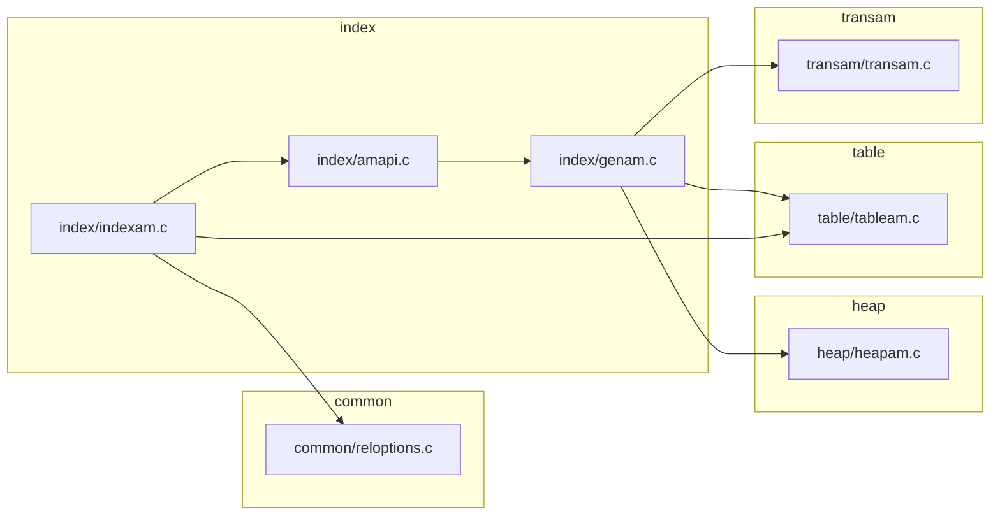

### from `nbtree`

```mermaid
graph LR
    subgraph "common"
        src_backend_access_common_bufmask_c["common/bufmask.c"]
        src_backend_access_common_reloptions_c["common/reloptions.c"]
    end
    subgraph "index"
        src_backend_access_index_amapi_c["index/amapi.c"]
        src_backend_access_index_amvalidate_c["index/amvalidate.c"]
    end
    subgraph "nbtree"
        src_backend_access_nbtree_nbtdedup_c["nbtree/nbtdedup.c"]
        src_backend_access_nbtree_nbtinsert_c["nbtree/nbtinsert.c"]
        src_backend_access_nbtree_nbtpage_c["nbtree/nbtpage.c"]
        src_backend_access_nbtree_nbtpreprocesskeys_c["nbtree/nbtpreprocesskeys.c"]
        src_backend_access_nbtree_nbtreadpage_c["nbtree/nbtreadpage.c"]
        src_backend_access_nbtree_nbtree_c["nbtree/nbtree.c"]
        src_backend_access_nbtree_nbtsearch_c["nbtree/nbtsearch.c"]
        src_backend_access_nbtree_nbtsort_c["nbtree/nbtsort.c"]
        src_backend_access_nbtree_nbtsplitloc_c["nbtree/nbtsplitloc.c"]
        src_backend_access_nbtree_nbtutils_c["nbtree/nbtutils.c"]
        src_backend_access_nbtree_nbtvalidate_c["nbtree/nbtvalidate.c"]
        src_backend_access_nbtree_nbtxlog_c["nbtree/nbtxlog.c"]
    end
    subgraph "table"
        src_backend_access_table_table_c["table/table.c"]
        src_backend_access_table_tableam_c["table/tableam.c"]
    end
    subgraph "transam"
        src_backend_access_transam_parallel_c["transam/parallel.c"]
        src_backend_access_transam_transam_c["transam/transam.c"]
        src_backend_access_transam_xlog_c["transam/xlog.c"]
        src_backend_access_transam_xloginsert_c["transam/xloginsert.c"]
        src_backend_access_transam_xlogreader_c["transam/xlogreader.c"]
        src_backend_access_transam_xlogutils_c["transam/xlogutils.c"]
    end
    src_backend_access_nbtree_nbtdedup_c --> src_backend_access_nbtree_nbtree_c
    src_backend_access_nbtree_nbtdedup_c --> src_backend_access_nbtree_nbtxlog_c
    src_backend_access_nbtree_nbtdedup_c --> src_backend_access_table_tableam_c
    src_backend_access_nbtree_nbtdedup_c --> src_backend_access_transam_xloginsert_c
    src_backend_access_nbtree_nbtinsert_c --> src_backend_access_nbtree_nbtree_c
    src_backend_access_nbtree_nbtinsert_c --> src_backend_access_nbtree_nbtxlog_c
    src_backend_access_nbtree_nbtinsert_c --> src_backend_access_table_tableam_c
    src_backend_access_nbtree_nbtinsert_c --> src_backend_access_transam_transam_c
    src_backend_access_nbtree_nbtinsert_c --> src_backend_access_transam_xloginsert_c
    src_backend_access_nbtree_nbtpage_c --> src_backend_access_nbtree_nbtree_c
    src_backend_access_nbtree_nbtpage_c --> src_backend_access_nbtree_nbtxlog_c
    src_backend_access_nbtree_nbtpage_c --> src_backend_access_table_tableam_c
    src_backend_access_nbtree_nbtpage_c --> src_backend_access_transam_transam_c
    src_backend_access_nbtree_nbtpage_c --> src_backend_access_transam_xlog_c
    src_backend_access_nbtree_nbtpage_c --> src_backend_access_transam_xloginsert_c
    src_backend_access_nbtree_nbtpreprocesskeys_c --> src_backend_access_nbtree_nbtree_c
    src_backend_access_nbtree_nbtreadpage_c --> src_backend_access_nbtree_nbtree_c
    src_backend_access_nbtree_nbtree_c --> src_backend_access_index_amapi_c
    src_backend_access_nbtree_nbtsearch_c --> src_backend_access_nbtree_nbtree_c
    src_backend_access_nbtree_nbtsort_c --> src_backend_access_nbtree_nbtree_c
    src_backend_access_nbtree_nbtsort_c --> src_backend_access_table_table_c
    src_backend_access_nbtree_nbtsort_c --> src_backend_access_table_tableam_c
    src_backend_access_nbtree_nbtsort_c --> src_backend_access_transam_parallel_c
    src_backend_access_nbtree_nbtsplitloc_c --> src_backend_access_nbtree_nbtree_c
    src_backend_access_nbtree_nbtsplitloc_c --> src_backend_access_table_tableam_c
    src_backend_access_nbtree_nbtutils_c --> src_backend_access_common_reloptions_c
    src_backend_access_nbtree_nbtutils_c --> src_backend_access_nbtree_nbtree_c
    src_backend_access_nbtree_nbtvalidate_c --> src_backend_access_index_amvalidate_c
    src_backend_access_nbtree_nbtvalidate_c --> src_backend_access_nbtree_nbtree_c
    src_backend_access_nbtree_nbtxlog_c --> src_backend_access_common_bufmask_c
    src_backend_access_nbtree_nbtxlog_c --> src_backend_access_nbtree_nbtree_c
    src_backend_access_nbtree_nbtxlog_c --> src_backend_access_transam_transam_c
    src_backend_access_nbtree_nbtxlog_c --> src_backend_access_transam_xlogreader_c
    src_backend_access_nbtree_nbtxlog_c --> src_backend_access_transam_xlogutils_c
```

### from `rmgrdesc`

```mermaid
graph LR
    subgraph "brin"
        src_backend_access_brin_brin_xlog_c["brin/brin_xlog.c"]
    end
    subgraph "gin"
        src_backend_access_gin_ginxlog_c["gin/ginxlog.c"]
    end
    subgraph "gist"
        src_backend_access_gist_gistxlog_c["gist/gistxlog.c"]
    end
    subgraph "hash"
        src_backend_access_hash_hash_xlog_c["hash/hash_xlog.c"]
    end
    subgraph "heap"
        src_backend_access_heap_heapam_xlog_c["heap/heapam_xlog.c"]
    end
    subgraph "nbtree"
        src_backend_access_nbtree_nbtxlog_c["nbtree/nbtxlog.c"]
    end
    subgraph "rmgrdesc"
        src_backend_access_rmgrdesc_brindesc_c["rmgrdesc/brindesc.c"]
        src_backend_access_rmgrdesc_clogdesc_c["rmgrdesc/clogdesc.c"]
        src_backend_access_rmgrdesc_committsdesc_c["rmgrdesc/committsdesc.c"]
        src_backend_access_rmgrdesc_genericdesc_c["rmgrdesc/genericdesc.c"]
        src_backend_access_rmgrdesc_gindesc_c["rmgrdesc/gindesc.c"]
        src_backend_access_rmgrdesc_gistdesc_c["rmgrdesc/gistdesc.c"]
        src_backend_access_rmgrdesc_hashdesc_c["rmgrdesc/hashdesc.c"]
        src_backend_access_rmgrdesc_heapdesc_c["rmgrdesc/heapdesc.c"]
        src_backend_access_rmgrdesc_mxactdesc_c["rmgrdesc/mxactdesc.c"]
        src_backend_access_rmgrdesc_nbtdesc_c["rmgrdesc/nbtdesc.c"]
        src_backend_access_rmgrdesc_rmgrdesc_utils_c["rmgrdesc/rmgrdesc_utils.c"]
        src_backend_access_rmgrdesc_spgdesc_c["rmgrdesc/spgdesc.c"]
        src_backend_access_rmgrdesc_xactdesc_c["rmgrdesc/xactdesc.c"]
        src_backend_access_rmgrdesc_xlogdesc_c["rmgrdesc/xlogdesc.c"]
    end
    subgraph "spgist"
        src_backend_access_spgist_spgxlog_c["spgist/spgxlog.c"]
    end
    subgraph "transam"
        src_backend_access_transam_clog_c["transam/clog.c"]
        src_backend_access_transam_commit_ts_c["transam/commit_ts.c"]
        src_backend_access_transam_generic_xlog_c["transam/generic_xlog.c"]
        src_backend_access_transam_multixact_c["transam/multixact.c"]
        src_backend_access_transam_transam_c["transam/transam.c"]
        src_backend_access_transam_xlog_c["transam/xlog.c"]
    end
    src_backend_access_rmgrdesc_brindesc_c --> src_backend_access_brin_brin_xlog_c
    src_backend_access_rmgrdesc_clogdesc_c --> src_backend_access_transam_clog_c
    src_backend_access_rmgrdesc_committsdesc_c --> src_backend_access_transam_commit_ts_c
    src_backend_access_rmgrdesc_genericdesc_c --> src_backend_access_transam_generic_xlog_c
    src_backend_access_rmgrdesc_gindesc_c --> src_backend_access_gin_ginxlog_c
    src_backend_access_rmgrdesc_gistdesc_c --> src_backend_access_gist_gistxlog_c
    src_backend_access_rmgrdesc_hashdesc_c --> src_backend_access_hash_hash_xlog_c
    src_backend_access_rmgrdesc_heapdesc_c --> src_backend_access_heap_heapam_xlog_c
    src_backend_access_rmgrdesc_heapdesc_c --> src_backend_access_rmgrdesc_rmgrdesc_utils_c
    src_backend_access_rmgrdesc_mxactdesc_c --> src_backend_access_transam_multixact_c
    src_backend_access_rmgrdesc_nbtdesc_c --> src_backend_access_nbtree_nbtxlog_c
    src_backend_access_rmgrdesc_nbtdesc_c --> src_backend_access_rmgrdesc_rmgrdesc_utils_c
    src_backend_access_rmgrdesc_spgdesc_c --> src_backend_access_spgist_spgxlog_c
    src_backend_access_rmgrdesc_xactdesc_c --> src_backend_access_transam_transam_c
    src_backend_access_rmgrdesc_xlogdesc_c --> src_backend_access_transam_transam_c
    src_backend_access_rmgrdesc_xlogdesc_c --> src_backend_access_transam_xlog_c
```

### from `spgist`

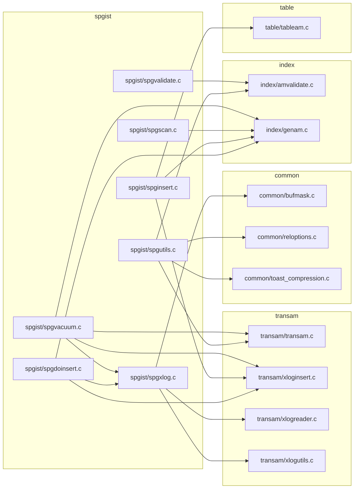

### from `table`

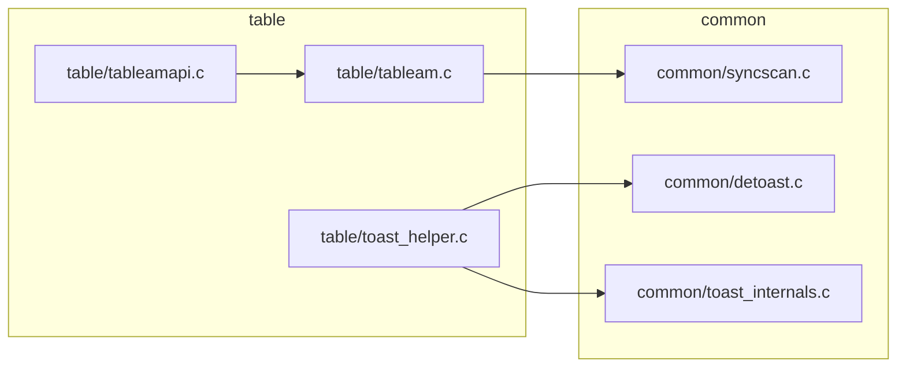

### from `transam`

```mermaid
graph LR
    subgraph "brin"
        src_backend_access_brin_brin_c["brin/brin.c"]
        src_backend_access_brin_brin_xlog_c["brin/brin_xlog.c"]
    end
    subgraph "common"
        src_backend_access_common_bufmask_c["common/bufmask.c"]
        src_backend_access_common_session_c["common/session.c"]
    end
    subgraph "gin"
        src_backend_access_gin_ginxlog_c["gin/ginxlog.c"]
    end
    subgraph "gist"
        src_backend_access_gist_gistxlog_c["gist/gistxlog.c"]
    end
    subgraph "hash"
        src_backend_access_hash_hash_xlog_c["hash/hash_xlog.c"]
    end
    subgraph "heap"
        src_backend_access_heap_heapam_xlog_c["heap/heapam_xlog.c"]
        src_backend_access_heap_heaptoast_c["heap/heaptoast.c"]
        src_backend_access_heap_rewriteheap_c["heap/rewriteheap.c"]
    end
    subgraph "nbtree"
        src_backend_access_nbtree_nbtree_c["nbtree/nbtree.c"]
        src_backend_access_nbtree_nbtxlog_c["nbtree/nbtxlog.c"]
    end
    subgraph "spgist"
        src_backend_access_spgist_spgxlog_c["spgist/spgxlog.c"]
    end
    subgraph "transam"
        src_backend_access_transam_clog_c["transam/clog.c"]
        src_backend_access_transam_commit_ts_c["transam/commit_ts.c"]
        src_backend_access_transam_generic_xlog_c["transam/generic_xlog.c"]
        src_backend_access_transam_multixact_c["transam/multixact.c"]
        src_backend_access_transam_parallel_c["transam/parallel.c"]
        src_backend_access_transam_rmgr_c["transam/rmgr.c"]
        src_backend_access_transam_slru_c["transam/slru.c"]
        src_backend_access_transam_subtrans_c["transam/subtrans.c"]
        src_backend_access_transam_timeline_c["transam/timeline.c"]
        src_backend_access_transam_transam_c["transam/transam.c"]
        src_backend_access_transam_twophase_c["transam/twophase.c"]
        src_backend_access_transam_twophase_rmgr_c["transam/twophase_rmgr.c"]
        src_backend_access_transam_varsup_c["transam/varsup.c"]
        src_backend_access_transam_xact_c["transam/xact.c"]
        src_backend_access_transam_xlog_c["transam/xlog.c"]
        src_backend_access_transam_xlogarchive_c["transam/xlogarchive.c"]
        src_backend_access_transam_xlogbackup_c["transam/xlogbackup.c"]
        src_backend_access_transam_xlogfuncs_c["transam/xlogfuncs.c"]
        src_backend_access_transam_xloginsert_c["transam/xloginsert.c"]
        src_backend_access_transam_xlogprefetcher_c["transam/xlogprefetcher.c"]
        src_backend_access_transam_xlogreader_c["transam/xlogreader.c"]
        src_backend_access_transam_xlogrecovery_c["transam/xlogrecovery.c"]
        src_backend_access_transam_xlogstats_c["transam/xlogstats.c"]
        src_backend_access_transam_xlogutils_c["transam/xlogutils.c"]
        src_backend_access_transam_xlogwait_c["transam/xlogwait.c"]
    end
    src_backend_access_transam_clog_c --> src_backend_access_transam_slru_c
    src_backend_access_transam_clog_c --> src_backend_access_transam_transam_c
    src_backend_access_transam_clog_c --> src_backend_access_transam_xlog_c
    src_backend_access_transam_clog_c --> src_backend_access_transam_xloginsert_c
    src_backend_access_transam_clog_c --> src_backend_access_transam_xlogreader_c
    src_backend_access_transam_clog_c --> src_backend_access_transam_xlogutils_c
    src_backend_access_transam_commit_ts_c --> src_backend_access_transam_slru_c
    src_backend_access_transam_commit_ts_c --> src_backend_access_transam_transam_c
    src_backend_access_transam_commit_ts_c --> src_backend_access_transam_xlog_c
    src_backend_access_transam_commit_ts_c --> src_backend_access_transam_xloginsert_c
    src_backend_access_transam_commit_ts_c --> src_backend_access_transam_xlogutils_c
    src_backend_access_transam_generic_xlog_c --> src_backend_access_common_bufmask_c
    src_backend_access_transam_generic_xlog_c --> src_backend_access_transam_xlog_c
    src_backend_access_transam_generic_xlog_c --> src_backend_access_transam_xloginsert_c
    src_backend_access_transam_generic_xlog_c --> src_backend_access_transam_xlogreader_c
    src_backend_access_transam_generic_xlog_c --> src_backend_access_transam_xlogutils_c
    src_backend_access_transam_multixact_c --> src_backend_access_transam_slru_c
    src_backend_access_transam_multixact_c --> src_backend_access_transam_transam_c
    src_backend_access_transam_multixact_c --> src_backend_access_transam_twophase_c
    src_backend_access_transam_multixact_c --> src_backend_access_transam_twophase_rmgr_c
    src_backend_access_transam_multixact_c --> src_backend_access_transam_xlog_c
    src_backend_access_transam_multixact_c --> src_backend_access_transam_xloginsert_c
    src_backend_access_transam_multixact_c --> src_backend_access_transam_xlogreader_c
    src_backend_access_transam_multixact_c --> src_backend_access_transam_xlogutils_c
    src_backend_access_transam_parallel_c --> src_backend_access_brin_brin_c
    src_backend_access_transam_parallel_c --> src_backend_access_common_session_c
    src_backend_access_transam_parallel_c --> src_backend_access_nbtree_nbtree_c
    src_backend_access_transam_parallel_c --> src_backend_access_transam_xlog_c
    src_backend_access_transam_rmgr_c --> src_backend_access_brin_brin_xlog_c
    src_backend_access_transam_rmgr_c --> src_backend_access_gin_ginxlog_c
    src_backend_access_transam_rmgr_c --> src_backend_access_gist_gistxlog_c
    src_backend_access_transam_rmgr_c --> src_backend_access_hash_hash_xlog_c
    src_backend_access_transam_rmgr_c --> src_backend_access_heap_heapam_xlog_c
    src_backend_access_transam_rmgr_c --> src_backend_access_nbtree_nbtxlog_c
    src_backend_access_transam_rmgr_c --> src_backend_access_spgist_spgxlog_c
    src_backend_access_transam_rmgr_c --> src_backend_access_transam_clog_c
    src_backend_access_transam_rmgr_c --> src_backend_access_transam_commit_ts_c
    src_backend_access_transam_rmgr_c --> src_backend_access_transam_generic_xlog_c
    src_backend_access_transam_rmgr_c --> src_backend_access_transam_multixact_c
    src_backend_access_transam_slru_c --> src_backend_access_transam_transam_c
    src_backend_access_transam_slru_c --> src_backend_access_transam_xlog_c
    src_backend_access_transam_slru_c --> src_backend_access_transam_xlogutils_c
    src_backend_access_transam_subtrans_c --> src_backend_access_transam_slru_c
    src_backend_access_transam_subtrans_c --> src_backend_access_transam_transam_c
    src_backend_access_transam_timeline_c --> src_backend_access_transam_xlog_c
    src_backend_access_transam_timeline_c --> src_backend_access_transam_xlogarchive_c
    src_backend_access_transam_transam_c --> src_backend_access_transam_clog_c
    src_backend_access_transam_transam_c --> src_backend_access_transam_subtrans_c
    src_backend_access_transam_twophase_c --> src_backend_access_transam_commit_ts_c
    src_backend_access_transam_twophase_c --> src_backend_access_transam_subtrans_c
    src_backend_access_transam_twophase_c --> src_backend_access_transam_transam_c
    src_backend_access_transam_twophase_c --> src_backend_access_transam_twophase_rmgr_c
    src_backend_access_transam_twophase_c --> src_backend_access_transam_xlog_c
    src_backend_access_transam_twophase_c --> src_backend_access_transam_xloginsert_c
    src_backend_access_transam_twophase_c --> src_backend_access_transam_xlogreader_c
    src_backend_access_transam_twophase_c --> src_backend_access_transam_xlogrecovery_c
    src_backend_access_transam_twophase_c --> src_backend_access_transam_xlogutils_c
    src_backend_access_transam_twophase_rmgr_c --> src_backend_access_transam_multixact_c
    src_backend_access_transam_twophase_rmgr_c --> src_backend_access_transam_transam_c
    src_backend_access_transam_varsup_c --> src_backend_access_transam_clog_c
    src_backend_access_transam_varsup_c --> src_backend_access_transam_commit_ts_c
    src_backend_access_transam_varsup_c --> src_backend_access_transam_subtrans_c
    src_backend_access_transam_varsup_c --> src_backend_access_transam_transam_c
    src_backend_access_transam_varsup_c --> src_backend_access_transam_xlogutils_c
    src_backend_access_transam_xact_c --> src_backend_access_transam_commit_ts_c
    src_backend_access_transam_xact_c --> src_backend_access_transam_multixact_c
    src_backend_access_transam_xact_c --> src_backend_access_transam_parallel_c
    src_backend_access_transam_xact_c --> src_backend_access_transam_subtrans_c
    src_backend_access_transam_xact_c --> src_backend_access_transam_transam_c
    src_backend_access_transam_xact_c --> src_backend_access_transam_twophase_c
    src_backend_access_transam_xact_c --> src_backend_access_transam_xlog_c
    src_backend_access_transam_xact_c --> src_backend_access_transam_xloginsert_c
    src_backend_access_transam_xact_c --> src_backend_access_transam_xlogreader_c
    src_backend_access_transam_xact_c --> src_backend_access_transam_xlogrecovery_c
    src_backend_access_transam_xact_c --> src_backend_access_transam_xlogutils_c
    src_backend_access_transam_xact_c --> src_backend_access_transam_xlogwait_c
    src_backend_access_transam_xlog_c --> src_backend_access_heap_heaptoast_c
    src_backend_access_transam_xlog_c --> src_backend_access_heap_rewriteheap_c
    src_backend_access_transam_xlog_c --> src_backend_access_transam_clog_c
    src_backend_access_transam_xlog_c --> src_backend_access_transam_commit_ts_c
    src_backend_access_transam_xlog_c --> src_backend_access_transam_multixact_c
    src_backend_access_transam_xlog_c --> src_backend_access_transam_subtrans_c
    src_backend_access_transam_xlog_c --> src_backend_access_transam_timeline_c
    src_backend_access_transam_xlog_c --> src_backend_access_transam_transam_c
    src_backend_access_transam_xlog_c --> src_backend_access_transam_twophase_c
    src_backend_access_transam_xlog_c --> src_backend_access_transam_xlogarchive_c
    src_backend_access_transam_xlog_c --> src_backend_access_transam_xlogbackup_c
    src_backend_access_transam_xlog_c --> src_backend_access_transam_xloginsert_c
    src_backend_access_transam_xlog_c --> src_backend_access_transam_xlogreader_c
    src_backend_access_transam_xlog_c --> src_backend_access_transam_xlogrecovery_c
    src_backend_access_transam_xlog_c --> src_backend_access_transam_xlogutils_c
    src_backend_access_transam_xlog_c --> src_backend_access_transam_xlogwait_c
    src_backend_access_transam_xlogarchive_c --> src_backend_access_transam_xlog_c
    src_backend_access_transam_xlogbackup_c --> src_backend_access_transam_xlog_c
    src_backend_access_transam_xlogfuncs_c --> src_backend_access_transam_xlogbackup_c
    src_backend_access_transam_xlogfuncs_c --> src_backend_access_transam_xlogrecovery_c
    src_backend_access_transam_xloginsert_c --> src_backend_access_transam_rmgr_c
    src_backend_access_transam_xloginsert_c --> src_backend_access_transam_xlog_c
    src_backend_access_transam_xlogprefetcher_c --> src_backend_access_transam_xlogreader_c
    src_backend_access_transam_xlogreader_c --> src_backend_access_transam_transam_c
    src_backend_access_transam_xlogrecovery_c --> src_backend_access_transam_timeline_c
    src_backend_access_transam_xlogrecovery_c --> src_backend_access_transam_transam_c
    src_backend_access_transam_xlogrecovery_c --> src_backend_access_transam_xlogarchive_c
    src_backend_access_transam_xlogrecovery_c --> src_backend_access_transam_xlogprefetcher_c
    src_backend_access_transam_xlogrecovery_c --> src_backend_access_transam_xlogreader_c
    src_backend_access_transam_xlogrecovery_c --> src_backend_access_transam_xlogutils_c
    src_backend_access_transam_xlogrecovery_c --> src_backend_access_transam_xlogwait_c
    src_backend_access_transam_xlogstats_c --> src_backend_access_transam_rmgr_c
    src_backend_access_transam_xlogstats_c --> src_backend_access_transam_xlogreader_c
    src_backend_access_transam_xlogutils_c --> src_backend_access_transam_timeline_c
    src_backend_access_transam_xlogutils_c --> src_backend_access_transam_xlogreader_c
    src_backend_access_transam_xlogutils_c --> src_backend_access_transam_xlogrecovery_c
    src_backend_access_transam_xlogwait_c --> src_backend_access_transam_xlog_c
    src_backend_access_transam_xlogwait_c --> src_backend_access_transam_xlogrecovery_c
```

## External dependencies

### `src/backend/access/brin`

```mermaid
graph LR
    subgraph "catalog"
        src_backend_catalog_index_c["index.c"]
    end
    subgraph "commands"
        src_backend_commands_vacuum_c["vacuum.c"]
    end
    subgraph "common"
        src_common_hashfn_c["hashfn.c"]
        src_common_stringinfo_c["stringinfo.c"]
    end
    subgraph "executor"
        src_backend_executor_instrument_c["instrument.c"]
    end
    subgraph "include/access"
        src_include_access_brin_internal_h["brin_internal.h"]
        src_include_access_brin_page_h["brin_page.h"]
        src_include_access_relation_h["relation.h"]
        src_include_access_relscan_h["relscan.h"]
        src_include_access_skey_h["skey.h"]
        src_include_access_stratnum_h["stratnum.h"]
        src_include_access_tupmacs_h["tupmacs.h"]
    end
    subgraph "include/catalog"
        src_include_catalog_pg_am_h["pg_am.h"]
        src_include_catalog_pg_amop_h["pg_amop.h"]
        src_include_catalog_pg_amproc_h["pg_amproc.h"]
        src_include_catalog_pg_opclass_h["pg_opclass.h"]
    end
    subgraph "include/port"
        src_include_port_win32_sys_socket_h["win32/sys/socket.h"]
    end
    subgraph "include/storage"
        src_include_storage_block_h["block.h"]
        src_include_storage_buf_h["buf.h"]
        src_include_storage_off_h["off.h"]
        src_include_storage_relfilelocator_h["relfilelocator.h"]
    end
    subgraph "include/tcop"
        src_include_tcop_tcopprot_h["tcopprot.h"]
    end
    subgraph "include/utils"
        src_include_utils_array_h["array.h"]
        src_include_utils_index_selfuncs_h["index_selfuncs.h"]
        src_include_utils_inet_h["inet.h"]
        src_include_utils_snapshot_h["snapshot.h"]
    end
    subgraph "port"
        src_port_pg_bitutils_c["pg_bitutils.c"]
    end
    subgraph "postmaster"
        src_backend_postmaster_autovacuum_c["autovacuum.c"]
    end
    subgraph "src/backend/access/brin"
        src_backend_access_brin_brin_c["brin/brin.c"]
        src_backend_access_brin_brin_bloom_c["brin/brin_bloom.c"]
        src_backend_access_brin_brin_inclusion_c["brin/brin_inclusion.c"]
        src_backend_access_brin_brin_minmax_c["brin/brin_minmax.c"]
        src_backend_access_brin_brin_minmax_multi_c["brin/brin_minmax_multi.c"]
        src_backend_access_brin_brin_pageops_c["brin/brin_pageops.c"]
        src_backend_access_brin_brin_revmap_c["brin/brin_revmap.c"]
        src_backend_access_brin_brin_tuple_c["brin/brin_tuple.c"]
        src_backend_access_brin_brin_validate_c["brin/brin_validate.c"]
        src_backend_access_brin_brin_xlog_c["brin/brin_xlog.c"]
    end
    subgraph "storage"
        src_backend_storage_buffer_bufmgr_c["buffer/bufmgr.c"]
        src_backend_storage_freespace_freespace_c["freespace/freespace.c"]
        src_backend_storage_ipc_dsm_c["ipc/dsm.c"]
        src_backend_storage_ipc_shm_toc_c["ipc/shm_toc.c"]
        src_backend_storage_lmgr_condition_variable_c["lmgr/condition_variable.c"]
        src_backend_storage_lmgr_lmgr_c["lmgr/lmgr.c"]
        src_backend_storage_lmgr_proc_c["lmgr/proc.c"]
        src_backend_storage_page_bufpage_c["page/bufpage.c"]
        src_backend_storage_page_itemptr_c["page/itemptr.c"]
    end
    subgraph "utils"
        src_backend_utils_activity_wait_event_c["activity/wait_event.c"]
        src_backend_utils_adt_acl_c["adt/acl.c"]
        src_backend_utils_adt_date_c["adt/date.c"]
        src_backend_utils_adt_datum_c["adt/datum.c"]
        src_backend_utils_adt_float_c["adt/float.c"]
        src_backend_utils_adt_pg_lsn_c["adt/pg_lsn.c"]
        src_backend_utils_adt_regproc_c["adt/regproc.c"]
        src_backend_utils_adt_timestamp_c["adt/timestamp.c"]
        src_backend_utils_adt_uuid_c["adt/uuid.c"]
        src_backend_utils_cache_relcache_c["cache/relcache.c"]
        src_backend_utils_misc_guc_c["misc/guc.c"]
        src_backend_utils_sort_tuplesort_c["sort/tuplesort.c"]
    end
    src_backend_access_brin_brin_c --> src_backend_catalog_index_c
    src_backend_access_brin_brin_c --> src_backend_commands_vacuum_c
    src_backend_access_brin_brin_c --> src_backend_executor_instrument_c
    src_backend_access_brin_brin_c --> src_backend_postmaster_autovacuum_c
    src_backend_access_brin_brin_c --> src_backend_storage_buffer_bufmgr_c
    src_backend_access_brin_brin_c --> src_backend_storage_freespace_freespace_c
    src_backend_access_brin_brin_c --> src_backend_storage_ipc_dsm_c
    src_backend_access_brin_brin_c --> src_backend_storage_ipc_shm_toc_c
    src_backend_access_brin_brin_c --> src_backend_storage_lmgr_condition_variable_c
    src_backend_access_brin_brin_c --> src_backend_storage_lmgr_proc_c
    src_backend_access_brin_brin_c --> src_backend_utils_activity_wait_event_c
    src_backend_access_brin_brin_c --> src_backend_utils_adt_acl_c
    src_backend_access_brin_brin_c --> src_backend_utils_adt_datum_c
    src_backend_access_brin_brin_c --> src_backend_utils_cache_relcache_c
    src_backend_access_brin_brin_c --> src_backend_utils_misc_guc_c
    src_backend_access_brin_brin_c --> src_backend_utils_sort_tuplesort_c
    src_backend_access_brin_brin_c --> src_include_access_brin_page_h
    src_backend_access_brin_brin_c --> src_include_access_relation_h
    src_backend_access_brin_brin_c --> src_include_access_relscan_h
    src_backend_access_brin_brin_c --> src_include_catalog_pg_am_h
    src_backend_access_brin_brin_c --> src_include_storage_block_h
    src_backend_access_brin_brin_c --> src_include_tcop_tcopprot_h
    src_backend_access_brin_brin_c --> src_include_utils_index_selfuncs_h
    src_backend_access_brin_brin_bloom_c --> src_common_hashfn_c
    src_backend_access_brin_brin_bloom_c --> src_include_access_brin_internal_h
    src_backend_access_brin_brin_bloom_c --> src_include_access_brin_page_h
    src_backend_access_brin_brin_bloom_c --> src_include_catalog_pg_am_h
    src_backend_access_brin_brin_bloom_c --> src_port_pg_bitutils_c
    src_backend_access_brin_brin_inclusion_c --> src_backend_utils_adt_datum_c
    src_backend_access_brin_brin_inclusion_c --> src_include_access_brin_internal_h
    src_backend_access_brin_brin_inclusion_c --> src_include_access_skey_h
    src_backend_access_brin_brin_inclusion_c --> src_include_catalog_pg_amop_h
    src_backend_access_brin_brin_minmax_c --> src_backend_utils_adt_datum_c
    src_backend_access_brin_brin_minmax_c --> src_include_access_brin_internal_h
    src_backend_access_brin_brin_minmax_c --> src_include_access_stratnum_h
    src_backend_access_brin_brin_minmax_c --> src_include_catalog_pg_amop_h
    src_backend_access_brin_brin_minmax_multi_c --> src_backend_utils_adt_date_c
    src_backend_access_brin_brin_minmax_multi_c --> src_backend_utils_adt_datum_c
    src_backend_access_brin_brin_minmax_multi_c --> src_backend_utils_adt_float_c
    src_backend_access_brin_brin_minmax_multi_c --> src_backend_utils_adt_pg_lsn_c
    src_backend_access_brin_brin_minmax_multi_c --> src_backend_utils_adt_timestamp_c
    src_backend_access_brin_brin_minmax_multi_c --> src_backend_utils_adt_uuid_c
    src_backend_access_brin_brin_minmax_multi_c --> src_include_access_brin_internal_h
    src_backend_access_brin_brin_minmax_multi_c --> src_include_access_stratnum_h
    src_backend_access_brin_brin_minmax_multi_c --> src_include_catalog_pg_am_h
    src_backend_access_brin_brin_minmax_multi_c --> src_include_catalog_pg_amop_h
    src_backend_access_brin_brin_minmax_multi_c --> src_include_port_win32_sys_socket_h
    src_backend_access_brin_brin_minmax_multi_c --> src_include_utils_array_h
    src_backend_access_brin_brin_minmax_multi_c --> src_include_utils_inet_h
    src_backend_access_brin_brin_pageops_c --> src_backend_storage_buffer_bufmgr_c
    src_backend_access_brin_brin_pageops_c --> src_backend_storage_freespace_freespace_c
    src_backend_access_brin_brin_pageops_c --> src_backend_storage_lmgr_lmgr_c
    src_backend_access_brin_brin_pageops_c --> src_include_access_brin_page_h
    src_backend_access_brin_brin_revmap_c --> src_backend_storage_buffer_bufmgr_c
    src_backend_access_brin_brin_revmap_c --> src_backend_storage_page_itemptr_c
    src_backend_access_brin_brin_revmap_c --> src_backend_utils_cache_relcache_c
    src_backend_access_brin_brin_revmap_c --> src_include_access_brin_page_h
    src_backend_access_brin_brin_revmap_c --> src_include_storage_block_h
    src_backend_access_brin_brin_revmap_c --> src_include_storage_buf_h
    src_backend_access_brin_brin_revmap_c --> src_include_storage_off_h
    src_backend_access_brin_brin_revmap_c --> src_include_utils_snapshot_h
    src_backend_access_brin_brin_tuple_c --> src_backend_utils_adt_datum_c
    src_backend_access_brin_brin_tuple_c --> src_include_access_brin_internal_h
    src_backend_access_brin_brin_tuple_c --> src_include_access_tupmacs_h
    src_backend_access_brin_brin_validate_c --> src_backend_utils_adt_regproc_c
    src_backend_access_brin_brin_validate_c --> src_include_access_brin_internal_h
    src_backend_access_brin_brin_validate_c --> src_include_catalog_pg_amop_h
    src_backend_access_brin_brin_validate_c --> src_include_catalog_pg_amproc_h
    src_backend_access_brin_brin_validate_c --> src_include_catalog_pg_opclass_h
    src_backend_access_brin_brin_xlog_c --> src_backend_storage_page_bufpage_c
    src_backend_access_brin_brin_xlog_c --> src_backend_storage_page_itemptr_c
    src_backend_access_brin_brin_xlog_c --> src_backend_utils_cache_relcache_c
    src_backend_access_brin_brin_xlog_c --> src_common_stringinfo_c
    src_backend_access_brin_brin_xlog_c --> src_include_access_brin_page_h
    src_backend_access_brin_brin_xlog_c --> src_include_storage_relfilelocator_h
```

### `src/backend/access/common`

```mermaid
graph LR
    subgraph "catalog"
        src_backend_catalog_catalog_c["catalog.c"]
        src_backend_catalog_namespace_c["namespace.c"]
        src_backend_catalog_pg_collation_c["pg_collation.c"]
    end
    subgraph "commands"
        src_backend_commands_tablespace_c["tablespace.c"]
    end
    subgraph "common"
        src_common_hashfn_c["hashfn.c"]
        src_common_pg_lzcompress_c["pg_lzcompress.c"]
    end
    subgraph "include/access"
        src_include_access_attnum_h["attnum.h"]
        src_include_access_gist_private_h["gist_private.h"]
        src_include_access_htup_h["htup.h"]
        src_include_access_itup_h["itup.h"]
        src_include_access_relation_h["relation.h"]
        src_include_access_skey_h["skey.h"]
        src_include_access_spgist_private_h["spgist_private.h"]
        src_include_access_sysattr_h["sysattr.h"]
        src_include_access_tupdesc_details_h["tupdesc_details.h"]
    end
    subgraph "include/catalog"
        src_include_catalog_pg_attribute_h["pg_attribute.h"]
    end
    subgraph "include/commands"
        src_include_commands_defrem_h["defrem.h"]
    end
    subgraph "include/executor"
        src_include_executor_tuptable_h["tuptable.h"]
    end
    subgraph "include/lib"
        src_include_lib_radixtree_h["radixtree.h"]
    end
    subgraph "include/libpq"
        src_include_libpq_protocol_h["protocol.h"]
    end
    subgraph "include/nodes"
        src_include_nodes_pg_list_h["pg_list.h"]
    end
    subgraph "include/storage"
        src_include_storage_block_h["block.h"]
        src_include_storage_lockdefs_h["lockdefs.h"]
        src_include_storage_subsystems_h["subsystems.h"]
    end
    subgraph "include/top"
        src_include_varatt_h["varatt.h"]
    end
    subgraph "include/utils"
        src_include_utils_array_h["array.h"]
        src_include_utils_hsearch_h["hsearch.h"]
        src_include_utils_portal_h["portal.h"]
        src_include_utils_snapshot_h["snapshot.h"]
    end
    subgraph "lib"
        src_backend_lib_dshash_c["dshash.c"]
    end
    subgraph "libpq"
        src_backend_libpq_pqformat_c["pqformat.c"]
    end
    subgraph "nodes"
        src_backend_nodes_bitmapset_c["bitmapset.c"]
        src_backend_nodes_makefuncs_c["makefuncs.c"]
    end
    subgraph "src/backend/access/common"
        src_backend_access_common_attmap_c["common/attmap.c"]
        src_backend_access_common_bufmask_c["common/bufmask.c"]
        src_backend_access_common_detoast_c["common/detoast.c"]
        src_backend_access_common_heaptuple_c["common/heaptuple.c"]
        src_backend_access_common_indextuple_c["common/indextuple.c"]
        src_backend_access_common_printsimple_c["common/printsimple.c"]
        src_backend_access_common_printtup_c["common/printtup.c"]
        src_backend_access_common_relation_c["common/relation.c"]
        src_backend_access_common_reloptions_c["common/reloptions.c"]
        src_backend_access_common_scankey_c["common/scankey.c"]
        src_backend_access_common_session_c["common/session.c"]
        src_backend_access_common_syncscan_c["common/syncscan.c"]
        src_backend_access_common_tidstore_c["common/tidstore.c"]
        src_backend_access_common_toast_compression_c["common/toast_compression.c"]
        src_backend_access_common_toast_internals_c["common/toast_internals.c"]
        src_backend_access_common_tupconvert_c["common/tupconvert.c"]
        src_backend_access_common_tupdesc_c["common/tupdesc.c"]
    end
    subgraph "storage"
        src_backend_storage_buffer_bufmgr_c["buffer/bufmgr.c"]
        src_backend_storage_ipc_shm_toc_c["ipc/shm_toc.c"]
        src_backend_storage_ipc_shmem_c["ipc/shmem.c"]
        src_backend_storage_lmgr_lmgr_c["lmgr/lmgr.c"]
        src_backend_storage_lmgr_lock_c["lmgr/lock.c"]
        src_backend_storage_lmgr_lwlock_c["lmgr/lwlock.c"]
        src_backend_storage_page_itemptr_c["page/itemptr.c"]
    end
    subgraph "tcop"
        src_backend_tcop_dest_c["dest.c"]
        src_backend_tcop_pquery_c["pquery.c"]
    end
    subgraph "utils"
        src_backend_utils_adt_datum_c["adt/datum.c"]
        src_backend_utils_adt_expandeddatum_c["adt/expandeddatum.c"]
        src_backend_utils_adt_float_c["adt/float.c"]
        src_backend_utils_adt_int_c["adt/int.c"]
        src_backend_utils_cache_attoptcache_c["cache/attoptcache.c"]
        src_backend_utils_cache_inval_c["cache/inval.c"]
        src_backend_utils_cache_relcache_c["cache/relcache.c"]
        src_backend_utils_cache_typcache_c["cache/typcache.c"]
        src_backend_utils_misc_guc_c["misc/guc.c"]
        src_backend_utils_mmgr_dsa_c["mmgr/dsa.c"]
        src_backend_utils_mmgr_memdebug_c["mmgr/memdebug.c"]
        src_backend_utils_resowner_resowner_c["resowner/resowner.c"]
        src_backend_utils_time_snapmgr_c["time/snapmgr.c"]
    end
    src_backend_access_common_attmap_c --> src_include_access_attnum_h
    src_backend_access_common_bufmask_c --> src_backend_storage_buffer_bufmgr_c
    src_backend_access_common_bufmask_c --> src_include_storage_block_h
    src_backend_access_common_detoast_c --> src_backend_utils_adt_expandeddatum_c
    src_backend_access_common_detoast_c --> src_backend_utils_adt_int_c
    src_backend_access_common_detoast_c --> src_common_pg_lzcompress_c
    src_backend_access_common_heaptuple_c --> src_backend_utils_adt_datum_c
    src_backend_access_common_heaptuple_c --> src_backend_utils_adt_expandeddatum_c
    src_backend_access_common_heaptuple_c --> src_common_hashfn_c
    src_backend_access_common_heaptuple_c --> src_include_access_sysattr_h
    src_backend_access_common_heaptuple_c --> src_include_access_tupdesc_details_h
    src_backend_access_common_heaptuple_c --> src_include_utils_hsearch_h
    src_backend_access_common_indextuple_c --> src_include_access_itup_h
    src_backend_access_common_printsimple_c --> src_backend_libpq_pqformat_c
    src_backend_access_common_printsimple_c --> src_backend_tcop_dest_c
    src_backend_access_common_printsimple_c --> src_include_libpq_protocol_h
    src_backend_access_common_printsimple_c --> src_include_varatt_h
    src_backend_access_common_printtup_c --> src_backend_libpq_pqformat_c
    src_backend_access_common_printtup_c --> src_backend_tcop_pquery_c
    src_backend_access_common_printtup_c --> src_backend_utils_mmgr_memdebug_c
    src_backend_access_common_printtup_c --> src_include_libpq_protocol_h
    src_backend_access_common_printtup_c --> src_include_utils_portal_h
    src_backend_access_common_printtup_c --> src_include_varatt_h
    src_backend_access_common_relation_c --> src_backend_catalog_namespace_c
    src_backend_access_common_relation_c --> src_backend_storage_lmgr_lmgr_c
    src_backend_access_common_relation_c --> src_backend_storage_lmgr_lock_c
    src_backend_access_common_relation_c --> src_backend_utils_cache_inval_c
    src_backend_access_common_relation_c --> src_include_access_relation_h
    src_backend_access_common_reloptions_c --> src_backend_commands_tablespace_c
    src_backend_access_common_reloptions_c --> src_backend_nodes_makefuncs_c
    src_backend_access_common_reloptions_c --> src_backend_storage_lmgr_lock_c
    src_backend_access_common_reloptions_c --> src_backend_utils_adt_float_c
    src_backend_access_common_reloptions_c --> src_backend_utils_cache_attoptcache_c
    src_backend_access_common_reloptions_c --> src_backend_utils_misc_guc_c
    src_backend_access_common_reloptions_c --> src_include_access_gist_private_h
    src_backend_access_common_reloptions_c --> src_include_access_htup_h
    src_backend_access_common_reloptions_c --> src_include_access_spgist_private_h
    src_backend_access_common_reloptions_c --> src_include_commands_defrem_h
    src_backend_access_common_reloptions_c --> src_include_nodes_pg_list_h
    src_backend_access_common_reloptions_c --> src_include_utils_array_h
    src_backend_access_common_scankey_c --> src_backend_catalog_pg_collation_c
    src_backend_access_common_scankey_c --> src_include_access_skey_h
    src_backend_access_common_session_c --> src_backend_lib_dshash_c
    src_backend_access_common_session_c --> src_backend_storage_ipc_shm_toc_c
    src_backend_access_common_session_c --> src_backend_storage_lmgr_lwlock_c
    src_backend_access_common_session_c --> src_backend_utils_cache_typcache_c
    src_backend_access_common_syncscan_c --> src_backend_storage_ipc_shmem_c
    src_backend_access_common_syncscan_c --> src_backend_storage_lmgr_lwlock_c
    src_backend_access_common_syncscan_c --> src_backend_utils_cache_relcache_c
    src_backend_access_common_syncscan_c --> src_include_storage_block_h
    src_backend_access_common_syncscan_c --> src_include_storage_subsystems_h
    src_backend_access_common_tidstore_c --> src_backend_nodes_bitmapset_c
    src_backend_access_common_tidstore_c --> src_backend_storage_lmgr_lwlock_c
    src_backend_access_common_tidstore_c --> src_backend_storage_page_itemptr_c
    src_backend_access_common_tidstore_c --> src_backend_utils_mmgr_dsa_c
    src_backend_access_common_tidstore_c --> src_include_lib_radixtree_h
    src_backend_access_common_toast_compression_c --> src_common_pg_lzcompress_c
    src_backend_access_common_toast_compression_c --> src_include_varatt_h
    src_backend_access_common_toast_internals_c --> src_backend_catalog_catalog_c
    src_backend_access_common_toast_internals_c --> src_backend_utils_cache_relcache_c
    src_backend_access_common_toast_internals_c --> src_backend_utils_time_snapmgr_c
    src_backend_access_common_toast_internals_c --> src_include_storage_lockdefs_h
    src_backend_access_common_toast_internals_c --> src_include_utils_snapshot_h
    src_backend_access_common_tupconvert_c --> src_backend_nodes_bitmapset_c
    src_backend_access_common_tupconvert_c --> src_include_access_htup_h
    src_backend_access_common_tupconvert_c --> src_include_executor_tuptable_h
    src_backend_access_common_tupdesc_c --> src_backend_catalog_catalog_c
    src_backend_access_common_tupdesc_c --> src_backend_catalog_pg_collation_c
    src_backend_access_common_tupdesc_c --> src_backend_utils_adt_datum_c
    src_backend_access_common_tupdesc_c --> src_backend_utils_resowner_resowner_c
    src_backend_access_common_tupdesc_c --> src_common_hashfn_c
    src_backend_access_common_tupdesc_c --> src_include_access_attnum_h
    src_backend_access_common_tupdesc_c --> src_include_access_tupdesc_details_h
    src_backend_access_common_tupdesc_c --> src_include_catalog_pg_attribute_h
    src_backend_access_common_tupdesc_c --> src_include_nodes_pg_list_h
```

### `src/backend/access/gin`

```mermaid
graph LR
    subgraph "catalog"
        src_backend_catalog_index_c["index.c"]
        src_backend_catalog_pg_collation_c["pg_collation.c"]
    end
    subgraph "commands"
        src_backend_commands_vacuum_c["vacuum.c"]
    end
    subgraph "common"
        src_common_pg_prng_c["pg_prng.c"]
        src_common_stringinfo_c["stringinfo.c"]
    end
    subgraph "executor"
        src_backend_executor_instrument_c["instrument.c"]
    end
    subgraph "include/access"
        src_include_access_gin_h["gin.h"]
        src_include_access_gin_private_h["gin_private.h"]
        src_include_access_gin_tuple_h["gin_tuple.h"]
        src_include_access_ginblock_h["ginblock.h"]
        src_include_access_itup_h["itup.h"]
        src_include_access_relscan_h["relscan.h"]
        src_include_access_stratnum_h["stratnum.h"]
    end
    subgraph "include/catalog"
        src_include_catalog_pg_am_h["pg_am.h"]
        src_include_catalog_pg_amop_h["pg_amop.h"]
        src_include_catalog_pg_amproc_h["pg_amproc.h"]
        src_include_catalog_pg_opclass_h["pg_opclass.h"]
    end
    subgraph "include/commands"
        src_include_commands_progress_h["progress.h"]
    end
    subgraph "include/executor"
        src_include_executor_instrument_node_h["instrument_node.h"]
    end
    subgraph "include/lib"
        src_include_lib_qunique_h["qunique.h"]
        src_include_lib_sort_template_h["sort_template.h"]
    end
    subgraph "include/nodes"
        src_include_nodes_execnodes_h["execnodes.h"]
    end
    subgraph "include/storage"
        src_include_storage_off_h["off.h"]
    end
    subgraph "include/tcop"
        src_include_tcop_tcopprot_h["tcopprot.h"]
    end
    subgraph "include/utils"
        src_include_utils_array_h["array.h"]
        src_include_utils_index_selfuncs_h["index_selfuncs.h"]
    end
    subgraph "lib"
        src_backend_lib_ilist_c["ilist.c"]
    end
    subgraph "port"
        src_port_pg_bitutils_c["pg_bitutils.c"]
    end
    subgraph "postmaster"
        src_backend_postmaster_autovacuum_c["autovacuum.c"]
    end
    subgraph "src/backend/access/gin"
        src_backend_access_gin_ginarrayproc_c["gin/ginarrayproc.c"]
        src_backend_access_gin_ginbtree_c["gin/ginbtree.c"]
        src_backend_access_gin_ginbulk_c["gin/ginbulk.c"]
        src_backend_access_gin_gindatapage_c["gin/gindatapage.c"]
        src_backend_access_gin_ginentrypage_c["gin/ginentrypage.c"]
        src_backend_access_gin_ginfast_c["gin/ginfast.c"]
        src_backend_access_gin_ginget_c["gin/ginget.c"]
        src_backend_access_gin_gininsert_c["gin/gininsert.c"]
        src_backend_access_gin_ginlogic_c["gin/ginlogic.c"]
        src_backend_access_gin_ginpostinglist_c["gin/ginpostinglist.c"]
        src_backend_access_gin_ginscan_c["gin/ginscan.c"]
        src_backend_access_gin_ginutil_c["gin/ginutil.c"]
        src_backend_access_gin_ginvacuum_c["gin/ginvacuum.c"]
        src_backend_access_gin_ginvalidate_c["gin/ginvalidate.c"]
        src_backend_access_gin_ginxlog_c["gin/ginxlog.c"]
    end
    subgraph "storage"
        src_backend_storage_aio_read_stream_c["aio/read_stream.c"]
        src_backend_storage_buffer_bufmgr_c["buffer/bufmgr.c"]
        src_backend_storage_freespace_indexfsm_c["freespace/indexfsm.c"]
        src_backend_storage_lmgr_condition_variable_c["lmgr/condition_variable.c"]
        src_backend_storage_lmgr_lmgr_c["lmgr/lmgr.c"]
        src_backend_storage_lmgr_predicate_c["lmgr/predicate.c"]
        src_backend_storage_lmgr_proc_c["lmgr/proc.c"]
    end
    subgraph "utils"
        src_backend_utils_activity_wait_event_c["activity/wait_event.c"]
        src_backend_utils_adt_acl_c["adt/acl.c"]
        src_backend_utils_adt_datum_c["adt/datum.c"]
        src_backend_utils_adt_regproc_c["adt/regproc.c"]
        src_backend_utils_cache_typcache_c["cache/typcache.c"]
        src_backend_utils_misc_injection_point_c["misc/injection_point.c"]
        src_backend_utils_sort_tuplesort_c["sort/tuplesort.c"]
    end
    src_backend_access_gin_ginarrayproc_c --> src_include_access_gin_h
    src_backend_access_gin_ginarrayproc_c --> src_include_access_stratnum_h
    src_backend_access_gin_ginarrayproc_c --> src_include_utils_array_h
    src_backend_access_gin_ginbtree_c --> src_backend_storage_lmgr_predicate_c
    src_backend_access_gin_ginbtree_c --> src_backend_utils_misc_injection_point_c
    src_backend_access_gin_ginbtree_c --> src_include_access_gin_private_h
    src_backend_access_gin_ginbulk_c --> src_backend_utils_adt_datum_c
    src_backend_access_gin_ginbulk_c --> src_include_access_gin_private_h
    src_backend_access_gin_gindatapage_c --> src_backend_lib_ilist_c
    src_backend_access_gin_gindatapage_c --> src_backend_storage_lmgr_predicate_c
    src_backend_access_gin_gindatapage_c --> src_include_access_gin_private_h
    src_backend_access_gin_ginentrypage_c --> src_include_access_gin_private_h
    src_backend_access_gin_ginfast_c --> src_backend_commands_vacuum_c
    src_backend_access_gin_ginfast_c --> src_backend_postmaster_autovacuum_c
    src_backend_access_gin_ginfast_c --> src_backend_storage_freespace_indexfsm_c
    src_backend_access_gin_ginfast_c --> src_backend_storage_lmgr_lmgr_c
    src_backend_access_gin_ginfast_c --> src_backend_storage_lmgr_predicate_c
    src_backend_access_gin_ginfast_c --> src_backend_utils_adt_acl_c
    src_backend_access_gin_ginfast_c --> src_include_access_gin_private_h
    src_backend_access_gin_ginfast_c --> src_include_catalog_pg_am_h
    src_backend_access_gin_ginfast_c --> src_port_pg_bitutils_c
    src_backend_access_gin_ginget_c --> src_backend_storage_lmgr_predicate_c
    src_backend_access_gin_ginget_c --> src_backend_utils_adt_datum_c
    src_backend_access_gin_ginget_c --> src_common_pg_prng_c
    src_backend_access_gin_ginget_c --> src_include_access_gin_private_h
    src_backend_access_gin_ginget_c --> src_include_access_relscan_h
    src_backend_access_gin_gininsert_c --> src_backend_catalog_index_c
    src_backend_access_gin_gininsert_c --> src_backend_catalog_pg_collation_c
    src_backend_access_gin_gininsert_c --> src_backend_executor_instrument_c
    src_backend_access_gin_gininsert_c --> src_backend_storage_buffer_bufmgr_c
    src_backend_access_gin_gininsert_c --> src_backend_storage_lmgr_condition_variable_c
    src_backend_access_gin_gininsert_c --> src_backend_storage_lmgr_predicate_c
    src_backend_access_gin_gininsert_c --> src_backend_storage_lmgr_proc_c
    src_backend_access_gin_gininsert_c --> src_backend_utils_activity_wait_event_c
    src_backend_access_gin_gininsert_c --> src_backend_utils_adt_datum_c
    src_backend_access_gin_gininsert_c --> src_backend_utils_cache_typcache_c
    src_backend_access_gin_gininsert_c --> src_backend_utils_sort_tuplesort_c
    src_backend_access_gin_gininsert_c --> src_include_access_gin_private_h
    src_backend_access_gin_gininsert_c --> src_include_access_gin_tuple_h
    src_backend_access_gin_gininsert_c --> src_include_commands_progress_h
    src_backend_access_gin_gininsert_c --> src_include_nodes_execnodes_h
    src_backend_access_gin_gininsert_c --> src_include_tcop_tcopprot_h
    src_backend_access_gin_ginlogic_c --> src_include_access_gin_private_h
    src_backend_access_gin_ginpostinglist_c --> src_include_access_gin_private_h
    src_backend_access_gin_ginscan_c --> src_include_access_gin_private_h
    src_backend_access_gin_ginscan_c --> src_include_access_relscan_h
    src_backend_access_gin_ginscan_c --> src_include_executor_instrument_node_h
    src_backend_access_gin_ginutil_c --> src_backend_catalog_pg_collation_c
    src_backend_access_gin_ginutil_c --> src_backend_commands_vacuum_c
    src_backend_access_gin_ginutil_c --> src_backend_storage_freespace_indexfsm_c
    src_backend_access_gin_ginutil_c --> src_backend_utils_cache_typcache_c
    src_backend_access_gin_ginutil_c --> src_include_access_gin_private_h
    src_backend_access_gin_ginutil_c --> src_include_commands_progress_h
    src_backend_access_gin_ginutil_c --> src_include_lib_qunique_h
    src_backend_access_gin_ginutil_c --> src_include_lib_sort_template_h
    src_backend_access_gin_ginutil_c --> src_include_utils_index_selfuncs_h
    src_backend_access_gin_ginvacuum_c --> src_backend_commands_vacuum_c
    src_backend_access_gin_ginvacuum_c --> src_backend_storage_aio_read_stream_c
    src_backend_access_gin_ginvacuum_c --> src_backend_storage_freespace_indexfsm_c
    src_backend_access_gin_ginvacuum_c --> src_backend_storage_lmgr_lmgr_c
    src_backend_access_gin_ginvacuum_c --> src_backend_storage_lmgr_predicate_c
    src_backend_access_gin_ginvacuum_c --> src_include_access_gin_private_h
    src_backend_access_gin_ginvalidate_c --> src_backend_utils_adt_regproc_c
    src_backend_access_gin_ginvalidate_c --> src_include_access_gin_private_h
    src_backend_access_gin_ginvalidate_c --> src_include_catalog_pg_amop_h
    src_backend_access_gin_ginvalidate_c --> src_include_catalog_pg_amproc_h
    src_backend_access_gin_ginvalidate_c --> src_include_catalog_pg_opclass_h
    src_backend_access_gin_ginxlog_c --> src_common_stringinfo_c
    src_backend_access_gin_ginxlog_c --> src_include_access_gin_private_h
    src_backend_access_gin_ginxlog_c --> src_include_access_ginblock_h
    src_backend_access_gin_ginxlog_c --> src_include_access_itup_h
    src_backend_access_gin_ginxlog_c --> src_include_storage_off_h
```

### `src/backend/access/gist`

```mermaid
graph LR
    subgraph "catalog"
        src_backend_catalog_pg_collation_c["pg_collation.c"]
    end
    subgraph "commands"
        src_backend_commands_vacuum_c["vacuum.c"]
    end
    subgraph "common"
        src_common_pg_prng_c["pg_prng.c"]
        src_common_stringinfo_c["stringinfo.c"]
    end
    subgraph "include/access"
        src_include_access_gist_private_h["gist_private.h"]
        src_include_access_itup_h["itup.h"]
        src_include_access_relscan_h["relscan.h"]
        src_include_access_stratnum_h["stratnum.h"]
        src_include_access_xlogdefs_h["xlogdefs.h"]
    end
    subgraph "include/catalog"
        src_include_catalog_pg_amop_h["pg_amop.h"]
        src_include_catalog_pg_amproc_h["pg_amproc.h"]
        src_include_catalog_pg_opclass_h["pg_opclass.h"]
    end
    subgraph "include/executor"
        src_include_executor_instrument_node_h["instrument_node.h"]
    end
    subgraph "include/nodes"
        src_include_nodes_execnodes_h["execnodes.h"]
        src_include_nodes_primnodes_h["primnodes.h"]
    end
    subgraph "include/optimizer"
        src_include_optimizer_optimizer_h["optimizer.h"]
    end
    subgraph "include/storage"
        src_include_storage_block_h["block.h"]
    end
    subgraph "include/utils"
        src_include_utils_geo_decls_h["geo_decls.h"]
        src_include_utils_index_selfuncs_h["index_selfuncs.h"]
    end
    subgraph "lib"
        src_backend_lib_integerset_c["integerset.c"]
        src_backend_lib_pairingheap_c["pairingheap.c"]
    end
    subgraph "src/backend/access/gist"
        src_backend_access_gist_gist_c["gist/gist.c"]
        src_backend_access_gist_gistbuild_c["gist/gistbuild.c"]
        src_backend_access_gist_gistbuildbuffers_c["gist/gistbuildbuffers.c"]
        src_backend_access_gist_gistget_c["gist/gistget.c"]
        src_backend_access_gist_gistproc_c["gist/gistproc.c"]
        src_backend_access_gist_gistscan_c["gist/gistscan.c"]
        src_backend_access_gist_gistsplit_c["gist/gistsplit.c"]
        src_backend_access_gist_gistutil_c["gist/gistutil.c"]
        src_backend_access_gist_gistvacuum_c["gist/gistvacuum.c"]
        src_backend_access_gist_gistvalidate_c["gist/gistvalidate.c"]
        src_backend_access_gist_gistxlog_c["gist/gistxlog.c"]
    end
    subgraph "storage"
        src_backend_storage_aio_read_stream_c["aio/read_stream.c"]
        src_backend_storage_buffer_bufmgr_c["buffer/bufmgr.c"]
        src_backend_storage_file_buffile_c["file/buffile.c"]
        src_backend_storage_freespace_indexfsm_c["freespace/indexfsm.c"]
        src_backend_storage_ipc_standby_c["ipc/standby.c"]
        src_backend_storage_lmgr_lmgr_c["lmgr/lmgr.c"]
        src_backend_storage_lmgr_predicate_c["lmgr/predicate.c"]
        src_backend_storage_page_bufpage_c["page/bufpage.c"]
        src_backend_storage_smgr_bulk_write_c["smgr/bulk_write.c"]
    end
    subgraph "utils"
        src_backend_utils_adt_float_c["adt/float.c"]
        src_backend_utils_adt_regproc_c["adt/regproc.c"]
        src_backend_utils_cache_relcache_c["cache/relcache.c"]
        src_backend_utils_sort_sortsupport_c["sort/sortsupport.c"]
        src_backend_utils_sort_tuplesort_c["sort/tuplesort.c"]
        src_backend_utils_time_snapmgr_c["time/snapmgr.c"]
    end
    src_backend_access_gist_gist_c --> src_backend_catalog_pg_collation_c
    src_backend_access_gist_gist_c --> src_backend_commands_vacuum_c
    src_backend_access_gist_gist_c --> src_backend_storage_lmgr_predicate_c
    src_backend_access_gist_gist_c --> src_backend_storage_page_bufpage_c
    src_backend_access_gist_gist_c --> src_backend_utils_cache_relcache_c
    src_backend_access_gist_gist_c --> src_include_access_gist_private_h
    src_backend_access_gist_gist_c --> src_include_access_itup_h
    src_backend_access_gist_gist_c --> src_include_access_stratnum_h
    src_backend_access_gist_gist_c --> src_include_access_xlogdefs_h
    src_backend_access_gist_gist_c --> src_include_nodes_execnodes_h
    src_backend_access_gist_gist_c --> src_include_nodes_primnodes_h
    src_backend_access_gist_gist_c --> src_include_storage_block_h
    src_backend_access_gist_gist_c --> src_include_utils_index_selfuncs_h
    src_backend_access_gist_gistbuild_c --> src_backend_storage_buffer_bufmgr_c
    src_backend_access_gist_gistbuild_c --> src_backend_storage_smgr_bulk_write_c
    src_backend_access_gist_gistbuild_c --> src_backend_utils_sort_tuplesort_c
    src_backend_access_gist_gistbuild_c --> src_include_access_gist_private_h
    src_backend_access_gist_gistbuild_c --> src_include_nodes_execnodes_h
    src_backend_access_gist_gistbuild_c --> src_include_optimizer_optimizer_h
    src_backend_access_gist_gistbuildbuffers_c --> src_backend_storage_buffer_bufmgr_c
    src_backend_access_gist_gistbuildbuffers_c --> src_backend_storage_file_buffile_c
    src_backend_access_gist_gistbuildbuffers_c --> src_include_access_gist_private_h
    src_backend_access_gist_gistget_c --> src_backend_lib_pairingheap_c
    src_backend_access_gist_gistget_c --> src_backend_storage_lmgr_predicate_c
    src_backend_access_gist_gistget_c --> src_backend_utils_adt_float_c
    src_backend_access_gist_gistget_c --> src_include_access_gist_private_h
    src_backend_access_gist_gistget_c --> src_include_access_relscan_h
    src_backend_access_gist_gistget_c --> src_include_executor_instrument_node_h
    src_backend_access_gist_gistproc_c --> src_backend_utils_adt_float_c
    src_backend_access_gist_gistproc_c --> src_backend_utils_sort_sortsupport_c
    src_backend_access_gist_gistproc_c --> src_include_access_stratnum_h
    src_backend_access_gist_gistproc_c --> src_include_utils_geo_decls_h
    src_backend_access_gist_gistscan_c --> src_backend_utils_adt_float_c
    src_backend_access_gist_gistscan_c --> src_include_access_gist_private_h
    src_backend_access_gist_gistscan_c --> src_include_access_relscan_h
    src_backend_access_gist_gistsplit_c --> src_include_access_gist_private_h
    src_backend_access_gist_gistutil_c --> src_backend_storage_freespace_indexfsm_c
    src_backend_access_gist_gistutil_c --> src_backend_utils_adt_float_c
    src_backend_access_gist_gistutil_c --> src_backend_utils_time_snapmgr_c
    src_backend_access_gist_gistutil_c --> src_common_pg_prng_c
    src_backend_access_gist_gistutil_c --> src_include_access_gist_private_h
    src_backend_access_gist_gistvacuum_c --> src_backend_commands_vacuum_c
    src_backend_access_gist_gistvacuum_c --> src_backend_lib_integerset_c
    src_backend_access_gist_gistvacuum_c --> src_backend_storage_aio_read_stream_c
    src_backend_access_gist_gistvacuum_c --> src_backend_storage_freespace_indexfsm_c
    src_backend_access_gist_gistvacuum_c --> src_backend_storage_lmgr_lmgr_c
    src_backend_access_gist_gistvacuum_c --> src_include_access_gist_private_h
    src_backend_access_gist_gistvalidate_c --> src_backend_utils_adt_regproc_c
    src_backend_access_gist_gistvalidate_c --> src_include_access_gist_private_h
    src_backend_access_gist_gistvalidate_c --> src_include_catalog_pg_amop_h
    src_backend_access_gist_gistvalidate_c --> src_include_catalog_pg_amproc_h
    src_backend_access_gist_gistvalidate_c --> src_include_catalog_pg_opclass_h
    src_backend_access_gist_gistxlog_c --> src_backend_storage_ipc_standby_c
    src_backend_access_gist_gistxlog_c --> src_common_stringinfo_c
    src_backend_access_gist_gistxlog_c --> src_include_access_gist_private_h
```

### `src/backend/access/hash`

```mermaid
graph LR
    subgraph "commands"
        src_backend_commands_vacuum_c["vacuum.c"]
    end
    subgraph "common"
        src_common_hashfn_c["hashfn.c"]
        src_common_stringinfo_c["stringinfo.c"]
    end
    subgraph "include/access"
        src_include_access_itup_h["itup.h"]
        src_include_access_relscan_h["relscan.h"]
        src_include_access_sdir_h["sdir.h"]
        src_include_access_stratnum_h["stratnum.h"]
    end
    subgraph "include/catalog"
        src_include_catalog_pg_am_h["pg_am.h"]
        src_include_catalog_pg_amop_h["pg_amop.h"]
        src_include_catalog_pg_amproc_h["pg_amproc.h"]
        src_include_catalog_pg_opclass_h["pg_opclass.h"]
    end
    subgraph "include/commands"
        src_include_commands_progress_h["progress.h"]
    end
    subgraph "include/executor"
        src_include_executor_instrument_node_h["instrument_node.h"]
    end
    subgraph "include/nodes"
        src_include_nodes_execnodes_h["execnodes.h"]
    end
    subgraph "include/storage"
        src_include_storage_lockdefs_h["lockdefs.h"]
        src_include_storage_off_h["off.h"]
    end
    subgraph "include/top"
        src_include_varatt_h["varatt.h"]
    end
    subgraph "include/utils"
        src_include_utils_hsearch_h["hsearch.h"]
        src_include_utils_index_selfuncs_h["index_selfuncs.h"]
    end
    subgraph "optimizer"
        src_backend_optimizer_util_plancat_c["util/plancat.c"]
    end
    subgraph "port"
        src_port_pg_bitutils_c["pg_bitutils.c"]
    end
    subgraph "src/backend/access/hash"
        src_backend_access_hash_hash_c["hash/hash.c"]
        src_backend_access_hash_hash_xlog_c["hash/hash_xlog.c"]
        src_backend_access_hash_hashfunc_c["hash/hashfunc.c"]
        src_backend_access_hash_hashinsert_c["hash/hashinsert.c"]
        src_backend_access_hash_hashpage_c["hash/hashpage.c"]
        src_backend_access_hash_hashsearch_c["hash/hashsearch.c"]
        src_backend_access_hash_hashsort_c["hash/hashsort.c"]
        src_backend_access_hash_hashutil_c["hash/hashutil.c"]
        src_backend_access_hash_hashvalidate_c["hash/hashvalidate.c"]
    end
    subgraph "storage"
        src_backend_storage_aio_read_stream_c["aio/read_stream.c"]
        src_backend_storage_buffer_bufmgr_c["buffer/bufmgr.c"]
        src_backend_storage_ipc_standby_c["ipc/standby.c"]
        src_backend_storage_lmgr_predicate_c["lmgr/predicate.c"]
        src_backend_storage_smgr_smgr_c["smgr/smgr.c"]
    end
    subgraph "utils"
        src_backend_utils_adt_float_c["adt/float.c"]
        src_backend_utils_adt_pg_locale_c["adt/pg_locale.c"]
        src_backend_utils_adt_regproc_c["adt/regproc.c"]
        src_backend_utils_cache_relcache_c["cache/relcache.c"]
        src_backend_utils_sort_tuplesort_c["sort/tuplesort.c"]
    end
    src_backend_access_hash_hash_c --> src_backend_commands_vacuum_c
    src_backend_access_hash_hash_c --> src_backend_optimizer_util_plancat_c
    src_backend_access_hash_hash_c --> src_backend_storage_aio_read_stream_c
    src_backend_access_hash_hash_c --> src_backend_storage_buffer_bufmgr_c
    src_backend_access_hash_hash_c --> src_backend_utils_cache_relcache_c
    src_backend_access_hash_hash_c --> src_common_hashfn_c
    src_backend_access_hash_hash_c --> src_common_stringinfo_c
    src_backend_access_hash_hash_c --> src_include_access_itup_h
    src_backend_access_hash_hash_c --> src_include_access_relscan_h
    src_backend_access_hash_hash_c --> src_include_access_sdir_h
    src_backend_access_hash_hash_c --> src_include_access_stratnum_h
    src_backend_access_hash_hash_c --> src_include_commands_progress_h
    src_backend_access_hash_hash_c --> src_include_nodes_execnodes_h
    src_backend_access_hash_hash_c --> src_include_storage_lockdefs_h
    src_backend_access_hash_hash_c --> src_include_utils_hsearch_h
    src_backend_access_hash_hash_c --> src_include_utils_index_selfuncs_h
    src_backend_access_hash_hash_xlog_c --> src_backend_storage_ipc_standby_c
    src_backend_access_hash_hash_xlog_c --> src_common_stringinfo_c
    src_backend_access_hash_hash_xlog_c --> src_include_storage_off_h
    src_backend_access_hash_hashfunc_c --> src_backend_utils_adt_float_c
    src_backend_access_hash_hashfunc_c --> src_backend_utils_adt_pg_locale_c
    src_backend_access_hash_hashfunc_c --> src_common_hashfn_c
    src_backend_access_hash_hashfunc_c --> src_include_varatt_h
    src_backend_access_hash_hashinsert_c --> src_backend_storage_lmgr_predicate_c
    src_backend_access_hash_hashpage_c --> src_backend_storage_lmgr_predicate_c
    src_backend_access_hash_hashpage_c --> src_backend_storage_smgr_smgr_c
    src_backend_access_hash_hashpage_c --> src_port_pg_bitutils_c
    src_backend_access_hash_hashsearch_c --> src_backend_storage_lmgr_predicate_c
    src_backend_access_hash_hashsearch_c --> src_include_access_relscan_h
    src_backend_access_hash_hashsearch_c --> src_include_executor_instrument_node_h
    src_backend_access_hash_hashsort_c --> src_backend_utils_sort_tuplesort_c
    src_backend_access_hash_hashsort_c --> src_include_commands_progress_h
    src_backend_access_hash_hashsort_c --> src_port_pg_bitutils_c
    src_backend_access_hash_hashutil_c --> src_include_access_relscan_h
    src_backend_access_hash_hashutil_c --> src_port_pg_bitutils_c
    src_backend_access_hash_hashvalidate_c --> src_backend_utils_adt_regproc_c
    src_backend_access_hash_hashvalidate_c --> src_include_catalog_pg_am_h
    src_backend_access_hash_hashvalidate_c --> src_include_catalog_pg_amop_h
    src_backend_access_hash_hashvalidate_c --> src_include_catalog_pg_amproc_h
    src_backend_access_hash_hashvalidate_c --> src_include_catalog_pg_opclass_h
```

### `src/backend/access/heap`

```mermaid
graph LR
    subgraph "catalog"
        src_backend_catalog_catalog_c["catalog.c"]
        src_backend_catalog_index_c["index.c"]
        src_backend_catalog_storage_c["storage.c"]
    end
    subgraph "commands"
        src_backend_commands_vacuum_c["vacuum.c"]
    end
    subgraph "common"
        src_common_file_utils_c["file_utils.c"]
        src_common_instr_time_c["instr_time.c"]
        src_common_pg_prng_c["pg_prng.c"]
        src_common_stringinfo_c["stringinfo.c"]
    end
    subgraph "executor"
        src_backend_executor_instrument_c["instrument.c"]
    end
    subgraph "include/access"
        src_include_access_htup_h["htup.h"]
        src_include_access_relation_h["relation.h"]
        src_include_access_relscan_h["relscan.h"]
        src_include_access_sdir_h["sdir.h"]
        src_include_access_skey_h["skey.h"]
        src_include_access_tsmapi_h["tsmapi.h"]
        src_include_access_valid_h["valid.h"]
        src_include_access_visibilitymapdefs_h["visibilitymapdefs.h"]
    end
    subgraph "include/catalog"
        src_include_catalog_pg_database_h["pg_database.h"]
        src_include_catalog_storage_xlog_h["storage_xlog.h"]
    end
    subgraph "include/commands"
        src_include_commands_progress_h["progress.h"]
    end
    subgraph "include/executor"
        src_include_executor_executor_h["executor.h"]
        src_include_executor_instrument_node_h["instrument_node.h"]
    end
    subgraph "include/nodes"
        src_include_nodes_lockoptions_h["lockoptions.h"]
        src_include_nodes_primnodes_h["primnodes.h"]
    end
    subgraph "include/port"
        src_include_port_win32_msvc_unistd_h["win32_msvc/unistd.h"]
    end
    subgraph "include/storage"
        src_include_storage_block_h["block.h"]
        src_include_storage_buf_h["buf.h"]
        src_include_storage_lockdefs_h["lockdefs.h"]
        src_include_storage_relfilelocator_h["relfilelocator.h"]
    end
    subgraph "include/utils"
        src_include_utils_snapshot_h["snapshot.h"]
    end
    subgraph "lib"
        src_backend_lib_ilist_c["ilist.c"]
    end
    subgraph "port"
        src_port_pg_bitutils_c["pg_bitutils.c"]
    end
    subgraph "postmaster"
        src_backend_postmaster_autovacuum_c["autovacuum.c"]
    end
    subgraph "replication"
        src_backend_replication_slot_c["slot.c"]
    end
    subgraph "src/backend/access/heap"
        src_backend_access_heap_heapam_c["heap/heapam.c"]
        src_backend_access_heap_heapam_handler_c["heap/heapam_handler.c"]
        src_backend_access_heap_heapam_indexscan_c["heap/heapam_indexscan.c"]
        src_backend_access_heap_heapam_visibility_c["heap/heapam_visibility.c"]
        src_backend_access_heap_heapam_xlog_c["heap/heapam_xlog.c"]
        src_backend_access_heap_heaptoast_c["heap/heaptoast.c"]
        src_backend_access_heap_hio_c["heap/hio.c"]
        src_backend_access_heap_pruneheap_c["heap/pruneheap.c"]
        src_backend_access_heap_rewriteheap_c["heap/rewriteheap.c"]
        src_backend_access_heap_vacuumlazy_c["heap/vacuumlazy.c"]
        src_backend_access_heap_visibilitymap_c["heap/visibilitymap.c"]
    end
    subgraph "storage"
        src_backend_storage_aio_read_stream_c["aio/read_stream.c"]
        src_backend_storage_buffer_bufmgr_c["buffer/bufmgr.c"]
        src_backend_storage_file_fd_c["file/fd.c"]
        src_backend_storage_freespace_freespace_c["freespace/freespace.c"]
        src_backend_storage_ipc_dsm_c["ipc/dsm.c"]
        src_backend_storage_ipc_latch_c["ipc/latch.c"]
        src_backend_storage_ipc_procarray_c["ipc/procarray.c"]
        src_backend_storage_ipc_shm_toc_c["ipc/shm_toc.c"]
        src_backend_storage_ipc_sinval_c["ipc/sinval.c"]
        src_backend_storage_ipc_standby_c["ipc/standby.c"]
        src_backend_storage_lmgr_lmgr_c["lmgr/lmgr.c"]
        src_backend_storage_lmgr_lock_c["lmgr/lock.c"]
        src_backend_storage_lmgr_predicate_c["lmgr/predicate.c"]
        src_backend_storage_lmgr_proc_c["lmgr/proc.c"]
        src_backend_storage_page_bufpage_c["page/bufpage.c"]
        src_backend_storage_page_itemptr_c["page/itemptr.c"]
        src_backend_storage_smgr_bulk_write_c["smgr/bulk_write.c"]
        src_backend_storage_smgr_smgr_c["smgr/smgr.c"]
    end
    subgraph "utils"
        src_backend_utils_activity_wait_event_c["activity/wait_event.c"]
        src_backend_utils_adt_datum_c["adt/datum.c"]
        src_backend_utils_adt_int_c["adt/int.c"]
        src_backend_utils_adt_timestamp_c["adt/timestamp.c"]
        src_backend_utils_cache_inval_c["cache/inval.c"]
        src_backend_utils_cache_relcache_c["cache/relcache.c"]
        src_backend_utils_cache_spccache_c["cache/spccache.c"]
        src_backend_utils_misc_injection_point_c["misc/injection_point.c"]
        src_backend_utils_misc_pg_rusage_c["misc/pg_rusage.c"]
        src_backend_utils_sort_tuplesort_c["sort/tuplesort.c"]
        src_backend_utils_time_snapmgr_c["time/snapmgr.c"]
    end
    src_backend_access_heap_heapam_c --> src_backend_commands_vacuum_c
    src_backend_access_heap_heapam_c --> src_backend_storage_aio_read_stream_c
    src_backend_access_heap_heapam_c --> src_backend_storage_ipc_dsm_c
    src_backend_access_heap_heapam_c --> src_backend_storage_ipc_procarray_c
    src_backend_access_heap_heapam_c --> src_backend_storage_ipc_shm_toc_c
    src_backend_access_heap_heapam_c --> src_backend_storage_lmgr_lmgr_c
    src_backend_access_heap_heapam_c --> src_backend_storage_lmgr_predicate_c
    src_backend_access_heap_heapam_c --> src_backend_storage_lmgr_proc_c
    src_backend_access_heap_heapam_c --> src_backend_storage_page_bufpage_c
    src_backend_access_heap_heapam_c --> src_backend_utils_adt_datum_c
    src_backend_access_heap_heapam_c --> src_backend_utils_cache_inval_c
    src_backend_access_heap_heapam_c --> src_backend_utils_cache_relcache_c
    src_backend_access_heap_heapam_c --> src_backend_utils_cache_spccache_c
    src_backend_access_heap_heapam_c --> src_backend_utils_misc_injection_point_c
    src_backend_access_heap_heapam_c --> src_include_access_relation_h
    src_backend_access_heap_heapam_c --> src_include_access_relscan_h
    src_backend_access_heap_heapam_c --> src_include_access_sdir_h
    src_backend_access_heap_heapam_c --> src_include_access_skey_h
    src_backend_access_heap_heapam_c --> src_include_access_valid_h
    src_backend_access_heap_heapam_c --> src_include_catalog_pg_database_h
    src_backend_access_heap_heapam_c --> src_include_executor_instrument_node_h
    src_backend_access_heap_heapam_c --> src_include_nodes_lockoptions_h
    src_backend_access_heap_heapam_c --> src_include_nodes_primnodes_h
    src_backend_access_heap_heapam_c --> src_include_storage_lockdefs_h
    src_backend_access_heap_heapam_c --> src_include_utils_snapshot_h
    src_backend_access_heap_heapam_c --> src_port_pg_bitutils_c
    src_backend_access_heap_heapam_handler_c --> src_backend_catalog_catalog_c
    src_backend_access_heap_heapam_handler_c --> src_backend_catalog_index_c
    src_backend_access_heap_heapam_handler_c --> src_backend_catalog_storage_c
    src_backend_access_heap_heapam_handler_c --> src_backend_storage_buffer_bufmgr_c
    src_backend_access_heap_heapam_handler_c --> src_backend_storage_ipc_procarray_c
    src_backend_access_heap_heapam_handler_c --> src_backend_storage_lmgr_lmgr_c
    src_backend_access_heap_heapam_handler_c --> src_backend_storage_lmgr_lock_c
    src_backend_access_heap_heapam_handler_c --> src_backend_storage_lmgr_predicate_c
    src_backend_access_heap_heapam_handler_c --> src_backend_storage_page_bufpage_c
    src_backend_access_heap_heapam_handler_c --> src_backend_storage_smgr_smgr_c
    src_backend_access_heap_heapam_handler_c --> src_backend_utils_sort_tuplesort_c
    src_backend_access_heap_heapam_handler_c --> src_include_access_tsmapi_h
    src_backend_access_heap_heapam_handler_c --> src_include_catalog_storage_xlog_h
    src_backend_access_heap_heapam_handler_c --> src_include_commands_progress_h
    src_backend_access_heap_heapam_handler_c --> src_include_executor_executor_h
    src_backend_access_heap_heapam_indexscan_c --> src_backend_storage_lmgr_predicate_c
    src_backend_access_heap_heapam_indexscan_c --> src_include_access_relscan_h
    src_backend_access_heap_heapam_visibility_c --> src_backend_storage_buffer_bufmgr_c
    src_backend_access_heap_heapam_visibility_c --> src_backend_storage_ipc_procarray_c
    src_backend_access_heap_heapam_visibility_c --> src_backend_utils_time_snapmgr_c
    src_backend_access_heap_heapam_xlog_c --> src_backend_storage_freespace_freespace_c
    src_backend_access_heap_heapam_xlog_c --> src_backend_storage_ipc_sinval_c
    src_backend_access_heap_heapam_xlog_c --> src_backend_storage_ipc_standby_c
    src_backend_access_heap_heapam_xlog_c --> src_backend_storage_page_bufpage_c
    src_backend_access_heap_heapam_xlog_c --> src_backend_utils_cache_relcache_c
    src_backend_access_heap_heapam_xlog_c --> src_common_stringinfo_c
    src_backend_access_heap_heapam_xlog_c --> src_include_access_htup_h
    src_backend_access_heap_heapam_xlog_c --> src_include_storage_buf_h
    src_backend_access_heap_heapam_xlog_c --> src_include_storage_relfilelocator_h
    src_backend_access_heap_heaptoast_c --> src_backend_utils_cache_relcache_c
    src_backend_access_heap_heaptoast_c --> src_include_storage_lockdefs_h
    src_backend_access_heap_hio_c --> src_backend_storage_buffer_bufmgr_c
    src_backend_access_heap_hio_c --> src_backend_storage_freespace_freespace_c
    src_backend_access_heap_hio_c --> src_backend_storage_lmgr_lmgr_c
    src_backend_access_heap_hio_c --> src_backend_utils_cache_relcache_c
    src_backend_access_heap_hio_c --> src_include_access_htup_h
    src_backend_access_heap_hio_c --> src_include_storage_buf_h
    src_backend_access_heap_pruneheap_c --> src_backend_commands_vacuum_c
    src_backend_access_heap_pruneheap_c --> src_backend_executor_instrument_c
    src_backend_access_heap_pruneheap_c --> src_backend_storage_buffer_bufmgr_c
    src_backend_access_heap_pruneheap_c --> src_backend_utils_time_snapmgr_c
    src_backend_access_heap_rewriteheap_c --> src_backend_lib_ilist_c
    src_backend_access_heap_rewriteheap_c --> src_backend_replication_slot_c
    src_backend_access_heap_rewriteheap_c --> src_backend_storage_buffer_bufmgr_c
    src_backend_access_heap_rewriteheap_c --> src_backend_storage_file_fd_c
    src_backend_access_heap_rewriteheap_c --> src_backend_storage_ipc_procarray_c
    src_backend_access_heap_rewriteheap_c --> src_backend_storage_page_itemptr_c
    src_backend_access_heap_rewriteheap_c --> src_backend_storage_smgr_bulk_write_c
    src_backend_access_heap_rewriteheap_c --> src_backend_utils_activity_wait_event_c
    src_backend_access_heap_rewriteheap_c --> src_backend_utils_cache_relcache_c
    src_backend_access_heap_rewriteheap_c --> src_common_file_utils_c
    src_backend_access_heap_rewriteheap_c --> src_include_access_htup_h
    src_backend_access_heap_rewriteheap_c --> src_include_port_win32_msvc_unistd_h
    src_backend_access_heap_rewriteheap_c --> src_include_storage_relfilelocator_h
    src_backend_access_heap_vacuumlazy_c --> src_backend_catalog_storage_c
    src_backend_access_heap_vacuumlazy_c --> src_backend_commands_vacuum_c
    src_backend_access_heap_vacuumlazy_c --> src_backend_executor_instrument_c
    src_backend_access_heap_vacuumlazy_c --> src_backend_postmaster_autovacuum_c
    src_backend_access_heap_vacuumlazy_c --> src_backend_storage_aio_read_stream_c
    src_backend_access_heap_vacuumlazy_c --> src_backend_storage_buffer_bufmgr_c
    src_backend_access_heap_vacuumlazy_c --> src_backend_storage_freespace_freespace_c
    src_backend_access_heap_vacuumlazy_c --> src_backend_storage_ipc_latch_c
    src_backend_access_heap_vacuumlazy_c --> src_backend_storage_lmgr_lmgr_c
    src_backend_access_heap_vacuumlazy_c --> src_backend_utils_activity_wait_event_c
    src_backend_access_heap_vacuumlazy_c --> src_backend_utils_adt_int_c
    src_backend_access_heap_vacuumlazy_c --> src_backend_utils_adt_timestamp_c
    src_backend_access_heap_vacuumlazy_c --> src_backend_utils_misc_injection_point_c
    src_backend_access_heap_vacuumlazy_c --> src_backend_utils_misc_pg_rusage_c
    src_backend_access_heap_vacuumlazy_c --> src_common_instr_time_c
    src_backend_access_heap_vacuumlazy_c --> src_common_pg_prng_c
    src_backend_access_heap_vacuumlazy_c --> src_include_commands_progress_h
    src_backend_access_heap_visibilitymap_c --> src_backend_storage_buffer_bufmgr_c
    src_backend_access_heap_visibilitymap_c --> src_backend_storage_smgr_smgr_c
    src_backend_access_heap_visibilitymap_c --> src_backend_utils_cache_inval_c
    src_backend_access_heap_visibilitymap_c --> src_backend_utils_cache_relcache_c
    src_backend_access_heap_visibilitymap_c --> src_include_access_visibilitymapdefs_h
    src_backend_access_heap_visibilitymap_c --> src_include_storage_block_h
    src_backend_access_heap_visibilitymap_c --> src_include_storage_buf_h
    src_backend_access_heap_visibilitymap_c --> src_include_storage_relfilelocator_h
    src_backend_access_heap_visibilitymap_c --> src_port_pg_bitutils_c
```

### `src/backend/access/index`

```mermaid
graph LR
    subgraph "catalog"
        src_backend_catalog_index_c["index.c"]
        src_backend_catalog_pg_operator_c["pg_operator.c"]
        src_backend_catalog_pg_proc_c["pg_proc.c"]
    end
    subgraph "common"
        src_common_stringinfo_c["stringinfo.c"]
    end
    subgraph "include/access"
        src_include_access_cmptype_h["cmptype.h"]
        src_include_access_htup_h["htup.h"]
        src_include_access_relation_h["relation.h"]
        src_include_access_relscan_h["relscan.h"]
        src_include_access_sdir_h["sdir.h"]
        src_include_access_skey_h["skey.h"]
        src_include_access_stratnum_h["stratnum.h"]
    end
    subgraph "include/catalog"
        src_include_catalog_pg_am_h["pg_am.h"]
        src_include_catalog_pg_amop_h["pg_amop.h"]
        src_include_catalog_pg_amproc_h["pg_amproc.h"]
        src_include_catalog_pg_opclass_h["pg_opclass.h"]
    end
    subgraph "include/executor"
        src_include_executor_instrument_node_h["instrument_node.h"]
    end
    subgraph "include/nodes"
        src_include_nodes_execnodes_h["execnodes.h"]
        src_include_nodes_nodes_h["nodes.h"]
        src_include_nodes_pg_list_h["pg_list.h"]
    end
    subgraph "include/storage"
        src_include_storage_buf_h["buf.h"]
        src_include_storage_lockdefs_h["lockdefs.h"]
    end
    subgraph "include/utils"
        src_include_utils_snapshot_h["snapshot.h"]
    end
    subgraph "parser"
        src_backend_parser_parse_coerce_c["parse_coerce.c"]
    end
    subgraph "src/backend/access/index"
        src_backend_access_index_amapi_c["index/amapi.c"]
        src_backend_access_index_amvalidate_c["index/amvalidate.c"]
        src_backend_access_index_genam_c["index/genam.c"]
        src_backend_access_index_indexam_c["index/indexam.c"]
    end
    subgraph "storage"
        src_backend_storage_buffer_bufmgr_c["buffer/bufmgr.c"]
        src_backend_storage_ipc_procarray_c["ipc/procarray.c"]
        src_backend_storage_lmgr_lmgr_c["lmgr/lmgr.c"]
        src_backend_storage_lmgr_lock_c["lmgr/lock.c"]
        src_backend_storage_lmgr_predicate_c["lmgr/predicate.c"]
    end
    subgraph "utils"
        src_backend_utils_adt_acl_c["adt/acl.c"]
        src_backend_utils_adt_ruleutils_c["adt/ruleutils.c"]
        src_backend_utils_cache_catcache_c["cache/catcache.c"]
        src_backend_utils_misc_injection_point_c["misc/injection_point.c"]
        src_backend_utils_misc_rls_c["misc/rls.c"]
        src_backend_utils_time_snapmgr_c["time/snapmgr.c"]
    end
    src_backend_access_index_amapi_c --> src_include_access_cmptype_h
    src_backend_access_index_amapi_c --> src_include_access_stratnum_h
    src_backend_access_index_amapi_c --> src_include_catalog_pg_am_h
    src_backend_access_index_amapi_c --> src_include_catalog_pg_opclass_h
    src_backend_access_index_amapi_c --> src_include_nodes_nodes_h
    src_backend_access_index_amapi_c --> src_include_nodes_pg_list_h
    src_backend_access_index_amvalidate_c --> src_backend_catalog_pg_operator_c
    src_backend_access_index_amvalidate_c --> src_backend_catalog_pg_proc_c
    src_backend_access_index_amvalidate_c --> src_backend_parser_parse_coerce_c
    src_backend_access_index_amvalidate_c --> src_backend_utils_cache_catcache_c
    src_backend_access_index_amvalidate_c --> src_include_catalog_pg_am_h
    src_backend_access_index_amvalidate_c --> src_include_catalog_pg_amop_h
    src_backend_access_index_amvalidate_c --> src_include_catalog_pg_amproc_h
    src_backend_access_index_amvalidate_c --> src_include_catalog_pg_opclass_h
    src_backend_access_index_genam_c --> src_backend_catalog_index_c
    src_backend_access_index_genam_c --> src_backend_storage_buffer_bufmgr_c
    src_backend_access_index_genam_c --> src_backend_storage_ipc_procarray_c
    src_backend_access_index_genam_c --> src_backend_utils_adt_acl_c
    src_backend_access_index_genam_c --> src_backend_utils_adt_ruleutils_c
    src_backend_access_index_genam_c --> src_backend_utils_misc_injection_point_c
    src_backend_access_index_genam_c --> src_backend_utils_misc_rls_c
    src_backend_access_index_genam_c --> src_backend_utils_time_snapmgr_c
    src_backend_access_index_genam_c --> src_common_stringinfo_c
    src_backend_access_index_genam_c --> src_include_access_htup_h
    src_backend_access_index_genam_c --> src_include_access_relscan_h
    src_backend_access_index_genam_c --> src_include_access_sdir_h
    src_backend_access_index_genam_c --> src_include_access_skey_h
    src_backend_access_index_genam_c --> src_include_executor_instrument_node_h
    src_backend_access_index_genam_c --> src_include_storage_buf_h
    src_backend_access_index_genam_c --> src_include_storage_lockdefs_h
    src_backend_access_index_genam_c --> src_include_utils_snapshot_h
    src_backend_access_index_indexam_c --> src_backend_catalog_index_c
    src_backend_access_index_indexam_c --> src_backend_storage_lmgr_lmgr_c
    src_backend_access_index_indexam_c --> src_backend_storage_lmgr_lock_c
    src_backend_access_index_indexam_c --> src_backend_storage_lmgr_predicate_c
    src_backend_access_index_indexam_c --> src_backend_utils_adt_ruleutils_c
    src_backend_access_index_indexam_c --> src_backend_utils_time_snapmgr_c
    src_backend_access_index_indexam_c --> src_include_access_relation_h
    src_backend_access_index_indexam_c --> src_include_access_relscan_h
    src_backend_access_index_indexam_c --> src_include_nodes_execnodes_h
```

### `src/backend/access/nbtree`

```mermaid
graph LR
    subgraph "catalog"
        src_backend_catalog_index_c["index.c"]
        src_backend_catalog_pg_class_c["pg_class.c"]
    end
    subgraph "commands"
        src_backend_commands_vacuum_c["vacuum.c"]
    end
    subgraph "common"
        src_common_pg_prng_c["pg_prng.c"]
        src_common_stringinfo_c["stringinfo.c"]
    end
    subgraph "executor"
        src_backend_executor_instrument_c["instrument.c"]
    end
    subgraph "include/access"
        src_include_access_itup_h["itup.h"]
        src_include_access_relscan_h["relscan.h"]
        src_include_access_sdir_h["sdir.h"]
        src_include_access_stratnum_h["stratnum.h"]
    end
    subgraph "include/catalog"
        src_include_catalog_pg_am_h["pg_am.h"]
        src_include_catalog_pg_amop_h["pg_amop.h"]
        src_include_catalog_pg_amproc_h["pg_amproc.h"]
        src_include_catalog_pg_index_h["pg_index.h"]
        src_include_catalog_pg_opclass_h["pg_opclass.h"]
    end
    subgraph "include/commands"
        src_include_commands_progress_h["progress.h"]
    end
    subgraph "include/executor"
        src_include_executor_instrument_node_h["instrument_node.h"]
    end
    subgraph "include/lib"
        src_include_lib_qunique_h["qunique.h"]
    end
    subgraph "include/nodes"
        src_include_nodes_execnodes_h["execnodes.h"]
    end
    subgraph "include/port"
        src_include_port_win32_msvc_sys_time_h["win32_msvc/sys/time.h"]
    end
    subgraph "include/storage"
        src_include_storage_off_h["off.h"]
        src_include_storage_subsystems_h["subsystems.h"]
    end
    subgraph "include/tcop"
        src_include_tcop_tcopprot_h["tcopprot.h"]
    end
    subgraph "include/utils"
        src_include_utils_array_h["array.h"]
        src_include_utils_index_selfuncs_h["index_selfuncs.h"]
    end
    subgraph "src/backend/access/nbtree"
        src_backend_access_nbtree_nbtcompare_c["nbtree/nbtcompare.c"]
        src_backend_access_nbtree_nbtinsert_c["nbtree/nbtinsert.c"]
        src_backend_access_nbtree_nbtpage_c["nbtree/nbtpage.c"]
        src_backend_access_nbtree_nbtpreprocesskeys_c["nbtree/nbtpreprocesskeys.c"]
        src_backend_access_nbtree_nbtreadpage_c["nbtree/nbtreadpage.c"]
        src_backend_access_nbtree_nbtree_c["nbtree/nbtree.c"]
        src_backend_access_nbtree_nbtsearch_c["nbtree/nbtsearch.c"]
        src_backend_access_nbtree_nbtsort_c["nbtree/nbtsort.c"]
        src_backend_access_nbtree_nbtsplitloc_c["nbtree/nbtsplitloc.c"]
        src_backend_access_nbtree_nbtutils_c["nbtree/nbtutils.c"]
        src_backend_access_nbtree_nbtvalidate_c["nbtree/nbtvalidate.c"]
        src_backend_access_nbtree_nbtxlog_c["nbtree/nbtxlog.c"]
    end
    subgraph "storage"
        src_backend_storage_aio_read_stream_c["aio/read_stream.c"]
        src_backend_storage_buffer_bufmgr_c["buffer/bufmgr.c"]
        src_backend_storage_freespace_indexfsm_c["freespace/indexfsm.c"]
        src_backend_storage_ipc_dsm_c["ipc/dsm.c"]
        src_backend_storage_ipc_ipc_c["ipc/ipc.c"]
        src_backend_storage_ipc_procarray_c["ipc/procarray.c"]
        src_backend_storage_ipc_shm_toc_c["ipc/shm_toc.c"]
        src_backend_storage_ipc_standby_c["ipc/standby.c"]
        src_backend_storage_lmgr_condition_variable_c["lmgr/condition_variable.c"]
        src_backend_storage_lmgr_lmgr_c["lmgr/lmgr.c"]
        src_backend_storage_lmgr_lwlock_c["lmgr/lwlock.c"]
        src_backend_storage_lmgr_predicate_c["lmgr/predicate.c"]
        src_backend_storage_lmgr_proc_c["lmgr/proc.c"]
        src_backend_storage_smgr_bulk_write_c["smgr/bulk_write.c"]
    end
    subgraph "utils"
        src_backend_utils_activity_wait_event_c["activity/wait_event.c"]
        src_backend_utils_adt_datum_c["adt/datum.c"]
        src_backend_utils_adt_int_c["adt/int.c"]
        src_backend_utils_adt_regproc_c["adt/regproc.c"]
        src_backend_utils_adt_skipsupport_c["adt/skipsupport.c"]
        src_backend_utils_misc_injection_point_c["misc/injection_point.c"]
        src_backend_utils_mmgr_memdebug_c["mmgr/memdebug.c"]
        src_backend_utils_sort_sortsupport_c["sort/sortsupport.c"]
        src_backend_utils_sort_tuplesort_c["sort/tuplesort.c"]
        src_backend_utils_time_snapmgr_c["time/snapmgr.c"]
    end
    src_backend_access_nbtree_nbtcompare_c --> src_backend_utils_adt_skipsupport_c
    src_backend_access_nbtree_nbtcompare_c --> src_backend_utils_sort_sortsupport_c
    src_backend_access_nbtree_nbtinsert_c --> src_backend_storage_lmgr_lmgr_c
    src_backend_access_nbtree_nbtinsert_c --> src_backend_storage_lmgr_predicate_c
    src_backend_access_nbtree_nbtinsert_c --> src_backend_utils_adt_int_c
    src_backend_access_nbtree_nbtinsert_c --> src_backend_utils_misc_injection_point_c
    src_backend_access_nbtree_nbtinsert_c --> src_common_pg_prng_c
    src_backend_access_nbtree_nbtinsert_c --> src_include_lib_qunique_h
    src_backend_access_nbtree_nbtpage_c --> src_backend_storage_freespace_indexfsm_c
    src_backend_access_nbtree_nbtpage_c --> src_backend_storage_ipc_procarray_c
    src_backend_access_nbtree_nbtpage_c --> src_backend_storage_lmgr_predicate_c
    src_backend_access_nbtree_nbtpage_c --> src_backend_utils_adt_int_c
    src_backend_access_nbtree_nbtpage_c --> src_backend_utils_misc_injection_point_c
    src_backend_access_nbtree_nbtpage_c --> src_backend_utils_mmgr_memdebug_c
    src_backend_access_nbtree_nbtpage_c --> src_backend_utils_time_snapmgr_c
    src_backend_access_nbtree_nbtpreprocesskeys_c --> src_backend_utils_adt_int_c
    src_backend_access_nbtree_nbtpreprocesskeys_c --> src_include_access_relscan_h
    src_backend_access_nbtree_nbtpreprocesskeys_c --> src_include_lib_qunique_h
    src_backend_access_nbtree_nbtpreprocesskeys_c --> src_include_utils_array_h
    src_backend_access_nbtree_nbtreadpage_c --> src_backend_storage_lmgr_predicate_c
    src_backend_access_nbtree_nbtreadpage_c --> src_backend_utils_adt_datum_c
    src_backend_access_nbtree_nbtreadpage_c --> src_include_access_relscan_h
    src_backend_access_nbtree_nbtree_c --> src_backend_catalog_pg_class_c
    src_backend_access_nbtree_nbtree_c --> src_backend_commands_vacuum_c
    src_backend_access_nbtree_nbtree_c --> src_backend_storage_aio_read_stream_c
    src_backend_access_nbtree_nbtree_c --> src_backend_storage_buffer_bufmgr_c
    src_backend_access_nbtree_nbtree_c --> src_backend_storage_freespace_indexfsm_c
    src_backend_access_nbtree_nbtree_c --> src_backend_storage_ipc_dsm_c
    src_backend_access_nbtree_nbtree_c --> src_backend_storage_ipc_ipc_c
    src_backend_access_nbtree_nbtree_c --> src_backend_storage_ipc_shm_toc_c
    src_backend_access_nbtree_nbtree_c --> src_backend_storage_lmgr_condition_variable_c
    src_backend_access_nbtree_nbtree_c --> src_backend_storage_lmgr_lmgr_c
    src_backend_access_nbtree_nbtree_c --> src_backend_storage_lmgr_lwlock_c
    src_backend_access_nbtree_nbtree_c --> src_backend_storage_smgr_bulk_write_c
    src_backend_access_nbtree_nbtree_c --> src_backend_utils_activity_wait_event_c
    src_backend_access_nbtree_nbtree_c --> src_backend_utils_adt_datum_c
    src_backend_access_nbtree_nbtree_c --> src_backend_utils_adt_skipsupport_c
    src_backend_access_nbtree_nbtree_c --> src_common_stringinfo_c
    src_backend_access_nbtree_nbtree_c --> src_include_access_itup_h
    src_backend_access_nbtree_nbtree_c --> src_include_access_relscan_h
    src_backend_access_nbtree_nbtree_c --> src_include_access_sdir_h
    src_backend_access_nbtree_nbtree_c --> src_include_access_stratnum_h
    src_backend_access_nbtree_nbtree_c --> src_include_catalog_pg_index_h
    src_backend_access_nbtree_nbtree_c --> src_include_commands_progress_h
    src_backend_access_nbtree_nbtree_c --> src_include_nodes_execnodes_h
    src_backend_access_nbtree_nbtree_c --> src_include_utils_index_selfuncs_h
    src_backend_access_nbtree_nbtsearch_c --> src_backend_storage_lmgr_predicate_c
    src_backend_access_nbtree_nbtsearch_c --> src_include_access_relscan_h
    src_backend_access_nbtree_nbtsearch_c --> src_include_executor_instrument_node_h
    src_backend_access_nbtree_nbtsort_c --> src_backend_catalog_index_c
    src_backend_access_nbtree_nbtsort_c --> src_backend_executor_instrument_c
    src_backend_access_nbtree_nbtsort_c --> src_backend_storage_lmgr_condition_variable_c
    src_backend_access_nbtree_nbtsort_c --> src_backend_storage_lmgr_proc_c
    src_backend_access_nbtree_nbtsort_c --> src_backend_storage_smgr_bulk_write_c
    src_backend_access_nbtree_nbtsort_c --> src_backend_utils_activity_wait_event_c
    src_backend_access_nbtree_nbtsort_c --> src_backend_utils_sort_sortsupport_c
    src_backend_access_nbtree_nbtsort_c --> src_backend_utils_sort_tuplesort_c
    src_backend_access_nbtree_nbtsort_c --> src_include_access_relscan_h
    src_backend_access_nbtree_nbtsort_c --> src_include_commands_progress_h
    src_backend_access_nbtree_nbtsort_c --> src_include_tcop_tcopprot_h
    src_backend_access_nbtree_nbtsplitloc_c --> src_backend_utils_adt_int_c
    src_backend_access_nbtree_nbtutils_c --> src_backend_storage_lmgr_lwlock_c
    src_backend_access_nbtree_nbtutils_c --> src_backend_utils_adt_datum_c
    src_backend_access_nbtree_nbtutils_c --> src_backend_utils_adt_int_c
    src_backend_access_nbtree_nbtutils_c --> src_include_access_relscan_h
    src_backend_access_nbtree_nbtutils_c --> src_include_commands_progress_h
    src_backend_access_nbtree_nbtutils_c --> src_include_lib_qunique_h
    src_backend_access_nbtree_nbtutils_c --> src_include_port_win32_msvc_sys_time_h
    src_backend_access_nbtree_nbtutils_c --> src_include_storage_subsystems_h
    src_backend_access_nbtree_nbtvalidate_c --> src_backend_utils_adt_regproc_c
    src_backend_access_nbtree_nbtvalidate_c --> src_include_catalog_pg_am_h
    src_backend_access_nbtree_nbtvalidate_c --> src_include_catalog_pg_amop_h
    src_backend_access_nbtree_nbtvalidate_c --> src_include_catalog_pg_amproc_h
    src_backend_access_nbtree_nbtvalidate_c --> src_include_catalog_pg_opclass_h
    src_backend_access_nbtree_nbtxlog_c --> src_backend_storage_ipc_standby_c
    src_backend_access_nbtree_nbtxlog_c --> src_common_stringinfo_c
    src_backend_access_nbtree_nbtxlog_c --> src_include_storage_off_h
```

### `src/backend/access/rmgrdesc`

```mermaid
graph LR
    subgraph "commands"
        src_backend_commands_sequence_xlog_c["sequence_xlog.c"]
        src_backend_commands_tablespace_c["tablespace.c"]
    end
    subgraph "common"
        src_common_stringinfo_c["stringinfo.c"]
    end
    subgraph "include/access"
        src_include_access_visibilitymapdefs_h["visibilitymapdefs.h"]
        src_include_access_xlog_internal_h["xlog_internal.h"]
    end
    subgraph "include/catalog"
        src_include_catalog_pg_control_h["pg_control.h"]
        src_include_catalog_storage_xlog_h["storage_xlog.h"]
    end
    subgraph "include/commands"
        src_include_commands_dbcommands_xlog_h["dbcommands_xlog.h"]
    end
    subgraph "include/storage"
        src_include_storage_off_h["off.h"]
        src_include_storage_standbydefs_h["standbydefs.h"]
    end
    subgraph "replication"
        src_backend_replication_logical_message_c["logical/message.c"]
        src_backend_replication_logical_origin_c["logical/origin.c"]
    end
    subgraph "src/backend/access/rmgrdesc"
        src_backend_access_rmgrdesc_dbasedesc_c["rmgrdesc/dbasedesc.c"]
        src_backend_access_rmgrdesc_genericdesc_c["rmgrdesc/genericdesc.c"]
        src_backend_access_rmgrdesc_gindesc_c["rmgrdesc/gindesc.c"]
        src_backend_access_rmgrdesc_gistdesc_c["rmgrdesc/gistdesc.c"]
        src_backend_access_rmgrdesc_heapdesc_c["rmgrdesc/heapdesc.c"]
        src_backend_access_rmgrdesc_logicalmsgdesc_c["rmgrdesc/logicalmsgdesc.c"]
        src_backend_access_rmgrdesc_relmapdesc_c["rmgrdesc/relmapdesc.c"]
        src_backend_access_rmgrdesc_replorigindesc_c["rmgrdesc/replorigindesc.c"]
        src_backend_access_rmgrdesc_rmgrdesc_utils_c["rmgrdesc/rmgrdesc_utils.c"]
        src_backend_access_rmgrdesc_seqdesc_c["rmgrdesc/seqdesc.c"]
        src_backend_access_rmgrdesc_smgrdesc_c["rmgrdesc/smgrdesc.c"]
        src_backend_access_rmgrdesc_standbydesc_c["rmgrdesc/standbydesc.c"]
        src_backend_access_rmgrdesc_tblspcdesc_c["rmgrdesc/tblspcdesc.c"]
        src_backend_access_rmgrdesc_xactdesc_c["rmgrdesc/xactdesc.c"]
        src_backend_access_rmgrdesc_xlogdesc_c["rmgrdesc/xlogdesc.c"]
    end
    subgraph "storage"
        src_backend_storage_ipc_sinval_c["ipc/sinval.c"]
        src_backend_storage_page_checksum_c["page/checksum.c"]
    end
    subgraph "utils"
        src_backend_utils_adt_timestamp_c["adt/timestamp.c"]
        src_backend_utils_cache_relmapper_c["cache/relmapper.c"]
        src_backend_utils_misc_guc_c["misc/guc.c"]
    end
    src_backend_access_rmgrdesc_dbasedesc_c --> src_common_stringinfo_c
    src_backend_access_rmgrdesc_dbasedesc_c --> src_include_commands_dbcommands_xlog_h
    src_backend_access_rmgrdesc_genericdesc_c --> src_common_stringinfo_c
    src_backend_access_rmgrdesc_gindesc_c --> src_common_stringinfo_c
    src_backend_access_rmgrdesc_gistdesc_c --> src_common_stringinfo_c
    src_backend_access_rmgrdesc_heapdesc_c --> src_include_access_visibilitymapdefs_h
    src_backend_access_rmgrdesc_heapdesc_c --> src_include_storage_standbydefs_h
    src_backend_access_rmgrdesc_logicalmsgdesc_c --> src_backend_replication_logical_message_c
    src_backend_access_rmgrdesc_relmapdesc_c --> src_backend_utils_cache_relmapper_c
    src_backend_access_rmgrdesc_replorigindesc_c --> src_backend_replication_logical_origin_c
    src_backend_access_rmgrdesc_rmgrdesc_utils_c --> src_include_storage_off_h
    src_backend_access_rmgrdesc_seqdesc_c --> src_backend_commands_sequence_xlog_c
    src_backend_access_rmgrdesc_smgrdesc_c --> src_include_catalog_storage_xlog_h
    src_backend_access_rmgrdesc_standbydesc_c --> src_include_storage_standbydefs_h
    src_backend_access_rmgrdesc_tblspcdesc_c --> src_backend_commands_tablespace_c
    src_backend_access_rmgrdesc_xactdesc_c --> src_backend_replication_logical_origin_c
    src_backend_access_rmgrdesc_xactdesc_c --> src_backend_storage_ipc_sinval_c
    src_backend_access_rmgrdesc_xactdesc_c --> src_backend_utils_adt_timestamp_c
    src_backend_access_rmgrdesc_xactdesc_c --> src_include_storage_standbydefs_h
    src_backend_access_rmgrdesc_xlogdesc_c --> src_backend_storage_page_checksum_c
    src_backend_access_rmgrdesc_xlogdesc_c --> src_backend_utils_adt_timestamp_c
    src_backend_access_rmgrdesc_xlogdesc_c --> src_backend_utils_misc_guc_c
    src_backend_access_rmgrdesc_xlogdesc_c --> src_include_access_xlog_internal_h
    src_backend_access_rmgrdesc_xlogdesc_c --> src_include_catalog_pg_control_h
```

### `src/backend/access/sequence`

```mermaid
graph LR
    subgraph "include/access"
        src_include_access_relation_h["relation.h"]
        src_include_access_sequence_h["sequence.h"]
    end
    subgraph "src/backend/access/sequence"
        src_backend_access_sequence_sequence_c["sequence/sequence.c"]
    end
    src_backend_access_sequence_sequence_c --> src_include_access_relation_h
    src_backend_access_sequence_sequence_c --> src_include_access_sequence_h
```

### `src/backend/access/spgist`

```mermaid
graph LR
    subgraph "commands"
        src_backend_commands_vacuum_c["vacuum.c"]
    end
    subgraph "common"
        src_common_pg_prng_c["pg_prng.c"]
        src_common_stringinfo_c["stringinfo.c"]
    end
    subgraph "include/access"
        src_include_access_relscan_h["relscan.h"]
        src_include_access_spgist_h["spgist.h"]
        src_include_access_spgist_private_h["spgist_private.h"]
        src_include_access_stratnum_h["stratnum.h"]
    end
    subgraph "include/catalog"
        src_include_catalog_pg_amop_h["pg_amop.h"]
        src_include_catalog_pg_amproc_h["pg_amproc.h"]
        src_include_catalog_pg_opclass_h["pg_opclass.h"]
    end
    subgraph "include/executor"
        src_include_executor_instrument_node_h["instrument_node.h"]
    end
    subgraph "include/mb"
        src_include_mb_pg_wchar_h["pg_wchar.h"]
    end
    subgraph "include/nodes"
        src_include_nodes_execnodes_h["execnodes.h"]
    end
    subgraph "include/storage"
        src_include_storage_off_h["off.h"]
    end
    subgraph "include/top"
        src_include_varatt_h["varatt.h"]
    end
    subgraph "include/utils"
        src_include_utils_geo_decls_h["geo_decls.h"]
        src_include_utils_index_selfuncs_h["index_selfuncs.h"]
    end
    subgraph "nodes"
        src_backend_nodes_nodeFuncs_c["nodeFuncs.c"]
    end
    subgraph "parser"
        src_backend_parser_parse_coerce_c["parse_coerce.c"]
    end
    subgraph "src/backend/access/spgist"
        src_backend_access_spgist_spgdoinsert_c["spgist/spgdoinsert.c"]
        src_backend_access_spgist_spginsert_c["spgist/spginsert.c"]
        src_backend_access_spgist_spgkdtreeproc_c["spgist/spgkdtreeproc.c"]
        src_backend_access_spgist_spgproc_c["spgist/spgproc.c"]
        src_backend_access_spgist_spgquadtreeproc_c["spgist/spgquadtreeproc.c"]
        src_backend_access_spgist_spgscan_c["spgist/spgscan.c"]
        src_backend_access_spgist_spgtextproc_c["spgist/spgtextproc.c"]
        src_backend_access_spgist_spgutils_c["spgist/spgutils.c"]
        src_backend_access_spgist_spgvacuum_c["spgist/spgvacuum.c"]
        src_backend_access_spgist_spgvalidate_c["spgist/spgvalidate.c"]
        src_backend_access_spgist_spgxlog_c["spgist/spgxlog.c"]
    end
    subgraph "storage"
        src_backend_storage_aio_read_stream_c["aio/read_stream.c"]
        src_backend_storage_buffer_bufmgr_c["buffer/bufmgr.c"]
        src_backend_storage_freespace_indexfsm_c["freespace/indexfsm.c"]
        src_backend_storage_ipc_standby_c["ipc/standby.c"]
        src_backend_storage_lmgr_lmgr_c["lmgr/lmgr.c"]
        src_backend_storage_smgr_bulk_write_c["smgr/bulk_write.c"]
    end
    subgraph "utils"
        src_backend_utils_adt_datum_c["adt/datum.c"]
        src_backend_utils_adt_float_c["adt/float.c"]
        src_backend_utils_adt_int_c["adt/int.c"]
        src_backend_utils_adt_pg_locale_c["adt/pg_locale.c"]
        src_backend_utils_adt_regproc_c["adt/regproc.c"]
        src_backend_utils_adt_varlena_c["adt/varlena.c"]
        src_backend_utils_cache_catcache_c["cache/catcache.c"]
        src_backend_utils_time_snapmgr_c["time/snapmgr.c"]
    end
    src_backend_access_spgist_spgdoinsert_c --> src_backend_storage_buffer_bufmgr_c
    src_backend_access_spgist_spgdoinsert_c --> src_backend_utils_adt_int_c
    src_backend_access_spgist_spgdoinsert_c --> src_common_pg_prng_c
    src_backend_access_spgist_spgdoinsert_c --> src_include_access_spgist_private_h
    src_backend_access_spgist_spginsert_c --> src_backend_storage_buffer_bufmgr_c
    src_backend_access_spgist_spginsert_c --> src_backend_storage_smgr_bulk_write_c
    src_backend_access_spgist_spginsert_c --> src_include_access_spgist_private_h
    src_backend_access_spgist_spginsert_c --> src_include_nodes_execnodes_h
    src_backend_access_spgist_spgkdtreeproc_c --> src_backend_utils_adt_float_c
    src_backend_access_spgist_spgkdtreeproc_c --> src_include_access_spgist_h
    src_backend_access_spgist_spgkdtreeproc_c --> src_include_access_spgist_private_h
    src_backend_access_spgist_spgkdtreeproc_c --> src_include_access_stratnum_h
    src_backend_access_spgist_spgkdtreeproc_c --> src_include_utils_geo_decls_h
    src_backend_access_spgist_spgproc_c --> src_backend_utils_adt_float_c
    src_backend_access_spgist_spgproc_c --> src_include_access_spgist_private_h
    src_backend_access_spgist_spgproc_c --> src_include_utils_geo_decls_h
    src_backend_access_spgist_spgquadtreeproc_c --> src_backend_utils_adt_float_c
    src_backend_access_spgist_spgquadtreeproc_c --> src_include_access_spgist_h
    src_backend_access_spgist_spgquadtreeproc_c --> src_include_access_spgist_private_h
    src_backend_access_spgist_spgquadtreeproc_c --> src_include_access_stratnum_h
    src_backend_access_spgist_spgquadtreeproc_c --> src_include_utils_geo_decls_h
    src_backend_access_spgist_spgscan_c --> src_backend_storage_buffer_bufmgr_c
    src_backend_access_spgist_spgscan_c --> src_backend_utils_adt_datum_c
    src_backend_access_spgist_spgscan_c --> src_backend_utils_adt_float_c
    src_backend_access_spgist_spgscan_c --> src_include_access_relscan_h
    src_backend_access_spgist_spgscan_c --> src_include_access_spgist_private_h
    src_backend_access_spgist_spgscan_c --> src_include_executor_instrument_node_h
    src_backend_access_spgist_spgtextproc_c --> src_backend_utils_adt_datum_c
    src_backend_access_spgist_spgtextproc_c --> src_backend_utils_adt_int_c
    src_backend_access_spgist_spgtextproc_c --> src_backend_utils_adt_pg_locale_c
    src_backend_access_spgist_spgtextproc_c --> src_backend_utils_adt_varlena_c
    src_backend_access_spgist_spgtextproc_c --> src_include_access_spgist_h
    src_backend_access_spgist_spgtextproc_c --> src_include_mb_pg_wchar_h
    src_backend_access_spgist_spgtextproc_c --> src_include_varatt_h
    src_backend_access_spgist_spgutils_c --> src_backend_commands_vacuum_c
    src_backend_access_spgist_spgutils_c --> src_backend_nodes_nodeFuncs_c
    src_backend_access_spgist_spgutils_c --> src_backend_parser_parse_coerce_c
    src_backend_access_spgist_spgutils_c --> src_backend_storage_buffer_bufmgr_c
    src_backend_access_spgist_spgutils_c --> src_backend_storage_freespace_indexfsm_c
    src_backend_access_spgist_spgutils_c --> src_backend_utils_cache_catcache_c
    src_backend_access_spgist_spgutils_c --> src_include_access_spgist_private_h
    src_backend_access_spgist_spgutils_c --> src_include_catalog_pg_amop_h
    src_backend_access_spgist_spgutils_c --> src_include_utils_index_selfuncs_h
    src_backend_access_spgist_spgvacuum_c --> src_backend_commands_vacuum_c
    src_backend_access_spgist_spgvacuum_c --> src_backend_storage_aio_read_stream_c
    src_backend_access_spgist_spgvacuum_c --> src_backend_storage_buffer_bufmgr_c
    src_backend_access_spgist_spgvacuum_c --> src_backend_storage_freespace_indexfsm_c
    src_backend_access_spgist_spgvacuum_c --> src_backend_storage_lmgr_lmgr_c
    src_backend_access_spgist_spgvacuum_c --> src_backend_utils_time_snapmgr_c
    src_backend_access_spgist_spgvacuum_c --> src_include_access_spgist_private_h
    src_backend_access_spgist_spgvalidate_c --> src_backend_utils_adt_regproc_c
    src_backend_access_spgist_spgvalidate_c --> src_include_access_spgist_h
    src_backend_access_spgist_spgvalidate_c --> src_include_catalog_pg_amop_h
    src_backend_access_spgist_spgvalidate_c --> src_include_catalog_pg_amproc_h
    src_backend_access_spgist_spgvalidate_c --> src_include_catalog_pg_opclass_h
    src_backend_access_spgist_spgxlog_c --> src_backend_storage_ipc_standby_c
    src_backend_access_spgist_spgxlog_c --> src_common_stringinfo_c
    src_backend_access_spgist_spgxlog_c --> src_include_access_spgist_private_h
    src_backend_access_spgist_spgxlog_c --> src_include_storage_off_h
```

### `src/backend/access/table`

```mermaid
graph LR
    subgraph "include/access"
        src_include_access_relation_h["relation.h"]
        src_include_access_relscan_h["relscan.h"]
        src_include_access_sdir_h["sdir.h"]
    end
    subgraph "include/commands"
        src_include_commands_defrem_h["defrem.h"]
    end
    subgraph "include/executor"
        src_include_executor_tuptable_h["tuptable.h"]
    end
    subgraph "include/nodes"
        src_include_nodes_primnodes_h["primnodes.h"]
    end
    subgraph "include/optimizer"
        src_include_optimizer_optimizer_h["optimizer.h"]
    end
    subgraph "include/storage"
        src_include_storage_lockdefs_h["lockdefs.h"]
    end
    subgraph "include/top"
        src_include_varatt_h["varatt.h"]
    end
    subgraph "include/utils"
        src_include_utils_guc_hooks_h["guc_hooks.h"]
        src_include_utils_snapshot_h["snapshot.h"]
    end
    subgraph "optimizer"
        src_backend_optimizer_util_plancat_c["util/plancat.c"]
    end
    subgraph "port"
        src_port_pg_bitutils_c["pg_bitutils.c"]
    end
    subgraph "src/backend/access/table"
        src_backend_access_table_table_c["table/table.c"]
        src_backend_access_table_tableam_c["table/tableam.c"]
        src_backend_access_table_tableamapi_c["table/tableamapi.c"]
        src_backend_access_table_toast_helper_c["table/toast_helper.c"]
    end
    subgraph "storage"
        src_backend_storage_aio_read_stream_c["aio/read_stream.c"]
        src_backend_storage_buffer_bufmgr_c["buffer/bufmgr.c"]
        src_backend_storage_ipc_shmem_c["ipc/shmem.c"]
        src_backend_storage_smgr_smgr_c["smgr/smgr.c"]
    end
    subgraph "utils"
        src_backend_utils_cache_relcache_c["cache/relcache.c"]
    end
    src_backend_access_table_table_c --> src_backend_utils_cache_relcache_c
    src_backend_access_table_table_c --> src_include_access_relation_h
    src_backend_access_table_table_c --> src_include_nodes_primnodes_h
    src_backend_access_table_table_c --> src_include_storage_lockdefs_h
    src_backend_access_table_tableam_c --> src_backend_optimizer_util_plancat_c
    src_backend_access_table_tableam_c --> src_backend_storage_aio_read_stream_c
    src_backend_access_table_tableam_c --> src_backend_storage_buffer_bufmgr_c
    src_backend_access_table_tableam_c --> src_backend_storage_ipc_shmem_c
    src_backend_access_table_tableam_c --> src_backend_storage_smgr_smgr_c
    src_backend_access_table_tableam_c --> src_include_access_relscan_h
    src_backend_access_table_tableam_c --> src_include_access_sdir_h
    src_backend_access_table_tableam_c --> src_include_executor_tuptable_h
    src_backend_access_table_tableam_c --> src_include_optimizer_optimizer_h
    src_backend_access_table_tableam_c --> src_include_utils_snapshot_h
    src_backend_access_table_tableam_c --> src_port_pg_bitutils_c
    src_backend_access_table_tableamapi_c --> src_include_commands_defrem_h
    src_backend_access_table_tableamapi_c --> src_include_utils_guc_hooks_h
    src_backend_access_table_toast_helper_c --> src_include_varatt_h
```

### `src/backend/access/tablesample`

```mermaid
graph LR
    subgraph "common"
        src_common_hashfn_c["hashfn.c"]
    end
    subgraph "include/access"
        src_include_access_tsmapi_h["tsmapi.h"]
    end
    subgraph "include/optimizer"
        src_include_optimizer_optimizer_h["optimizer.h"]
    end
    subgraph "src/backend/access/tablesample"
        src_backend_access_tablesample_bernoulli_c["tablesample/bernoulli.c"]
        src_backend_access_tablesample_system_c["tablesample/system.c"]
        src_backend_access_tablesample_tablesample_c["tablesample/tablesample.c"]
    end
    src_backend_access_tablesample_bernoulli_c --> src_common_hashfn_c
    src_backend_access_tablesample_bernoulli_c --> src_include_access_tsmapi_h
    src_backend_access_tablesample_bernoulli_c --> src_include_optimizer_optimizer_h
    src_backend_access_tablesample_system_c --> src_common_hashfn_c
    src_backend_access_tablesample_system_c --> src_include_access_tsmapi_h
    src_backend_access_tablesample_system_c --> src_include_optimizer_optimizer_h
    src_backend_access_tablesample_tablesample_c --> src_include_access_tsmapi_h
```

### `src/backend/access/transam`

```mermaid
graph LR
    subgraph "backup"
        src_backend_backup_basebackup_c["basebackup.c"]
    end
    subgraph "catalog"
        src_backend_catalog_index_c["index.c"]
        src_backend_catalog_namespace_c["namespace.c"]
        src_backend_catalog_pg_enum_c["pg_enum.c"]
        src_backend_catalog_storage_c["storage.c"]
    end
    subgraph "commands"
        src_backend_commands_async_c["async.c"]
        src_backend_commands_sequence_xlog_c["sequence_xlog.c"]
        src_backend_commands_tablecmds_c["tablecmds.c"]
        src_backend_commands_tablespace_c["tablespace.c"]
        src_backend_commands_trigger_c["trigger.c"]
        src_backend_commands_vacuum_c["vacuum.c"]
        src_backend_commands_wait_c["wait.c"]
    end
    subgraph "common"
        src_common_archive_c["archive.c"]
        src_common_controldata_utils_c["controldata_utils.c"]
        src_common_file_utils_c["file_utils.c"]
        src_common_percentrepl_c["percentrepl.c"]
        src_common_pg_lzcompress_c["pg_lzcompress.c"]
        src_common_pg_prng_c["pg_prng.c"]
        src_common_stringinfo_c["stringinfo.c"]
    end
    subgraph "executor"
        src_backend_executor_execParallel_c["execParallel.c"]
        src_backend_executor_instrument_c["instrument.c"]
        src_backend_executor_spi_c["spi.c"]
    end
    subgraph "include/access"
        src_include_access_gin_h["gin.h"]
        src_include_access_multixact_internal_h["multixact_internal.h"]
        src_include_access_rmgrlist_h["rmgrlist.h"]
        src_include_access_xlog_internal_h["xlog_internal.h"]
        src_include_access_xlogdefs_h["xlogdefs.h"]
        src_include_access_xlogrecord_h["xlogrecord.h"]
    end
    subgraph "include/catalog"
        src_include_catalog_catversion_h["catversion.h"]
        src_include_catalog_pg_authid_h["pg_authid.h"]
        src_include_catalog_pg_control_h["pg_control.h"]
        src_include_catalog_pg_database_h["pg_database.h"]
        src_include_catalog_storage_xlog_h["storage_xlog.h"]
    end
    subgraph "include/commands"
        src_include_commands_dbcommands_xlog_h["dbcommands_xlog.h"]
    end
    subgraph "include/common"
        src_include_common_logging_h["logging.h"]
    end
    subgraph "include/libpq"
        src_include_libpq_libpq_h["libpq.h"]
    end
    subgraph "include/nodes"
        src_include_nodes_execnodes_h["execnodes.h"]
        src_include_nodes_miscnodes_h["miscnodes.h"]
        src_include_nodes_pg_list_h["pg_list.h"]
    end
    subgraph "include/optimizer"
        src_include_optimizer_optimizer_h["optimizer.h"]
    end
    subgraph "include/port"
        src_include_port_win32_msvc_sys_time_h["win32_msvc/sys/time.h"]
        src_include_port_win32_msvc_unistd_h["win32_msvc/unistd.h"]
    end
    subgraph "include/replication"
        src_include_replication_logicallauncher_h["logicallauncher.h"]
        src_include_replication_logicalworker_h["logicalworker.h"]
    end
    subgraph "include/storage"
        src_include_storage_aio_subsys_h["aio_subsys.h"]
        src_include_storage_block_h["block.h"]
        src_include_storage_buf_h["buf.h"]
        src_include_storage_large_object_h["large_object.h"]
        src_include_storage_relfilelocator_h["relfilelocator.h"]
        src_include_storage_shmem_internal_h["shmem_internal.h"]
        src_include_storage_spin_h["spin.h"]
        src_include_storage_subsystems_h["subsystems.h"]
    end
    subgraph "include/tcop"
        src_include_tcop_tcopprot_h["tcopprot.h"]
    end
    subgraph "include/top"
        src_include_pg_trace_h["pg_trace.h"]
        src_include_pgtime_h["pgtime.h"]
    end
    subgraph "include/utils"
        src_include_utils_guc_hooks_h["guc_hooks.h"]
        src_include_utils_hsearch_h["hsearch.h"]
        src_include_utils_pgstat_internal_h["pgstat_internal.h"]
    end
    subgraph "lib"
        src_backend_lib_ilist_c["ilist.c"]
    end
    subgraph "libpq"
        src_backend_libpq_be_fsstubs_c["be-fsstubs.c"]
        src_backend_libpq_pqformat_c["pqformat.c"]
        src_backend_libpq_pqmq_c["pqmq.c"]
        src_backend_libpq_pqsignal_c["pqsignal.c"]
    end
    subgraph "port"
        src_backend_port_atomics_c["atomics.c"]
    end
    subgraph "postmaster"
        src_backend_postmaster_autovacuum_c["autovacuum.c"]
        src_backend_postmaster_bgworker_c["bgworker.c"]
        src_backend_postmaster_bgwriter_c["bgwriter.c"]
        src_backend_postmaster_datachecksum_state_c["datachecksum_state.c"]
        src_backend_postmaster_pgarch_c["pgarch.c"]
        src_backend_postmaster_startup_c["startup.c"]
        src_backend_postmaster_walsummarizer_c["walsummarizer.c"]
        src_backend_postmaster_walwriter_c["walwriter.c"]
    end
    subgraph "replication"
        src_backend_replication_logical_decode_c["logical/decode.c"]
        src_backend_replication_logical_logical_c["logical/logical.c"]
        src_backend_replication_logical_logicalctl_c["logical/logicalctl.c"]
        src_backend_replication_logical_message_c["logical/message.c"]
        src_backend_replication_logical_origin_c["logical/origin.c"]
        src_backend_replication_logical_slotsync_c["logical/slotsync.c"]
        src_backend_replication_logical_snapbuild_c["logical/snapbuild.c"]
        src_backend_replication_slot_c["slot.c"]
        src_backend_replication_syncrep_c["syncrep.c"]
        src_backend_replication_walreceiver_c["walreceiver.c"]
        src_backend_replication_walsender_c["walsender.c"]
    end
    subgraph "src/backend/access/transam"
        src_backend_access_transam_clog_c["transam/clog.c"]
        src_backend_access_transam_commit_ts_c["transam/commit_ts.c"]
        src_backend_access_transam_generic_xlog_c["transam/generic_xlog.c"]
        src_backend_access_transam_multixact_c["transam/multixact.c"]
        src_backend_access_transam_parallel_c["transam/parallel.c"]
        src_backend_access_transam_rmgr_c["transam/rmgr.c"]
        src_backend_access_transam_slru_c["transam/slru.c"]
        src_backend_access_transam_subtrans_c["transam/subtrans.c"]
        src_backend_access_transam_timeline_c["transam/timeline.c"]
        src_backend_access_transam_transam_c["transam/transam.c"]
        src_backend_access_transam_twophase_c["transam/twophase.c"]
        src_backend_access_transam_twophase_rmgr_c["transam/twophase_rmgr.c"]
        src_backend_access_transam_varsup_c["transam/varsup.c"]
        src_backend_access_transam_xact_c["transam/xact.c"]
        src_backend_access_transam_xlog_c["transam/xlog.c"]
        src_backend_access_transam_xlogarchive_c["transam/xlogarchive.c"]
        src_backend_access_transam_xlogbackup_c["transam/xlogbackup.c"]
        src_backend_access_transam_xlogfuncs_c["transam/xlogfuncs.c"]
        src_backend_access_transam_xloginsert_c["transam/xloginsert.c"]
        src_backend_access_transam_xlogprefetcher_c["transam/xlogprefetcher.c"]
        src_backend_access_transam_xlogreader_c["transam/xlogreader.c"]
        src_backend_access_transam_xlogrecovery_c["transam/xlogrecovery.c"]
    end
    subgraph "storage"
        src_backend_storage_buffer_bufmgr_c["buffer/bufmgr.c"]
        src_backend_storage_file_fd_c["file/fd.c"]
        src_backend_storage_file_reinit_c["file/reinit.c"]
        src_backend_storage_ipc_ipc_c["ipc/ipc.c"]
        src_backend_storage_ipc_latch_c["ipc/latch.c"]
        src_backend_storage_ipc_pmsignal_c["ipc/pmsignal.c"]
        src_backend_storage_ipc_procarray_c["ipc/procarray.c"]
        src_backend_storage_ipc_procsignal_c["ipc/procsignal.c"]
        src_backend_storage_ipc_shm_mq_c["ipc/shm_mq.c"]
        src_backend_storage_ipc_shm_toc_c["ipc/shm_toc.c"]
        src_backend_storage_ipc_shmem_c["ipc/shmem.c"]
        src_backend_storage_ipc_sinval_c["ipc/sinval.c"]
        src_backend_storage_ipc_sinvaladt_c["ipc/sinvaladt.c"]
        src_backend_storage_ipc_standby_c["ipc/standby.c"]
        src_backend_storage_lmgr_condition_variable_c["lmgr/condition_variable.c"]
        src_backend_storage_lmgr_lmgr_c["lmgr/lmgr.c"]
        src_backend_storage_lmgr_lock_c["lmgr/lock.c"]
        src_backend_storage_lmgr_lwlock_c["lmgr/lwlock.c"]
        src_backend_storage_lmgr_predicate_c["lmgr/predicate.c"]
        src_backend_storage_lmgr_proc_c["lmgr/proc.c"]
        src_backend_storage_page_bufpage_c["page/bufpage.c"]
        src_backend_storage_smgr_md_c["smgr/md.c"]
        src_backend_storage_smgr_smgr_c["smgr/smgr.c"]
        src_backend_storage_sync_sync_c["sync/sync.c"]
    end
    subgraph "utils"
        src_backend_utils_activity_wait_event_c["activity/wait_event.c"]
        src_backend_utils_adt_acl_c["adt/acl.c"]
        src_backend_utils_adt_datetime_c["adt/datetime.c"]
        src_backend_utils_adt_pg_lsn_c["adt/pg_lsn.c"]
        src_backend_utils_adt_timestamp_c["adt/timestamp.c"]
        src_backend_utils_adt_varlena_c["adt/varlena.c"]
        src_backend_utils_cache_inval_c["cache/inval.c"]
        src_backend_utils_cache_relcache_c["cache/relcache.c"]
        src_backend_utils_cache_relmapper_c["cache/relmapper.c"]
        src_backend_utils_cache_typcache_c["cache/typcache.c"]
        src_backend_utils_fmgr_fmgr_c["fmgr/fmgr.c"]
        src_backend_utils_fmgr_funcapi_c["fmgr/funcapi.c"]
        src_backend_utils_misc_guc_c["misc/guc.c"]
        src_backend_utils_misc_guc_tables_c["misc/guc_tables.c"]
        src_backend_utils_misc_injection_point_c["misc/injection_point.c"]
        src_backend_utils_misc_pg_rusage_c["misc/pg_rusage.c"]
        src_backend_utils_misc_ps_status_c["misc/ps_status.c"]
        src_backend_utils_misc_timeout_c["misc/timeout.c"]
        src_backend_utils_sort_tuplestore_c["sort/tuplestore.c"]
        src_backend_utils_time_combocid_c["time/combocid.c"]
        src_backend_utils_time_snapmgr_c["time/snapmgr.c"]
    end
    src_backend_access_transam_clog_c --> src_backend_storage_lmgr_proc_c
    src_backend_access_transam_clog_c --> src_backend_storage_sync_sync_c
    src_backend_access_transam_clog_c --> src_backend_utils_activity_wait_event_c
    src_backend_access_transam_clog_c --> src_common_stringinfo_c
    src_backend_access_transam_clog_c --> src_include_pg_trace_h
    src_backend_access_transam_clog_c --> src_include_storage_subsystems_h
    src_backend_access_transam_clog_c --> src_include_utils_guc_hooks_h
    src_backend_access_transam_commit_ts_c --> src_backend_replication_logical_origin_c
    src_backend_access_transam_commit_ts_c --> src_backend_storage_ipc_shmem_c
    src_backend_access_transam_commit_ts_c --> src_backend_storage_sync_sync_c
    src_backend_access_transam_commit_ts_c --> src_backend_utils_adt_timestamp_c
    src_backend_access_transam_commit_ts_c --> src_backend_utils_fmgr_funcapi_c
    src_backend_access_transam_commit_ts_c --> src_include_storage_subsystems_h
    src_backend_access_transam_commit_ts_c --> src_include_utils_guc_hooks_h
    src_backend_access_transam_generic_xlog_c --> src_backend_storage_page_bufpage_c
    src_backend_access_transam_multixact_c --> src_backend_postmaster_autovacuum_c
    src_backend_access_transam_multixact_c --> src_backend_storage_ipc_pmsignal_c
    src_backend_access_transam_multixact_c --> src_backend_storage_ipc_procarray_c
    src_backend_access_transam_multixact_c --> src_backend_storage_lmgr_proc_c
    src_backend_access_transam_multixact_c --> src_backend_storage_sync_sync_c
    src_backend_access_transam_multixact_c --> src_backend_utils_misc_injection_point_c
    src_backend_access_transam_multixact_c --> src_common_stringinfo_c
    src_backend_access_transam_multixact_c --> src_include_access_multixact_internal_h
    src_backend_access_transam_multixact_c --> src_include_pg_trace_h
    src_backend_access_transam_multixact_c --> src_include_storage_subsystems_h
    src_backend_access_transam_multixact_c --> src_include_utils_guc_hooks_h
    src_backend_access_transam_parallel_c --> src_backend_catalog_index_c
    src_backend_access_transam_parallel_c --> src_backend_catalog_namespace_c
    src_backend_access_transam_parallel_c --> src_backend_catalog_pg_enum_c
    src_backend_access_transam_parallel_c --> src_backend_catalog_storage_c
    src_backend_access_transam_parallel_c --> src_backend_commands_async_c
    src_backend_access_transam_parallel_c --> src_backend_commands_vacuum_c
    src_backend_access_transam_parallel_c --> src_backend_executor_execParallel_c
    src_backend_access_transam_parallel_c --> src_backend_lib_ilist_c
    src_backend_access_transam_parallel_c --> src_backend_libpq_pqformat_c
    src_backend_access_transam_parallel_c --> src_backend_libpq_pqmq_c
    src_backend_access_transam_parallel_c --> src_backend_postmaster_bgworker_c
    src_backend_access_transam_parallel_c --> src_backend_storage_ipc_ipc_c
    src_backend_access_transam_parallel_c --> src_backend_storage_ipc_shm_mq_c
    src_backend_access_transam_parallel_c --> src_backend_storage_ipc_shm_toc_c
    src_backend_access_transam_parallel_c --> src_backend_storage_lmgr_predicate_c
    src_backend_access_transam_parallel_c --> src_backend_storage_lmgr_proc_c
    src_backend_access_transam_parallel_c --> src_backend_utils_activity_wait_event_c
    src_backend_access_transam_parallel_c --> src_backend_utils_cache_inval_c
    src_backend_access_transam_parallel_c --> src_backend_utils_cache_relmapper_c
    src_backend_access_transam_parallel_c --> src_backend_utils_misc_guc_c
    src_backend_access_transam_parallel_c --> src_backend_utils_time_combocid_c
    src_backend_access_transam_parallel_c --> src_backend_utils_time_snapmgr_c
    src_backend_access_transam_parallel_c --> src_include_access_gin_h
    src_backend_access_transam_parallel_c --> src_include_access_xlogdefs_h
    src_backend_access_transam_parallel_c --> src_include_libpq_libpq_h
    src_backend_access_transam_parallel_c --> src_include_optimizer_optimizer_h
    src_backend_access_transam_parallel_c --> src_include_storage_spin_h
    src_backend_access_transam_parallel_c --> src_include_tcop_tcopprot_h
    src_backend_access_transam_rmgr_c --> src_backend_commands_sequence_xlog_c
    src_backend_access_transam_rmgr_c --> src_backend_commands_tablespace_c
    src_backend_access_transam_rmgr_c --> src_backend_replication_logical_decode_c
    src_backend_access_transam_rmgr_c --> src_backend_replication_logical_message_c
    src_backend_access_transam_rmgr_c --> src_backend_replication_logical_origin_c
    src_backend_access_transam_rmgr_c --> src_backend_storage_ipc_standby_c
    src_backend_access_transam_rmgr_c --> src_backend_utils_cache_relmapper_c
    src_backend_access_transam_rmgr_c --> src_backend_utils_fmgr_fmgr_c
    src_backend_access_transam_rmgr_c --> src_backend_utils_fmgr_funcapi_c
    src_backend_access_transam_rmgr_c --> src_backend_utils_sort_tuplestore_c
    src_backend_access_transam_rmgr_c --> src_include_access_rmgrlist_h
    src_backend_access_transam_rmgr_c --> src_include_access_xlog_internal_h
    src_backend_access_transam_rmgr_c --> src_include_catalog_storage_xlog_h
    src_backend_access_transam_rmgr_c --> src_include_commands_dbcommands_xlog_h
    src_backend_access_transam_rmgr_c --> src_include_nodes_execnodes_h
    src_backend_access_transam_slru_c --> src_backend_storage_file_fd_c
    src_backend_access_transam_slru_c --> src_backend_storage_ipc_shmem_c
    src_backend_access_transam_slru_c --> src_backend_storage_lmgr_lwlock_c
    src_backend_access_transam_slru_c --> src_backend_storage_sync_sync_c
    src_backend_access_transam_slru_c --> src_backend_utils_activity_wait_event_c
    src_backend_access_transam_slru_c --> src_backend_utils_misc_guc_c
    src_backend_access_transam_slru_c --> src_include_access_xlogdefs_h
    src_backend_access_transam_slru_c --> src_include_port_win32_msvc_unistd_h
    src_backend_access_transam_slru_c --> src_include_storage_shmem_internal_h
    src_backend_access_transam_subtrans_c --> src_backend_utils_time_snapmgr_c
    src_backend_access_transam_subtrans_c --> src_include_pg_trace_h
    src_backend_access_transam_subtrans_c --> src_include_storage_subsystems_h
    src_backend_access_transam_subtrans_c --> src_include_utils_guc_hooks_h
    src_backend_access_transam_timeline_c --> src_backend_storage_file_fd_c
    src_backend_access_transam_timeline_c --> src_backend_utils_activity_wait_event_c
    src_backend_access_transam_timeline_c --> src_include_access_xlog_internal_h
    src_backend_access_transam_timeline_c --> src_include_access_xlogdefs_h
    src_backend_access_transam_timeline_c --> src_include_nodes_pg_list_h
    src_backend_access_transam_timeline_c --> src_include_port_win32_msvc_unistd_h
    src_backend_access_transam_transam_c --> src_backend_utils_time_snapmgr_c
    src_backend_access_transam_transam_c --> src_include_access_xlogdefs_h
    src_backend_access_transam_twophase_c --> src_backend_catalog_storage_c
    src_backend_access_transam_twophase_c --> src_backend_replication_logical_origin_c
    src_backend_access_transam_twophase_c --> src_backend_replication_syncrep_c
    src_backend_access_transam_twophase_c --> src_backend_storage_file_fd_c
    src_backend_access_transam_twophase_c --> src_backend_storage_ipc_ipc_c
    src_backend_access_transam_twophase_c --> src_backend_storage_ipc_procarray_c
    src_backend_access_transam_twophase_c --> src_backend_storage_lmgr_predicate_c
    src_backend_access_transam_twophase_c --> src_backend_storage_lmgr_proc_c
    src_backend_access_transam_twophase_c --> src_backend_storage_smgr_md_c
    src_backend_access_transam_twophase_c --> src_backend_utils_activity_wait_event_c
    src_backend_access_transam_twophase_c --> src_backend_utils_adt_timestamp_c
    src_backend_access_transam_twophase_c --> src_backend_utils_fmgr_funcapi_c
    src_backend_access_transam_twophase_c --> src_backend_utils_misc_injection_point_c
    src_backend_access_transam_twophase_c --> src_include_access_xlogdefs_h
    src_backend_access_transam_twophase_c --> src_include_pg_trace_h
    src_backend_access_transam_twophase_c --> src_include_port_win32_msvc_sys_time_h
    src_backend_access_transam_twophase_c --> src_include_port_win32_msvc_unistd_h
    src_backend_access_transam_twophase_c --> src_include_storage_subsystems_h
    src_backend_access_transam_twophase_rmgr_c --> src_backend_storage_lmgr_lock_c
    src_backend_access_transam_twophase_rmgr_c --> src_backend_storage_lmgr_predicate_c
    src_backend_access_transam_varsup_c --> src_backend_postmaster_autovacuum_c
    src_backend_access_transam_varsup_c --> src_backend_storage_ipc_pmsignal_c
    src_backend_access_transam_varsup_c --> src_backend_storage_lmgr_proc_c
    src_backend_access_transam_varsup_c --> src_include_storage_subsystems_h
    src_backend_access_transam_xact_c --> src_backend_catalog_index_c
    src_backend_access_transam_xact_c --> src_backend_catalog_namespace_c
    src_backend_access_transam_xact_c --> src_backend_catalog_pg_enum_c
    src_backend_access_transam_xact_c --> src_backend_catalog_storage_c
    src_backend_access_transam_xact_c --> src_backend_commands_async_c
    src_backend_access_transam_xact_c --> src_backend_commands_tablecmds_c
    src_backend_access_transam_xact_c --> src_backend_commands_trigger_c
    src_backend_access_transam_xact_c --> src_backend_executor_spi_c
    src_backend_access_transam_xact_c --> src_backend_libpq_be_fsstubs_c
    src_backend_access_transam_xact_c --> src_backend_libpq_pqsignal_c
    src_backend_access_transam_xact_c --> src_backend_replication_logical_logical_c
    src_backend_access_transam_xact_c --> src_backend_replication_logical_origin_c
    src_backend_access_transam_xact_c --> src_backend_replication_logical_snapbuild_c
    src_backend_access_transam_xact_c --> src_backend_replication_syncrep_c
    src_backend_access_transam_xact_c --> src_backend_storage_file_fd_c
    src_backend_access_transam_xact_c --> src_backend_storage_ipc_procarray_c
    src_backend_access_transam_xact_c --> src_backend_storage_ipc_sinval_c
    src_backend_access_transam_xact_c --> src_backend_storage_ipc_sinvaladt_c
    src_backend_access_transam_xact_c --> src_backend_storage_lmgr_condition_variable_c
    src_backend_access_transam_xact_c --> src_backend_storage_lmgr_lmgr_c
    src_backend_access_transam_xact_c --> src_backend_storage_lmgr_predicate_c
    src_backend_access_transam_xact_c --> src_backend_storage_lmgr_proc_c
    src_backend_access_transam_xact_c --> src_backend_storage_smgr_md_c
    src_backend_access_transam_xact_c --> src_backend_storage_smgr_smgr_c
    src_backend_access_transam_xact_c --> src_backend_utils_activity_wait_event_c
    src_backend_access_transam_xact_c --> src_backend_utils_adt_timestamp_c
    src_backend_access_transam_xact_c --> src_backend_utils_cache_inval_c
    src_backend_access_transam_xact_c --> src_backend_utils_cache_relmapper_c
    src_backend_access_transam_xact_c --> src_backend_utils_cache_typcache_c
    src_backend_access_transam_xact_c --> src_backend_utils_misc_guc_c
    src_backend_access_transam_xact_c --> src_backend_utils_misc_timeout_c
    src_backend_access_transam_xact_c --> src_backend_utils_time_combocid_c
    src_backend_access_transam_xact_c --> src_backend_utils_time_snapmgr_c
    src_backend_access_transam_xact_c --> src_common_pg_prng_c
    src_backend_access_transam_xact_c --> src_common_stringinfo_c
    src_backend_access_transam_xact_c --> src_include_nodes_pg_list_h
    src_backend_access_transam_xact_c --> src_include_pg_trace_h
    src_backend_access_transam_xact_c --> src_include_port_win32_msvc_sys_time_h
    src_backend_access_transam_xact_c --> src_include_port_win32_msvc_unistd_h
    src_backend_access_transam_xact_c --> src_include_replication_logicallauncher_h
    src_backend_access_transam_xact_c --> src_include_replication_logicalworker_h
    src_backend_access_transam_xact_c --> src_include_storage_aio_subsys_h
    src_backend_access_transam_xact_c --> src_include_storage_relfilelocator_h
    src_backend_access_transam_xlog_c --> src_backend_backup_basebackup_c
    src_backend_access_transam_xlog_c --> src_backend_executor_instrument_c
    src_backend_access_transam_xlog_c --> src_backend_port_atomics_c
    src_backend_access_transam_xlog_c --> src_backend_postmaster_bgwriter_c
    src_backend_access_transam_xlog_c --> src_backend_postmaster_datachecksum_state_c
    src_backend_access_transam_xlog_c --> src_backend_postmaster_startup_c
    src_backend_access_transam_xlog_c --> src_backend_postmaster_walsummarizer_c
    src_backend_access_transam_xlog_c --> src_backend_postmaster_walwriter_c
    src_backend_access_transam_xlog_c --> src_backend_replication_logical_logicalctl_c
    src_backend_access_transam_xlog_c --> src_backend_replication_logical_origin_c
    src_backend_access_transam_xlog_c --> src_backend_replication_logical_slotsync_c
    src_backend_access_transam_xlog_c --> src_backend_replication_logical_snapbuild_c
    src_backend_access_transam_xlog_c --> src_backend_replication_slot_c
    src_backend_access_transam_xlog_c --> src_backend_replication_walreceiver_c
    src_backend_access_transam_xlog_c --> src_backend_replication_walsender_c
    src_backend_access_transam_xlog_c --> src_backend_storage_buffer_bufmgr_c
    src_backend_access_transam_xlog_c --> src_backend_storage_file_fd_c
    src_backend_access_transam_xlog_c --> src_backend_storage_file_reinit_c
    src_backend_access_transam_xlog_c --> src_backend_storage_ipc_ipc_c
    src_backend_access_transam_xlog_c --> src_backend_storage_ipc_latch_c
    src_backend_access_transam_xlog_c --> src_backend_storage_ipc_procarray_c
    src_backend_access_transam_xlog_c --> src_backend_storage_ipc_procsignal_c
    src_backend_access_transam_xlog_c --> src_backend_storage_lmgr_predicate_c
    src_backend_access_transam_xlog_c --> src_backend_storage_lmgr_proc_c
    src_backend_access_transam_xlog_c --> src_backend_storage_sync_sync_c
    src_backend_access_transam_xlog_c --> src_backend_utils_activity_wait_event_c
    src_backend_access_transam_xlog_c --> src_backend_utils_adt_timestamp_c
    src_backend_access_transam_xlog_c --> src_backend_utils_adt_varlena_c
    src_backend_access_transam_xlog_c --> src_backend_utils_cache_relmapper_c
    src_backend_access_transam_xlog_c --> src_backend_utils_misc_guc_tables_c
    src_backend_access_transam_xlog_c --> src_backend_utils_misc_injection_point_c
    src_backend_access_transam_xlog_c --> src_backend_utils_misc_ps_status_c
    src_backend_access_transam_xlog_c --> src_backend_utils_misc_timeout_c
    src_backend_access_transam_xlog_c --> src_backend_utils_time_snapmgr_c
    src_backend_access_transam_xlog_c --> src_common_controldata_utils_c
    src_backend_access_transam_xlog_c --> src_common_file_utils_c
    src_backend_access_transam_xlog_c --> src_common_stringinfo_c
    src_backend_access_transam_xlog_c --> src_include_access_xlog_internal_h
    src_backend_access_transam_xlog_c --> src_include_access_xlogdefs_h
    src_backend_access_transam_xlog_c --> src_include_catalog_catversion_h
    src_backend_access_transam_xlog_c --> src_include_catalog_pg_control_h
    src_backend_access_transam_xlog_c --> src_include_catalog_pg_database_h
    src_backend_access_transam_xlog_c --> src_include_nodes_pg_list_h
    src_backend_access_transam_xlog_c --> src_include_pg_trace_h
    src_backend_access_transam_xlog_c --> src_include_port_win32_msvc_sys_time_h
    src_backend_access_transam_xlog_c --> src_include_port_win32_msvc_unistd_h
    src_backend_access_transam_xlog_c --> src_include_storage_large_object_h
    src_backend_access_transam_xlog_c --> src_include_storage_spin_h
    src_backend_access_transam_xlog_c --> src_include_storage_subsystems_h
    src_backend_access_transam_xlog_c --> src_include_utils_guc_hooks_h
    src_backend_access_transam_xlog_c --> src_include_utils_pgstat_internal_h
    src_backend_access_transam_xlogarchive_c --> src_backend_commands_wait_c
    src_backend_access_transam_xlogarchive_c --> src_backend_postmaster_pgarch_c
    src_backend_access_transam_xlogarchive_c --> src_backend_postmaster_startup_c
    src_backend_access_transam_xlogarchive_c --> src_backend_replication_walsender_c
    src_backend_access_transam_xlogarchive_c --> src_backend_storage_file_fd_c
    src_backend_access_transam_xlogarchive_c --> src_backend_storage_ipc_ipc_c
    src_backend_access_transam_xlogarchive_c --> src_backend_utils_activity_wait_event_c
    src_backend_access_transam_xlogarchive_c --> src_common_archive_c
    src_backend_access_transam_xlogarchive_c --> src_common_percentrepl_c
    src_backend_access_transam_xlogarchive_c --> src_include_access_xlog_internal_h
    src_backend_access_transam_xlogarchive_c --> src_include_access_xlogdefs_h
    src_backend_access_transam_xlogarchive_c --> src_include_port_win32_msvc_unistd_h
    src_backend_access_transam_xlogbackup_c --> src_include_access_xlog_internal_h
    src_backend_access_transam_xlogbackup_c --> src_include_access_xlogdefs_h
    src_backend_access_transam_xlogbackup_c --> src_include_pgtime_h
    src_backend_access_transam_xlogfuncs_c --> src_backend_replication_walreceiver_c
    src_backend_access_transam_xlogfuncs_c --> src_backend_storage_file_fd_c
    src_backend_access_transam_xlogfuncs_c --> src_backend_storage_ipc_latch_c
    src_backend_access_transam_xlogfuncs_c --> src_backend_storage_ipc_standby_c
    src_backend_access_transam_xlogfuncs_c --> src_backend_utils_activity_wait_event_c
    src_backend_access_transam_xlogfuncs_c --> src_backend_utils_adt_acl_c
    src_backend_access_transam_xlogfuncs_c --> src_backend_utils_adt_pg_lsn_c
    src_backend_access_transam_xlogfuncs_c --> src_backend_utils_adt_timestamp_c
    src_backend_access_transam_xlogfuncs_c --> src_backend_utils_fmgr_funcapi_c
    src_backend_access_transam_xlogfuncs_c --> src_include_access_xlog_internal_h
    src_backend_access_transam_xlogfuncs_c --> src_include_catalog_pg_authid_h
    src_backend_access_transam_xlogfuncs_c --> src_include_port_win32_msvc_unistd_h
    src_backend_access_transam_xloginsert_c --> src_backend_executor_instrument_c
    src_backend_access_transam_xloginsert_c --> src_backend_replication_logical_origin_c
    src_backend_access_transam_xloginsert_c --> src_backend_storage_buffer_bufmgr_c
    src_backend_access_transam_xloginsert_c --> src_backend_storage_lmgr_proc_c
    src_backend_access_transam_xloginsert_c --> src_backend_storage_page_bufpage_c
    src_backend_access_transam_xloginsert_c --> src_backend_utils_cache_relcache_c
    src_backend_access_transam_xloginsert_c --> src_common_pg_lzcompress_c
    src_backend_access_transam_xloginsert_c --> src_include_access_xlog_internal_h
    src_backend_access_transam_xloginsert_c --> src_include_access_xlogdefs_h
    src_backend_access_transam_xloginsert_c --> src_include_catalog_pg_control_h
    src_backend_access_transam_xloginsert_c --> src_include_pg_trace_h
    src_backend_access_transam_xloginsert_c --> src_include_storage_block_h
    src_backend_access_transam_xloginsert_c --> src_include_storage_buf_h
    src_backend_access_transam_xloginsert_c --> src_include_storage_relfilelocator_h
    src_backend_access_transam_xloginsert_c --> src_include_utils_pgstat_internal_h
    src_backend_access_transam_xlogprefetcher_c --> src_backend_port_atomics_c
    src_backend_access_transam_xlogprefetcher_c --> src_backend_storage_buffer_bufmgr_c
    src_backend_access_transam_xlogprefetcher_c --> src_backend_storage_file_fd_c
    src_backend_access_transam_xlogprefetcher_c --> src_backend_storage_ipc_shmem_c
    src_backend_access_transam_xlogprefetcher_c --> src_backend_storage_smgr_smgr_c
    src_backend_access_transam_xlogprefetcher_c --> src_backend_utils_adt_timestamp_c
    src_backend_access_transam_xlogprefetcher_c --> src_backend_utils_fmgr_funcapi_c
    src_backend_access_transam_xlogprefetcher_c --> src_backend_utils_sort_tuplestore_c
    src_backend_access_transam_xlogprefetcher_c --> src_include_access_xlogdefs_h
    src_backend_access_transam_xlogprefetcher_c --> src_include_access_xlogrecord_h
    src_backend_access_transam_xlogprefetcher_c --> src_include_catalog_pg_control_h
    src_backend_access_transam_xlogprefetcher_c --> src_include_catalog_storage_xlog_h
    src_backend_access_transam_xlogprefetcher_c --> src_include_commands_dbcommands_xlog_h
    src_backend_access_transam_xlogprefetcher_c --> src_include_storage_subsystems_h
    src_backend_access_transam_xlogprefetcher_c --> src_include_utils_guc_hooks_h
    src_backend_access_transam_xlogprefetcher_c --> src_include_utils_hsearch_h
    src_backend_access_transam_xlogreader_c --> src_backend_replication_logical_origin_c
    src_backend_access_transam_xlogreader_c --> src_backend_storage_buffer_bufmgr_c
    src_backend_access_transam_xlogreader_c --> src_backend_utils_activity_wait_event_c
    src_backend_access_transam_xlogreader_c --> src_common_pg_lzcompress_c
    src_backend_access_transam_xlogreader_c --> src_include_access_xlog_internal_h
    src_backend_access_transam_xlogreader_c --> src_include_access_xlogrecord_h
    src_backend_access_transam_xlogreader_c --> src_include_catalog_pg_control_h
    src_backend_access_transam_xlogreader_c --> src_include_common_logging_h
    src_backend_access_transam_xlogreader_c --> src_include_port_win32_msvc_unistd_h
    src_backend_access_transam_xlogreader_c --> src_include_storage_buf_h
    src_backend_access_transam_xlogrecovery_c --> src_backend_backup_basebackup_c
    src_backend_access_transam_xlogrecovery_c --> src_backend_commands_tablespace_c
    src_backend_access_transam_xlogrecovery_c --> src_backend_postmaster_bgwriter_c
    src_backend_access_transam_xlogrecovery_c --> src_backend_postmaster_startup_c
    src_backend_access_transam_xlogrecovery_c --> src_backend_replication_logical_slotsync_c
    src_backend_access_transam_xlogrecovery_c --> src_backend_replication_slot_c
    src_backend_access_transam_xlogrecovery_c --> src_backend_replication_walreceiver_c
    src_backend_access_transam_xlogrecovery_c --> src_backend_storage_file_fd_c
    src_backend_access_transam_xlogrecovery_c --> src_backend_storage_ipc_ipc_c
    src_backend_access_transam_xlogrecovery_c --> src_backend_storage_ipc_latch_c
    src_backend_access_transam_xlogrecovery_c --> src_backend_storage_ipc_pmsignal_c
    src_backend_access_transam_xlogrecovery_c --> src_backend_storage_ipc_procarray_c
    src_backend_access_transam_xlogrecovery_c --> src_backend_storage_lmgr_condition_variable_c
    src_backend_access_transam_xlogrecovery_c --> src_backend_utils_activity_wait_event_c
    src_backend_access_transam_xlogrecovery_c --> src_backend_utils_adt_datetime_c
    src_backend_access_transam_xlogrecovery_c --> src_backend_utils_adt_pg_lsn_c
    src_backend_access_transam_xlogrecovery_c --> src_backend_utils_adt_timestamp_c
    src_backend_access_transam_xlogrecovery_c --> src_backend_utils_misc_pg_rusage_c
    src_backend_access_transam_xlogrecovery_c --> src_backend_utils_misc_ps_status_c
    src_backend_access_transam_xlogrecovery_c --> src_common_file_utils_c
    src_backend_access_transam_xlogrecovery_c --> src_common_stringinfo_c
    src_backend_access_transam_xlogrecovery_c --> src_include_access_xlog_internal_h
    src_backend_access_transam_xlogrecovery_c --> src_include_catalog_pg_control_h
    src_backend_access_transam_xlogrecovery_c --> src_include_nodes_miscnodes_h
```

```mermaid
graph LR
    subgraph "include/access"
        src_include_access_xlog_internal_h["xlog_internal.h"]
        src_include_access_xlogdefs_h["xlogdefs.h"]
    end
    subgraph "include/port"
        src_include_port_win32_msvc_sys_time_h["win32_msvc/sys/time.h"]
        src_include_port_win32_msvc_unistd_h["win32_msvc/unistd.h"]
    end
    subgraph "include/storage"
        src_include_storage_procnumber_h["procnumber.h"]
        src_include_storage_spin_h["spin.h"]
        src_include_storage_subsystems_h["subsystems.h"]
    end
    subgraph "include/utils"
        src_include_utils_guc_hooks_h["guc_hooks.h"]
        src_include_utils_hsearch_h["hsearch.h"]
        src_include_utils_pgstat_internal_h["pgstat_internal.h"]
    end
    subgraph "lib"
        src_backend_lib_pairingheap_c["pairingheap.c"]
    end
    subgraph "port"
        src_backend_port_atomics_c["atomics.c"]
    end
    subgraph "replication"
        src_backend_replication_walreceiver_c["walreceiver.c"]
    end
    subgraph "src/backend/access/transam"
        src_backend_access_transam_xlogrecovery_c["transam/xlogrecovery.c"]
        src_backend_access_transam_xlogutils_c["transam/xlogutils.c"]
        src_backend_access_transam_xlogwait_c["transam/xlogwait.c"]
    end
    subgraph "storage"
        src_backend_storage_buffer_bufmgr_c["buffer/bufmgr.c"]
        src_backend_storage_file_fd_c["file/fd.c"]
        src_backend_storage_ipc_latch_c["ipc/latch.c"]
        src_backend_storage_ipc_shmem_c["ipc/shmem.c"]
        src_backend_storage_lmgr_proc_c["lmgr/proc.c"]
        src_backend_storage_smgr_smgr_c["smgr/smgr.c"]
    end
    subgraph "tcop"
        src_backend_tcop_dest_c["dest.c"]
    end
    subgraph "utils"
        src_backend_utils_activity_wait_event_c["activity/wait_event.c"]
        src_backend_utils_adt_float_c["adt/float.c"]
        src_backend_utils_adt_pg_lsn_c["adt/pg_lsn.c"]
        src_backend_utils_time_snapmgr_c["time/snapmgr.c"]
    end
    src_backend_access_transam_xlogrecovery_c --> src_include_port_win32_msvc_sys_time_h
    src_backend_access_transam_xlogrecovery_c --> src_include_port_win32_msvc_unistd_h
    src_backend_access_transam_xlogrecovery_c --> src_include_storage_spin_h
    src_backend_access_transam_xlogrecovery_c --> src_include_storage_subsystems_h
    src_backend_access_transam_xlogrecovery_c --> src_include_utils_guc_hooks_h
    src_backend_access_transam_xlogrecovery_c --> src_include_utils_pgstat_internal_h
    src_backend_access_transam_xlogutils_c --> src_backend_storage_buffer_bufmgr_c
    src_backend_access_transam_xlogutils_c --> src_backend_storage_file_fd_c
    src_backend_access_transam_xlogutils_c --> src_backend_storage_smgr_smgr_c
    src_backend_access_transam_xlogutils_c --> src_include_access_xlog_internal_h
    src_backend_access_transam_xlogutils_c --> src_include_port_win32_msvc_unistd_h
    src_backend_access_transam_xlogutils_c --> src_include_utils_hsearch_h
    src_backend_access_transam_xlogwait_c --> src_backend_lib_pairingheap_c
    src_backend_access_transam_xlogwait_c --> src_backend_port_atomics_c
    src_backend_access_transam_xlogwait_c --> src_backend_replication_walreceiver_c
    src_backend_access_transam_xlogwait_c --> src_backend_storage_ipc_latch_c
    src_backend_access_transam_xlogwait_c --> src_backend_storage_ipc_shmem_c
    src_backend_access_transam_xlogwait_c --> src_backend_storage_lmgr_proc_c
    src_backend_access_transam_xlogwait_c --> src_backend_tcop_dest_c
    src_backend_access_transam_xlogwait_c --> src_backend_utils_activity_wait_event_c
    src_backend_access_transam_xlogwait_c --> src_backend_utils_adt_float_c
    src_backend_access_transam_xlogwait_c --> src_backend_utils_adt_pg_lsn_c
    src_backend_access_transam_xlogwait_c --> src_backend_utils_time_snapmgr_c
    src_backend_access_transam_xlogwait_c --> src_include_access_xlogdefs_h
    src_backend_access_transam_xlogwait_c --> src_include_storage_procnumber_h
    src_backend_access_transam_xlogwait_c --> src_include_storage_spin_h
    src_backend_access_transam_xlogwait_c --> src_include_storage_subsystems_h
```
