# `catalog` — file-level dependencies

Arrows point from the file that does the `#include` to the file
it needs.  Ubiquitous modules (see [README](README.md)) are
omitted.  Node names are relative to the subsystem directory;
external nodes are grouped by their subsystem.

## Internal structure

```mermaid
graph LR
    subgraph "."
        src_backend_catalog_aclchk_c["aclchk.c"]
        src_backend_catalog_catalog_c["catalog.c"]
        src_backend_catalog_dependency_c["dependency.c"]
        src_backend_catalog_heap_c["heap.c"]
        src_backend_catalog_index_c["index.c"]
        src_backend_catalog_indexing_c["indexing.c"]
        src_backend_catalog_namespace_c["namespace.c"]
        src_backend_catalog_objectaccess_c["objectaccess.c"]
        src_backend_catalog_objectaddress_c["objectaddress.c"]
        src_backend_catalog_partition_c["partition.c"]
        src_backend_catalog_pg_aggregate_c["pg_aggregate.c"]
        src_backend_catalog_pg_attrdef_c["pg_attrdef.c"]
        src_backend_catalog_pg_cast_c["pg_cast.c"]
        src_backend_catalog_pg_class_c["pg_class.c"]
        src_backend_catalog_pg_collation_c["pg_collation.c"]
        src_backend_catalog_pg_constraint_c["pg_constraint.c"]
        src_backend_catalog_pg_conversion_c["pg_conversion.c"]
        src_backend_catalog_pg_db_role_setting_c["pg_db_role_setting.c"]
        src_backend_catalog_pg_depend_c["pg_depend.c"]
        src_backend_catalog_pg_enum_c["pg_enum.c"]
        src_backend_catalog_pg_inherits_c["pg_inherits.c"]
        src_backend_catalog_pg_largeobject_c["pg_largeobject.c"]
        src_backend_catalog_pg_namespace_c["pg_namespace.c"]
        src_backend_catalog_pg_operator_c["pg_operator.c"]
        src_backend_catalog_pg_parameter_acl_c["pg_parameter_acl.c"]
        src_backend_catalog_pg_proc_c["pg_proc.c"]
        src_backend_catalog_pg_publication_c["pg_publication.c"]
        src_backend_catalog_pg_range_c["pg_range.c"]
        src_backend_catalog_pg_shdepend_c["pg_shdepend.c"]
        src_backend_catalog_pg_subscription_c["pg_subscription.c"]
        src_backend_catalog_pg_tablespace_c["pg_tablespace.c"]
        src_backend_catalog_pg_type_c["pg_type.c"]
        src_backend_catalog_storage_c["storage.c"]
        src_backend_catalog_toasting_c["toasting.c"]
    end
    src_backend_catalog_aclchk_c --> src_backend_catalog_catalog_c
    src_backend_catalog_aclchk_c --> src_backend_catalog_dependency_c
    src_backend_catalog_aclchk_c --> src_backend_catalog_indexing_c
    src_backend_catalog_aclchk_c --> src_backend_catalog_objectaccess_c
    src_backend_catalog_aclchk_c --> src_backend_catalog_pg_class_c
    src_backend_catalog_aclchk_c --> src_backend_catalog_pg_largeobject_c
    src_backend_catalog_aclchk_c --> src_backend_catalog_pg_namespace_c
    src_backend_catalog_aclchk_c --> src_backend_catalog_pg_parameter_acl_c
    src_backend_catalog_aclchk_c --> src_backend_catalog_pg_proc_c
    src_backend_catalog_aclchk_c --> src_backend_catalog_pg_tablespace_c
    src_backend_catalog_catalog_c --> src_backend_catalog_namespace_c
    src_backend_catalog_catalog_c --> src_backend_catalog_pg_class_c
    src_backend_catalog_catalog_c --> src_backend_catalog_pg_db_role_setting_c
    src_backend_catalog_catalog_c --> src_backend_catalog_pg_largeobject_c
    src_backend_catalog_catalog_c --> src_backend_catalog_pg_namespace_c
    src_backend_catalog_catalog_c --> src_backend_catalog_pg_parameter_acl_c
    src_backend_catalog_catalog_c --> src_backend_catalog_pg_shdepend_c
    src_backend_catalog_catalog_c --> src_backend_catalog_pg_subscription_c
    src_backend_catalog_catalog_c --> src_backend_catalog_pg_tablespace_c
    src_backend_catalog_dependency_c --> src_backend_catalog_catalog_c
    src_backend_catalog_dependency_c --> src_backend_catalog_heap_c
    src_backend_catalog_dependency_c --> src_backend_catalog_index_c
    src_backend_catalog_dependency_c --> src_backend_catalog_namespace_c
    src_backend_catalog_dependency_c --> src_backend_catalog_objectaccess_c
    src_backend_catalog_dependency_c --> src_backend_catalog_objectaddress_c
    src_backend_catalog_dependency_c --> src_backend_catalog_pg_attrdef_c
    src_backend_catalog_dependency_c --> src_backend_catalog_pg_cast_c
    src_backend_catalog_dependency_c --> src_backend_catalog_pg_collation_c
    src_backend_catalog_dependency_c --> src_backend_catalog_pg_constraint_c
    src_backend_catalog_dependency_c --> src_backend_catalog_pg_conversion_c
    src_backend_catalog_dependency_c --> src_backend_catalog_pg_depend_c
    src_backend_catalog_dependency_c --> src_backend_catalog_pg_largeobject_c
    src_backend_catalog_dependency_c --> src_backend_catalog_pg_namespace_c
    src_backend_catalog_dependency_c --> src_backend_catalog_pg_operator_c
    src_backend_catalog_dependency_c --> src_backend_catalog_pg_parameter_acl_c
    src_backend_catalog_dependency_c --> src_backend_catalog_pg_proc_c
    src_backend_catalog_dependency_c --> src_backend_catalog_pg_publication_c
    src_backend_catalog_dependency_c --> src_backend_catalog_pg_subscription_c
    src_backend_catalog_dependency_c --> src_backend_catalog_pg_tablespace_c
    src_backend_catalog_heap_c --> src_backend_catalog_catalog_c
    src_backend_catalog_heap_c --> src_backend_catalog_index_c
    src_backend_catalog_heap_c --> src_backend_catalog_indexing_c
    src_backend_catalog_heap_c --> src_backend_catalog_objectaccess_c
    src_backend_catalog_heap_c --> src_backend_catalog_objectaddress_c
    src_backend_catalog_heap_c --> src_backend_catalog_partition_c
    src_backend_catalog_heap_c --> src_backend_catalog_pg_attrdef_c
    src_backend_catalog_heap_c --> src_backend_catalog_pg_collation_c
    src_backend_catalog_heap_c --> src_backend_catalog_pg_constraint_c
    src_backend_catalog_heap_c --> src_backend_catalog_pg_inherits_c
    src_backend_catalog_heap_c --> src_backend_catalog_pg_namespace_c
    src_backend_catalog_heap_c --> src_backend_catalog_pg_tablespace_c
    src_backend_catalog_heap_c --> src_backend_catalog_storage_c
    src_backend_catalog_index_c --> src_backend_catalog_catalog_c
    src_backend_catalog_index_c --> src_backend_catalog_dependency_c
    src_backend_catalog_index_c --> src_backend_catalog_heap_c
    src_backend_catalog_index_c --> src_backend_catalog_objectaccess_c
    src_backend_catalog_index_c --> src_backend_catalog_objectaddress_c
    src_backend_catalog_index_c --> src_backend_catalog_partition_c
    src_backend_catalog_index_c --> src_backend_catalog_pg_collation_c
    src_backend_catalog_index_c --> src_backend_catalog_pg_constraint_c
    src_backend_catalog_index_c --> src_backend_catalog_pg_inherits_c
    src_backend_catalog_index_c --> src_backend_catalog_pg_operator_c
    src_backend_catalog_index_c --> src_backend_catalog_pg_tablespace_c
    src_backend_catalog_index_c --> src_backend_catalog_storage_c
    src_backend_catalog_indexing_c --> src_backend_catalog_index_c
    src_backend_catalog_namespace_c --> src_backend_catalog_dependency_c
    src_backend_catalog_namespace_c --> src_backend_catalog_objectaccess_c
    src_backend_catalog_namespace_c --> src_backend_catalog_pg_collation_c
    src_backend_catalog_namespace_c --> src_backend_catalog_pg_conversion_c
    src_backend_catalog_namespace_c --> src_backend_catalog_pg_namespace_c
    src_backend_catalog_namespace_c --> src_backend_catalog_pg_operator_c
    src_backend_catalog_namespace_c --> src_backend_catalog_pg_proc_c
    src_backend_catalog_objectaccess_c --> src_backend_catalog_pg_class_c
    src_backend_catalog_objectaccess_c --> src_backend_catalog_pg_namespace_c
    src_backend_catalog_objectaccess_c --> src_backend_catalog_pg_proc_c
    src_backend_catalog_objectaddress_c --> src_backend_catalog_catalog_c
    src_backend_catalog_objectaddress_c --> src_backend_catalog_pg_attrdef_c
    src_backend_catalog_objectaddress_c --> src_backend_catalog_pg_cast_c
    src_backend_catalog_objectaddress_c --> src_backend_catalog_pg_collation_c
    src_backend_catalog_objectaddress_c --> src_backend_catalog_pg_constraint_c
    src_backend_catalog_objectaddress_c --> src_backend_catalog_pg_conversion_c
    src_backend_catalog_objectaddress_c --> src_backend_catalog_pg_largeobject_c
    src_backend_catalog_objectaddress_c --> src_backend_catalog_pg_namespace_c
    src_backend_catalog_objectaddress_c --> src_backend_catalog_pg_operator_c
    src_backend_catalog_objectaddress_c --> src_backend_catalog_pg_parameter_acl_c
    src_backend_catalog_objectaddress_c --> src_backend_catalog_pg_proc_c
    src_backend_catalog_objectaddress_c --> src_backend_catalog_pg_publication_c
    src_backend_catalog_objectaddress_c --> src_backend_catalog_pg_subscription_c
    src_backend_catalog_objectaddress_c --> src_backend_catalog_pg_tablespace_c
    src_backend_catalog_partition_c --> src_backend_catalog_indexing_c
    src_backend_catalog_partition_c --> src_backend_catalog_pg_inherits_c
    src_backend_catalog_pg_aggregate_c --> src_backend_catalog_dependency_c
    src_backend_catalog_pg_aggregate_c --> src_backend_catalog_indexing_c
    src_backend_catalog_pg_aggregate_c --> src_backend_catalog_objectaddress_c
    src_backend_catalog_pg_aggregate_c --> src_backend_catalog_pg_operator_c
    src_backend_catalog_pg_aggregate_c --> src_backend_catalog_pg_proc_c
    src_backend_catalog_pg_attrdef_c --> src_backend_catalog_dependency_c
    src_backend_catalog_pg_attrdef_c --> src_backend_catalog_indexing_c
    src_backend_catalog_pg_attrdef_c --> src_backend_catalog_objectaccess_c
    src_backend_catalog_pg_attrdef_c --> src_backend_catalog_objectaddress_c
    src_backend_catalog_pg_cast_c --> src_backend_catalog_catalog_c
    src_backend_catalog_pg_cast_c --> src_backend_catalog_dependency_c
    src_backend_catalog_pg_cast_c --> src_backend_catalog_indexing_c
    src_backend_catalog_pg_cast_c --> src_backend_catalog_objectaccess_c
    src_backend_catalog_pg_cast_c --> src_backend_catalog_pg_proc_c
    src_backend_catalog_pg_collation_c --> src_backend_catalog_catalog_c
    src_backend_catalog_pg_collation_c --> src_backend_catalog_dependency_c
    src_backend_catalog_pg_collation_c --> src_backend_catalog_indexing_c
    src_backend_catalog_pg_collation_c --> src_backend_catalog_objectaccess_c
    src_backend_catalog_pg_collation_c --> src_backend_catalog_pg_namespace_c
    src_backend_catalog_pg_constraint_c --> src_backend_catalog_catalog_c
    src_backend_catalog_pg_constraint_c --> src_backend_catalog_dependency_c
    src_backend_catalog_pg_constraint_c --> src_backend_catalog_heap_c
    src_backend_catalog_pg_constraint_c --> src_backend_catalog_indexing_c
    src_backend_catalog_pg_constraint_c --> src_backend_catalog_objectaccess_c
    src_backend_catalog_pg_constraint_c --> src_backend_catalog_pg_operator_c
    src_backend_catalog_pg_conversion_c --> src_backend_catalog_catalog_c
    src_backend_catalog_pg_conversion_c --> src_backend_catalog_dependency_c
    src_backend_catalog_pg_conversion_c --> src_backend_catalog_indexing_c
    src_backend_catalog_pg_conversion_c --> src_backend_catalog_objectaccess_c
    src_backend_catalog_pg_conversion_c --> src_backend_catalog_objectaddress_c
    src_backend_catalog_pg_conversion_c --> src_backend_catalog_pg_namespace_c
    src_backend_catalog_pg_conversion_c --> src_backend_catalog_pg_proc_c
    src_backend_catalog_pg_db_role_setting_c --> src_backend_catalog_indexing_c
    src_backend_catalog_pg_db_role_setting_c --> src_backend_catalog_objectaccess_c
    src_backend_catalog_pg_depend_c --> src_backend_catalog_catalog_c
    src_backend_catalog_pg_depend_c --> src_backend_catalog_dependency_c
    src_backend_catalog_pg_depend_c --> src_backend_catalog_indexing_c
    src_backend_catalog_pg_depend_c --> src_backend_catalog_partition_c
    src_backend_catalog_pg_depend_c --> src_backend_catalog_pg_constraint_c
    src_backend_catalog_pg_enum_c --> src_backend_catalog_catalog_c
    src_backend_catalog_pg_enum_c --> src_backend_catalog_indexing_c
    src_backend_catalog_pg_inherits_c --> src_backend_catalog_indexing_c
    src_backend_catalog_pg_largeobject_c --> src_backend_catalog_catalog_c
    src_backend_catalog_pg_largeobject_c --> src_backend_catalog_indexing_c
    src_backend_catalog_pg_namespace_c --> src_backend_catalog_catalog_c
    src_backend_catalog_pg_namespace_c --> src_backend_catalog_dependency_c
    src_backend_catalog_pg_namespace_c --> src_backend_catalog_indexing_c
    src_backend_catalog_pg_namespace_c --> src_backend_catalog_objectaccess_c
    src_backend_catalog_pg_operator_c --> src_backend_catalog_catalog_c
    src_backend_catalog_pg_operator_c --> src_backend_catalog_dependency_c
    src_backend_catalog_pg_operator_c --> src_backend_catalog_indexing_c
    src_backend_catalog_pg_operator_c --> src_backend_catalog_namespace_c
    src_backend_catalog_pg_operator_c --> src_backend_catalog_objectaccess_c
    src_backend_catalog_pg_operator_c --> src_backend_catalog_objectaddress_c
    src_backend_catalog_pg_operator_c --> src_backend_catalog_pg_namespace_c
    src_backend_catalog_pg_operator_c --> src_backend_catalog_pg_proc_c
    src_backend_catalog_pg_parameter_acl_c --> src_backend_catalog_catalog_c
    src_backend_catalog_pg_parameter_acl_c --> src_backend_catalog_indexing_c
    src_backend_catalog_pg_proc_c --> src_backend_catalog_catalog_c
    src_backend_catalog_pg_proc_c --> src_backend_catalog_dependency_c
    src_backend_catalog_pg_proc_c --> src_backend_catalog_indexing_c
    src_backend_catalog_pg_proc_c --> src_backend_catalog_namespace_c
    src_backend_catalog_pg_proc_c --> src_backend_catalog_objectaccess_c
    src_backend_catalog_pg_proc_c --> src_backend_catalog_objectaddress_c
    src_backend_catalog_pg_proc_c --> src_backend_catalog_pg_namespace_c
    src_backend_catalog_pg_publication_c --> src_backend_catalog_catalog_c
    src_backend_catalog_pg_publication_c --> src_backend_catalog_dependency_c
    src_backend_catalog_pg_publication_c --> src_backend_catalog_indexing_c
    src_backend_catalog_pg_publication_c --> src_backend_catalog_namespace_c
    src_backend_catalog_pg_publication_c --> src_backend_catalog_objectaddress_c
    src_backend_catalog_pg_publication_c --> src_backend_catalog_partition_c
    src_backend_catalog_pg_publication_c --> src_backend_catalog_pg_inherits_c
    src_backend_catalog_pg_publication_c --> src_backend_catalog_pg_namespace_c
    src_backend_catalog_pg_range_c --> src_backend_catalog_dependency_c
    src_backend_catalog_pg_range_c --> src_backend_catalog_indexing_c
    src_backend_catalog_pg_range_c --> src_backend_catalog_pg_collation_c
    src_backend_catalog_pg_range_c --> src_backend_catalog_pg_proc_c
    src_backend_catalog_pg_shdepend_c --> src_backend_catalog_catalog_c
    src_backend_catalog_pg_shdepend_c --> src_backend_catalog_dependency_c
    src_backend_catalog_pg_shdepend_c --> src_backend_catalog_indexing_c
    src_backend_catalog_pg_shdepend_c --> src_backend_catalog_pg_collation_c
    src_backend_catalog_pg_shdepend_c --> src_backend_catalog_pg_conversion_c
    src_backend_catalog_pg_shdepend_c --> src_backend_catalog_pg_largeobject_c
    src_backend_catalog_pg_shdepend_c --> src_backend_catalog_pg_namespace_c
    src_backend_catalog_pg_shdepend_c --> src_backend_catalog_pg_operator_c
    src_backend_catalog_pg_shdepend_c --> src_backend_catalog_pg_proc_c
    src_backend_catalog_pg_shdepend_c --> src_backend_catalog_pg_subscription_c
    src_backend_catalog_pg_shdepend_c --> src_backend_catalog_pg_tablespace_c
    src_backend_catalog_pg_subscription_c --> src_backend_catalog_indexing_c
    src_backend_catalog_pg_type_c --> src_backend_catalog_catalog_c
    src_backend_catalog_pg_type_c --> src_backend_catalog_dependency_c
    src_backend_catalog_pg_type_c --> src_backend_catalog_indexing_c
    src_backend_catalog_pg_type_c --> src_backend_catalog_objectaccess_c
    src_backend_catalog_pg_type_c --> src_backend_catalog_objectaddress_c
    src_backend_catalog_pg_type_c --> src_backend_catalog_pg_collation_c
    src_backend_catalog_pg_type_c --> src_backend_catalog_pg_namespace_c
    src_backend_catalog_pg_type_c --> src_backend_catalog_pg_proc_c
    src_backend_catalog_toasting_c --> src_backend_catalog_catalog_c
    src_backend_catalog_toasting_c --> src_backend_catalog_dependency_c
    src_backend_catalog_toasting_c --> src_backend_catalog_heap_c
    src_backend_catalog_toasting_c --> src_backend_catalog_index_c
    src_backend_catalog_toasting_c --> src_backend_catalog_namespace_c
    src_backend_catalog_toasting_c --> src_backend_catalog_pg_namespace_c
```



## External dependencies

### `src/backend/catalog`

```mermaid
graph LR
    subgraph "access"
        src_backend_access_common_attmap_c["common/attmap.c"]
        src_backend_access_common_toast_compression_c["common/toast_compression.c"]
        src_backend_access_gist_gist_c["gist/gist.c"]
        src_backend_access_heap_heapam_c["heap/heapam.c"]
        src_backend_access_heap_visibilitymap_c["heap/visibilitymap.c"]
        src_backend_access_index_amapi_c["index/amapi.c"]
        src_backend_access_index_genam_c["index/genam.c"]
        src_backend_access_table_table_c["table/table.c"]
        src_backend_access_table_tableam_c["table/tableam.c"]
        src_backend_access_transam_multixact_c["transam/multixact.c"]
        src_backend_access_transam_parallel_c["transam/parallel.c"]
        src_backend_access_transam_transam_c["transam/transam.c"]
        src_backend_access_transam_xlog_c["transam/xlog.c"]
    end
    subgraph "bootstrap"
        src_backend_bootstrap_bootstrap_c["bootstrap.c"]
    end
    subgraph "commands"
        src_backend_commands_comment_c["comment.c"]
        src_backend_commands_event_trigger_c["event_trigger.c"]
        src_backend_commands_extension_c["extension.c"]
        src_backend_commands_policy_c["policy.c"]
        src_backend_commands_proclang_c["proclang.c"]
        src_backend_commands_publicationcmds_c["publicationcmds.c"]
        src_backend_commands_seclabel_c["seclabel.c"]
        src_backend_commands_sequence_c["sequence.c"]
        src_backend_commands_tablecmds_c["tablecmds.c"]
        src_backend_commands_tablespace_c["tablespace.c"]
        src_backend_commands_trigger_c["trigger.c"]
        src_backend_commands_typecmds_c["typecmds.c"]
    end
    subgraph "foreign"
        src_backend_foreign_foreign_c["foreign.c"]
    end
    subgraph "include/access"
        src_include_access_htup_h["htup.h"]
        src_include_access_relation_h["relation.h"]
        src_include_access_relscan_h["relscan.h"]
        src_include_access_sysattr_h["sysattr.h"]
    end
    subgraph "include/catalog"
        src_include_catalog_binary_upgrade_h["binary_upgrade.h"]
        src_include_catalog_genbki_h["genbki.h"]
        src_include_catalog_pg_am_h["pg_am.h"]
        src_include_catalog_pg_amop_h["pg_amop.h"]
        src_include_catalog_pg_amproc_h["pg_amproc.h"]
        src_include_catalog_pg_auth_members_h["pg_auth_members.h"]
        src_include_catalog_pg_authid_h["pg_authid.h"]
        src_include_catalog_pg_database_h["pg_database.h"]
        src_include_catalog_pg_default_acl_h["pg_default_acl.h"]
        src_include_catalog_pg_description_h["pg_description.h"]
        src_include_catalog_pg_event_trigger_h["pg_event_trigger.h"]
        src_include_catalog_pg_extension_h["pg_extension.h"]
        src_include_catalog_pg_foreign_data_wrapper_h["pg_foreign_data_wrapper.h"]
        src_include_catalog_pg_foreign_server_h["pg_foreign_server.h"]
        src_include_catalog_pg_foreign_table_h["pg_foreign_table.h"]
        src_include_catalog_pg_init_privs_h["pg_init_privs.h"]
        src_include_catalog_pg_language_h["pg_language.h"]
        src_include_catalog_pg_largeobject_metadata_h["pg_largeobject_metadata.h"]
        src_include_catalog_pg_opclass_h["pg_opclass.h"]
        src_include_catalog_pg_opfamily_h["pg_opfamily.h"]
        src_include_catalog_pg_partitioned_table_h["pg_partitioned_table.h"]
        src_include_catalog_pg_policy_h["pg_policy.h"]
        src_include_catalog_pg_propgraph_element_h["pg_propgraph_element.h"]
        src_include_catalog_pg_propgraph_element_label_h["pg_propgraph_element_label.h"]
        src_include_catalog_pg_propgraph_label_h["pg_propgraph_label.h"]
        src_include_catalog_pg_propgraph_label_property_h["pg_propgraph_label_property.h"]
        src_include_catalog_pg_propgraph_property_h["pg_propgraph_property.h"]
        src_include_catalog_pg_publication_namespace_h["pg_publication_namespace.h"]
        src_include_catalog_pg_publication_rel_h["pg_publication_rel.h"]
        src_include_catalog_pg_replication_origin_h["pg_replication_origin.h"]
        src_include_catalog_pg_rewrite_h["pg_rewrite.h"]
        src_include_catalog_pg_seclabel_h["pg_seclabel.h"]
        src_include_catalog_pg_shdescription_h["pg_shdescription.h"]
        src_include_catalog_pg_shseclabel_h["pg_shseclabel.h"]
        src_include_catalog_pg_statistic_h["pg_statistic.h"]
        src_include_catalog_pg_statistic_ext_h["pg_statistic_ext.h"]
        src_include_catalog_pg_subscription_rel_h["pg_subscription_rel.h"]
        src_include_catalog_pg_transform_h["pg_transform.h"]
        src_include_catalog_pg_trigger_h["pg_trigger.h"]
        src_include_catalog_pg_ts_config_h["pg_ts_config.h"]
        src_include_catalog_pg_ts_dict_h["pg_ts_dict.h"]
        src_include_catalog_pg_ts_parser_h["pg_ts_parser.h"]
        src_include_catalog_pg_ts_template_h["pg_ts_template.h"]
        src_include_catalog_pg_user_mapping_h["pg_user_mapping.h"]
        src_include_catalog_storage_xlog_h["storage_xlog.h"]
    end
    subgraph "include/commands"
        src_include_commands_defrem_h["defrem.h"]
        src_include_commands_progress_h["progress.h"]
    end
    subgraph "include/common"
        src_include_common_hashfn_unstable_h["hashfn_unstable.h"]
    end
    subgraph "include/executor"
        src_include_executor_executor_h["executor.h"]
        src_include_executor_tuptable_h["tuptable.h"]
    end
    subgraph "include/lib"
        src_include_lib_simplehash_h["simplehash.h"]
    end
    subgraph "include/mb"
        src_include_mb_pg_wchar_h["pg_wchar.h"]
    end
    subgraph "include/nodes"
        src_include_nodes_execnodes_h["execnodes.h"]
        src_include_nodes_parsenodes_h["parsenodes.h"]
        src_include_nodes_pg_list_h["pg_list.h"]
        src_include_nodes_primnodes_h["primnodes.h"]
    end
    subgraph "include/optimizer"
        src_include_optimizer_optimizer_h["optimizer.h"]
    end
    subgraph "include/parser"
        src_include_parser_parsetree_h["parsetree.h"]
    end
    subgraph "include/partitioning"
        src_include_partitioning_partdefs_h["partdefs.h"]
    end
    subgraph "include/port"
        src_include_port_win32_msvc_unistd_h["win32_msvc/unistd.h"]
    end
    subgraph "include/storage"
        src_include_storage_large_object_h["large_object.h"]
        src_include_storage_lockdefs_h["lockdefs.h"]
        src_include_storage_procnumber_h["procnumber.h"]
    end
    subgraph "include/utils"
        src_include_utils_aclchk_internal_h["aclchk_internal.h"]
        src_include_utils_array_h["array.h"]
        src_include_utils_guc_hooks_h["guc_hooks.h"]
        src_include_utils_snapshot_h["snapshot.h"]
    end
    subgraph "nodes"
        src_backend_nodes_makefuncs_c["makefuncs.c"]
        src_backend_nodes_nodeFuncs_c["nodeFuncs.c"]
    end
    subgraph "parser"
        src_backend_parser_parse_coerce_c["parse_coerce.c"]
        src_backend_parser_parse_collate_c["parse_collate.c"]
        src_backend_parser_parse_expr_c["parse_expr.c"]
        src_backend_parser_parse_func_c["parse_func.c"]
        src_backend_parser_parse_node_c["parse_node.c"]
        src_backend_parser_parse_oper_c["parse_oper.c"]
        src_backend_parser_parse_relation_c["parse_relation.c"]
        src_backend_parser_parse_type_c["parse_type.c"]
        src_backend_parser_parser_c["parser.c"]
    end
    subgraph "partitioning"
        src_backend_partitioning_partdesc_c["partdesc.c"]
    end
    subgraph "postmaster"
        src_backend_postmaster_autovacuum_c["autovacuum.c"]
    end
    subgraph "rewrite"
        src_backend_rewrite_rewriteManip_c["rewriteManip.c"]
        src_backend_rewrite_rewriteRemove_c["rewriteRemove.c"]
        src_backend_rewrite_rewriteSupport_c["rewriteSupport.c"]
    end
    subgraph "src/backend/catalog"
        src_backend_catalog_aclchk_c["aclchk.c"]
        src_backend_catalog_catalog_c["catalog.c"]
        src_backend_catalog_dependency_c["dependency.c"]
        src_backend_catalog_heap_c["heap.c"]
        src_backend_catalog_index_c["index.c"]
        src_backend_catalog_indexing_c["indexing.c"]
        src_backend_catalog_namespace_c["namespace.c"]
        src_backend_catalog_objectaddress_c["objectaddress.c"]
        src_backend_catalog_partition_c["partition.c"]
        src_backend_catalog_pg_aggregate_c["pg_aggregate.c"]
        src_backend_catalog_pg_attrdef_c["pg_attrdef.c"]
        src_backend_catalog_pg_cast_c["pg_cast.c"]
        src_backend_catalog_pg_class_c["pg_class.c"]
        src_backend_catalog_pg_collation_c["pg_collation.c"]
        src_backend_catalog_pg_constraint_c["pg_constraint.c"]
        src_backend_catalog_pg_conversion_c["pg_conversion.c"]
        src_backend_catalog_pg_db_role_setting_c["pg_db_role_setting.c"]
        src_backend_catalog_pg_depend_c["pg_depend.c"]
    end
    subgraph "storage"
        src_backend_storage_buffer_bufmgr_c["buffer/bufmgr.c"]
        src_backend_storage_ipc_ipc_c["ipc/ipc.c"]
        src_backend_storage_ipc_procarray_c["ipc/procarray.c"]
        src_backend_storage_ipc_sinval_c["ipc/sinval.c"]
        src_backend_storage_lmgr_lmgr_c["lmgr/lmgr.c"]
        src_backend_storage_lmgr_predicate_c["lmgr/predicate.c"]
        src_backend_storage_lmgr_proc_c["lmgr/proc.c"]
        src_backend_storage_smgr_smgr_c["smgr/smgr.c"]
    end
    subgraph "utils"
        src_backend_utils_adt_acl_c["adt/acl.c"]
        src_backend_utils_adt_int_c["adt/int.c"]
        src_backend_utils_adt_regproc_c["adt/regproc.c"]
        src_backend_utils_adt_varlena_c["adt/varlena.c"]
        src_backend_utils_cache_catcache_c["cache/catcache.c"]
        src_backend_utils_cache_inval_c["cache/inval.c"]
        src_backend_utils_cache_partcache_c["cache/partcache.c"]
        src_backend_utils_cache_relcache_c["cache/relcache.c"]
        src_backend_utils_fmgr_funcapi_c["fmgr/funcapi.c"]
        src_backend_utils_misc_guc_c["misc/guc.c"]
        src_backend_utils_misc_pg_rusage_c["misc/pg_rusage.c"]
        src_backend_utils_sort_tuplesort_c["sort/tuplesort.c"]
        src_backend_utils_time_snapmgr_c["time/snapmgr.c"]
    end
    src_backend_catalog_aclchk_c --> src_backend_access_heap_heapam_c
    src_backend_catalog_aclchk_c --> src_backend_access_index_genam_c
    src_backend_catalog_aclchk_c --> src_backend_access_table_tableam_c
    src_backend_catalog_aclchk_c --> src_backend_commands_event_trigger_c
    src_backend_catalog_aclchk_c --> src_backend_commands_extension_c
    src_backend_catalog_aclchk_c --> src_backend_commands_proclang_c
    src_backend_catalog_aclchk_c --> src_backend_commands_tablespace_c
    src_backend_catalog_aclchk_c --> src_backend_foreign_foreign_c
    src_backend_catalog_aclchk_c --> src_backend_nodes_makefuncs_c
    src_backend_catalog_aclchk_c --> src_backend_parser_parse_func_c
    src_backend_catalog_aclchk_c --> src_backend_parser_parse_type_c
    src_backend_catalog_aclchk_c --> src_backend_storage_lmgr_lmgr_c
    src_backend_catalog_aclchk_c --> src_backend_utils_adt_acl_c
    src_backend_catalog_aclchk_c --> src_backend_utils_misc_guc_c
    src_backend_catalog_aclchk_c --> src_include_access_sysattr_h
    src_backend_catalog_aclchk_c --> src_include_catalog_binary_upgrade_h
    src_backend_catalog_aclchk_c --> src_include_catalog_pg_authid_h
    src_backend_catalog_aclchk_c --> src_include_catalog_pg_database_h
    src_backend_catalog_aclchk_c --> src_include_catalog_pg_default_acl_h
    src_backend_catalog_aclchk_c --> src_include_catalog_pg_foreign_data_wrapper_h
    src_backend_catalog_aclchk_c --> src_include_catalog_pg_foreign_server_h
    src_backend_catalog_aclchk_c --> src_include_catalog_pg_init_privs_h
    src_backend_catalog_aclchk_c --> src_include_catalog_pg_language_h
    src_backend_catalog_aclchk_c --> src_include_catalog_pg_largeobject_metadata_h
    src_backend_catalog_aclchk_c --> src_include_commands_defrem_h
    src_backend_catalog_aclchk_c --> src_include_utils_aclchk_internal_h
    src_backend_catalog_catalog_c --> src_backend_access_index_genam_c
    src_backend_catalog_catalog_c --> src_backend_access_table_table_c
    src_backend_catalog_catalog_c --> src_backend_access_transam_transam_c
    src_backend_catalog_catalog_c --> src_backend_utils_cache_relcache_c
    src_backend_catalog_catalog_c --> src_backend_utils_time_snapmgr_c
    src_backend_catalog_catalog_c --> src_include_catalog_pg_auth_members_h
    src_backend_catalog_catalog_c --> src_include_catalog_pg_authid_h
    src_backend_catalog_catalog_c --> src_include_catalog_pg_database_h
    src_backend_catalog_catalog_c --> src_include_catalog_pg_replication_origin_h
    src_backend_catalog_catalog_c --> src_include_catalog_pg_seclabel_h
    src_backend_catalog_catalog_c --> src_include_catalog_pg_shdescription_h
    src_backend_catalog_catalog_c --> src_include_catalog_pg_shseclabel_h
    src_backend_catalog_catalog_c --> src_include_port_win32_msvc_unistd_h
    src_backend_catalog_dependency_c --> src_backend_access_index_genam_c
    src_backend_catalog_dependency_c --> src_backend_access_table_table_c
    src_backend_catalog_dependency_c --> src_backend_commands_comment_c
    src_backend_catalog_dependency_c --> src_backend_commands_event_trigger_c
    src_backend_catalog_dependency_c --> src_backend_commands_extension_c
    src_backend_catalog_dependency_c --> src_backend_commands_policy_c
    src_backend_catalog_dependency_c --> src_backend_commands_publicationcmds_c
    src_backend_catalog_dependency_c --> src_backend_commands_seclabel_c
    src_backend_catalog_dependency_c --> src_backend_commands_sequence_c
    src_backend_catalog_dependency_c --> src_backend_commands_trigger_c
    src_backend_catalog_dependency_c --> src_backend_commands_typecmds_c
    src_backend_catalog_dependency_c --> src_backend_nodes_nodeFuncs_c
    src_backend_catalog_dependency_c --> src_backend_rewrite_rewriteRemove_c
    src_backend_catalog_dependency_c --> src_backend_storage_lmgr_lmgr_c
    src_backend_catalog_dependency_c --> src_backend_utils_fmgr_funcapi_c
    src_backend_catalog_dependency_c --> src_include_catalog_pg_am_h
    src_backend_catalog_dependency_c --> src_include_catalog_pg_amop_h
    src_backend_catalog_dependency_c --> src_include_catalog_pg_amproc_h
    src_backend_catalog_dependency_c --> src_include_catalog_pg_auth_members_h
    src_backend_catalog_dependency_c --> src_include_catalog_pg_authid_h
    src_backend_catalog_dependency_c --> src_include_catalog_pg_database_h
    src_backend_catalog_dependency_c --> src_include_catalog_pg_default_acl_h
    src_backend_catalog_dependency_c --> src_include_catalog_pg_event_trigger_h
    src_backend_catalog_dependency_c --> src_include_catalog_pg_extension_h
    src_backend_catalog_dependency_c --> src_include_catalog_pg_foreign_data_wrapper_h
    src_backend_catalog_dependency_c --> src_include_catalog_pg_foreign_server_h
    src_backend_catalog_dependency_c --> src_include_catalog_pg_init_privs_h
    src_backend_catalog_dependency_c --> src_include_catalog_pg_language_h
    src_backend_catalog_dependency_c --> src_include_catalog_pg_opclass_h
    src_backend_catalog_dependency_c --> src_include_catalog_pg_opfamily_h
    src_backend_catalog_dependency_c --> src_include_catalog_pg_policy_h
    src_backend_catalog_dependency_c --> src_include_catalog_pg_propgraph_element_h
    src_backend_catalog_dependency_c --> src_include_catalog_pg_propgraph_element_label_h
    src_backend_catalog_dependency_c --> src_include_catalog_pg_propgraph_label_h
    src_backend_catalog_dependency_c --> src_include_catalog_pg_propgraph_label_property_h
    src_backend_catalog_dependency_c --> src_include_catalog_pg_propgraph_property_h
    src_backend_catalog_dependency_c --> src_include_catalog_pg_publication_namespace_h
    src_backend_catalog_dependency_c --> src_include_catalog_pg_publication_rel_h
    src_backend_catalog_dependency_c --> src_include_catalog_pg_rewrite_h
    src_backend_catalog_dependency_c --> src_include_catalog_pg_statistic_ext_h
    src_backend_catalog_dependency_c --> src_include_catalog_pg_transform_h
    src_backend_catalog_dependency_c --> src_include_catalog_pg_trigger_h
    src_backend_catalog_dependency_c --> src_include_catalog_pg_ts_config_h
    src_backend_catalog_dependency_c --> src_include_catalog_pg_ts_dict_h
    src_backend_catalog_dependency_c --> src_include_catalog_pg_ts_parser_h
    src_backend_catalog_dependency_c --> src_include_catalog_pg_ts_template_h
    src_backend_catalog_dependency_c --> src_include_catalog_pg_user_mapping_h
    src_backend_catalog_dependency_c --> src_include_commands_defrem_h
    src_backend_catalog_dependency_c --> src_include_parser_parsetree_h
    src_backend_catalog_heap_c --> src_backend_access_index_genam_c
    src_backend_catalog_heap_c --> src_backend_access_table_table_c
    src_backend_catalog_heap_c --> src_backend_access_table_tableam_c
    src_backend_catalog_heap_c --> src_backend_access_transam_multixact_c
    src_backend_catalog_heap_c --> src_backend_commands_tablecmds_c
    src_backend_catalog_heap_c --> src_backend_commands_typecmds_c
    src_backend_catalog_heap_c --> src_backend_nodes_nodeFuncs_c
    src_backend_catalog_heap_c --> src_backend_parser_parse_coerce_c
    src_backend_catalog_heap_c --> src_backend_parser_parse_collate_c
    src_backend_catalog_heap_c --> src_backend_parser_parse_expr_c
    src_backend_catalog_heap_c --> src_backend_parser_parse_node_c
    src_backend_catalog_heap_c --> src_backend_parser_parse_relation_c
    src_backend_catalog_heap_c --> src_backend_partitioning_partdesc_c
    src_backend_catalog_heap_c --> src_backend_storage_lmgr_lmgr_c
    src_backend_catalog_heap_c --> src_backend_storage_lmgr_predicate_c
    src_backend_catalog_heap_c --> src_backend_utils_adt_int_c
    src_backend_catalog_heap_c --> src_backend_utils_cache_inval_c
    src_backend_catalog_heap_c --> src_include_access_relation_h
    src_backend_catalog_heap_c --> src_include_catalog_binary_upgrade_h
    src_backend_catalog_heap_c --> src_include_catalog_pg_am_h
    src_backend_catalog_heap_c --> src_include_catalog_pg_foreign_table_h
    src_backend_catalog_heap_c --> src_include_catalog_pg_opclass_h
    src_backend_catalog_heap_c --> src_include_catalog_pg_partitioned_table_h
    src_backend_catalog_heap_c --> src_include_catalog_pg_statistic_h
    src_backend_catalog_heap_c --> src_include_catalog_pg_subscription_rel_h
    src_backend_catalog_heap_c --> src_include_optimizer_optimizer_h
    src_backend_catalog_heap_c --> src_include_parser_parsetree_h
    src_backend_catalog_heap_c --> src_include_utils_array_h
    src_backend_catalog_index_c --> src_backend_access_common_attmap_c
    src_backend_catalog_index_c --> src_backend_access_common_toast_compression_c
    src_backend_catalog_index_c --> src_backend_access_heap_heapam_c
    src_backend_catalog_index_c --> src_backend_access_heap_visibilitymap_c
    src_backend_catalog_index_c --> src_backend_access_index_amapi_c
    src_backend_catalog_index_c --> src_backend_access_table_tableam_c
    src_backend_catalog_index_c --> src_backend_access_transam_multixact_c
    src_backend_catalog_index_c --> src_backend_access_transam_transam_c
    src_backend_catalog_index_c --> src_backend_bootstrap_bootstrap_c
    src_backend_catalog_index_c --> src_backend_commands_event_trigger_c
    src_backend_catalog_index_c --> src_backend_commands_tablecmds_c
    src_backend_catalog_index_c --> src_backend_commands_trigger_c
    src_backend_catalog_index_c --> src_backend_nodes_makefuncs_c
    src_backend_catalog_index_c --> src_backend_nodes_nodeFuncs_c
    src_backend_catalog_index_c --> src_backend_parser_parser_c
    src_backend_catalog_index_c --> src_backend_postmaster_autovacuum_c
    src_backend_catalog_index_c --> src_backend_rewrite_rewriteManip_c
    src_backend_catalog_index_c --> src_backend_storage_buffer_bufmgr_c
    src_backend_catalog_index_c --> src_backend_storage_lmgr_lmgr_c
    src_backend_catalog_index_c --> src_backend_storage_lmgr_predicate_c
    src_backend_catalog_index_c --> src_backend_storage_smgr_smgr_c
    src_backend_catalog_index_c --> src_backend_utils_cache_inval_c
    src_backend_catalog_index_c --> src_backend_utils_misc_guc_c
    src_backend_catalog_index_c --> src_backend_utils_misc_pg_rusage_c
    src_backend_catalog_index_c --> src_backend_utils_sort_tuplesort_c
    src_backend_catalog_index_c --> src_backend_utils_time_snapmgr_c
    src_backend_catalog_index_c --> src_include_access_relscan_h
    src_backend_catalog_index_c --> src_include_catalog_binary_upgrade_h
    src_backend_catalog_index_c --> src_include_catalog_pg_am_h
    src_backend_catalog_index_c --> src_include_catalog_pg_description_h
    src_backend_catalog_index_c --> src_include_catalog_pg_opclass_h
    src_backend_catalog_index_c --> src_include_catalog_pg_trigger_h
    src_backend_catalog_index_c --> src_include_catalog_storage_xlog_h
    src_backend_catalog_index_c --> src_include_commands_progress_h
    src_backend_catalog_index_c --> src_include_executor_executor_h
    src_backend_catalog_index_c --> src_include_nodes_execnodes_h
    src_backend_catalog_index_c --> src_include_optimizer_optimizer_h
    src_backend_catalog_index_c --> src_include_port_win32_msvc_unistd_h
    src_backend_catalog_indexing_c --> src_backend_access_heap_heapam_c
    src_backend_catalog_indexing_c --> src_backend_access_index_genam_c
    src_backend_catalog_indexing_c --> src_backend_utils_cache_relcache_c
    src_backend_catalog_indexing_c --> src_include_access_htup_h
    src_backend_catalog_indexing_c --> src_include_executor_executor_h
    src_backend_catalog_indexing_c --> src_include_executor_tuptable_h
    src_backend_catalog_namespace_c --> src_backend_access_transam_parallel_c
    src_backend_catalog_namespace_c --> src_backend_access_transam_xlog_c
    src_backend_catalog_namespace_c --> src_backend_nodes_makefuncs_c
    src_backend_catalog_namespace_c --> src_backend_storage_ipc_ipc_c
    src_backend_catalog_namespace_c --> src_backend_storage_ipc_procarray_c
    src_backend_catalog_namespace_c --> src_backend_storage_lmgr_lmgr_c
    src_backend_catalog_namespace_c --> src_backend_storage_lmgr_proc_c
    src_backend_catalog_namespace_c --> src_backend_utils_adt_acl_c
    src_backend_catalog_namespace_c --> src_backend_utils_adt_varlena_c
    src_backend_catalog_namespace_c --> src_backend_utils_cache_catcache_c
    src_backend_catalog_namespace_c --> src_backend_utils_cache_inval_c
    src_backend_catalog_namespace_c --> src_backend_utils_fmgr_funcapi_c
    src_backend_catalog_namespace_c --> src_backend_utils_time_snapmgr_c
    src_backend_catalog_namespace_c --> src_include_catalog_pg_authid_h
    src_backend_catalog_namespace_c --> src_include_catalog_pg_database_h
    src_backend_catalog_namespace_c --> src_include_catalog_pg_opclass_h
    src_backend_catalog_namespace_c --> src_include_catalog_pg_opfamily_h
    src_backend_catalog_namespace_c --> src_include_catalog_pg_statistic_ext_h
    src_backend_catalog_namespace_c --> src_include_catalog_pg_ts_config_h
    src_backend_catalog_namespace_c --> src_include_catalog_pg_ts_dict_h
    src_backend_catalog_namespace_c --> src_include_catalog_pg_ts_parser_h
    src_backend_catalog_namespace_c --> src_include_catalog_pg_ts_template_h
    src_backend_catalog_namespace_c --> src_include_common_hashfn_unstable_h
    src_backend_catalog_namespace_c --> src_include_lib_simplehash_h
    src_backend_catalog_namespace_c --> src_include_mb_pg_wchar_h
    src_backend_catalog_namespace_c --> src_include_nodes_primnodes_h
    src_backend_catalog_namespace_c --> src_include_storage_lockdefs_h
    src_backend_catalog_namespace_c --> src_include_storage_procnumber_h
    src_backend_catalog_namespace_c --> src_include_utils_guc_hooks_h
    src_backend_catalog_objectaddress_c --> src_backend_access_index_genam_c
    src_backend_catalog_objectaddress_c --> src_backend_access_table_table_c
    src_backend_catalog_objectaddress_c --> src_backend_commands_event_trigger_c
    src_backend_catalog_objectaddress_c --> src_backend_commands_extension_c
    src_backend_catalog_objectaddress_c --> src_backend_commands_policy_c
    src_backend_catalog_objectaddress_c --> src_backend_commands_proclang_c
    src_backend_catalog_objectaddress_c --> src_backend_commands_tablespace_c
    src_backend_catalog_objectaddress_c --> src_backend_commands_trigger_c
    src_backend_catalog_objectaddress_c --> src_backend_foreign_foreign_c
    src_backend_catalog_objectaddress_c --> src_backend_parser_parse_func_c
    src_backend_catalog_objectaddress_c --> src_backend_parser_parse_oper_c
    src_backend_catalog_objectaddress_c --> src_backend_parser_parse_type_c
    src_backend_catalog_objectaddress_c --> src_backend_rewrite_rewriteSupport_c
    src_backend_catalog_objectaddress_c --> src_backend_storage_ipc_sinval_c
    src_backend_catalog_objectaddress_c --> src_backend_storage_lmgr_lmgr_c
    src_backend_catalog_objectaddress_c --> src_backend_utils_adt_acl_c
    src_backend_catalog_objectaddress_c --> src_backend_utils_adt_regproc_c
    src_backend_catalog_objectaddress_c --> src_backend_utils_cache_relcache_c
    src_backend_catalog_objectaddress_c --> src_backend_utils_fmgr_funcapi_c
    src_backend_catalog_objectaddress_c --> src_include_access_htup_h
    src_backend_catalog_objectaddress_c --> src_include_access_relation_h
    src_backend_catalog_objectaddress_c --> src_include_catalog_pg_am_h
    src_backend_catalog_objectaddress_c --> src_include_catalog_pg_amop_h
    src_backend_catalog_objectaddress_c --> src_include_catalog_pg_amproc_h
    src_backend_catalog_objectaddress_c --> src_include_catalog_pg_auth_members_h
    src_backend_catalog_objectaddress_c --> src_include_catalog_pg_authid_h
    src_backend_catalog_objectaddress_c --> src_include_catalog_pg_database_h
    src_backend_catalog_objectaddress_c --> src_include_catalog_pg_default_acl_h
    src_backend_catalog_objectaddress_c --> src_include_catalog_pg_event_trigger_h
    src_backend_catalog_objectaddress_c --> src_include_catalog_pg_extension_h
    src_backend_catalog_objectaddress_c --> src_include_catalog_pg_foreign_data_wrapper_h
    src_backend_catalog_objectaddress_c --> src_include_catalog_pg_foreign_server_h
    src_backend_catalog_objectaddress_c --> src_include_catalog_pg_language_h
    src_backend_catalog_objectaddress_c --> src_include_catalog_pg_largeobject_metadata_h
    src_backend_catalog_objectaddress_c --> src_include_catalog_pg_opclass_h
    src_backend_catalog_objectaddress_c --> src_include_catalog_pg_opfamily_h
    src_backend_catalog_objectaddress_c --> src_include_catalog_pg_policy_h
    src_backend_catalog_objectaddress_c --> src_include_catalog_pg_propgraph_element_h
    src_backend_catalog_objectaddress_c --> src_include_catalog_pg_propgraph_element_label_h
    src_backend_catalog_objectaddress_c --> src_include_catalog_pg_propgraph_label_h
    src_backend_catalog_objectaddress_c --> src_include_catalog_pg_propgraph_label_property_h
    src_backend_catalog_objectaddress_c --> src_include_catalog_pg_propgraph_property_h
    src_backend_catalog_objectaddress_c --> src_include_catalog_pg_publication_namespace_h
    src_backend_catalog_objectaddress_c --> src_include_catalog_pg_publication_rel_h
    src_backend_catalog_objectaddress_c --> src_include_catalog_pg_rewrite_h
    src_backend_catalog_objectaddress_c --> src_include_catalog_pg_statistic_ext_h
    src_backend_catalog_objectaddress_c --> src_include_catalog_pg_transform_h
    src_backend_catalog_objectaddress_c --> src_include_catalog_pg_trigger_h
    src_backend_catalog_objectaddress_c --> src_include_catalog_pg_ts_config_h
    src_backend_catalog_objectaddress_c --> src_include_catalog_pg_ts_dict_h
    src_backend_catalog_objectaddress_c --> src_include_catalog_pg_ts_parser_h
    src_backend_catalog_objectaddress_c --> src_include_catalog_pg_ts_template_h
    src_backend_catalog_objectaddress_c --> src_include_catalog_pg_user_mapping_h
    src_backend_catalog_objectaddress_c --> src_include_commands_defrem_h
    src_backend_catalog_objectaddress_c --> src_include_nodes_parsenodes_h
    src_backend_catalog_objectaddress_c --> src_include_storage_large_object_h
    src_backend_catalog_objectaddress_c --> src_include_storage_lockdefs_h
    src_backend_catalog_partition_c --> src_backend_access_common_attmap_c
    src_backend_catalog_partition_c --> src_backend_access_index_genam_c
    src_backend_catalog_partition_c --> src_backend_access_table_table_c
    src_backend_catalog_partition_c --> src_backend_nodes_makefuncs_c
    src_backend_catalog_partition_c --> src_backend_rewrite_rewriteManip_c
    src_backend_catalog_partition_c --> src_backend_utils_cache_partcache_c
    src_backend_catalog_partition_c --> src_backend_utils_cache_relcache_c
    src_backend_catalog_partition_c --> src_include_access_sysattr_h
    src_backend_catalog_partition_c --> src_include_catalog_pg_partitioned_table_h
    src_backend_catalog_partition_c --> src_include_optimizer_optimizer_h
    src_backend_catalog_partition_c --> src_include_partitioning_partdefs_h
    src_backend_catalog_pg_aggregate_c --> src_backend_access_table_table_c
    src_backend_catalog_pg_aggregate_c --> src_backend_parser_parse_coerce_c
    src_backend_catalog_pg_aggregate_c --> src_backend_parser_parse_func_c
    src_backend_catalog_pg_aggregate_c --> src_backend_parser_parse_oper_c
    src_backend_catalog_pg_aggregate_c --> src_backend_utils_adt_acl_c
    src_backend_catalog_pg_aggregate_c --> src_include_catalog_genbki_h
    src_backend_catalog_pg_aggregate_c --> src_include_catalog_pg_language_h
    src_backend_catalog_pg_aggregate_c --> src_include_nodes_pg_list_h
    src_backend_catalog_pg_attrdef_c --> src_backend_access_index_genam_c
    src_backend_catalog_pg_attrdef_c --> src_backend_access_table_table_c
    src_backend_catalog_pg_attrdef_c --> src_include_access_relation_h
    src_backend_catalog_pg_attrdef_c --> src_include_catalog_genbki_h
    src_backend_catalog_pg_cast_c --> src_backend_access_table_table_c
    src_backend_catalog_pg_cast_c --> src_include_catalog_genbki_h
    src_backend_catalog_pg_class_c --> src_include_catalog_genbki_h
    src_backend_catalog_pg_collation_c --> src_backend_access_table_table_c
    src_backend_catalog_pg_collation_c --> src_include_catalog_genbki_h
    src_backend_catalog_pg_collation_c --> src_include_mb_pg_wchar_h
    src_backend_catalog_pg_constraint_c --> src_backend_access_gist_gist_c
    src_backend_catalog_pg_constraint_c --> src_backend_access_index_genam_c
    src_backend_catalog_pg_constraint_c --> src_backend_access_table_table_c
    src_backend_catalog_pg_constraint_c --> src_backend_utils_adt_int_c
    src_backend_catalog_pg_constraint_c --> src_include_access_sysattr_h
    src_backend_catalog_pg_constraint_c --> src_include_catalog_genbki_h
    src_backend_catalog_pg_constraint_c --> src_include_commands_defrem_h
    src_backend_catalog_pg_constraint_c --> src_include_nodes_pg_list_h
    src_backend_catalog_pg_constraint_c --> src_include_utils_array_h
    src_backend_catalog_pg_conversion_c --> src_backend_access_table_table_c
    src_backend_catalog_pg_conversion_c --> src_backend_utils_cache_catcache_c
    src_backend_catalog_pg_conversion_c --> src_include_catalog_genbki_h
    src_backend_catalog_pg_conversion_c --> src_include_mb_pg_wchar_h
    src_backend_catalog_pg_db_role_setting_c --> src_backend_access_heap_heapam_c
    src_backend_catalog_pg_db_role_setting_c --> src_backend_access_index_genam_c
    src_backend_catalog_pg_db_role_setting_c --> src_backend_access_table_tableam_c
    src_backend_catalog_pg_db_role_setting_c --> src_backend_utils_cache_relcache_c
    src_backend_catalog_pg_db_role_setting_c --> src_backend_utils_misc_guc_c
    src_backend_catalog_pg_db_role_setting_c --> src_include_catalog_genbki_h
    src_backend_catalog_pg_db_role_setting_c --> src_include_utils_snapshot_h
    src_backend_catalog_pg_depend_c --> src_backend_access_index_genam_c
    src_backend_catalog_pg_depend_c --> src_backend_access_table_table_c
    src_backend_catalog_pg_depend_c --> src_backend_commands_extension_c
    src_backend_catalog_pg_depend_c --> src_include_catalog_genbki_h
    src_backend_catalog_pg_depend_c --> src_include_catalog_pg_extension_h
```

```mermaid
graph LR
    subgraph "access"
        src_backend_access_common_toast_compression_c["common/toast_compression.c"]
        src_backend_access_heap_heapam_c["heap/heapam.c"]
        src_backend_access_heap_visibilitymap_c["heap/visibilitymap.c"]
        src_backend_access_index_genam_c["index/genam.c"]
        src_backend_access_table_table_c["table/table.c"]
        src_backend_access_table_tableam_c["table/tableam.c"]
        src_backend_access_transam_xlog_c["transam/xlog.c"]
        src_backend_access_transam_xloginsert_c["transam/xloginsert.c"]
        src_backend_access_transam_xlogutils_c["transam/xlogutils.c"]
    end
    subgraph "commands"
        src_backend_commands_alter_c["alter.c"]
        src_backend_commands_event_trigger_c["event_trigger.c"]
        src_backend_commands_policy_c["policy.c"]
        src_backend_commands_publicationcmds_c["publicationcmds.c"]
        src_backend_commands_schemacmds_c["schemacmds.c"]
        src_backend_commands_subscriptioncmds_c["subscriptioncmds.c"]
        src_backend_commands_tablecmds_c["tablecmds.c"]
        src_backend_commands_tablespace_c["tablespace.c"]
        src_backend_commands_typecmds_c["typecmds.c"]
    end
    subgraph "common"
        src_common_stringinfo_c["stringinfo.c"]
    end
    subgraph "executor"
        src_backend_executor_functions_c["functions.c"]
    end
    subgraph "foreign"
        src_backend_foreign_foreign_c["foreign.c"]
    end
    subgraph "include/access"
        src_include_access_xlogdefs_h["xlogdefs.h"]
    end
    subgraph "include/catalog"
        src_include_catalog_binary_upgrade_h["binary_upgrade.h"]
        src_include_catalog_genbki_h["genbki.h"]
        src_include_catalog_pg_am_h["pg_am.h"]
        src_include_catalog_pg_auth_members_h["pg_auth_members.h"]
        src_include_catalog_pg_authid_h["pg_authid.h"]
        src_include_catalog_pg_database_h["pg_database.h"]
        src_include_catalog_pg_default_acl_h["pg_default_acl.h"]
        src_include_catalog_pg_event_trigger_h["pg_event_trigger.h"]
        src_include_catalog_pg_extension_h["pg_extension.h"]
        src_include_catalog_pg_foreign_data_wrapper_h["pg_foreign_data_wrapper.h"]
        src_include_catalog_pg_foreign_server_h["pg_foreign_server.h"]
        src_include_catalog_pg_language_h["pg_language.h"]
        src_include_catalog_pg_largeobject_metadata_h["pg_largeobject_metadata.h"]
        src_include_catalog_pg_opclass_h["pg_opclass.h"]
        src_include_catalog_pg_opfamily_h["pg_opfamily.h"]
        src_include_catalog_pg_publication_namespace_h["pg_publication_namespace.h"]
        src_include_catalog_pg_publication_rel_h["pg_publication_rel.h"]
        src_include_catalog_pg_statistic_ext_h["pg_statistic_ext.h"]
        src_include_catalog_pg_subscription_rel_h["pg_subscription_rel.h"]
        src_include_catalog_pg_transform_h["pg_transform.h"]
        src_include_catalog_pg_ts_config_h["pg_ts_config.h"]
        src_include_catalog_pg_ts_dict_h["pg_ts_dict.h"]
        src_include_catalog_pg_user_mapping_h["pg_user_mapping.h"]
        src_include_catalog_storage_xlog_h["storage_xlog.h"]
    end
    subgraph "include/commands"
        src_include_commands_defrem_h["defrem.h"]
    end
    subgraph "include/mb"
        src_include_mb_pg_wchar_h["pg_wchar.h"]
    end
    subgraph "include/nodes"
        src_include_nodes_nodes_h["nodes.h"]
        src_include_nodes_pg_list_h["pg_list.h"]
    end
    subgraph "include/port"
        src_include_port_win32_msvc_unistd_h["win32_msvc/unistd.h"]
    end
    subgraph "include/storage"
        src_include_storage_block_h["block.h"]
        src_include_storage_lockdefs_h["lockdefs.h"]
        src_include_storage_relfilelocator_h["relfilelocator.h"]
    end
    subgraph "include/tcop"
        src_include_tcop_tcopprot_h["tcopprot.h"]
    end
    subgraph "include/utils"
        src_include_utils_array_h["array.h"]
        src_include_utils_hsearch_h["hsearch.h"]
        src_include_utils_snapshot_h["snapshot.h"]
    end
    subgraph "nodes"
        src_backend_nodes_makefuncs_c["makefuncs.c"]
        src_backend_nodes_nodeFuncs_c["nodeFuncs.c"]
        src_backend_nodes_value_c["value.c"]
    end
    subgraph "parser"
        src_backend_parser_parse_coerce_c["parse_coerce.c"]
        src_backend_parser_parse_oper_c["parse_oper.c"]
        src_backend_parser_parse_type_c["parse_type.c"]
    end
    subgraph "rewrite"
        src_backend_rewrite_rewriteHandler_c["rewriteHandler.c"]
    end
    subgraph "src/backend/catalog"
        src_backend_catalog_pg_enum_c["pg_enum.c"]
        src_backend_catalog_pg_inherits_c["pg_inherits.c"]
        src_backend_catalog_pg_largeobject_c["pg_largeobject.c"]
        src_backend_catalog_pg_namespace_c["pg_namespace.c"]
        src_backend_catalog_pg_operator_c["pg_operator.c"]
        src_backend_catalog_pg_parameter_acl_c["pg_parameter_acl.c"]
        src_backend_catalog_pg_proc_c["pg_proc.c"]
        src_backend_catalog_pg_publication_c["pg_publication.c"]
        src_backend_catalog_pg_range_c["pg_range.c"]
        src_backend_catalog_pg_shdepend_c["pg_shdepend.c"]
        src_backend_catalog_pg_subscription_c["pg_subscription.c"]
        src_backend_catalog_pg_tablespace_c["pg_tablespace.c"]
        src_backend_catalog_pg_type_c["pg_type.c"]
        src_backend_catalog_storage_c["storage.c"]
        src_backend_catalog_toasting_c["toasting.c"]
    end
    subgraph "storage"
        src_backend_storage_freespace_freespace_c["freespace/freespace.c"]
        src_backend_storage_lmgr_lmgr_c["lmgr/lmgr.c"]
        src_backend_storage_lmgr_lock_c["lmgr/lock.c"]
        src_backend_storage_lmgr_proc_c["lmgr/proc.c"]
        src_backend_storage_smgr_bulk_write_c["smgr/bulk_write.c"]
        src_backend_storage_smgr_smgr_c["smgr/smgr.c"]
    end
    subgraph "tcop"
        src_backend_tcop_pquery_c["pquery.c"]
    end
    subgraph "utils"
        src_backend_utils_adt_acl_c["adt/acl.c"]
        src_backend_utils_adt_pg_lsn_c["adt/pg_lsn.c"]
        src_backend_utils_adt_regproc_c["adt/regproc.c"]
        src_backend_utils_cache_catcache_c["cache/catcache.c"]
        src_backend_utils_cache_relcache_c["cache/relcache.c"]
        src_backend_utils_fmgr_funcapi_c["fmgr/funcapi.c"]
        src_backend_utils_misc_guc_c["misc/guc.c"]
        src_backend_utils_time_snapmgr_c["time/snapmgr.c"]
    end
    src_backend_catalog_pg_enum_c --> src_backend_access_index_genam_c
    src_backend_catalog_pg_enum_c --> src_backend_access_table_table_c
    src_backend_catalog_pg_enum_c --> src_backend_nodes_value_c
    src_backend_catalog_pg_enum_c --> src_backend_storage_lmgr_lmgr_c
    src_backend_catalog_pg_enum_c --> src_backend_utils_cache_catcache_c
    src_backend_catalog_pg_enum_c --> src_include_catalog_binary_upgrade_h
    src_backend_catalog_pg_enum_c --> src_include_catalog_genbki_h
    src_backend_catalog_pg_enum_c --> src_include_nodes_pg_list_h
    src_backend_catalog_pg_enum_c --> src_include_utils_hsearch_h
    src_backend_catalog_pg_inherits_c --> src_backend_access_index_genam_c
    src_backend_catalog_pg_inherits_c --> src_backend_access_table_table_c
    src_backend_catalog_pg_inherits_c --> src_backend_parser_parse_type_c
    src_backend_catalog_pg_inherits_c --> src_backend_storage_lmgr_lmgr_c
    src_backend_catalog_pg_inherits_c --> src_backend_utils_time_snapmgr_c
    src_backend_catalog_pg_inherits_c --> src_include_catalog_genbki_h
    src_backend_catalog_pg_inherits_c --> src_include_nodes_pg_list_h
    src_backend_catalog_pg_inherits_c --> src_include_storage_lockdefs_h
    src_backend_catalog_pg_inherits_c --> src_include_utils_hsearch_h
    src_backend_catalog_pg_largeobject_c --> src_backend_access_index_genam_c
    src_backend_catalog_pg_largeobject_c --> src_backend_access_table_table_c
    src_backend_catalog_pg_largeobject_c --> src_backend_utils_adt_acl_c
    src_backend_catalog_pg_largeobject_c --> src_include_catalog_genbki_h
    src_backend_catalog_pg_largeobject_c --> src_include_catalog_pg_largeobject_metadata_h
    src_backend_catalog_pg_largeobject_c --> src_include_utils_snapshot_h
    src_backend_catalog_pg_namespace_c --> src_backend_access_table_table_c
    src_backend_catalog_pg_namespace_c --> src_backend_utils_adt_acl_c
    src_backend_catalog_pg_namespace_c --> src_include_catalog_genbki_h
    src_backend_catalog_pg_operator_c --> src_backend_access_table_table_c
    src_backend_catalog_pg_operator_c --> src_backend_parser_parse_oper_c
    src_backend_catalog_pg_operator_c --> src_backend_utils_adt_acl_c
    src_backend_catalog_pg_operator_c --> src_include_catalog_genbki_h
    src_backend_catalog_pg_operator_c --> src_include_nodes_pg_list_h
    src_backend_catalog_pg_parameter_acl_c --> src_backend_access_table_table_c
    src_backend_catalog_pg_parameter_acl_c --> src_backend_utils_misc_guc_c
    src_backend_catalog_pg_parameter_acl_c --> src_include_catalog_genbki_h
    src_backend_catalog_pg_proc_c --> src_backend_access_table_table_c
    src_backend_catalog_pg_proc_c --> src_backend_executor_functions_c
    src_backend_catalog_pg_proc_c --> src_backend_nodes_nodeFuncs_c
    src_backend_catalog_pg_proc_c --> src_backend_parser_parse_coerce_c
    src_backend_catalog_pg_proc_c --> src_backend_rewrite_rewriteHandler_c
    src_backend_catalog_pg_proc_c --> src_backend_tcop_pquery_c
    src_backend_catalog_pg_proc_c --> src_backend_utils_adt_acl_c
    src_backend_catalog_pg_proc_c --> src_backend_utils_adt_regproc_c
    src_backend_catalog_pg_proc_c --> src_backend_utils_fmgr_funcapi_c
    src_backend_catalog_pg_proc_c --> src_include_catalog_genbki_h
    src_backend_catalog_pg_proc_c --> src_include_catalog_pg_language_h
    src_backend_catalog_pg_proc_c --> src_include_catalog_pg_transform_h
    src_backend_catalog_pg_proc_c --> src_include_mb_pg_wchar_h
    src_backend_catalog_pg_proc_c --> src_include_nodes_pg_list_h
    src_backend_catalog_pg_proc_c --> src_include_tcop_tcopprot_h
    src_backend_catalog_pg_publication_c --> src_backend_access_heap_heapam_c
    src_backend_catalog_pg_publication_c --> src_backend_access_index_genam_c
    src_backend_catalog_pg_publication_c --> src_backend_access_table_tableam_c
    src_backend_catalog_pg_publication_c --> src_backend_commands_publicationcmds_c
    src_backend_catalog_pg_publication_c --> src_backend_utils_cache_catcache_c
    src_backend_catalog_pg_publication_c --> src_backend_utils_fmgr_funcapi_c
    src_backend_catalog_pg_publication_c --> src_include_catalog_genbki_h
    src_backend_catalog_pg_publication_c --> src_include_catalog_pg_publication_namespace_h
    src_backend_catalog_pg_publication_c --> src_include_catalog_pg_publication_rel_h
    src_backend_catalog_pg_publication_c --> src_include_utils_array_h
    src_backend_catalog_pg_range_c --> src_backend_access_index_genam_c
    src_backend_catalog_pg_range_c --> src_backend_access_table_table_c
    src_backend_catalog_pg_range_c --> src_include_catalog_genbki_h
    src_backend_catalog_pg_range_c --> src_include_catalog_pg_opclass_h
    src_backend_catalog_pg_shdepend_c --> src_backend_access_index_genam_c
    src_backend_catalog_pg_shdepend_c --> src_backend_access_table_table_c
    src_backend_catalog_pg_shdepend_c --> src_backend_commands_alter_c
    src_backend_catalog_pg_shdepend_c --> src_backend_commands_event_trigger_c
    src_backend_catalog_pg_shdepend_c --> src_backend_commands_policy_c
    src_backend_catalog_pg_shdepend_c --> src_backend_commands_publicationcmds_c
    src_backend_catalog_pg_shdepend_c --> src_backend_commands_schemacmds_c
    src_backend_catalog_pg_shdepend_c --> src_backend_commands_subscriptioncmds_c
    src_backend_catalog_pg_shdepend_c --> src_backend_commands_tablecmds_c
    src_backend_catalog_pg_shdepend_c --> src_backend_commands_tablespace_c
    src_backend_catalog_pg_shdepend_c --> src_backend_commands_typecmds_c
    src_backend_catalog_pg_shdepend_c --> src_backend_storage_lmgr_lmgr_c
    src_backend_catalog_pg_shdepend_c --> src_backend_utils_adt_acl_c
    src_backend_catalog_pg_shdepend_c --> src_include_catalog_genbki_h
    src_backend_catalog_pg_shdepend_c --> src_include_catalog_pg_auth_members_h
    src_backend_catalog_pg_shdepend_c --> src_include_catalog_pg_authid_h
    src_backend_catalog_pg_shdepend_c --> src_include_catalog_pg_database_h
    src_backend_catalog_pg_shdepend_c --> src_include_catalog_pg_default_acl_h
    src_backend_catalog_pg_shdepend_c --> src_include_catalog_pg_event_trigger_h
    src_backend_catalog_pg_shdepend_c --> src_include_catalog_pg_extension_h
    src_backend_catalog_pg_shdepend_c --> src_include_catalog_pg_foreign_data_wrapper_h
    src_backend_catalog_pg_shdepend_c --> src_include_catalog_pg_foreign_server_h
    src_backend_catalog_pg_shdepend_c --> src_include_catalog_pg_language_h
    src_backend_catalog_pg_shdepend_c --> src_include_catalog_pg_opclass_h
    src_backend_catalog_pg_shdepend_c --> src_include_catalog_pg_opfamily_h
    src_backend_catalog_pg_shdepend_c --> src_include_catalog_pg_statistic_ext_h
    src_backend_catalog_pg_shdepend_c --> src_include_catalog_pg_ts_config_h
    src_backend_catalog_pg_shdepend_c --> src_include_catalog_pg_ts_dict_h
    src_backend_catalog_pg_shdepend_c --> src_include_catalog_pg_user_mapping_h
    src_backend_catalog_pg_shdepend_c --> src_include_commands_defrem_h
    src_backend_catalog_pg_subscription_c --> src_backend_access_heap_heapam_c
    src_backend_catalog_pg_subscription_c --> src_backend_access_index_genam_c
    src_backend_catalog_pg_subscription_c --> src_backend_access_table_tableam_c
    src_backend_catalog_pg_subscription_c --> src_backend_foreign_foreign_c
    src_backend_catalog_pg_subscription_c --> src_backend_storage_lmgr_lmgr_c
    src_backend_catalog_pg_subscription_c --> src_backend_storage_lmgr_lock_c
    src_backend_catalog_pg_subscription_c --> src_backend_utils_adt_acl_c
    src_backend_catalog_pg_subscription_c --> src_backend_utils_adt_pg_lsn_c
    src_backend_catalog_pg_subscription_c --> src_common_stringinfo_c
    src_backend_catalog_pg_subscription_c --> src_include_access_xlogdefs_h
    src_backend_catalog_pg_subscription_c --> src_include_catalog_genbki_h
    src_backend_catalog_pg_subscription_c --> src_include_catalog_pg_foreign_server_h
    src_backend_catalog_pg_subscription_c --> src_include_catalog_pg_subscription_rel_h
    src_backend_catalog_pg_subscription_c --> src_include_nodes_pg_list_h
    src_backend_catalog_pg_subscription_c --> src_include_utils_array_h
    src_backend_catalog_pg_tablespace_c --> src_backend_commands_tablespace_c
    src_backend_catalog_pg_tablespace_c --> src_include_catalog_genbki_h
    src_backend_catalog_pg_tablespace_c --> src_include_port_win32_msvc_unistd_h
    src_backend_catalog_pg_type_c --> src_backend_access_table_table_c
    src_backend_catalog_pg_type_c --> src_backend_commands_typecmds_c
    src_backend_catalog_pg_type_c --> src_backend_utils_adt_acl_c
    src_backend_catalog_pg_type_c --> src_include_catalog_binary_upgrade_h
    src_backend_catalog_pg_type_c --> src_include_catalog_genbki_h
    src_backend_catalog_pg_type_c --> src_include_commands_defrem_h
    src_backend_catalog_pg_type_c --> src_include_mb_pg_wchar_h
    src_backend_catalog_pg_type_c --> src_include_nodes_nodes_h
    src_backend_catalog_storage_c --> src_backend_access_heap_visibilitymap_c
    src_backend_catalog_storage_c --> src_backend_access_transam_xlog_c
    src_backend_catalog_storage_c --> src_backend_access_transam_xloginsert_c
    src_backend_catalog_storage_c --> src_backend_access_transam_xlogutils_c
    src_backend_catalog_storage_c --> src_backend_storage_freespace_freespace_c
    src_backend_catalog_storage_c --> src_backend_storage_lmgr_proc_c
    src_backend_catalog_storage_c --> src_backend_storage_smgr_bulk_write_c
    src_backend_catalog_storage_c --> src_backend_storage_smgr_smgr_c
    src_backend_catalog_storage_c --> src_backend_utils_cache_relcache_c
    src_backend_catalog_storage_c --> src_include_catalog_storage_xlog_h
    src_backend_catalog_storage_c --> src_include_storage_block_h
    src_backend_catalog_storage_c --> src_include_storage_relfilelocator_h
    src_backend_catalog_storage_c --> src_include_utils_hsearch_h
    src_backend_catalog_toasting_c --> src_backend_access_common_toast_compression_c
    src_backend_catalog_toasting_c --> src_backend_access_heap_heapam_c
    src_backend_catalog_toasting_c --> src_backend_access_index_genam_c
    src_backend_catalog_toasting_c --> src_backend_nodes_makefuncs_c
    src_backend_catalog_toasting_c --> src_include_catalog_binary_upgrade_h
    src_backend_catalog_toasting_c --> src_include_catalog_pg_am_h
    src_backend_catalog_toasting_c --> src_include_catalog_pg_opclass_h
    src_backend_catalog_toasting_c --> src_include_storage_lockdefs_h
```
