# `commands` — file-level dependencies

Arrows point from the file that does the `#include` to the file
it needs.  Ubiquitous modules (see [README](README.md)) are
omitted.  Node names are relative to the subsystem directory;
external nodes are grouped by their subsystem.

## Internal structure

```mermaid
graph LR
    subgraph "."
        src_backend_commands_alter_c["alter.c"]
        src_backend_commands_analyze_c["analyze.c"]
        src_backend_commands_async_c["async.c"]
        src_backend_commands_collationcmds_c["collationcmds.c"]
        src_backend_commands_comment_c["comment.c"]
        src_backend_commands_constraint_c["constraint.c"]
        src_backend_commands_copyfrom_c["copyfrom.c"]
        src_backend_commands_createas_c["createas.c"]
        src_backend_commands_dbcommands_c["dbcommands.c"]
        src_backend_commands_discard_c["discard.c"]
        src_backend_commands_event_trigger_c["event_trigger.c"]
        src_backend_commands_explain_c["explain.c"]
        src_backend_commands_explain_dr_c["explain_dr.c"]
        src_backend_commands_explain_format_c["explain_format.c"]
        src_backend_commands_explain_state_c["explain_state.c"]
        src_backend_commands_extension_c["extension.c"]
        src_backend_commands_functioncmds_c["functioncmds.c"]
        src_backend_commands_indexcmds_c["indexcmds.c"]
        src_backend_commands_matview_c["matview.c"]
        src_backend_commands_opclasscmds_c["opclasscmds.c"]
        src_backend_commands_policy_c["policy.c"]
        src_backend_commands_prepare_c["prepare.c"]
        src_backend_commands_proclang_c["proclang.c"]
        src_backend_commands_propgraphcmds_c["propgraphcmds.c"]
        src_backend_commands_publicationcmds_c["publicationcmds.c"]
        src_backend_commands_repack_c["repack.c"]
        src_backend_commands_repack_worker_c["repack_worker.c"]
        src_backend_commands_schemacmds_c["schemacmds.c"]
        src_backend_commands_seclabel_c["seclabel.c"]
        src_backend_commands_sequence_c["sequence.c"]
        src_backend_commands_sequence_xlog_c["sequence_xlog.c"]
        src_backend_commands_statscmds_c["statscmds.c"]
        src_backend_commands_subscriptioncmds_c["subscriptioncmds.c"]
        src_backend_commands_tablecmds_c["tablecmds.c"]
        src_backend_commands_tablespace_c["tablespace.c"]
        src_backend_commands_trigger_c["trigger.c"]
        src_backend_commands_tsearchcmds_c["tsearchcmds.c"]
        src_backend_commands_typecmds_c["typecmds.c"]
        src_backend_commands_user_c["user.c"]
        src_backend_commands_vacuum_c["vacuum.c"]
        src_backend_commands_vacuumparallel_c["vacuumparallel.c"]
        src_backend_commands_view_c["view.c"]
    end
    src_backend_commands_alter_c --> src_backend_commands_collationcmds_c
    src_backend_commands_alter_c --> src_backend_commands_dbcommands_c
    src_backend_commands_alter_c --> src_backend_commands_event_trigger_c
    src_backend_commands_alter_c --> src_backend_commands_extension_c
    src_backend_commands_alter_c --> src_backend_commands_policy_c
    src_backend_commands_alter_c --> src_backend_commands_publicationcmds_c
    src_backend_commands_alter_c --> src_backend_commands_schemacmds_c
    src_backend_commands_alter_c --> src_backend_commands_subscriptioncmds_c
    src_backend_commands_alter_c --> src_backend_commands_tablecmds_c
    src_backend_commands_alter_c --> src_backend_commands_tablespace_c
    src_backend_commands_alter_c --> src_backend_commands_trigger_c
    src_backend_commands_alter_c --> src_backend_commands_typecmds_c
    src_backend_commands_alter_c --> src_backend_commands_user_c
    src_backend_commands_analyze_c --> src_backend_commands_tablecmds_c
    src_backend_commands_analyze_c --> src_backend_commands_vacuum_c
    src_backend_commands_collationcmds_c --> src_backend_commands_comment_c
    src_backend_commands_collationcmds_c --> src_backend_commands_dbcommands_c
    src_backend_commands_constraint_c --> src_backend_commands_trigger_c
    src_backend_commands_copyfrom_c --> src_backend_commands_trigger_c
    src_backend_commands_createas_c --> src_backend_commands_matview_c
    src_backend_commands_createas_c --> src_backend_commands_prepare_c
    src_backend_commands_createas_c --> src_backend_commands_tablecmds_c
    src_backend_commands_createas_c --> src_backend_commands_view_c
    src_backend_commands_dbcommands_c --> src_backend_commands_comment_c
    src_backend_commands_dbcommands_c --> src_backend_commands_seclabel_c
    src_backend_commands_dbcommands_c --> src_backend_commands_tablespace_c
    src_backend_commands_discard_c --> src_backend_commands_async_c
    src_backend_commands_discard_c --> src_backend_commands_prepare_c
    src_backend_commands_discard_c --> src_backend_commands_sequence_c
    src_backend_commands_event_trigger_c --> src_backend_commands_extension_c
    src_backend_commands_event_trigger_c --> src_backend_commands_trigger_c
    src_backend_commands_explain_c --> src_backend_commands_createas_c
    src_backend_commands_explain_c --> src_backend_commands_explain_dr_c
    src_backend_commands_explain_c --> src_backend_commands_explain_format_c
    src_backend_commands_explain_c --> src_backend_commands_explain_state_c
    src_backend_commands_explain_c --> src_backend_commands_prepare_c
    src_backend_commands_explain_dr_c --> src_backend_commands_explain_c
    src_backend_commands_explain_dr_c --> src_backend_commands_explain_state_c
    src_backend_commands_explain_format_c --> src_backend_commands_explain_c
    src_backend_commands_explain_format_c --> src_backend_commands_explain_state_c
    src_backend_commands_explain_state_c --> src_backend_commands_explain_c
    src_backend_commands_extension_c --> src_backend_commands_alter_c
    src_backend_commands_extension_c --> src_backend_commands_comment_c
    src_backend_commands_extension_c --> src_backend_commands_schemacmds_c
    src_backend_commands_functioncmds_c --> src_backend_commands_extension_c
    src_backend_commands_functioncmds_c --> src_backend_commands_proclang_c
    src_backend_commands_indexcmds_c --> src_backend_commands_comment_c
    src_backend_commands_indexcmds_c --> src_backend_commands_event_trigger_c
    src_backend_commands_indexcmds_c --> src_backend_commands_tablecmds_c
    src_backend_commands_indexcmds_c --> src_backend_commands_tablespace_c
    src_backend_commands_matview_c --> src_backend_commands_repack_c
    src_backend_commands_matview_c --> src_backend_commands_tablecmds_c
    src_backend_commands_matview_c --> src_backend_commands_tablespace_c
    src_backend_commands_opclasscmds_c --> src_backend_commands_event_trigger_c
    src_backend_commands_prepare_c --> src_backend_commands_createas_c
    src_backend_commands_prepare_c --> src_backend_commands_explain_c
    src_backend_commands_prepare_c --> src_backend_commands_explain_format_c
    src_backend_commands_prepare_c --> src_backend_commands_explain_state_c
    src_backend_commands_propgraphcmds_c --> src_backend_commands_tablecmds_c
    src_backend_commands_publicationcmds_c --> src_backend_commands_event_trigger_c
    src_backend_commands_repack_c --> src_backend_commands_tablecmds_c
    src_backend_commands_repack_c --> src_backend_commands_vacuum_c
    src_backend_commands_repack_worker_c --> src_backend_commands_repack_c
    src_backend_commands_schemacmds_c --> src_backend_commands_event_trigger_c
    src_backend_commands_sequence_c --> src_backend_commands_sequence_xlog_c
    src_backend_commands_sequence_c --> src_backend_commands_tablecmds_c
    src_backend_commands_statscmds_c --> src_backend_commands_comment_c
    src_backend_commands_subscriptioncmds_c --> src_backend_commands_event_trigger_c
    src_backend_commands_tablecmds_c --> src_backend_commands_comment_c
    src_backend_commands_tablecmds_c --> src_backend_commands_event_trigger_c
    src_backend_commands_tablecmds_c --> src_backend_commands_extension_c
    src_backend_commands_tablecmds_c --> src_backend_commands_repack_c
    src_backend_commands_tablecmds_c --> src_backend_commands_sequence_c
    src_backend_commands_tablecmds_c --> src_backend_commands_tablespace_c
    src_backend_commands_tablecmds_c --> src_backend_commands_trigger_c
    src_backend_commands_tablecmds_c --> src_backend_commands_typecmds_c
    src_backend_commands_tablecmds_c --> src_backend_commands_user_c
    src_backend_commands_tablecmds_c --> src_backend_commands_vacuum_c
    src_backend_commands_tablespace_c --> src_backend_commands_comment_c
    src_backend_commands_tablespace_c --> src_backend_commands_seclabel_c
    src_backend_commands_tsearchcmds_c --> src_backend_commands_event_trigger_c
    src_backend_commands_typecmds_c --> src_backend_commands_tablecmds_c
    src_backend_commands_user_c --> src_backend_commands_comment_c
    src_backend_commands_user_c --> src_backend_commands_dbcommands_c
    src_backend_commands_user_c --> src_backend_commands_seclabel_c
    src_backend_commands_vacuum_c --> src_backend_commands_async_c
    src_backend_commands_vacuum_c --> src_backend_commands_repack_c
    src_backend_commands_vacuumparallel_c --> src_backend_commands_vacuum_c
    src_backend_commands_view_c --> src_backend_commands_tablecmds_c
```



## External dependencies

### `src/backend/commands`

```mermaid
graph LR
    subgraph "access"
        src_backend_access_common_detoast_c["common/detoast.c"]
        src_backend_access_common_reloptions_c["common/reloptions.c"]
        src_backend_access_common_tupconvert_c["common/tupconvert.c"]
        src_backend_access_heap_heapam_c["heap/heapam.c"]
        src_backend_access_heap_visibilitymap_c["heap/visibilitymap.c"]
        src_backend_access_index_genam_c["index/genam.c"]
        src_backend_access_table_table_c["table/table.c"]
        src_backend_access_table_tableam_c["table/tableam.c"]
        src_backend_access_transam_multixact_c["transam/multixact.c"]
        src_backend_access_transam_parallel_c["transam/parallel.c"]
        src_backend_access_transam_slru_c["transam/slru.c"]
        src_backend_access_transam_transam_c["transam/transam.c"]
        src_backend_access_transam_xloginsert_c["transam/xloginsert.c"]
        src_backend_access_transam_xlogrecovery_c["transam/xlogrecovery.c"]
        src_backend_access_transam_xlogutils_c["transam/xlogutils.c"]
    end
    subgraph "catalog"
        src_backend_catalog_catalog_c["catalog.c"]
        src_backend_catalog_dependency_c["dependency.c"]
        src_backend_catalog_index_c["index.c"]
        src_backend_catalog_indexing_c["indexing.c"]
        src_backend_catalog_namespace_c["namespace.c"]
        src_backend_catalog_objectaccess_c["objectaccess.c"]
        src_backend_catalog_objectaddress_c["objectaddress.c"]
        src_backend_catalog_pg_aggregate_c["pg_aggregate.c"]
        src_backend_catalog_pg_attrdef_c["pg_attrdef.c"]
        src_backend_catalog_pg_collation_c["pg_collation.c"]
        src_backend_catalog_pg_conversion_c["pg_conversion.c"]
        src_backend_catalog_pg_db_role_setting_c["pg_db_role_setting.c"]
        src_backend_catalog_pg_inherits_c["pg_inherits.c"]
        src_backend_catalog_pg_largeobject_c["pg_largeobject.c"]
        src_backend_catalog_pg_namespace_c["pg_namespace.c"]
        src_backend_catalog_pg_operator_c["pg_operator.c"]
        src_backend_catalog_pg_parameter_acl_c["pg_parameter_acl.c"]
        src_backend_catalog_pg_proc_c["pg_proc.c"]
        src_backend_catalog_pg_subscription_c["pg_subscription.c"]
        src_backend_catalog_pg_tablespace_c["pg_tablespace.c"]
        src_backend_catalog_toasting_c["toasting.c"]
    end
    subgraph "common"
        src_common_file_perm_c["file_perm.c"]
        src_common_hashfn_c["hashfn.c"]
        src_common_pg_prng_c["pg_prng.c"]
        src_common_string_c["string.c"]
    end
    subgraph "executor"
        src_backend_executor_execPartition_c["execPartition.c"]
        src_backend_executor_instrument_c["instrument.c"]
        src_backend_executor_nodeModifyTable_c["nodeModifyTable.c"]
    end
    subgraph "include/access"
        src_include_access_relation_h["relation.h"]
        src_include_access_sysattr_h["sysattr.h"]
    end
    subgraph "include/catalog"
        src_include_catalog_pg_am_h["pg_am.h"]
        src_include_catalog_pg_authid_h["pg_authid.h"]
        src_include_catalog_pg_database_h["pg_database.h"]
        src_include_catalog_pg_description_h["pg_description.h"]
        src_include_catalog_pg_event_trigger_h["pg_event_trigger.h"]
        src_include_catalog_pg_foreign_data_wrapper_h["pg_foreign_data_wrapper.h"]
        src_include_catalog_pg_foreign_server_h["pg_foreign_server.h"]
        src_include_catalog_pg_language_h["pg_language.h"]
        src_include_catalog_pg_largeobject_metadata_h["pg_largeobject_metadata.h"]
        src_include_catalog_pg_opclass_h["pg_opclass.h"]
        src_include_catalog_pg_opfamily_h["pg_opfamily.h"]
        src_include_catalog_pg_shdescription_h["pg_shdescription.h"]
        src_include_catalog_pg_statistic_ext_h["pg_statistic_ext.h"]
        src_include_catalog_pg_ts_config_h["pg_ts_config.h"]
        src_include_catalog_pg_ts_dict_h["pg_ts_dict.h"]
        src_include_catalog_pg_ts_parser_h["pg_ts_parser.h"]
        src_include_catalog_pg_ts_template_h["pg_ts_template.h"]
    end
    subgraph "include/commands"
        src_include_commands_copyapi_h["copyapi.h"]
        src_include_commands_copyfrom_internal_h["copyfrom_internal.h"]
        src_include_commands_dbcommands_xlog_h["dbcommands_xlog.h"]
        src_include_commands_defrem_h["defrem.h"]
        src_include_commands_progress_h["progress.h"]
    end
    subgraph "include/executor"
        src_include_executor_execdesc_h["execdesc.h"]
        src_include_executor_executor_h["executor.h"]
        src_include_executor_tuptable_h["tuptable.h"]
    end
    subgraph "include/foreign"
        src_include_foreign_fdwapi_h["fdwapi.h"]
    end
    subgraph "include/libpq"
        src_include_libpq_libpq_h["libpq.h"]
    end
    subgraph "include/mb"
        src_include_mb_pg_wchar_h["pg_wchar.h"]
    end
    subgraph "include/nodes"
        src_include_nodes_execnodes_h["execnodes.h"]
        src_include_nodes_miscnodes_h["miscnodes.h"]
        src_include_nodes_parsenodes_h["parsenodes.h"]
        src_include_nodes_queryjumble_h["queryjumble.h"]
    end
    subgraph "include/optimizer"
        src_include_optimizer_optimizer_h["optimizer.h"]
    end
    subgraph "include/port"
        src_include_port_pg_bswap_h["pg_bswap.h"]
        src_include_port_simd_h["simd.h"]
        src_include_port_win32_msvc_unistd_h["win32_msvc/unistd.h"]
    end
    subgraph "include/replication"
        src_include_replication_logicalworker_h["logicalworker.h"]
    end
    subgraph "include/statistics"
        src_include_statistics_extended_stats_internal_h["extended_stats_internal.h"]
        src_include_statistics_statistics_h["statistics.h"]
    end
    subgraph "include/storage"
        src_include_storage_subsystems_h["subsystems.h"]
    end
    subgraph "include/tcop"
        src_include_tcop_tcopprot_h["tcopprot.h"]
    end
    subgraph "include/utils"
        src_include_utils_guc_hooks_h["guc_hooks.h"]
        src_include_utils_portal_h["portal.h"]
    end
    subgraph "lib"
        src_backend_lib_dshash_c["dshash.c"]
    end
    subgraph "libpq"
        src_backend_libpq_pqformat_c["pqformat.c"]
    end
    subgraph "nodes"
        src_backend_nodes_makefuncs_c["makefuncs.c"]
        src_backend_nodes_nodeFuncs_c["nodeFuncs.c"]
        src_backend_nodes_params_c["params.c"]
    end
    subgraph "parser"
        src_backend_parser_analyze_c["analyze.c"]
        src_backend_parser_parse_coerce_c["parse_coerce.c"]
        src_backend_parser_parse_collate_c["parse_collate.c"]
        src_backend_parser_parse_expr_c["parse_expr.c"]
        src_backend_parser_parse_func_c["parse_func.c"]
        src_backend_parser_parse_node_c["parse_node.c"]
        src_backend_parser_parse_oper_c["parse_oper.c"]
        src_backend_parser_parse_relation_c["parse_relation.c"]
        src_backend_parser_parse_type_c["parse_type.c"]
    end
    subgraph "port"
        src_port_pg_bitutils_c["pg_bitutils.c"]
    end
    subgraph "postmaster"
        src_backend_postmaster_bgwriter_c["bgwriter.c"]
    end
    subgraph "replication"
        src_backend_replication_slot_c["slot.c"]
    end
    subgraph "rewrite"
        src_backend_rewrite_rewriteDefine_c["rewriteDefine.c"]
        src_backend_rewrite_rewriteHandler_c["rewriteHandler.c"]
    end
    subgraph "src/backend/commands"
        src_backend_commands_aggregatecmds_c["aggregatecmds.c"]
        src_backend_commands_alter_c["alter.c"]
        src_backend_commands_amcmds_c["amcmds.c"]
        src_backend_commands_analyze_c["analyze.c"]
        src_backend_commands_async_c["async.c"]
        src_backend_commands_collationcmds_c["collationcmds.c"]
        src_backend_commands_comment_c["comment.c"]
        src_backend_commands_constraint_c["constraint.c"]
        src_backend_commands_conversioncmds_c["conversioncmds.c"]
        src_backend_commands_copy_c["copy.c"]
        src_backend_commands_copyfrom_c["copyfrom.c"]
        src_backend_commands_copyfromparse_c["copyfromparse.c"]
        src_backend_commands_copyto_c["copyto.c"]
        src_backend_commands_createas_c["createas.c"]
        src_backend_commands_dbcommands_c["dbcommands.c"]
        src_backend_commands_define_c["define.c"]
        src_backend_commands_discard_c["discard.c"]
        src_backend_commands_dropcmds_c["dropcmds.c"]
        src_backend_commands_event_trigger_c["event_trigger.c"]
    end
    subgraph "storage"
        src_backend_storage_buffer_bufmgr_c["buffer/bufmgr.c"]
        src_backend_storage_file_copydir_c["file/copydir.c"]
        src_backend_storage_file_fd_c["file/fd.c"]
        src_backend_storage_ipc_dsm_registry_c["ipc/dsm_registry.c"]
        src_backend_storage_ipc_ipc_c["ipc/ipc.c"]
        src_backend_storage_ipc_latch_c["ipc/latch.c"]
        src_backend_storage_ipc_procarray_c["ipc/procarray.c"]
        src_backend_storage_ipc_procsignal_c["ipc/procsignal.c"]
        src_backend_storage_lmgr_lmgr_c["lmgr/lmgr.c"]
        src_backend_storage_lmgr_lock_c["lmgr/lock.c"]
        src_backend_storage_smgr_md_c["smgr/md.c"]
        src_backend_storage_smgr_smgr_c["smgr/smgr.c"]
    end
    subgraph "tcop"
        src_backend_tcop_dest_c["dest.c"]
    end
    subgraph "utils"
        src_backend_utils_activity_wait_event_c["activity/wait_event.c"]
        src_backend_utils_adt_acl_c["adt/acl.c"]
        src_backend_utils_adt_datum_c["adt/datum.c"]
        src_backend_utils_adt_json_c["adt/json.c"]
        src_backend_utils_adt_pg_locale_c["adt/pg_locale.c"]
        src_backend_utils_adt_timestamp_c["adt/timestamp.c"]
        src_backend_utils_cache_attoptcache_c["cache/attoptcache.c"]
        src_backend_utils_cache_relmapper_c["cache/relmapper.c"]
        src_backend_utils_cache_typcache_c["cache/typcache.c"]
        src_backend_utils_fmgr_fmgr_c["fmgr/fmgr.c"]
        src_backend_utils_fmgr_funcapi_c["fmgr/funcapi.c"]
        src_backend_utils_misc_guc_c["misc/guc.c"]
        src_backend_utils_misc_pg_rusage_c["misc/pg_rusage.c"]
        src_backend_utils_misc_ps_status_c["misc/ps_status.c"]
        src_backend_utils_misc_queryenvironment_c["misc/queryenvironment.c"]
        src_backend_utils_misc_rls_c["misc/rls.c"]
        src_backend_utils_misc_sampling_c["misc/sampling.c"]
        src_backend_utils_mmgr_dsa_c["mmgr/dsa.c"]
        src_backend_utils_sort_sortsupport_c["sort/sortsupport.c"]
        src_backend_utils_time_snapmgr_c["time/snapmgr.c"]
    end
    src_backend_commands_aggregatecmds_c --> src_backend_catalog_namespace_c
    src_backend_commands_aggregatecmds_c --> src_backend_catalog_pg_aggregate_c
    src_backend_commands_aggregatecmds_c --> src_backend_catalog_pg_namespace_c
    src_backend_commands_aggregatecmds_c --> src_backend_catalog_pg_proc_c
    src_backend_commands_aggregatecmds_c --> src_backend_parser_parse_type_c
    src_backend_commands_aggregatecmds_c --> src_backend_utils_adt_acl_c
    src_backend_commands_aggregatecmds_c --> src_include_commands_defrem_h
    src_backend_commands_alter_c --> src_backend_access_table_table_c
    src_backend_commands_alter_c --> src_backend_catalog_dependency_c
    src_backend_commands_alter_c --> src_backend_catalog_indexing_c
    src_backend_commands_alter_c --> src_backend_catalog_namespace_c
    src_backend_commands_alter_c --> src_backend_catalog_objectaccess_c
    src_backend_commands_alter_c --> src_backend_catalog_objectaddress_c
    src_backend_commands_alter_c --> src_backend_catalog_pg_collation_c
    src_backend_commands_alter_c --> src_backend_catalog_pg_conversion_c
    src_backend_commands_alter_c --> src_backend_catalog_pg_largeobject_c
    src_backend_commands_alter_c --> src_backend_catalog_pg_namespace_c
    src_backend_commands_alter_c --> src_backend_catalog_pg_operator_c
    src_backend_commands_alter_c --> src_backend_catalog_pg_proc_c
    src_backend_commands_alter_c --> src_backend_catalog_pg_subscription_c
    src_backend_commands_alter_c --> src_backend_rewrite_rewriteDefine_c
    src_backend_commands_alter_c --> src_backend_storage_lmgr_lmgr_c
    src_backend_commands_alter_c --> src_backend_utils_adt_acl_c
    src_backend_commands_alter_c --> src_include_access_relation_h
    src_backend_commands_alter_c --> src_include_catalog_pg_event_trigger_h
    src_backend_commands_alter_c --> src_include_catalog_pg_foreign_data_wrapper_h
    src_backend_commands_alter_c --> src_include_catalog_pg_foreign_server_h
    src_backend_commands_alter_c --> src_include_catalog_pg_language_h
    src_backend_commands_alter_c --> src_include_catalog_pg_largeobject_metadata_h
    src_backend_commands_alter_c --> src_include_catalog_pg_opclass_h
    src_backend_commands_alter_c --> src_include_catalog_pg_opfamily_h
    src_backend_commands_alter_c --> src_include_catalog_pg_statistic_ext_h
    src_backend_commands_alter_c --> src_include_catalog_pg_ts_config_h
    src_backend_commands_alter_c --> src_include_catalog_pg_ts_dict_h
    src_backend_commands_alter_c --> src_include_catalog_pg_ts_parser_h
    src_backend_commands_alter_c --> src_include_catalog_pg_ts_template_h
    src_backend_commands_alter_c --> src_include_commands_defrem_h
    src_backend_commands_alter_c --> src_include_nodes_parsenodes_h
    src_backend_commands_alter_c --> src_include_replication_logicalworker_h
    src_backend_commands_amcmds_c --> src_backend_access_table_table_c
    src_backend_commands_amcmds_c --> src_backend_catalog_catalog_c
    src_backend_commands_amcmds_c --> src_backend_catalog_dependency_c
    src_backend_commands_amcmds_c --> src_backend_catalog_indexing_c
    src_backend_commands_amcmds_c --> src_backend_catalog_objectaccess_c
    src_backend_commands_amcmds_c --> src_backend_catalog_pg_proc_c
    src_backend_commands_amcmds_c --> src_backend_parser_parse_func_c
    src_backend_commands_amcmds_c --> src_include_catalog_pg_am_h
    src_backend_commands_amcmds_c --> src_include_commands_defrem_h
    src_backend_commands_analyze_c --> src_backend_access_common_detoast_c
    src_backend_commands_analyze_c --> src_backend_access_common_tupconvert_c
    src_backend_commands_analyze_c --> src_backend_access_heap_visibilitymap_c
    src_backend_commands_analyze_c --> src_backend_access_index_genam_c
    src_backend_commands_analyze_c --> src_backend_access_table_table_c
    src_backend_commands_analyze_c --> src_backend_access_table_tableam_c
    src_backend_commands_analyze_c --> src_backend_access_transam_multixact_c
    src_backend_commands_analyze_c --> src_backend_access_transam_transam_c
    src_backend_commands_analyze_c --> src_backend_catalog_index_c
    src_backend_commands_analyze_c --> src_backend_catalog_indexing_c
    src_backend_commands_analyze_c --> src_backend_catalog_pg_inherits_c
    src_backend_commands_analyze_c --> src_backend_executor_instrument_c
    src_backend_commands_analyze_c --> src_backend_nodes_nodeFuncs_c
    src_backend_commands_analyze_c --> src_backend_parser_parse_oper_c
    src_backend_commands_analyze_c --> src_backend_parser_parse_relation_c
    src_backend_commands_analyze_c --> src_backend_storage_buffer_bufmgr_c
    src_backend_commands_analyze_c --> src_backend_storage_ipc_procarray_c
    src_backend_commands_analyze_c --> src_backend_utils_adt_datum_c
    src_backend_commands_analyze_c --> src_backend_utils_adt_timestamp_c
    src_backend_commands_analyze_c --> src_backend_utils_cache_attoptcache_c
    src_backend_commands_analyze_c --> src_backend_utils_misc_guc_c
    src_backend_commands_analyze_c --> src_backend_utils_misc_pg_rusage_c
    src_backend_commands_analyze_c --> src_backend_utils_misc_sampling_c
    src_backend_commands_analyze_c --> src_backend_utils_sort_sortsupport_c
    src_backend_commands_analyze_c --> src_common_pg_prng_c
    src_backend_commands_analyze_c --> src_include_access_relation_h
    src_backend_commands_analyze_c --> src_include_commands_progress_h
    src_backend_commands_analyze_c --> src_include_executor_executor_h
    src_backend_commands_analyze_c --> src_include_foreign_fdwapi_h
    src_backend_commands_analyze_c --> src_include_statistics_extended_stats_internal_h
    src_backend_commands_analyze_c --> src_include_statistics_statistics_h
    src_backend_commands_async_c --> src_backend_access_transam_parallel_c
    src_backend_commands_async_c --> src_backend_access_transam_slru_c
    src_backend_commands_async_c --> src_backend_access_transam_transam_c
    src_backend_commands_async_c --> src_backend_lib_dshash_c
    src_backend_commands_async_c --> src_backend_libpq_pqformat_c
    src_backend_commands_async_c --> src_backend_storage_ipc_dsm_registry_c
    src_backend_commands_async_c --> src_backend_storage_ipc_ipc_c
    src_backend_commands_async_c --> src_backend_storage_ipc_latch_c
    src_backend_commands_async_c --> src_backend_storage_ipc_procsignal_c
    src_backend_commands_async_c --> src_backend_storage_lmgr_lmgr_c
    src_backend_commands_async_c --> src_backend_utils_adt_timestamp_c
    src_backend_commands_async_c --> src_backend_utils_fmgr_funcapi_c
    src_backend_commands_async_c --> src_backend_utils_misc_ps_status_c
    src_backend_commands_async_c --> src_backend_utils_mmgr_dsa_c
    src_backend_commands_async_c --> src_backend_utils_time_snapmgr_c
    src_backend_commands_async_c --> src_common_hashfn_c
    src_backend_commands_async_c --> src_include_catalog_pg_database_h
    src_backend_commands_async_c --> src_include_libpq_libpq_h
    src_backend_commands_async_c --> src_include_port_win32_msvc_unistd_h
    src_backend_commands_async_c --> src_include_storage_subsystems_h
    src_backend_commands_async_c --> src_include_tcop_tcopprot_h
    src_backend_commands_async_c --> src_include_utils_guc_hooks_h
    src_backend_commands_collationcmds_c --> src_backend_access_table_table_c
    src_backend_commands_collationcmds_c --> src_backend_catalog_indexing_c
    src_backend_commands_collationcmds_c --> src_backend_catalog_namespace_c
    src_backend_commands_collationcmds_c --> src_backend_catalog_objectaccess_c
    src_backend_commands_collationcmds_c --> src_backend_catalog_objectaddress_c
    src_backend_commands_collationcmds_c --> src_backend_catalog_pg_collation_c
    src_backend_commands_collationcmds_c --> src_backend_catalog_pg_namespace_c
    src_backend_commands_collationcmds_c --> src_backend_parser_parse_node_c
    src_backend_commands_collationcmds_c --> src_backend_storage_file_fd_c
    src_backend_commands_collationcmds_c --> src_backend_utils_adt_acl_c
    src_backend_commands_collationcmds_c --> src_backend_utils_adt_pg_locale_c
    src_backend_commands_collationcmds_c --> src_common_string_c
    src_backend_commands_collationcmds_c --> src_include_catalog_pg_database_h
    src_backend_commands_collationcmds_c --> src_include_commands_defrem_h
    src_backend_commands_collationcmds_c --> src_include_mb_pg_wchar_h
    src_backend_commands_comment_c --> src_backend_access_index_genam_c
    src_backend_commands_comment_c --> src_backend_access_table_table_c
    src_backend_commands_comment_c --> src_backend_catalog_indexing_c
    src_backend_commands_comment_c --> src_backend_catalog_objectaddress_c
    src_backend_commands_comment_c --> src_include_access_relation_h
    src_backend_commands_comment_c --> src_include_catalog_pg_database_h
    src_backend_commands_comment_c --> src_include_catalog_pg_description_h
    src_backend_commands_comment_c --> src_include_catalog_pg_shdescription_h
    src_backend_commands_comment_c --> src_include_nodes_parsenodes_h
    src_backend_commands_constraint_c --> src_backend_access_index_genam_c
    src_backend_commands_constraint_c --> src_backend_access_table_tableam_c
    src_backend_commands_constraint_c --> src_backend_catalog_index_c
    src_backend_commands_constraint_c --> src_backend_utils_time_snapmgr_c
    src_backend_commands_constraint_c --> src_include_executor_executor_h
    src_backend_commands_conversioncmds_c --> src_backend_catalog_objectaddress_c
    src_backend_commands_conversioncmds_c --> src_backend_catalog_pg_conversion_c
    src_backend_commands_conversioncmds_c --> src_backend_catalog_pg_namespace_c
    src_backend_commands_conversioncmds_c --> src_backend_catalog_pg_proc_c
    src_backend_commands_conversioncmds_c --> src_backend_parser_parse_func_c
    src_backend_commands_conversioncmds_c --> src_backend_utils_adt_acl_c
    src_backend_commands_conversioncmds_c --> src_backend_utils_fmgr_fmgr_c
    src_backend_commands_conversioncmds_c --> src_include_mb_pg_wchar_h
    src_backend_commands_conversioncmds_c --> src_include_nodes_parsenodes_h
    src_backend_commands_copy_c --> src_backend_access_table_table_c
    src_backend_commands_copy_c --> src_backend_nodes_makefuncs_c
    src_backend_commands_copy_c --> src_backend_parser_parse_coerce_c
    src_backend_commands_copy_c --> src_backend_parser_parse_collate_c
    src_backend_commands_copy_c --> src_backend_parser_parse_expr_c
    src_backend_commands_copy_c --> src_backend_parser_parse_node_c
    src_backend_commands_copy_c --> src_backend_parser_parse_relation_c
    src_backend_commands_copy_c --> src_backend_tcop_dest_c
    src_backend_commands_copy_c --> src_backend_utils_adt_acl_c
    src_backend_commands_copy_c --> src_backend_utils_misc_rls_c
    src_backend_commands_copy_c --> src_include_access_sysattr_h
    src_backend_commands_copy_c --> src_include_catalog_pg_authid_h
    src_backend_commands_copy_c --> src_include_commands_defrem_h
    src_backend_commands_copy_c --> src_include_executor_executor_h
    src_backend_commands_copy_c --> src_include_mb_pg_wchar_h
    src_backend_commands_copy_c --> src_include_nodes_execnodes_h
    src_backend_commands_copy_c --> src_include_nodes_miscnodes_h
    src_backend_commands_copy_c --> src_include_nodes_parsenodes_h
    src_backend_commands_copy_c --> src_include_optimizer_optimizer_h
    src_backend_commands_copy_c --> src_include_port_win32_msvc_unistd_h
    src_backend_commands_copyfrom_c --> src_backend_access_common_tupconvert_c
    src_backend_commands_copyfrom_c --> src_backend_access_heap_heapam_c
    src_backend_commands_copyfrom_c --> src_backend_access_table_tableam_c
    src_backend_commands_copyfrom_c --> src_backend_catalog_namespace_c
    src_backend_commands_copyfrom_c --> src_backend_executor_execPartition_c
    src_backend_commands_copyfrom_c --> src_backend_executor_nodeModifyTable_c
    src_backend_commands_copyfrom_c --> src_backend_rewrite_rewriteHandler_c
    src_backend_commands_copyfrom_c --> src_backend_storage_file_fd_c
    src_backend_commands_copyfrom_c --> src_backend_utils_cache_typcache_c
    src_backend_commands_copyfrom_c --> src_backend_utils_time_snapmgr_c
    src_backend_commands_copyfrom_c --> src_include_commands_copyapi_h
    src_backend_commands_copyfrom_c --> src_include_commands_copyfrom_internal_h
    src_backend_commands_copyfrom_c --> src_include_commands_progress_h
    src_backend_commands_copyfrom_c --> src_include_executor_executor_h
    src_backend_commands_copyfrom_c --> src_include_executor_tuptable_h
    src_backend_commands_copyfrom_c --> src_include_foreign_fdwapi_h
    src_backend_commands_copyfrom_c --> src_include_mb_pg_wchar_h
    src_backend_commands_copyfrom_c --> src_include_nodes_miscnodes_h
    src_backend_commands_copyfrom_c --> src_include_optimizer_optimizer_h
    src_backend_commands_copyfrom_c --> src_include_port_win32_msvc_unistd_h
    src_backend_commands_copyfrom_c --> src_include_tcop_tcopprot_h
    src_backend_commands_copyfrom_c --> src_include_utils_portal_h
    src_backend_commands_copyfromparse_c --> src_backend_libpq_pqformat_c
    src_backend_commands_copyfromparse_c --> src_backend_utils_activity_wait_event_c
    src_backend_commands_copyfromparse_c --> src_include_commands_copyapi_h
    src_backend_commands_copyfromparse_c --> src_include_commands_copyfrom_internal_h
    src_backend_commands_copyfromparse_c --> src_include_commands_progress_h
    src_backend_commands_copyfromparse_c --> src_include_executor_executor_h
    src_backend_commands_copyfromparse_c --> src_include_libpq_libpq_h
    src_backend_commands_copyfromparse_c --> src_include_mb_pg_wchar_h
    src_backend_commands_copyfromparse_c --> src_include_port_pg_bswap_h
    src_backend_commands_copyfromparse_c --> src_include_port_simd_h
    src_backend_commands_copyfromparse_c --> src_include_port_win32_msvc_unistd_h
    src_backend_commands_copyfromparse_c --> src_port_pg_bitutils_c
    src_backend_commands_copyto_c --> src_backend_access_common_tupconvert_c
    src_backend_commands_copyto_c --> src_backend_access_table_table_c
    src_backend_commands_copyto_c --> src_backend_access_table_tableam_c
    src_backend_commands_copyto_c --> src_backend_catalog_pg_inherits_c
    src_backend_commands_copyto_c --> src_backend_libpq_pqformat_c
    src_backend_commands_copyto_c --> src_backend_storage_file_fd_c
    src_backend_commands_copyto_c --> src_backend_utils_activity_wait_event_c
    src_backend_commands_copyto_c --> src_backend_utils_adt_json_c
    src_backend_commands_copyto_c --> src_backend_utils_fmgr_funcapi_c
    src_backend_commands_copyto_c --> src_backend_utils_time_snapmgr_c
    src_backend_commands_copyto_c --> src_include_commands_copyapi_h
    src_backend_commands_copyto_c --> src_include_commands_progress_h
    src_backend_commands_copyto_c --> src_include_executor_execdesc_h
    src_backend_commands_copyto_c --> src_include_executor_executor_h
    src_backend_commands_copyto_c --> src_include_executor_tuptable_h
    src_backend_commands_copyto_c --> src_include_libpq_libpq_h
    src_backend_commands_copyto_c --> src_include_mb_pg_wchar_h
    src_backend_commands_copyto_c --> src_include_port_win32_msvc_unistd_h
    src_backend_commands_copyto_c --> src_include_tcop_tcopprot_h
    src_backend_commands_createas_c --> src_backend_access_common_reloptions_c
    src_backend_commands_createas_c --> src_backend_access_heap_heapam_c
    src_backend_commands_createas_c --> src_backend_access_table_tableam_c
    src_backend_commands_createas_c --> src_backend_catalog_namespace_c
    src_backend_commands_createas_c --> src_backend_catalog_objectaddress_c
    src_backend_commands_createas_c --> src_backend_catalog_toasting_c
    src_backend_commands_createas_c --> src_backend_nodes_makefuncs_c
    src_backend_commands_createas_c --> src_backend_nodes_nodeFuncs_c
    src_backend_commands_createas_c --> src_backend_nodes_params_c
    src_backend_commands_createas_c --> src_backend_parser_analyze_c
    src_backend_commands_createas_c --> src_backend_parser_parse_node_c
    src_backend_commands_createas_c --> src_backend_rewrite_rewriteHandler_c
    src_backend_commands_createas_c --> src_backend_tcop_dest_c
    src_backend_commands_createas_c --> src_backend_utils_misc_queryenvironment_c
    src_backend_commands_createas_c --> src_backend_utils_misc_rls_c
    src_backend_commands_createas_c --> src_backend_utils_time_snapmgr_c
    src_backend_commands_createas_c --> src_include_executor_execdesc_h
    src_backend_commands_createas_c --> src_include_executor_executor_h
    src_backend_commands_createas_c --> src_include_nodes_queryjumble_h
    src_backend_commands_createas_c --> src_include_tcop_tcopprot_h
    src_backend_commands_dbcommands_c --> src_backend_access_heap_heapam_c
    src_backend_commands_dbcommands_c --> src_backend_access_index_genam_c
    src_backend_commands_dbcommands_c --> src_backend_access_table_tableam_c
    src_backend_commands_dbcommands_c --> src_backend_access_transam_multixact_c
    src_backend_commands_dbcommands_c --> src_backend_access_transam_xloginsert_c
    src_backend_commands_dbcommands_c --> src_backend_access_transam_xlogrecovery_c
    src_backend_commands_dbcommands_c --> src_backend_access_transam_xlogutils_c
    src_backend_commands_dbcommands_c --> src_backend_catalog_catalog_c
    src_backend_commands_dbcommands_c --> src_backend_catalog_dependency_c
    src_backend_commands_dbcommands_c --> src_backend_catalog_indexing_c
    src_backend_commands_dbcommands_c --> src_backend_catalog_objectaccess_c
    src_backend_commands_dbcommands_c --> src_backend_catalog_objectaddress_c
    src_backend_commands_dbcommands_c --> src_backend_catalog_pg_collation_c
    src_backend_commands_dbcommands_c --> src_backend_catalog_pg_db_role_setting_c
    src_backend_commands_dbcommands_c --> src_backend_catalog_pg_subscription_c
    src_backend_commands_dbcommands_c --> src_backend_catalog_pg_tablespace_c
    src_backend_commands_dbcommands_c --> src_backend_parser_parse_node_c
    src_backend_commands_dbcommands_c --> src_backend_postmaster_bgwriter_c
    src_backend_commands_dbcommands_c --> src_backend_replication_slot_c
    src_backend_commands_dbcommands_c --> src_backend_storage_file_copydir_c
    src_backend_commands_dbcommands_c --> src_backend_storage_file_fd_c
    src_backend_commands_dbcommands_c --> src_backend_storage_ipc_ipc_c
    src_backend_commands_dbcommands_c --> src_backend_storage_ipc_procarray_c
    src_backend_commands_dbcommands_c --> src_backend_storage_ipc_procsignal_c
    src_backend_commands_dbcommands_c --> src_backend_storage_lmgr_lmgr_c
    src_backend_commands_dbcommands_c --> src_backend_storage_smgr_md_c
    src_backend_commands_dbcommands_c --> src_backend_storage_smgr_smgr_c
    src_backend_commands_dbcommands_c --> src_backend_utils_activity_wait_event_c
    src_backend_commands_dbcommands_c --> src_backend_utils_adt_acl_c
    src_backend_commands_dbcommands_c --> src_backend_utils_adt_pg_locale_c
    src_backend_commands_dbcommands_c --> src_backend_utils_cache_relmapper_c
    src_backend_commands_dbcommands_c --> src_backend_utils_time_snapmgr_c
    src_backend_commands_dbcommands_c --> src_common_file_perm_c
    src_backend_commands_dbcommands_c --> src_include_catalog_pg_authid_h
    src_backend_commands_dbcommands_c --> src_include_catalog_pg_database_h
    src_backend_commands_dbcommands_c --> src_include_commands_dbcommands_xlog_h
    src_backend_commands_dbcommands_c --> src_include_commands_defrem_h
    src_backend_commands_dbcommands_c --> src_include_mb_pg_wchar_h
    src_backend_commands_dbcommands_c --> src_include_port_win32_msvc_unistd_h
    src_backend_commands_define_c --> src_backend_catalog_namespace_c
    src_backend_commands_define_c --> src_backend_nodes_makefuncs_c
    src_backend_commands_define_c --> src_backend_parser_parse_type_c
    src_backend_commands_define_c --> src_include_commands_defrem_h
    src_backend_commands_discard_c --> src_backend_catalog_namespace_c
    src_backend_commands_discard_c --> src_backend_storage_lmgr_lock_c
    src_backend_commands_discard_c --> src_backend_utils_misc_guc_c
    src_backend_commands_discard_c --> src_include_nodes_parsenodes_h
    src_backend_commands_discard_c --> src_include_utils_portal_h
    src_backend_commands_dropcmds_c --> src_backend_access_table_table_c
    src_backend_commands_dropcmds_c --> src_backend_catalog_dependency_c
    src_backend_commands_dropcmds_c --> src_backend_catalog_namespace_c
    src_backend_commands_dropcmds_c --> src_backend_catalog_objectaddress_c
    src_backend_commands_dropcmds_c --> src_backend_catalog_pg_namespace_c
    src_backend_commands_dropcmds_c --> src_backend_catalog_pg_proc_c
    src_backend_commands_dropcmds_c --> src_backend_parser_parse_type_c
    src_backend_commands_dropcmds_c --> src_backend_utils_adt_acl_c
    src_backend_commands_dropcmds_c --> src_include_commands_defrem_h
    src_backend_commands_event_trigger_c --> src_backend_access_heap_heapam_c
    src_backend_commands_event_trigger_c --> src_backend_access_index_genam_c
    src_backend_commands_event_trigger_c --> src_backend_access_table_table_c
    src_backend_commands_event_trigger_c --> src_backend_catalog_catalog_c
    src_backend_commands_event_trigger_c --> src_backend_catalog_dependency_c
    src_backend_commands_event_trigger_c --> src_backend_catalog_indexing_c
    src_backend_commands_event_trigger_c --> src_backend_catalog_objectaccess_c
    src_backend_commands_event_trigger_c --> src_backend_catalog_objectaddress_c
    src_backend_commands_event_trigger_c --> src_backend_catalog_pg_attrdef_c
    src_backend_commands_event_trigger_c --> src_backend_catalog_pg_namespace_c
    src_backend_commands_event_trigger_c --> src_backend_catalog_pg_parameter_acl_c
```

```mermaid
graph LR
    subgraph "access"
        src_backend_access_common_attmap_c["common/attmap.c"]
        src_backend_access_common_reloptions_c["common/reloptions.c"]
        src_backend_access_gist_gist_c["gist/gist.c"]
        src_backend_access_hash_hash_c["hash/hash.c"]
        src_backend_access_heap_heapam_c["heap/heapam.c"]
        src_backend_access_index_amapi_c["index/amapi.c"]
        src_backend_access_index_genam_c["index/genam.c"]
        src_backend_access_nbtree_nbtree_c["nbtree/nbtree.c"]
        src_backend_access_table_table_c["table/table.c"]
        src_backend_access_table_tableam_c["table/tableam.c"]
        src_backend_access_transam_multixact_c["transam/multixact.c"]
    end
    subgraph "catalog"
        src_backend_catalog_catalog_c["catalog.c"]
        src_backend_catalog_dependency_c["dependency.c"]
        src_backend_catalog_index_c["index.c"]
        src_backend_catalog_indexing_c["indexing.c"]
        src_backend_catalog_namespace_c["namespace.c"]
        src_backend_catalog_objectaccess_c["objectaccess.c"]
        src_backend_catalog_objectaddress_c["objectaddress.c"]
        src_backend_catalog_pg_aggregate_c["pg_aggregate.c"]
        src_backend_catalog_pg_cast_c["pg_cast.c"]
        src_backend_catalog_pg_collation_c["pg_collation.c"]
        src_backend_catalog_pg_constraint_c["pg_constraint.c"]
        src_backend_catalog_pg_depend_c["pg_depend.c"]
        src_backend_catalog_pg_inherits_c["pg_inherits.c"]
        src_backend_catalog_pg_namespace_c["pg_namespace.c"]
        src_backend_catalog_pg_operator_c["pg_operator.c"]
        src_backend_catalog_pg_proc_c["pg_proc.c"]
        src_backend_catalog_pg_tablespace_c["pg_tablespace.c"]
    end
    subgraph "executor"
        src_backend_executor_functions_c["functions.c"]
        src_backend_executor_instrument_c["instrument.c"]
        src_backend_executor_spi_c["spi.c"]
        src_backend_executor_tstoreReceiver_c["tstoreReceiver.c"]
    end
    subgraph "foreign"
        src_backend_foreign_foreign_c["foreign.c"]
    end
    subgraph "include/access"
        src_include_access_htup_h["htup.h"]
        src_include_access_relation_h["relation.h"]
        src_include_access_relscan_h["relscan.h"]
        src_include_access_sysattr_h["sysattr.h"]
    end
    subgraph "include/catalog"
        src_include_catalog_pg_am_h["pg_am.h"]
        src_include_catalog_pg_amop_h["pg_amop.h"]
        src_include_catalog_pg_amproc_h["pg_amproc.h"]
        src_include_catalog_pg_auth_members_h["pg_auth_members.h"]
        src_include_catalog_pg_authid_h["pg_authid.h"]
        src_include_catalog_pg_database_h["pg_database.h"]
        src_include_catalog_pg_event_trigger_h["pg_event_trigger.h"]
        src_include_catalog_pg_extension_h["pg_extension.h"]
        src_include_catalog_pg_foreign_data_wrapper_h["pg_foreign_data_wrapper.h"]
        src_include_catalog_pg_foreign_server_h["pg_foreign_server.h"]
        src_include_catalog_pg_foreign_table_h["pg_foreign_table.h"]
        src_include_catalog_pg_language_h["pg_language.h"]
        src_include_catalog_pg_opclass_h["pg_opclass.h"]
        src_include_catalog_pg_opfamily_h["pg_opfamily.h"]
        src_include_catalog_pg_policy_h["pg_policy.h"]
        src_include_catalog_pg_transform_h["pg_transform.h"]
        src_include_catalog_pg_trigger_h["pg_trigger.h"]
        src_include_catalog_pg_ts_config_h["pg_ts_config.h"]
        src_include_catalog_pg_user_mapping_h["pg_user_mapping.h"]
    end
    subgraph "include/commands"
        src_include_commands_defrem_h["defrem.h"]
        src_include_commands_progress_h["progress.h"]
    end
    subgraph "include/executor"
        src_include_executor_executor_h["executor.h"]
    end
    subgraph "include/foreign"
        src_include_foreign_fdwapi_h["fdwapi.h"]
    end
    subgraph "include/libpq"
        src_include_libpq_protocol_h["protocol.h"]
    end
    subgraph "include/mb"
        src_include_mb_pg_wchar_h["pg_wchar.h"]
    end
    subgraph "include/nodes"
        src_include_nodes_parsenodes_h["parsenodes.h"]
        src_include_nodes_pg_list_h["pg_list.h"]
        src_include_nodes_plannodes_h["plannodes.h"]
        src_include_nodes_queryjumble_h["queryjumble.h"]
    end
    subgraph "include/optimizer"
        src_include_optimizer_optimizer_h["optimizer.h"]
    end
    subgraph "include/parser"
        src_include_parser_parsetree_h["parsetree.h"]
    end
    subgraph "include/port"
        src_include_port_win32_msvc_sys_file_h["win32_msvc/sys/file.h"]
        src_include_port_win32_msvc_unistd_h["win32_msvc/unistd.h"]
    end
    subgraph "include/tcop"
        src_include_tcop_deparse_utility_h["deparse_utility.h"]
        src_include_tcop_tcopprot_h["tcopprot.h"]
    end
    subgraph "include/top"
        src_include_varatt_h["varatt.h"]
    end
    subgraph "include/utils"
        src_include_utils_aclchk_internal_h["aclchk_internal.h"]
        src_include_utils_array_h["array.h"]
        src_include_utils_hsearch_h["hsearch.h"]
        src_include_utils_portal_h["portal.h"]
    end
    subgraph "jit"
        src_backend_jit_jit_c["jit.c"]
    end
    subgraph "lib"
        src_backend_lib_ilist_c["ilist.c"]
    end
    subgraph "libpq"
        src_backend_libpq_pqformat_c["pqformat.c"]
    end
    subgraph "nodes"
        src_backend_nodes_extensible_c["extensible.c"]
        src_backend_nodes_makefuncs_c["makefuncs.c"]
        src_backend_nodes_nodeFuncs_c["nodeFuncs.c"]
        src_backend_nodes_params_c["params.c"]
    end
    subgraph "parser"
        src_backend_parser_analyze_c["analyze.c"]
        src_backend_parser_parse_clause_c["parse_clause.c"]
        src_backend_parser_parse_coerce_c["parse_coerce.c"]
        src_backend_parser_parse_collate_c["parse_collate.c"]
        src_backend_parser_parse_expr_c["parse_expr.c"]
        src_backend_parser_parse_func_c["parse_func.c"]
        src_backend_parser_parse_node_c["parse_node.c"]
        src_backend_parser_parse_oper_c["parse_oper.c"]
        src_backend_parser_parse_relation_c["parse_relation.c"]
        src_backend_parser_parse_type_c["parse_type.c"]
        src_backend_parser_parse_utilcmd_c["parse_utilcmd.c"]
    end
    subgraph "partitioning"
        src_backend_partitioning_partdesc_c["partdesc.c"]
    end
    subgraph "port"
        src_port_dirent_c["dirent.c"]
        src_port_pg_bitutils_c["pg_bitutils.c"]
    end
    subgraph "rewrite"
        src_backend_rewrite_rewriteHandler_c["rewriteHandler.c"]
        src_backend_rewrite_rewriteManip_c["rewriteManip.c"]
        src_backend_rewrite_rowsecurity_c["rowsecurity.c"]
    end
    subgraph "src/backend/commands"
        src_backend_commands_event_trigger_c["event_trigger.c"]
        src_backend_commands_explain_c["explain.c"]
        src_backend_commands_explain_dr_c["explain_dr.c"]
        src_backend_commands_explain_format_c["explain_format.c"]
        src_backend_commands_explain_state_c["explain_state.c"]
        src_backend_commands_extension_c["extension.c"]
        src_backend_commands_foreigncmds_c["foreigncmds.c"]
        src_backend_commands_functioncmds_c["functioncmds.c"]
        src_backend_commands_indexcmds_c["indexcmds.c"]
        src_backend_commands_lockcmds_c["lockcmds.c"]
        src_backend_commands_matview_c["matview.c"]
        src_backend_commands_opclasscmds_c["opclasscmds.c"]
        src_backend_commands_operatorcmds_c["operatorcmds.c"]
        src_backend_commands_policy_c["policy.c"]
        src_backend_commands_portalcmds_c["portalcmds.c"]
        src_backend_commands_prepare_c["prepare.c"]
        src_backend_commands_proclang_c["proclang.c"]
    end
    subgraph "storage"
        src_backend_storage_buffer_bufmgr_c["buffer/bufmgr.c"]
        src_backend_storage_file_fd_c["file/fd.c"]
        src_backend_storage_ipc_procarray_c["ipc/procarray.c"]
        src_backend_storage_lmgr_lmgr_c["lmgr/lmgr.c"]
        src_backend_storage_lmgr_proc_c["lmgr/proc.c"]
    end
    subgraph "tcop"
        src_backend_tcop_cmdtag_c["cmdtag.c"]
        src_backend_tcop_dest_c["dest.c"]
        src_backend_tcop_pquery_c["pquery.c"]
        src_backend_tcop_utility_c["utility.c"]
    end
    subgraph "utils"
        src_backend_utils_adt_acl_c["adt/acl.c"]
        src_backend_utils_adt_json_c["adt/json.c"]
        src_backend_utils_adt_regproc_c["adt/regproc.c"]
        src_backend_utils_adt_ruleutils_c["adt/ruleutils.c"]
        src_backend_utils_adt_timestamp_c["adt/timestamp.c"]
        src_backend_utils_adt_varlena_c["adt/varlena.c"]
        src_backend_utils_adt_xml_c["adt/xml.c"]
        src_backend_utils_cache_evtcache_c["cache/evtcache.c"]
        src_backend_utils_cache_inval_c["cache/inval.c"]
        src_backend_utils_cache_partcache_c["cache/partcache.c"]
        src_backend_utils_cache_plancache_c["cache/plancache.c"]
        src_backend_utils_cache_relcache_c["cache/relcache.c"]
        src_backend_utils_cache_typcache_c["cache/typcache.c"]
        src_backend_utils_fmgr_funcapi_c["fmgr/funcapi.c"]
        src_backend_utils_misc_conffiles_c["misc/conffiles.c"]
        src_backend_utils_misc_guc_c["misc/guc.c"]
        src_backend_utils_misc_guc_tables_c["misc/guc_tables.c"]
        src_backend_utils_misc_injection_point_c["misc/injection_point.c"]
        src_backend_utils_misc_pg_rusage_c["misc/pg_rusage.c"]
        src_backend_utils_sort_tuplesort_c["sort/tuplesort.c"]
        src_backend_utils_sort_tuplestore_c["sort/tuplestore.c"]
        src_backend_utils_time_snapmgr_c["time/snapmgr.c"]
    end
    src_backend_commands_event_trigger_c --> src_backend_catalog_pg_proc_c
    src_backend_commands_event_trigger_c --> src_backend_catalog_pg_tablespace_c
    src_backend_commands_event_trigger_c --> src_backend_lib_ilist_c
    src_backend_commands_event_trigger_c --> src_backend_parser_parse_func_c
    src_backend_commands_event_trigger_c --> src_backend_storage_lmgr_lmgr_c
    src_backend_commands_event_trigger_c --> src_backend_tcop_cmdtag_c
    src_backend_commands_event_trigger_c --> src_backend_tcop_utility_c
    src_backend_commands_event_trigger_c --> src_backend_utils_adt_acl_c
    src_backend_commands_event_trigger_c --> src_backend_utils_cache_evtcache_c
    src_backend_commands_event_trigger_c --> src_backend_utils_fmgr_funcapi_c
    src_backend_commands_event_trigger_c --> src_backend_utils_sort_tuplestore_c
    src_backend_commands_event_trigger_c --> src_backend_utils_time_snapmgr_c
    src_backend_commands_event_trigger_c --> src_include_catalog_pg_auth_members_h
    src_backend_commands_event_trigger_c --> src_include_catalog_pg_authid_h
    src_backend_commands_event_trigger_c --> src_include_catalog_pg_database_h
    src_backend_commands_event_trigger_c --> src_include_catalog_pg_event_trigger_h
    src_backend_commands_event_trigger_c --> src_include_catalog_pg_opclass_h
    src_backend_commands_event_trigger_c --> src_include_catalog_pg_opfamily_h
    src_backend_commands_event_trigger_c --> src_include_catalog_pg_policy_h
    src_backend_commands_event_trigger_c --> src_include_catalog_pg_trigger_h
    src_backend_commands_event_trigger_c --> src_include_catalog_pg_ts_config_h
    src_backend_commands_event_trigger_c --> src_include_nodes_parsenodes_h
    src_backend_commands_event_trigger_c --> src_include_tcop_deparse_utility_h
    src_backend_commands_event_trigger_c --> src_include_utils_aclchk_internal_h
    src_backend_commands_explain_c --> src_backend_executor_instrument_c
    src_backend_commands_explain_c --> src_backend_jit_jit_c
    src_backend_commands_explain_c --> src_backend_libpq_pqformat_c
    src_backend_commands_explain_c --> src_backend_nodes_extensible_c
    src_backend_commands_explain_c --> src_backend_nodes_makefuncs_c
    src_backend_commands_explain_c --> src_backend_nodes_nodeFuncs_c
    src_backend_commands_explain_c --> src_backend_parser_analyze_c
    src_backend_commands_explain_c --> src_backend_parser_parse_node_c
    src_backend_commands_explain_c --> src_backend_rewrite_rewriteHandler_c
    src_backend_commands_explain_c --> src_backend_storage_buffer_bufmgr_c
    src_backend_commands_explain_c --> src_backend_utils_adt_json_c
    src_backend_commands_explain_c --> src_backend_utils_adt_ruleutils_c
    src_backend_commands_explain_c --> src_backend_utils_adt_xml_c
    src_backend_commands_explain_c --> src_backend_utils_cache_typcache_c
    src_backend_commands_explain_c --> src_backend_utils_misc_guc_tables_c
    src_backend_commands_explain_c --> src_backend_utils_sort_tuplesort_c
    src_backend_commands_explain_c --> src_backend_utils_sort_tuplestore_c
    src_backend_commands_explain_c --> src_backend_utils_time_snapmgr_c
    src_backend_commands_explain_c --> src_include_access_relscan_h
    src_backend_commands_explain_c --> src_include_commands_defrem_h
    src_backend_commands_explain_c --> src_include_executor_executor_h
    src_backend_commands_explain_c --> src_include_foreign_fdwapi_h
    src_backend_commands_explain_c --> src_include_libpq_protocol_h
    src_backend_commands_explain_c --> src_include_parser_parsetree_h
    src_backend_commands_explain_c --> src_include_tcop_tcopprot_h
    src_backend_commands_explain_dr_c --> src_backend_executor_instrument_c
    src_backend_commands_explain_dr_c --> src_backend_libpq_pqformat_c
    src_backend_commands_explain_dr_c --> src_backend_tcop_dest_c
    src_backend_commands_explain_dr_c --> src_include_libpq_protocol_h
    src_backend_commands_explain_dr_c --> src_include_varatt_h
    src_backend_commands_explain_format_c --> src_backend_utils_adt_json_c
    src_backend_commands_explain_format_c --> src_backend_utils_adt_xml_c
    src_backend_commands_explain_format_c --> src_include_nodes_pg_list_h
    src_backend_commands_explain_state_c --> src_backend_parser_parse_node_c
    src_backend_commands_explain_state_c --> src_backend_utils_misc_guc_c
    src_backend_commands_explain_state_c --> src_include_commands_defrem_h
    src_backend_commands_explain_state_c --> src_include_nodes_parsenodes_h
    src_backend_commands_explain_state_c --> src_include_nodes_plannodes_h
    src_backend_commands_explain_state_c --> src_port_pg_bitutils_c
    src_backend_commands_extension_c --> src_backend_access_index_genam_c
    src_backend_commands_extension_c --> src_backend_access_table_table_c
    src_backend_commands_extension_c --> src_backend_catalog_catalog_c
    src_backend_commands_extension_c --> src_backend_catalog_dependency_c
    src_backend_commands_extension_c --> src_backend_catalog_indexing_c
    src_backend_commands_extension_c --> src_backend_catalog_namespace_c
    src_backend_commands_extension_c --> src_backend_catalog_objectaccess_c
    src_backend_commands_extension_c --> src_backend_catalog_objectaddress_c
    src_backend_commands_extension_c --> src_backend_catalog_pg_collation_c
    src_backend_commands_extension_c --> src_backend_catalog_pg_depend_c
    src_backend_commands_extension_c --> src_backend_catalog_pg_namespace_c
    src_backend_commands_extension_c --> src_backend_catalog_pg_proc_c
    src_backend_commands_extension_c --> src_backend_parser_parse_node_c
    src_backend_commands_extension_c --> src_backend_storage_file_fd_c
    src_backend_commands_extension_c --> src_backend_tcop_utility_c
    src_backend_commands_extension_c --> src_backend_utils_adt_acl_c
    src_backend_commands_extension_c --> src_backend_utils_adt_varlena_c
    src_backend_commands_extension_c --> src_backend_utils_cache_inval_c
    src_backend_commands_extension_c --> src_backend_utils_fmgr_funcapi_c
    src_backend_commands_extension_c --> src_backend_utils_misc_conffiles_c
    src_backend_commands_extension_c --> src_backend_utils_sort_tuplestore_c
    src_backend_commands_extension_c --> src_backend_utils_time_snapmgr_c
    src_backend_commands_extension_c --> src_include_access_relation_h
    src_backend_commands_extension_c --> src_include_catalog_pg_authid_h
    src_backend_commands_extension_c --> src_include_catalog_pg_database_h
    src_backend_commands_extension_c --> src_include_catalog_pg_extension_h
    src_backend_commands_extension_c --> src_include_commands_defrem_h
    src_backend_commands_extension_c --> src_include_mb_pg_wchar_h
    src_backend_commands_extension_c --> src_include_nodes_pg_list_h
    src_backend_commands_extension_c --> src_include_nodes_queryjumble_h
    src_backend_commands_extension_c --> src_include_port_win32_msvc_sys_file_h
    src_backend_commands_extension_c --> src_include_port_win32_msvc_unistd_h
    src_backend_commands_extension_c --> src_port_dirent_c
    src_backend_commands_foreigncmds_c --> src_backend_access_common_reloptions_c
    src_backend_commands_foreigncmds_c --> src_backend_access_table_table_c
    src_backend_commands_foreigncmds_c --> src_backend_catalog_catalog_c
    src_backend_commands_foreigncmds_c --> src_backend_catalog_dependency_c
    src_backend_commands_foreigncmds_c --> src_backend_catalog_indexing_c
    src_backend_commands_foreigncmds_c --> src_backend_catalog_objectaccess_c
    src_backend_commands_foreigncmds_c --> src_backend_catalog_pg_proc_c
    src_backend_commands_foreigncmds_c --> src_backend_foreign_foreign_c
    src_backend_commands_foreigncmds_c --> src_backend_parser_parse_func_c
    src_backend_commands_foreigncmds_c --> src_backend_tcop_utility_c
    src_backend_commands_foreigncmds_c --> src_backend_utils_adt_acl_c
    src_backend_commands_foreigncmds_c --> src_include_catalog_pg_foreign_data_wrapper_h
    src_backend_commands_foreigncmds_c --> src_include_catalog_pg_foreign_server_h
    src_backend_commands_foreigncmds_c --> src_include_catalog_pg_foreign_table_h
    src_backend_commands_foreigncmds_c --> src_include_catalog_pg_user_mapping_h
    src_backend_commands_foreigncmds_c --> src_include_commands_defrem_h
    src_backend_commands_foreigncmds_c --> src_include_foreign_fdwapi_h
    src_backend_commands_functioncmds_c --> src_backend_access_table_table_c
    src_backend_commands_functioncmds_c --> src_backend_catalog_catalog_c
    src_backend_commands_functioncmds_c --> src_backend_catalog_dependency_c
    src_backend_commands_functioncmds_c --> src_backend_catalog_indexing_c
    src_backend_commands_functioncmds_c --> src_backend_catalog_objectaccess_c
    src_backend_commands_functioncmds_c --> src_backend_catalog_pg_aggregate_c
    src_backend_commands_functioncmds_c --> src_backend_catalog_pg_cast_c
    src_backend_commands_functioncmds_c --> src_backend_catalog_pg_namespace_c
    src_backend_commands_functioncmds_c --> src_backend_catalog_pg_proc_c
    src_backend_commands_functioncmds_c --> src_backend_executor_functions_c
    src_backend_commands_functioncmds_c --> src_backend_nodes_nodeFuncs_c
    src_backend_commands_functioncmds_c --> src_backend_parser_analyze_c
    src_backend_commands_functioncmds_c --> src_backend_parser_parse_coerce_c
    src_backend_commands_functioncmds_c --> src_backend_parser_parse_collate_c
    src_backend_commands_functioncmds_c --> src_backend_parser_parse_expr_c
    src_backend_commands_functioncmds_c --> src_backend_parser_parse_func_c
    src_backend_commands_functioncmds_c --> src_backend_parser_parse_type_c
    src_backend_commands_functioncmds_c --> src_backend_tcop_pquery_c
    src_backend_commands_functioncmds_c --> src_backend_tcop_utility_c
    src_backend_commands_functioncmds_c --> src_backend_utils_adt_acl_c
    src_backend_commands_functioncmds_c --> src_backend_utils_cache_typcache_c
    src_backend_commands_functioncmds_c --> src_backend_utils_fmgr_funcapi_c
    src_backend_commands_functioncmds_c --> src_backend_utils_misc_guc_c
    src_backend_commands_functioncmds_c --> src_backend_utils_time_snapmgr_c
    src_backend_commands_functioncmds_c --> src_include_catalog_pg_language_h
    src_backend_commands_functioncmds_c --> src_include_catalog_pg_transform_h
    src_backend_commands_functioncmds_c --> src_include_commands_defrem_h
    src_backend_commands_functioncmds_c --> src_include_executor_executor_h
    src_backend_commands_functioncmds_c --> src_include_optimizer_optimizer_h
    src_backend_commands_indexcmds_c --> src_backend_access_common_attmap_c
    src_backend_commands_indexcmds_c --> src_backend_access_common_reloptions_c
    src_backend_commands_indexcmds_c --> src_backend_access_gist_gist_c
    src_backend_commands_indexcmds_c --> src_backend_access_heap_heapam_c
    src_backend_commands_indexcmds_c --> src_backend_access_index_amapi_c
    src_backend_commands_indexcmds_c --> src_backend_access_table_tableam_c
    src_backend_commands_indexcmds_c --> src_backend_catalog_catalog_c
    src_backend_commands_indexcmds_c --> src_backend_catalog_index_c
    src_backend_commands_indexcmds_c --> src_backend_catalog_indexing_c
    src_backend_commands_indexcmds_c --> src_backend_catalog_namespace_c
    src_backend_commands_indexcmds_c --> src_backend_catalog_pg_collation_c
    src_backend_commands_indexcmds_c --> src_backend_catalog_pg_constraint_c
    src_backend_commands_indexcmds_c --> src_backend_catalog_pg_inherits_c
    src_backend_commands_indexcmds_c --> src_backend_catalog_pg_namespace_c
    src_backend_commands_indexcmds_c --> src_backend_catalog_pg_tablespace_c
    src_backend_commands_indexcmds_c --> src_backend_nodes_makefuncs_c
    src_backend_commands_indexcmds_c --> src_backend_nodes_nodeFuncs_c
    src_backend_commands_indexcmds_c --> src_backend_parser_parse_coerce_c
    src_backend_commands_indexcmds_c --> src_backend_parser_parse_oper_c
    src_backend_commands_indexcmds_c --> src_backend_parser_parse_utilcmd_c
    src_backend_commands_indexcmds_c --> src_backend_partitioning_partdesc_c
    src_backend_commands_indexcmds_c --> src_backend_rewrite_rewriteManip_c
    src_backend_commands_indexcmds_c --> src_backend_storage_ipc_procarray_c
    src_backend_commands_indexcmds_c --> src_backend_storage_lmgr_lmgr_c
    src_backend_commands_indexcmds_c --> src_backend_storage_lmgr_proc_c
    src_backend_commands_indexcmds_c --> src_backend_utils_adt_acl_c
    src_backend_commands_indexcmds_c --> src_backend_utils_adt_regproc_c
    src_backend_commands_indexcmds_c --> src_backend_utils_cache_inval_c
    src_backend_commands_indexcmds_c --> src_backend_utils_cache_partcache_c
    src_backend_commands_indexcmds_c --> src_backend_utils_misc_guc_c
    src_backend_commands_indexcmds_c --> src_backend_utils_misc_injection_point_c
    src_backend_commands_indexcmds_c --> src_backend_utils_misc_pg_rusage_c
    src_backend_commands_indexcmds_c --> src_backend_utils_time_snapmgr_c
    src_backend_commands_indexcmds_c --> src_include_access_sysattr_h
    src_backend_commands_indexcmds_c --> src_include_catalog_pg_am_h
    src_backend_commands_indexcmds_c --> src_include_catalog_pg_authid_h
    src_backend_commands_indexcmds_c --> src_include_catalog_pg_database_h
    src_backend_commands_indexcmds_c --> src_include_catalog_pg_opclass_h
    src_backend_commands_indexcmds_c --> src_include_commands_defrem_h
    src_backend_commands_indexcmds_c --> src_include_commands_progress_h
    src_backend_commands_indexcmds_c --> src_include_mb_pg_wchar_h
    src_backend_commands_indexcmds_c --> src_include_optimizer_optimizer_h
    src_backend_commands_lockcmds_c --> src_backend_access_table_table_c
    src_backend_commands_lockcmds_c --> src_backend_catalog_namespace_c
    src_backend_commands_lockcmds_c --> src_backend_catalog_pg_inherits_c
    src_backend_commands_lockcmds_c --> src_backend_nodes_nodeFuncs_c
    src_backend_commands_lockcmds_c --> src_backend_rewrite_rewriteHandler_c
    src_backend_commands_lockcmds_c --> src_backend_storage_lmgr_lmgr_c
    src_backend_commands_lockcmds_c --> src_backend_utils_adt_acl_c
    src_backend_commands_lockcmds_c --> src_include_nodes_parsenodes_h
    src_backend_commands_matview_c --> src_backend_access_heap_heapam_c
    src_backend_commands_matview_c --> src_backend_access_index_genam_c
    src_backend_commands_matview_c --> src_backend_access_table_tableam_c
    src_backend_commands_matview_c --> src_backend_access_transam_multixact_c
    src_backend_commands_matview_c --> src_backend_catalog_indexing_c
    src_backend_commands_matview_c --> src_backend_catalog_namespace_c
    src_backend_commands_matview_c --> src_backend_catalog_objectaddress_c
    src_backend_commands_matview_c --> src_backend_executor_spi_c
    src_backend_commands_matview_c --> src_backend_nodes_params_c
    src_backend_commands_matview_c --> src_backend_rewrite_rewriteHandler_c
    src_backend_commands_matview_c --> src_backend_storage_lmgr_lmgr_c
    src_backend_commands_matview_c --> src_backend_tcop_dest_c
    src_backend_commands_matview_c --> src_backend_utils_cache_relcache_c
    src_backend_commands_matview_c --> src_backend_utils_time_snapmgr_c
    src_backend_commands_matview_c --> src_include_catalog_pg_am_h
    src_backend_commands_matview_c --> src_include_catalog_pg_opclass_h
    src_backend_commands_matview_c --> src_include_executor_executor_h
    src_backend_commands_matview_c --> src_include_nodes_parsenodes_h
    src_backend_commands_matview_c --> src_include_tcop_tcopprot_h
    src_backend_commands_opclasscmds_c --> src_backend_access_hash_hash_c
    src_backend_commands_opclasscmds_c --> src_backend_access_index_genam_c
    src_backend_commands_opclasscmds_c --> src_backend_access_nbtree_nbtree_c
    src_backend_commands_opclasscmds_c --> src_backend_access_table_table_c
    src_backend_commands_opclasscmds_c --> src_backend_catalog_catalog_c
    src_backend_commands_opclasscmds_c --> src_backend_catalog_dependency_c
    src_backend_commands_opclasscmds_c --> src_backend_catalog_indexing_c
    src_backend_commands_opclasscmds_c --> src_backend_catalog_objectaccess_c
    src_backend_commands_opclasscmds_c --> src_backend_catalog_pg_namespace_c
    src_backend_commands_opclasscmds_c --> src_backend_catalog_pg_operator_c
    src_backend_commands_opclasscmds_c --> src_backend_catalog_pg_proc_c
    src_backend_commands_opclasscmds_c --> src_backend_parser_parse_func_c
    src_backend_commands_opclasscmds_c --> src_backend_parser_parse_oper_c
    src_backend_commands_opclasscmds_c --> src_backend_parser_parse_type_c
    src_backend_commands_opclasscmds_c --> src_backend_utils_adt_acl_c
    src_backend_commands_opclasscmds_c --> src_include_catalog_pg_am_h
    src_backend_commands_opclasscmds_c --> src_include_catalog_pg_amop_h
    src_backend_commands_opclasscmds_c --> src_include_catalog_pg_amproc_h
    src_backend_commands_opclasscmds_c --> src_include_catalog_pg_opclass_h
    src_backend_commands_opclasscmds_c --> src_include_catalog_pg_opfamily_h
    src_backend_commands_opclasscmds_c --> src_include_commands_defrem_h
    src_backend_commands_operatorcmds_c --> src_backend_access_table_table_c
    src_backend_commands_operatorcmds_c --> src_backend_catalog_indexing_c
    src_backend_commands_operatorcmds_c --> src_backend_catalog_objectaccess_c
    src_backend_commands_operatorcmds_c --> src_backend_catalog_pg_namespace_c
    src_backend_commands_operatorcmds_c --> src_backend_catalog_pg_operator_c
    src_backend_commands_operatorcmds_c --> src_backend_catalog_pg_proc_c
    src_backend_commands_operatorcmds_c --> src_backend_parser_parse_func_c
    src_backend_commands_operatorcmds_c --> src_backend_parser_parse_oper_c
    src_backend_commands_operatorcmds_c --> src_backend_parser_parse_type_c
    src_backend_commands_operatorcmds_c --> src_backend_utils_adt_acl_c
    src_backend_commands_operatorcmds_c --> src_include_commands_defrem_h
    src_backend_commands_policy_c --> src_backend_access_index_genam_c
    src_backend_commands_policy_c --> src_backend_access_table_table_c
    src_backend_commands_policy_c --> src_backend_catalog_catalog_c
    src_backend_commands_policy_c --> src_backend_catalog_dependency_c
    src_backend_commands_policy_c --> src_backend_catalog_indexing_c
    src_backend_commands_policy_c --> src_backend_catalog_namespace_c
    src_backend_commands_policy_c --> src_backend_catalog_objectaccess_c
    src_backend_commands_policy_c --> src_backend_catalog_objectaddress_c
    src_backend_commands_policy_c --> src_backend_parser_parse_clause_c
    src_backend_commands_policy_c --> src_backend_parser_parse_collate_c
    src_backend_commands_policy_c --> src_backend_parser_parse_node_c
    src_backend_commands_policy_c --> src_backend_parser_parse_relation_c
    src_backend_commands_policy_c --> src_backend_rewrite_rewriteManip_c
    src_backend_commands_policy_c --> src_backend_rewrite_rowsecurity_c
    src_backend_commands_policy_c --> src_backend_utils_adt_acl_c
    src_backend_commands_policy_c --> src_backend_utils_cache_inval_c
    src_backend_commands_policy_c --> src_backend_utils_cache_relcache_c
    src_backend_commands_policy_c --> src_include_access_htup_h
    src_backend_commands_policy_c --> src_include_access_relation_h
    src_backend_commands_policy_c --> src_include_catalog_pg_authid_h
    src_backend_commands_policy_c --> src_include_catalog_pg_policy_h
    src_backend_commands_policy_c --> src_include_nodes_parsenodes_h
    src_backend_commands_policy_c --> src_include_nodes_pg_list_h
    src_backend_commands_policy_c --> src_include_utils_array_h
    src_backend_commands_portalcmds_c --> src_backend_executor_tstoreReceiver_c
    src_backend_commands_portalcmds_c --> src_backend_parser_analyze_c
    src_backend_commands_portalcmds_c --> src_backend_parser_parse_node_c
    src_backend_commands_portalcmds_c --> src_backend_rewrite_rewriteHandler_c
    src_backend_commands_portalcmds_c --> src_backend_tcop_pquery_c
    src_backend_commands_portalcmds_c --> src_backend_utils_time_snapmgr_c
    src_backend_commands_portalcmds_c --> src_include_executor_executor_h
    src_backend_commands_portalcmds_c --> src_include_nodes_parsenodes_h
    src_backend_commands_portalcmds_c --> src_include_nodes_queryjumble_h
    src_backend_commands_portalcmds_c --> src_include_tcop_tcopprot_h
    src_backend_commands_portalcmds_c --> src_include_utils_portal_h
    src_backend_commands_prepare_c --> src_backend_nodes_nodeFuncs_c
    src_backend_commands_prepare_c --> src_backend_parser_parse_coerce_c
    src_backend_commands_prepare_c --> src_backend_parser_parse_collate_c
    src_backend_commands_prepare_c --> src_backend_parser_parse_expr_c
    src_backend_commands_prepare_c --> src_backend_parser_parse_type_c
    src_backend_commands_prepare_c --> src_backend_tcop_dest_c
    src_backend_commands_prepare_c --> src_backend_tcop_pquery_c
    src_backend_commands_prepare_c --> src_backend_tcop_utility_c
    src_backend_commands_prepare_c --> src_backend_utils_adt_timestamp_c
    src_backend_commands_prepare_c --> src_backend_utils_cache_plancache_c
    src_backend_commands_prepare_c --> src_backend_utils_fmgr_funcapi_c
    src_backend_commands_prepare_c --> src_backend_utils_sort_tuplestore_c
    src_backend_commands_prepare_c --> src_backend_utils_time_snapmgr_c
    src_backend_commands_prepare_c --> src_include_utils_hsearch_h
    src_backend_commands_proclang_c --> src_backend_access_table_table_c
    src_backend_commands_proclang_c --> src_backend_catalog_catalog_c
    src_backend_commands_proclang_c --> src_backend_catalog_dependency_c
    src_backend_commands_proclang_c --> src_backend_catalog_indexing_c
    src_backend_commands_proclang_c --> src_backend_catalog_objectaccess_c
    src_backend_commands_proclang_c --> src_backend_catalog_objectaddress_c
    src_backend_commands_proclang_c --> src_backend_catalog_pg_proc_c
    src_backend_commands_proclang_c --> src_backend_parser_parse_func_c
```

```mermaid
graph LR
    subgraph "access"
        src_backend_access_common_attmap_c["common/attmap.c"]
        src_backend_access_common_bufmask_c["common/bufmask.c"]
        src_backend_access_common_reloptions_c["common/reloptions.c"]
        src_backend_access_common_toast_compression_c["common/toast_compression.c"]
        src_backend_access_common_toast_internals_c["common/toast_internals.c"]
        src_backend_access_common_tupconvert_c["common/tupconvert.c"]
        src_backend_access_gist_gist_c["gist/gist.c"]
        src_backend_access_heap_heapam_c["heap/heapam.c"]
        src_backend_access_heap_heapam_xlog_c["heap/heapam_xlog.c"]
        src_backend_access_index_amapi_c["index/amapi.c"]
        src_backend_access_index_genam_c["index/genam.c"]
        src_backend_access_nbtree_nbtree_c["nbtree/nbtree.c"]
        src_backend_access_table_table_c["table/table.c"]
        src_backend_access_table_tableam_c["table/tableam.c"]
        src_backend_access_transam_commit_ts_c["transam/commit_ts.c"]
        src_backend_access_transam_multixact_c["transam/multixact.c"]
        src_backend_access_transam_transam_c["transam/transam.c"]
        src_backend_access_transam_twophase_c["transam/twophase.c"]
        src_backend_access_transam_xlog_c["transam/xlog.c"]
        src_backend_access_transam_xloginsert_c["transam/xloginsert.c"]
        src_backend_access_transam_xlogreader_c["transam/xlogreader.c"]
        src_backend_access_transam_xlogutils_c["transam/xlogutils.c"]
        src_backend_access_transam_xlogwait_c["transam/xlogwait.c"]
    end
    subgraph "catalog"
        src_backend_catalog_catalog_c["catalog.c"]
        src_backend_catalog_dependency_c["dependency.c"]
        src_backend_catalog_heap_c["heap.c"]
        src_backend_catalog_index_c["index.c"]
        src_backend_catalog_indexing_c["indexing.c"]
        src_backend_catalog_namespace_c["namespace.c"]
        src_backend_catalog_objectaccess_c["objectaccess.c"]
        src_backend_catalog_objectaddress_c["objectaddress.c"]
        src_backend_catalog_partition_c["partition.c"]
        src_backend_catalog_pg_attrdef_c["pg_attrdef.c"]
        src_backend_catalog_pg_class_c["pg_class.c"]
        src_backend_catalog_pg_collation_c["pg_collation.c"]
        src_backend_catalog_pg_constraint_c["pg_constraint.c"]
        src_backend_catalog_pg_depend_c["pg_depend.c"]
        src_backend_catalog_pg_inherits_c["pg_inherits.c"]
        src_backend_catalog_pg_largeobject_c["pg_largeobject.c"]
        src_backend_catalog_pg_namespace_c["pg_namespace.c"]
        src_backend_catalog_pg_proc_c["pg_proc.c"]
        src_backend_catalog_pg_publication_c["pg_publication.c"]
        src_backend_catalog_pg_subscription_c["pg_subscription.c"]
        src_backend_catalog_pg_tablespace_c["pg_tablespace.c"]
        src_backend_catalog_storage_c["storage.c"]
        src_backend_catalog_toasting_c["toasting.c"]
    end
    subgraph "common"
        src_common_stringinfo_c["stringinfo.c"]
    end
    subgraph "foreign"
        src_backend_foreign_foreign_c["foreign.c"]
    end
    subgraph "include/access"
        src_include_access_htup_h["htup.h"]
        src_include_access_relation_h["relation.h"]
        src_include_access_relscan_h["relscan.h"]
        src_include_access_sequence_h["sequence.h"]
        src_include_access_sysattr_h["sysattr.h"]
        src_include_access_xlog_internal_h["xlog_internal.h"]
    end
    subgraph "include/catalog"
        src_include_catalog_pg_am_h["pg_am.h"]
        src_include_catalog_pg_authid_h["pg_authid.h"]
        src_include_catalog_pg_database_h["pg_database.h"]
        src_include_catalog_pg_foreign_server_h["pg_foreign_server.h"]
        src_include_catalog_pg_foreign_table_h["pg_foreign_table.h"]
        src_include_catalog_pg_language_h["pg_language.h"]
        src_include_catalog_pg_largeobject_metadata_h["pg_largeobject_metadata.h"]
        src_include_catalog_pg_opclass_h["pg_opclass.h"]
        src_include_catalog_pg_policy_h["pg_policy.h"]
        src_include_catalog_pg_propgraph_element_h["pg_propgraph_element.h"]
        src_include_catalog_pg_propgraph_element_label_h["pg_propgraph_element_label.h"]
        src_include_catalog_pg_propgraph_label_h["pg_propgraph_label.h"]
        src_include_catalog_pg_propgraph_label_property_h["pg_propgraph_label_property.h"]
        src_include_catalog_pg_propgraph_property_h["pg_propgraph_property.h"]
        src_include_catalog_pg_publication_namespace_h["pg_publication_namespace.h"]
        src_include_catalog_pg_publication_rel_h["pg_publication_rel.h"]
        src_include_catalog_pg_rewrite_h["pg_rewrite.h"]
        src_include_catalog_pg_seclabel_h["pg_seclabel.h"]
        src_include_catalog_pg_sequence_h["pg_sequence.h"]
        src_include_catalog_pg_shseclabel_h["pg_shseclabel.h"]
        src_include_catalog_pg_statistic_ext_h["pg_statistic_ext.h"]
        src_include_catalog_pg_statistic_ext_data_h["pg_statistic_ext_data.h"]
        src_include_catalog_pg_subscription_rel_h["pg_subscription_rel.h"]
        src_include_catalog_pg_trigger_h["pg_trigger.h"]
        src_include_catalog_pg_user_mapping_h["pg_user_mapping.h"]
        src_include_catalog_storage_xlog_h["storage_xlog.h"]
    end
    subgraph "include/commands"
        src_include_commands_defrem_h["defrem.h"]
        src_include_commands_progress_h["progress.h"]
        src_include_commands_repack_internal_h["repack_internal.h"]
    end
    subgraph "include/executor"
        src_include_executor_executor_h["executor.h"]
    end
    subgraph "include/foreign"
        src_include_foreign_fdwapi_h["fdwapi.h"]
    end
    subgraph "include/nodes"
        src_include_nodes_parsenodes_h["parsenodes.h"]
    end
    subgraph "include/optimizer"
        src_include_optimizer_optimizer_h["optimizer.h"]
    end
    subgraph "include/replication"
        src_include_replication_logicallauncher_h["logicallauncher.h"]
        src_include_replication_logicalrelation_h["logicalrelation.h"]
        src_include_replication_logicalworker_h["logicalworker.h"]
        src_include_replication_worker_internal_h["worker_internal.h"]
    end
    subgraph "include/statistics"
        src_include_statistics_statistics_h["statistics.h"]
    end
    subgraph "include/storage"
        src_include_storage_lockdefs_h["lockdefs.h"]
    end
    subgraph "include/tcop"
        src_include_tcop_tcopprot_h["tcopprot.h"]
    end
    subgraph "include/utils"
        src_include_utils_array_h["array.h"]
    end
    subgraph "libpq"
        src_backend_libpq_pqformat_c["pqformat.c"]
        src_backend_libpq_pqmq_c["pqmq.c"]
    end
    subgraph "nodes"
        src_backend_nodes_makefuncs_c["makefuncs.c"]
        src_backend_nodes_nodeFuncs_c["nodeFuncs.c"]
    end
    subgraph "parser"
        src_backend_parser_parse_clause_c["parse_clause.c"]
        src_backend_parser_parse_coerce_c["parse_coerce.c"]
        src_backend_parser_parse_collate_c["parse_collate.c"]
        src_backend_parser_parse_expr_c["parse_expr.c"]
        src_backend_parser_parse_node_c["parse_node.c"]
        src_backend_parser_parse_oper_c["parse_oper.c"]
        src_backend_parser_parse_relation_c["parse_relation.c"]
        src_backend_parser_parse_target_c["parse_target.c"]
        src_backend_parser_parse_type_c["parse_type.c"]
        src_backend_parser_parse_utilcmd_c["parse_utilcmd.c"]
        src_backend_parser_parser_c["parser.c"]
        src_backend_parser_scansup_c["scansup.c"]
    end
    subgraph "partitioning"
        src_backend_partitioning_partbounds_c["partbounds.c"]
        src_backend_partitioning_partdesc_c["partdesc.c"]
    end
    subgraph "postmaster"
        src_backend_postmaster_bgwriter_c["bgwriter.c"]
    end
    subgraph "replication"
        src_backend_replication_logical_origin_c["logical/origin.c"]
        src_backend_replication_logical_snapbuild_c["logical/snapbuild.c"]
        src_backend_replication_slot_c["slot.c"]
        src_backend_replication_walreceiver_c["walreceiver.c"]
        src_backend_replication_walsender_c["walsender.c"]
    end
    subgraph "rewrite"
        src_backend_rewrite_rewriteDefine_c["rewriteDefine.c"]
        src_backend_rewrite_rewriteHandler_c["rewriteHandler.c"]
        src_backend_rewrite_rewriteManip_c["rewriteManip.c"]
    end
    subgraph "src/backend/commands"
        src_backend_commands_proclang_c["proclang.c"]
        src_backend_commands_propgraphcmds_c["propgraphcmds.c"]
        src_backend_commands_publicationcmds_c["publicationcmds.c"]
        src_backend_commands_repack_c["repack.c"]
        src_backend_commands_repack_worker_c["repack_worker.c"]
        src_backend_commands_schemacmds_c["schemacmds.c"]
        src_backend_commands_seclabel_c["seclabel.c"]
        src_backend_commands_sequence_c["sequence.c"]
        src_backend_commands_sequence_xlog_c["sequence_xlog.c"]
        src_backend_commands_statscmds_c["statscmds.c"]
        src_backend_commands_subscriptioncmds_c["subscriptioncmds.c"]
        src_backend_commands_tablecmds_c["tablecmds.c"]
        src_backend_commands_tablespace_c["tablespace.c"]
    end
    subgraph "storage"
        src_backend_storage_buffer_bufmgr_c["buffer/bufmgr.c"]
        src_backend_storage_file_fd_c["file/fd.c"]
        src_backend_storage_ipc_ipc_c["ipc/ipc.c"]
        src_backend_storage_ipc_procsignal_c["ipc/procsignal.c"]
        src_backend_storage_lmgr_lmgr_c["lmgr/lmgr.c"]
        src_backend_storage_lmgr_lock_c["lmgr/lock.c"]
        src_backend_storage_lmgr_predicate_c["lmgr/predicate.c"]
        src_backend_storage_lmgr_proc_c["lmgr/proc.c"]
        src_backend_storage_smgr_smgr_c["smgr/smgr.c"]
    end
    subgraph "tcop"
        src_backend_tcop_utility_c["utility.c"]
    end
    subgraph "utils"
        src_backend_utils_adt_acl_c["adt/acl.c"]
        src_backend_utils_adt_int_c["adt/int.c"]
        src_backend_utils_adt_pg_lsn_c["adt/pg_lsn.c"]
        src_backend_utils_adt_ruleutils_c["adt/ruleutils.c"]
        src_backend_utils_adt_timestamp_c["adt/timestamp.c"]
        src_backend_utils_adt_varlena_c["adt/varlena.c"]
        src_backend_utils_cache_inval_c["cache/inval.c"]
        src_backend_utils_cache_partcache_c["cache/partcache.c"]
        src_backend_utils_cache_relcache_c["cache/relcache.c"]
        src_backend_utils_cache_relmapper_c["cache/relmapper.c"]
        src_backend_utils_cache_typcache_c["cache/typcache.c"]
        src_backend_utils_fmgr_fmgr_c["fmgr/fmgr.c"]
        src_backend_utils_fmgr_funcapi_c["fmgr/funcapi.c"]
        src_backend_utils_init_usercontext_c["init/usercontext.c"]
        src_backend_utils_misc_guc_c["misc/guc.c"]
        src_backend_utils_misc_injection_point_c["misc/injection_point.c"]
        src_backend_utils_misc_pg_rusage_c["misc/pg_rusage.c"]
        src_backend_utils_resowner_resowner_c["resowner/resowner.c"]
        src_backend_utils_time_snapmgr_c["time/snapmgr.c"]
    end
    src_backend_commands_proclang_c --> src_include_catalog_pg_language_h
    src_backend_commands_proclang_c --> src_include_nodes_parsenodes_h
    src_backend_commands_propgraphcmds_c --> src_backend_access_index_genam_c
    src_backend_commands_propgraphcmds_c --> src_backend_access_nbtree_nbtree_c
    src_backend_commands_propgraphcmds_c --> src_backend_access_table_table_c
    src_backend_commands_propgraphcmds_c --> src_backend_catalog_catalog_c
    src_backend_commands_propgraphcmds_c --> src_backend_catalog_indexing_c
    src_backend_commands_propgraphcmds_c --> src_backend_catalog_namespace_c
    src_backend_commands_propgraphcmds_c --> src_backend_catalog_objectaddress_c
    src_backend_commands_propgraphcmds_c --> src_backend_catalog_pg_class_c
    src_backend_commands_propgraphcmds_c --> src_backend_nodes_nodeFuncs_c
    src_backend_commands_propgraphcmds_c --> src_backend_parser_parse_coerce_c
    src_backend_commands_propgraphcmds_c --> src_backend_parser_parse_collate_c
    src_backend_commands_propgraphcmds_c --> src_backend_parser_parse_node_c
    src_backend_commands_propgraphcmds_c --> src_backend_parser_parse_oper_c
    src_backend_commands_propgraphcmds_c --> src_backend_parser_parse_relation_c
    src_backend_commands_propgraphcmds_c --> src_backend_parser_parse_target_c
    src_backend_commands_propgraphcmds_c --> src_backend_utils_adt_ruleutils_c
    src_backend_commands_propgraphcmds_c --> src_backend_utils_cache_inval_c
    src_backend_commands_propgraphcmds_c --> src_include_catalog_pg_propgraph_element_h
    src_backend_commands_propgraphcmds_c --> src_include_catalog_pg_propgraph_element_label_h
    src_backend_commands_propgraphcmds_c --> src_include_catalog_pg_propgraph_label_h
    src_backend_commands_propgraphcmds_c --> src_include_catalog_pg_propgraph_label_property_h
    src_backend_commands_propgraphcmds_c --> src_include_catalog_pg_propgraph_property_h
    src_backend_commands_propgraphcmds_c --> src_include_commands_defrem_h
    src_backend_commands_propgraphcmds_c --> src_include_utils_array_h
    src_backend_commands_publicationcmds_c --> src_backend_access_table_table_c
    src_backend_commands_publicationcmds_c --> src_backend_catalog_catalog_c
    src_backend_commands_publicationcmds_c --> src_backend_catalog_indexing_c
    src_backend_commands_publicationcmds_c --> src_backend_catalog_namespace_c
    src_backend_commands_publicationcmds_c --> src_backend_catalog_objectaccess_c
    src_backend_commands_publicationcmds_c --> src_backend_catalog_objectaddress_c
    src_backend_commands_publicationcmds_c --> src_backend_catalog_pg_inherits_c
    src_backend_commands_publicationcmds_c --> src_backend_catalog_pg_namespace_c
    src_backend_commands_publicationcmds_c --> src_backend_catalog_pg_proc_c
    src_backend_commands_publicationcmds_c --> src_backend_catalog_pg_publication_c
    src_backend_commands_publicationcmds_c --> src_backend_nodes_nodeFuncs_c
    src_backend_commands_publicationcmds_c --> src_backend_parser_parse_clause_c
    src_backend_commands_publicationcmds_c --> src_backend_parser_parse_collate_c
    src_backend_commands_publicationcmds_c --> src_backend_parser_parse_node_c
    src_backend_commands_publicationcmds_c --> src_backend_parser_parse_relation_c
    src_backend_commands_publicationcmds_c --> src_backend_rewrite_rewriteHandler_c
    src_backend_commands_publicationcmds_c --> src_backend_storage_lmgr_lmgr_c
    src_backend_commands_publicationcmds_c --> src_backend_utils_adt_acl_c
    src_backend_commands_publicationcmds_c --> src_backend_utils_adt_varlena_c
    src_backend_commands_publicationcmds_c --> src_backend_utils_cache_inval_c
    src_backend_commands_publicationcmds_c --> src_include_catalog_pg_database_h
    src_backend_commands_publicationcmds_c --> src_include_catalog_pg_publication_namespace_h
    src_backend_commands_publicationcmds_c --> src_include_catalog_pg_publication_rel_h
    src_backend_commands_publicationcmds_c --> src_include_commands_defrem_h
    src_backend_commands_repack_c --> src_backend_access_common_toast_internals_c
    src_backend_commands_repack_c --> src_backend_access_heap_heapam_c
    src_backend_commands_repack_c --> src_backend_access_index_amapi_c
    src_backend_commands_repack_c --> src_backend_access_table_tableam_c
    src_backend_commands_repack_c --> src_backend_access_transam_multixact_c
    src_backend_commands_repack_c --> src_backend_access_transam_transam_c
    src_backend_commands_repack_c --> src_backend_catalog_catalog_c
    src_backend_commands_repack_c --> src_backend_catalog_dependency_c
    src_backend_commands_repack_c --> src_backend_catalog_heap_c
    src_backend_commands_repack_c --> src_backend_catalog_index_c
    src_backend_commands_repack_c --> src_backend_catalog_namespace_c
    src_backend_commands_repack_c --> src_backend_catalog_objectaccess_c
    src_backend_commands_repack_c --> src_backend_catalog_pg_constraint_c
    src_backend_commands_repack_c --> src_backend_catalog_pg_inherits_c
    src_backend_commands_repack_c --> src_backend_catalog_toasting_c
    src_backend_commands_repack_c --> src_backend_libpq_pqformat_c
    src_backend_commands_repack_c --> src_backend_libpq_pqmq_c
    src_backend_commands_repack_c --> src_backend_parser_parse_node_c
    src_backend_commands_repack_c --> src_backend_storage_buffer_bufmgr_c
    src_backend_commands_repack_c --> src_backend_storage_ipc_ipc_c
    src_backend_commands_repack_c --> src_backend_storage_lmgr_lmgr_c
    src_backend_commands_repack_c --> src_backend_storage_lmgr_predicate_c
    src_backend_commands_repack_c --> src_backend_storage_lmgr_proc_c
    src_backend_commands_repack_c --> src_backend_utils_adt_acl_c
    src_backend_commands_repack_c --> src_backend_utils_cache_inval_c
    src_backend_commands_repack_c --> src_backend_utils_cache_relcache_c
    src_backend_commands_repack_c --> src_backend_utils_cache_relmapper_c
    src_backend_commands_repack_c --> src_backend_utils_misc_guc_c
    src_backend_commands_repack_c --> src_backend_utils_misc_injection_point_c
    src_backend_commands_repack_c --> src_backend_utils_misc_pg_rusage_c
    src_backend_commands_repack_c --> src_backend_utils_time_snapmgr_c
    src_backend_commands_repack_c --> src_include_access_relscan_h
    src_backend_commands_repack_c --> src_include_catalog_pg_am_h
    src_backend_commands_repack_c --> src_include_commands_defrem_h
    src_backend_commands_repack_c --> src_include_commands_progress_h
    src_backend_commands_repack_c --> src_include_commands_repack_internal_h
    src_backend_commands_repack_c --> src_include_executor_executor_h
    src_backend_commands_repack_c --> src_include_nodes_parsenodes_h
    src_backend_commands_repack_c --> src_include_optimizer_optimizer_h
    src_backend_commands_repack_c --> src_include_replication_logicalrelation_h
    src_backend_commands_repack_c --> src_include_storage_lockdefs_h
    src_backend_commands_repack_worker_c --> src_backend_access_table_table_c
    src_backend_commands_repack_worker_c --> src_backend_access_transam_xlogutils_c
    src_backend_commands_repack_worker_c --> src_backend_access_transam_xlogwait_c
    src_backend_commands_repack_worker_c --> src_backend_libpq_pqmq_c
    src_backend_commands_repack_worker_c --> src_backend_replication_logical_snapbuild_c
    src_backend_commands_repack_worker_c --> src_backend_storage_ipc_ipc_c
    src_backend_commands_repack_worker_c --> src_backend_storage_lmgr_proc_c
    src_backend_commands_repack_worker_c --> src_include_access_xlog_internal_h
    src_backend_commands_repack_worker_c --> src_include_commands_repack_internal_h
    src_backend_commands_repack_worker_c --> src_include_tcop_tcopprot_h
    src_backend_commands_schemacmds_c --> src_backend_access_table_table_c
    src_backend_commands_schemacmds_c --> src_backend_catalog_catalog_c
    src_backend_commands_schemacmds_c --> src_backend_catalog_dependency_c
    src_backend_commands_schemacmds_c --> src_backend_catalog_indexing_c
    src_backend_commands_schemacmds_c --> src_backend_catalog_namespace_c
    src_backend_commands_schemacmds_c --> src_backend_catalog_objectaccess_c
    src_backend_commands_schemacmds_c --> src_backend_catalog_objectaddress_c
    src_backend_commands_schemacmds_c --> src_backend_catalog_pg_namespace_c
    src_backend_commands_schemacmds_c --> src_backend_parser_parse_node_c
    src_backend_commands_schemacmds_c --> src_backend_parser_parse_utilcmd_c
    src_backend_commands_schemacmds_c --> src_backend_parser_scansup_c
    src_backend_commands_schemacmds_c --> src_backend_tcop_utility_c
    src_backend_commands_schemacmds_c --> src_backend_utils_adt_acl_c
    src_backend_commands_schemacmds_c --> src_include_catalog_pg_authid_h
    src_backend_commands_schemacmds_c --> src_include_catalog_pg_database_h
    src_backend_commands_seclabel_c --> src_backend_access_index_genam_c
    src_backend_commands_seclabel_c --> src_backend_access_table_table_c
    src_backend_commands_seclabel_c --> src_backend_catalog_catalog_c
    src_backend_commands_seclabel_c --> src_backend_catalog_indexing_c
    src_backend_commands_seclabel_c --> src_backend_catalog_objectaddress_c
    src_backend_commands_seclabel_c --> src_include_access_relation_h
    src_backend_commands_seclabel_c --> src_include_catalog_pg_seclabel_h
    src_backend_commands_seclabel_c --> src_include_catalog_pg_shseclabel_h
    src_backend_commands_sequence_c --> src_backend_access_table_table_c
    src_backend_commands_sequence_c --> src_backend_access_transam_multixact_c
    src_backend_commands_sequence_c --> src_backend_access_transam_transam_c
    src_backend_commands_sequence_c --> src_backend_access_transam_xloginsert_c
    src_backend_commands_sequence_c --> src_backend_catalog_dependency_c
    src_backend_commands_sequence_c --> src_backend_catalog_indexing_c
    src_backend_commands_sequence_c --> src_backend_catalog_namespace_c
    src_backend_commands_sequence_c --> src_backend_catalog_objectaccess_c
    src_backend_commands_sequence_c --> src_backend_catalog_objectaddress_c
    src_backend_commands_sequence_c --> src_backend_nodes_makefuncs_c
    src_backend_commands_sequence_c --> src_backend_parser_parse_node_c
    src_backend_commands_sequence_c --> src_backend_parser_parse_type_c
    src_backend_commands_sequence_c --> src_backend_storage_buffer_bufmgr_c
    src_backend_commands_sequence_c --> src_backend_storage_lmgr_lmgr_c
    src_backend_commands_sequence_c --> src_backend_storage_lmgr_proc_c
    src_backend_commands_sequence_c --> src_backend_storage_smgr_smgr_c
    src_backend_commands_sequence_c --> src_backend_utils_adt_acl_c
    src_backend_commands_sequence_c --> src_backend_utils_adt_pg_lsn_c
    src_backend_commands_sequence_c --> src_backend_utils_adt_varlena_c
    src_backend_commands_sequence_c --> src_backend_utils_fmgr_fmgr_c
    src_backend_commands_sequence_c --> src_backend_utils_fmgr_funcapi_c
    src_backend_commands_sequence_c --> src_backend_utils_resowner_resowner_c
    src_backend_commands_sequence_c --> src_include_access_relation_h
    src_backend_commands_sequence_c --> src_include_access_sequence_h
    src_backend_commands_sequence_c --> src_include_catalog_pg_sequence_h
    src_backend_commands_sequence_c --> src_include_catalog_storage_xlog_h
    src_backend_commands_sequence_c --> src_include_commands_defrem_h
    src_backend_commands_sequence_c --> src_include_nodes_parsenodes_h
    src_backend_commands_sequence_xlog_c --> src_backend_access_common_bufmask_c
    src_backend_commands_sequence_xlog_c --> src_backend_access_transam_xlogreader_c
    src_backend_commands_sequence_xlog_c --> src_backend_access_transam_xlogutils_c
    src_backend_commands_sequence_xlog_c --> src_backend_storage_buffer_bufmgr_c
    src_backend_commands_sequence_xlog_c --> src_common_stringinfo_c
    src_backend_commands_statscmds_c --> src_backend_access_table_table_c
    src_backend_commands_statscmds_c --> src_backend_catalog_catalog_c
    src_backend_commands_statscmds_c --> src_backend_catalog_dependency_c
    src_backend_commands_statscmds_c --> src_backend_catalog_indexing_c
    src_backend_commands_statscmds_c --> src_backend_catalog_namespace_c
    src_backend_commands_statscmds_c --> src_backend_catalog_objectaccess_c
    src_backend_commands_statscmds_c --> src_backend_catalog_pg_namespace_c
    src_backend_commands_statscmds_c --> src_backend_nodes_makefuncs_c
    src_backend_commands_statscmds_c --> src_backend_nodes_nodeFuncs_c
    src_backend_commands_statscmds_c --> src_backend_utils_adt_acl_c
    src_backend_commands_statscmds_c --> src_backend_utils_cache_inval_c
    src_backend_commands_statscmds_c --> src_backend_utils_cache_typcache_c
    src_backend_commands_statscmds_c --> src_include_access_relation_h
    src_backend_commands_statscmds_c --> src_include_catalog_pg_statistic_ext_h
    src_backend_commands_statscmds_c --> src_include_catalog_pg_statistic_ext_data_h
    src_backend_commands_statscmds_c --> src_include_commands_defrem_h
    src_backend_commands_statscmds_c --> src_include_optimizer_optimizer_h
    src_backend_commands_statscmds_c --> src_include_statistics_statistics_h
    src_backend_commands_subscriptioncmds_c --> src_backend_access_table_table_c
    src_backend_commands_subscriptioncmds_c --> src_backend_access_transam_commit_ts_c
    src_backend_commands_subscriptioncmds_c --> src_backend_access_transam_twophase_c
    src_backend_commands_subscriptioncmds_c --> src_backend_catalog_catalog_c
    src_backend_commands_subscriptioncmds_c --> src_backend_catalog_dependency_c
    src_backend_commands_subscriptioncmds_c --> src_backend_catalog_indexing_c
    src_backend_commands_subscriptioncmds_c --> src_backend_catalog_namespace_c
    src_backend_commands_subscriptioncmds_c --> src_backend_catalog_objectaccess_c
    src_backend_commands_subscriptioncmds_c --> src_backend_catalog_objectaddress_c
    src_backend_commands_subscriptioncmds_c --> src_backend_catalog_pg_subscription_c
    src_backend_commands_subscriptioncmds_c --> src_backend_foreign_foreign_c
    src_backend_commands_subscriptioncmds_c --> src_backend_nodes_makefuncs_c
    src_backend_commands_subscriptioncmds_c --> src_backend_parser_parse_node_c
    src_backend_commands_subscriptioncmds_c --> src_backend_replication_logical_origin_c
    src_backend_commands_subscriptioncmds_c --> src_backend_replication_slot_c
    src_backend_commands_subscriptioncmds_c --> src_backend_replication_walreceiver_c
    src_backend_commands_subscriptioncmds_c --> src_backend_replication_walsender_c
    src_backend_commands_subscriptioncmds_c --> src_backend_storage_lmgr_lmgr_c
    src_backend_commands_subscriptioncmds_c --> src_backend_utils_adt_acl_c
    src_backend_commands_subscriptioncmds_c --> src_backend_utils_adt_pg_lsn_c
    src_backend_commands_subscriptioncmds_c --> src_backend_utils_misc_guc_c
    src_backend_commands_subscriptioncmds_c --> src_include_catalog_pg_foreign_server_h
    src_backend_commands_subscriptioncmds_c --> src_include_catalog_pg_subscription_rel_h
    src_backend_commands_subscriptioncmds_c --> src_include_catalog_pg_user_mapping_h
    src_backend_commands_subscriptioncmds_c --> src_include_commands_defrem_h
    src_backend_commands_subscriptioncmds_c --> src_include_executor_executor_h
    src_backend_commands_subscriptioncmds_c --> src_include_replication_logicallauncher_h
    src_backend_commands_subscriptioncmds_c --> src_include_replication_logicalworker_h
    src_backend_commands_subscriptioncmds_c --> src_include_replication_worker_internal_h
    src_backend_commands_tablecmds_c --> src_backend_access_common_attmap_c
    src_backend_commands_tablecmds_c --> src_backend_access_common_reloptions_c
    src_backend_commands_tablecmds_c --> src_backend_access_common_toast_compression_c
    src_backend_commands_tablecmds_c --> src_backend_access_common_tupconvert_c
    src_backend_commands_tablecmds_c --> src_backend_access_gist_gist_c
    src_backend_commands_tablecmds_c --> src_backend_access_heap_heapam_c
    src_backend_commands_tablecmds_c --> src_backend_access_heap_heapam_xlog_c
    src_backend_commands_tablecmds_c --> src_backend_access_index_genam_c
    src_backend_commands_tablecmds_c --> src_backend_access_table_tableam_c
    src_backend_commands_tablecmds_c --> src_backend_access_transam_multixact_c
    src_backend_commands_tablecmds_c --> src_backend_access_transam_xlog_c
    src_backend_commands_tablecmds_c --> src_backend_access_transam_xloginsert_c
    src_backend_commands_tablecmds_c --> src_backend_catalog_catalog_c
    src_backend_commands_tablecmds_c --> src_backend_catalog_dependency_c
    src_backend_commands_tablecmds_c --> src_backend_catalog_heap_c
    src_backend_commands_tablecmds_c --> src_backend_catalog_index_c
    src_backend_commands_tablecmds_c --> src_backend_catalog_namespace_c
    src_backend_commands_tablecmds_c --> src_backend_catalog_objectaccess_c
    src_backend_commands_tablecmds_c --> src_backend_catalog_objectaddress_c
    src_backend_commands_tablecmds_c --> src_backend_catalog_partition_c
    src_backend_commands_tablecmds_c --> src_backend_catalog_pg_attrdef_c
    src_backend_commands_tablecmds_c --> src_backend_catalog_pg_collation_c
    src_backend_commands_tablecmds_c --> src_backend_catalog_pg_constraint_c
    src_backend_commands_tablecmds_c --> src_backend_catalog_pg_depend_c
    src_backend_commands_tablecmds_c --> src_backend_catalog_pg_inherits_c
    src_backend_commands_tablecmds_c --> src_backend_catalog_pg_largeobject_c
    src_backend_commands_tablecmds_c --> src_backend_catalog_pg_namespace_c
    src_backend_commands_tablecmds_c --> src_backend_catalog_pg_proc_c
    src_backend_commands_tablecmds_c --> src_backend_catalog_pg_tablespace_c
    src_backend_commands_tablecmds_c --> src_backend_catalog_storage_c
    src_backend_commands_tablecmds_c --> src_backend_catalog_toasting_c
    src_backend_commands_tablecmds_c --> src_backend_foreign_foreign_c
    src_backend_commands_tablecmds_c --> src_backend_nodes_makefuncs_c
    src_backend_commands_tablecmds_c --> src_backend_nodes_nodeFuncs_c
    src_backend_commands_tablecmds_c --> src_backend_parser_parse_coerce_c
    src_backend_commands_tablecmds_c --> src_backend_parser_parse_collate_c
    src_backend_commands_tablecmds_c --> src_backend_parser_parse_expr_c
    src_backend_commands_tablecmds_c --> src_backend_parser_parse_relation_c
    src_backend_commands_tablecmds_c --> src_backend_parser_parse_type_c
    src_backend_commands_tablecmds_c --> src_backend_parser_parse_utilcmd_c
    src_backend_commands_tablecmds_c --> src_backend_parser_parser_c
    src_backend_commands_tablecmds_c --> src_backend_partitioning_partbounds_c
    src_backend_commands_tablecmds_c --> src_backend_partitioning_partdesc_c
    src_backend_commands_tablecmds_c --> src_backend_rewrite_rewriteDefine_c
    src_backend_commands_tablecmds_c --> src_backend_rewrite_rewriteHandler_c
    src_backend_commands_tablecmds_c --> src_backend_rewrite_rewriteManip_c
    src_backend_commands_tablecmds_c --> src_backend_storage_buffer_bufmgr_c
    src_backend_commands_tablecmds_c --> src_backend_storage_lmgr_lmgr_c
    src_backend_commands_tablecmds_c --> src_backend_storage_lmgr_lock_c
    src_backend_commands_tablecmds_c --> src_backend_storage_lmgr_predicate_c
    src_backend_commands_tablecmds_c --> src_backend_storage_smgr_smgr_c
    src_backend_commands_tablecmds_c --> src_backend_tcop_utility_c
    src_backend_commands_tablecmds_c --> src_backend_utils_adt_acl_c
    src_backend_commands_tablecmds_c --> src_backend_utils_adt_int_c
    src_backend_commands_tablecmds_c --> src_backend_utils_adt_ruleutils_c
    src_backend_commands_tablecmds_c --> src_backend_utils_adt_timestamp_c
    src_backend_commands_tablecmds_c --> src_backend_utils_cache_inval_c
    src_backend_commands_tablecmds_c --> src_backend_utils_cache_partcache_c
    src_backend_commands_tablecmds_c --> src_backend_utils_cache_relcache_c
    src_backend_commands_tablecmds_c --> src_backend_utils_cache_typcache_c
    src_backend_commands_tablecmds_c --> src_backend_utils_init_usercontext_c
    src_backend_commands_tablecmds_c --> src_backend_utils_time_snapmgr_c
    src_backend_commands_tablecmds_c --> src_include_access_htup_h
    src_backend_commands_tablecmds_c --> src_include_access_relscan_h
    src_backend_commands_tablecmds_c --> src_include_access_sysattr_h
    src_backend_commands_tablecmds_c --> src_include_catalog_pg_am_h
    src_backend_commands_tablecmds_c --> src_include_catalog_pg_foreign_table_h
    src_backend_commands_tablecmds_c --> src_include_catalog_pg_largeobject_metadata_h
    src_backend_commands_tablecmds_c --> src_include_catalog_pg_opclass_h
    src_backend_commands_tablecmds_c --> src_include_catalog_pg_policy_h
    src_backend_commands_tablecmds_c --> src_include_catalog_pg_publication_rel_h
    src_backend_commands_tablecmds_c --> src_include_catalog_pg_rewrite_h
    src_backend_commands_tablecmds_c --> src_include_catalog_pg_statistic_ext_h
    src_backend_commands_tablecmds_c --> src_include_catalog_pg_trigger_h
    src_backend_commands_tablecmds_c --> src_include_catalog_storage_xlog_h
    src_backend_commands_tablecmds_c --> src_include_commands_defrem_h
    src_backend_commands_tablecmds_c --> src_include_executor_executor_h
    src_backend_commands_tablecmds_c --> src_include_foreign_fdwapi_h
    src_backend_commands_tablecmds_c --> src_include_nodes_parsenodes_h
    src_backend_commands_tablecmds_c --> src_include_optimizer_optimizer_h
    src_backend_commands_tablecmds_c --> src_include_storage_lockdefs_h
    src_backend_commands_tablespace_c --> src_backend_access_common_reloptions_c
    src_backend_commands_tablespace_c --> src_backend_access_heap_heapam_c
    src_backend_commands_tablespace_c --> src_backend_access_table_tableam_c
    src_backend_commands_tablespace_c --> src_backend_access_transam_xloginsert_c
    src_backend_commands_tablespace_c --> src_backend_access_transam_xlogreader_c
    src_backend_commands_tablespace_c --> src_backend_access_transam_xlogutils_c
    src_backend_commands_tablespace_c --> src_backend_catalog_catalog_c
    src_backend_commands_tablespace_c --> src_backend_catalog_dependency_c
    src_backend_commands_tablespace_c --> src_backend_catalog_indexing_c
    src_backend_commands_tablespace_c --> src_backend_catalog_objectaccess_c
    src_backend_commands_tablespace_c --> src_backend_catalog_objectaddress_c
    src_backend_commands_tablespace_c --> src_backend_catalog_pg_tablespace_c
    src_backend_commands_tablespace_c --> src_backend_postmaster_bgwriter_c
    src_backend_commands_tablespace_c --> src_backend_storage_file_fd_c
    src_backend_commands_tablespace_c --> src_backend_storage_ipc_procsignal_c
```

```mermaid
graph LR
    subgraph "access"
        src_backend_access_common_tidstore_c["common/tidstore.c"]
        src_backend_access_common_tupconvert_c["common/tupconvert.c"]
        src_backend_access_heap_heapam_c["heap/heapam.c"]
        src_backend_access_index_amapi_c["index/amapi.c"]
        src_backend_access_index_genam_c["index/genam.c"]
        src_backend_access_table_table_c["table/table.c"]
        src_backend_access_table_tableam_c["table/tableam.c"]
        src_backend_access_transam_clog_c["transam/clog.c"]
        src_backend_access_transam_commit_ts_c["transam/commit_ts.c"]
        src_backend_access_transam_multixact_c["transam/multixact.c"]
        src_backend_access_transam_parallel_c["transam/parallel.c"]
        src_backend_access_transam_transam_c["transam/transam.c"]
        src_backend_access_transam_xlog_c["transam/xlog.c"]
        src_backend_access_transam_xlogprefetcher_c["transam/xlogprefetcher.c"]
        src_backend_access_transam_xlogrecovery_c["transam/xlogrecovery.c"]
        src_backend_access_transam_xlogwait_c["transam/xlogwait.c"]
    end
    subgraph "catalog"
        src_backend_catalog_catalog_c["catalog.c"]
        src_backend_catalog_dependency_c["dependency.c"]
        src_backend_catalog_heap_c["heap.c"]
        src_backend_catalog_indexing_c["indexing.c"]
        src_backend_catalog_namespace_c["namespace.c"]
        src_backend_catalog_objectaccess_c["objectaccess.c"]
        src_backend_catalog_objectaddress_c["objectaddress.c"]
        src_backend_catalog_partition_c["partition.c"]
        src_backend_catalog_pg_cast_c["pg_cast.c"]
        src_backend_catalog_pg_class_c["pg_class.c"]
        src_backend_catalog_pg_collation_c["pg_collation.c"]
        src_backend_catalog_pg_constraint_c["pg_constraint.c"]
        src_backend_catalog_pg_db_role_setting_c["pg_db_role_setting.c"]
        src_backend_catalog_pg_depend_c["pg_depend.c"]
        src_backend_catalog_pg_enum_c["pg_enum.c"]
        src_backend_catalog_pg_inherits_c["pg_inherits.c"]
        src_backend_catalog_pg_namespace_c["pg_namespace.c"]
        src_backend_catalog_pg_proc_c["pg_proc.c"]
        src_backend_catalog_pg_range_c["pg_range.c"]
    end
    subgraph "common"
        src_common_file_perm_c["file_perm.c"]
        src_common_string_c["string.c"]
        src_common_stringinfo_c["stringinfo.c"]
    end
    subgraph "executor"
        src_backend_executor_instrument_c["instrument.c"]
    end
    subgraph "include/access"
        src_include_access_htup_h["htup.h"]
        src_include_access_relation_h["relation.h"]
        src_include_access_sysattr_h["sysattr.h"]
    end
    subgraph "include/catalog"
        src_include_catalog_binary_upgrade_h["binary_upgrade.h"]
        src_include_catalog_pg_am_h["pg_am.h"]
        src_include_catalog_pg_auth_members_h["pg_auth_members.h"]
        src_include_catalog_pg_authid_h["pg_authid.h"]
        src_include_catalog_pg_database_h["pg_database.h"]
        src_include_catalog_pg_language_h["pg_language.h"]
        src_include_catalog_pg_statistic_h["pg_statistic.h"]
        src_include_catalog_pg_trigger_h["pg_trigger.h"]
        src_include_catalog_pg_ts_config_h["pg_ts_config.h"]
        src_include_catalog_pg_ts_config_map_h["pg_ts_config_map.h"]
        src_include_catalog_pg_ts_dict_h["pg_ts_dict.h"]
        src_include_catalog_pg_ts_parser_h["pg_ts_parser.h"]
        src_include_catalog_pg_ts_template_h["pg_ts_template.h"]
    end
    subgraph "include/commands"
        src_include_commands_defrem_h["defrem.h"]
        src_include_commands_progress_h["progress.h"]
    end
    subgraph "include/executor"
        src_include_executor_executor_h["executor.h"]
    end
    subgraph "include/mb"
        src_include_mb_pg_wchar_h["pg_wchar.h"]
    end
    subgraph "include/nodes"
        src_include_nodes_execnodes_h["execnodes.h"]
        src_include_nodes_parsenodes_h["parsenodes.h"]
    end
    subgraph "include/optimizer"
        src_include_optimizer_optimizer_h["optimizer.h"]
        src_include_optimizer_paths_h["paths.h"]
    end
    subgraph "include/port"
        src_include_port_win32_msvc_unistd_h["win32_msvc/unistd.h"]
    end
    subgraph "include/postmaster"
        src_include_postmaster_bgworker_internals_h["bgworker_internals.h"]
    end
    subgraph "include/storage"
        src_include_storage_buf_h["buf.h"]
    end
    subgraph "include/tcop"
        src_include_tcop_tcopprot_h["tcopprot.h"]
    end
    subgraph "include/tsearch"
        src_include_tsearch_ts_public_h["ts_public.h"]
    end
    subgraph "include/utils"
        src_include_utils_guc_hooks_h["guc_hooks.h"]
    end
    subgraph "libpq"
        src_backend_libpq_crypt_c["crypt.c"]
    end
    subgraph "nodes"
        src_backend_nodes_bitmapset_c["bitmapset.c"]
        src_backend_nodes_makefuncs_c["makefuncs.c"]
        src_backend_nodes_nodeFuncs_c["nodeFuncs.c"]
    end
    subgraph "parser"
        src_backend_parser_analyze_c["analyze.c"]
        src_backend_parser_parse_clause_c["parse_clause.c"]
        src_backend_parser_parse_coerce_c["parse_coerce.c"]
        src_backend_parser_parse_collate_c["parse_collate.c"]
        src_backend_parser_parse_expr_c["parse_expr.c"]
        src_backend_parser_parse_func_c["parse_func.c"]
        src_backend_parser_parse_node_c["parse_node.c"]
        src_backend_parser_parse_relation_c["parse_relation.c"]
        src_backend_parser_parse_type_c["parse_type.c"]
    end
    subgraph "partitioning"
        src_backend_partitioning_partdesc_c["partdesc.c"]
    end
    subgraph "port"
        src_port_dirent_c["dirent.c"]
        src_port_pg_bitutils_c["pg_bitutils.c"]
    end
    subgraph "postmaster"
        src_backend_postmaster_autovacuum_c["autovacuum.c"]
        src_backend_postmaster_interrupt_c["interrupt.c"]
        src_backend_postmaster_postmaster_c["postmaster.c"]
        src_backend_postmaster_syslogger_c["syslogger.c"]
    end
    subgraph "rewrite"
        src_backend_rewrite_rewriteDefine_c["rewriteDefine.c"]
        src_backend_rewrite_rewriteHandler_c["rewriteHandler.c"]
        src_backend_rewrite_rewriteManip_c["rewriteManip.c"]
        src_backend_rewrite_rewriteSupport_c["rewriteSupport.c"]
    end
    subgraph "src/backend/commands"
        src_backend_commands_tablespace_c["tablespace.c"]
        src_backend_commands_trigger_c["trigger.c"]
        src_backend_commands_tsearchcmds_c["tsearchcmds.c"]
        src_backend_commands_typecmds_c["typecmds.c"]
        src_backend_commands_user_c["user.c"]
        src_backend_commands_vacuum_c["vacuum.c"]
        src_backend_commands_vacuumparallel_c["vacuumparallel.c"]
        src_backend_commands_variable_c["variable.c"]
        src_backend_commands_view_c["view.c"]
        src_backend_commands_wait_c["wait.c"]
    end
    subgraph "storage"
        src_backend_storage_buffer_bufmgr_c["buffer/bufmgr.c"]
        src_backend_storage_ipc_pmsignal_c["ipc/pmsignal.c"]
        src_backend_storage_ipc_procarray_c["ipc/procarray.c"]
        src_backend_storage_ipc_standby_c["ipc/standby.c"]
        src_backend_storage_lmgr_lmgr_c["lmgr/lmgr.c"]
        src_backend_storage_lmgr_lwlock_c["lmgr/lwlock.c"]
        src_backend_storage_lmgr_proc_c["lmgr/proc.c"]
    end
    subgraph "tcop"
        src_backend_tcop_dest_c["dest.c"]
    end
    subgraph "utils"
        src_backend_utils_activity_backend_status_c["activity/backend_status.c"]
        src_backend_utils_activity_wait_event_c["activity/wait_event.c"]
        src_backend_utils_adt_acl_c["adt/acl.c"]
        src_backend_utils_adt_datetime_c["adt/datetime.c"]
        src_backend_utils_adt_pg_lsn_c["adt/pg_lsn.c"]
        src_backend_utils_adt_ruleutils_c["adt/ruleutils.c"]
        src_backend_utils_adt_timestamp_c["adt/timestamp.c"]
        src_backend_utils_adt_varlena_c["adt/varlena.c"]
        src_backend_utils_cache_catcache_c["cache/catcache.c"]
        src_backend_utils_cache_inval_c["cache/inval.c"]
        src_backend_utils_cache_plancache_c["cache/plancache.c"]
        src_backend_utils_cache_relcache_c["cache/relcache.c"]
        src_backend_utils_cache_ts_cache_c["cache/ts_cache.c"]
        src_backend_utils_misc_guc_c["misc/guc.c"]
        src_backend_utils_misc_injection_point_c["misc/injection_point.c"]
        src_backend_utils_misc_tzparser_c["misc/tzparser.c"]
        src_backend_utils_sort_tuplestore_c["sort/tuplestore.c"]
        src_backend_utils_time_snapmgr_c["time/snapmgr.c"]
    end
    src_backend_commands_tablespace_c --> src_backend_storage_ipc_standby_c
    src_backend_commands_tablespace_c --> src_backend_storage_lmgr_lwlock_c
    src_backend_commands_tablespace_c --> src_backend_utils_adt_acl_c
    src_backend_commands_tablespace_c --> src_backend_utils_adt_varlena_c
    src_backend_commands_tablespace_c --> src_common_file_perm_c
    src_backend_commands_tablespace_c --> src_common_stringinfo_c
    src_backend_commands_tablespace_c --> src_include_catalog_binary_upgrade_h
    src_backend_commands_tablespace_c --> src_include_nodes_parsenodes_h
    src_backend_commands_tablespace_c --> src_include_port_win32_msvc_unistd_h
    src_backend_commands_tablespace_c --> src_include_utils_guc_hooks_h
    src_backend_commands_tablespace_c --> src_port_dirent_c
    src_backend_commands_trigger_c --> src_backend_access_common_tupconvert_c
    src_backend_commands_trigger_c --> src_backend_access_index_genam_c
    src_backend_commands_trigger_c --> src_backend_access_table_table_c
    src_backend_commands_trigger_c --> src_backend_access_table_tableam_c
    src_backend_commands_trigger_c --> src_backend_catalog_catalog_c
    src_backend_commands_trigger_c --> src_backend_catalog_dependency_c
    src_backend_commands_trigger_c --> src_backend_catalog_indexing_c
    src_backend_commands_trigger_c --> src_backend_catalog_objectaccess_c
    src_backend_commands_trigger_c --> src_backend_catalog_objectaddress_c
    src_backend_commands_trigger_c --> src_backend_catalog_partition_c
    src_backend_commands_trigger_c --> src_backend_catalog_pg_constraint_c
    src_backend_commands_trigger_c --> src_backend_catalog_pg_inherits_c
    src_backend_commands_trigger_c --> src_backend_catalog_pg_proc_c
    src_backend_commands_trigger_c --> src_backend_executor_instrument_c
    src_backend_commands_trigger_c --> src_backend_nodes_bitmapset_c
    src_backend_commands_trigger_c --> src_backend_nodes_makefuncs_c
    src_backend_commands_trigger_c --> src_backend_parser_parse_clause_c
    src_backend_commands_trigger_c --> src_backend_parser_parse_collate_c
    src_backend_commands_trigger_c --> src_backend_parser_parse_func_c
    src_backend_commands_trigger_c --> src_backend_parser_parse_relation_c
    src_backend_commands_trigger_c --> src_backend_partitioning_partdesc_c
    src_backend_commands_trigger_c --> src_backend_rewrite_rewriteHandler_c
    src_backend_commands_trigger_c --> src_backend_rewrite_rewriteManip_c
    src_backend_commands_trigger_c --> src_backend_storage_lmgr_lmgr_c
    src_backend_commands_trigger_c --> src_backend_utils_adt_acl_c
    src_backend_commands_trigger_c --> src_backend_utils_cache_inval_c
    src_backend_commands_trigger_c --> src_backend_utils_cache_plancache_c
    src_backend_commands_trigger_c --> src_backend_utils_sort_tuplestore_c
    src_backend_commands_trigger_c --> src_backend_utils_time_snapmgr_c
    src_backend_commands_trigger_c --> src_include_access_relation_h
    src_backend_commands_trigger_c --> src_include_access_sysattr_h
    src_backend_commands_trigger_c --> src_include_catalog_pg_trigger_h
    src_backend_commands_trigger_c --> src_include_executor_executor_h
    src_backend_commands_trigger_c --> src_include_nodes_execnodes_h
    src_backend_commands_trigger_c --> src_include_nodes_parsenodes_h
    src_backend_commands_trigger_c --> src_include_optimizer_optimizer_h
    src_backend_commands_trigger_c --> src_include_utils_guc_hooks_h
    src_backend_commands_tsearchcmds_c --> src_backend_access_index_genam_c
    src_backend_commands_tsearchcmds_c --> src_backend_access_table_table_c
    src_backend_commands_tsearchcmds_c --> src_backend_catalog_catalog_c
    src_backend_commands_tsearchcmds_c --> src_backend_catalog_dependency_c
    src_backend_commands_tsearchcmds_c --> src_backend_catalog_indexing_c
    src_backend_commands_tsearchcmds_c --> src_backend_catalog_objectaccess_c
    src_backend_commands_tsearchcmds_c --> src_backend_catalog_pg_namespace_c
    src_backend_commands_tsearchcmds_c --> src_backend_catalog_pg_proc_c
    src_backend_commands_tsearchcmds_c --> src_backend_nodes_makefuncs_c
    src_backend_commands_tsearchcmds_c --> src_backend_parser_parse_func_c
    src_backend_commands_tsearchcmds_c --> src_backend_utils_adt_acl_c
    src_backend_commands_tsearchcmds_c --> src_backend_utils_cache_ts_cache_c
    src_backend_commands_tsearchcmds_c --> src_common_string_c
    src_backend_commands_tsearchcmds_c --> src_include_catalog_pg_ts_config_h
    src_backend_commands_tsearchcmds_c --> src_include_catalog_pg_ts_config_map_h
    src_backend_commands_tsearchcmds_c --> src_include_catalog_pg_ts_dict_h
    src_backend_commands_tsearchcmds_c --> src_include_catalog_pg_ts_parser_h
    src_backend_commands_tsearchcmds_c --> src_include_catalog_pg_ts_template_h
    src_backend_commands_tsearchcmds_c --> src_include_commands_defrem_h
    src_backend_commands_tsearchcmds_c --> src_include_tsearch_ts_public_h
    src_backend_commands_typecmds_c --> src_backend_access_index_genam_c
    src_backend_commands_typecmds_c --> src_backend_access_table_table_c
    src_backend_commands_typecmds_c --> src_backend_access_table_tableam_c
    src_backend_commands_typecmds_c --> src_backend_catalog_catalog_c
    src_backend_commands_typecmds_c --> src_backend_catalog_dependency_c
    src_backend_commands_typecmds_c --> src_backend_catalog_heap_c
    src_backend_commands_typecmds_c --> src_backend_catalog_objectaccess_c
    src_backend_commands_typecmds_c --> src_backend_catalog_pg_cast_c
    src_backend_commands_typecmds_c --> src_backend_catalog_pg_collation_c
    src_backend_commands_typecmds_c --> src_backend_catalog_pg_constraint_c
    src_backend_commands_typecmds_c --> src_backend_catalog_pg_depend_c
    src_backend_commands_typecmds_c --> src_backend_catalog_pg_enum_c
    src_backend_commands_typecmds_c --> src_backend_catalog_pg_namespace_c
    src_backend_commands_typecmds_c --> src_backend_catalog_pg_proc_c
    src_backend_commands_typecmds_c --> src_backend_catalog_pg_range_c
    src_backend_commands_typecmds_c --> src_backend_nodes_makefuncs_c
    src_backend_commands_typecmds_c --> src_backend_parser_parse_coerce_c
    src_backend_commands_typecmds_c --> src_backend_parser_parse_collate_c
    src_backend_commands_typecmds_c --> src_backend_parser_parse_expr_c
    src_backend_commands_typecmds_c --> src_backend_parser_parse_func_c
    src_backend_commands_typecmds_c --> src_backend_parser_parse_node_c
    src_backend_commands_typecmds_c --> src_backend_parser_parse_type_c
    src_backend_commands_typecmds_c --> src_backend_utils_adt_ruleutils_c
    src_backend_commands_typecmds_c --> src_backend_utils_cache_inval_c
    src_backend_commands_typecmds_c --> src_backend_utils_time_snapmgr_c
    src_backend_commands_typecmds_c --> src_include_access_htup_h
    src_backend_commands_typecmds_c --> src_include_access_relation_h
    src_backend_commands_typecmds_c --> src_include_catalog_binary_upgrade_h
    src_backend_commands_typecmds_c --> src_include_catalog_pg_am_h
    src_backend_commands_typecmds_c --> src_include_catalog_pg_authid_h
    src_backend_commands_typecmds_c --> src_include_catalog_pg_language_h
    src_backend_commands_typecmds_c --> src_include_commands_defrem_h
    src_backend_commands_typecmds_c --> src_include_executor_executor_h
    src_backend_commands_typecmds_c --> src_include_optimizer_optimizer_h
    src_backend_commands_user_c --> src_backend_access_index_genam_c
    src_backend_commands_user_c --> src_backend_access_table_table_c
    src_backend_commands_user_c --> src_backend_catalog_catalog_c
    src_backend_commands_user_c --> src_backend_catalog_dependency_c
    src_backend_commands_user_c --> src_backend_catalog_indexing_c
    src_backend_commands_user_c --> src_backend_catalog_objectaccess_c
    src_backend_commands_user_c --> src_backend_catalog_objectaddress_c
    src_backend_commands_user_c --> src_backend_catalog_pg_db_role_setting_c
    src_backend_commands_user_c --> src_backend_libpq_crypt_c
    src_backend_commands_user_c --> src_backend_parser_parse_node_c
    src_backend_commands_user_c --> src_backend_storage_lmgr_lmgr_c
    src_backend_commands_user_c --> src_backend_utils_adt_acl_c
    src_backend_commands_user_c --> src_backend_utils_adt_varlena_c
    src_backend_commands_user_c --> src_backend_utils_cache_catcache_c
    src_backend_commands_user_c --> src_backend_utils_misc_guc_c
    src_backend_commands_user_c --> src_include_catalog_binary_upgrade_h
    src_backend_commands_user_c --> src_include_catalog_pg_auth_members_h
    src_backend_commands_user_c --> src_include_catalog_pg_authid_h
    src_backend_commands_user_c --> src_include_catalog_pg_database_h
    src_backend_commands_user_c --> src_include_commands_defrem_h
    src_backend_commands_user_c --> src_include_nodes_parsenodes_h
    src_backend_commands_user_c --> src_port_pg_bitutils_c
    src_backend_commands_vacuum_c --> src_backend_access_common_tidstore_c
    src_backend_commands_vacuum_c --> src_backend_access_heap_heapam_c
    src_backend_commands_vacuum_c --> src_backend_access_index_genam_c
    src_backend_commands_vacuum_c --> src_backend_access_table_tableam_c
    src_backend_commands_vacuum_c --> src_backend_access_transam_clog_c
    src_backend_commands_vacuum_c --> src_backend_access_transam_commit_ts_c
    src_backend_commands_vacuum_c --> src_backend_access_transam_multixact_c
    src_backend_commands_vacuum_c --> src_backend_access_transam_parallel_c
    src_backend_commands_vacuum_c --> src_backend_access_transam_transam_c
    src_backend_commands_vacuum_c --> src_backend_catalog_namespace_c
    src_backend_commands_vacuum_c --> src_backend_catalog_pg_class_c
    src_backend_commands_vacuum_c --> src_backend_catalog_pg_inherits_c
    src_backend_commands_vacuum_c --> src_backend_nodes_makefuncs_c
    src_backend_commands_vacuum_c --> src_backend_parser_parse_node_c
    src_backend_commands_vacuum_c --> src_backend_postmaster_autovacuum_c
    src_backend_commands_vacuum_c --> src_backend_postmaster_interrupt_c
    src_backend_commands_vacuum_c --> src_backend_storage_buffer_bufmgr_c
    src_backend_commands_vacuum_c --> src_backend_storage_ipc_pmsignal_c
    src_backend_commands_vacuum_c --> src_backend_storage_ipc_procarray_c
    src_backend_commands_vacuum_c --> src_backend_storage_lmgr_lmgr_c
    src_backend_commands_vacuum_c --> src_backend_storage_lmgr_proc_c
    src_backend_commands_vacuum_c --> src_backend_utils_activity_wait_event_c
    src_backend_commands_vacuum_c --> src_backend_utils_adt_acl_c
    src_backend_commands_vacuum_c --> src_backend_utils_cache_relcache_c
    src_backend_commands_vacuum_c --> src_backend_utils_misc_guc_c
    src_backend_commands_vacuum_c --> src_backend_utils_misc_injection_point_c
    src_backend_commands_vacuum_c --> src_backend_utils_time_snapmgr_c
    src_backend_commands_vacuum_c --> src_include_access_htup_h
    src_backend_commands_vacuum_c --> src_include_catalog_pg_database_h
    src_backend_commands_vacuum_c --> src_include_catalog_pg_statistic_h
    src_backend_commands_vacuum_c --> src_include_commands_defrem_h
    src_backend_commands_vacuum_c --> src_include_commands_progress_h
    src_backend_commands_vacuum_c --> src_include_postmaster_bgworker_internals_h
    src_backend_commands_vacuum_c --> src_include_storage_buf_h
    src_backend_commands_vacuum_c --> src_include_utils_guc_hooks_h
    src_backend_commands_vacuumparallel_c --> src_backend_access_index_amapi_c
    src_backend_commands_vacuumparallel_c --> src_backend_access_table_table_c
    src_backend_commands_vacuumparallel_c --> src_backend_executor_instrument_c
    src_backend_commands_vacuumparallel_c --> src_backend_storage_buffer_bufmgr_c
    src_backend_commands_vacuumparallel_c --> src_backend_storage_lmgr_proc_c
    src_backend_commands_vacuumparallel_c --> src_include_commands_progress_h
    src_backend_commands_vacuumparallel_c --> src_include_optimizer_paths_h
    src_backend_commands_vacuumparallel_c --> src_include_tcop_tcopprot_h
    src_backend_commands_variable_c --> src_backend_access_transam_parallel_c
    src_backend_commands_variable_c --> src_backend_access_transam_xlog_c
    src_backend_commands_variable_c --> src_backend_access_transam_xlogprefetcher_c
    src_backend_commands_variable_c --> src_backend_postmaster_postmaster_c
    src_backend_commands_variable_c --> src_backend_postmaster_syslogger_c
    src_backend_commands_variable_c --> src_backend_storage_buffer_bufmgr_c
    src_backend_commands_variable_c --> src_backend_utils_activity_backend_status_c
    src_backend_commands_variable_c --> src_backend_utils_adt_acl_c
    src_backend_commands_variable_c --> src_backend_utils_adt_datetime_c
    src_backend_commands_variable_c --> src_backend_utils_adt_timestamp_c
    src_backend_commands_variable_c --> src_backend_utils_adt_varlena_c
    src_backend_commands_variable_c --> src_backend_utils_misc_tzparser_c
    src_backend_commands_variable_c --> src_backend_utils_time_snapmgr_c
    src_backend_commands_variable_c --> src_common_string_c
    src_backend_commands_variable_c --> src_include_catalog_pg_authid_h
    src_backend_commands_variable_c --> src_include_mb_pg_wchar_h
    src_backend_commands_variable_c --> src_include_utils_guc_hooks_h
    src_backend_commands_view_c --> src_backend_catalog_namespace_c
    src_backend_commands_view_c --> src_backend_catalog_objectaddress_c
    src_backend_commands_view_c --> src_backend_nodes_makefuncs_c
    src_backend_commands_view_c --> src_backend_nodes_nodeFuncs_c
    src_backend_commands_view_c --> src_backend_parser_analyze_c
    src_backend_commands_view_c --> src_backend_rewrite_rewriteDefine_c
    src_backend_commands_view_c --> src_backend_rewrite_rewriteHandler_c
    src_backend_commands_view_c --> src_backend_rewrite_rewriteSupport_c
    src_backend_commands_view_c --> src_include_access_relation_h
    src_backend_commands_view_c --> src_include_nodes_parsenodes_h
    src_backend_commands_wait_c --> src_backend_access_transam_xlog_c
    src_backend_commands_wait_c --> src_backend_access_transam_xlogrecovery_c
    src_backend_commands_wait_c --> src_backend_access_transam_xlogwait_c
    src_backend_commands_wait_c --> src_backend_parser_parse_node_c
    src_backend_commands_wait_c --> src_backend_storage_lmgr_proc_c
    src_backend_commands_wait_c --> src_backend_tcop_dest_c
    src_backend_commands_wait_c --> src_backend_utils_adt_pg_lsn_c
    src_backend_commands_wait_c --> src_backend_utils_misc_guc_c
    src_backend_commands_wait_c --> src_backend_utils_time_snapmgr_c
    src_backend_commands_wait_c --> src_include_commands_defrem_h
    src_backend_commands_wait_c --> src_include_executor_executor_h
    src_backend_commands_wait_c --> src_include_nodes_parsenodes_h
```
