# `executor` — file-level dependencies

Arrows point from the file that does the `#include` to the file
it needs.  Ubiquitous modules (see [README](README.md)) are
omitted.  Node names are relative to the subsystem directory;
external nodes are grouped by their subsystem.

## Internal structure

```mermaid
graph LR
    subgraph "."
        src_backend_executor_execAmi_c["execAmi.c"]
        src_backend_executor_execAsync_c["execAsync.c"]
        src_backend_executor_execExpr_c["execExpr.c"]
        src_backend_executor_execExprInterp_c["execExprInterp.c"]
        src_backend_executor_execMain_c["execMain.c"]
        src_backend_executor_execParallel_c["execParallel.c"]
        src_backend_executor_execPartition_c["execPartition.c"]
        src_backend_executor_execProcnode_c["execProcnode.c"]
        src_backend_executor_execReplication_c["execReplication.c"]
        src_backend_executor_execScan_c["execScan.c"]
        src_backend_executor_execUtils_c["execUtils.c"]
        src_backend_executor_instrument_c["instrument.c"]
        src_backend_executor_nodeAgg_c["nodeAgg.c"]
        src_backend_executor_nodeAppend_c["nodeAppend.c"]
        src_backend_executor_nodeBitmapAnd_c["nodeBitmapAnd.c"]
        src_backend_executor_nodeBitmapHeapscan_c["nodeBitmapHeapscan.c"]
        src_backend_executor_nodeBitmapIndexscan_c["nodeBitmapIndexscan.c"]
        src_backend_executor_nodeBitmapOr_c["nodeBitmapOr.c"]
        src_backend_executor_nodeCtescan_c["nodeCtescan.c"]
        src_backend_executor_nodeCustom_c["nodeCustom.c"]
        src_backend_executor_nodeForeignscan_c["nodeForeignscan.c"]
        src_backend_executor_nodeFunctionscan_c["nodeFunctionscan.c"]
        src_backend_executor_nodeGather_c["nodeGather.c"]
        src_backend_executor_nodeGatherMerge_c["nodeGatherMerge.c"]
        src_backend_executor_nodeGroup_c["nodeGroup.c"]
        src_backend_executor_nodeHash_c["nodeHash.c"]
        src_backend_executor_nodeHashjoin_c["nodeHashjoin.c"]
        src_backend_executor_nodeIncrementalSort_c["nodeIncrementalSort.c"]
        src_backend_executor_nodeIndexonlyscan_c["nodeIndexonlyscan.c"]
        src_backend_executor_nodeIndexscan_c["nodeIndexscan.c"]
        src_backend_executor_nodeLimit_c["nodeLimit.c"]
        src_backend_executor_nodeLockRows_c["nodeLockRows.c"]
        src_backend_executor_nodeMaterial_c["nodeMaterial.c"]
        src_backend_executor_nodeMemoize_c["nodeMemoize.c"]
        src_backend_executor_nodeMergeAppend_c["nodeMergeAppend.c"]
        src_backend_executor_nodeMergejoin_c["nodeMergejoin.c"]
        src_backend_executor_nodeModifyTable_c["nodeModifyTable.c"]
        src_backend_executor_nodeNamedtuplestorescan_c["nodeNamedtuplestorescan.c"]
        src_backend_executor_nodeNestloop_c["nodeNestloop.c"]
        src_backend_executor_nodeProjectSet_c["nodeProjectSet.c"]
        src_backend_executor_nodeRecursiveunion_c["nodeRecursiveunion.c"]
        src_backend_executor_nodeResult_c["nodeResult.c"]
        src_backend_executor_nodeSamplescan_c["nodeSamplescan.c"]
        src_backend_executor_nodeSeqscan_c["nodeSeqscan.c"]
        src_backend_executor_nodeSetOp_c["nodeSetOp.c"]
        src_backend_executor_nodeSort_c["nodeSort.c"]
        src_backend_executor_nodeSubplan_c["nodeSubplan.c"]
        src_backend_executor_nodeSubqueryscan_c["nodeSubqueryscan.c"]
        src_backend_executor_nodeTableFuncscan_c["nodeTableFuncscan.c"]
        src_backend_executor_nodeTidrangescan_c["nodeTidrangescan.c"]
        src_backend_executor_nodeTidscan_c["nodeTidscan.c"]
        src_backend_executor_nodeUnique_c["nodeUnique.c"]
        src_backend_executor_nodeValuesscan_c["nodeValuesscan.c"]
        src_backend_executor_nodeWindowAgg_c["nodeWindowAgg.c"]
        src_backend_executor_nodeWorktablescan_c["nodeWorktablescan.c"]
        src_backend_executor_tqueue_c["tqueue.c"]
    end
    src_backend_executor_execAmi_c --> src_backend_executor_instrument_c
    src_backend_executor_execAmi_c --> src_backend_executor_nodeAgg_c
    src_backend_executor_execAmi_c --> src_backend_executor_nodeAppend_c
    src_backend_executor_execAmi_c --> src_backend_executor_nodeBitmapAnd_c
    src_backend_executor_execAmi_c --> src_backend_executor_nodeBitmapHeapscan_c
    src_backend_executor_execAmi_c --> src_backend_executor_nodeBitmapIndexscan_c
    src_backend_executor_execAmi_c --> src_backend_executor_nodeBitmapOr_c
    src_backend_executor_execAmi_c --> src_backend_executor_nodeCtescan_c
    src_backend_executor_execAmi_c --> src_backend_executor_nodeCustom_c
    src_backend_executor_execAmi_c --> src_backend_executor_nodeForeignscan_c
    src_backend_executor_execAmi_c --> src_backend_executor_nodeFunctionscan_c
    src_backend_executor_execAmi_c --> src_backend_executor_nodeGather_c
    src_backend_executor_execAmi_c --> src_backend_executor_nodeGatherMerge_c
    src_backend_executor_execAmi_c --> src_backend_executor_nodeGroup_c
    src_backend_executor_execAmi_c --> src_backend_executor_nodeHash_c
    src_backend_executor_execAmi_c --> src_backend_executor_nodeHashjoin_c
    src_backend_executor_execAmi_c --> src_backend_executor_nodeIncrementalSort_c
    src_backend_executor_execAmi_c --> src_backend_executor_nodeIndexonlyscan_c
    src_backend_executor_execAmi_c --> src_backend_executor_nodeIndexscan_c
    src_backend_executor_execAmi_c --> src_backend_executor_nodeLimit_c
    src_backend_executor_execAmi_c --> src_backend_executor_nodeLockRows_c
    src_backend_executor_execAmi_c --> src_backend_executor_nodeMaterial_c
    src_backend_executor_execAmi_c --> src_backend_executor_nodeMemoize_c
    src_backend_executor_execAmi_c --> src_backend_executor_nodeMergeAppend_c
    src_backend_executor_execAmi_c --> src_backend_executor_nodeMergejoin_c
    src_backend_executor_execAmi_c --> src_backend_executor_nodeModifyTable_c
    src_backend_executor_execAmi_c --> src_backend_executor_nodeNamedtuplestorescan_c
    src_backend_executor_execAmi_c --> src_backend_executor_nodeNestloop_c
    src_backend_executor_execAmi_c --> src_backend_executor_nodeProjectSet_c
    src_backend_executor_execAmi_c --> src_backend_executor_nodeRecursiveunion_c
    src_backend_executor_execAmi_c --> src_backend_executor_nodeResult_c
    src_backend_executor_execAmi_c --> src_backend_executor_nodeSamplescan_c
    src_backend_executor_execAmi_c --> src_backend_executor_nodeSeqscan_c
    src_backend_executor_execAmi_c --> src_backend_executor_nodeSetOp_c
    src_backend_executor_execAmi_c --> src_backend_executor_nodeSort_c
    src_backend_executor_execAmi_c --> src_backend_executor_nodeSubplan_c
    src_backend_executor_execAmi_c --> src_backend_executor_nodeSubqueryscan_c
    src_backend_executor_execAmi_c --> src_backend_executor_nodeTableFuncscan_c
    src_backend_executor_execAmi_c --> src_backend_executor_nodeTidrangescan_c
    src_backend_executor_execAmi_c --> src_backend_executor_nodeTidscan_c
    src_backend_executor_execAmi_c --> src_backend_executor_nodeUnique_c
    src_backend_executor_execAmi_c --> src_backend_executor_nodeValuesscan_c
    src_backend_executor_execAmi_c --> src_backend_executor_nodeWindowAgg_c
    src_backend_executor_execAmi_c --> src_backend_executor_nodeWorktablescan_c
    src_backend_executor_execAsync_c --> src_backend_executor_instrument_c
    src_backend_executor_execAsync_c --> src_backend_executor_nodeAppend_c
    src_backend_executor_execAsync_c --> src_backend_executor_nodeForeignscan_c
    src_backend_executor_execExpr_c --> src_backend_executor_nodeAgg_c
    src_backend_executor_execExpr_c --> src_backend_executor_nodeSubplan_c
    src_backend_executor_execExprInterp_c --> src_backend_executor_execExpr_c
    src_backend_executor_execExprInterp_c --> src_backend_executor_nodeSubplan_c
    src_backend_executor_execMain_c --> src_backend_executor_execPartition_c
    src_backend_executor_execMain_c --> src_backend_executor_instrument_c
    src_backend_executor_execMain_c --> src_backend_executor_nodeSubplan_c
    src_backend_executor_execParallel_c --> src_backend_executor_nodeAgg_c
    src_backend_executor_execParallel_c --> src_backend_executor_nodeAppend_c
    src_backend_executor_execParallel_c --> src_backend_executor_nodeBitmapHeapscan_c
    src_backend_executor_execParallel_c --> src_backend_executor_nodeBitmapIndexscan_c
    src_backend_executor_execParallel_c --> src_backend_executor_nodeCustom_c
    src_backend_executor_execParallel_c --> src_backend_executor_nodeForeignscan_c
    src_backend_executor_execParallel_c --> src_backend_executor_nodeHash_c
    src_backend_executor_execParallel_c --> src_backend_executor_nodeHashjoin_c
    src_backend_executor_execParallel_c --> src_backend_executor_nodeIncrementalSort_c
    src_backend_executor_execParallel_c --> src_backend_executor_nodeIndexonlyscan_c
    src_backend_executor_execParallel_c --> src_backend_executor_nodeIndexscan_c
    src_backend_executor_execParallel_c --> src_backend_executor_nodeMemoize_c
    src_backend_executor_execParallel_c --> src_backend_executor_nodeSeqscan_c
    src_backend_executor_execParallel_c --> src_backend_executor_nodeSort_c
    src_backend_executor_execParallel_c --> src_backend_executor_nodeSubplan_c
    src_backend_executor_execParallel_c --> src_backend_executor_nodeTidrangescan_c
    src_backend_executor_execParallel_c --> src_backend_executor_tqueue_c
    src_backend_executor_execPartition_c --> src_backend_executor_nodeModifyTable_c
    src_backend_executor_execProcnode_c --> src_backend_executor_instrument_c
    src_backend_executor_execProcnode_c --> src_backend_executor_nodeAgg_c
    src_backend_executor_execProcnode_c --> src_backend_executor_nodeAppend_c
    src_backend_executor_execProcnode_c --> src_backend_executor_nodeBitmapAnd_c
    src_backend_executor_execProcnode_c --> src_backend_executor_nodeBitmapHeapscan_c
    src_backend_executor_execProcnode_c --> src_backend_executor_nodeBitmapIndexscan_c
    src_backend_executor_execProcnode_c --> src_backend_executor_nodeBitmapOr_c
    src_backend_executor_execProcnode_c --> src_backend_executor_nodeCtescan_c
    src_backend_executor_execProcnode_c --> src_backend_executor_nodeCustom_c
    src_backend_executor_execProcnode_c --> src_backend_executor_nodeForeignscan_c
    src_backend_executor_execProcnode_c --> src_backend_executor_nodeFunctionscan_c
    src_backend_executor_execProcnode_c --> src_backend_executor_nodeGather_c
    src_backend_executor_execProcnode_c --> src_backend_executor_nodeGatherMerge_c
    src_backend_executor_execProcnode_c --> src_backend_executor_nodeGroup_c
    src_backend_executor_execProcnode_c --> src_backend_executor_nodeHash_c
    src_backend_executor_execProcnode_c --> src_backend_executor_nodeHashjoin_c
    src_backend_executor_execProcnode_c --> src_backend_executor_nodeIncrementalSort_c
    src_backend_executor_execProcnode_c --> src_backend_executor_nodeIndexonlyscan_c
    src_backend_executor_execProcnode_c --> src_backend_executor_nodeIndexscan_c
    src_backend_executor_execProcnode_c --> src_backend_executor_nodeLimit_c
    src_backend_executor_execProcnode_c --> src_backend_executor_nodeLockRows_c
    src_backend_executor_execProcnode_c --> src_backend_executor_nodeMaterial_c
    src_backend_executor_execProcnode_c --> src_backend_executor_nodeMemoize_c
    src_backend_executor_execProcnode_c --> src_backend_executor_nodeMergeAppend_c
    src_backend_executor_execProcnode_c --> src_backend_executor_nodeMergejoin_c
    src_backend_executor_execProcnode_c --> src_backend_executor_nodeModifyTable_c
    src_backend_executor_execProcnode_c --> src_backend_executor_nodeNamedtuplestorescan_c
    src_backend_executor_execProcnode_c --> src_backend_executor_nodeNestloop_c
    src_backend_executor_execProcnode_c --> src_backend_executor_nodeProjectSet_c
    src_backend_executor_execProcnode_c --> src_backend_executor_nodeRecursiveunion_c
    src_backend_executor_execProcnode_c --> src_backend_executor_nodeResult_c
    src_backend_executor_execProcnode_c --> src_backend_executor_nodeSamplescan_c
    src_backend_executor_execProcnode_c --> src_backend_executor_nodeSeqscan_c
    src_backend_executor_execProcnode_c --> src_backend_executor_nodeSetOp_c
    src_backend_executor_execProcnode_c --> src_backend_executor_nodeSort_c
    src_backend_executor_execProcnode_c --> src_backend_executor_nodeSubplan_c
    src_backend_executor_execProcnode_c --> src_backend_executor_nodeSubqueryscan_c
    src_backend_executor_execProcnode_c --> src_backend_executor_nodeTableFuncscan_c
    src_backend_executor_execProcnode_c --> src_backend_executor_nodeTidrangescan_c
    src_backend_executor_execProcnode_c --> src_backend_executor_nodeTidscan_c
    src_backend_executor_execProcnode_c --> src_backend_executor_nodeUnique_c
    src_backend_executor_execProcnode_c --> src_backend_executor_nodeValuesscan_c
    src_backend_executor_execProcnode_c --> src_backend_executor_nodeWindowAgg_c
    src_backend_executor_execProcnode_c --> src_backend_executor_nodeWorktablescan_c
    src_backend_executor_execReplication_c --> src_backend_executor_nodeModifyTable_c
    src_backend_executor_execScan_c --> src_backend_executor_instrument_c
    src_backend_executor_execUtils_c --> src_backend_executor_nodeModifyTable_c
    src_backend_executor_nodeAgg_c --> src_backend_executor_execExpr_c
    src_backend_executor_nodeAgg_c --> src_backend_executor_instrument_c
    src_backend_executor_nodeAppend_c --> src_backend_executor_execAsync_c
    src_backend_executor_nodeAppend_c --> src_backend_executor_execPartition_c
    src_backend_executor_nodeBitmapAnd_c --> src_backend_executor_instrument_c
    src_backend_executor_nodeBitmapHeapscan_c --> src_backend_executor_instrument_c
    src_backend_executor_nodeBitmapIndexscan_c --> src_backend_executor_instrument_c
    src_backend_executor_nodeBitmapIndexscan_c --> src_backend_executor_nodeIndexscan_c
    src_backend_executor_nodeBitmapOr_c --> src_backend_executor_instrument_c
    src_backend_executor_nodeGather_c --> src_backend_executor_execParallel_c
    src_backend_executor_nodeGather_c --> src_backend_executor_tqueue_c
    src_backend_executor_nodeGatherMerge_c --> src_backend_executor_execParallel_c
    src_backend_executor_nodeGatherMerge_c --> src_backend_executor_tqueue_c
    src_backend_executor_nodeGroup_c --> src_backend_executor_instrument_c
    src_backend_executor_nodeHash_c --> src_backend_executor_instrument_c
    src_backend_executor_nodeHash_c --> src_backend_executor_nodeHashjoin_c
    src_backend_executor_nodeHashjoin_c --> src_backend_executor_instrument_c
    src_backend_executor_nodeHashjoin_c --> src_backend_executor_nodeHash_c
    src_backend_executor_nodeIndexonlyscan_c --> src_backend_executor_instrument_c
    src_backend_executor_nodeIndexonlyscan_c --> src_backend_executor_nodeIndexscan_c
    src_backend_executor_nodeIndexscan_c --> src_backend_executor_instrument_c
    src_backend_executor_nodeMergeAppend_c --> src_backend_executor_execPartition_c
    src_backend_executor_nodeMergejoin_c --> src_backend_executor_instrument_c
    src_backend_executor_nodeModifyTable_c --> src_backend_executor_execPartition_c
    src_backend_executor_nodeModifyTable_c --> src_backend_executor_instrument_c
    src_backend_executor_nodeNestloop_c --> src_backend_executor_instrument_c
    src_backend_executor_nodeSeqscan_c --> src_backend_executor_execParallel_c
    src_backend_executor_nodeSeqscan_c --> src_backend_executor_execScan_c
    src_backend_executor_nodeTidrangescan_c --> src_backend_executor_execParallel_c
    src_backend_executor_nodeTidrangescan_c --> src_backend_executor_instrument_c
    src_backend_executor_nodeWindowAgg_c --> src_backend_executor_instrument_c
```



## External dependencies

### `src/backend/executor`

```mermaid
graph LR
    subgraph "access"
        src_backend_access_common_tupconvert_c["common/tupconvert.c"]
        src_backend_access_common_tupdesc_c["common/tupdesc.c"]
        src_backend_access_gist_gist_c["gist/gist.c"]
        src_backend_access_heap_heapam_c["heap/heapam.c"]
        src_backend_access_heap_heaptoast_c["heap/heaptoast.c"]
        src_backend_access_heap_visibilitymap_c["heap/visibilitymap.c"]
        src_backend_access_index_amapi_c["index/amapi.c"]
        src_backend_access_index_genam_c["index/genam.c"]
        src_backend_access_nbtree_nbtree_c["nbtree/nbtree.c"]
        src_backend_access_table_table_c["table/table.c"]
        src_backend_access_table_tableam_c["table/tableam.c"]
        src_backend_access_transam_commit_ts_c["transam/commit_ts.c"]
        src_backend_access_transam_parallel_c["transam/parallel.c"]
        src_backend_access_transam_transam_c["transam/transam.c"]
    end
    subgraph "catalog"
        src_backend_catalog_index_c["index.c"]
        src_backend_catalog_namespace_c["namespace.c"]
        src_backend_catalog_objectaccess_c["objectaccess.c"]
        src_backend_catalog_partition_c["partition.c"]
        src_backend_catalog_pg_aggregate_c["pg_aggregate.c"]
        src_backend_catalog_pg_class_c["pg_class.c"]
        src_backend_catalog_pg_proc_c["pg_proc.c"]
    end
    subgraph "commands"
        src_backend_commands_matview_c["matview.c"]
        src_backend_commands_sequence_c["sequence.c"]
        src_backend_commands_tablespace_c["tablespace.c"]
        src_backend_commands_trigger_c["trigger.c"]
    end
    subgraph "common"
        src_common_binaryheap_c["binaryheap.c"]
        src_common_hashfn_c["hashfn.c"]
        src_common_instr_time_c["instr_time.c"]
    end
    subgraph "include/access"
        src_include_access_relscan_h["relscan.h"]
        src_include_access_sysattr_h["sysattr.h"]
        src_include_access_tupdesc_details_h["tupdesc_details.h"]
    end
    subgraph "include/catalog"
        src_include_catalog_pg_am_h["pg_am.h"]
        src_include_catalog_pg_statistic_h["pg_statistic.h"]
    end
    subgraph "include/executor"
        src_include_executor_execdebug_h["execdebug.h"]
        src_include_executor_executor_h["executor.h"]
        src_include_executor_hashjoin_h["hashjoin.h"]
        src_include_executor_tuptable_h["tuptable.h"]
    end
    subgraph "include/foreign"
        src_include_foreign_fdwapi_h["fdwapi.h"]
    end
    subgraph "include/lib"
        src_include_lib_simplehash_h["simplehash.h"]
    end
    subgraph "include/mb"
        src_include_mb_pg_wchar_h["pg_wchar.h"]
    end
    subgraph "include/nodes"
        src_include_nodes_execnodes_h["execnodes.h"]
        src_include_nodes_miscnodes_h["miscnodes.h"]
        src_include_nodes_parsenodes_h["parsenodes.h"]
        src_include_nodes_pathnodes_h["pathnodes.h"]
        src_include_nodes_plannodes_h["plannodes.h"]
        src_include_nodes_queryjumble_h["queryjumble.h"]
        src_include_nodes_subscripting_h["subscripting.h"]
    end
    subgraph "include/optimizer"
        src_include_optimizer_optimizer_h["optimizer.h"]
    end
    subgraph "include/port"
        src_include_port_win32_msvc_unistd_h["win32_msvc/unistd.h"]
    end
    subgraph "include/replication"
        src_include_replication_logicalrelation_h["logicalrelation.h"]
    end
    subgraph "include/tcop"
        src_include_tcop_tcopprot_h["tcopprot.h"]
    end
    subgraph "include/utils"
        src_include_utils_array_h["array.h"]
        src_include_utils_guc_hooks_h["guc_hooks.h"]
        src_include_utils_memutils_memorychunk_h["memutils_memorychunk.h"]
        src_include_utils_portal_h["portal.h"]
    end
    subgraph "jit"
        src_backend_jit_jit_c["jit.c"]
    end
    subgraph "lib"
        src_backend_lib_hyperloglog_c["hyperloglog.c"]
        src_backend_lib_pairingheap_c["pairingheap.c"]
    end
    subgraph "nodes"
        src_backend_nodes_extensible_c["extensible.c"]
        src_backend_nodes_makefuncs_c["makefuncs.c"]
        src_backend_nodes_nodeFuncs_c["nodeFuncs.c"]
        src_backend_nodes_tidbitmap_c["tidbitmap.c"]
    end
    subgraph "parser"
        src_backend_parser_parse_agg_c["parse_agg.c"]
        src_backend_parser_parse_coerce_c["parse_coerce.c"]
        src_backend_parser_parse_collate_c["parse_collate.c"]
        src_backend_parser_parse_func_c["parse_func.c"]
        src_backend_parser_parse_relation_c["parse_relation.c"]
    end
    subgraph "partitioning"
        src_backend_partitioning_partbounds_c["partbounds.c"]
        src_backend_partitioning_partdesc_c["partdesc.c"]
        src_backend_partitioning_partprune_c["partprune.c"]
    end
    subgraph "port"
        src_port_pg_bitutils_c["pg_bitutils.c"]
    end
    subgraph "replication"
        src_backend_replication_logical_conflict_c["logical/conflict.c"]
    end
    subgraph "rewrite"
        src_backend_rewrite_rewriteHandler_c["rewriteHandler.c"]
        src_backend_rewrite_rewriteManip_c["rewriteManip.c"]
    end
    subgraph "src/backend/executor"
        src_backend_executor_execAmi_c["execAmi.c"]
        src_backend_executor_execAsync_c["execAsync.c"]
        src_backend_executor_execCurrent_c["execCurrent.c"]
        src_backend_executor_execExpr_c["execExpr.c"]
        src_backend_executor_execExprInterp_c["execExprInterp.c"]
        src_backend_executor_execGrouping_c["execGrouping.c"]
        src_backend_executor_execIndexing_c["execIndexing.c"]
        src_backend_executor_execJunk_c["execJunk.c"]
        src_backend_executor_execMain_c["execMain.c"]
        src_backend_executor_execParallel_c["execParallel.c"]
        src_backend_executor_execPartition_c["execPartition.c"]
        src_backend_executor_execProcnode_c["execProcnode.c"]
        src_backend_executor_execReplication_c["execReplication.c"]
        src_backend_executor_execSRF_c["execSRF.c"]
        src_backend_executor_execScan_c["execScan.c"]
        src_backend_executor_execTuples_c["execTuples.c"]
        src_backend_executor_execUtils_c["execUtils.c"]
        src_backend_executor_functions_c["functions.c"]
        src_backend_executor_instrument_c["instrument.c"]
        src_backend_executor_nodeAgg_c["nodeAgg.c"]
        src_backend_executor_nodeAppend_c["nodeAppend.c"]
        src_backend_executor_nodeBitmapAnd_c["nodeBitmapAnd.c"]
        src_backend_executor_nodeBitmapHeapscan_c["nodeBitmapHeapscan.c"]
        src_backend_executor_nodeBitmapIndexscan_c["nodeBitmapIndexscan.c"]
        src_backend_executor_nodeBitmapOr_c["nodeBitmapOr.c"]
        src_backend_executor_nodeCtescan_c["nodeCtescan.c"]
        src_backend_executor_nodeCustom_c["nodeCustom.c"]
        src_backend_executor_nodeForeignscan_c["nodeForeignscan.c"]
        src_backend_executor_nodeFunctionscan_c["nodeFunctionscan.c"]
        src_backend_executor_nodeGather_c["nodeGather.c"]
        src_backend_executor_nodeGatherMerge_c["nodeGatherMerge.c"]
        src_backend_executor_nodeGroup_c["nodeGroup.c"]
        src_backend_executor_nodeHash_c["nodeHash.c"]
        src_backend_executor_nodeHashjoin_c["nodeHashjoin.c"]
        src_backend_executor_nodeIncrementalSort_c["nodeIncrementalSort.c"]
        src_backend_executor_nodeIndexonlyscan_c["nodeIndexonlyscan.c"]
        src_backend_executor_nodeIndexscan_c["nodeIndexscan.c"]
    end
    subgraph "storage"
        src_backend_storage_buffer_bufmgr_c["buffer/bufmgr.c"]
        src_backend_storage_file_buffile_c["file/buffile.c"]
        src_backend_storage_ipc_latch_c["ipc/latch.c"]
        src_backend_storage_lmgr_condition_variable_c["lmgr/condition_variable.c"]
        src_backend_storage_lmgr_lmgr_c["lmgr/lmgr.c"]
        src_backend_storage_lmgr_lwlock_c["lmgr/lwlock.c"]
        src_backend_storage_lmgr_predicate_c["lmgr/predicate.c"]
        src_backend_storage_lmgr_proc_c["lmgr/proc.c"]
    end
    subgraph "tcop"
        src_backend_tcop_dest_c["dest.c"]
        src_backend_tcop_utility_c["utility.c"]
    end
    subgraph "utils"
        src_backend_utils_activity_backend_status_c["activity/backend_status.c"]
        src_backend_utils_activity_wait_event_c["activity/wait_event.c"]
        src_backend_utils_adt_acl_c["adt/acl.c"]
        src_backend_utils_adt_date_c["adt/date.c"]
        src_backend_utils_adt_datum_c["adt/datum.c"]
        src_backend_utils_adt_expandeddatum_c["adt/expandeddatum.c"]
        src_backend_utils_adt_expandedrecord_c["adt/expandedrecord.c"]
        src_backend_utils_adt_json_c["adt/json.c"]
        src_backend_utils_adt_jsonfuncs_c["adt/jsonfuncs.c"]
        src_backend_utils_adt_jsonpath_c["adt/jsonpath.c"]
        src_backend_utils_adt_multirangetypes_c["adt/multirangetypes.c"]
        src_backend_utils_adt_rangetypes_c["adt/rangetypes.c"]
        src_backend_utils_adt_ruleutils_c["adt/ruleutils.c"]
        src_backend_utils_adt_timestamp_c["adt/timestamp.c"]
        src_backend_utils_adt_xml_c["adt/xml.c"]
        src_backend_utils_cache_funccache_c["cache/funccache.c"]
        src_backend_utils_cache_partcache_c["cache/partcache.c"]
        src_backend_utils_cache_plancache_c["cache/plancache.c"]
        src_backend_utils_cache_spccache_c["cache/spccache.c"]
        src_backend_utils_cache_typcache_c["cache/typcache.c"]
        src_backend_utils_fmgr_funcapi_c["fmgr/funcapi.c"]
        src_backend_utils_misc_injection_point_c["misc/injection_point.c"]
        src_backend_utils_misc_rls_c["misc/rls.c"]
        src_backend_utils_mmgr_dsa_c["mmgr/dsa.c"]
        src_backend_utils_sort_logtape_c["sort/logtape.c"]
        src_backend_utils_sort_sharedtuplestore_c["sort/sharedtuplestore.c"]
        src_backend_utils_sort_sortsupport_c["sort/sortsupport.c"]
        src_backend_utils_sort_tuplesort_c["sort/tuplesort.c"]
        src_backend_utils_sort_tuplestore_c["sort/tuplestore.c"]
        src_backend_utils_time_snapmgr_c["time/snapmgr.c"]
    end
    src_backend_executor_execAmi_c --> src_backend_access_index_amapi_c
    src_backend_executor_execAmi_c --> src_backend_catalog_pg_class_c
    src_backend_executor_execAmi_c --> src_backend_nodes_extensible_c
    src_backend_executor_execAmi_c --> src_include_executor_executor_h
    src_backend_executor_execAmi_c --> src_include_nodes_pathnodes_h
    src_backend_executor_execAsync_c --> src_include_executor_executor_h
    src_backend_executor_execAsync_c --> src_include_nodes_execnodes_h
    src_backend_executor_execCurrent_c --> src_backend_access_index_genam_c
    src_backend_executor_execCurrent_c --> src_include_access_relscan_h
    src_backend_executor_execCurrent_c --> src_include_access_sysattr_h
    src_backend_executor_execCurrent_c --> src_include_executor_executor_h
    src_backend_executor_execCurrent_c --> src_include_utils_portal_h
    src_backend_executor_execExpr_c --> src_backend_access_nbtree_nbtree_c
    src_backend_executor_execExpr_c --> src_backend_catalog_objectaccess_c
    src_backend_executor_execExpr_c --> src_backend_catalog_pg_proc_c
    src_backend_executor_execExpr_c --> src_backend_jit_jit_c
    src_backend_executor_execExpr_c --> src_backend_nodes_makefuncs_c
    src_backend_executor_execExpr_c --> src_backend_nodes_nodeFuncs_c
    src_backend_executor_execExpr_c --> src_backend_utils_adt_acl_c
    src_backend_executor_execExpr_c --> src_backend_utils_adt_jsonfuncs_c
    src_backend_executor_execExpr_c --> src_backend_utils_adt_jsonpath_c
    src_backend_executor_execExpr_c --> src_backend_utils_cache_typcache_c
    src_backend_executor_execExpr_c --> src_backend_utils_fmgr_funcapi_c
    src_backend_executor_execExpr_c --> src_include_nodes_execnodes_h
    src_backend_executor_execExpr_c --> src_include_nodes_miscnodes_h
    src_backend_executor_execExpr_c --> src_include_nodes_subscripting_h
    src_backend_executor_execExpr_c --> src_include_optimizer_optimizer_h
    src_backend_executor_execExpr_c --> src_include_utils_array_h
    src_backend_executor_execExprInterp_c --> src_backend_access_common_tupconvert_c
    src_backend_executor_execExprInterp_c --> src_backend_access_heap_heaptoast_c
    src_backend_executor_execExprInterp_c --> src_backend_commands_sequence_c
    src_backend_executor_execExprInterp_c --> src_backend_nodes_nodeFuncs_c
    src_backend_executor_execExprInterp_c --> src_backend_utils_adt_date_c
    src_backend_executor_execExprInterp_c --> src_backend_utils_adt_datum_c
    src_backend_executor_execExprInterp_c --> src_backend_utils_adt_expandedrecord_c
    src_backend_executor_execExprInterp_c --> src_backend_utils_adt_json_c
    src_backend_executor_execExprInterp_c --> src_backend_utils_adt_jsonfuncs_c
    src_backend_executor_execExprInterp_c --> src_backend_utils_adt_jsonpath_c
    src_backend_executor_execExprInterp_c --> src_backend_utils_adt_timestamp_c
    src_backend_executor_execExprInterp_c --> src_backend_utils_adt_xml_c
    src_backend_executor_execExprInterp_c --> src_backend_utils_cache_typcache_c
    src_backend_executor_execExprInterp_c --> src_backend_utils_fmgr_funcapi_c
    src_backend_executor_execExprInterp_c --> src_backend_utils_sort_tuplesort_c
    src_backend_executor_execExprInterp_c --> src_include_lib_simplehash_h
    src_backend_executor_execExprInterp_c --> src_include_nodes_miscnodes_h
    src_backend_executor_execExprInterp_c --> src_include_utils_array_h
    src_backend_executor_execGrouping_c --> src_backend_access_transam_parallel_c
    src_backend_executor_execGrouping_c --> src_common_hashfn_c
    src_backend_executor_execGrouping_c --> src_include_executor_executor_h
    src_backend_executor_execGrouping_c --> src_include_lib_simplehash_h
    src_backend_executor_execIndexing_c --> src_backend_access_index_genam_c
    src_backend_executor_execIndexing_c --> src_backend_access_table_tableam_c
    src_backend_executor_execIndexing_c --> src_backend_catalog_index_c
    src_backend_executor_execIndexing_c --> src_backend_nodes_nodeFuncs_c
    src_backend_executor_execIndexing_c --> src_backend_storage_lmgr_lmgr_c
    src_backend_executor_execIndexing_c --> src_backend_utils_adt_multirangetypes_c
    src_backend_executor_execIndexing_c --> src_backend_utils_adt_rangetypes_c
    src_backend_executor_execIndexing_c --> src_backend_utils_misc_injection_point_c
    src_backend_executor_execIndexing_c --> src_backend_utils_time_snapmgr_c
    src_backend_executor_execIndexing_c --> src_include_access_relscan_h
    src_backend_executor_execIndexing_c --> src_include_executor_executor_h
    src_backend_executor_execJunk_c --> src_include_executor_executor_h
    src_backend_executor_execMain_c --> src_backend_access_common_tupconvert_c
    src_backend_executor_execMain_c --> src_backend_access_table_table_c
    src_backend_executor_execMain_c --> src_backend_access_table_tableam_c
    src_backend_executor_execMain_c --> src_backend_catalog_namespace_c
    src_backend_executor_execMain_c --> src_backend_catalog_partition_c
    src_backend_executor_execMain_c --> src_backend_commands_matview_c
    src_backend_executor_execMain_c --> src_backend_commands_trigger_c
    src_backend_executor_execMain_c --> src_backend_parser_parse_relation_c
    src_backend_executor_execMain_c --> src_backend_rewrite_rewriteHandler_c
    src_backend_executor_execMain_c --> src_backend_tcop_utility_c
    src_backend_executor_execMain_c --> src_backend_utils_activity_backend_status_c
    src_backend_executor_execMain_c --> src_backend_utils_adt_acl_c
    src_backend_executor_execMain_c --> src_backend_utils_cache_partcache_c
    src_backend_executor_execMain_c --> src_backend_utils_misc_rls_c
    src_backend_executor_execMain_c --> src_backend_utils_time_snapmgr_c
    src_backend_executor_execMain_c --> src_include_access_sysattr_h
    src_backend_executor_execMain_c --> src_include_executor_executor_h
    src_backend_executor_execMain_c --> src_include_foreign_fdwapi_h
    src_backend_executor_execMain_c --> src_include_mb_pg_wchar_h
    src_backend_executor_execMain_c --> src_include_nodes_queryjumble_h
    src_backend_executor_execParallel_c --> src_backend_access_transam_parallel_c
    src_backend_executor_execParallel_c --> src_backend_jit_jit_c
    src_backend_executor_execParallel_c --> src_backend_nodes_nodeFuncs_c
    src_backend_executor_execParallel_c --> src_backend_storage_lmgr_proc_c
    src_backend_executor_execParallel_c --> src_backend_utils_adt_datum_c
    src_backend_executor_execParallel_c --> src_backend_utils_mmgr_dsa_c
    src_backend_executor_execParallel_c --> src_backend_utils_time_snapmgr_c
    src_backend_executor_execParallel_c --> src_include_executor_executor_h
    src_backend_executor_execParallel_c --> src_include_nodes_execnodes_h
    src_backend_executor_execParallel_c --> src_include_nodes_parsenodes_h
    src_backend_executor_execParallel_c --> src_include_nodes_plannodes_h
    src_backend_executor_execParallel_c --> src_include_tcop_tcopprot_h
    src_backend_executor_execPartition_c --> src_backend_access_common_tupconvert_c
    src_backend_executor_execPartition_c --> src_backend_access_table_table_c
    src_backend_executor_execPartition_c --> src_backend_access_table_tableam_c
    src_backend_executor_execPartition_c --> src_backend_catalog_index_c
    src_backend_executor_execPartition_c --> src_backend_catalog_partition_c
    src_backend_executor_execPartition_c --> src_backend_partitioning_partbounds_c
    src_backend_executor_execPartition_c --> src_backend_partitioning_partdesc_c
    src_backend_executor_execPartition_c --> src_backend_partitioning_partprune_c
    src_backend_executor_execPartition_c --> src_backend_rewrite_rewriteManip_c
    src_backend_executor_execPartition_c --> src_backend_utils_adt_acl_c
    src_backend_executor_execPartition_c --> src_backend_utils_adt_ruleutils_c
    src_backend_executor_execPartition_c --> src_backend_utils_cache_partcache_c
    src_backend_executor_execPartition_c --> src_backend_utils_misc_injection_point_c
    src_backend_executor_execPartition_c --> src_backend_utils_misc_rls_c
    src_backend_executor_execPartition_c --> src_include_executor_executor_h
    src_backend_executor_execPartition_c --> src_include_foreign_fdwapi_h
    src_backend_executor_execPartition_c --> src_include_mb_pg_wchar_h
    src_backend_executor_execPartition_c --> src_include_nodes_execnodes_h
    src_backend_executor_execPartition_c --> src_include_nodes_parsenodes_h
    src_backend_executor_execPartition_c --> src_include_nodes_plannodes_h
    src_backend_executor_execProcnode_c --> src_backend_nodes_nodeFuncs_c
    src_backend_executor_execProcnode_c --> src_include_executor_executor_h
    src_backend_executor_execReplication_c --> src_backend_access_gist_gist_c
    src_backend_executor_execReplication_c --> src_backend_access_heap_heapam_c
    src_backend_executor_execReplication_c --> src_backend_access_index_amapi_c
    src_backend_executor_execReplication_c --> src_backend_access_index_genam_c
    src_backend_executor_execReplication_c --> src_backend_access_table_tableam_c
    src_backend_executor_execReplication_c --> src_backend_access_transam_commit_ts_c
    src_backend_executor_execReplication_c --> src_backend_access_transam_transam_c
    src_backend_executor_execReplication_c --> src_backend_commands_trigger_c
    src_backend_executor_execReplication_c --> src_backend_replication_logical_conflict_c
    src_backend_executor_execReplication_c --> src_backend_storage_lmgr_lmgr_c
    src_backend_executor_execReplication_c --> src_backend_utils_cache_typcache_c
    src_backend_executor_execReplication_c --> src_backend_utils_time_snapmgr_c
    src_backend_executor_execReplication_c --> src_include_access_relscan_h
    src_backend_executor_execReplication_c --> src_include_executor_executor_h
    src_backend_executor_execReplication_c --> src_include_replication_logicalrelation_h
    src_backend_executor_execSRF_c --> src_backend_catalog_objectaccess_c
    src_backend_executor_execSRF_c --> src_backend_catalog_pg_proc_c
    src_backend_executor_execSRF_c --> src_backend_nodes_nodeFuncs_c
    src_backend_executor_execSRF_c --> src_backend_parser_parse_coerce_c
    src_backend_executor_execSRF_c --> src_backend_utils_adt_acl_c
    src_backend_executor_execSRF_c --> src_backend_utils_cache_typcache_c
    src_backend_executor_execSRF_c --> src_backend_utils_fmgr_funcapi_c
    src_backend_executor_execSRF_c --> src_backend_utils_sort_tuplestore_c
    src_backend_executor_execScan_c --> src_include_executor_executor_h
    src_backend_executor_execScan_c --> src_include_nodes_execnodes_h
    src_backend_executor_execTuples_c --> src_backend_access_heap_heaptoast_c
    src_backend_executor_execTuples_c --> src_backend_nodes_nodeFuncs_c
    src_backend_executor_execTuples_c --> src_backend_storage_buffer_bufmgr_c
    src_backend_executor_execTuples_c --> src_backend_utils_adt_expandeddatum_c
    src_backend_executor_execTuples_c --> src_backend_utils_cache_typcache_c
    src_backend_executor_execTuples_c --> src_backend_utils_fmgr_funcapi_c
    src_backend_executor_execTuples_c --> src_include_access_tupdesc_details_h
    src_backend_executor_execUtils_c --> src_backend_access_common_tupconvert_c
    src_backend_executor_execUtils_c --> src_backend_access_table_table_c
    src_backend_executor_execUtils_c --> src_backend_access_table_tableam_c
    src_backend_executor_execUtils_c --> src_backend_access_transam_parallel_c
    src_backend_executor_execUtils_c --> src_backend_jit_jit_c
    src_backend_executor_execUtils_c --> src_backend_parser_parse_relation_c
    src_backend_executor_execUtils_c --> src_backend_partitioning_partdesc_c
    src_backend_executor_execUtils_c --> src_backend_storage_lmgr_lmgr_c
    src_backend_executor_execUtils_c --> src_backend_utils_cache_typcache_c
    src_backend_executor_execUtils_c --> src_include_executor_executor_h
    src_backend_executor_execUtils_c --> src_include_mb_pg_wchar_h
    src_backend_executor_execUtils_c --> src_port_pg_bitutils_c
    src_backend_executor_functions_c --> src_backend_catalog_pg_proc_c
    src_backend_executor_functions_c --> src_backend_nodes_makefuncs_c
    src_backend_executor_functions_c --> src_backend_nodes_nodeFuncs_c
    src_backend_executor_functions_c --> src_backend_parser_parse_coerce_c
    src_backend_executor_functions_c --> src_backend_parser_parse_collate_c
    src_backend_executor_functions_c --> src_backend_parser_parse_func_c
    src_backend_executor_functions_c --> src_backend_rewrite_rewriteHandler_c
    src_backend_executor_functions_c --> src_backend_storage_lmgr_proc_c
    src_backend_executor_functions_c --> src_backend_tcop_dest_c
    src_backend_executor_functions_c --> src_backend_tcop_utility_c
    src_backend_executor_functions_c --> src_backend_utils_adt_datum_c
    src_backend_executor_functions_c --> src_backend_utils_cache_funccache_c
    src_backend_executor_functions_c --> src_backend_utils_cache_plancache_c
    src_backend_executor_functions_c --> src_backend_utils_fmgr_funcapi_c
    src_backend_executor_functions_c --> src_backend_utils_sort_tuplestore_c
    src_backend_executor_functions_c --> src_backend_utils_time_snapmgr_c
    src_backend_executor_functions_c --> src_include_nodes_execnodes_h
    src_backend_executor_instrument_c --> src_common_instr_time_c
    src_backend_executor_instrument_c --> src_include_executor_executor_h
    src_backend_executor_instrument_c --> src_include_executor_tuptable_h
    src_backend_executor_instrument_c --> src_include_nodes_execnodes_h
    src_backend_executor_instrument_c --> src_include_port_win32_msvc_unistd_h
    src_backend_executor_instrument_c --> src_include_utils_guc_hooks_h
    src_backend_executor_nodeAgg_c --> src_backend_access_transam_parallel_c
    src_backend_executor_nodeAgg_c --> src_backend_catalog_objectaccess_c
    src_backend_executor_nodeAgg_c --> src_backend_catalog_pg_aggregate_c
    src_backend_executor_nodeAgg_c --> src_backend_catalog_pg_proc_c
    src_backend_executor_nodeAgg_c --> src_backend_lib_hyperloglog_c
    src_backend_executor_nodeAgg_c --> src_backend_nodes_nodeFuncs_c
    src_backend_executor_nodeAgg_c --> src_backend_parser_parse_agg_c
    src_backend_executor_nodeAgg_c --> src_backend_parser_parse_coerce_c
    src_backend_executor_nodeAgg_c --> src_backend_utils_adt_acl_c
    src_backend_executor_nodeAgg_c --> src_backend_utils_adt_datum_c
    src_backend_executor_nodeAgg_c --> src_backend_utils_adt_expandeddatum_c
    src_backend_executor_nodeAgg_c --> src_backend_utils_misc_injection_point_c
    src_backend_executor_nodeAgg_c --> src_backend_utils_sort_logtape_c
    src_backend_executor_nodeAgg_c --> src_backend_utils_sort_tuplesort_c
    src_backend_executor_nodeAgg_c --> src_common_hashfn_c
    src_backend_executor_nodeAgg_c --> src_include_executor_executor_h
    src_backend_executor_nodeAgg_c --> src_include_nodes_execnodes_h
    src_backend_executor_nodeAgg_c --> src_include_optimizer_optimizer_h
    src_backend_executor_nodeAgg_c --> src_include_utils_memutils_memorychunk_h
    src_backend_executor_nodeAgg_c --> src_port_pg_bitutils_c
    src_backend_executor_nodeAppend_c --> src_backend_access_transam_parallel_c
    src_backend_executor_nodeAppend_c --> src_backend_storage_ipc_latch_c
    src_backend_executor_nodeAppend_c --> src_backend_storage_lmgr_lwlock_c
    src_backend_executor_nodeAppend_c --> src_backend_utils_activity_wait_event_c
    src_backend_executor_nodeAppend_c --> src_include_executor_executor_h
    src_backend_executor_nodeAppend_c --> src_include_nodes_execnodes_h
    src_backend_executor_nodeBitmapAnd_c --> src_backend_nodes_tidbitmap_c
    src_backend_executor_nodeBitmapAnd_c --> src_include_executor_executor_h
    src_backend_executor_nodeBitmapAnd_c --> src_include_nodes_execnodes_h
    src_backend_executor_nodeBitmapHeapscan_c --> src_backend_access_heap_visibilitymap_c
    src_backend_executor_nodeBitmapHeapscan_c --> src_backend_access_table_tableam_c
    src_backend_executor_nodeBitmapHeapscan_c --> src_backend_access_transam_parallel_c
    src_backend_executor_nodeBitmapHeapscan_c --> src_backend_storage_buffer_bufmgr_c
    src_backend_executor_nodeBitmapHeapscan_c --> src_backend_storage_lmgr_condition_variable_c
    src_backend_executor_nodeBitmapHeapscan_c --> src_backend_utils_activity_wait_event_c
    src_backend_executor_nodeBitmapHeapscan_c --> src_backend_utils_cache_spccache_c
    src_backend_executor_nodeBitmapHeapscan_c --> src_backend_utils_mmgr_dsa_c
    src_backend_executor_nodeBitmapHeapscan_c --> src_include_access_relscan_h
    src_backend_executor_nodeBitmapHeapscan_c --> src_include_executor_executor_h
    src_backend_executor_nodeBitmapHeapscan_c --> src_include_nodes_execnodes_h
    src_backend_executor_nodeBitmapIndexscan_c --> src_backend_access_index_genam_c
    src_backend_executor_nodeBitmapIndexscan_c --> src_backend_access_transam_parallel_c
    src_backend_executor_nodeBitmapIndexscan_c --> src_backend_nodes_tidbitmap_c
    src_backend_executor_nodeBitmapIndexscan_c --> src_include_executor_executor_h
    src_backend_executor_nodeBitmapIndexscan_c --> src_include_nodes_execnodes_h
    src_backend_executor_nodeBitmapOr_c --> src_backend_nodes_tidbitmap_c
    src_backend_executor_nodeBitmapOr_c --> src_include_executor_executor_h
    src_backend_executor_nodeBitmapOr_c --> src_include_nodes_execnodes_h
    src_backend_executor_nodeCtescan_c --> src_backend_utils_sort_tuplestore_c
    src_backend_executor_nodeCtescan_c --> src_include_executor_executor_h
    src_backend_executor_nodeCtescan_c --> src_include_nodes_execnodes_h
    src_backend_executor_nodeCustom_c --> src_backend_access_transam_parallel_c
    src_backend_executor_nodeCustom_c --> src_backend_nodes_extensible_c
    src_backend_executor_nodeCustom_c --> src_include_executor_executor_h
    src_backend_executor_nodeCustom_c --> src_include_nodes_execnodes_h
    src_backend_executor_nodeCustom_c --> src_include_nodes_plannodes_h
    src_backend_executor_nodeForeignscan_c --> src_backend_access_transam_parallel_c
    src_backend_executor_nodeForeignscan_c --> src_include_executor_executor_h
    src_backend_executor_nodeForeignscan_c --> src_include_foreign_fdwapi_h
    src_backend_executor_nodeForeignscan_c --> src_include_nodes_execnodes_h
    src_backend_executor_nodeFunctionscan_c --> src_backend_nodes_nodeFuncs_c
    src_backend_executor_nodeFunctionscan_c --> src_backend_utils_fmgr_funcapi_c
    src_backend_executor_nodeFunctionscan_c --> src_backend_utils_sort_tuplestore_c
    src_backend_executor_nodeFunctionscan_c --> src_include_nodes_execnodes_h
    src_backend_executor_nodeGather_c --> src_backend_storage_ipc_latch_c
    src_backend_executor_nodeGather_c --> src_backend_utils_activity_wait_event_c
    src_backend_executor_nodeGather_c --> src_include_executor_executor_h
    src_backend_executor_nodeGather_c --> src_include_nodes_execnodes_h
    src_backend_executor_nodeGather_c --> src_include_optimizer_optimizer_h
    src_backend_executor_nodeGatherMerge_c --> src_backend_utils_sort_sortsupport_c
    src_backend_executor_nodeGatherMerge_c --> src_common_binaryheap_c
    src_backend_executor_nodeGatherMerge_c --> src_include_executor_executor_h
    src_backend_executor_nodeGatherMerge_c --> src_include_nodes_execnodes_h
    src_backend_executor_nodeGatherMerge_c --> src_include_optimizer_optimizer_h
    src_backend_executor_nodeGroup_c --> src_include_executor_executor_h
    src_backend_executor_nodeGroup_c --> src_include_nodes_execnodes_h
    src_backend_executor_nodeHash_c --> src_backend_access_transam_parallel_c
    src_backend_executor_nodeHash_c --> src_backend_commands_tablespace_c
    src_backend_executor_nodeHash_c --> src_backend_utils_activity_wait_event_c
    src_backend_executor_nodeHash_c --> src_backend_utils_sort_tuplestore_c
    src_backend_executor_nodeHash_c --> src_include_catalog_pg_statistic_h
    src_backend_executor_nodeHash_c --> src_include_executor_executor_h
    src_backend_executor_nodeHash_c --> src_include_executor_hashjoin_h
    src_backend_executor_nodeHash_c --> src_include_nodes_execnodes_h
    src_backend_executor_nodeHash_c --> src_port_pg_bitutils_c
    src_backend_executor_nodeHashjoin_c --> src_backend_access_transam_parallel_c
    src_backend_executor_nodeHashjoin_c --> src_backend_storage_file_buffile_c
    src_backend_executor_nodeHashjoin_c --> src_backend_utils_activity_wait_event_c
    src_backend_executor_nodeHashjoin_c --> src_backend_utils_sort_sharedtuplestore_c
    src_backend_executor_nodeHashjoin_c --> src_backend_utils_sort_tuplestore_c
    src_backend_executor_nodeHashjoin_c --> src_include_executor_executor_h
    src_backend_executor_nodeHashjoin_c --> src_include_executor_hashjoin_h
    src_backend_executor_nodeHashjoin_c --> src_include_nodes_execnodes_h
    src_backend_executor_nodeIncrementalSort_c --> src_backend_access_transam_parallel_c
    src_backend_executor_nodeIncrementalSort_c --> src_backend_utils_sort_tuplesort_c
    src_backend_executor_nodeIncrementalSort_c --> src_include_executor_execdebug_h
    src_backend_executor_nodeIncrementalSort_c --> src_include_nodes_execnodes_h
    src_backend_executor_nodeIndexonlyscan_c --> src_backend_access_common_tupdesc_c
    src_backend_executor_nodeIndexonlyscan_c --> src_backend_access_heap_visibilitymap_c
    src_backend_executor_nodeIndexonlyscan_c --> src_backend_access_index_genam_c
    src_backend_executor_nodeIndexonlyscan_c --> src_backend_access_table_tableam_c
    src_backend_executor_nodeIndexonlyscan_c --> src_backend_access_transam_parallel_c
    src_backend_executor_nodeIndexonlyscan_c --> src_backend_storage_buffer_bufmgr_c
    src_backend_executor_nodeIndexonlyscan_c --> src_backend_storage_lmgr_predicate_c
    src_backend_executor_nodeIndexonlyscan_c --> src_include_access_relscan_h
    src_backend_executor_nodeIndexonlyscan_c --> src_include_executor_executor_h
    src_backend_executor_nodeIndexonlyscan_c --> src_include_nodes_execnodes_h
    src_backend_executor_nodeIndexscan_c --> src_backend_access_index_genam_c
    src_backend_executor_nodeIndexscan_c --> src_backend_access_nbtree_nbtree_c
    src_backend_executor_nodeIndexscan_c --> src_backend_access_table_tableam_c
    src_backend_executor_nodeIndexscan_c --> src_backend_access_transam_parallel_c
    src_backend_executor_nodeIndexscan_c --> src_backend_lib_pairingheap_c
    src_backend_executor_nodeIndexscan_c --> src_backend_nodes_nodeFuncs_c
    src_backend_executor_nodeIndexscan_c --> src_backend_utils_adt_datum_c
    src_backend_executor_nodeIndexscan_c --> src_backend_utils_sort_sortsupport_c
    src_backend_executor_nodeIndexscan_c --> src_include_access_relscan_h
    src_backend_executor_nodeIndexscan_c --> src_include_catalog_pg_am_h
```

```mermaid
graph LR
    subgraph "access"
        src_backend_access_common_detoast_c["common/detoast.c"]
        src_backend_access_common_printtup_c["common/printtup.c"]
        src_backend_access_common_tupconvert_c["common/tupconvert.c"]
        src_backend_access_nbtree_nbtree_c["nbtree/nbtree.c"]
        src_backend_access_table_tableam_c["table/tableam.c"]
        src_backend_access_transam_parallel_c["transam/parallel.c"]
    end
    subgraph "catalog"
        src_backend_catalog_heap_c["heap.c"]
        src_backend_catalog_objectaccess_c["objectaccess.c"]
        src_backend_catalog_pg_aggregate_c["pg_aggregate.c"]
        src_backend_catalog_pg_operator_c["pg_operator.c"]
        src_backend_catalog_pg_proc_c["pg_proc.c"]
    end
    subgraph "commands"
        src_backend_commands_trigger_c["trigger.c"]
    end
    subgraph "common"
        src_common_binaryheap_c["binaryheap.c"]
        src_common_hashfn_c["hashfn.c"]
        src_common_pg_prng_c["pg_prng.c"]
    end
    subgraph "include/access"
        src_include_access_relscan_h["relscan.h"]
        src_include_access_sysattr_h["sysattr.h"]
        src_include_access_tsmapi_h["tsmapi.h"]
    end
    subgraph "include/executor"
        src_include_executor_execdebug_h["execdebug.h"]
        src_include_executor_executor_h["executor.h"]
        src_include_executor_spi_priv_h["spi_priv.h"]
        src_include_executor_tablefunc_h["tablefunc.h"]
    end
    subgraph "include/foreign"
        src_include_foreign_fdwapi_h["fdwapi.h"]
    end
    subgraph "include/lib"
        src_include_lib_qunique_h["qunique.h"]
        src_include_lib_simplehash_h["simplehash.h"]
    end
    subgraph "include/nodes"
        src_include_nodes_execnodes_h["execnodes.h"]
    end
    subgraph "include/optimizer"
        src_include_optimizer_optimizer_h["optimizer.h"]
    end
    subgraph "include/top"
        src_include_varatt_h["varatt.h"]
        src_include_windowapi_h["windowapi.h"]
    end
    subgraph "include/utils"
        src_include_utils_array_h["array.h"]
        src_include_utils_portal_h["portal.h"]
    end
    subgraph "jit"
        src_backend_jit_jit_c["jit.c"]
    end
    subgraph "lib"
        src_backend_lib_ilist_c["ilist.c"]
    end
    subgraph "nodes"
        src_backend_nodes_makefuncs_c["makefuncs.c"]
        src_backend_nodes_nodeFuncs_c["nodeFuncs.c"]
    end
    subgraph "optimizer"
        src_backend_optimizer_util_clauses_c["util/clauses.c"]
    end
    subgraph "parser"
        src_backend_parser_parse_agg_c["parse_agg.c"]
        src_backend_parser_parse_coerce_c["parse_coerce.c"]
        src_backend_parser_parser_c["parser.c"]
    end
    subgraph "rewrite"
        src_backend_rewrite_rewriteHandler_c["rewriteHandler.c"]
        src_backend_rewrite_rewriteManip_c["rewriteManip.c"]
    end
    subgraph "src/backend/executor"
        src_backend_executor_nodeIndexscan_c["nodeIndexscan.c"]
        src_backend_executor_nodeLimit_c["nodeLimit.c"]
        src_backend_executor_nodeLockRows_c["nodeLockRows.c"]
        src_backend_executor_nodeMaterial_c["nodeMaterial.c"]
        src_backend_executor_nodeMemoize_c["nodeMemoize.c"]
        src_backend_executor_nodeMergeAppend_c["nodeMergeAppend.c"]
        src_backend_executor_nodeMergejoin_c["nodeMergejoin.c"]
        src_backend_executor_nodeModifyTable_c["nodeModifyTable.c"]
        src_backend_executor_nodeNamedtuplestorescan_c["nodeNamedtuplestorescan.c"]
        src_backend_executor_nodeNestloop_c["nodeNestloop.c"]
        src_backend_executor_nodeProjectSet_c["nodeProjectSet.c"]
        src_backend_executor_nodeRecursiveunion_c["nodeRecursiveunion.c"]
        src_backend_executor_nodeResult_c["nodeResult.c"]
        src_backend_executor_nodeSamplescan_c["nodeSamplescan.c"]
        src_backend_executor_nodeSeqscan_c["nodeSeqscan.c"]
        src_backend_executor_nodeSetOp_c["nodeSetOp.c"]
        src_backend_executor_nodeSort_c["nodeSort.c"]
        src_backend_executor_nodeSubplan_c["nodeSubplan.c"]
        src_backend_executor_nodeSubqueryscan_c["nodeSubqueryscan.c"]
        src_backend_executor_nodeTableFuncscan_c["nodeTableFuncscan.c"]
        src_backend_executor_nodeTidrangescan_c["nodeTidrangescan.c"]
        src_backend_executor_nodeTidscan_c["nodeTidscan.c"]
        src_backend_executor_nodeUnique_c["nodeUnique.c"]
        src_backend_executor_nodeValuesscan_c["nodeValuesscan.c"]
        src_backend_executor_nodeWindowAgg_c["nodeWindowAgg.c"]
        src_backend_executor_nodeWorktablescan_c["nodeWorktablescan.c"]
        src_backend_executor_spi_c["spi.c"]
        src_backend_executor_tqueue_c["tqueue.c"]
        src_backend_executor_tstoreReceiver_c["tstoreReceiver.c"]
    end
    subgraph "storage"
        src_backend_storage_ipc_shm_mq_c["ipc/shm_mq.c"]
        src_backend_storage_lmgr_lmgr_c["lmgr/lmgr.c"]
    end
    subgraph "tcop"
        src_backend_tcop_dest_c["dest.c"]
        src_backend_tcop_pquery_c["pquery.c"]
        src_backend_tcop_utility_c["utility.c"]
    end
    subgraph "utils"
        src_backend_utils_adt_acl_c["adt/acl.c"]
        src_backend_utils_adt_datum_c["adt/datum.c"]
        src_backend_utils_adt_expandeddatum_c["adt/expandeddatum.c"]
        src_backend_utils_adt_int_c["adt/int.c"]
        src_backend_utils_adt_jsonpath_c["adt/jsonpath.c"]
        src_backend_utils_adt_rangetypes_c["adt/rangetypes.c"]
        src_backend_utils_adt_regproc_c["adt/regproc.c"]
        src_backend_utils_adt_xml_c["adt/xml.c"]
        src_backend_utils_cache_typcache_c["cache/typcache.c"]
        src_backend_utils_misc_injection_point_c["misc/injection_point.c"]
        src_backend_utils_misc_queryenvironment_c["misc/queryenvironment.c"]
        src_backend_utils_sort_sortsupport_c["sort/sortsupport.c"]
        src_backend_utils_sort_tuplesort_c["sort/tuplesort.c"]
        src_backend_utils_sort_tuplestore_c["sort/tuplestore.c"]
        src_backend_utils_time_snapmgr_c["time/snapmgr.c"]
    end
    src_backend_executor_nodeIndexscan_c --> src_include_executor_executor_h
    src_backend_executor_nodeIndexscan_c --> src_include_nodes_execnodes_h
    src_backend_executor_nodeIndexscan_c --> src_include_utils_array_h
    src_backend_executor_nodeLimit_c --> src_include_executor_executor_h
    src_backend_executor_nodeLimit_c --> src_include_nodes_execnodes_h
    src_backend_executor_nodeLockRows_c --> src_backend_access_table_tableam_c
    src_backend_executor_nodeLockRows_c --> src_include_executor_executor_h
    src_backend_executor_nodeLockRows_c --> src_include_foreign_fdwapi_h
    src_backend_executor_nodeLockRows_c --> src_include_nodes_execnodes_h
    src_backend_executor_nodeMaterial_c --> src_backend_utils_sort_tuplestore_c
    src_backend_executor_nodeMaterial_c --> src_include_executor_executor_h
    src_backend_executor_nodeMaterial_c --> src_include_nodes_execnodes_h
    src_backend_executor_nodeMemoize_c --> src_backend_access_transam_parallel_c
    src_backend_executor_nodeMemoize_c --> src_backend_lib_ilist_c
    src_backend_executor_nodeMemoize_c --> src_backend_utils_adt_datum_c
    src_backend_executor_nodeMemoize_c --> src_common_hashfn_c
    src_backend_executor_nodeMemoize_c --> src_include_executor_executor_h
    src_backend_executor_nodeMemoize_c --> src_include_lib_simplehash_h
    src_backend_executor_nodeMemoize_c --> src_include_nodes_execnodes_h
    src_backend_executor_nodeMergeAppend_c --> src_backend_utils_sort_sortsupport_c
    src_backend_executor_nodeMergeAppend_c --> src_common_binaryheap_c
    src_backend_executor_nodeMergeAppend_c --> src_include_executor_executor_h
    src_backend_executor_nodeMergeAppend_c --> src_include_nodes_execnodes_h
    src_backend_executor_nodeMergejoin_c --> src_backend_access_nbtree_nbtree_c
    src_backend_executor_nodeMergejoin_c --> src_backend_utils_sort_sortsupport_c
    src_backend_executor_nodeMergejoin_c --> src_include_executor_execdebug_h
    src_backend_executor_nodeMergejoin_c --> src_include_nodes_execnodes_h
    src_backend_executor_nodeModifyTable_c --> src_backend_access_common_tupconvert_c
    src_backend_executor_nodeModifyTable_c --> src_backend_access_table_tableam_c
    src_backend_executor_nodeModifyTable_c --> src_backend_commands_trigger_c
    src_backend_executor_nodeModifyTable_c --> src_backend_nodes_nodeFuncs_c
    src_backend_executor_nodeModifyTable_c --> src_backend_rewrite_rewriteHandler_c
    src_backend_executor_nodeModifyTable_c --> src_backend_rewrite_rewriteManip_c
    src_backend_executor_nodeModifyTable_c --> src_backend_storage_lmgr_lmgr_c
    src_backend_executor_nodeModifyTable_c --> src_backend_utils_adt_datum_c
    src_backend_executor_nodeModifyTable_c --> src_backend_utils_adt_rangetypes_c
    src_backend_executor_nodeModifyTable_c --> src_backend_utils_misc_injection_point_c
    src_backend_executor_nodeModifyTable_c --> src_backend_utils_time_snapmgr_c
    src_backend_executor_nodeModifyTable_c --> src_include_executor_executor_h
    src_backend_executor_nodeModifyTable_c --> src_include_foreign_fdwapi_h
    src_backend_executor_nodeModifyTable_c --> src_include_nodes_execnodes_h
    src_backend_executor_nodeModifyTable_c --> src_include_optimizer_optimizer_h
    src_backend_executor_nodeNamedtuplestorescan_c --> src_backend_utils_misc_queryenvironment_c
    src_backend_executor_nodeNamedtuplestorescan_c --> src_backend_utils_sort_tuplestore_c
    src_backend_executor_nodeNamedtuplestorescan_c --> src_include_executor_executor_h
    src_backend_executor_nodeNamedtuplestorescan_c --> src_include_nodes_execnodes_h
    src_backend_executor_nodeNestloop_c --> src_include_executor_execdebug_h
    src_backend_executor_nodeNestloop_c --> src_include_nodes_execnodes_h
    src_backend_executor_nodeProjectSet_c --> src_backend_nodes_nodeFuncs_c
    src_backend_executor_nodeProjectSet_c --> src_include_executor_executor_h
    src_backend_executor_nodeProjectSet_c --> src_include_nodes_execnodes_h
    src_backend_executor_nodeRecursiveunion_c --> src_backend_utils_sort_tuplestore_c
    src_backend_executor_nodeRecursiveunion_c --> src_include_executor_executor_h
    src_backend_executor_nodeRecursiveunion_c --> src_include_nodes_execnodes_h
    src_backend_executor_nodeResult_c --> src_include_executor_executor_h
    src_backend_executor_nodeResult_c --> src_include_nodes_execnodes_h
    src_backend_executor_nodeSamplescan_c --> src_backend_access_table_tableam_c
    src_backend_executor_nodeSamplescan_c --> src_common_pg_prng_c
    src_backend_executor_nodeSamplescan_c --> src_include_access_relscan_h
    src_backend_executor_nodeSamplescan_c --> src_include_access_tsmapi_h
    src_backend_executor_nodeSamplescan_c --> src_include_executor_executor_h
    src_backend_executor_nodeSamplescan_c --> src_include_nodes_execnodes_h
    src_backend_executor_nodeSeqscan_c --> src_backend_access_table_tableam_c
    src_backend_executor_nodeSeqscan_c --> src_backend_access_transam_parallel_c
    src_backend_executor_nodeSeqscan_c --> src_include_access_relscan_h
    src_backend_executor_nodeSeqscan_c --> src_include_executor_executor_h
    src_backend_executor_nodeSeqscan_c --> src_include_nodes_execnodes_h
    src_backend_executor_nodeSetOp_c --> src_backend_utils_sort_sortsupport_c
    src_backend_executor_nodeSetOp_c --> src_include_executor_executor_h
    src_backend_executor_nodeSetOp_c --> src_include_nodes_execnodes_h
    src_backend_executor_nodeSort_c --> src_backend_access_transam_parallel_c
    src_backend_executor_nodeSort_c --> src_backend_utils_sort_tuplesort_c
    src_backend_executor_nodeSort_c --> src_include_executor_execdebug_h
    src_backend_executor_nodeSort_c --> src_include_nodes_execnodes_h
    src_backend_executor_nodeSubplan_c --> src_backend_nodes_makefuncs_c
    src_backend_executor_nodeSubplan_c --> src_backend_nodes_nodeFuncs_c
    src_backend_executor_nodeSubplan_c --> src_include_executor_executor_h
    src_backend_executor_nodeSubplan_c --> src_include_nodes_execnodes_h
    src_backend_executor_nodeSubplan_c --> src_include_utils_array_h
    src_backend_executor_nodeSubqueryscan_c --> src_include_executor_executor_h
    src_backend_executor_nodeSubqueryscan_c --> src_include_nodes_execnodes_h
    src_backend_executor_nodeTableFuncscan_c --> src_backend_utils_adt_jsonpath_c
    src_backend_executor_nodeTableFuncscan_c --> src_backend_utils_adt_xml_c
    src_backend_executor_nodeTableFuncscan_c --> src_backend_utils_sort_tuplestore_c
    src_backend_executor_nodeTableFuncscan_c --> src_include_executor_executor_h
    src_backend_executor_nodeTableFuncscan_c --> src_include_executor_tablefunc_h
    src_backend_executor_nodeTableFuncscan_c --> src_include_nodes_execnodes_h
    src_backend_executor_nodeTidrangescan_c --> src_backend_access_table_tableam_c
    src_backend_executor_nodeTidrangescan_c --> src_backend_access_transam_parallel_c
    src_backend_executor_nodeTidrangescan_c --> src_backend_catalog_pg_operator_c
    src_backend_executor_nodeTidrangescan_c --> src_backend_nodes_nodeFuncs_c
    src_backend_executor_nodeTidrangescan_c --> src_include_access_relscan_h
    src_backend_executor_nodeTidrangescan_c --> src_include_access_sysattr_h
    src_backend_executor_nodeTidrangescan_c --> src_include_executor_executor_h
    src_backend_executor_nodeTidrangescan_c --> src_include_nodes_execnodes_h
    src_backend_executor_nodeTidscan_c --> src_backend_access_table_tableam_c
    src_backend_executor_nodeTidscan_c --> src_backend_nodes_nodeFuncs_c
    src_backend_executor_nodeTidscan_c --> src_include_access_sysattr_h
    src_backend_executor_nodeTidscan_c --> src_include_executor_executor_h
    src_backend_executor_nodeTidscan_c --> src_include_lib_qunique_h
    src_backend_executor_nodeTidscan_c --> src_include_nodes_execnodes_h
    src_backend_executor_nodeTidscan_c --> src_include_utils_array_h
    src_backend_executor_nodeUnique_c --> src_include_executor_executor_h
    src_backend_executor_nodeUnique_c --> src_include_nodes_execnodes_h
    src_backend_executor_nodeValuesscan_c --> src_backend_jit_jit_c
    src_backend_executor_nodeValuesscan_c --> src_backend_optimizer_util_clauses_c
    src_backend_executor_nodeValuesscan_c --> src_backend_utils_adt_expandeddatum_c
    src_backend_executor_nodeValuesscan_c --> src_include_executor_executor_h
    src_backend_executor_nodeValuesscan_c --> src_include_nodes_execnodes_h
    src_backend_executor_nodeWindowAgg_c --> src_backend_catalog_objectaccess_c
    src_backend_executor_nodeWindowAgg_c --> src_backend_catalog_pg_aggregate_c
    src_backend_executor_nodeWindowAgg_c --> src_backend_catalog_pg_proc_c
    src_backend_executor_nodeWindowAgg_c --> src_backend_nodes_nodeFuncs_c
    src_backend_executor_nodeWindowAgg_c --> src_backend_optimizer_util_clauses_c
    src_backend_executor_nodeWindowAgg_c --> src_backend_parser_parse_agg_c
    src_backend_executor_nodeWindowAgg_c --> src_backend_parser_parse_coerce_c
    src_backend_executor_nodeWindowAgg_c --> src_backend_utils_adt_acl_c
    src_backend_executor_nodeWindowAgg_c --> src_backend_utils_adt_datum_c
    src_backend_executor_nodeWindowAgg_c --> src_backend_utils_adt_expandeddatum_c
    src_backend_executor_nodeWindowAgg_c --> src_backend_utils_adt_int_c
    src_backend_executor_nodeWindowAgg_c --> src_backend_utils_adt_regproc_c
    src_backend_executor_nodeWindowAgg_c --> src_backend_utils_sort_tuplestore_c
    src_backend_executor_nodeWindowAgg_c --> src_include_executor_executor_h
    src_backend_executor_nodeWindowAgg_c --> src_include_nodes_execnodes_h
    src_backend_executor_nodeWindowAgg_c --> src_include_optimizer_optimizer_h
    src_backend_executor_nodeWindowAgg_c --> src_include_windowapi_h
    src_backend_executor_nodeWorktablescan_c --> src_backend_utils_sort_tuplestore_c
    src_backend_executor_nodeWorktablescan_c --> src_include_executor_executor_h
    src_backend_executor_nodeWorktablescan_c --> src_include_nodes_execnodes_h
    src_backend_executor_spi_c --> src_backend_access_common_printtup_c
    src_backend_executor_spi_c --> src_backend_catalog_heap_c
    src_backend_executor_spi_c --> src_backend_commands_trigger_c
    src_backend_executor_spi_c --> src_backend_lib_ilist_c
    src_backend_executor_spi_c --> src_backend_parser_parser_c
    src_backend_executor_spi_c --> src_backend_tcop_pquery_c
    src_backend_executor_spi_c --> src_backend_tcop_utility_c
    src_backend_executor_spi_c --> src_backend_utils_adt_datum_c
    src_backend_executor_spi_c --> src_backend_utils_cache_typcache_c
    src_backend_executor_spi_c --> src_backend_utils_sort_tuplestore_c
    src_backend_executor_spi_c --> src_backend_utils_time_snapmgr_c
    src_backend_executor_spi_c --> src_include_access_sysattr_h
    src_backend_executor_spi_c --> src_include_executor_executor_h
    src_backend_executor_spi_c --> src_include_executor_spi_priv_h
    src_backend_executor_spi_c --> src_include_utils_portal_h
    src_backend_executor_tqueue_c --> src_backend_storage_ipc_shm_mq_c
    src_backend_executor_tqueue_c --> src_backend_tcop_dest_c
    src_backend_executor_tstoreReceiver_c --> src_backend_access_common_detoast_c
    src_backend_executor_tstoreReceiver_c --> src_backend_access_common_tupconvert_c
    src_backend_executor_tstoreReceiver_c --> src_backend_tcop_dest_c
    src_backend_executor_tstoreReceiver_c --> src_backend_utils_sort_tuplestore_c
    src_backend_executor_tstoreReceiver_c --> src_include_varatt_h
```
