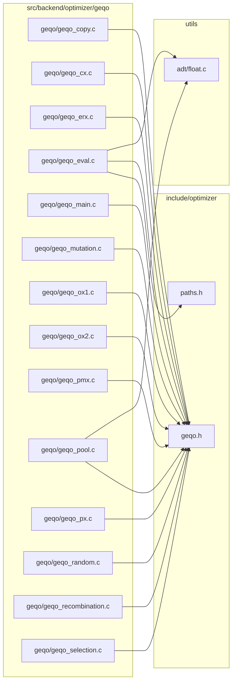

# `optimizer` — file-level dependencies

Arrows point from the file that does the `#include` to the file
it needs.  Ubiquitous modules (see [README](README.md)) are
omitted.  Node names are relative to the subsystem directory;
external nodes are grouped by their subsystem.

## Internal structure

```mermaid
graph LR
    subgraph "geqo"
        src_backend_optimizer_geqo_geqo_copy_c["geqo/geqo_copy.c"]
        src_backend_optimizer_geqo_geqo_cx_c["geqo/geqo_cx.c"]
        src_backend_optimizer_geqo_geqo_erx_c["geqo/geqo_erx.c"]
        src_backend_optimizer_geqo_geqo_eval_c["geqo/geqo_eval.c"]
        src_backend_optimizer_geqo_geqo_main_c["geqo/geqo_main.c"]
        src_backend_optimizer_geqo_geqo_misc_c["geqo/geqo_misc.c"]
        src_backend_optimizer_geqo_geqo_mutation_c["geqo/geqo_mutation.c"]
        src_backend_optimizer_geqo_geqo_ox1_c["geqo/geqo_ox1.c"]
        src_backend_optimizer_geqo_geqo_ox2_c["geqo/geqo_ox2.c"]
        src_backend_optimizer_geqo_geqo_pmx_c["geqo/geqo_pmx.c"]
        src_backend_optimizer_geqo_geqo_pool_c["geqo/geqo_pool.c"]
        src_backend_optimizer_geqo_geqo_px_c["geqo/geqo_px.c"]
        src_backend_optimizer_geqo_geqo_random_c["geqo/geqo_random.c"]
        src_backend_optimizer_geqo_geqo_recombination_c["geqo/geqo_recombination.c"]
        src_backend_optimizer_geqo_geqo_selection_c["geqo/geqo_selection.c"]
    end
    subgraph "path"
        src_backend_optimizer_path_allpaths_c["path/allpaths.c"]
        src_backend_optimizer_path_clausesel_c["path/clausesel.c"]
        src_backend_optimizer_path_costsize_c["path/costsize.c"]
        src_backend_optimizer_path_equivclass_c["path/equivclass.c"]
        src_backend_optimizer_path_indxpath_c["path/indxpath.c"]
        src_backend_optimizer_path_joinpath_c["path/joinpath.c"]
        src_backend_optimizer_path_joinrels_c["path/joinrels.c"]
        src_backend_optimizer_path_pathkeys_c["path/pathkeys.c"]
        src_backend_optimizer_path_tidpath_c["path/tidpath.c"]
    end
    subgraph "plan"
        src_backend_optimizer_plan_analyzejoins_c["plan/analyzejoins.c"]
        src_backend_optimizer_plan_createplan_c["plan/createplan.c"]
        src_backend_optimizer_plan_initsplan_c["plan/initsplan.c"]
        src_backend_optimizer_plan_planagg_c["plan/planagg.c"]
        src_backend_optimizer_plan_planmain_c["plan/planmain.c"]
        src_backend_optimizer_plan_planner_c["plan/planner.c"]
        src_backend_optimizer_plan_setrefs_c["plan/setrefs.c"]
        src_backend_optimizer_plan_subselect_c["plan/subselect.c"]
    end
    subgraph "prep"
        src_backend_optimizer_prep_prepagg_c["prep/prepagg.c"]
        src_backend_optimizer_prep_prepjointree_c["prep/prepjointree.c"]
        src_backend_optimizer_prep_preptlist_c["prep/preptlist.c"]
        src_backend_optimizer_prep_prepunion_c["prep/prepunion.c"]
    end
    subgraph "util"
        src_backend_optimizer_util_appendinfo_c["util/appendinfo.c"]
        src_backend_optimizer_util_clauses_c["util/clauses.c"]
        src_backend_optimizer_util_inherit_c["util/inherit.c"]
        src_backend_optimizer_util_joininfo_c["util/joininfo.c"]
        src_backend_optimizer_util_orclauses_c["util/orclauses.c"]
        src_backend_optimizer_util_paramassign_c["util/paramassign.c"]
        src_backend_optimizer_util_pathnode_c["util/pathnode.c"]
        src_backend_optimizer_util_placeholder_c["util/placeholder.c"]
        src_backend_optimizer_util_plancat_c["util/plancat.c"]
        src_backend_optimizer_util_relnode_c["util/relnode.c"]
        src_backend_optimizer_util_restrictinfo_c["util/restrictinfo.c"]
        src_backend_optimizer_util_tlist_c["util/tlist.c"]
        src_backend_optimizer_util_var_c["util/var.c"]
    end
    src_backend_optimizer_geqo_geqo_cx_c --> src_backend_optimizer_geqo_geqo_random_c
    src_backend_optimizer_geqo_geqo_cx_c --> src_backend_optimizer_geqo_geqo_recombination_c
    src_backend_optimizer_geqo_geqo_erx_c --> src_backend_optimizer_geqo_geqo_random_c
    src_backend_optimizer_geqo_geqo_erx_c --> src_backend_optimizer_geqo_geqo_recombination_c
    src_backend_optimizer_geqo_geqo_eval_c --> src_backend_optimizer_util_joininfo_c
    src_backend_optimizer_geqo_geqo_eval_c --> src_backend_optimizer_util_pathnode_c
    src_backend_optimizer_geqo_geqo_main_c --> src_backend_optimizer_geqo_geqo_misc_c
    src_backend_optimizer_geqo_geqo_main_c --> src_backend_optimizer_geqo_geqo_mutation_c
    src_backend_optimizer_geqo_geqo_main_c --> src_backend_optimizer_geqo_geqo_pool_c
    src_backend_optimizer_geqo_geqo_main_c --> src_backend_optimizer_geqo_geqo_random_c
    src_backend_optimizer_geqo_geqo_main_c --> src_backend_optimizer_geqo_geqo_recombination_c
    src_backend_optimizer_geqo_geqo_main_c --> src_backend_optimizer_geqo_geqo_selection_c
    src_backend_optimizer_geqo_geqo_misc_c --> src_backend_optimizer_geqo_geqo_recombination_c
    src_backend_optimizer_geqo_geqo_mutation_c --> src_backend_optimizer_geqo_geqo_random_c
    src_backend_optimizer_geqo_geqo_ox1_c --> src_backend_optimizer_geqo_geqo_random_c
    src_backend_optimizer_geqo_geqo_ox1_c --> src_backend_optimizer_geqo_geqo_recombination_c
    src_backend_optimizer_geqo_geqo_ox2_c --> src_backend_optimizer_geqo_geqo_random_c
    src_backend_optimizer_geqo_geqo_ox2_c --> src_backend_optimizer_geqo_geqo_recombination_c
    src_backend_optimizer_geqo_geqo_pmx_c --> src_backend_optimizer_geqo_geqo_random_c
    src_backend_optimizer_geqo_geqo_pmx_c --> src_backend_optimizer_geqo_geqo_recombination_c
    src_backend_optimizer_geqo_geqo_pool_c --> src_backend_optimizer_geqo_geqo_copy_c
    src_backend_optimizer_geqo_geqo_pool_c --> src_backend_optimizer_geqo_geqo_recombination_c
    src_backend_optimizer_geqo_geqo_px_c --> src_backend_optimizer_geqo_geqo_random_c
    src_backend_optimizer_geqo_geqo_px_c --> src_backend_optimizer_geqo_geqo_recombination_c
    src_backend_optimizer_geqo_geqo_recombination_c --> src_backend_optimizer_geqo_geqo_random_c
    src_backend_optimizer_geqo_geqo_selection_c --> src_backend_optimizer_geqo_geqo_copy_c
    src_backend_optimizer_geqo_geqo_selection_c --> src_backend_optimizer_geqo_geqo_random_c
    src_backend_optimizer_path_allpaths_c --> src_backend_optimizer_plan_planner_c
    src_backend_optimizer_path_allpaths_c --> src_backend_optimizer_util_appendinfo_c
    src_backend_optimizer_path_allpaths_c --> src_backend_optimizer_util_clauses_c
    src_backend_optimizer_path_allpaths_c --> src_backend_optimizer_util_pathnode_c
    src_backend_optimizer_path_allpaths_c --> src_backend_optimizer_util_plancat_c
    src_backend_optimizer_path_allpaths_c --> src_backend_optimizer_util_tlist_c
    src_backend_optimizer_path_clausesel_c --> src_backend_optimizer_util_clauses_c
    src_backend_optimizer_path_clausesel_c --> src_backend_optimizer_util_pathnode_c
    src_backend_optimizer_path_clausesel_c --> src_backend_optimizer_util_plancat_c
    src_backend_optimizer_path_costsize_c --> src_backend_optimizer_util_clauses_c
    src_backend_optimizer_path_costsize_c --> src_backend_optimizer_util_pathnode_c
    src_backend_optimizer_path_costsize_c --> src_backend_optimizer_util_placeholder_c
    src_backend_optimizer_path_costsize_c --> src_backend_optimizer_util_plancat_c
    src_backend_optimizer_path_costsize_c --> src_backend_optimizer_util_restrictinfo_c
    src_backend_optimizer_path_equivclass_c --> src_backend_optimizer_plan_planmain_c
    src_backend_optimizer_path_equivclass_c --> src_backend_optimizer_util_appendinfo_c
    src_backend_optimizer_path_equivclass_c --> src_backend_optimizer_util_clauses_c
    src_backend_optimizer_path_equivclass_c --> src_backend_optimizer_util_pathnode_c
    src_backend_optimizer_path_equivclass_c --> src_backend_optimizer_util_restrictinfo_c
    src_backend_optimizer_path_indxpath_c --> src_backend_optimizer_util_pathnode_c
    src_backend_optimizer_path_indxpath_c --> src_backend_optimizer_util_placeholder_c
    src_backend_optimizer_path_indxpath_c --> src_backend_optimizer_util_restrictinfo_c
    src_backend_optimizer_path_joinpath_c --> src_backend_optimizer_plan_planmain_c
    src_backend_optimizer_path_joinpath_c --> src_backend_optimizer_util_pathnode_c
    src_backend_optimizer_path_joinpath_c --> src_backend_optimizer_util_placeholder_c
    src_backend_optimizer_path_joinpath_c --> src_backend_optimizer_util_restrictinfo_c
    src_backend_optimizer_path_joinrels_c --> src_backend_optimizer_plan_planner_c
    src_backend_optimizer_path_joinrels_c --> src_backend_optimizer_util_appendinfo_c
    src_backend_optimizer_path_joinrels_c --> src_backend_optimizer_util_joininfo_c
    src_backend_optimizer_path_joinrels_c --> src_backend_optimizer_util_pathnode_c
    src_backend_optimizer_path_pathkeys_c --> src_backend_optimizer_util_pathnode_c
    src_backend_optimizer_path_tidpath_c --> src_backend_optimizer_util_pathnode_c
    src_backend_optimizer_path_tidpath_c --> src_backend_optimizer_util_restrictinfo_c
    src_backend_optimizer_plan_analyzejoins_c --> src_backend_optimizer_plan_planmain_c
    src_backend_optimizer_plan_analyzejoins_c --> src_backend_optimizer_util_joininfo_c
    src_backend_optimizer_plan_analyzejoins_c --> src_backend_optimizer_util_pathnode_c
    src_backend_optimizer_plan_analyzejoins_c --> src_backend_optimizer_util_placeholder_c
    src_backend_optimizer_plan_analyzejoins_c --> src_backend_optimizer_util_restrictinfo_c
    src_backend_optimizer_plan_createplan_c --> src_backend_optimizer_plan_planmain_c
    src_backend_optimizer_plan_createplan_c --> src_backend_optimizer_plan_subselect_c
    src_backend_optimizer_plan_createplan_c --> src_backend_optimizer_util_clauses_c
    src_backend_optimizer_plan_createplan_c --> src_backend_optimizer_util_paramassign_c
    src_backend_optimizer_plan_createplan_c --> src_backend_optimizer_util_pathnode_c
    src_backend_optimizer_plan_createplan_c --> src_backend_optimizer_util_placeholder_c
    src_backend_optimizer_plan_createplan_c --> src_backend_optimizer_util_plancat_c
    src_backend_optimizer_plan_createplan_c --> src_backend_optimizer_util_restrictinfo_c
    src_backend_optimizer_plan_createplan_c --> src_backend_optimizer_util_tlist_c
    src_backend_optimizer_plan_initsplan_c --> src_backend_optimizer_plan_planmain_c
    src_backend_optimizer_plan_initsplan_c --> src_backend_optimizer_plan_planner_c
    src_backend_optimizer_plan_initsplan_c --> src_backend_optimizer_util_clauses_c
    src_backend_optimizer_plan_initsplan_c --> src_backend_optimizer_util_inherit_c
    src_backend_optimizer_plan_initsplan_c --> src_backend_optimizer_util_joininfo_c
    src_backend_optimizer_plan_initsplan_c --> src_backend_optimizer_util_pathnode_c
    src_backend_optimizer_plan_initsplan_c --> src_backend_optimizer_util_placeholder_c
    src_backend_optimizer_plan_initsplan_c --> src_backend_optimizer_util_restrictinfo_c
    src_backend_optimizer_plan_planagg_c --> src_backend_optimizer_plan_planmain_c
    src_backend_optimizer_plan_planagg_c --> src_backend_optimizer_plan_planner_c
    src_backend_optimizer_plan_planagg_c --> src_backend_optimizer_plan_subselect_c
    src_backend_optimizer_plan_planagg_c --> src_backend_optimizer_util_pathnode_c
    src_backend_optimizer_plan_planagg_c --> src_backend_optimizer_util_tlist_c
    src_backend_optimizer_plan_planmain_c --> src_backend_optimizer_util_appendinfo_c
    src_backend_optimizer_plan_planmain_c --> src_backend_optimizer_util_clauses_c
    src_backend_optimizer_plan_planmain_c --> src_backend_optimizer_util_orclauses_c
    src_backend_optimizer_plan_planmain_c --> src_backend_optimizer_util_pathnode_c
    src_backend_optimizer_plan_planmain_c --> src_backend_optimizer_util_placeholder_c
    src_backend_optimizer_plan_planner_c --> src_backend_optimizer_plan_planmain_c
    src_backend_optimizer_plan_planner_c --> src_backend_optimizer_plan_subselect_c
    src_backend_optimizer_plan_planner_c --> src_backend_optimizer_util_appendinfo_c
    src_backend_optimizer_plan_planner_c --> src_backend_optimizer_util_clauses_c
    src_backend_optimizer_plan_planner_c --> src_backend_optimizer_util_paramassign_c
    src_backend_optimizer_plan_planner_c --> src_backend_optimizer_util_pathnode_c
    src_backend_optimizer_plan_planner_c --> src_backend_optimizer_util_plancat_c
    src_backend_optimizer_plan_planner_c --> src_backend_optimizer_util_tlist_c
    src_backend_optimizer_plan_setrefs_c --> src_backend_optimizer_plan_planmain_c
    src_backend_optimizer_plan_setrefs_c --> src_backend_optimizer_plan_planner_c
    src_backend_optimizer_plan_setrefs_c --> src_backend_optimizer_plan_subselect_c
    src_backend_optimizer_plan_setrefs_c --> src_backend_optimizer_util_pathnode_c
    src_backend_optimizer_plan_setrefs_c --> src_backend_optimizer_util_tlist_c
    src_backend_optimizer_plan_subselect_c --> src_backend_optimizer_plan_planmain_c
    src_backend_optimizer_plan_subselect_c --> src_backend_optimizer_plan_planner_c
    src_backend_optimizer_plan_subselect_c --> src_backend_optimizer_util_clauses_c
    src_backend_optimizer_plan_subselect_c --> src_backend_optimizer_util_paramassign_c
    src_backend_optimizer_plan_subselect_c --> src_backend_optimizer_util_pathnode_c
    src_backend_optimizer_prep_prepagg_c --> src_backend_optimizer_util_plancat_c
    src_backend_optimizer_prep_prepjointree_c --> src_backend_optimizer_plan_subselect_c
    src_backend_optimizer_prep_prepjointree_c --> src_backend_optimizer_util_clauses_c
    src_backend_optimizer_prep_prepjointree_c --> src_backend_optimizer_util_placeholder_c
    src_backend_optimizer_prep_prepjointree_c --> src_backend_optimizer_util_plancat_c
    src_backend_optimizer_prep_prepjointree_c --> src_backend_optimizer_util_tlist_c
    src_backend_optimizer_prep_preptlist_c --> src_backend_optimizer_util_appendinfo_c
    src_backend_optimizer_prep_preptlist_c --> src_backend_optimizer_util_tlist_c
    src_backend_optimizer_prep_prepunion_c --> src_backend_optimizer_plan_planner_c
    src_backend_optimizer_prep_prepunion_c --> src_backend_optimizer_util_pathnode_c
    src_backend_optimizer_prep_prepunion_c --> src_backend_optimizer_util_tlist_c
    src_backend_optimizer_util_appendinfo_c --> src_backend_optimizer_plan_planmain_c
    src_backend_optimizer_util_appendinfo_c --> src_backend_optimizer_util_pathnode_c
    src_backend_optimizer_util_clauses_c --> src_backend_optimizer_plan_planmain_c
    src_backend_optimizer_util_clauses_c --> src_backend_optimizer_util_pathnode_c
    src_backend_optimizer_util_clauses_c --> src_backend_optimizer_util_plancat_c
    src_backend_optimizer_util_inherit_c --> src_backend_optimizer_plan_planmain_c
    src_backend_optimizer_util_inherit_c --> src_backend_optimizer_plan_planner_c
    src_backend_optimizer_util_inherit_c --> src_backend_optimizer_util_appendinfo_c
    src_backend_optimizer_util_inherit_c --> src_backend_optimizer_util_pathnode_c
    src_backend_optimizer_util_inherit_c --> src_backend_optimizer_util_plancat_c
    src_backend_optimizer_util_inherit_c --> src_backend_optimizer_util_restrictinfo_c
    src_backend_optimizer_util_joininfo_c --> src_backend_optimizer_plan_planmain_c
    src_backend_optimizer_util_joininfo_c --> src_backend_optimizer_util_pathnode_c
    src_backend_optimizer_util_joininfo_c --> src_backend_optimizer_util_restrictinfo_c
    src_backend_optimizer_util_orclauses_c --> src_backend_optimizer_util_restrictinfo_c
    src_backend_optimizer_util_paramassign_c --> src_backend_optimizer_util_placeholder_c
    src_backend_optimizer_util_pathnode_c --> src_backend_optimizer_plan_planmain_c
    src_backend_optimizer_util_pathnode_c --> src_backend_optimizer_util_appendinfo_c
    src_backend_optimizer_util_pathnode_c --> src_backend_optimizer_util_clauses_c
    src_backend_optimizer_util_pathnode_c --> src_backend_optimizer_util_tlist_c
    src_backend_optimizer_util_placeholder_c --> src_backend_optimizer_plan_planmain_c
    src_backend_optimizer_util_placeholder_c --> src_backend_optimizer_util_pathnode_c
    src_backend_optimizer_util_relnode_c --> src_backend_optimizer_plan_planner_c
    src_backend_optimizer_util_relnode_c --> src_backend_optimizer_util_appendinfo_c
    src_backend_optimizer_util_relnode_c --> src_backend_optimizer_util_clauses_c
    src_backend_optimizer_util_relnode_c --> src_backend_optimizer_util_inherit_c
    src_backend_optimizer_util_relnode_c --> src_backend_optimizer_util_pathnode_c
    src_backend_optimizer_util_relnode_c --> src_backend_optimizer_util_placeholder_c
    src_backend_optimizer_util_relnode_c --> src_backend_optimizer_util_plancat_c
    src_backend_optimizer_util_relnode_c --> src_backend_optimizer_util_restrictinfo_c
    src_backend_optimizer_util_relnode_c --> src_backend_optimizer_util_tlist_c
    src_backend_optimizer_util_restrictinfo_c --> src_backend_optimizer_util_clauses_c
    src_backend_optimizer_util_var_c --> src_backend_optimizer_util_clauses_c
    src_backend_optimizer_util_var_c --> src_backend_optimizer_util_placeholder_c
```

## External dependencies

### `src/backend/optimizer/geqo`



### `src/backend/optimizer/path`

```mermaid
graph LR
    subgraph "access"
        src_backend_access_index_amapi_c["index/amapi.c"]
        src_backend_access_transam_transam_c["transam/transam.c"]
    end
    subgraph "catalog"
        src_backend_catalog_pg_class_c["pg_class.c"]
        src_backend_catalog_pg_operator_c["pg_operator.c"]
        src_backend_catalog_pg_proc_c["pg_proc.c"]
    end
    subgraph "common"
        src_common_hashfn_c["hashfn.c"]
    end
    subgraph "executor"
        src_backend_executor_nodeAgg_c["nodeAgg.c"]
        src_backend_executor_nodeHash_c["nodeHash.c"]
        src_backend_executor_nodeMemoize_c["nodeMemoize.c"]
    end
    subgraph "include/access"
        src_include_access_stratnum_h["stratnum.h"]
        src_include_access_sysattr_h["sysattr.h"]
        src_include_access_tsmapi_h["tsmapi.h"]
    end
    subgraph "include/catalog"
        src_include_catalog_pg_am_h["pg_am.h"]
        src_include_catalog_pg_amop_h["pg_amop.h"]
        src_include_catalog_pg_opfamily_h["pg_opfamily.h"]
    end
    subgraph "include/executor"
        src_include_executor_executor_h["executor.h"]
    end
    subgraph "include/foreign"
        src_include_foreign_fdwapi_h["fdwapi.h"]
    end
    subgraph "include/lib"
        src_include_lib_simplehash_h["simplehash.h"]
    end
    subgraph "include/nodes"
        src_include_nodes_supportnodes_h["supportnodes.h"]
    end
    subgraph "include/optimizer"
        src_include_optimizer_cost_h["cost.h"]
        src_include_optimizer_geqo_h["geqo.h"]
        src_include_optimizer_optimizer_h["optimizer.h"]
        src_include_optimizer_paths_h["paths.h"]
        src_include_optimizer_prep_h["prep.h"]
    end
    subgraph "include/parser"
        src_include_parser_parsetree_h["parsetree.h"]
    end
    subgraph "include/statistics"
        src_include_statistics_statistics_h["statistics.h"]
    end
    subgraph "nodes"
        src_backend_nodes_makefuncs_c["makefuncs.c"]
        src_backend_nodes_nodeFuncs_c["nodeFuncs.c"]
        src_backend_nodes_print_c["print.c"]
        src_backend_nodes_tidbitmap_c["tidbitmap.c"]
    end
    subgraph "parser"
        src_backend_parser_parse_clause_c["parse_clause.c"]
    end
    subgraph "partitioning"
        src_backend_partitioning_partbounds_c["partbounds.c"]
    end
    subgraph "port"
        src_port_pg_bitutils_c["pg_bitutils.c"]
    end
    subgraph "rewrite"
        src_backend_rewrite_rewriteManip_c["rewriteManip.c"]
    end
    subgraph "src/backend/optimizer/path"
        src_backend_optimizer_path_allpaths_c["path/allpaths.c"]
        src_backend_optimizer_path_clausesel_c["path/clausesel.c"]
        src_backend_optimizer_path_costsize_c["path/costsize.c"]
        src_backend_optimizer_path_equivclass_c["path/equivclass.c"]
        src_backend_optimizer_path_indxpath_c["path/indxpath.c"]
        src_backend_optimizer_path_joinpath_c["path/joinpath.c"]
        src_backend_optimizer_path_joinrels_c["path/joinrels.c"]
        src_backend_optimizer_path_pathkeys_c["path/pathkeys.c"]
        src_backend_optimizer_path_tidpath_c["path/tidpath.c"]
    end
    subgraph "utils"
        src_backend_utils_adt_selfuncs_c["adt/selfuncs.c"]
        src_backend_utils_cache_spccache_c["cache/spccache.c"]
        src_backend_utils_cache_typcache_c["cache/typcache.c"]
        src_backend_utils_sort_tuplesort_c["sort/tuplesort.c"]
    end
    src_backend_optimizer_path_allpaths_c --> src_backend_catalog_pg_class_c
    src_backend_optimizer_path_allpaths_c --> src_backend_catalog_pg_operator_c
    src_backend_optimizer_path_allpaths_c --> src_backend_catalog_pg_proc_c
    src_backend_optimizer_path_allpaths_c --> src_backend_nodes_makefuncs_c
    src_backend_optimizer_path_allpaths_c --> src_backend_nodes_nodeFuncs_c
    src_backend_optimizer_path_allpaths_c --> src_backend_nodes_print_c
    src_backend_optimizer_path_allpaths_c --> src_backend_parser_parse_clause_c
    src_backend_optimizer_path_allpaths_c --> src_backend_partitioning_partbounds_c
    src_backend_optimizer_path_allpaths_c --> src_backend_rewrite_rewriteManip_c
    src_backend_optimizer_path_allpaths_c --> src_backend_utils_adt_selfuncs_c
    src_backend_optimizer_path_allpaths_c --> src_include_access_sysattr_h
    src_backend_optimizer_path_allpaths_c --> src_include_access_tsmapi_h
    src_backend_optimizer_path_allpaths_c --> src_include_foreign_fdwapi_h
    src_backend_optimizer_path_allpaths_c --> src_include_nodes_supportnodes_h
    src_backend_optimizer_path_allpaths_c --> src_include_optimizer_cost_h
    src_backend_optimizer_path_allpaths_c --> src_include_optimizer_geqo_h
    src_backend_optimizer_path_allpaths_c --> src_include_optimizer_optimizer_h
    src_backend_optimizer_path_allpaths_c --> src_include_optimizer_paths_h
    src_backend_optimizer_path_allpaths_c --> src_include_optimizer_prep_h
    src_backend_optimizer_path_allpaths_c --> src_include_parser_parsetree_h
    src_backend_optimizer_path_allpaths_c --> src_port_pg_bitutils_c
    src_backend_optimizer_path_clausesel_c --> src_backend_nodes_nodeFuncs_c
    src_backend_optimizer_path_clausesel_c --> src_backend_utils_adt_selfuncs_c
    src_backend_optimizer_path_clausesel_c --> src_include_optimizer_optimizer_h
    src_backend_optimizer_path_clausesel_c --> src_include_statistics_statistics_h
    src_backend_optimizer_path_costsize_c --> src_backend_access_index_amapi_c
    src_backend_optimizer_path_costsize_c --> src_backend_executor_nodeAgg_c
    src_backend_optimizer_path_costsize_c --> src_backend_executor_nodeHash_c
    src_backend_optimizer_path_costsize_c --> src_backend_executor_nodeMemoize_c
    src_backend_optimizer_path_costsize_c --> src_backend_nodes_makefuncs_c
    src_backend_optimizer_path_costsize_c --> src_backend_nodes_nodeFuncs_c
    src_backend_optimizer_path_costsize_c --> src_backend_nodes_tidbitmap_c
    src_backend_optimizer_path_costsize_c --> src_backend_utils_adt_selfuncs_c
    src_backend_optimizer_path_costsize_c --> src_backend_utils_cache_spccache_c
    src_backend_optimizer_path_costsize_c --> src_backend_utils_sort_tuplesort_c
    src_backend_optimizer_path_costsize_c --> src_include_access_tsmapi_h
    src_backend_optimizer_path_costsize_c --> src_include_executor_executor_h
    src_backend_optimizer_path_costsize_c --> src_include_optimizer_cost_h
    src_backend_optimizer_path_costsize_c --> src_include_optimizer_optimizer_h
    src_backend_optimizer_path_costsize_c --> src_include_optimizer_paths_h
    src_backend_optimizer_path_costsize_c --> src_include_parser_parsetree_h
    src_backend_optimizer_path_equivclass_c --> src_backend_nodes_makefuncs_c
    src_backend_optimizer_path_equivclass_c --> src_backend_nodes_nodeFuncs_c
    src_backend_optimizer_path_equivclass_c --> src_backend_rewrite_rewriteManip_c
    src_backend_optimizer_path_equivclass_c --> src_common_hashfn_c
    src_backend_optimizer_path_equivclass_c --> src_include_access_stratnum_h
    src_backend_optimizer_path_equivclass_c --> src_include_lib_simplehash_h
    src_backend_optimizer_path_equivclass_c --> src_include_optimizer_optimizer_h
    src_backend_optimizer_path_equivclass_c --> src_include_optimizer_paths_h
    src_backend_optimizer_path_indxpath_c --> src_backend_access_transam_transam_c
    src_backend_optimizer_path_indxpath_c --> src_backend_catalog_pg_operator_c
    src_backend_optimizer_path_indxpath_c --> src_backend_nodes_makefuncs_c
    src_backend_optimizer_path_indxpath_c --> src_backend_nodes_nodeFuncs_c
    src_backend_optimizer_path_indxpath_c --> src_backend_utils_adt_selfuncs_c
    src_backend_optimizer_path_indxpath_c --> src_include_access_stratnum_h
    src_backend_optimizer_path_indxpath_c --> src_include_access_sysattr_h
    src_backend_optimizer_path_indxpath_c --> src_include_catalog_pg_am_h
    src_backend_optimizer_path_indxpath_c --> src_include_catalog_pg_amop_h
    src_backend_optimizer_path_indxpath_c --> src_include_catalog_pg_opfamily_h
    src_backend_optimizer_path_indxpath_c --> src_include_nodes_supportnodes_h
    src_backend_optimizer_path_indxpath_c --> src_include_optimizer_cost_h
    src_backend_optimizer_path_indxpath_c --> src_include_optimizer_optimizer_h
    src_backend_optimizer_path_indxpath_c --> src_include_optimizer_paths_h
    src_backend_optimizer_path_indxpath_c --> src_include_optimizer_prep_h
    src_backend_optimizer_path_joinpath_c --> src_backend_nodes_nodeFuncs_c
    src_backend_optimizer_path_joinpath_c --> src_backend_utils_cache_typcache_c
    src_backend_optimizer_path_joinpath_c --> src_include_executor_executor_h
    src_backend_optimizer_path_joinpath_c --> src_include_foreign_fdwapi_h
    src_backend_optimizer_path_joinpath_c --> src_include_optimizer_cost_h
    src_backend_optimizer_path_joinpath_c --> src_include_optimizer_optimizer_h
    src_backend_optimizer_path_joinpath_c --> src_include_optimizer_paths_h
    src_backend_optimizer_path_joinrels_c --> src_backend_partitioning_partbounds_c
    src_backend_optimizer_path_joinrels_c --> src_include_optimizer_cost_h
    src_backend_optimizer_path_joinrels_c --> src_include_optimizer_paths_h
    src_backend_optimizer_path_pathkeys_c --> src_backend_nodes_nodeFuncs_c
    src_backend_optimizer_path_pathkeys_c --> src_backend_partitioning_partbounds_c
    src_backend_optimizer_path_pathkeys_c --> src_backend_rewrite_rewriteManip_c
    src_backend_optimizer_path_pathkeys_c --> src_include_access_stratnum_h
    src_backend_optimizer_path_pathkeys_c --> src_include_catalog_pg_opfamily_h
    src_backend_optimizer_path_pathkeys_c --> src_include_optimizer_cost_h
    src_backend_optimizer_path_pathkeys_c --> src_include_optimizer_optimizer_h
    src_backend_optimizer_path_pathkeys_c --> src_include_optimizer_paths_h
    src_backend_optimizer_path_tidpath_c --> src_backend_catalog_pg_operator_c
    src_backend_optimizer_path_tidpath_c --> src_backend_nodes_nodeFuncs_c
    src_backend_optimizer_path_tidpath_c --> src_include_access_sysattr_h
    src_backend_optimizer_path_tidpath_c --> src_include_optimizer_cost_h
    src_backend_optimizer_path_tidpath_c --> src_include_optimizer_optimizer_h
    src_backend_optimizer_path_tidpath_c --> src_include_optimizer_paths_h
```



### `src/backend/optimizer/plan`

```mermaid
graph LR
    subgraph "access"
        src_backend_access_index_genam_c["index/genam.c"]
        src_backend_access_nbtree_nbtree_c["nbtree/nbtree.c"]
        src_backend_access_table_table_c["table/table.c"]
        src_backend_access_transam_parallel_c["transam/parallel.c"]
        src_backend_access_transam_transam_c["transam/transam.c"]
    end
    subgraph "catalog"
        src_backend_catalog_pg_aggregate_c["pg_aggregate.c"]
        src_backend_catalog_pg_class_c["pg_class.c"]
        src_backend_catalog_pg_constraint_c["pg_constraint.c"]
        src_backend_catalog_pg_inherits_c["pg_inherits.c"]
        src_backend_catalog_pg_operator_c["pg_operator.c"]
        src_backend_catalog_pg_proc_c["pg_proc.c"]
    end
    subgraph "executor"
        src_backend_executor_nodeSubplan_c["nodeSubplan.c"]
    end
    subgraph "include/access"
        src_include_access_sysattr_h["sysattr.h"]
    end
    subgraph "include/executor"
        src_include_executor_executor_h["executor.h"]
    end
    subgraph "include/foreign"
        src_include_foreign_fdwapi_h["fdwapi.h"]
    end
    subgraph "include/nodes"
        src_include_nodes_pathnodes_h["pathnodes.h"]
        src_include_nodes_plannodes_h["plannodes.h"]
        src_include_nodes_supportnodes_h["supportnodes.h"]
    end
    subgraph "include/optimizer"
        src_include_optimizer_cost_h["cost.h"]
        src_include_optimizer_optimizer_h["optimizer.h"]
        src_include_optimizer_paths_h["paths.h"]
        src_include_optimizer_prep_h["prep.h"]
    end
    subgraph "include/parser"
        src_include_parser_parsetree_h["parsetree.h"]
    end
    subgraph "include/tcop"
        src_include_tcop_tcopprot_h["tcopprot.h"]
    end
    subgraph "jit"
        src_backend_jit_jit_c["jit.c"]
    end
    subgraph "lib"
        src_backend_lib_bipartite_match_c["bipartite_match.c"]
        src_backend_lib_knapsack_c["knapsack.c"]
    end
    subgraph "nodes"
        src_backend_nodes_extensible_c["extensible.c"]
        src_backend_nodes_makefuncs_c["makefuncs.c"]
        src_backend_nodes_nodeFuncs_c["nodeFuncs.c"]
        src_backend_nodes_print_c["print.c"]
    end
    subgraph "parser"
        src_backend_parser_analyze_c["analyze.c"]
        src_backend_parser_parse_agg_c["parse_agg.c"]
        src_backend_parser_parse_clause_c["parse_clause.c"]
        src_backend_parser_parse_relation_c["parse_relation.c"]
    end
    subgraph "partitioning"
        src_backend_partitioning_partdesc_c["partdesc.c"]
        src_backend_partitioning_partprune_c["partprune.c"]
    end
    subgraph "rewrite"
        src_backend_rewrite_rewriteManip_c["rewriteManip.c"]
    end
    subgraph "src/backend/optimizer/plan"
        src_backend_optimizer_plan_analyzejoins_c["plan/analyzejoins.c"]
        src_backend_optimizer_plan_createplan_c["plan/createplan.c"]
        src_backend_optimizer_plan_initsplan_c["plan/initsplan.c"]
        src_backend_optimizer_plan_planagg_c["plan/planagg.c"]
        src_backend_optimizer_plan_planmain_c["plan/planmain.c"]
        src_backend_optimizer_plan_planner_c["plan/planner.c"]
        src_backend_optimizer_plan_setrefs_c["plan/setrefs.c"]
        src_backend_optimizer_plan_subselect_c["plan/subselect.c"]
    end
    subgraph "tcop"
        src_backend_tcop_utility_c["utility.c"]
    end
    subgraph "utils"
        src_backend_utils_activity_backend_status_c["activity/backend_status.c"]
        src_backend_utils_adt_acl_c["adt/acl.c"]
        src_backend_utils_adt_selfuncs_c["adt/selfuncs.c"]
        src_backend_utils_cache_typcache_c["cache/typcache.c"]
    end
    src_backend_optimizer_plan_analyzejoins_c --> src_backend_catalog_pg_class_c
    src_backend_optimizer_plan_analyzejoins_c --> src_backend_nodes_nodeFuncs_c
    src_backend_optimizer_plan_analyzejoins_c --> src_backend_parser_parse_agg_c
    src_backend_optimizer_plan_analyzejoins_c --> src_backend_rewrite_rewriteManip_c
    src_backend_optimizer_plan_analyzejoins_c --> src_include_optimizer_optimizer_h
    src_backend_optimizer_plan_analyzejoins_c --> src_include_optimizer_paths_h
    src_backend_optimizer_plan_createplan_c --> src_backend_access_transam_transam_c
    src_backend_optimizer_plan_createplan_c --> src_backend_catalog_pg_class_c
    src_backend_optimizer_plan_createplan_c --> src_backend_nodes_extensible_c
    src_backend_optimizer_plan_createplan_c --> src_backend_nodes_makefuncs_c
    src_backend_optimizer_plan_createplan_c --> src_backend_nodes_nodeFuncs_c
    src_backend_optimizer_plan_createplan_c --> src_backend_parser_parse_clause_c
    src_backend_optimizer_plan_createplan_c --> src_backend_partitioning_partprune_c
    src_backend_optimizer_plan_createplan_c --> src_include_access_sysattr_h
    src_backend_optimizer_plan_createplan_c --> src_include_foreign_fdwapi_h
    src_backend_optimizer_plan_createplan_c --> src_include_optimizer_cost_h
    src_backend_optimizer_plan_createplan_c --> src_include_optimizer_optimizer_h
    src_backend_optimizer_plan_createplan_c --> src_include_optimizer_paths_h
    src_backend_optimizer_plan_createplan_c --> src_include_optimizer_prep_h
    src_backend_optimizer_plan_createplan_c --> src_include_parser_parsetree_h
    src_backend_optimizer_plan_createplan_c --> src_include_tcop_tcopprot_h
    src_backend_optimizer_plan_initsplan_c --> src_backend_access_nbtree_nbtree_c
    src_backend_optimizer_plan_initsplan_c --> src_backend_catalog_pg_constraint_c
    src_backend_optimizer_plan_initsplan_c --> src_backend_nodes_makefuncs_c
    src_backend_optimizer_plan_initsplan_c --> src_backend_nodes_nodeFuncs_c
    src_backend_optimizer_plan_initsplan_c --> src_backend_parser_analyze_c
    src_backend_optimizer_plan_initsplan_c --> src_backend_rewrite_rewriteManip_c
    src_backend_optimizer_plan_initsplan_c --> src_backend_utils_cache_typcache_c
    src_backend_optimizer_plan_initsplan_c --> src_include_access_sysattr_h
    src_backend_optimizer_plan_initsplan_c --> src_include_optimizer_cost_h
    src_backend_optimizer_plan_initsplan_c --> src_include_optimizer_optimizer_h
    src_backend_optimizer_plan_initsplan_c --> src_include_optimizer_paths_h
    src_backend_optimizer_plan_planagg_c --> src_backend_catalog_pg_aggregate_c
    src_backend_optimizer_plan_planagg_c --> src_backend_nodes_makefuncs_c
    src_backend_optimizer_plan_planagg_c --> src_backend_nodes_nodeFuncs_c
    src_backend_optimizer_plan_planagg_c --> src_backend_parser_parse_clause_c
    src_backend_optimizer_plan_planagg_c --> src_backend_rewrite_rewriteManip_c
    src_backend_optimizer_plan_planagg_c --> src_include_optimizer_cost_h
    src_backend_optimizer_plan_planagg_c --> src_include_optimizer_optimizer_h
    src_backend_optimizer_plan_planagg_c --> src_include_optimizer_paths_h
    src_backend_optimizer_plan_planagg_c --> src_include_parser_parsetree_h
    src_backend_optimizer_plan_planmain_c --> src_include_nodes_pathnodes_h
    src_backend_optimizer_plan_planmain_c --> src_include_nodes_plannodes_h
    src_backend_optimizer_plan_planmain_c --> src_include_optimizer_optimizer_h
    src_backend_optimizer_plan_planmain_c --> src_include_optimizer_paths_h
    src_backend_optimizer_plan_planner_c --> src_backend_access_index_genam_c
    src_backend_optimizer_plan_planner_c --> src_backend_access_table_table_c
    src_backend_optimizer_plan_planner_c --> src_backend_access_transam_parallel_c
    src_backend_optimizer_plan_planner_c --> src_backend_catalog_pg_aggregate_c
    src_backend_optimizer_plan_planner_c --> src_backend_catalog_pg_inherits_c
    src_backend_optimizer_plan_planner_c --> src_backend_catalog_pg_proc_c
    src_backend_optimizer_plan_planner_c --> src_backend_jit_jit_c
    src_backend_optimizer_plan_planner_c --> src_backend_lib_bipartite_match_c
    src_backend_optimizer_plan_planner_c --> src_backend_lib_knapsack_c
    src_backend_optimizer_plan_planner_c --> src_backend_nodes_makefuncs_c
    src_backend_optimizer_plan_planner_c --> src_backend_nodes_nodeFuncs_c
    src_backend_optimizer_plan_planner_c --> src_backend_nodes_print_c
    src_backend_optimizer_plan_planner_c --> src_backend_parser_analyze_c
    src_backend_optimizer_plan_planner_c --> src_backend_parser_parse_agg_c
    src_backend_optimizer_plan_planner_c --> src_backend_parser_parse_clause_c
    src_backend_optimizer_plan_planner_c --> src_backend_parser_parse_relation_c
    src_backend_optimizer_plan_planner_c --> src_backend_partitioning_partdesc_c
    src_backend_optimizer_plan_planner_c --> src_backend_rewrite_rewriteManip_c
    src_backend_optimizer_plan_planner_c --> src_backend_utils_activity_backend_status_c
    src_backend_optimizer_plan_planner_c --> src_backend_utils_adt_acl_c
    src_backend_optimizer_plan_planner_c --> src_backend_utils_adt_selfuncs_c
    src_backend_optimizer_plan_planner_c --> src_include_access_sysattr_h
    src_backend_optimizer_plan_planner_c --> src_include_executor_executor_h
    src_backend_optimizer_plan_planner_c --> src_include_foreign_fdwapi_h
    src_backend_optimizer_plan_planner_c --> src_include_nodes_pathnodes_h
    src_backend_optimizer_plan_planner_c --> src_include_nodes_plannodes_h
    src_backend_optimizer_plan_planner_c --> src_include_nodes_supportnodes_h
    src_backend_optimizer_plan_planner_c --> src_include_optimizer_cost_h
    src_backend_optimizer_plan_planner_c --> src_include_optimizer_optimizer_h
    src_backend_optimizer_plan_planner_c --> src_include_optimizer_paths_h
    src_backend_optimizer_plan_planner_c --> src_include_optimizer_prep_h
    src_backend_optimizer_plan_planner_c --> src_include_parser_parsetree_h
    src_backend_optimizer_plan_setrefs_c --> src_backend_access_transam_transam_c
    src_backend_optimizer_plan_setrefs_c --> src_backend_nodes_makefuncs_c
    src_backend_optimizer_plan_setrefs_c --> src_backend_nodes_nodeFuncs_c
    src_backend_optimizer_plan_setrefs_c --> src_backend_parser_parse_relation_c
    src_backend_optimizer_plan_setrefs_c --> src_backend_rewrite_rewriteManip_c
    src_backend_optimizer_plan_setrefs_c --> src_backend_tcop_utility_c
    src_backend_optimizer_plan_setrefs_c --> src_include_optimizer_optimizer_h
    src_backend_optimizer_plan_subselect_c --> src_backend_catalog_pg_operator_c
    src_backend_optimizer_plan_subselect_c --> src_backend_executor_nodeSubplan_c
    src_backend_optimizer_plan_subselect_c --> src_backend_nodes_makefuncs_c
    src_backend_optimizer_plan_subselect_c --> src_backend_nodes_nodeFuncs_c
    src_backend_optimizer_plan_subselect_c --> src_backend_parser_parse_relation_c
    src_backend_optimizer_plan_subselect_c --> src_backend_rewrite_rewriteManip_c
    src_backend_optimizer_plan_subselect_c --> src_include_executor_executor_h
    src_backend_optimizer_plan_subselect_c --> src_include_nodes_pathnodes_h
    src_backend_optimizer_plan_subselect_c --> src_include_nodes_plannodes_h
    src_backend_optimizer_plan_subselect_c --> src_include_optimizer_cost_h
    src_backend_optimizer_plan_subselect_c --> src_include_optimizer_optimizer_h
    src_backend_optimizer_plan_subselect_c --> src_include_optimizer_prep_h
```



### `src/backend/optimizer/prep`

```mermaid
graph LR
    subgraph "access"
        src_backend_access_table_table_c["table/table.c"]
    end
    subgraph "catalog"
        src_backend_catalog_pg_aggregate_c["pg_aggregate.c"]
    end
    subgraph "include/access"
        src_include_access_sysattr_h["sysattr.h"]
    end
    subgraph "include/nodes"
        src_include_nodes_pathnodes_h["pathnodes.h"]
    end
    subgraph "include/optimizer"
        src_include_optimizer_cost_h["cost.h"]
        src_include_optimizer_optimizer_h["optimizer.h"]
        src_include_optimizer_paths_h["paths.h"]
        src_include_optimizer_prep_h["prep.h"]
    end
    subgraph "include/parser"
        src_include_parser_parsetree_h["parsetree.h"]
    end
    subgraph "nodes"
        src_backend_nodes_makefuncs_c["makefuncs.c"]
        src_backend_nodes_multibitmapset_c["multibitmapset.c"]
        src_backend_nodes_nodeFuncs_c["nodeFuncs.c"]
    end
    subgraph "parser"
        src_backend_parser_parse_agg_c["parse_agg.c"]
        src_backend_parser_parse_coerce_c["parse_coerce.c"]
        src_backend_parser_parse_relation_c["parse_relation.c"]
    end
    subgraph "port"
        src_port_pg_bitutils_c["pg_bitutils.c"]
    end
    subgraph "rewrite"
        src_backend_rewrite_rewriteHandler_c["rewriteHandler.c"]
        src_backend_rewrite_rewriteManip_c["rewriteManip.c"]
    end
    subgraph "src/backend/optimizer/prep"
        src_backend_optimizer_prep_prepagg_c["prep/prepagg.c"]
        src_backend_optimizer_prep_prepjointree_c["prep/prepjointree.c"]
        src_backend_optimizer_prep_prepqual_c["prep/prepqual.c"]
        src_backend_optimizer_prep_preptlist_c["prep/preptlist.c"]
        src_backend_optimizer_prep_prepunion_c["prep/prepunion.c"]
    end
    subgraph "utils"
        src_backend_utils_adt_datum_c["adt/datum.c"]
        src_backend_utils_adt_selfuncs_c["adt/selfuncs.c"]
        src_backend_utils_fmgr_funcapi_c["fmgr/funcapi.c"]
    end
    src_backend_optimizer_prep_prepagg_c --> src_backend_catalog_pg_aggregate_c
    src_backend_optimizer_prep_prepagg_c --> src_backend_nodes_nodeFuncs_c
    src_backend_optimizer_prep_prepagg_c --> src_backend_parser_parse_agg_c
    src_backend_optimizer_prep_prepagg_c --> src_backend_utils_adt_datum_c
    src_backend_optimizer_prep_prepagg_c --> src_include_nodes_pathnodes_h
    src_backend_optimizer_prep_prepagg_c --> src_include_optimizer_cost_h
    src_backend_optimizer_prep_prepagg_c --> src_include_optimizer_optimizer_h
    src_backend_optimizer_prep_prepagg_c --> src_include_optimizer_prep_h
    src_backend_optimizer_prep_prepjointree_c --> src_backend_access_table_table_c
    src_backend_optimizer_prep_prepjointree_c --> src_backend_nodes_makefuncs_c
    src_backend_optimizer_prep_prepjointree_c --> src_backend_nodes_multibitmapset_c
    src_backend_optimizer_prep_prepjointree_c --> src_backend_nodes_nodeFuncs_c
    src_backend_optimizer_prep_prepjointree_c --> src_backend_parser_parse_relation_c
    src_backend_optimizer_prep_prepjointree_c --> src_backend_rewrite_rewriteHandler_c
    src_backend_optimizer_prep_prepjointree_c --> src_backend_rewrite_rewriteManip_c
    src_backend_optimizer_prep_prepjointree_c --> src_backend_utils_fmgr_funcapi_c
    src_backend_optimizer_prep_prepjointree_c --> src_include_optimizer_optimizer_h
    src_backend_optimizer_prep_prepjointree_c --> src_include_optimizer_prep_h
    src_backend_optimizer_prep_prepjointree_c --> src_include_parser_parsetree_h
    src_backend_optimizer_prep_prepqual_c --> src_backend_nodes_makefuncs_c
    src_backend_optimizer_prep_prepqual_c --> src_backend_nodes_nodeFuncs_c
    src_backend_optimizer_prep_prepqual_c --> src_include_optimizer_optimizer_h
    src_backend_optimizer_prep_preptlist_c --> src_backend_access_table_table_c
    src_backend_optimizer_prep_preptlist_c --> src_backend_nodes_makefuncs_c
    src_backend_optimizer_prep_preptlist_c --> src_backend_parser_parse_coerce_c
    src_backend_optimizer_prep_preptlist_c --> src_include_access_sysattr_h
    src_backend_optimizer_prep_preptlist_c --> src_include_optimizer_optimizer_h
    src_backend_optimizer_prep_preptlist_c --> src_include_optimizer_prep_h
    src_backend_optimizer_prep_preptlist_c --> src_include_parser_parsetree_h
    src_backend_optimizer_prep_prepunion_c --> src_backend_nodes_makefuncs_c
    src_backend_optimizer_prep_prepunion_c --> src_backend_nodes_nodeFuncs_c
    src_backend_optimizer_prep_prepunion_c --> src_backend_parser_parse_coerce_c
    src_backend_optimizer_prep_prepunion_c --> src_backend_utils_adt_selfuncs_c
    src_backend_optimizer_prep_prepunion_c --> src_include_optimizer_cost_h
    src_backend_optimizer_prep_prepunion_c --> src_include_optimizer_paths_h
    src_backend_optimizer_prep_prepunion_c --> src_include_optimizer_prep_h
    src_backend_optimizer_prep_prepunion_c --> src_port_pg_bitutils_c
```



### `src/backend/optimizer/util`

```mermaid
graph LR
    subgraph "access"
        src_backend_access_index_genam_c["index/genam.c"]
        src_backend_access_nbtree_nbtree_c["nbtree/nbtree.c"]
        src_backend_access_table_table_c["table/table.c"]
        src_backend_access_table_tableam_c["table/tableam.c"]
        src_backend_access_transam_transam_c["transam/transam.c"]
        src_backend_access_transam_xlog_c["transam/xlog.c"]
    end
    subgraph "catalog"
        src_backend_catalog_catalog_c["catalog.c"]
        src_backend_catalog_heap_c["heap.c"]
        src_backend_catalog_partition_c["partition.c"]
        src_backend_catalog_pg_class_c["pg_class.c"]
        src_backend_catalog_pg_constraint_c["pg_constraint.c"]
        src_backend_catalog_pg_inherits_c["pg_inherits.c"]
        src_backend_catalog_pg_operator_c["pg_operator.c"]
        src_backend_catalog_pg_proc_c["pg_proc.c"]
    end
    subgraph "executor"
        src_backend_executor_functions_c["functions.c"]
        src_backend_executor_nodeSetOp_c["nodeSetOp.c"]
    end
    subgraph "include/access"
        src_include_access_sysattr_h["sysattr.h"]
    end
    subgraph "include/catalog"
        src_include_catalog_pg_am_h["pg_am.h"]
        src_include_catalog_pg_language_h["pg_language.h"]
        src_include_catalog_pg_statistic_ext_h["pg_statistic_ext.h"]
        src_include_catalog_pg_statistic_ext_data_h["pg_statistic_ext_data.h"]
    end
    subgraph "include/executor"
        src_include_executor_executor_h["executor.h"]
    end
    subgraph "include/foreign"
        src_include_foreign_fdwapi_h["fdwapi.h"]
    end
    subgraph "include/nodes"
        src_include_nodes_pathnodes_h["pathnodes.h"]
        src_include_nodes_plannodes_h["plannodes.h"]
        src_include_nodes_subscripting_h["subscripting.h"]
        src_include_nodes_supportnodes_h["supportnodes.h"]
    end
    subgraph "include/optimizer"
        src_include_optimizer_cost_h["cost.h"]
        src_include_optimizer_optimizer_h["optimizer.h"]
        src_include_optimizer_paths_h["paths.h"]
        src_include_optimizer_prep_h["prep.h"]
    end
    subgraph "include/parser"
        src_include_parser_parsetree_h["parsetree.h"]
    end
    subgraph "include/statistics"
        src_include_statistics_statistics_h["statistics.h"]
    end
    subgraph "include/tcop"
        src_include_tcop_tcopprot_h["tcopprot.h"]
    end
    subgraph "include/utils"
        src_include_utils_array_h["array.h"]
        src_include_utils_hsearch_h["hsearch.h"]
    end
    subgraph "nodes"
        src_backend_nodes_bitmapset_c["bitmapset.c"]
        src_backend_nodes_extensible_c["extensible.c"]
        src_backend_nodes_makefuncs_c["makefuncs.c"]
        src_backend_nodes_multibitmapset_c["multibitmapset.c"]
        src_backend_nodes_nodeFuncs_c["nodeFuncs.c"]
    end
    subgraph "parser"
        src_backend_parser_analyze_c["analyze.c"]
        src_backend_parser_parse_coerce_c["parse_coerce.c"]
        src_backend_parser_parse_collate_c["parse_collate.c"]
        src_backend_parser_parse_func_c["parse_func.c"]
        src_backend_parser_parse_oper_c["parse_oper.c"]
        src_backend_parser_parse_relation_c["parse_relation.c"]
    end
    subgraph "partitioning"
        src_backend_partitioning_partdesc_c["partdesc.c"]
        src_backend_partitioning_partprune_c["partprune.c"]
    end
    subgraph "port"
        src_port_pg_bitutils_c["pg_bitutils.c"]
    end
    subgraph "rewrite"
        src_backend_rewrite_rewriteHandler_c["rewriteHandler.c"]
        src_backend_rewrite_rewriteManip_c["rewriteManip.c"]
    end
    subgraph "src/backend/optimizer/util"
        src_backend_optimizer_util_appendinfo_c["util/appendinfo.c"]
        src_backend_optimizer_util_clauses_c["util/clauses.c"]
        src_backend_optimizer_util_extendplan_c["util/extendplan.c"]
        src_backend_optimizer_util_inherit_c["util/inherit.c"]
        src_backend_optimizer_util_joininfo_c["util/joininfo.c"]
        src_backend_optimizer_util_orclauses_c["util/orclauses.c"]
        src_backend_optimizer_util_paramassign_c["util/paramassign.c"]
        src_backend_optimizer_util_pathnode_c["util/pathnode.c"]
        src_backend_optimizer_util_placeholder_c["util/placeholder.c"]
        src_backend_optimizer_util_plancat_c["util/plancat.c"]
        src_backend_optimizer_util_predtest_c["util/predtest.c"]
        src_backend_optimizer_util_relnode_c["util/relnode.c"]
        src_backend_optimizer_util_restrictinfo_c["util/restrictinfo.c"]
        src_backend_optimizer_util_tlist_c["util/tlist.c"]
        src_backend_optimizer_util_var_c["util/var.c"]
    end
    subgraph "storage"
        src_backend_storage_buffer_bufmgr_c["buffer/bufmgr.c"]
    end
    subgraph "utils"
        src_backend_utils_adt_acl_c["adt/acl.c"]
        src_backend_utils_adt_datum_c["adt/datum.c"]
        src_backend_utils_adt_json_c["adt/json.c"]
        src_backend_utils_adt_jsonb_c["adt/jsonb.c"]
        src_backend_utils_adt_jsonpath_c["adt/jsonpath.c"]
        src_backend_utils_adt_selfuncs_c["adt/selfuncs.c"]
        src_backend_utils_cache_inval_c["cache/inval.c"]
        src_backend_utils_cache_partcache_c["cache/partcache.c"]
        src_backend_utils_cache_relcache_c["cache/relcache.c"]
        src_backend_utils_cache_typcache_c["cache/typcache.c"]
        src_backend_utils_fmgr_funcapi_c["fmgr/funcapi.c"]
        src_backend_utils_time_snapmgr_c["time/snapmgr.c"]
    end
    src_backend_optimizer_util_appendinfo_c --> src_backend_access_table_table_c
    src_backend_optimizer_util_appendinfo_c --> src_backend_nodes_makefuncs_c
    src_backend_optimizer_util_appendinfo_c --> src_backend_nodes_nodeFuncs_c
    src_backend_optimizer_util_appendinfo_c --> src_backend_utils_cache_relcache_c
    src_backend_optimizer_util_appendinfo_c --> src_include_access_sysattr_h
    src_backend_optimizer_util_appendinfo_c --> src_include_foreign_fdwapi_h
    src_backend_optimizer_util_appendinfo_c --> src_include_nodes_pathnodes_h
    src_backend_optimizer_util_appendinfo_c --> src_include_parser_parsetree_h
    src_backend_optimizer_util_clauses_c --> src_backend_access_table_table_c
    src_backend_optimizer_util_clauses_c --> src_backend_catalog_pg_class_c
    src_backend_optimizer_util_clauses_c --> src_backend_catalog_pg_inherits_c
    src_backend_optimizer_util_clauses_c --> src_backend_catalog_pg_operator_c
    src_backend_optimizer_util_clauses_c --> src_backend_catalog_pg_proc_c
    src_backend_optimizer_util_clauses_c --> src_backend_executor_functions_c
    src_backend_optimizer_util_clauses_c --> src_backend_nodes_makefuncs_c
    src_backend_optimizer_util_clauses_c --> src_backend_nodes_multibitmapset_c
    src_backend_optimizer_util_clauses_c --> src_backend_nodes_nodeFuncs_c
    src_backend_optimizer_util_clauses_c --> src_backend_parser_analyze_c
    src_backend_optimizer_util_clauses_c --> src_backend_parser_parse_coerce_c
    src_backend_optimizer_util_clauses_c --> src_backend_parser_parse_collate_c
    src_backend_optimizer_util_clauses_c --> src_backend_parser_parse_func_c
    src_backend_optimizer_util_clauses_c --> src_backend_parser_parse_oper_c
    src_backend_optimizer_util_clauses_c --> src_backend_rewrite_rewriteHandler_c
    src_backend_optimizer_util_clauses_c --> src_backend_rewrite_rewriteManip_c
    src_backend_optimizer_util_clauses_c --> src_backend_utils_adt_acl_c
    src_backend_optimizer_util_clauses_c --> src_backend_utils_adt_datum_c
    src_backend_optimizer_util_clauses_c --> src_backend_utils_adt_json_c
    src_backend_optimizer_util_clauses_c --> src_backend_utils_adt_jsonb_c
    src_backend_optimizer_util_clauses_c --> src_backend_utils_adt_jsonpath_c
    src_backend_optimizer_util_clauses_c --> src_backend_utils_cache_typcache_c
    src_backend_optimizer_util_clauses_c --> src_backend_utils_fmgr_funcapi_c
    src_backend_optimizer_util_clauses_c --> src_include_catalog_pg_language_h
    src_backend_optimizer_util_clauses_c --> src_include_executor_executor_h
    src_backend_optimizer_util_clauses_c --> src_include_nodes_pathnodes_h
    src_backend_optimizer_util_clauses_c --> src_include_nodes_subscripting_h
    src_backend_optimizer_util_clauses_c --> src_include_nodes_supportnodes_h
    src_backend_optimizer_util_clauses_c --> src_include_optimizer_cost_h
    src_backend_optimizer_util_clauses_c --> src_include_optimizer_optimizer_h
    src_backend_optimizer_util_clauses_c --> src_include_parser_parsetree_h
    src_backend_optimizer_util_clauses_c --> src_include_tcop_tcopprot_h
    src_backend_optimizer_util_extendplan_c --> src_include_nodes_pathnodes_h
    src_backend_optimizer_util_extendplan_c --> src_port_pg_bitutils_c
    src_backend_optimizer_util_inherit_c --> src_backend_access_table_table_c
    src_backend_optimizer_util_inherit_c --> src_backend_catalog_partition_c
    src_backend_optimizer_util_inherit_c --> src_backend_catalog_pg_inherits_c
    src_backend_optimizer_util_inherit_c --> src_backend_nodes_makefuncs_c
    src_backend_optimizer_util_inherit_c --> src_backend_parser_parse_relation_c
    src_backend_optimizer_util_inherit_c --> src_backend_partitioning_partdesc_c
    src_backend_optimizer_util_inherit_c --> src_backend_partitioning_partprune_c
    src_backend_optimizer_util_inherit_c --> src_include_access_sysattr_h
    src_backend_optimizer_util_inherit_c --> src_include_nodes_pathnodes_h
    src_backend_optimizer_util_inherit_c --> src_include_optimizer_optimizer_h
    src_backend_optimizer_util_inherit_c --> src_include_optimizer_prep_h
    src_backend_optimizer_util_inherit_c --> src_include_parser_parsetree_h
    src_backend_optimizer_util_joininfo_c --> src_backend_nodes_makefuncs_c
    src_backend_optimizer_util_joininfo_c --> src_include_nodes_pathnodes_h
    src_backend_optimizer_util_joininfo_c --> src_include_optimizer_paths_h
    src_backend_optimizer_util_orclauses_c --> src_backend_nodes_makefuncs_c
    src_backend_optimizer_util_orclauses_c --> src_backend_nodes_nodeFuncs_c
    src_backend_optimizer_util_orclauses_c --> src_include_nodes_pathnodes_h
    src_backend_optimizer_util_orclauses_c --> src_include_optimizer_optimizer_h
    src_backend_optimizer_util_orclauses_c --> src_include_optimizer_paths_h
    src_backend_optimizer_util_paramassign_c --> src_backend_nodes_nodeFuncs_c
    src_backend_optimizer_util_paramassign_c --> src_backend_rewrite_rewriteManip_c
    src_backend_optimizer_util_paramassign_c --> src_include_nodes_pathnodes_h
    src_backend_optimizer_util_paramassign_c --> src_include_nodes_plannodes_h
    src_backend_optimizer_util_pathnode_c --> src_backend_executor_nodeSetOp_c
    src_backend_optimizer_util_pathnode_c --> src_backend_nodes_bitmapset_c
    src_backend_optimizer_util_pathnode_c --> src_backend_nodes_extensible_c
    src_backend_optimizer_util_pathnode_c --> src_backend_utils_adt_selfuncs_c
    src_backend_optimizer_util_pathnode_c --> src_include_foreign_fdwapi_h
    src_backend_optimizer_util_pathnode_c --> src_include_nodes_pathnodes_h
    src_backend_optimizer_util_pathnode_c --> src_include_optimizer_cost_h
    src_backend_optimizer_util_pathnode_c --> src_include_optimizer_optimizer_h
    src_backend_optimizer_util_pathnode_c --> src_include_optimizer_paths_h
    src_backend_optimizer_util_pathnode_c --> src_include_parser_parsetree_h
    src_backend_optimizer_util_placeholder_c --> src_backend_nodes_nodeFuncs_c
    src_backend_optimizer_util_placeholder_c --> src_include_nodes_pathnodes_h
    src_backend_optimizer_util_placeholder_c --> src_include_optimizer_cost_h
    src_backend_optimizer_util_placeholder_c --> src_include_optimizer_optimizer_h
    src_backend_optimizer_util_plancat_c --> src_backend_access_index_genam_c
    src_backend_optimizer_util_plancat_c --> src_backend_access_nbtree_nbtree_c
    src_backend_optimizer_util_plancat_c --> src_backend_access_table_table_c
    src_backend_optimizer_util_plancat_c --> src_backend_access_table_tableam_c
    src_backend_optimizer_util_plancat_c --> src_backend_access_transam_transam_c
    src_backend_optimizer_util_plancat_c --> src_backend_access_transam_xlog_c
    src_backend_optimizer_util_plancat_c --> src_backend_catalog_catalog_c
    src_backend_optimizer_util_plancat_c --> src_backend_catalog_heap_c
    src_backend_optimizer_util_plancat_c --> src_backend_catalog_pg_proc_c
    src_backend_optimizer_util_plancat_c --> src_backend_nodes_makefuncs_c
    src_backend_optimizer_util_plancat_c --> src_backend_nodes_nodeFuncs_c
    src_backend_optimizer_util_plancat_c --> src_backend_parser_parse_relation_c
    src_backend_optimizer_util_plancat_c --> src_backend_partitioning_partdesc_c
    src_backend_optimizer_util_plancat_c --> src_backend_rewrite_rewriteHandler_c
    src_backend_optimizer_util_plancat_c --> src_backend_rewrite_rewriteManip_c
    src_backend_optimizer_util_plancat_c --> src_backend_storage_buffer_bufmgr_c
    src_backend_optimizer_util_plancat_c --> src_backend_utils_cache_partcache_c
    src_backend_optimizer_util_plancat_c --> src_backend_utils_cache_relcache_c
    src_backend_optimizer_util_plancat_c --> src_backend_utils_time_snapmgr_c
    src_backend_optimizer_util_plancat_c --> src_include_access_sysattr_h
    src_backend_optimizer_util_plancat_c --> src_include_catalog_pg_am_h
    src_backend_optimizer_util_plancat_c --> src_include_catalog_pg_statistic_ext_h
    src_backend_optimizer_util_plancat_c --> src_include_catalog_pg_statistic_ext_data_h
    src_backend_optimizer_util_plancat_c --> src_include_foreign_fdwapi_h
    src_backend_optimizer_util_plancat_c --> src_include_nodes_pathnodes_h
    src_backend_optimizer_util_plancat_c --> src_include_nodes_supportnodes_h
    src_backend_optimizer_util_plancat_c --> src_include_optimizer_cost_h
    src_backend_optimizer_util_plancat_c --> src_include_optimizer_optimizer_h
    src_backend_optimizer_util_plancat_c --> src_include_parser_parsetree_h
    src_backend_optimizer_util_plancat_c --> src_include_statistics_statistics_h
    src_backend_optimizer_util_plancat_c --> src_include_tcop_tcopprot_h
    src_backend_optimizer_util_predtest_c --> src_backend_catalog_pg_operator_c
    src_backend_optimizer_util_predtest_c --> src_backend_catalog_pg_proc_c
    src_backend_optimizer_util_predtest_c --> src_backend_nodes_makefuncs_c
    src_backend_optimizer_util_predtest_c --> src_backend_nodes_nodeFuncs_c
    src_backend_optimizer_util_predtest_c --> src_backend_utils_cache_inval_c
    src_backend_optimizer_util_predtest_c --> src_include_executor_executor_h
    src_backend_optimizer_util_predtest_c --> src_include_nodes_pathnodes_h
    src_backend_optimizer_util_predtest_c --> src_include_optimizer_optimizer_h
    src_backend_optimizer_util_predtest_c --> src_include_utils_array_h
    src_backend_optimizer_util_predtest_c --> src_include_utils_hsearch_h
    src_backend_optimizer_util_relnode_c --> src_backend_access_nbtree_nbtree_c
    src_backend_optimizer_util_relnode_c --> src_backend_catalog_pg_constraint_c
    src_backend_optimizer_util_relnode_c --> src_backend_nodes_nodeFuncs_c
    src_backend_optimizer_util_relnode_c --> src_backend_parser_parse_oper_c
    src_backend_optimizer_util_relnode_c --> src_backend_parser_parse_relation_c
    src_backend_optimizer_util_relnode_c --> src_backend_rewrite_rewriteManip_c
    src_backend_optimizer_util_relnode_c --> src_backend_utils_adt_selfuncs_c
    src_backend_optimizer_util_relnode_c --> src_backend_utils_cache_typcache_c
    src_backend_optimizer_util_relnode_c --> src_include_optimizer_cost_h
    src_backend_optimizer_util_relnode_c --> src_include_optimizer_optimizer_h
    src_backend_optimizer_util_relnode_c --> src_include_optimizer_paths_h
    src_backend_optimizer_util_relnode_c --> src_include_utils_hsearch_h
    src_backend_optimizer_util_restrictinfo_c --> src_backend_nodes_makefuncs_c
    src_backend_optimizer_util_restrictinfo_c --> src_backend_nodes_nodeFuncs_c
    src_backend_optimizer_util_restrictinfo_c --> src_include_nodes_pathnodes_h
    src_backend_optimizer_util_restrictinfo_c --> src_include_optimizer_optimizer_h
    src_backend_optimizer_util_tlist_c --> src_backend_nodes_makefuncs_c
    src_backend_optimizer_util_tlist_c --> src_backend_nodes_nodeFuncs_c
    src_backend_optimizer_util_tlist_c --> src_backend_rewrite_rewriteManip_c
    src_backend_optimizer_util_tlist_c --> src_include_nodes_pathnodes_h
    src_backend_optimizer_util_tlist_c --> src_include_optimizer_cost_h
    src_backend_optimizer_util_tlist_c --> src_include_optimizer_optimizer_h
    src_backend_optimizer_util_var_c --> src_backend_nodes_nodeFuncs_c
    src_backend_optimizer_util_var_c --> src_backend_rewrite_rewriteManip_c
    src_backend_optimizer_util_var_c --> src_include_access_sysattr_h
    src_backend_optimizer_util_var_c --> src_include_optimizer_optimizer_h
    src_backend_optimizer_util_var_c --> src_include_optimizer_prep_h
    src_backend_optimizer_util_var_c --> src_include_parser_parsetree_h
```
