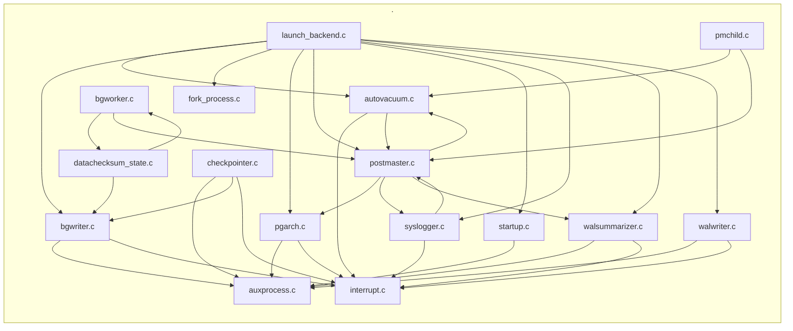

# `postmaster` — file-level dependencies

Arrows point from the file that does the `#include` to the file
it needs.  Ubiquitous modules (see [README](README.md)) are
omitted.  Node names are relative to the subsystem directory;
external nodes are grouped by their subsystem.

## Internal structure



## External dependencies

### `src/backend/postmaster`

```mermaid
graph LR
    subgraph "access"
        src_backend_access_common_reloptions_c["common/reloptions.c"]
        src_backend_access_heap_heapam_c["heap/heapam.c"]
        src_backend_access_heap_visibilitymap_c["heap/visibilitymap.c"]
        src_backend_access_index_genam_c["index/genam.c"]
        src_backend_access_table_tableam_c["table/tableam.c"]
        src_backend_access_transam_multixact_c["transam/multixact.c"]
        src_backend_access_transam_parallel_c["transam/parallel.c"]
        src_backend_access_transam_timeline_c["transam/timeline.c"]
        src_backend_access_transam_transam_c["transam/transam.c"]
        src_backend_access_transam_xlog_c["transam/xlog.c"]
        src_backend_access_transam_xloginsert_c["transam/xloginsert.c"]
        src_backend_access_transam_xlogrecovery_c["transam/xlogrecovery.c"]
        src_backend_access_transam_xlogutils_c["transam/xlogutils.c"]
    end
    subgraph "archive"
        src_backend_archive_shell_archive_c["shell_archive.c"]
    end
    subgraph "backup"
        src_backend_backup_walsummary_c["walsummary.c"]
    end
    subgraph "catalog"
        src_backend_catalog_dependency_c["dependency.c"]
        src_backend_catalog_indexing_c["indexing.c"]
        src_backend_catalog_namespace_c["namespace.c"]
        src_backend_catalog_pg_class_c["pg_class.c"]
        src_backend_catalog_pg_namespace_c["pg_namespace.c"]
    end
    subgraph "commands"
        src_backend_commands_repack_c["repack.c"]
        src_backend_commands_vacuum_c["vacuum.c"]
        src_backend_commands_wait_c["wait.c"]
    end
    subgraph "common"
        src_common_binaryheap_c["binaryheap.c"]
        src_common_blkreftable_c["blkreftable.c"]
        src_common_file_perm_c["file_perm.c"]
        src_common_file_utils_c["file_utils.c"]
        src_common_instr_time_c["instr_time.c"]
        src_common_pg_prng_c["pg_prng.c"]
        src_common_relpath_c["relpath.c"]
        src_common_stringinfo_c["stringinfo.c"]
    end
    subgraph "include/access"
        src_include_access_xlog_internal_h["xlog_internal.h"]
        src_include_access_xlogdefs_h["xlogdefs.h"]
    end
    subgraph "include/archive"
        src_include_archive_archive_module_h["archive_module.h"]
    end
    subgraph "include/catalog"
        src_include_catalog_pg_authid_h["pg_authid.h"]
        src_include_catalog_pg_database_h["pg_database.h"]
        src_include_catalog_storage_xlog_h["storage_xlog.h"]
    end
    subgraph "include/commands"
        src_include_commands_dbcommands_xlog_h["dbcommands_xlog.h"]
        src_include_commands_defrem_h["defrem.h"]
        src_include_commands_progress_h["progress.h"]
    end
    subgraph "include/libpq"
        src_include_libpq_libpq_be_h["libpq-be.h"]
        src_include_libpq_libpq_h["libpq.h"]
    end
    subgraph "include/nodes"
        src_include_nodes_pg_list_h["pg_list.h"]
        src_include_nodes_queryjumble_h["queryjumble.h"]
    end
    subgraph "include/port"
        src_include_port_pg_bswap_h["pg_bswap.h"]
        src_include_port_win32_netdb_h["win32/netdb.h"]
        src_include_port_win32_sys_socket_h["win32/sys/socket.h"]
        src_include_port_win32_msvc_sys_param_h["win32_msvc/sys/param.h"]
        src_include_port_win32_msvc_sys_time_h["win32_msvc/sys/time.h"]
        src_include_port_win32_msvc_unistd_h["win32_msvc/unistd.h"]
    end
    subgraph "include/postmaster"
        src_include_postmaster_bgworker_internals_h["bgworker_internals.h"]
        src_include_postmaster_proctypelist_h["proctypelist.h"]
    end
    subgraph "include/replication"
        src_include_replication_logicallauncher_h["logicallauncher.h"]
        src_include_replication_logicalworker_h["logicalworker.h"]
    end
    subgraph "include/storage"
        src_include_storage_aio_subsys_h["aio_subsys.h"]
        src_include_storage_block_h["block.h"]
        src_include_storage_buf_internals_h["buf_internals.h"]
        src_include_storage_io_worker_h["io_worker.h"]
        src_include_storage_pg_shmem_h["pg_shmem.h"]
        src_include_storage_relfilelocator_h["relfilelocator.h"]
        src_include_storage_shmem_internal_h["shmem_internal.h"]
        src_include_storage_spin_h["spin.h"]
        src_include_storage_subsystems_h["subsystems.h"]
    end
    subgraph "include/tcop"
        src_include_tcop_tcopprot_h["tcopprot.h"]
    end
    subgraph "include/top"
        src_include_pgtime_h["pgtime.h"]
    end
    subgraph "include/utils"
        src_include_utils_guc_hooks_h["guc_hooks.h"]
        src_include_utils_hsearch_h["hsearch.h"]
        src_include_utils_pidfile_h["pidfile.h"]
    end
    subgraph "lib"
        src_backend_lib_ilist_c["ilist.c"]
    end
    subgraph "libpq"
        src_backend_libpq_pqsignal_c["pqsignal.c"]
    end
    subgraph "nodes"
        src_backend_nodes_makefuncs_c["makefuncs.c"]
    end
    subgraph "parser"
        src_backend_parser_parse_node_c["parse_node.c"]
    end
    subgraph "port"
        src_backend_port_atomics_c["atomics.c"]
        src_port_pg_bitutils_c["pg_bitutils.c"]
        src_port_pg_getopt_ctx_c["pg_getopt_ctx.c"]
    end
    subgraph "replication"
        src_backend_replication_logical_slotsync_c["logical/slotsync.c"]
        src_backend_replication_syncrep_c["syncrep.c"]
        src_backend_replication_walreceiver_c["walreceiver.c"]
        src_backend_replication_walsender_c["walsender.c"]
    end
    subgraph "src/backend/postmaster"
        src_backend_postmaster_autovacuum_c["autovacuum.c"]
        src_backend_postmaster_auxprocess_c["auxprocess.c"]
        src_backend_postmaster_bgworker_c["bgworker.c"]
        src_backend_postmaster_bgwriter_c["bgwriter.c"]
        src_backend_postmaster_checkpointer_c["checkpointer.c"]
        src_backend_postmaster_datachecksum_state_c["datachecksum_state.c"]
        src_backend_postmaster_fork_process_c["fork_process.c"]
        src_backend_postmaster_interrupt_c["interrupt.c"]
        src_backend_postmaster_launch_backend_c["launch_backend.c"]
        src_backend_postmaster_pgarch_c["pgarch.c"]
        src_backend_postmaster_pmchild_c["pmchild.c"]
        src_backend_postmaster_postmaster_c["postmaster.c"]
        src_backend_postmaster_startup_c["startup.c"]
        src_backend_postmaster_syslogger_c["syslogger.c"]
        src_backend_postmaster_walsummarizer_c["walsummarizer.c"]
        src_backend_postmaster_walwriter_c["walwriter.c"]
    end
    subgraph "storage"
        src_backend_storage_buffer_bufmgr_c["buffer/bufmgr.c"]
        src_backend_storage_file_fd_c["file/fd.c"]
        src_backend_storage_ipc_dsm_c["ipc/dsm.c"]
        src_backend_storage_ipc_ipc_c["ipc/ipc.c"]
        src_backend_storage_ipc_latch_c["ipc/latch.c"]
        src_backend_storage_ipc_pmsignal_c["ipc/pmsignal.c"]
        src_backend_storage_ipc_procarray_c["ipc/procarray.c"]
        src_backend_storage_ipc_procsignal_c["ipc/procsignal.c"]
        src_backend_storage_ipc_shmem_c["ipc/shmem.c"]
        src_backend_storage_ipc_standby_c["ipc/standby.c"]
        src_backend_storage_lmgr_condition_variable_c["lmgr/condition_variable.c"]
        src_backend_storage_lmgr_lmgr_c["lmgr/lmgr.c"]
        src_backend_storage_lmgr_lwlock_c["lmgr/lwlock.c"]
        src_backend_storage_lmgr_proc_c["lmgr/proc.c"]
        src_backend_storage_page_checksum_c["page/checksum.c"]
        src_backend_storage_smgr_smgr_c["smgr/smgr.c"]
        src_backend_storage_sync_sync_c["sync/sync.c"]
    end
    subgraph "tcop"
        src_backend_tcop_backend_startup_c["backend_startup.c"]
    end
    subgraph "utils"
        src_backend_utils_activity_wait_event_c["activity/wait_event.c"]
        src_backend_utils_adt_acl_c["adt/acl.c"]
        src_backend_utils_adt_ascii_c["adt/ascii.c"]
        src_backend_utils_adt_datetime_c["adt/datetime.c"]
        src_backend_utils_adt_int_c["adt/int.c"]
        src_backend_utils_adt_timestamp_c["adt/timestamp.c"]
        src_backend_utils_adt_varlena_c["adt/varlena.c"]
        src_backend_utils_fmgr_funcapi_c["fmgr/funcapi.c"]
        src_backend_utils_misc_guc_c["misc/guc.c"]
        src_backend_utils_misc_injection_point_c["misc/injection_point.c"]
        src_backend_utils_misc_ps_status_c["misc/ps_status.c"]
        src_backend_utils_misc_timeout_c["misc/timeout.c"]
        src_backend_utils_resowner_resowner_c["resowner/resowner.c"]
        src_backend_utils_sort_tuplestore_c["sort/tuplestore.c"]
        src_backend_utils_time_snapmgr_c["time/snapmgr.c"]
    end
    src_backend_postmaster_autovacuum_c --> src_backend_access_common_reloptions_c
    src_backend_postmaster_autovacuum_c --> src_backend_access_heap_heapam_c
    src_backend_postmaster_autovacuum_c --> src_backend_access_table_tableam_c
    src_backend_postmaster_autovacuum_c --> src_backend_access_transam_multixact_c
    src_backend_postmaster_autovacuum_c --> src_backend_access_transam_transam_c
    src_backend_postmaster_autovacuum_c --> src_backend_catalog_dependency_c
    src_backend_postmaster_autovacuum_c --> src_backend_catalog_namespace_c
    src_backend_postmaster_autovacuum_c --> src_backend_catalog_pg_namespace_c
    src_backend_postmaster_autovacuum_c --> src_backend_commands_vacuum_c
    src_backend_postmaster_autovacuum_c --> src_backend_lib_ilist_c
    src_backend_postmaster_autovacuum_c --> src_backend_libpq_pqsignal_c
    src_backend_postmaster_autovacuum_c --> src_backend_nodes_makefuncs_c
    src_backend_postmaster_autovacuum_c --> src_backend_storage_buffer_bufmgr_c
    src_backend_postmaster_autovacuum_c --> src_backend_storage_file_fd_c
    src_backend_postmaster_autovacuum_c --> src_backend_storage_ipc_ipc_c
    src_backend_postmaster_autovacuum_c --> src_backend_storage_ipc_latch_c
    src_backend_postmaster_autovacuum_c --> src_backend_storage_ipc_pmsignal_c
    src_backend_postmaster_autovacuum_c --> src_backend_storage_ipc_procsignal_c
    src_backend_postmaster_autovacuum_c --> src_backend_storage_lmgr_lmgr_c
    src_backend_postmaster_autovacuum_c --> src_backend_storage_lmgr_proc_c
    src_backend_postmaster_autovacuum_c --> src_backend_storage_smgr_smgr_c
    src_backend_postmaster_autovacuum_c --> src_backend_utils_activity_wait_event_c
    src_backend_postmaster_autovacuum_c --> src_backend_utils_adt_int_c
    src_backend_postmaster_autovacuum_c --> src_backend_utils_adt_timestamp_c
    src_backend_postmaster_autovacuum_c --> src_backend_utils_fmgr_funcapi_c
    src_backend_postmaster_autovacuum_c --> src_backend_utils_misc_injection_point_c
    src_backend_postmaster_autovacuum_c --> src_backend_utils_misc_ps_status_c
    src_backend_postmaster_autovacuum_c --> src_backend_utils_misc_timeout_c
    src_backend_postmaster_autovacuum_c --> src_backend_utils_sort_tuplestore_c
    src_backend_postmaster_autovacuum_c --> src_backend_utils_time_snapmgr_c
    src_backend_postmaster_autovacuum_c --> src_include_catalog_pg_database_h
    src_backend_postmaster_autovacuum_c --> src_include_port_win32_msvc_sys_time_h
    src_backend_postmaster_autovacuum_c --> src_include_port_win32_msvc_unistd_h
    src_backend_postmaster_autovacuum_c --> src_include_storage_aio_subsys_h
    src_backend_postmaster_autovacuum_c --> src_include_storage_block_h
    src_backend_postmaster_autovacuum_c --> src_include_storage_subsystems_h
    src_backend_postmaster_autovacuum_c --> src_include_tcop_tcopprot_h
    src_backend_postmaster_autovacuum_c --> src_include_utils_guc_hooks_h
    src_backend_postmaster_auxprocess_c --> src_backend_access_transam_xlog_c
    src_backend_postmaster_auxprocess_c --> src_backend_storage_ipc_ipc_c
    src_backend_postmaster_auxprocess_c --> src_backend_storage_ipc_procsignal_c
    src_backend_postmaster_auxprocess_c --> src_backend_storage_lmgr_condition_variable_c
    src_backend_postmaster_auxprocess_c --> src_backend_storage_lmgr_proc_c
    src_backend_postmaster_auxprocess_c --> src_backend_utils_activity_wait_event_c
    src_backend_postmaster_auxprocess_c --> src_backend_utils_misc_ps_status_c
    src_backend_postmaster_auxprocess_c --> src_include_port_win32_msvc_unistd_h
    src_backend_postmaster_bgworker_c --> src_backend_access_transam_parallel_c
    src_backend_postmaster_bgworker_c --> src_backend_commands_repack_c
    src_backend_postmaster_bgworker_c --> src_backend_libpq_pqsignal_c
    src_backend_postmaster_bgworker_c --> src_backend_port_atomics_c
    src_backend_postmaster_bgworker_c --> src_backend_storage_ipc_ipc_c
    src_backend_postmaster_bgworker_c --> src_backend_storage_ipc_latch_c
    src_backend_postmaster_bgworker_c --> src_backend_storage_ipc_pmsignal_c
    src_backend_postmaster_bgworker_c --> src_backend_storage_ipc_procarray_c
    src_backend_postmaster_bgworker_c --> src_backend_storage_ipc_procsignal_c
    src_backend_postmaster_bgworker_c --> src_backend_storage_ipc_shmem_c
    src_backend_postmaster_bgworker_c --> src_backend_storage_lmgr_lwlock_c
    src_backend_postmaster_bgworker_c --> src_backend_storage_lmgr_proc_c
    src_backend_postmaster_bgworker_c --> src_backend_utils_activity_wait_event_c
    src_backend_postmaster_bgworker_c --> src_backend_utils_adt_ascii_c
    src_backend_postmaster_bgworker_c --> src_backend_utils_misc_ps_status_c
    src_backend_postmaster_bgworker_c --> src_backend_utils_misc_timeout_c
    src_backend_postmaster_bgworker_c --> src_include_postmaster_bgworker_internals_h
    src_backend_postmaster_bgworker_c --> src_include_replication_logicallauncher_h
    src_backend_postmaster_bgworker_c --> src_include_replication_logicalworker_h
    src_backend_postmaster_bgworker_c --> src_include_storage_subsystems_h
    src_backend_postmaster_bgworker_c --> src_include_tcop_tcopprot_h
    src_backend_postmaster_bgwriter_c --> src_backend_access_transam_xlog_c
    src_backend_postmaster_bgwriter_c --> src_backend_libpq_pqsignal_c
    src_backend_postmaster_bgwriter_c --> src_backend_parser_parse_node_c
    src_backend_postmaster_bgwriter_c --> src_backend_storage_buffer_bufmgr_c
    src_backend_postmaster_bgwriter_c --> src_backend_storage_file_fd_c
    src_backend_postmaster_bgwriter_c --> src_backend_storage_ipc_procsignal_c
    src_backend_postmaster_bgwriter_c --> src_backend_storage_ipc_standby_c
    src_backend_postmaster_bgwriter_c --> src_backend_storage_lmgr_condition_variable_c
    src_backend_postmaster_bgwriter_c --> src_backend_storage_lmgr_lwlock_c
    src_backend_postmaster_bgwriter_c --> src_backend_storage_lmgr_proc_c
    src_backend_postmaster_bgwriter_c --> src_backend_storage_smgr_smgr_c
    src_backend_postmaster_bgwriter_c --> src_backend_storage_sync_sync_c
    src_backend_postmaster_bgwriter_c --> src_backend_utils_activity_wait_event_c
    src_backend_postmaster_bgwriter_c --> src_backend_utils_adt_timestamp_c
    src_backend_postmaster_bgwriter_c --> src_backend_utils_resowner_resowner_c
    src_backend_postmaster_bgwriter_c --> src_include_storage_aio_subsys_h
    src_backend_postmaster_bgwriter_c --> src_include_storage_block_h
    src_backend_postmaster_bgwriter_c --> src_include_storage_buf_internals_h
    src_backend_postmaster_bgwriter_c --> src_include_storage_relfilelocator_h
    src_backend_postmaster_checkpointer_c --> src_backend_access_transam_xlog_c
    src_backend_postmaster_checkpointer_c --> src_backend_access_transam_xlogrecovery_c
    src_backend_postmaster_checkpointer_c --> src_backend_libpq_pqsignal_c
    src_backend_postmaster_checkpointer_c --> src_backend_replication_syncrep_c
    src_backend_postmaster_checkpointer_c --> src_backend_storage_buffer_bufmgr_c
    src_backend_postmaster_checkpointer_c --> src_backend_storage_file_fd_c
    src_backend_postmaster_checkpointer_c --> src_backend_storage_ipc_ipc_c
    src_backend_postmaster_checkpointer_c --> src_backend_storage_ipc_pmsignal_c
    src_backend_postmaster_checkpointer_c --> src_backend_storage_ipc_procsignal_c
    src_backend_postmaster_checkpointer_c --> src_backend_storage_ipc_shmem_c
    src_backend_postmaster_checkpointer_c --> src_backend_storage_lmgr_condition_variable_c
    src_backend_postmaster_checkpointer_c --> src_backend_storage_lmgr_lwlock_c
    src_backend_postmaster_checkpointer_c --> src_backend_storage_lmgr_proc_c
    src_backend_postmaster_checkpointer_c --> src_backend_storage_smgr_smgr_c
    src_backend_postmaster_checkpointer_c --> src_backend_utils_activity_wait_event_c
    src_backend_postmaster_checkpointer_c --> src_backend_utils_adt_acl_c
    src_backend_postmaster_checkpointer_c --> src_backend_utils_misc_guc_c
    src_backend_postmaster_checkpointer_c --> src_backend_utils_resowner_resowner_c
    src_backend_postmaster_checkpointer_c --> src_include_access_xlog_internal_h
    src_backend_postmaster_checkpointer_c --> src_include_catalog_pg_authid_h
    src_backend_postmaster_checkpointer_c --> src_include_commands_defrem_h
    src_backend_postmaster_checkpointer_c --> src_include_port_win32_msvc_sys_time_h
    src_backend_postmaster_checkpointer_c --> src_include_storage_aio_subsys_h
    src_backend_postmaster_checkpointer_c --> src_include_storage_spin_h
    src_backend_postmaster_checkpointer_c --> src_include_storage_subsystems_h
    src_backend_postmaster_datachecksum_state_c --> src_backend_access_heap_heapam_c
    src_backend_postmaster_datachecksum_state_c --> src_backend_access_index_genam_c
    src_backend_postmaster_datachecksum_state_c --> src_backend_access_transam_xlog_c
    src_backend_postmaster_datachecksum_state_c --> src_backend_access_transam_xloginsert_c
    src_backend_postmaster_datachecksum_state_c --> src_backend_catalog_indexing_c
    src_backend_postmaster_datachecksum_state_c --> src_backend_catalog_pg_class_c
    src_backend_postmaster_datachecksum_state_c --> src_backend_commands_vacuum_c
    src_backend_postmaster_datachecksum_state_c --> src_backend_storage_buffer_bufmgr_c
    src_backend_postmaster_datachecksum_state_c --> src_backend_storage_ipc_ipc_c
    src_backend_postmaster_datachecksum_state_c --> src_backend_storage_ipc_latch_c
    src_backend_postmaster_datachecksum_state_c --> src_backend_storage_ipc_procarray_c
    src_backend_postmaster_datachecksum_state_c --> src_backend_storage_ipc_procsignal_c
    src_backend_postmaster_datachecksum_state_c --> src_backend_storage_lmgr_lmgr_c
    src_backend_postmaster_datachecksum_state_c --> src_backend_storage_lmgr_lwlock_c
    src_backend_postmaster_datachecksum_state_c --> src_backend_storage_page_checksum_c
    src_backend_postmaster_datachecksum_state_c --> src_backend_storage_smgr_smgr_c
    src_backend_postmaster_datachecksum_state_c --> src_backend_utils_activity_wait_event_c
    src_backend_postmaster_datachecksum_state_c --> src_backend_utils_misc_injection_point_c
    src_backend_postmaster_datachecksum_state_c --> src_backend_utils_misc_ps_status_c
    src_backend_postmaster_datachecksum_state_c --> src_common_relpath_c
    src_backend_postmaster_datachecksum_state_c --> src_include_catalog_pg_database_h
    src_backend_postmaster_datachecksum_state_c --> src_include_commands_progress_h
    src_backend_postmaster_datachecksum_state_c --> src_include_storage_subsystems_h
    src_backend_postmaster_datachecksum_state_c --> src_include_tcop_tcopprot_h
    src_backend_postmaster_fork_process_c --> src_backend_libpq_pqsignal_c
    src_backend_postmaster_fork_process_c --> src_include_port_win32_msvc_sys_time_h
    src_backend_postmaster_fork_process_c --> src_include_port_win32_msvc_unistd_h
    src_backend_postmaster_interrupt_c --> src_backend_storage_ipc_ipc_c
    src_backend_postmaster_interrupt_c --> src_backend_storage_ipc_latch_c
    src_backend_postmaster_interrupt_c --> src_backend_storage_ipc_procsignal_c
    src_backend_postmaster_interrupt_c --> src_backend_utils_misc_guc_c
    src_backend_postmaster_interrupt_c --> src_include_port_win32_msvc_unistd_h
    src_backend_postmaster_launch_backend_c --> src_backend_replication_logical_slotsync_c
    src_backend_postmaster_launch_backend_c --> src_backend_replication_walreceiver_c
    src_backend_postmaster_launch_backend_c --> src_backend_storage_file_fd_c
    src_backend_postmaster_launch_backend_c --> src_backend_storage_ipc_dsm_c
    src_backend_postmaster_launch_backend_c --> src_backend_storage_ipc_ipc_c
    src_backend_postmaster_launch_backend_c --> src_backend_storage_ipc_pmsignal_c
    src_backend_postmaster_launch_backend_c --> src_backend_storage_ipc_procsignal_c
    src_backend_postmaster_launch_backend_c --> src_backend_storage_lmgr_lwlock_c
    src_backend_postmaster_launch_backend_c --> src_backend_storage_lmgr_proc_c
    src_backend_postmaster_launch_backend_c --> src_backend_tcop_backend_startup_c
    src_backend_postmaster_launch_backend_c --> src_backend_utils_misc_injection_point_c
    src_backend_postmaster_launch_backend_c --> src_common_file_utils_c
    src_backend_postmaster_launch_backend_c --> src_common_instr_time_c
    src_backend_postmaster_launch_backend_c --> src_include_libpq_libpq_be_h
    src_backend_postmaster_launch_backend_c --> src_include_nodes_queryjumble_h
    src_backend_postmaster_launch_backend_c --> src_include_port_win32_msvc_unistd_h
    src_backend_postmaster_launch_backend_c --> src_include_postmaster_bgworker_internals_h
    src_backend_postmaster_launch_backend_c --> src_include_postmaster_proctypelist_h
    src_backend_postmaster_launch_backend_c --> src_include_storage_io_worker_h
    src_backend_postmaster_launch_backend_c --> src_include_storage_pg_shmem_h
    src_backend_postmaster_launch_backend_c --> src_include_storage_shmem_internal_h
    src_backend_postmaster_launch_backend_c --> src_include_storage_spin_h
    src_backend_postmaster_launch_backend_c --> src_include_tcop_tcopprot_h
    src_backend_postmaster_pgarch_c --> src_backend_access_transam_xlog_c
    src_backend_postmaster_pgarch_c --> src_backend_archive_shell_archive_c
    src_backend_postmaster_pgarch_c --> src_backend_libpq_pqsignal_c
    src_backend_postmaster_pgarch_c --> src_backend_storage_file_fd_c
    src_backend_postmaster_pgarch_c --> src_backend_storage_ipc_ipc_c
    src_backend_postmaster_pgarch_c --> src_backend_storage_ipc_latch_c
    src_backend_postmaster_pgarch_c --> src_backend_storage_ipc_pmsignal_c
    src_backend_postmaster_pgarch_c --> src_backend_storage_ipc_procsignal_c
    src_backend_postmaster_pgarch_c --> src_backend_storage_ipc_shmem_c
    src_backend_postmaster_pgarch_c --> src_backend_storage_lmgr_condition_variable_c
    src_backend_postmaster_pgarch_c --> src_backend_storage_lmgr_proc_c
    src_backend_postmaster_pgarch_c --> src_backend_utils_activity_wait_event_c
    src_backend_postmaster_pgarch_c --> src_backend_utils_misc_guc_c
    src_backend_postmaster_pgarch_c --> src_backend_utils_misc_ps_status_c
    src_backend_postmaster_pgarch_c --> src_backend_utils_misc_timeout_c
    src_backend_postmaster_pgarch_c --> src_backend_utils_resowner_resowner_c
    src_backend_postmaster_pgarch_c --> src_common_binaryheap_c
    src_backend_postmaster_pgarch_c --> src_include_access_xlog_internal_h
    src_backend_postmaster_pgarch_c --> src_include_archive_archive_module_h
    src_backend_postmaster_pgarch_c --> src_include_port_win32_msvc_sys_time_h
    src_backend_postmaster_pgarch_c --> src_include_port_win32_msvc_unistd_h
    src_backend_postmaster_pgarch_c --> src_include_storage_aio_subsys_h
    src_backend_postmaster_pgarch_c --> src_include_storage_subsystems_h
    src_backend_postmaster_pmchild_c --> src_backend_replication_walsender_c
    src_backend_postmaster_pmchild_c --> src_backend_storage_ipc_pmsignal_c
    src_backend_postmaster_pmchild_c --> src_backend_storage_lmgr_proc_c
    src_backend_postmaster_postmaster_c --> src_backend_access_transam_xlog_c
    src_backend_postmaster_postmaster_c --> src_backend_access_transam_xlogrecovery_c
    src_backend_postmaster_postmaster_c --> src_backend_commands_wait_c
    src_backend_postmaster_postmaster_c --> src_backend_lib_ilist_c
    src_backend_postmaster_postmaster_c --> src_backend_libpq_pqsignal_c
    src_backend_postmaster_postmaster_c --> src_backend_replication_logical_slotsync_c
    src_backend_postmaster_postmaster_c --> src_backend_replication_walsender_c
    src_backend_postmaster_postmaster_c --> src_backend_storage_file_fd_c
    src_backend_postmaster_postmaster_c --> src_backend_storage_ipc_ipc_c
    src_backend_postmaster_postmaster_c --> src_backend_storage_ipc_pmsignal_c
    src_backend_postmaster_postmaster_c --> src_backend_storage_lmgr_proc_c
    src_backend_postmaster_postmaster_c --> src_backend_tcop_backend_startup_c
    src_backend_postmaster_postmaster_c --> src_backend_utils_adt_datetime_c
    src_backend_postmaster_postmaster_c --> src_backend_utils_adt_timestamp_c
    src_backend_postmaster_postmaster_c --> src_backend_utils_adt_varlena_c
    src_backend_postmaster_postmaster_c --> src_common_file_perm_c
    src_backend_postmaster_postmaster_c --> src_common_file_utils_c
    src_backend_postmaster_postmaster_c --> src_common_pg_prng_c
    src_backend_postmaster_postmaster_c --> src_include_access_xlog_internal_h
    src_backend_postmaster_postmaster_c --> src_include_libpq_libpq_h
    src_backend_postmaster_postmaster_c --> src_include_port_pg_bswap_h
    src_backend_postmaster_postmaster_c --> src_include_port_win32_netdb_h
    src_backend_postmaster_postmaster_c --> src_include_port_win32_sys_socket_h
    src_backend_postmaster_postmaster_c --> src_include_port_win32_msvc_sys_param_h
    src_backend_postmaster_postmaster_c --> src_include_port_win32_msvc_sys_time_h
    src_backend_postmaster_postmaster_c --> src_include_port_win32_msvc_unistd_h
    src_backend_postmaster_postmaster_c --> src_include_postmaster_bgworker_internals_h
    src_backend_postmaster_postmaster_c --> src_include_replication_logicallauncher_h
    src_backend_postmaster_postmaster_c --> src_include_storage_aio_subsys_h
    src_backend_postmaster_postmaster_c --> src_include_storage_io_worker_h
    src_backend_postmaster_postmaster_c --> src_include_storage_pg_shmem_h
    src_backend_postmaster_postmaster_c --> src_include_storage_shmem_internal_h
    src_backend_postmaster_postmaster_c --> src_include_tcop_tcopprot_h
    src_backend_postmaster_postmaster_c --> src_include_utils_pidfile_h
    src_backend_postmaster_postmaster_c --> src_port_pg_getopt_ctx_c
    src_backend_postmaster_startup_c --> src_backend_access_transam_xlog_c
    src_backend_postmaster_startup_c --> src_backend_access_transam_xlogrecovery_c
    src_backend_postmaster_startup_c --> src_backend_access_transam_xlogutils_c
    src_backend_postmaster_startup_c --> src_backend_libpq_pqsignal_c
    src_backend_postmaster_startup_c --> src_backend_storage_ipc_ipc_c
    src_backend_postmaster_startup_c --> src_backend_storage_ipc_pmsignal_c
    src_backend_postmaster_startup_c --> src_backend_storage_ipc_procsignal_c
    src_backend_postmaster_startup_c --> src_backend_storage_ipc_standby_c
    src_backend_postmaster_startup_c --> src_backend_utils_misc_guc_c
    src_backend_postmaster_startup_c --> src_backend_utils_misc_timeout_c
    src_backend_postmaster_syslogger_c --> src_backend_libpq_pqsignal_c
    src_backend_postmaster_syslogger_c --> src_backend_storage_file_fd_c
    src_backend_postmaster_syslogger_c --> src_backend_storage_ipc_dsm_c
    src_backend_postmaster_syslogger_c --> src_backend_storage_ipc_ipc_c
    src_backend_postmaster_syslogger_c --> src_backend_storage_ipc_latch_c
    src_backend_postmaster_syslogger_c --> src_backend_utils_activity_wait_event_c
    src_backend_postmaster_syslogger_c --> src_backend_utils_misc_guc_c
    src_backend_postmaster_syslogger_c --> src_backend_utils_misc_ps_status_c
    src_backend_postmaster_syslogger_c --> src_common_file_perm_c
    src_backend_postmaster_syslogger_c --> src_common_stringinfo_c
    src_backend_postmaster_syslogger_c --> src_include_nodes_pg_list_h
    src_backend_postmaster_syslogger_c --> src_include_pgtime_h
    src_backend_postmaster_syslogger_c --> src_include_port_win32_msvc_sys_time_h
    src_backend_postmaster_syslogger_c --> src_include_port_win32_msvc_unistd_h
    src_backend_postmaster_syslogger_c --> src_include_storage_pg_shmem_h
    src_backend_postmaster_syslogger_c --> src_include_tcop_tcopprot_h
    src_backend_postmaster_syslogger_c --> src_port_pg_bitutils_c
    src_backend_postmaster_walsummarizer_c --> src_backend_access_heap_visibilitymap_c
    src_backend_postmaster_walsummarizer_c --> src_backend_access_transam_timeline_c
    src_backend_postmaster_walsummarizer_c --> src_backend_access_transam_xlog_c
    src_backend_postmaster_walsummarizer_c --> src_backend_access_transam_xlogrecovery_c
    src_backend_postmaster_walsummarizer_c --> src_backend_access_transam_xlogutils_c
    src_backend_postmaster_walsummarizer_c --> src_backend_backup_walsummary_c
    src_backend_postmaster_walsummarizer_c --> src_backend_libpq_pqsignal_c
    src_backend_postmaster_walsummarizer_c --> src_backend_replication_walreceiver_c
    src_backend_postmaster_walsummarizer_c --> src_backend_storage_file_fd_c
    src_backend_postmaster_walsummarizer_c --> src_backend_storage_ipc_ipc_c
    src_backend_postmaster_walsummarizer_c --> src_backend_storage_ipc_latch_c
    src_backend_postmaster_walsummarizer_c --> src_backend_storage_ipc_procsignal_c
    src_backend_postmaster_walsummarizer_c --> src_backend_storage_ipc_shmem_c
    src_backend_postmaster_walsummarizer_c --> src_backend_storage_lmgr_lwlock_c
    src_backend_postmaster_walsummarizer_c --> src_backend_storage_lmgr_proc_c
    src_backend_postmaster_walsummarizer_c --> src_backend_utils_activity_wait_event_c
    src_backend_postmaster_walsummarizer_c --> src_backend_utils_misc_guc_c
    src_backend_postmaster_walsummarizer_c --> src_common_blkreftable_c
    src_backend_postmaster_walsummarizer_c --> src_include_access_xlog_internal_h
    src_backend_postmaster_walsummarizer_c --> src_include_access_xlogdefs_h
    src_backend_postmaster_walsummarizer_c --> src_include_catalog_storage_xlog_h
    src_backend_postmaster_walsummarizer_c --> src_include_commands_dbcommands_xlog_h
    src_backend_postmaster_walsummarizer_c --> src_include_storage_aio_subsys_h
    src_backend_postmaster_walsummarizer_c --> src_include_storage_subsystems_h
    src_backend_postmaster_walwriter_c --> src_backend_access_transam_xlog_c
    src_backend_postmaster_walwriter_c --> src_backend_libpq_pqsignal_c
    src_backend_postmaster_walwriter_c --> src_backend_storage_buffer_bufmgr_c
    src_backend_postmaster_walwriter_c --> src_backend_storage_file_fd_c
    src_backend_postmaster_walwriter_c --> src_backend_storage_ipc_procsignal_c
    src_backend_postmaster_walwriter_c --> src_backend_storage_lmgr_condition_variable_c
    src_backend_postmaster_walwriter_c --> src_backend_storage_lmgr_lwlock_c
    src_backend_postmaster_walwriter_c --> src_backend_storage_lmgr_proc_c
    src_backend_postmaster_walwriter_c --> src_backend_storage_smgr_smgr_c
    src_backend_postmaster_walwriter_c --> src_backend_utils_activity_wait_event_c
    src_backend_postmaster_walwriter_c --> src_backend_utils_resowner_resowner_c
    src_backend_postmaster_walwriter_c --> src_include_port_win32_msvc_unistd_h
    src_backend_postmaster_walwriter_c --> src_include_storage_aio_subsys_h
    src_backend_postmaster_walwriter_c --> src_include_utils_hsearch_h
```
