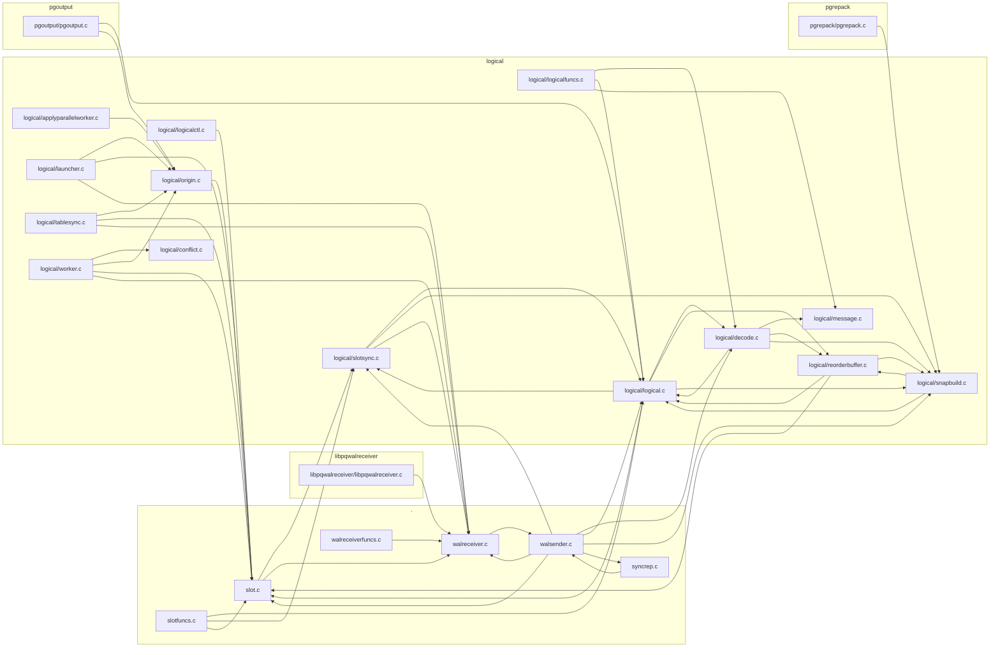
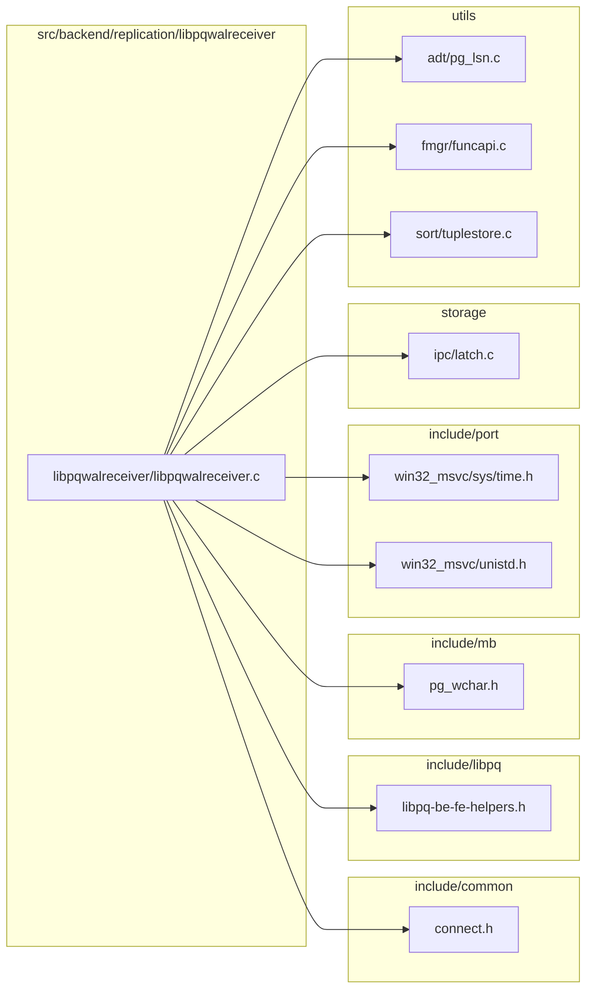
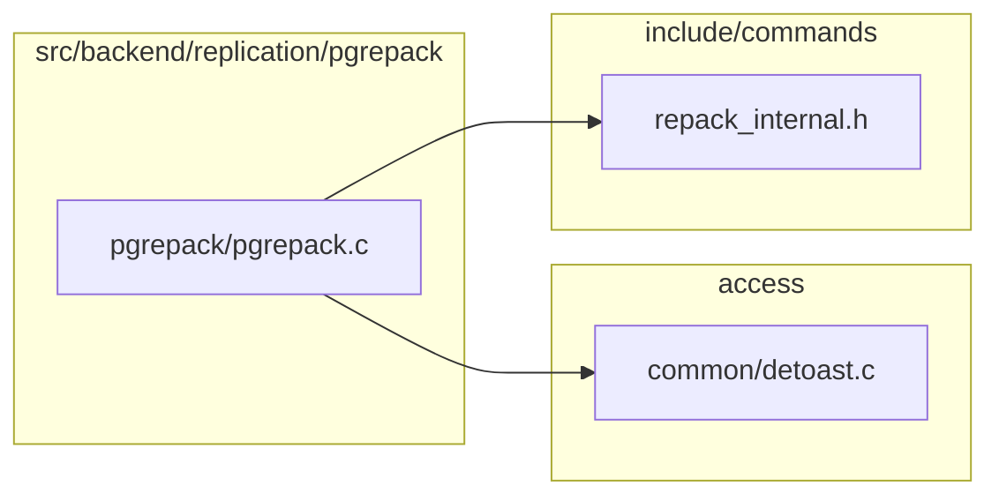

# `replication` — file-level dependencies

Arrows point from the file that does the `#include` to the file
it needs.  Ubiquitous modules (see [README](README.md)) are
omitted.  Node names are relative to the subsystem directory;
external nodes are grouped by their subsystem.

## Internal structure



## External dependencies

### `src/backend/replication`

```mermaid
graph LR
    subgraph "access"
        src_backend_access_transam_timeline_c["transam/timeline.c"]
        src_backend_access_transam_transam_c["transam/transam.c"]
        src_backend_access_transam_twophase_c["transam/twophase.c"]
        src_backend_access_transam_xlog_c["transam/xlog.c"]
        src_backend_access_transam_xlogarchive_c["transam/xlogarchive.c"]
        src_backend_access_transam_xlogreader_c["transam/xlogreader.c"]
        src_backend_access_transam_xlogrecovery_c["transam/xlogrecovery.c"]
        src_backend_access_transam_xlogutils_c["transam/xlogutils.c"]
        src_backend_access_transam_xlogwait_c["transam/xlogwait.c"]
    end
    subgraph "backup"
        src_backend_backup_basebackup_c["basebackup.c"]
        src_backend_backup_basebackup_incremental_c["basebackup_incremental.c"]
    end
    subgraph "common"
        src_common_file_utils_c["file_utils.c"]
        src_common_string_c["string.c"]
    end
    subgraph "include/access"
        src_include_access_xlog_internal_h["xlog_internal.h"]
        src_include_access_xlogdefs_h["xlogdefs.h"]
    end
    subgraph "include/catalog"
        src_include_catalog_pg_authid_h["pg_authid.h"]
    end
    subgraph "include/commands"
        src_include_commands_defrem_h["defrem.h"]
    end
    subgraph "include/libpq"
        src_include_libpq_libpq_h["libpq.h"]
        src_include_libpq_protocol_h["protocol.h"]
    end
    subgraph "include/nodes"
        src_include_nodes_replnodes_h["replnodes.h"]
    end
    subgraph "include/port"
        src_include_port_win32_netdb_h["win32/netdb.h"]
        src_include_port_win32_msvc_sys_time_h["win32_msvc/sys/time.h"]
        src_include_port_win32_msvc_unistd_h["win32_msvc/unistd.h"]
    end
    subgraph "include/replication"
        src_include_replication_logicallauncher_h["logicallauncher.h"]
        src_include_replication_logicalproto_h["logicalproto.h"]
        src_include_replication_walsender_private_h["walsender_private.h"]
    end
    subgraph "include/storage"
        src_include_storage_aio_subsys_h["aio_subsys.h"]
        src_include_storage_spin_h["spin.h"]
        src_include_storage_subsystems_h["subsystems.h"]
    end
    subgraph "include/tcop"
        src_include_tcop_tcopprot_h["tcopprot.h"]
    end
    subgraph "include/top"
        src_include_pgtime_h["pgtime.h"]
    end
    subgraph "include/utils"
        src_include_utils_guc_hooks_h["guc_hooks.h"]
        src_include_utils_pgstat_internal_h["pgstat_internal.h"]
    end
    subgraph "libpq"
        src_backend_libpq_pqformat_c["pqformat.c"]
        src_backend_libpq_pqsignal_c["pqsignal.c"]
    end
    subgraph "port"
        src_backend_port_atomics_c["atomics.c"]
    end
    subgraph "postmaster"
        src_backend_postmaster_auxprocess_c["auxprocess.c"]
        src_backend_postmaster_interrupt_c["interrupt.c"]
    end
    subgraph "src/backend/replication"
        src_backend_replication_slot_c["slot.c"]
        src_backend_replication_slotfuncs_c["slotfuncs.c"]
        src_backend_replication_syncrep_c["syncrep.c"]
        src_backend_replication_walreceiver_c["walreceiver.c"]
        src_backend_replication_walreceiverfuncs_c["walreceiverfuncs.c"]
        src_backend_replication_walsender_c["walsender.c"]
    end
    subgraph "storage"
        src_backend_storage_file_fd_c["file/fd.c"]
        src_backend_storage_ipc_ipc_c["ipc/ipc.c"]
        src_backend_storage_ipc_pmsignal_c["ipc/pmsignal.c"]
        src_backend_storage_ipc_procarray_c["ipc/procarray.c"]
        src_backend_storage_ipc_procsignal_c["ipc/procsignal.c"]
        src_backend_storage_ipc_shmem_c["ipc/shmem.c"]
        src_backend_storage_lmgr_condition_variable_c["lmgr/condition_variable.c"]
        src_backend_storage_lmgr_lwlock_c["lmgr/lwlock.c"]
        src_backend_storage_lmgr_proc_c["lmgr/proc.c"]
    end
    subgraph "tcop"
        src_backend_tcop_dest_c["dest.c"]
    end
    subgraph "utils"
        src_backend_utils_activity_wait_event_c["activity/wait_event.c"]
        src_backend_utils_adt_acl_c["adt/acl.c"]
        src_backend_utils_adt_int_c["adt/int.c"]
        src_backend_utils_adt_pg_lsn_c["adt/pg_lsn.c"]
        src_backend_utils_adt_timestamp_c["adt/timestamp.c"]
        src_backend_utils_adt_varlena_c["adt/varlena.c"]
        src_backend_utils_fmgr_funcapi_c["fmgr/funcapi.c"]
        src_backend_utils_misc_guc_c["misc/guc.c"]
        src_backend_utils_misc_injection_point_c["misc/injection_point.c"]
        src_backend_utils_misc_ps_status_c["misc/ps_status.c"]
        src_backend_utils_misc_timeout_c["misc/timeout.c"]
        src_backend_utils_sort_tuplestore_c["sort/tuplestore.c"]
    end
    src_backend_replication_slot_c --> src_backend_access_transam_transam_c
    src_backend_replication_slot_c --> src_backend_access_transam_xlog_c
    src_backend_replication_slot_c --> src_backend_access_transam_xlogreader_c
    src_backend_replication_slot_c --> src_backend_access_transam_xlogrecovery_c
    src_backend_replication_slot_c --> src_backend_postmaster_interrupt_c
    src_backend_replication_slot_c --> src_backend_storage_file_fd_c
    src_backend_replication_slot_c --> src_backend_storage_ipc_ipc_c
    src_backend_replication_slot_c --> src_backend_storage_ipc_procarray_c
    src_backend_replication_slot_c --> src_backend_storage_ipc_shmem_c
    src_backend_replication_slot_c --> src_backend_storage_lmgr_condition_variable_c
    src_backend_replication_slot_c --> src_backend_storage_lmgr_lwlock_c
    src_backend_replication_slot_c --> src_backend_storage_lmgr_proc_c
    src_backend_replication_slot_c --> src_backend_utils_activity_wait_event_c
    src_backend_replication_slot_c --> src_backend_utils_adt_varlena_c
    src_backend_replication_slot_c --> src_backend_utils_misc_injection_point_c
    src_backend_replication_slot_c --> src_common_file_utils_c
    src_backend_replication_slot_c --> src_common_string_c
    src_backend_replication_slot_c --> src_include_access_xlog_internal_h
    src_backend_replication_slot_c --> src_include_port_win32_msvc_unistd_h
    src_backend_replication_slot_c --> src_include_replication_logicallauncher_h
    src_backend_replication_slot_c --> src_include_replication_walsender_private_h
    src_backend_replication_slot_c --> src_include_storage_spin_h
    src_backend_replication_slot_c --> src_include_storage_subsystems_h
    src_backend_replication_slot_c --> src_include_utils_guc_hooks_h
    src_backend_replication_slotfuncs_c --> src_backend_access_transam_xlogrecovery_c
    src_backend_replication_slotfuncs_c --> src_backend_access_transam_xlogutils_c
    src_backend_replication_slotfuncs_c --> src_backend_storage_lmgr_proc_c
    src_backend_replication_slotfuncs_c --> src_backend_utils_adt_pg_lsn_c
    src_backend_replication_slotfuncs_c --> src_backend_utils_fmgr_funcapi_c
    src_backend_replication_slotfuncs_c --> src_backend_utils_misc_guc_c
    src_backend_replication_slotfuncs_c --> src_include_access_xlog_internal_h
    src_backend_replication_syncrep_c --> src_backend_storage_lmgr_proc_c
    src_backend_replication_syncrep_c --> src_backend_utils_activity_wait_event_c
    src_backend_replication_syncrep_c --> src_backend_utils_adt_int_c
    src_backend_replication_syncrep_c --> src_backend_utils_misc_ps_status_c
    src_backend_replication_syncrep_c --> src_include_access_xlogdefs_h
    src_backend_replication_syncrep_c --> src_include_port_win32_msvc_unistd_h
    src_backend_replication_syncrep_c --> src_include_replication_walsender_private_h
    src_backend_replication_syncrep_c --> src_include_tcop_tcopprot_h
    src_backend_replication_syncrep_c --> src_include_utils_guc_hooks_h
    src_backend_replication_walreceiver_c --> src_backend_access_transam_timeline_c
    src_backend_replication_walreceiver_c --> src_backend_access_transam_transam_c
    src_backend_replication_walreceiver_c --> src_backend_access_transam_xlog_c
    src_backend_replication_walreceiver_c --> src_backend_access_transam_xlogarchive_c
    src_backend_replication_walreceiver_c --> src_backend_access_transam_xlogrecovery_c
    src_backend_replication_walreceiver_c --> src_backend_access_transam_xlogwait_c
    src_backend_replication_walreceiver_c --> src_backend_libpq_pqformat_c
    src_backend_replication_walreceiver_c --> src_backend_libpq_pqsignal_c
    src_backend_replication_walreceiver_c --> src_backend_port_atomics_c
    src_backend_replication_walreceiver_c --> src_backend_postmaster_auxprocess_c
    src_backend_replication_walreceiver_c --> src_backend_postmaster_interrupt_c
    src_backend_replication_walreceiver_c --> src_backend_storage_ipc_ipc_c
    src_backend_replication_walreceiver_c --> src_backend_storage_ipc_procarray_c
    src_backend_replication_walreceiver_c --> src_backend_storage_ipc_procsignal_c
    src_backend_replication_walreceiver_c --> src_backend_storage_lmgr_condition_variable_c
    src_backend_replication_walreceiver_c --> src_backend_storage_lmgr_proc_c
    src_backend_replication_walreceiver_c --> src_backend_utils_activity_wait_event_c
    src_backend_replication_walreceiver_c --> src_backend_utils_adt_acl_c
    src_backend_replication_walreceiver_c --> src_backend_utils_adt_pg_lsn_c
    src_backend_replication_walreceiver_c --> src_backend_utils_adt_timestamp_c
    src_backend_replication_walreceiver_c --> src_backend_utils_fmgr_funcapi_c
    src_backend_replication_walreceiver_c --> src_backend_utils_misc_guc_c
    src_backend_replication_walreceiver_c --> src_backend_utils_misc_ps_status_c
    src_backend_replication_walreceiver_c --> src_backend_utils_sort_tuplestore_c
    src_backend_replication_walreceiver_c --> src_include_access_xlog_internal_h
    src_backend_replication_walreceiver_c --> src_include_access_xlogdefs_h
    src_backend_replication_walreceiver_c --> src_include_catalog_pg_authid_h
    src_backend_replication_walreceiver_c --> src_include_pgtime_h
    src_backend_replication_walreceiver_c --> src_include_port_win32_netdb_h
    src_backend_replication_walreceiver_c --> src_include_port_win32_msvc_unistd_h
    src_backend_replication_walreceiver_c --> src_include_replication_logicalproto_h
    src_backend_replication_walreceiver_c --> src_include_storage_spin_h
    src_backend_replication_walreceiver_c --> src_include_tcop_tcopprot_h
    src_backend_replication_walreceiverfuncs_c --> src_backend_access_transam_xlogrecovery_c
    src_backend_replication_walreceiverfuncs_c --> src_backend_storage_ipc_pmsignal_c
    src_backend_replication_walreceiverfuncs_c --> src_backend_storage_ipc_shmem_c
    src_backend_replication_walreceiverfuncs_c --> src_backend_storage_lmgr_proc_c
    src_backend_replication_walreceiverfuncs_c --> src_backend_utils_activity_wait_event_c
    src_backend_replication_walreceiverfuncs_c --> src_backend_utils_adt_timestamp_c
    src_backend_replication_walreceiverfuncs_c --> src_include_access_xlog_internal_h
    src_backend_replication_walreceiverfuncs_c --> src_include_port_win32_msvc_sys_time_h
    src_backend_replication_walreceiverfuncs_c --> src_include_port_win32_msvc_unistd_h
    src_backend_replication_walreceiverfuncs_c --> src_include_storage_subsystems_h
    src_backend_replication_walsender_c --> src_backend_access_transam_timeline_c
    src_backend_replication_walsender_c --> src_backend_access_transam_transam_c
    src_backend_replication_walsender_c --> src_backend_access_transam_twophase_c
    src_backend_replication_walsender_c --> src_backend_access_transam_xlogreader_c
    src_backend_replication_walsender_c --> src_backend_access_transam_xlogrecovery_c
    src_backend_replication_walsender_c --> src_backend_access_transam_xlogutils_c
    src_backend_replication_walsender_c --> src_backend_backup_basebackup_c
    src_backend_replication_walsender_c --> src_backend_backup_basebackup_incremental_c
    src_backend_replication_walsender_c --> src_backend_libpq_pqformat_c
    src_backend_replication_walsender_c --> src_backend_postmaster_interrupt_c
    src_backend_replication_walsender_c --> src_backend_storage_file_fd_c
    src_backend_replication_walsender_c --> src_backend_storage_ipc_ipc_c
    src_backend_replication_walsender_c --> src_backend_storage_ipc_pmsignal_c
    src_backend_replication_walsender_c --> src_backend_storage_ipc_procarray_c
    src_backend_replication_walsender_c --> src_backend_storage_lmgr_condition_variable_c
    src_backend_replication_walsender_c --> src_backend_storage_lmgr_proc_c
    src_backend_replication_walsender_c --> src_backend_tcop_dest_c
    src_backend_replication_walsender_c --> src_backend_utils_activity_wait_event_c
    src_backend_replication_walsender_c --> src_backend_utils_adt_acl_c
    src_backend_replication_walsender_c --> src_backend_utils_adt_pg_lsn_c
    src_backend_replication_walsender_c --> src_backend_utils_adt_timestamp_c
    src_backend_replication_walsender_c --> src_backend_utils_fmgr_funcapi_c
    src_backend_replication_walsender_c --> src_backend_utils_misc_guc_c
    src_backend_replication_walsender_c --> src_backend_utils_misc_ps_status_c
    src_backend_replication_walsender_c --> src_backend_utils_misc_timeout_c
    src_backend_replication_walsender_c --> src_include_access_xlog_internal_h
    src_backend_replication_walsender_c --> src_include_access_xlogdefs_h
    src_backend_replication_walsender_c --> src_include_catalog_pg_authid_h
    src_backend_replication_walsender_c --> src_include_commands_defrem_h
    src_backend_replication_walsender_c --> src_include_libpq_libpq_h
    src_backend_replication_walsender_c --> src_include_libpq_protocol_h
    src_backend_replication_walsender_c --> src_include_nodes_replnodes_h
    src_backend_replication_walsender_c --> src_include_port_win32_msvc_unistd_h
    src_backend_replication_walsender_c --> src_include_replication_walsender_private_h
    src_backend_replication_walsender_c --> src_include_storage_aio_subsys_h
    src_backend_replication_walsender_c --> src_include_storage_subsystems_h
    src_backend_replication_walsender_c --> src_include_tcop_tcopprot_h
    src_backend_replication_walsender_c --> src_include_utils_pgstat_internal_h
```



### `src/backend/replication/libpqwalreceiver`



### `src/backend/replication/logical`

```mermaid
graph LR
    subgraph "access"
        src_backend_access_common_detoast_c["common/detoast.c"]
        src_backend_access_common_tupconvert_c["common/tupconvert.c"]
        src_backend_access_heap_heapam_c["heap/heapam.c"]
        src_backend_access_heap_heapam_xlog_c["heap/heapam_xlog.c"]
        src_backend_access_heap_rewriteheap_c["heap/rewriteheap.c"]
        src_backend_access_index_amapi_c["index/amapi.c"]
        src_backend_access_index_genam_c["index/genam.c"]
        src_backend_access_table_table_c["table/table.c"]
        src_backend_access_table_tableam_c["table/tableam.c"]
        src_backend_access_transam_commit_ts_c["transam/commit_ts.c"]
        src_backend_access_transam_transam_c["transam/transam.c"]
        src_backend_access_transam_twophase_c["transam/twophase.c"]
        src_backend_access_transam_xlog_c["transam/xlog.c"]
        src_backend_access_transam_xloginsert_c["transam/xloginsert.c"]
        src_backend_access_transam_xlogreader_c["transam/xlogreader.c"]
        src_backend_access_transam_xlogrecovery_c["transam/xlogrecovery.c"]
        src_backend_access_transam_xlogutils_c["transam/xlogutils.c"]
    end
    subgraph "catalog"
        src_backend_catalog_catalog_c["catalog.c"]
        src_backend_catalog_indexing_c["indexing.c"]
        src_backend_catalog_namespace_c["namespace.c"]
        src_backend_catalog_pg_inherits_c["pg_inherits.c"]
        src_backend_catalog_pg_namespace_c["pg_namespace.c"]
        src_backend_catalog_pg_subscription_c["pg_subscription.c"]
    end
    subgraph "commands"
        src_backend_commands_copy_c["copy.c"]
        src_backend_commands_repack_c["repack.c"]
        src_backend_commands_sequence_c["sequence.c"]
        src_backend_commands_subscriptioncmds_c["subscriptioncmds.c"]
        src_backend_commands_tablecmds_c["tablecmds.c"]
        src_backend_commands_trigger_c["trigger.c"]
    end
    subgraph "common"
        src_common_binaryheap_c["binaryheap.c"]
        src_common_file_utils_c["file_utils.c"]
    end
    subgraph "executor"
        src_backend_executor_execPartition_c["execPartition.c"]
    end
    subgraph "include/access"
        src_include_access_htup_h["htup.h"]
        src_include_access_sysattr_h["sysattr.h"]
        src_include_access_xlog_internal_h["xlog_internal.h"]
        src_include_access_xlogdefs_h["xlogdefs.h"]
        src_include_access_xlogrecord_h["xlogrecord.h"]
    end
    subgraph "include/catalog"
        src_include_catalog_pg_control_h["pg_control.h"]
        src_include_catalog_pg_database_h["pg_database.h"]
        src_include_catalog_pg_replication_origin_h["pg_replication_origin.h"]
        src_include_catalog_pg_sequence_h["pg_sequence.h"]
        src_include_catalog_pg_subscription_rel_h["pg_subscription_rel.h"]
    end
    subgraph "include/executor"
        src_include_executor_executor_h["executor.h"]
    end
    subgraph "include/mb"
        src_include_mb_pg_wchar_h["pg_wchar.h"]
    end
    subgraph "include/nodes"
        src_include_nodes_execnodes_h["execnodes.h"]
        src_include_nodes_pg_list_h["pg_list.h"]
    end
    subgraph "include/optimizer"
        src_include_optimizer_optimizer_h["optimizer.h"]
    end
    subgraph "include/port"
        src_include_port_win32_msvc_sys_time_h["win32_msvc/sys/time.h"]
        src_include_port_win32_msvc_unistd_h["win32_msvc/unistd.h"]
    end
    subgraph "include/replication"
        src_include_replication_logicallauncher_h["logicallauncher.h"]
        src_include_replication_logicalproto_h["logicalproto.h"]
        src_include_replication_logicalrelation_h["logicalrelation.h"]
        src_include_replication_logicalworker_h["logicalworker.h"]
        src_include_replication_output_plugin_h["output_plugin.h"]
        src_include_replication_snapbuild_internal_h["snapbuild_internal.h"]
        src_include_replication_worker_internal_h["worker_internal.h"]
    end
    subgraph "include/storage"
        src_include_storage_standbydefs_h["standbydefs.h"]
        src_include_storage_subsystems_h["subsystems.h"]
    end
    subgraph "include/tcop"
        src_include_tcop_tcopprot_h["tcopprot.h"]
    end
    subgraph "include/utils"
        src_include_utils_array_h["array.h"]
        src_include_utils_hsearch_h["hsearch.h"]
        src_include_utils_snapshot_h["snapshot.h"]
    end
    subgraph "lib"
        src_backend_lib_dshash_c["dshash.c"]
        src_backend_lib_ilist_c["ilist.c"]
        src_backend_lib_pairingheap_c["pairingheap.c"]
    end
    subgraph "libpq"
        src_backend_libpq_pqformat_c["pqformat.c"]
        src_backend_libpq_pqmq_c["pqmq.c"]
        src_backend_libpq_pqsignal_c["pqsignal.c"]
    end
    subgraph "nodes"
        src_backend_nodes_makefuncs_c["makefuncs.c"]
    end
    subgraph "parser"
        src_backend_parser_parse_relation_c["parse_relation.c"]
    end
    subgraph "port"
        src_port_pg_bitutils_c["pg_bitutils.c"]
    end
    subgraph "postmaster"
        src_backend_postmaster_bgworker_c["bgworker.c"]
        src_backend_postmaster_interrupt_c["interrupt.c"]
        src_backend_postmaster_walwriter_c["walwriter.c"]
    end
    subgraph "rewrite"
        src_backend_rewrite_rewriteHandler_c["rewriteHandler.c"]
    end
    subgraph "src/backend/replication/logical"
        src_backend_replication_logical_applyparallelworker_c["logical/applyparallelworker.c"]
        src_backend_replication_logical_conflict_c["logical/conflict.c"]
        src_backend_replication_logical_decode_c["logical/decode.c"]
        src_backend_replication_logical_launcher_c["logical/launcher.c"]
        src_backend_replication_logical_logical_c["logical/logical.c"]
        src_backend_replication_logical_logicalctl_c["logical/logicalctl.c"]
        src_backend_replication_logical_logicalfuncs_c["logical/logicalfuncs.c"]
        src_backend_replication_logical_message_c["logical/message.c"]
        src_backend_replication_logical_origin_c["logical/origin.c"]
        src_backend_replication_logical_proto_c["logical/proto.c"]
        src_backend_replication_logical_relation_c["logical/relation.c"]
        src_backend_replication_logical_reorderbuffer_c["logical/reorderbuffer.c"]
        src_backend_replication_logical_sequencesync_c["logical/sequencesync.c"]
        src_backend_replication_logical_slotsync_c["logical/slotsync.c"]
        src_backend_replication_logical_snapbuild_c["logical/snapbuild.c"]
        src_backend_replication_logical_syncutils_c["logical/syncutils.c"]
        src_backend_replication_logical_tablesync_c["logical/tablesync.c"]
        src_backend_replication_logical_worker_c["logical/worker.c"]
    end
    subgraph "storage"
        src_backend_storage_buffer_bufmgr_c["buffer/bufmgr.c"]
        src_backend_storage_file_buffile_c["file/buffile.c"]
        src_backend_storage_file_fd_c["file/fd.c"]
        src_backend_storage_ipc_ipc_c["ipc/ipc.c"]
        src_backend_storage_ipc_latch_c["ipc/latch.c"]
        src_backend_storage_ipc_procarray_c["ipc/procarray.c"]
        src_backend_storage_ipc_procsignal_c["ipc/procsignal.c"]
        src_backend_storage_ipc_sinval_c["ipc/sinval.c"]
        src_backend_storage_ipc_standby_c["ipc/standby.c"]
        src_backend_storage_lmgr_condition_variable_c["lmgr/condition_variable.c"]
        src_backend_storage_lmgr_lmgr_c["lmgr/lmgr.c"]
        src_backend_storage_lmgr_lwlock_c["lmgr/lwlock.c"]
        src_backend_storage_lmgr_proc_c["lmgr/proc.c"]
    end
    subgraph "utils"
        src_backend_utils_activity_wait_event_c["activity/wait_event.c"]
        src_backend_utils_adt_acl_c["adt/acl.c"]
        src_backend_utils_adt_int_c["adt/int.c"]
        src_backend_utils_adt_pg_lsn_c["adt/pg_lsn.c"]
        src_backend_utils_adt_regproc_c["adt/regproc.c"]
        src_backend_utils_adt_timestamp_c["adt/timestamp.c"]
        src_backend_utils_cache_inval_c["cache/inval.c"]
        src_backend_utils_cache_relcache_c["cache/relcache.c"]
        src_backend_utils_cache_relfilenumbermap_c["cache/relfilenumbermap.c"]
        src_backend_utils_cache_typcache_c["cache/typcache.c"]
        src_backend_utils_fmgr_fmgr_c["fmgr/fmgr.c"]
        src_backend_utils_fmgr_funcapi_c["fmgr/funcapi.c"]
        src_backend_utils_init_usercontext_c["init/usercontext.c"]
        src_backend_utils_misc_guc_c["misc/guc.c"]
        src_backend_utils_misc_injection_point_c["misc/injection_point.c"]
        src_backend_utils_misc_ps_status_c["misc/ps_status.c"]
        src_backend_utils_misc_rls_c["misc/rls.c"]
        src_backend_utils_misc_timeout_c["misc/timeout.c"]
        src_backend_utils_resowner_resowner_c["resowner/resowner.c"]
        src_backend_utils_time_snapmgr_c["time/snapmgr.c"]
    end
    src_backend_replication_logical_applyparallelworker_c --> src_backend_libpq_pqformat_c
    src_backend_replication_logical_applyparallelworker_c --> src_backend_libpq_pqmq_c
    src_backend_replication_logical_applyparallelworker_c --> src_backend_postmaster_interrupt_c
    src_backend_replication_logical_applyparallelworker_c --> src_backend_storage_ipc_ipc_c
    src_backend_replication_logical_applyparallelworker_c --> src_backend_storage_ipc_latch_c
    src_backend_replication_logical_applyparallelworker_c --> src_backend_storage_lmgr_lmgr_c
    src_backend_replication_logical_applyparallelworker_c --> src_backend_storage_lmgr_proc_c
    src_backend_replication_logical_applyparallelworker_c --> src_backend_utils_activity_wait_event_c
    src_backend_replication_logical_applyparallelworker_c --> src_backend_utils_cache_inval_c
    src_backend_replication_logical_applyparallelworker_c --> src_include_replication_logicallauncher_h
    src_backend_replication_logical_applyparallelworker_c --> src_include_replication_logicalworker_h
    src_backend_replication_logical_applyparallelworker_c --> src_include_replication_worker_internal_h
    src_backend_replication_logical_applyparallelworker_c --> src_include_tcop_tcopprot_h
    src_backend_replication_logical_conflict_c --> src_backend_access_index_genam_c
    src_backend_replication_logical_conflict_c --> src_backend_access_table_tableam_c
    src_backend_replication_logical_conflict_c --> src_backend_access_transam_commit_ts_c
    src_backend_replication_logical_conflict_c --> src_backend_storage_lmgr_lmgr_c
    src_backend_replication_logical_conflict_c --> src_backend_utils_adt_timestamp_c
    src_backend_replication_logical_conflict_c --> src_include_access_xlogdefs_h
    src_backend_replication_logical_conflict_c --> src_include_executor_executor_h
    src_backend_replication_logical_conflict_c --> src_include_nodes_pg_list_h
    src_backend_replication_logical_conflict_c --> src_include_replication_worker_internal_h
    src_backend_replication_logical_decode_c --> src_backend_access_heap_heapam_xlog_c
    src_backend_replication_logical_decode_c --> src_backend_access_transam_transam_c
    src_backend_replication_logical_decode_c --> src_backend_access_transam_xlogreader_c
    src_backend_replication_logical_decode_c --> src_backend_commands_repack_c
    src_backend_replication_logical_decode_c --> src_include_access_xlog_internal_h
    src_backend_replication_logical_decode_c --> src_include_access_xlogrecord_h
    src_backend_replication_logical_decode_c --> src_include_catalog_pg_control_h
    src_backend_replication_logical_decode_c --> src_include_storage_standbydefs_h
    src_backend_replication_logical_launcher_c --> src_backend_access_heap_heapam_c
    src_backend_replication_logical_launcher_c --> src_backend_access_table_tableam_c
    src_backend_replication_logical_launcher_c --> src_backend_catalog_pg_subscription_c
    src_backend_replication_logical_launcher_c --> src_backend_lib_dshash_c
    src_backend_replication_logical_launcher_c --> src_backend_postmaster_bgworker_c
    src_backend_replication_logical_launcher_c --> src_backend_postmaster_interrupt_c
    src_backend_replication_logical_launcher_c --> src_backend_storage_ipc_ipc_c
    src_backend_replication_logical_launcher_c --> src_backend_storage_ipc_procarray_c
    src_backend_replication_logical_launcher_c --> src_backend_storage_lmgr_proc_c
    src_backend_replication_logical_launcher_c --> src_backend_utils_activity_wait_event_c
    src_backend_replication_logical_launcher_c --> src_backend_utils_adt_pg_lsn_c
    src_backend_replication_logical_launcher_c --> src_backend_utils_fmgr_funcapi_c
    src_backend_replication_logical_launcher_c --> src_backend_utils_time_snapmgr_c
    src_backend_replication_logical_launcher_c --> src_include_access_htup_h
    src_backend_replication_logical_launcher_c --> src_include_catalog_pg_subscription_rel_h
    src_backend_replication_logical_launcher_c --> src_include_replication_logicallauncher_h
    src_backend_replication_logical_launcher_c --> src_include_replication_worker_internal_h
    src_backend_replication_logical_launcher_c --> src_include_storage_subsystems_h
    src_backend_replication_logical_launcher_c --> src_include_tcop_tcopprot_h
    src_backend_replication_logical_logical_c --> src_backend_access_transam_xlog_c
    src_backend_replication_logical_logical_c --> src_backend_access_transam_xlogreader_c
    src_backend_replication_logical_logical_c --> src_backend_access_transam_xlogutils_c
    src_backend_replication_logical_logical_c --> src_backend_storage_ipc_procarray_c
    src_backend_replication_logical_logical_c --> src_backend_storage_lmgr_proc_c
    src_backend_replication_logical_logical_c --> src_backend_utils_cache_inval_c
    src_backend_replication_logical_logical_c --> src_backend_utils_fmgr_fmgr_c
    src_backend_replication_logical_logical_c --> src_backend_utils_misc_injection_point_c
    src_backend_replication_logical_logical_c --> src_include_access_xlog_internal_h
    src_backend_replication_logical_logical_c --> src_include_replication_output_plugin_h
    src_backend_replication_logical_logicalctl_c --> src_backend_access_transam_xloginsert_c
    src_backend_replication_logical_logicalctl_c --> src_backend_storage_ipc_ipc_c
    src_backend_replication_logical_logicalctl_c --> src_backend_storage_ipc_procarray_c
    src_backend_replication_logical_logicalctl_c --> src_backend_storage_ipc_procsignal_c
    src_backend_replication_logical_logicalctl_c --> src_backend_storage_lmgr_lmgr_c
    src_backend_replication_logical_logicalctl_c --> src_backend_storage_lmgr_proc_c
    src_backend_replication_logical_logicalctl_c --> src_backend_utils_misc_injection_point_c
    src_backend_replication_logical_logicalctl_c --> src_include_catalog_pg_control_h
    src_backend_replication_logical_logicalctl_c --> src_include_storage_subsystems_h
    src_backend_replication_logical_logicalfuncs_c --> src_backend_access_transam_xlogrecovery_c
    src_backend_replication_logical_logicalfuncs_c --> src_backend_access_transam_xlogutils_c
    src_backend_replication_logical_logicalfuncs_c --> src_backend_nodes_makefuncs_c
    src_backend_replication_logical_logicalfuncs_c --> src_backend_utils_adt_pg_lsn_c
    src_backend_replication_logical_logicalfuncs_c --> src_backend_utils_adt_regproc_c
    src_backend_replication_logical_logicalfuncs_c --> src_backend_utils_cache_inval_c
    src_backend_replication_logical_logicalfuncs_c --> src_backend_utils_fmgr_fmgr_c
    src_backend_replication_logical_logicalfuncs_c --> src_backend_utils_fmgr_funcapi_c
    src_backend_replication_logical_logicalfuncs_c --> src_backend_utils_resowner_resowner_c
    src_backend_replication_logical_logicalfuncs_c --> src_include_mb_pg_wchar_h
    src_backend_replication_logical_logicalfuncs_c --> src_include_port_win32_msvc_unistd_h
    src_backend_replication_logical_logicalfuncs_c --> src_include_utils_array_h
    src_backend_replication_logical_message_c --> src_backend_access_transam_xlog_c
    src_backend_replication_logical_message_c --> src_backend_access_transam_xloginsert_c
    src_backend_replication_logical_message_c --> src_backend_access_transam_xlogreader_c
    src_backend_replication_logical_message_c --> src_include_access_xlogdefs_h
    src_backend_replication_logical_origin_c --> src_backend_access_index_genam_c
    src_backend_replication_logical_origin_c --> src_backend_access_table_table_c
    src_backend_replication_logical_origin_c --> src_backend_access_transam_xlog_c
    src_backend_replication_logical_origin_c --> src_backend_access_transam_xloginsert_c
    src_backend_replication_logical_origin_c --> src_backend_access_transam_xlogreader_c
    src_backend_replication_logical_origin_c --> src_backend_catalog_catalog_c
    src_backend_replication_logical_origin_c --> src_backend_catalog_indexing_c
    src_backend_replication_logical_origin_c --> src_backend_catalog_pg_subscription_c
    src_backend_replication_logical_origin_c --> src_backend_storage_file_fd_c
    src_backend_replication_logical_origin_c --> src_backend_storage_ipc_ipc_c
    src_backend_replication_logical_origin_c --> src_backend_storage_lmgr_condition_variable_c
    src_backend_replication_logical_origin_c --> src_backend_storage_lmgr_lmgr_c
    src_backend_replication_logical_origin_c --> src_backend_utils_activity_wait_event_c
    src_backend_replication_logical_origin_c --> src_backend_utils_adt_pg_lsn_c
    src_backend_replication_logical_origin_c --> src_backend_utils_fmgr_funcapi_c
    src_backend_replication_logical_origin_c --> src_backend_utils_misc_guc_c
    src_backend_replication_logical_origin_c --> src_backend_utils_time_snapmgr_c
    src_backend_replication_logical_origin_c --> src_include_access_xlogdefs_h
    src_backend_replication_logical_origin_c --> src_include_catalog_pg_replication_origin_h
    src_backend_replication_logical_origin_c --> src_include_nodes_execnodes_h
    src_backend_replication_logical_origin_c --> src_include_port_win32_msvc_unistd_h
    src_backend_replication_logical_origin_c --> src_include_storage_subsystems_h
    src_backend_replication_logical_proto_c --> src_backend_catalog_pg_namespace_c
    src_backend_replication_logical_proto_c --> src_backend_libpq_pqformat_c
    src_backend_replication_logical_proto_c --> src_include_access_sysattr_h
    src_backend_replication_logical_proto_c --> src_include_replication_logicalproto_h
    src_backend_replication_logical_relation_c --> src_backend_access_index_amapi_c
    src_backend_replication_logical_relation_c --> src_backend_access_index_genam_c
    src_backend_replication_logical_relation_c --> src_backend_access_table_table_c
    src_backend_replication_logical_relation_c --> src_backend_catalog_namespace_c
    src_backend_replication_logical_relation_c --> src_backend_nodes_makefuncs_c
    src_backend_replication_logical_relation_c --> src_backend_utils_cache_inval_c
    src_backend_replication_logical_relation_c --> src_backend_utils_cache_typcache_c
    src_backend_replication_logical_relation_c --> src_include_catalog_pg_subscription_rel_h
    src_backend_replication_logical_relation_c --> src_include_executor_executor_h
    src_backend_replication_logical_relation_c --> src_include_replication_logicalrelation_h
    src_backend_replication_logical_relation_c --> src_include_replication_worker_internal_h
    src_backend_replication_logical_reorderbuffer_c --> src_backend_access_common_detoast_c
    src_backend_replication_logical_reorderbuffer_c --> src_backend_access_heap_heapam_c
    src_backend_replication_logical_reorderbuffer_c --> src_backend_access_heap_rewriteheap_c
    src_backend_replication_logical_reorderbuffer_c --> src_backend_access_transam_transam_c
    src_backend_replication_logical_reorderbuffer_c --> src_backend_catalog_catalog_c
    src_backend_replication_logical_reorderbuffer_c --> src_backend_lib_ilist_c
    src_backend_replication_logical_reorderbuffer_c --> src_backend_lib_pairingheap_c
    src_backend_replication_logical_reorderbuffer_c --> src_backend_storage_buffer_bufmgr_c
    src_backend_replication_logical_reorderbuffer_c --> src_backend_storage_file_fd_c
    src_backend_replication_logical_reorderbuffer_c --> src_backend_storage_ipc_procarray_c
    src_backend_replication_logical_reorderbuffer_c --> src_backend_storage_ipc_sinval_c
    src_backend_replication_logical_reorderbuffer_c --> src_backend_utils_activity_wait_event_c
    src_backend_replication_logical_reorderbuffer_c --> src_backend_utils_adt_int_c
    src_backend_replication_logical_reorderbuffer_c --> src_backend_utils_adt_timestamp_c
    src_backend_replication_logical_reorderbuffer_c --> src_backend_utils_cache_inval_c
    src_backend_replication_logical_reorderbuffer_c --> src_backend_utils_cache_relcache_c
    src_backend_replication_logical_reorderbuffer_c --> src_backend_utils_cache_relfilenumbermap_c
    src_backend_replication_logical_reorderbuffer_c --> src_common_binaryheap_c
    src_backend_replication_logical_reorderbuffer_c --> src_include_access_xlog_internal_h
    src_backend_replication_logical_reorderbuffer_c --> src_include_port_win32_msvc_unistd_h
    src_backend_replication_logical_reorderbuffer_c --> src_include_utils_hsearch_h
    src_backend_replication_logical_reorderbuffer_c --> src_include_utils_snapshot_h
    src_backend_replication_logical_sequencesync_c --> src_backend_access_index_genam_c
    src_backend_replication_logical_sequencesync_c --> src_backend_access_table_table_c
    src_backend_replication_logical_sequencesync_c --> src_backend_commands_sequence_c
    src_backend_replication_logical_sequencesync_c --> src_backend_postmaster_interrupt_c
    src_backend_replication_logical_sequencesync_c --> src_backend_storage_lmgr_lwlock_c
    src_backend_replication_logical_sequencesync_c --> src_backend_utils_adt_acl_c
    src_backend_replication_logical_sequencesync_c --> src_backend_utils_adt_pg_lsn_c
    src_backend_replication_logical_sequencesync_c --> src_backend_utils_cache_inval_c
    src_backend_replication_logical_sequencesync_c --> src_backend_utils_init_usercontext_c
    src_backend_replication_logical_sequencesync_c --> src_backend_utils_misc_guc_c
    src_backend_replication_logical_sequencesync_c --> src_include_catalog_pg_sequence_h
    src_backend_replication_logical_sequencesync_c --> src_include_catalog_pg_subscription_rel_h
    src_backend_replication_logical_sequencesync_c --> src_include_replication_logicalworker_h
    src_backend_replication_logical_sequencesync_c --> src_include_replication_worker_internal_h
    src_backend_replication_logical_slotsync_c --> src_backend_access_transam_xlogrecovery_c
    src_backend_replication_logical_slotsync_c --> src_backend_libpq_pqsignal_c
    src_backend_replication_logical_slotsync_c --> src_backend_postmaster_interrupt_c
    src_backend_replication_logical_slotsync_c --> src_backend_storage_ipc_ipc_c
    src_backend_replication_logical_slotsync_c --> src_backend_storage_ipc_procarray_c
    src_backend_replication_logical_slotsync_c --> src_backend_storage_lmgr_lmgr_c
    src_backend_replication_logical_slotsync_c --> src_backend_storage_lmgr_proc_c
    src_backend_replication_logical_slotsync_c --> src_backend_utils_activity_wait_event_c
    src_backend_replication_logical_slotsync_c --> src_backend_utils_adt_pg_lsn_c
    src_backend_replication_logical_slotsync_c --> src_backend_utils_misc_ps_status_c
    src_backend_replication_logical_slotsync_c --> src_backend_utils_misc_timeout_c
    src_backend_replication_logical_slotsync_c --> src_include_access_xlog_internal_h
    src_backend_replication_logical_slotsync_c --> src_include_catalog_pg_database_h
    src_backend_replication_logical_slotsync_c --> src_include_port_win32_msvc_sys_time_h
    src_backend_replication_logical_slotsync_c --> src_include_storage_subsystems_h
    src_backend_replication_logical_slotsync_c --> src_include_tcop_tcopprot_h
    src_backend_replication_logical_snapbuild_c --> src_backend_access_heap_heapam_xlog_c
    src_backend_replication_logical_snapbuild_c --> src_backend_access_transam_transam_c
    src_backend_replication_logical_snapbuild_c --> src_backend_storage_file_fd_c
    src_backend_replication_logical_snapbuild_c --> src_backend_storage_ipc_procarray_c
    src_backend_replication_logical_snapbuild_c --> src_backend_storage_ipc_standby_c
    src_backend_replication_logical_snapbuild_c --> src_backend_storage_lmgr_lmgr_c
    src_backend_replication_logical_snapbuild_c --> src_backend_storage_lmgr_proc_c
    src_backend_replication_logical_snapbuild_c --> src_backend_utils_activity_wait_event_c
    src_backend_replication_logical_snapbuild_c --> src_backend_utils_time_snapmgr_c
    src_backend_replication_logical_snapbuild_c --> src_common_file_utils_c
    src_backend_replication_logical_snapbuild_c --> src_include_access_xlogdefs_h
    src_backend_replication_logical_snapbuild_c --> src_include_port_win32_msvc_unistd_h
    src_backend_replication_logical_snapbuild_c --> src_include_replication_snapbuild_internal_h
    src_backend_replication_logical_snapbuild_c --> src_include_utils_snapshot_h
    src_backend_replication_logical_syncutils_c --> src_backend_storage_ipc_ipc_c
    src_backend_replication_logical_syncutils_c --> src_include_catalog_pg_subscription_rel_h
    src_backend_replication_logical_syncutils_c --> src_include_replication_logicallauncher_h
    src_backend_replication_logical_syncutils_c --> src_include_replication_worker_internal_h
    src_backend_replication_logical_tablesync_c --> src_backend_access_table_table_c
    src_backend_replication_logical_tablesync_c --> src_backend_catalog_indexing_c
    src_backend_replication_logical_tablesync_c --> src_backend_commands_copy_c
    src_backend_replication_logical_tablesync_c --> src_backend_nodes_makefuncs_c
    src_backend_replication_logical_tablesync_c --> src_backend_parser_parse_relation_c
    src_backend_replication_logical_tablesync_c --> src_backend_storage_ipc_ipc_c
    src_backend_replication_logical_tablesync_c --> src_backend_storage_ipc_latch_c
    src_backend_replication_logical_tablesync_c --> src_backend_storage_lmgr_lmgr_c
    src_backend_replication_logical_tablesync_c --> src_backend_utils_activity_wait_event_c
    src_backend_replication_logical_tablesync_c --> src_backend_utils_adt_acl_c
    src_backend_replication_logical_tablesync_c --> src_backend_utils_init_usercontext_c
    src_backend_replication_logical_tablesync_c --> src_backend_utils_misc_rls_c
    src_backend_replication_logical_tablesync_c --> src_backend_utils_time_snapmgr_c
    src_backend_replication_logical_tablesync_c --> src_include_catalog_pg_subscription_rel_h
    src_backend_replication_logical_tablesync_c --> src_include_replication_logicallauncher_h
    src_backend_replication_logical_tablesync_c --> src_include_replication_logicalrelation_h
    src_backend_replication_logical_tablesync_c --> src_include_replication_logicalworker_h
    src_backend_replication_logical_tablesync_c --> src_include_replication_worker_internal_h
    src_backend_replication_logical_tablesync_c --> src_include_utils_array_h
    src_backend_replication_logical_worker_c --> src_backend_access_common_tupconvert_c
    src_backend_replication_logical_worker_c --> src_backend_access_index_genam_c
    src_backend_replication_logical_worker_c --> src_backend_access_table_table_c
    src_backend_replication_logical_worker_c --> src_backend_access_table_tableam_c
    src_backend_replication_logical_worker_c --> src_backend_access_transam_commit_ts_c
    src_backend_replication_logical_worker_c --> src_backend_access_transam_twophase_c
    src_backend_replication_logical_worker_c --> src_backend_catalog_indexing_c
    src_backend_replication_logical_worker_c --> src_backend_catalog_pg_inherits_c
    src_backend_replication_logical_worker_c --> src_backend_catalog_pg_subscription_c
    src_backend_replication_logical_worker_c --> src_backend_commands_subscriptioncmds_c
    src_backend_replication_logical_worker_c --> src_backend_commands_tablecmds_c
    src_backend_replication_logical_worker_c --> src_backend_commands_trigger_c
    src_backend_replication_logical_worker_c --> src_backend_executor_execPartition_c
    src_backend_replication_logical_worker_c --> src_backend_libpq_pqformat_c
    src_backend_replication_logical_worker_c --> src_backend_parser_parse_relation_c
    src_backend_replication_logical_worker_c --> src_backend_postmaster_bgworker_c
    src_backend_replication_logical_worker_c --> src_backend_postmaster_interrupt_c
    src_backend_replication_logical_worker_c --> src_backend_postmaster_walwriter_c
    src_backend_replication_logical_worker_c --> src_backend_rewrite_rewriteHandler_c
    src_backend_replication_logical_worker_c --> src_backend_storage_file_buffile_c
    src_backend_replication_logical_worker_c --> src_backend_storage_ipc_ipc_c
    src_backend_replication_logical_worker_c --> src_backend_storage_ipc_latch_c
    src_backend_replication_logical_worker_c --> src_backend_storage_ipc_procarray_c
    src_backend_replication_logical_worker_c --> src_backend_storage_lmgr_lmgr_c
    src_backend_replication_logical_worker_c --> src_backend_utils_activity_wait_event_c
    src_backend_replication_logical_worker_c --> src_backend_utils_adt_acl_c
    src_backend_replication_logical_worker_c --> src_backend_utils_adt_pg_lsn_c
    src_backend_replication_logical_worker_c --> src_backend_utils_cache_inval_c
    src_backend_replication_logical_worker_c --> src_backend_utils_init_usercontext_c
    src_backend_replication_logical_worker_c --> src_backend_utils_misc_guc_c
    src_backend_replication_logical_worker_c --> src_backend_utils_misc_rls_c
    src_backend_replication_logical_worker_c --> src_backend_utils_time_snapmgr_c
    src_backend_replication_logical_worker_c --> src_include_catalog_pg_subscription_rel_h
    src_backend_replication_logical_worker_c --> src_include_executor_executor_h
    src_backend_replication_logical_worker_c --> src_include_optimizer_optimizer_h
    src_backend_replication_logical_worker_c --> src_include_port_win32_msvc_unistd_h
    src_backend_replication_logical_worker_c --> src_include_replication_logicallauncher_h
    src_backend_replication_logical_worker_c --> src_include_replication_logicalproto_h
    src_backend_replication_logical_worker_c --> src_include_replication_logicalrelation_h
    src_backend_replication_logical_worker_c --> src_include_replication_logicalworker_h
    src_backend_replication_logical_worker_c --> src_include_replication_worker_internal_h
    src_backend_replication_logical_worker_c --> src_include_tcop_tcopprot_h
    src_backend_replication_logical_worker_c --> src_port_pg_bitutils_c
```

### `src/backend/replication/pgoutput`

```mermaid
graph LR
    subgraph "access"
        src_backend_access_common_tupconvert_c["common/tupconvert.c"]
    end
    subgraph "catalog"
        src_backend_catalog_partition_c["partition.c"]
        src_backend_catalog_pg_publication_c["pg_publication.c"]
        src_backend_catalog_pg_subscription_c["pg_subscription.c"]
    end
    subgraph "commands"
        src_backend_commands_subscriptioncmds_c["subscriptioncmds.c"]
    end
    subgraph "include/catalog"
        src_include_catalog_pg_publication_rel_h["pg_publication_rel.h"]
    end
    subgraph "include/commands"
        src_include_commands_defrem_h["defrem.h"]
    end
    subgraph "include/executor"
        src_include_executor_executor_h["executor.h"]
    end
    subgraph "include/nodes"
        src_include_nodes_pg_list_h["pg_list.h"]
    end
    subgraph "include/replication"
        src_include_replication_logicalproto_h["logicalproto.h"]
    end
    subgraph "nodes"
        src_backend_nodes_makefuncs_c["makefuncs.c"]
    end
    subgraph "parser"
        src_backend_parser_parse_relation_c["parse_relation.c"]
    end
    subgraph "rewrite"
        src_backend_rewrite_rewriteHandler_c["rewriteHandler.c"]
    end
    subgraph "src/backend/replication/pgoutput"
        src_backend_replication_pgoutput_pgoutput_c["pgoutput/pgoutput.c"]
    end
    subgraph "utils"
        src_backend_utils_adt_varlena_c["adt/varlena.c"]
        src_backend_utils_cache_inval_c["cache/inval.c"]
        src_backend_utils_fmgr_fmgr_c["fmgr/fmgr.c"]
    end
    src_backend_replication_pgoutput_pgoutput_c --> src_backend_access_common_tupconvert_c
    src_backend_replication_pgoutput_pgoutput_c --> src_backend_catalog_partition_c
    src_backend_replication_pgoutput_pgoutput_c --> src_backend_catalog_pg_publication_c
    src_backend_replication_pgoutput_pgoutput_c --> src_backend_catalog_pg_subscription_c
    src_backend_replication_pgoutput_pgoutput_c --> src_backend_commands_subscriptioncmds_c
    src_backend_replication_pgoutput_pgoutput_c --> src_backend_nodes_makefuncs_c
    src_backend_replication_pgoutput_pgoutput_c --> src_backend_parser_parse_relation_c
    src_backend_replication_pgoutput_pgoutput_c --> src_backend_rewrite_rewriteHandler_c
    src_backend_replication_pgoutput_pgoutput_c --> src_backend_utils_adt_varlena_c
    src_backend_replication_pgoutput_pgoutput_c --> src_backend_utils_cache_inval_c
    src_backend_replication_pgoutput_pgoutput_c --> src_backend_utils_fmgr_fmgr_c
    src_backend_replication_pgoutput_pgoutput_c --> src_include_catalog_pg_publication_rel_h
    src_backend_replication_pgoutput_pgoutput_c --> src_include_commands_defrem_h
    src_backend_replication_pgoutput_pgoutput_c --> src_include_executor_executor_h
    src_backend_replication_pgoutput_pgoutput_c --> src_include_nodes_pg_list_h
    src_backend_replication_pgoutput_pgoutput_c --> src_include_replication_logicalproto_h
```



### `src/backend/replication/pgrepack`


