# `storage` — file-level dependencies

Arrows point from the file that does the `#include` to the file
it needs.  Ubiquitous modules (see [README](README.md)) are
omitted.  Node names are relative to the subsystem directory;
external nodes are grouped by their subsystem.

## Internal structure

```mermaid
graph LR
    subgraph "aio"
        src_backend_storage_aio_aio_c["aio/aio.c"]
        src_backend_storage_aio_aio_callback_c["aio/aio_callback.c"]
        src_backend_storage_aio_aio_funcs_c["aio/aio_funcs.c"]
        src_backend_storage_aio_aio_init_c["aio/aio_init.c"]
        src_backend_storage_aio_aio_io_c["aio/aio_io.c"]
        src_backend_storage_aio_aio_target_c["aio/aio_target.c"]
        src_backend_storage_aio_method_io_uring_c["aio/method_io_uring.c"]
        src_backend_storage_aio_method_sync_c["aio/method_sync.c"]
        src_backend_storage_aio_method_worker_c["aio/method_worker.c"]
        src_backend_storage_aio_read_stream_c["aio/read_stream.c"]
    end
    subgraph "buffer"
        src_backend_storage_buffer_buf_init_c["buffer/buf_init.c"]
        src_backend_storage_buffer_bufmgr_c["buffer/bufmgr.c"]
        src_backend_storage_buffer_freelist_c["buffer/freelist.c"]
        src_backend_storage_buffer_localbuf_c["buffer/localbuf.c"]
    end
    subgraph "file"
        src_backend_storage_file_buffile_c["file/buffile.c"]
        src_backend_storage_file_copydir_c["file/copydir.c"]
        src_backend_storage_file_fd_c["file/fd.c"]
        src_backend_storage_file_fileset_c["file/fileset.c"]
        src_backend_storage_file_reinit_c["file/reinit.c"]
        src_backend_storage_file_sharedfileset_c["file/sharedfileset.c"]
    end
    subgraph "freespace"
        src_backend_storage_freespace_freespace_c["freespace/freespace.c"]
        src_backend_storage_freespace_fsmpage_c["freespace/fsmpage.c"]
        src_backend_storage_freespace_indexfsm_c["freespace/indexfsm.c"]
    end
    subgraph "ipc"
        src_backend_storage_ipc_barrier_c["ipc/barrier.c"]
        src_backend_storage_ipc_dsm_c["ipc/dsm.c"]
        src_backend_storage_ipc_dsm_impl_c["ipc/dsm_impl.c"]
        src_backend_storage_ipc_dsm_registry_c["ipc/dsm_registry.c"]
        src_backend_storage_ipc_ipc_c["ipc/ipc.c"]
        src_backend_storage_ipc_ipci_c["ipc/ipci.c"]
        src_backend_storage_ipc_latch_c["ipc/latch.c"]
        src_backend_storage_ipc_pmsignal_c["ipc/pmsignal.c"]
        src_backend_storage_ipc_procarray_c["ipc/procarray.c"]
        src_backend_storage_ipc_procsignal_c["ipc/procsignal.c"]
        src_backend_storage_ipc_shm_mq_c["ipc/shm_mq.c"]
        src_backend_storage_ipc_shm_toc_c["ipc/shm_toc.c"]
        src_backend_storage_ipc_shmem_c["ipc/shmem.c"]
        src_backend_storage_ipc_shmem_hash_c["ipc/shmem_hash.c"]
        src_backend_storage_ipc_signalfuncs_c["ipc/signalfuncs.c"]
        src_backend_storage_ipc_sinval_c["ipc/sinval.c"]
        src_backend_storage_ipc_sinvaladt_c["ipc/sinvaladt.c"]
        src_backend_storage_ipc_standby_c["ipc/standby.c"]
        src_backend_storage_ipc_waiteventset_c["ipc/waiteventset.c"]
    end
    subgraph "lmgr"
        src_backend_storage_lmgr_condition_variable_c["lmgr/condition_variable.c"]
        src_backend_storage_lmgr_deadlock_c["lmgr/deadlock.c"]
        src_backend_storage_lmgr_lmgr_c["lmgr/lmgr.c"]
        src_backend_storage_lmgr_lock_c["lmgr/lock.c"]
        src_backend_storage_lmgr_lwlock_c["lmgr/lwlock.c"]
        src_backend_storage_lmgr_predicate_c["lmgr/predicate.c"]
        src_backend_storage_lmgr_proc_c["lmgr/proc.c"]
    end
    subgraph "page"
        src_backend_storage_page_bufpage_c["page/bufpage.c"]
        src_backend_storage_page_checksum_c["page/checksum.c"]
        src_backend_storage_page_itemptr_c["page/itemptr.c"]
    end
    subgraph "smgr"
        src_backend_storage_smgr_bulk_write_c["smgr/bulk_write.c"]
        src_backend_storage_smgr_md_c["smgr/md.c"]
        src_backend_storage_smgr_smgr_c["smgr/smgr.c"]
    end
    subgraph "sync"
        src_backend_storage_sync_sync_c["sync/sync.c"]
    end
    src_backend_storage_aio_aio_callback_c --> src_backend_storage_aio_aio_c
    src_backend_storage_aio_aio_callback_c --> src_backend_storage_buffer_bufmgr_c
    src_backend_storage_aio_aio_callback_c --> src_backend_storage_smgr_md_c
    src_backend_storage_aio_aio_funcs_c --> src_backend_storage_lmgr_lock_c
    src_backend_storage_aio_aio_funcs_c --> src_backend_storage_lmgr_proc_c
    src_backend_storage_aio_aio_init_c --> src_backend_storage_aio_aio_c
    src_backend_storage_aio_aio_init_c --> src_backend_storage_buffer_bufmgr_c
    src_backend_storage_aio_aio_init_c --> src_backend_storage_ipc_ipc_c
    src_backend_storage_aio_aio_init_c --> src_backend_storage_ipc_shmem_c
    src_backend_storage_aio_aio_init_c --> src_backend_storage_lmgr_proc_c
    src_backend_storage_aio_aio_io_c --> src_backend_storage_aio_aio_c
    src_backend_storage_aio_aio_io_c --> src_backend_storage_file_fd_c
    src_backend_storage_aio_aio_target_c --> src_backend_storage_aio_aio_c
    src_backend_storage_aio_aio_target_c --> src_backend_storage_smgr_smgr_c
    src_backend_storage_aio_method_io_uring_c --> src_backend_storage_aio_aio_c
    src_backend_storage_aio_method_io_uring_c --> src_backend_storage_file_fd_c
    src_backend_storage_aio_method_io_uring_c --> src_backend_storage_ipc_shmem_c
    src_backend_storage_aio_method_io_uring_c --> src_backend_storage_lmgr_lwlock_c
    src_backend_storage_aio_method_io_uring_c --> src_backend_storage_lmgr_proc_c
    src_backend_storage_aio_method_sync_c --> src_backend_storage_aio_aio_c
    src_backend_storage_aio_method_worker_c --> src_backend_storage_aio_aio_c
    src_backend_storage_aio_method_worker_c --> src_backend_storage_ipc_ipc_c
    src_backend_storage_aio_method_worker_c --> src_backend_storage_ipc_latch_c
    src_backend_storage_aio_method_worker_c --> src_backend_storage_ipc_pmsignal_c
    src_backend_storage_aio_method_worker_c --> src_backend_storage_ipc_shmem_c
    src_backend_storage_aio_method_worker_c --> src_backend_storage_lmgr_lwlock_c
    src_backend_storage_aio_method_worker_c --> src_backend_storage_lmgr_proc_c
    src_backend_storage_aio_read_stream_c --> src_backend_storage_aio_aio_c
    src_backend_storage_aio_read_stream_c --> src_backend_storage_buffer_bufmgr_c
    src_backend_storage_aio_read_stream_c --> src_backend_storage_file_fd_c
    src_backend_storage_aio_read_stream_c --> src_backend_storage_smgr_smgr_c
    src_backend_storage_buffer_buf_init_c --> src_backend_storage_aio_aio_c
    src_backend_storage_buffer_buf_init_c --> src_backend_storage_buffer_bufmgr_c
    src_backend_storage_buffer_buf_init_c --> src_backend_storage_ipc_shmem_c
    src_backend_storage_buffer_bufmgr_c --> src_backend_storage_aio_aio_c
    src_backend_storage_buffer_bufmgr_c --> src_backend_storage_aio_read_stream_c
    src_backend_storage_buffer_bufmgr_c --> src_backend_storage_file_fd_c
    src_backend_storage_buffer_bufmgr_c --> src_backend_storage_ipc_ipc_c
    src_backend_storage_buffer_bufmgr_c --> src_backend_storage_ipc_procsignal_c
    src_backend_storage_buffer_bufmgr_c --> src_backend_storage_ipc_standby_c
    src_backend_storage_buffer_bufmgr_c --> src_backend_storage_lmgr_lmgr_c
    src_backend_storage_buffer_bufmgr_c --> src_backend_storage_lmgr_proc_c
    src_backend_storage_buffer_bufmgr_c --> src_backend_storage_page_bufpage_c
    src_backend_storage_buffer_bufmgr_c --> src_backend_storage_smgr_smgr_c
    src_backend_storage_buffer_freelist_c --> src_backend_storage_buffer_bufmgr_c
    src_backend_storage_buffer_freelist_c --> src_backend_storage_ipc_shmem_c
    src_backend_storage_buffer_freelist_c --> src_backend_storage_lmgr_proc_c
    src_backend_storage_buffer_localbuf_c --> src_backend_storage_aio_aio_c
    src_backend_storage_buffer_localbuf_c --> src_backend_storage_buffer_bufmgr_c
    src_backend_storage_buffer_localbuf_c --> src_backend_storage_file_fd_c
    src_backend_storage_file_buffile_c --> src_backend_storage_buffer_bufmgr_c
    src_backend_storage_file_buffile_c --> src_backend_storage_file_fd_c
    src_backend_storage_file_buffile_c --> src_backend_storage_file_fileset_c
    src_backend_storage_file_copydir_c --> src_backend_storage_file_fd_c
    src_backend_storage_file_fd_c --> src_backend_storage_aio_aio_c
    src_backend_storage_file_fd_c --> src_backend_storage_ipc_ipc_c
    src_backend_storage_file_fileset_c --> src_backend_storage_file_fd_c
    src_backend_storage_file_reinit_c --> src_backend_storage_file_copydir_c
    src_backend_storage_file_reinit_c --> src_backend_storage_file_fd_c
    src_backend_storage_file_sharedfileset_c --> src_backend_storage_file_fd_c
    src_backend_storage_file_sharedfileset_c --> src_backend_storage_file_fileset_c
    src_backend_storage_file_sharedfileset_c --> src_backend_storage_ipc_dsm_c
    src_backend_storage_freespace_freespace_c --> src_backend_storage_smgr_smgr_c
    src_backend_storage_freespace_fsmpage_c --> src_backend_storage_buffer_bufmgr_c
    src_backend_storage_freespace_indexfsm_c --> src_backend_storage_freespace_freespace_c
    src_backend_storage_ipc_barrier_c --> src_backend_storage_lmgr_condition_variable_c
    src_backend_storage_ipc_dsm_c --> src_backend_storage_file_fd_c
    src_backend_storage_ipc_dsm_c --> src_backend_storage_ipc_dsm_impl_c
    src_backend_storage_ipc_dsm_c --> src_backend_storage_ipc_ipc_c
    src_backend_storage_ipc_dsm_c --> src_backend_storage_ipc_shmem_c
    src_backend_storage_ipc_dsm_c --> src_backend_storage_lmgr_lwlock_c
    src_backend_storage_ipc_dsm_impl_c --> src_backend_storage_file_fd_c
    src_backend_storage_ipc_dsm_registry_c --> src_backend_storage_ipc_shmem_c
    src_backend_storage_ipc_dsm_registry_c --> src_backend_storage_lmgr_lwlock_c
    src_backend_storage_ipc_ipc_c --> src_backend_storage_ipc_dsm_c
    src_backend_storage_ipc_ipc_c --> src_backend_storage_lmgr_lwlock_c
    src_backend_storage_ipc_ipci_c --> src_backend_storage_ipc_dsm_c
    src_backend_storage_ipc_ipci_c --> src_backend_storage_ipc_ipc_c
    src_backend_storage_ipc_ipci_c --> src_backend_storage_lmgr_lock_c
    src_backend_storage_ipc_ipci_c --> src_backend_storage_lmgr_proc_c
    src_backend_storage_ipc_latch_c --> src_backend_storage_ipc_waiteventset_c
    src_backend_storage_ipc_pmsignal_c --> src_backend_storage_ipc_ipc_c
    src_backend_storage_ipc_pmsignal_c --> src_backend_storage_ipc_shmem_c
    src_backend_storage_ipc_procarray_c --> src_backend_storage_ipc_procsignal_c
    src_backend_storage_ipc_procarray_c --> src_backend_storage_ipc_standby_c
    src_backend_storage_ipc_procarray_c --> src_backend_storage_lmgr_proc_c
    src_backend_storage_ipc_procsignal_c --> src_backend_storage_ipc_ipc_c
    src_backend_storage_ipc_procsignal_c --> src_backend_storage_ipc_latch_c
    src_backend_storage_ipc_procsignal_c --> src_backend_storage_ipc_shmem_c
    src_backend_storage_ipc_procsignal_c --> src_backend_storage_ipc_sinval_c
    src_backend_storage_ipc_procsignal_c --> src_backend_storage_lmgr_condition_variable_c
    src_backend_storage_ipc_procsignal_c --> src_backend_storage_lmgr_proc_c
    src_backend_storage_ipc_procsignal_c --> src_backend_storage_smgr_smgr_c
    src_backend_storage_ipc_shm_mq_c --> src_backend_storage_ipc_dsm_c
    src_backend_storage_ipc_shm_mq_c --> src_backend_storage_lmgr_proc_c
    src_backend_storage_ipc_shm_toc_c --> src_backend_storage_ipc_shmem_c
    src_backend_storage_ipc_shmem_c --> src_backend_storage_lmgr_lwlock_c
    src_backend_storage_ipc_shmem_hash_c --> src_backend_storage_ipc_shmem_c
    src_backend_storage_ipc_signalfuncs_c --> src_backend_storage_ipc_pmsignal_c
    src_backend_storage_ipc_signalfuncs_c --> src_backend_storage_ipc_procarray_c
    src_backend_storage_ipc_signalfuncs_c --> src_backend_storage_lmgr_proc_c
    src_backend_storage_ipc_sinval_c --> src_backend_storage_ipc_latch_c
    src_backend_storage_ipc_sinval_c --> src_backend_storage_ipc_sinvaladt_c
    src_backend_storage_ipc_sinvaladt_c --> src_backend_storage_ipc_ipc_c
    src_backend_storage_ipc_sinvaladt_c --> src_backend_storage_ipc_procsignal_c
    src_backend_storage_ipc_sinvaladt_c --> src_backend_storage_ipc_shmem_c
    src_backend_storage_ipc_sinvaladt_c --> src_backend_storage_ipc_sinval_c
    src_backend_storage_ipc_sinvaladt_c --> src_backend_storage_lmgr_proc_c
    src_backend_storage_ipc_standby_c --> src_backend_storage_buffer_bufmgr_c
    src_backend_storage_ipc_standby_c --> src_backend_storage_ipc_procarray_c
    src_backend_storage_ipc_standby_c --> src_backend_storage_ipc_sinvaladt_c
    src_backend_storage_ipc_standby_c --> src_backend_storage_lmgr_proc_c
    src_backend_storage_ipc_waiteventset_c --> src_backend_storage_file_fd_c
    src_backend_storage_ipc_waiteventset_c --> src_backend_storage_ipc_ipc_c
    src_backend_storage_ipc_waiteventset_c --> src_backend_storage_ipc_latch_c
    src_backend_storage_ipc_waiteventset_c --> src_backend_storage_ipc_pmsignal_c
    src_backend_storage_lmgr_condition_variable_c --> src_backend_storage_lmgr_proc_c
    src_backend_storage_lmgr_deadlock_c --> src_backend_storage_lmgr_lmgr_c
    src_backend_storage_lmgr_deadlock_c --> src_backend_storage_lmgr_proc_c
    src_backend_storage_lmgr_lmgr_c --> src_backend_storage_ipc_procarray_c
    src_backend_storage_lmgr_lmgr_c --> src_backend_storage_lmgr_proc_c
    src_backend_storage_lmgr_lmgr_c --> src_backend_storage_page_itemptr_c
    src_backend_storage_lmgr_lock_c --> src_backend_storage_ipc_procarray_c
    src_backend_storage_lmgr_lock_c --> src_backend_storage_ipc_shmem_c
    src_backend_storage_lmgr_lock_c --> src_backend_storage_ipc_standby_c
    src_backend_storage_lmgr_lock_c --> src_backend_storage_lmgr_lmgr_c
    src_backend_storage_lmgr_lock_c --> src_backend_storage_lmgr_lwlock_c
    src_backend_storage_lmgr_lock_c --> src_backend_storage_lmgr_proc_c
    src_backend_storage_lmgr_lwlock_c --> src_backend_storage_lmgr_proc_c
    src_backend_storage_lmgr_predicate_c --> src_backend_storage_ipc_procarray_c
    src_backend_storage_lmgr_predicate_c --> src_backend_storage_ipc_shmem_c
    src_backend_storage_lmgr_predicate_c --> src_backend_storage_lmgr_proc_c
    src_backend_storage_lmgr_predicate_c --> src_backend_storage_page_itemptr_c
    src_backend_storage_lmgr_proc_c --> src_backend_storage_ipc_ipc_c
    src_backend_storage_lmgr_proc_c --> src_backend_storage_ipc_latch_c
    src_backend_storage_lmgr_proc_c --> src_backend_storage_ipc_pmsignal_c
    src_backend_storage_lmgr_proc_c --> src_backend_storage_ipc_procarray_c
    src_backend_storage_lmgr_proc_c --> src_backend_storage_ipc_procsignal_c
    src_backend_storage_lmgr_proc_c --> src_backend_storage_ipc_standby_c
    src_backend_storage_lmgr_proc_c --> src_backend_storage_lmgr_condition_variable_c
    src_backend_storage_lmgr_proc_c --> src_backend_storage_lmgr_lmgr_c
    src_backend_storage_lmgr_proc_c --> src_backend_storage_lmgr_lock_c
    src_backend_storage_page_bufpage_c --> src_backend_storage_page_checksum_c
    src_backend_storage_smgr_bulk_write_c --> src_backend_storage_lmgr_proc_c
    src_backend_storage_smgr_bulk_write_c --> src_backend_storage_page_bufpage_c
    src_backend_storage_smgr_bulk_write_c --> src_backend_storage_smgr_smgr_c
    src_backend_storage_smgr_md_c --> src_backend_storage_aio_aio_c
    src_backend_storage_smgr_md_c --> src_backend_storage_buffer_bufmgr_c
    src_backend_storage_smgr_md_c --> src_backend_storage_file_fd_c
    src_backend_storage_smgr_md_c --> src_backend_storage_smgr_smgr_c
    src_backend_storage_smgr_md_c --> src_backend_storage_sync_sync_c
    src_backend_storage_smgr_smgr_c --> src_backend_storage_aio_aio_c
    src_backend_storage_smgr_smgr_c --> src_backend_storage_buffer_bufmgr_c
    src_backend_storage_smgr_smgr_c --> src_backend_storage_ipc_ipc_c
    src_backend_storage_smgr_smgr_c --> src_backend_storage_smgr_md_c
    src_backend_storage_sync_sync_c --> src_backend_storage_file_fd_c
    src_backend_storage_sync_sync_c --> src_backend_storage_ipc_latch_c
    src_backend_storage_sync_sync_c --> src_backend_storage_smgr_md_c
```

## External dependencies

### `src/backend/storage/aio`

```mermaid
graph LR
    subgraph "include/executor"
        src_include_executor_instrument_node_h["instrument_node.h"]
    end
    subgraph "include/nodes"
        src_include_nodes_execnodes_h["execnodes.h"]
    end
    subgraph "include/port"
        src_include_port_win32_msvc_unistd_h["win32_msvc/unistd.h"]
    end
    subgraph "include/storage"
        src_include_storage_aio_internal_h["aio_internal.h"]
        src_include_storage_aio_subsys_h["aio_subsys.h"]
        src_include_storage_aio_types_h["aio_types.h"]
        src_include_storage_io_worker_h["io_worker.h"]
        src_include_storage_procnumber_h["procnumber.h"]
        src_include_storage_subsystems_h["subsystems.h"]
    end
    subgraph "include/tcop"
        src_include_tcop_tcopprot_h["tcopprot.h"]
    end
    subgraph "include/utils"
        src_include_utils_guc_hooks_h["guc_hooks.h"]
    end
    subgraph "lib"
        src_backend_lib_ilist_c["ilist.c"]
    end
    subgraph "libpq"
        src_backend_libpq_pqsignal_c["pqsignal.c"]
    end
    subgraph "port"
        src_backend_port_atomics_c["atomics.c"]
        src_port_pg_bitutils_c["pg_bitutils.c"]
    end
    subgraph "postmaster"
        src_backend_postmaster_auxprocess_c["auxprocess.c"]
        src_backend_postmaster_interrupt_c["interrupt.c"]
    end
    subgraph "src/backend/storage/aio"
        src_backend_storage_aio_aio_c["aio/aio.c"]
        src_backend_storage_aio_aio_callback_c["aio/aio_callback.c"]
        src_backend_storage_aio_aio_funcs_c["aio/aio_funcs.c"]
        src_backend_storage_aio_aio_init_c["aio/aio_init.c"]
        src_backend_storage_aio_aio_io_c["aio/aio_io.c"]
        src_backend_storage_aio_aio_target_c["aio/aio_target.c"]
        src_backend_storage_aio_method_io_uring_c["aio/method_io_uring.c"]
        src_backend_storage_aio_method_sync_c["aio/method_sync.c"]
        src_backend_storage_aio_method_worker_c["aio/method_worker.c"]
        src_backend_storage_aio_read_stream_c["aio/read_stream.c"]
    end
    subgraph "utils"
        src_backend_utils_activity_wait_event_c["activity/wait_event.c"]
        src_backend_utils_cache_spccache_c["cache/spccache.c"]
        src_backend_utils_fmgr_fmgr_c["fmgr/fmgr.c"]
        src_backend_utils_fmgr_funcapi_c["fmgr/funcapi.c"]
        src_backend_utils_misc_guc_c["misc/guc.c"]
        src_backend_utils_misc_injection_point_c["misc/injection_point.c"]
        src_backend_utils_misc_ps_status_c["misc/ps_status.c"]
        src_backend_utils_mmgr_memdebug_c["mmgr/memdebug.c"]
        src_backend_utils_resowner_resowner_c["resowner/resowner.c"]
        src_backend_utils_sort_tuplestore_c["sort/tuplestore.c"]
    end
    src_backend_storage_aio_aio_c --> src_backend_lib_ilist_c
    src_backend_storage_aio_aio_c --> src_backend_port_atomics_c
    src_backend_storage_aio_aio_c --> src_backend_utils_misc_guc_c
    src_backend_storage_aio_aio_c --> src_backend_utils_misc_injection_point_c
    src_backend_storage_aio_aio_c --> src_backend_utils_resowner_resowner_c
    src_backend_storage_aio_aio_c --> src_include_storage_aio_internal_h
    src_backend_storage_aio_aio_c --> src_include_storage_aio_subsys_h
    src_backend_storage_aio_aio_c --> src_include_storage_aio_types_h
    src_backend_storage_aio_aio_c --> src_include_storage_procnumber_h
    src_backend_storage_aio_aio_c --> src_include_utils_guc_hooks_h
    src_backend_storage_aio_aio_callback_c --> src_include_storage_aio_internal_h
    src_backend_storage_aio_aio_funcs_c --> src_backend_port_atomics_c
    src_backend_storage_aio_aio_funcs_c --> src_backend_utils_fmgr_fmgr_c
    src_backend_storage_aio_aio_funcs_c --> src_backend_utils_fmgr_funcapi_c
    src_backend_storage_aio_aio_funcs_c --> src_backend_utils_sort_tuplestore_c
    src_backend_storage_aio_aio_funcs_c --> src_include_nodes_execnodes_h
    src_backend_storage_aio_aio_funcs_c --> src_include_storage_aio_internal_h
    src_backend_storage_aio_aio_funcs_c --> src_include_storage_procnumber_h
    src_backend_storage_aio_aio_init_c --> src_backend_utils_misc_guc_c
    src_backend_storage_aio_aio_init_c --> src_include_storage_aio_internal_h
    src_backend_storage_aio_aio_init_c --> src_include_storage_aio_subsys_h
    src_backend_storage_aio_aio_init_c --> src_include_storage_io_worker_h
    src_backend_storage_aio_aio_init_c --> src_include_storage_subsystems_h
    src_backend_storage_aio_aio_io_c --> src_backend_utils_activity_wait_event_c
    src_backend_storage_aio_aio_io_c --> src_include_storage_aio_internal_h
    src_backend_storage_aio_aio_target_c --> src_include_storage_aio_internal_h
    src_backend_storage_aio_method_io_uring_c --> src_backend_utils_activity_wait_event_c
    src_backend_storage_aio_method_io_uring_c --> src_include_port_win32_msvc_unistd_h
    src_backend_storage_aio_method_io_uring_c --> src_include_storage_aio_internal_h
    src_backend_storage_aio_method_io_uring_c --> src_include_storage_procnumber_h
    src_backend_storage_aio_method_sync_c --> src_include_storage_aio_internal_h
    src_backend_storage_aio_method_worker_c --> src_backend_libpq_pqsignal_c
    src_backend_storage_aio_method_worker_c --> src_backend_postmaster_auxprocess_c
    src_backend_storage_aio_method_worker_c --> src_backend_postmaster_interrupt_c
    src_backend_storage_aio_method_worker_c --> src_backend_utils_activity_wait_event_c
    src_backend_storage_aio_method_worker_c --> src_backend_utils_misc_injection_point_c
    src_backend_storage_aio_method_worker_c --> src_backend_utils_misc_ps_status_c
    src_backend_storage_aio_method_worker_c --> src_backend_utils_mmgr_memdebug_c
    src_backend_storage_aio_method_worker_c --> src_include_storage_aio_internal_h
    src_backend_storage_aio_method_worker_c --> src_include_storage_aio_subsys_h
    src_backend_storage_aio_method_worker_c --> src_include_storage_io_worker_h
    src_backend_storage_aio_method_worker_c --> src_include_tcop_tcopprot_h
    src_backend_storage_aio_method_worker_c --> src_port_pg_bitutils_c
    src_backend_storage_aio_read_stream_c --> src_backend_utils_cache_spccache_c
    src_backend_storage_aio_read_stream_c --> src_backend_utils_mmgr_memdebug_c
    src_backend_storage_aio_read_stream_c --> src_include_executor_instrument_node_h
```

### `src/backend/storage/buffer`

```mermaid
graph LR
    subgraph "access"
        src_backend_access_table_tableam_c["table/tableam.c"]
        src_backend_access_transam_parallel_c["transam/parallel.c"]
        src_backend_access_transam_xloginsert_c["transam/xloginsert.c"]
        src_backend_access_transam_xlogutils_c["transam/xlogutils.c"]
    end
    subgraph "catalog"
        src_backend_catalog_storage_c["storage.c"]
    end
    subgraph "common"
        src_common_binaryheap_c["binaryheap.c"]
        src_common_hashfn_c["hashfn.c"]
    end
    subgraph "executor"
        src_backend_executor_instrument_c["instrument.c"]
    end
    subgraph "include/catalog"
        src_include_catalog_storage_xlog_h["storage_xlog.h"]
    end
    subgraph "include/lib"
        src_include_lib_simplehash_h["simplehash.h"]
        src_include_lib_sort_template_h["sort_template.h"]
    end
    subgraph "include/port"
        src_include_port_pg_iovec_h["pg_iovec.h"]
        src_include_port_win32_msvc_sys_file_h["win32_msvc/sys/file.h"]
        src_include_port_win32_msvc_unistd_h["win32_msvc/unistd.h"]
    end
    subgraph "include/storage"
        src_include_storage_aio_types_h["aio_types.h"]
        src_include_storage_block_h["block.h"]
        src_include_storage_buf_h["buf.h"]
        src_include_storage_buf_internals_h["buf_internals.h"]
        src_include_storage_proclist_h["proclist.h"]
        src_include_storage_relfilelocator_h["relfilelocator.h"]
        src_include_storage_subsystems_h["subsystems.h"]
    end
    subgraph "include/top"
        src_include_pg_trace_h["pg_trace.h"]
    end
    subgraph "include/utils"
        src_include_utils_guc_hooks_h["guc_hooks.h"]
    end
    subgraph "port"
        src_backend_port_atomics_c["atomics.c"]
    end
    subgraph "postmaster"
        src_backend_postmaster_bgwriter_c["bgwriter.c"]
    end
    subgraph "src/backend/storage/buffer"
        src_backend_storage_buffer_buf_init_c["buffer/buf_init.c"]
        src_backend_storage_buffer_buf_table_c["buffer/buf_table.c"]
        src_backend_storage_buffer_bufmgr_c["buffer/bufmgr.c"]
        src_backend_storage_buffer_freelist_c["buffer/freelist.c"]
        src_backend_storage_buffer_localbuf_c["buffer/localbuf.c"]
    end
    subgraph "utils"
        src_backend_utils_activity_wait_event_c["activity/wait_event.c"]
        src_backend_utils_adt_timestamp_c["adt/timestamp.c"]
        src_backend_utils_cache_relcache_c["cache/relcache.c"]
        src_backend_utils_misc_ps_status_c["misc/ps_status.c"]
        src_backend_utils_mmgr_memdebug_c["mmgr/memdebug.c"]
        src_backend_utils_resowner_resowner_c["resowner/resowner.c"]
        src_backend_utils_time_snapmgr_c["time/snapmgr.c"]
    end
    src_backend_storage_buffer_buf_init_c --> src_include_storage_buf_internals_h
    src_backend_storage_buffer_buf_init_c --> src_include_storage_proclist_h
    src_backend_storage_buffer_buf_init_c --> src_include_storage_subsystems_h
    src_backend_storage_buffer_buf_table_c --> src_include_storage_buf_internals_h
    src_backend_storage_buffer_buf_table_c --> src_include_storage_subsystems_h
    src_backend_storage_buffer_bufmgr_c --> src_backend_access_table_tableam_c
    src_backend_storage_buffer_bufmgr_c --> src_backend_access_transam_xloginsert_c
    src_backend_storage_buffer_bufmgr_c --> src_backend_access_transam_xlogutils_c
    src_backend_storage_buffer_bufmgr_c --> src_backend_catalog_storage_c
    src_backend_storage_buffer_bufmgr_c --> src_backend_executor_instrument_c
    src_backend_storage_buffer_bufmgr_c --> src_backend_postmaster_bgwriter_c
    src_backend_storage_buffer_bufmgr_c --> src_backend_utils_activity_wait_event_c
    src_backend_storage_buffer_bufmgr_c --> src_backend_utils_adt_timestamp_c
    src_backend_storage_buffer_bufmgr_c --> src_backend_utils_cache_relcache_c
    src_backend_storage_buffer_bufmgr_c --> src_backend_utils_misc_ps_status_c
    src_backend_storage_buffer_bufmgr_c --> src_backend_utils_mmgr_memdebug_c
    src_backend_storage_buffer_bufmgr_c --> src_backend_utils_resowner_resowner_c
    src_backend_storage_buffer_bufmgr_c --> src_backend_utils_time_snapmgr_c
    src_backend_storage_buffer_bufmgr_c --> src_common_binaryheap_c
    src_backend_storage_buffer_bufmgr_c --> src_common_hashfn_c
    src_backend_storage_buffer_bufmgr_c --> src_include_catalog_storage_xlog_h
    src_backend_storage_buffer_bufmgr_c --> src_include_lib_simplehash_h
    src_backend_storage_buffer_bufmgr_c --> src_include_lib_sort_template_h
    src_backend_storage_buffer_bufmgr_c --> src_include_pg_trace_h
    src_backend_storage_buffer_bufmgr_c --> src_include_port_pg_iovec_h
    src_backend_storage_buffer_bufmgr_c --> src_include_port_win32_msvc_sys_file_h
    src_backend_storage_buffer_bufmgr_c --> src_include_port_win32_msvc_unistd_h
    src_backend_storage_buffer_bufmgr_c --> src_include_storage_aio_types_h
    src_backend_storage_buffer_bufmgr_c --> src_include_storage_block_h
    src_backend_storage_buffer_bufmgr_c --> src_include_storage_buf_h
    src_backend_storage_buffer_bufmgr_c --> src_include_storage_buf_internals_h
    src_backend_storage_buffer_bufmgr_c --> src_include_storage_proclist_h
    src_backend_storage_buffer_bufmgr_c --> src_include_storage_relfilelocator_h
    src_backend_storage_buffer_freelist_c --> src_backend_port_atomics_c
    src_backend_storage_buffer_freelist_c --> src_include_storage_buf_internals_h
    src_backend_storage_buffer_freelist_c --> src_include_storage_subsystems_h
    src_backend_storage_buffer_localbuf_c --> src_backend_access_transam_parallel_c
    src_backend_storage_buffer_localbuf_c --> src_backend_executor_instrument_c
    src_backend_storage_buffer_localbuf_c --> src_backend_utils_mmgr_memdebug_c
    src_backend_storage_buffer_localbuf_c --> src_backend_utils_resowner_resowner_c
    src_backend_storage_buffer_localbuf_c --> src_include_storage_buf_internals_h
    src_backend_storage_buffer_localbuf_c --> src_include_utils_guc_hooks_h
```

### `src/backend/storage/file`

```mermaid
graph LR
    subgraph "access"
        src_backend_access_transam_xlog_c["transam/xlog.c"]
    end
    subgraph "catalog"
        src_backend_catalog_pg_tablespace_c["pg_tablespace.c"]
    end
    subgraph "commands"
        src_backend_commands_tablespace_c["tablespace.c"]
    end
    subgraph "common"
        src_common_file_perm_c["file_perm.c"]
        src_common_file_utils_c["file_utils.c"]
        src_common_hashfn_c["hashfn.c"]
        src_common_pg_prng_c["pg_prng.c"]
        src_common_relpath_c["relpath.c"]
    end
    subgraph "executor"
        src_backend_executor_instrument_c["instrument.c"]
    end
    subgraph "include/port"
        src_include_port_pg_iovec_h["pg_iovec.h"]
        src_include_port_win32_sys_resource_h["win32/sys/resource.h"]
        src_include_port_win32_msvc_sys_file_h["win32_msvc/sys/file.h"]
        src_include_port_win32_msvc_sys_param_h["win32_msvc/sys/param.h"]
        src_include_port_win32_msvc_unistd_h["win32_msvc/unistd.h"]
    end
    subgraph "include/storage"
        src_include_storage_spin_h["spin.h"]
    end
    subgraph "include/utils"
        src_include_utils_guc_hooks_h["guc_hooks.h"]
        src_include_utils_hsearch_h["hsearch.h"]
    end
    subgraph "port"
        src_port_dirent_c["dirent.c"]
    end
    subgraph "postmaster"
        src_backend_postmaster_startup_c["startup.c"]
    end
    subgraph "src/backend/storage/file"
        src_backend_storage_file_buffile_c["file/buffile.c"]
        src_backend_storage_file_copydir_c["file/copydir.c"]
        src_backend_storage_file_fd_c["file/fd.c"]
        src_backend_storage_file_fileset_c["file/fileset.c"]
        src_backend_storage_file_reinit_c["file/reinit.c"]
        src_backend_storage_file_sharedfileset_c["file/sharedfileset.c"]
    end
    subgraph "utils"
        src_backend_utils_activity_wait_event_c["activity/wait_event.c"]
        src_backend_utils_adt_varlena_c["adt/varlena.c"]
        src_backend_utils_misc_guc_c["misc/guc.c"]
        src_backend_utils_resowner_resowner_c["resowner/resowner.c"]
    end
    src_backend_storage_file_buffile_c --> src_backend_commands_tablespace_c
    src_backend_storage_file_buffile_c --> src_backend_executor_instrument_c
    src_backend_storage_file_buffile_c --> src_backend_utils_activity_wait_event_c
    src_backend_storage_file_buffile_c --> src_backend_utils_resowner_resowner_c
    src_backend_storage_file_copydir_c --> src_backend_utils_activity_wait_event_c
    src_backend_storage_file_copydir_c --> src_common_file_utils_c
    src_backend_storage_file_copydir_c --> src_include_port_win32_msvc_unistd_h
    src_backend_storage_file_fd_c --> src_backend_access_transam_xlog_c
    src_backend_storage_file_fd_c --> src_backend_catalog_pg_tablespace_c
    src_backend_storage_file_fd_c --> src_backend_postmaster_startup_c
    src_backend_storage_file_fd_c --> src_backend_utils_activity_wait_event_c
    src_backend_storage_file_fd_c --> src_backend_utils_adt_varlena_c
    src_backend_storage_file_fd_c --> src_backend_utils_misc_guc_c
    src_backend_storage_file_fd_c --> src_backend_utils_resowner_resowner_c
    src_backend_storage_file_fd_c --> src_common_file_perm_c
    src_backend_storage_file_fd_c --> src_common_file_utils_c
    src_backend_storage_file_fd_c --> src_common_pg_prng_c
    src_backend_storage_file_fd_c --> src_include_port_pg_iovec_h
    src_backend_storage_file_fd_c --> src_include_port_win32_sys_resource_h
    src_backend_storage_file_fd_c --> src_include_port_win32_msvc_sys_file_h
    src_backend_storage_file_fd_c --> src_include_port_win32_msvc_sys_param_h
    src_backend_storage_file_fd_c --> src_include_port_win32_msvc_unistd_h
    src_backend_storage_file_fd_c --> src_include_utils_guc_hooks_h
    src_backend_storage_file_fd_c --> src_port_dirent_c
    src_backend_storage_file_fileset_c --> src_backend_commands_tablespace_c
    src_backend_storage_file_fileset_c --> src_common_file_utils_c
    src_backend_storage_file_fileset_c --> src_common_hashfn_c
    src_backend_storage_file_reinit_c --> src_backend_postmaster_startup_c
    src_backend_storage_file_reinit_c --> src_common_relpath_c
    src_backend_storage_file_reinit_c --> src_include_port_win32_msvc_unistd_h
    src_backend_storage_file_reinit_c --> src_include_utils_hsearch_h
    src_backend_storage_file_sharedfileset_c --> src_include_storage_spin_h
```

### `src/backend/storage/freespace`

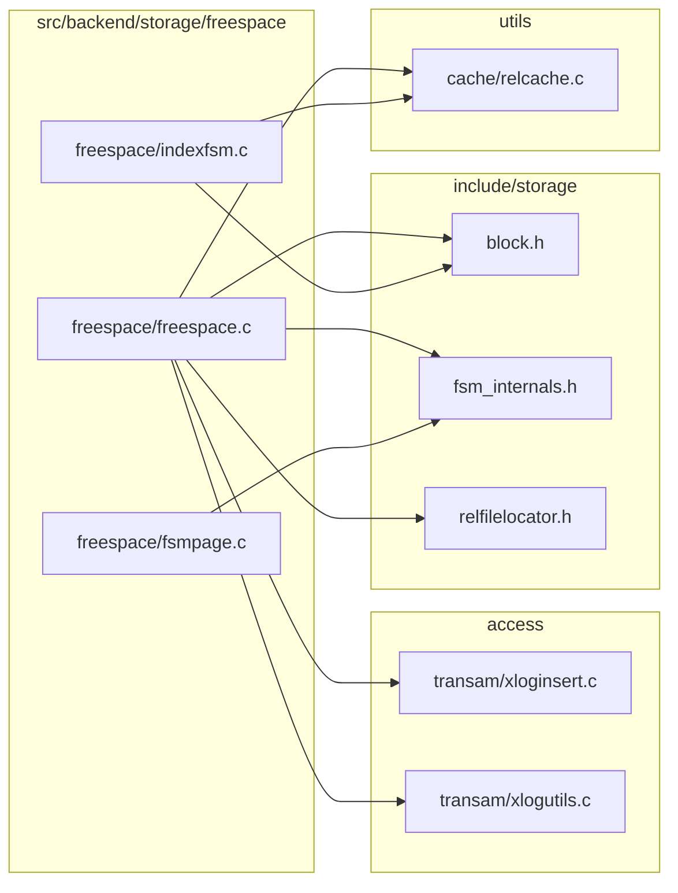

### `src/backend/storage/ipc`

```mermaid
graph LR
    subgraph "access"
        src_backend_access_transam_parallel_c["transam/parallel.c"]
        src_backend_access_transam_slru_c["transam/slru.c"]
        src_backend_access_transam_subtrans_c["transam/subtrans.c"]
        src_backend_access_transam_transam_c["transam/transam.c"]
        src_backend_access_transam_twophase_c["transam/twophase.c"]
        src_backend_access_transam_xloginsert_c["transam/xloginsert.c"]
        src_backend_access_transam_xlogrecovery_c["transam/xlogrecovery.c"]
        src_backend_access_transam_xlogutils_c["transam/xlogutils.c"]
    end
    subgraph "catalog"
        src_backend_catalog_catalog_c["catalog.c"]
    end
    subgraph "commands"
        src_backend_commands_async_c["async.c"]
        src_backend_commands_repack_c["repack.c"]
    end
    subgraph "common"
        src_common_file_perm_c["file_perm.c"]
        src_common_instr_time_c["instr_time.c"]
        src_common_pg_prng_c["pg_prng.c"]
    end
    subgraph "include/catalog"
        src_include_catalog_pg_authid_h["pg_authid.h"]
    end
    subgraph "include/port"
        src_include_port_pg_lfind_h["pg_lfind.h"]
        src_include_port_win32_msvc_unistd_h["win32_msvc/unistd.h"]
    end
    subgraph "include/portability"
        src_include_portability_mem_h["mem.h"]
    end
    subgraph "include/replication"
        src_include_replication_logicalworker_h["logicalworker.h"]
    end
    subgraph "include/storage"
        src_include_storage_locktag_h["locktag.h"]
        src_include_storage_pg_shmem_h["pg_shmem.h"]
        src_include_storage_procnumber_h["procnumber.h"]
        src_include_storage_relfilelocator_h["relfilelocator.h"]
        src_include_storage_shmem_internal_h["shmem_internal.h"]
        src_include_storage_spin_h["spin.h"]
        src_include_storage_standbydefs_h["standbydefs.h"]
        src_include_storage_subsystemlist_h["subsystemlist.h"]
        src_include_storage_subsystems_h["subsystems.h"]
    end
    subgraph "include/tcop"
        src_include_tcop_tcopprot_h["tcopprot.h"]
    end
    subgraph "include/utils"
        src_include_utils_hsearch_h["hsearch.h"]
        src_include_utils_snapshot_h["snapshot.h"]
        src_include_utils_wait_classes_h["wait_classes.h"]
    end
    subgraph "lib"
        src_backend_lib_dshash_c["dshash.c"]
        src_backend_lib_ilist_c["ilist.c"]
    end
    subgraph "libpq"
        src_backend_libpq_pqsignal_c["pqsignal.c"]
    end
    subgraph "port"
        src_backend_port_atomics_c["atomics.c"]
        src_port_pg_bitutils_c["pg_bitutils.c"]
        src_port_pg_numa_c["pg_numa.c"]
    end
    subgraph "postmaster"
        src_backend_postmaster_autovacuum_c["autovacuum.c"]
        src_backend_postmaster_bgworker_c["bgworker.c"]
        src_backend_postmaster_datachecksum_state_c["datachecksum_state.c"]
        src_backend_postmaster_postmaster_c["postmaster.c"]
        src_backend_postmaster_syslogger_c["syslogger.c"]
    end
    subgraph "replication"
        src_backend_replication_logical_logicalctl_c["logical/logicalctl.c"]
        src_backend_replication_logical_slotsync_c["logical/slotsync.c"]
        src_backend_replication_slot_c["slot.c"]
        src_backend_replication_walsender_c["walsender.c"]
    end
    subgraph "src/backend/storage/ipc"
        src_backend_storage_ipc_barrier_c["ipc/barrier.c"]
        src_backend_storage_ipc_dsm_c["ipc/dsm.c"]
        src_backend_storage_ipc_dsm_impl_c["ipc/dsm_impl.c"]
        src_backend_storage_ipc_dsm_registry_c["ipc/dsm_registry.c"]
        src_backend_storage_ipc_ipc_c["ipc/ipc.c"]
        src_backend_storage_ipc_ipci_c["ipc/ipci.c"]
        src_backend_storage_ipc_latch_c["ipc/latch.c"]
        src_backend_storage_ipc_pmsignal_c["ipc/pmsignal.c"]
        src_backend_storage_ipc_procarray_c["ipc/procarray.c"]
        src_backend_storage_ipc_procsignal_c["ipc/procsignal.c"]
        src_backend_storage_ipc_shm_mq_c["ipc/shm_mq.c"]
        src_backend_storage_ipc_shm_toc_c["ipc/shm_toc.c"]
        src_backend_storage_ipc_shmem_c["ipc/shmem.c"]
        src_backend_storage_ipc_shmem_hash_c["ipc/shmem_hash.c"]
        src_backend_storage_ipc_signalfuncs_c["ipc/signalfuncs.c"]
        src_backend_storage_ipc_sinval_c["ipc/sinval.c"]
        src_backend_storage_ipc_sinvaladt_c["ipc/sinvaladt.c"]
        src_backend_storage_ipc_standby_c["ipc/standby.c"]
        src_backend_storage_ipc_waiteventset_c["ipc/waiteventset.c"]
    end
    subgraph "utils"
        src_backend_utils_activity_wait_event_c["activity/wait_event.c"]
        src_backend_utils_adt_acl_c["adt/acl.c"]
        src_backend_utils_adt_timestamp_c["adt/timestamp.c"]
        src_backend_utils_cache_inval_c["cache/inval.c"]
        src_backend_utils_cache_relcache_c["cache/relcache.c"]
        src_backend_utils_fmgr_fmgr_c["fmgr/fmgr.c"]
        src_backend_utils_fmgr_funcapi_c["fmgr/funcapi.c"]
        src_backend_utils_misc_guc_c["misc/guc.c"]
        src_backend_utils_misc_injection_point_c["misc/injection_point.c"]
        src_backend_utils_misc_ps_status_c["misc/ps_status.c"]
        src_backend_utils_misc_timeout_c["misc/timeout.c"]
        src_backend_utils_mmgr_freepage_c["mmgr/freepage.c"]
        src_backend_utils_resowner_resowner_c["resowner/resowner.c"]
        src_backend_utils_sort_tuplestore_c["sort/tuplestore.c"]
        src_backend_utils_time_snapmgr_c["time/snapmgr.c"]
    end
    src_backend_storage_ipc_barrier_c --> src_include_storage_spin_h
    src_backend_storage_ipc_dsm_c --> src_backend_lib_ilist_c
    src_backend_storage_ipc_dsm_c --> src_backend_utils_mmgr_freepage_c
    src_backend_storage_ipc_dsm_c --> src_backend_utils_resowner_resowner_c
    src_backend_storage_ipc_dsm_c --> src_common_pg_prng_c
    src_backend_storage_ipc_dsm_c --> src_include_port_win32_msvc_unistd_h
    src_backend_storage_ipc_dsm_c --> src_include_storage_pg_shmem_h
    src_backend_storage_ipc_dsm_c --> src_include_storage_subsystems_h
    src_backend_storage_ipc_dsm_c --> src_port_pg_bitutils_c
    src_backend_storage_ipc_dsm_impl_c --> src_backend_libpq_pqsignal_c
    src_backend_storage_ipc_dsm_impl_c --> src_backend_postmaster_postmaster_c
    src_backend_storage_ipc_dsm_impl_c --> src_backend_utils_activity_wait_event_c
    src_backend_storage_ipc_dsm_impl_c --> src_backend_utils_misc_guc_c
    src_backend_storage_ipc_dsm_impl_c --> src_common_file_perm_c
    src_backend_storage_ipc_dsm_impl_c --> src_include_port_win32_msvc_unistd_h
    src_backend_storage_ipc_dsm_impl_c --> src_include_portability_mem_h
    src_backend_storage_ipc_dsm_registry_c --> src_backend_lib_dshash_c
    src_backend_storage_ipc_dsm_registry_c --> src_backend_utils_fmgr_funcapi_c
    src_backend_storage_ipc_dsm_registry_c --> src_backend_utils_sort_tuplestore_c
    src_backend_storage_ipc_dsm_registry_c --> src_include_storage_subsystems_h
    src_backend_storage_ipc_ipc_c --> src_backend_postmaster_autovacuum_c
    src_backend_storage_ipc_ipc_c --> src_include_port_win32_msvc_unistd_h
    src_backend_storage_ipc_ipc_c --> src_include_tcop_tcopprot_h
    src_backend_storage_ipc_ipci_c --> src_backend_utils_misc_guc_c
    src_backend_storage_ipc_ipci_c --> src_include_storage_pg_shmem_h
    src_backend_storage_ipc_ipci_c --> src_include_storage_shmem_internal_h
    src_backend_storage_ipc_ipci_c --> src_include_storage_subsystemlist_h
    src_backend_storage_ipc_ipci_c --> src_include_storage_subsystems_h
    src_backend_storage_ipc_latch_c --> src_backend_port_atomics_c
    src_backend_storage_ipc_latch_c --> src_backend_utils_resowner_resowner_c
    src_backend_storage_ipc_latch_c --> src_include_utils_wait_classes_h
    src_backend_storage_ipc_pmsignal_c --> src_backend_postmaster_postmaster_c
    src_backend_storage_ipc_pmsignal_c --> src_backend_replication_walsender_c
    src_backend_storage_ipc_pmsignal_c --> src_include_port_win32_msvc_unistd_h
    src_backend_storage_ipc_pmsignal_c --> src_include_storage_subsystems_h
    src_backend_storage_ipc_procarray_c --> src_backend_access_transam_subtrans_c
    src_backend_storage_ipc_procarray_c --> src_backend_access_transam_transam_c
    src_backend_storage_ipc_procarray_c --> src_backend_access_transam_twophase_c
    src_backend_storage_ipc_procarray_c --> src_backend_access_transam_xlogutils_c
    src_backend_storage_ipc_procarray_c --> src_backend_catalog_catalog_c
    src_backend_storage_ipc_procarray_c --> src_backend_postmaster_bgworker_c
    src_backend_storage_ipc_procarray_c --> src_backend_utils_activity_wait_event_c
    src_backend_storage_ipc_procarray_c --> src_backend_utils_adt_acl_c
    src_backend_storage_ipc_procarray_c --> src_backend_utils_cache_relcache_c
    src_backend_storage_ipc_procarray_c --> src_backend_utils_misc_injection_point_c
    src_backend_storage_ipc_procarray_c --> src_backend_utils_time_snapmgr_c
    src_backend_storage_ipc_procarray_c --> src_include_catalog_pg_authid_h
    src_backend_storage_ipc_procarray_c --> src_include_port_pg_lfind_h
    src_backend_storage_ipc_procarray_c --> src_include_storage_subsystems_h
    src_backend_storage_ipc_procarray_c --> src_include_utils_snapshot_h
    src_backend_storage_ipc_procsignal_c --> src_backend_access_transam_parallel_c
    src_backend_storage_ipc_procsignal_c --> src_backend_commands_async_c
    src_backend_storage_ipc_procsignal_c --> src_backend_commands_repack_c
    src_backend_storage_ipc_procsignal_c --> src_backend_postmaster_datachecksum_state_c
    src_backend_storage_ipc_procsignal_c --> src_backend_replication_logical_logicalctl_c
    src_backend_storage_ipc_procsignal_c --> src_backend_replication_logical_slotsync_c
    src_backend_storage_ipc_procsignal_c --> src_backend_replication_walsender_c
    src_backend_storage_ipc_procsignal_c --> src_backend_utils_activity_wait_event_c
    src_backend_storage_ipc_procsignal_c --> src_include_port_win32_msvc_unistd_h
    src_backend_storage_ipc_procsignal_c --> src_include_replication_logicalworker_h
    src_backend_storage_ipc_procsignal_c --> src_include_storage_procnumber_h
    src_backend_storage_ipc_procsignal_c --> src_include_storage_subsystems_h
    src_backend_storage_ipc_procsignal_c --> src_include_tcop_tcopprot_h
    src_backend_storage_ipc_procsignal_c --> src_port_pg_bitutils_c
    src_backend_storage_ipc_shm_mq_c --> src_backend_postmaster_bgworker_c
    src_backend_storage_ipc_shm_mq_c --> src_backend_utils_activity_wait_event_c
    src_backend_storage_ipc_shm_mq_c --> src_include_storage_spin_h
    src_backend_storage_ipc_shm_mq_c --> src_port_pg_bitutils_c
    src_backend_storage_ipc_shm_toc_c --> src_backend_port_atomics_c
    src_backend_storage_ipc_shm_toc_c --> src_include_storage_spin_h
    src_backend_storage_ipc_shmem_c --> src_backend_access_transam_slru_c
    src_backend_storage_ipc_shmem_c --> src_backend_utils_fmgr_fmgr_c
    src_backend_storage_ipc_shmem_c --> src_backend_utils_fmgr_funcapi_c
    src_backend_storage_ipc_shmem_c --> src_backend_utils_sort_tuplestore_c
    src_backend_storage_ipc_shmem_c --> src_include_port_win32_msvc_unistd_h
    src_backend_storage_ipc_shmem_c --> src_include_storage_pg_shmem_h
    src_backend_storage_ipc_shmem_c --> src_include_storage_shmem_internal_h
    src_backend_storage_ipc_shmem_c --> src_include_storage_spin_h
    src_backend_storage_ipc_shmem_c --> src_include_utils_hsearch_h
    src_backend_storage_ipc_shmem_c --> src_port_pg_bitutils_c
    src_backend_storage_ipc_shmem_c --> src_port_pg_numa_c
    src_backend_storage_ipc_shmem_hash_c --> src_include_storage_shmem_internal_h
    src_backend_storage_ipc_signalfuncs_c --> src_backend_postmaster_syslogger_c
    src_backend_storage_ipc_signalfuncs_c --> src_backend_utils_activity_wait_event_c
    src_backend_storage_ipc_signalfuncs_c --> src_backend_utils_adt_acl_c
    src_backend_storage_ipc_signalfuncs_c --> src_include_catalog_pg_authid_h
    src_backend_storage_ipc_sinval_c --> src_backend_utils_cache_inval_c
    src_backend_storage_ipc_sinval_c --> src_include_storage_relfilelocator_h
    src_backend_storage_ipc_sinvaladt_c --> src_include_port_win32_msvc_unistd_h
    src_backend_storage_ipc_sinvaladt_c --> src_include_storage_procnumber_h
    src_backend_storage_ipc_sinvaladt_c --> src_include_storage_spin_h
    src_backend_storage_ipc_sinvaladt_c --> src_include_storage_subsystems_h
    src_backend_storage_ipc_standby_c --> src_backend_access_transam_transam_c
    src_backend_storage_ipc_standby_c --> src_backend_access_transam_twophase_c
    src_backend_storage_ipc_standby_c --> src_backend_access_transam_xloginsert_c
    src_backend_storage_ipc_standby_c --> src_backend_access_transam_xlogrecovery_c
    src_backend_storage_ipc_standby_c --> src_backend_access_transam_xlogutils_c
    src_backend_storage_ipc_standby_c --> src_backend_replication_slot_c
    src_backend_storage_ipc_standby_c --> src_backend_utils_activity_wait_event_c
    src_backend_storage_ipc_standby_c --> src_backend_utils_adt_timestamp_c
    src_backend_storage_ipc_standby_c --> src_backend_utils_misc_injection_point_c
    src_backend_storage_ipc_standby_c --> src_backend_utils_misc_ps_status_c
    src_backend_storage_ipc_standby_c --> src_backend_utils_misc_timeout_c
    src_backend_storage_ipc_standby_c --> src_include_storage_locktag_h
    src_backend_storage_ipc_standby_c --> src_include_storage_relfilelocator_h
    src_backend_storage_ipc_standby_c --> src_include_storage_standbydefs_h
    src_backend_storage_ipc_standby_c --> src_include_utils_hsearch_h
    src_backend_storage_ipc_waiteventset_c --> src_backend_libpq_pqsignal_c
    src_backend_storage_ipc_waiteventset_c --> src_backend_port_atomics_c
    src_backend_storage_ipc_waiteventset_c --> src_backend_postmaster_postmaster_c
    src_backend_storage_ipc_waiteventset_c --> src_backend_utils_activity_wait_event_c
    src_backend_storage_ipc_waiteventset_c --> src_backend_utils_resowner_resowner_c
    src_backend_storage_ipc_waiteventset_c --> src_common_instr_time_c
    src_backend_storage_ipc_waiteventset_c --> src_include_port_win32_msvc_unistd_h
```

### `src/backend/storage/large_object`

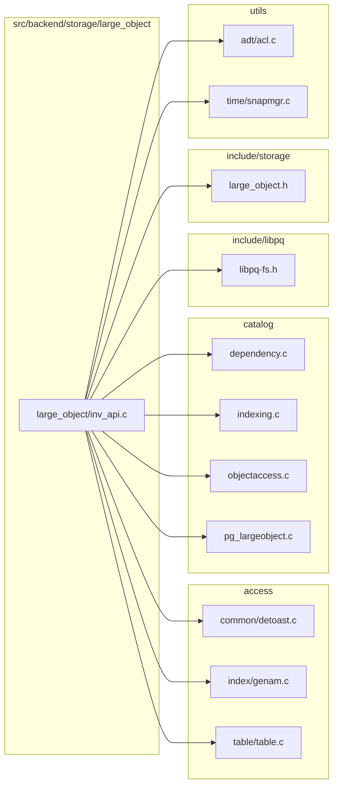

### `src/backend/storage/lmgr`

```mermaid
graph LR
    subgraph "access"
        src_backend_access_transam_clog_c["transam/clog.c"]
        src_backend_access_transam_parallel_c["transam/parallel.c"]
        src_backend_access_transam_slru_c["transam/slru.c"]
        src_backend_access_transam_subtrans_c["transam/subtrans.c"]
        src_backend_access_transam_transam_c["transam/transam.c"]
        src_backend_access_transam_twophase_c["transam/twophase.c"]
        src_backend_access_transam_twophase_rmgr_c["transam/twophase_rmgr.c"]
        src_backend_access_transam_xlog_c["transam/xlog.c"]
        src_backend_access_transam_xlogutils_c["transam/xlogutils.c"]
        src_backend_access_transam_xlogwait_c["transam/xlogwait.c"]
    end
    subgraph "catalog"
        src_backend_catalog_catalog_c["catalog.c"]
    end
    subgraph "common"
        src_common_instr_time_c["instr_time.c"]
        src_common_pg_prng_c["pg_prng.c"]
        src_common_stringinfo_c["stringinfo.c"]
    end
    subgraph "include/access"
        src_include_access_xlogdefs_h["xlogdefs.h"]
    end
    subgraph "include/commands"
        src_include_commands_progress_h["progress.h"]
    end
    subgraph "include/port"
        src_include_port_pg_lfind_h["pg_lfind.h"]
        src_include_port_win32_msvc_sys_time_h["win32_msvc/sys/time.h"]
        src_include_port_win32_msvc_unistd_h["win32_msvc/unistd.h"]
    end
    subgraph "include/storage"
        src_include_storage_lockdefs_h["lockdefs.h"]
        src_include_storage_locktag_h["locktag.h"]
        src_include_storage_lwlocklist_h["lwlocklist.h"]
        src_include_storage_pg_sema_h["pg_sema.h"]
        src_include_storage_predicate_internals_h["predicate_internals.h"]
        src_include_storage_proclist_h["proclist.h"]
        src_include_storage_proclist_types_h["proclist_types.h"]
        src_include_storage_procnumber_h["procnumber.h"]
        src_include_storage_spin_h["spin.h"]
        src_include_storage_subsystems_h["subsystems.h"]
    end
    subgraph "include/top"
        src_include_pg_trace_h["pg_trace.h"]
    end
    subgraph "include/utils"
        src_include_utils_guc_hooks_h["guc_hooks.h"]
        src_include_utils_hsearch_h["hsearch.h"]
        src_include_utils_snapshot_h["snapshot.h"]
    end
    subgraph "lib"
        src_backend_lib_ilist_c["ilist.c"]
    end
    subgraph "port"
        src_backend_port_atomics_c["atomics.c"]
        src_port_pg_bitutils_c["pg_bitutils.c"]
    end
    subgraph "postmaster"
        src_backend_postmaster_autovacuum_c["autovacuum.c"]
    end
    subgraph "replication"
        src_backend_replication_logical_slotsync_c["logical/slotsync.c"]
        src_backend_replication_syncrep_c["syncrep.c"]
    end
    subgraph "src/backend/storage/lmgr"
        src_backend_storage_lmgr_condition_variable_c["lmgr/condition_variable.c"]
        src_backend_storage_lmgr_deadlock_c["lmgr/deadlock.c"]
        src_backend_storage_lmgr_lmgr_c["lmgr/lmgr.c"]
        src_backend_storage_lmgr_lock_c["lmgr/lock.c"]
        src_backend_storage_lmgr_lwlock_c["lmgr/lwlock.c"]
        src_backend_storage_lmgr_predicate_c["lmgr/predicate.c"]
        src_backend_storage_lmgr_proc_c["lmgr/proc.c"]
        src_backend_storage_lmgr_s_lock_c["lmgr/s_lock.c"]
    end
    subgraph "utils"
        src_backend_utils_activity_wait_event_c["activity/wait_event.c"]
        src_backend_utils_adt_timestamp_c["adt/timestamp.c"]
        src_backend_utils_cache_inval_c["cache/inval.c"]
        src_backend_utils_cache_relcache_c["cache/relcache.c"]
        src_backend_utils_misc_injection_point_c["misc/injection_point.c"]
        src_backend_utils_misc_ps_status_c["misc/ps_status.c"]
        src_backend_utils_misc_timeout_c["misc/timeout.c"]
        src_backend_utils_resowner_resowner_c["resowner/resowner.c"]
        src_backend_utils_time_snapmgr_c["time/snapmgr.c"]
    end
    src_backend_storage_lmgr_condition_variable_c --> src_common_instr_time_c
    src_backend_storage_lmgr_condition_variable_c --> src_include_storage_proclist_h
    src_backend_storage_lmgr_condition_variable_c --> src_include_storage_proclist_types_h
    src_backend_storage_lmgr_condition_variable_c --> src_include_storage_spin_h
    src_backend_storage_lmgr_deadlock_c --> src_include_pg_trace_h
    src_backend_storage_lmgr_deadlock_c --> src_include_storage_procnumber_h
    src_backend_storage_lmgr_lmgr_c --> src_backend_access_transam_subtrans_c
    src_backend_storage_lmgr_lmgr_c --> src_backend_catalog_catalog_c
    src_backend_storage_lmgr_lmgr_c --> src_backend_utils_cache_inval_c
    src_backend_storage_lmgr_lmgr_c --> src_common_stringinfo_c
    src_backend_storage_lmgr_lmgr_c --> src_include_commands_progress_h
    src_backend_storage_lmgr_lmgr_c --> src_include_storage_locktag_h
    src_backend_storage_lmgr_lock_c --> src_backend_access_transam_transam_c
    src_backend_storage_lmgr_lock_c --> src_backend_access_transam_twophase_c
    src_backend_storage_lmgr_lock_c --> src_backend_access_transam_twophase_rmgr_c
    src_backend_storage_lmgr_lock_c --> src_backend_access_transam_xlog_c
    src_backend_storage_lmgr_lock_c --> src_backend_access_transam_xlogutils_c
    src_backend_storage_lmgr_lock_c --> src_backend_lib_ilist_c
    src_backend_storage_lmgr_lock_c --> src_backend_utils_adt_timestamp_c
    src_backend_storage_lmgr_lock_c --> src_backend_utils_misc_ps_status_c
    src_backend_storage_lmgr_lock_c --> src_backend_utils_resowner_resowner_c
    src_backend_storage_lmgr_lock_c --> src_include_pg_trace_h
    src_backend_storage_lmgr_lock_c --> src_include_port_win32_msvc_unistd_h
    src_backend_storage_lmgr_lock_c --> src_include_storage_lockdefs_h
    src_backend_storage_lmgr_lock_c --> src_include_storage_locktag_h
    src_backend_storage_lmgr_lock_c --> src_include_storage_procnumber_h
    src_backend_storage_lmgr_lock_c --> src_include_storage_spin_h
    src_backend_storage_lmgr_lock_c --> src_include_storage_subsystems_h
    src_backend_storage_lmgr_lwlock_c --> src_backend_port_atomics_c
    src_backend_storage_lmgr_lwlock_c --> src_backend_utils_activity_wait_event_c
    src_backend_storage_lmgr_lwlock_c --> src_include_pg_trace_h
    src_backend_storage_lmgr_lwlock_c --> src_include_storage_lwlocklist_h
    src_backend_storage_lmgr_lwlock_c --> src_include_storage_proclist_h
    src_backend_storage_lmgr_lwlock_c --> src_include_storage_proclist_types_h
    src_backend_storage_lmgr_lwlock_c --> src_include_storage_procnumber_h
    src_backend_storage_lmgr_lwlock_c --> src_include_storage_spin_h
    src_backend_storage_lmgr_lwlock_c --> src_include_storage_subsystems_h
    src_backend_storage_lmgr_lwlock_c --> src_include_utils_hsearch_h
    src_backend_storage_lmgr_lwlock_c --> src_port_pg_bitutils_c
    src_backend_storage_lmgr_predicate_c --> src_backend_access_transam_parallel_c
    src_backend_storage_lmgr_predicate_c --> src_backend_access_transam_slru_c
    src_backend_storage_lmgr_predicate_c --> src_backend_access_transam_transam_c
    src_backend_storage_lmgr_predicate_c --> src_backend_access_transam_twophase_c
    src_backend_storage_lmgr_predicate_c --> src_backend_access_transam_twophase_rmgr_c
    src_backend_storage_lmgr_predicate_c --> src_backend_access_transam_xlog_c
    src_backend_storage_lmgr_predicate_c --> src_backend_utils_activity_wait_event_c
    src_backend_storage_lmgr_predicate_c --> src_backend_utils_cache_relcache_c
    src_backend_storage_lmgr_predicate_c --> src_backend_utils_time_snapmgr_c
    src_backend_storage_lmgr_predicate_c --> src_include_port_pg_lfind_h
    src_backend_storage_lmgr_predicate_c --> src_include_storage_predicate_internals_h
    src_backend_storage_lmgr_predicate_c --> src_include_storage_subsystems_h
    src_backend_storage_lmgr_predicate_c --> src_include_utils_guc_hooks_h
    src_backend_storage_lmgr_predicate_c --> src_include_utils_snapshot_h
    src_backend_storage_lmgr_proc_c --> src_backend_access_transam_clog_c
    src_backend_storage_lmgr_proc_c --> src_backend_access_transam_transam_c
    src_backend_storage_lmgr_proc_c --> src_backend_access_transam_twophase_c
    src_backend_storage_lmgr_proc_c --> src_backend_access_transam_xlogutils_c
    src_backend_storage_lmgr_proc_c --> src_backend_access_transam_xlogwait_c
    src_backend_storage_lmgr_proc_c --> src_backend_lib_ilist_c
    src_backend_storage_lmgr_proc_c --> src_backend_postmaster_autovacuum_c
    src_backend_storage_lmgr_proc_c --> src_backend_replication_logical_slotsync_c
    src_backend_storage_lmgr_proc_c --> src_backend_replication_syncrep_c
    src_backend_storage_lmgr_proc_c --> src_backend_utils_activity_wait_event_c
    src_backend_storage_lmgr_proc_c --> src_backend_utils_adt_timestamp_c
    src_backend_storage_lmgr_proc_c --> src_backend_utils_misc_injection_point_c
    src_backend_storage_lmgr_proc_c --> src_backend_utils_misc_timeout_c
    src_backend_storage_lmgr_proc_c --> src_include_access_xlogdefs_h
    src_backend_storage_lmgr_proc_c --> src_include_port_win32_msvc_sys_time_h
    src_backend_storage_lmgr_proc_c --> src_include_port_win32_msvc_unistd_h
    src_backend_storage_lmgr_proc_c --> src_include_storage_pg_sema_h
    src_backend_storage_lmgr_proc_c --> src_include_storage_proclist_types_h
    src_backend_storage_lmgr_proc_c --> src_include_storage_procnumber_h
    src_backend_storage_lmgr_proc_c --> src_include_storage_spin_h
    src_backend_storage_lmgr_proc_c --> src_include_storage_subsystems_h
    src_backend_storage_lmgr_s_lock_c --> src_backend_utils_activity_wait_event_c
    src_backend_storage_lmgr_s_lock_c --> src_common_pg_prng_c
    src_backend_storage_lmgr_s_lock_c --> src_include_port_win32_msvc_sys_time_h
    src_backend_storage_lmgr_s_lock_c --> src_include_port_win32_msvc_unistd_h
```

### `src/backend/storage/page`

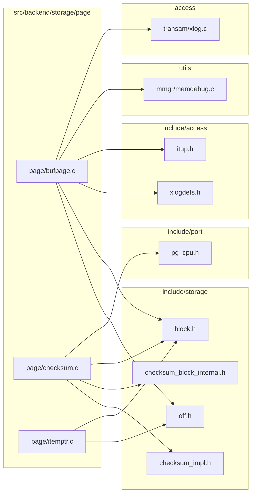

### `src/backend/storage/smgr`

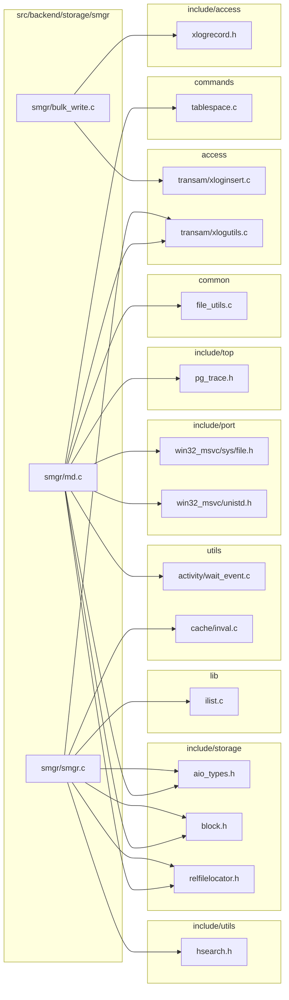

### `src/backend/storage/sync`

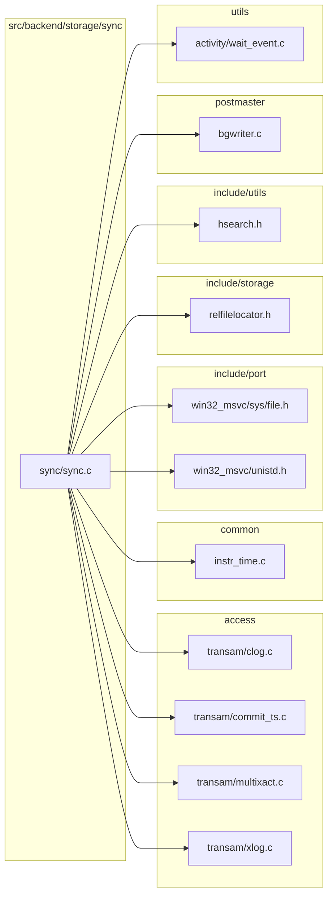
