# `tsearch` — file-level dependencies

Arrows point from the file that does the `#include` to the file
it needs.  Ubiquitous modules (see [README](README.md)) are
omitted.  Node names are relative to the subsystem directory;
external nodes are grouped by their subsystem.

## All dependencies

```mermaid
graph LR
    subgraph "catalog"
        src_backend_catalog_namespace_c["namespace.c"]
        src_backend_catalog_pg_collation_c["pg_collation.c"]
        src_backend_catalog_pg_operator_c["pg_operator.c"]
    end
    subgraph "commands"
        src_backend_commands_vacuum_c["vacuum.c"]
    end
    subgraph "common"
        src_common_hashfn_c["hashfn.c"]
        src_common_string_c["string.c"]
        src_common_stringinfo_c["stringinfo.c"]
    end
    subgraph "include/catalog"
        src_include_catalog_pg_statistic_h["pg_statistic.h"]
    end
    subgraph "include/commands"
        src_include_commands_defrem_h["defrem.h"]
    end
    subgraph "include/mb"
        src_include_mb_pg_wchar_h["pg_wchar.h"]
    end
    subgraph "include/nodes"
        src_include_nodes_nodes_h["nodes.h"]
        src_include_nodes_pg_list_h["pg_list.h"]
    end
    subgraph "include/regex"
        src_include_regex_regex_h["regex.h"]
    end
    subgraph "include/top"
        src_include_varatt_h["varatt.h"]
    end
    subgraph "include/tsearch"
        src_include_tsearch_ts_public_h["ts_public.h"]
        src_include_tsearch_ts_type_h["ts_type.h"]
    end
    subgraph "include/utils"
        src_include_utils_array_h["array.h"]
    end
    subgraph "storage"
        src_backend_storage_file_fd_c["file/fd.c"]
    end
    subgraph "tsearch"
        src_backend_tsearch_dict_c["dict.c"]
        src_backend_tsearch_dict_ispell_c["dict_ispell.c"]
        src_backend_tsearch_dict_simple_c["dict_simple.c"]
        src_backend_tsearch_dict_synonym_c["dict_synonym.c"]
        src_backend_tsearch_dict_thesaurus_c["dict_thesaurus.c"]
        src_backend_tsearch_regis_c["regis.c"]
        src_backend_tsearch_spell_c["spell.c"]
        src_backend_tsearch_to_tsany_c["to_tsany.c"]
        src_backend_tsearch_ts_locale_c["ts_locale.c"]
        src_backend_tsearch_ts_parse_c["ts_parse.c"]
        src_backend_tsearch_ts_selfuncs_c["ts_selfuncs.c"]
        src_backend_tsearch_ts_typanalyze_c["ts_typanalyze.c"]
        src_backend_tsearch_ts_utils_c["ts_utils.c"]
        src_backend_tsearch_wparser_c["wparser.c"]
        src_backend_tsearch_wparser_def_c["wparser_def.c"]
    end
    subgraph "utils"
        src_backend_utils_adt_formatting_c["adt/formatting.c"]
        src_backend_utils_adt_jsonfuncs_c["adt/jsonfuncs.c"]
        src_backend_utils_adt_pg_locale_c["adt/pg_locale.c"]
        src_backend_utils_adt_regproc_c["adt/regproc.c"]
        src_backend_utils_adt_selfuncs_c["adt/selfuncs.c"]
        src_backend_utils_adt_varlena_c["adt/varlena.c"]
        src_backend_utils_cache_ts_cache_c["cache/ts_cache.c"]
        src_backend_utils_fmgr_funcapi_c["fmgr/funcapi.c"]
    end
    src_backend_tsearch_dict_c --> src_backend_utils_cache_ts_cache_c
    src_backend_tsearch_dict_c --> src_include_tsearch_ts_public_h
    src_backend_tsearch_dict_c --> src_include_utils_array_h
    src_backend_tsearch_dict_ispell_c --> src_backend_tsearch_spell_c
    src_backend_tsearch_dict_ispell_c --> src_backend_utils_adt_formatting_c
    src_backend_tsearch_dict_ispell_c --> src_include_commands_defrem_h
    src_backend_tsearch_dict_ispell_c --> src_include_tsearch_ts_public_h
    src_backend_tsearch_dict_simple_c --> src_backend_utils_adt_formatting_c
    src_backend_tsearch_dict_simple_c --> src_include_commands_defrem_h
    src_backend_tsearch_dict_simple_c --> src_include_tsearch_ts_public_h
    src_backend_tsearch_dict_synonym_c --> src_backend_tsearch_ts_locale_c
    src_backend_tsearch_dict_synonym_c --> src_backend_utils_adt_formatting_c
    src_backend_tsearch_dict_synonym_c --> src_include_commands_defrem_h
    src_backend_tsearch_dict_synonym_c --> src_include_tsearch_ts_public_h
    src_backend_tsearch_dict_thesaurus_c --> src_backend_catalog_namespace_c
    src_backend_tsearch_dict_thesaurus_c --> src_backend_tsearch_ts_locale_c
    src_backend_tsearch_dict_thesaurus_c --> src_backend_utils_adt_regproc_c
    src_backend_tsearch_dict_thesaurus_c --> src_backend_utils_cache_ts_cache_c
    src_backend_tsearch_dict_thesaurus_c --> src_include_commands_defrem_h
    src_backend_tsearch_dict_thesaurus_c --> src_include_tsearch_ts_public_h
    src_backend_tsearch_regis_c --> src_backend_tsearch_ts_locale_c
    src_backend_tsearch_spell_c --> src_backend_catalog_pg_collation_c
    src_backend_tsearch_spell_c --> src_backend_tsearch_regis_c
    src_backend_tsearch_spell_c --> src_backend_tsearch_ts_locale_c
    src_backend_tsearch_spell_c --> src_backend_utils_adt_formatting_c
    src_backend_tsearch_spell_c --> src_include_regex_regex_h
    src_backend_tsearch_spell_c --> src_include_tsearch_ts_public_h
    src_backend_tsearch_to_tsany_c --> src_backend_tsearch_ts_utils_c
    src_backend_tsearch_to_tsany_c --> src_backend_utils_adt_jsonfuncs_c
    src_backend_tsearch_to_tsany_c --> src_backend_utils_cache_ts_cache_c
    src_backend_tsearch_ts_locale_c --> src_backend_storage_file_fd_c
    src_backend_tsearch_ts_locale_c --> src_backend_utils_adt_pg_locale_c
    src_backend_tsearch_ts_locale_c --> src_common_string_c
    src_backend_tsearch_ts_locale_c --> src_common_stringinfo_c
    src_backend_tsearch_ts_locale_c --> src_include_mb_pg_wchar_h
    src_backend_tsearch_ts_parse_c --> src_backend_tsearch_ts_utils_c
    src_backend_tsearch_ts_parse_c --> src_backend_utils_cache_ts_cache_c
    src_backend_tsearch_ts_parse_c --> src_include_varatt_h
    src_backend_tsearch_ts_selfuncs_c --> src_backend_utils_adt_selfuncs_c
    src_backend_tsearch_ts_selfuncs_c --> src_include_catalog_pg_statistic_h
    src_backend_tsearch_ts_selfuncs_c --> src_include_nodes_nodes_h
    src_backend_tsearch_ts_selfuncs_c --> src_include_tsearch_ts_type_h
    src_backend_tsearch_ts_typanalyze_c --> src_backend_catalog_pg_collation_c
    src_backend_tsearch_ts_typanalyze_c --> src_backend_catalog_pg_operator_c
    src_backend_tsearch_ts_typanalyze_c --> src_backend_commands_vacuum_c
    src_backend_tsearch_ts_typanalyze_c --> src_common_hashfn_c
    src_backend_tsearch_ts_typanalyze_c --> src_include_tsearch_ts_type_h
    src_backend_tsearch_ts_typanalyze_c --> src_include_varatt_h
    src_backend_tsearch_ts_utils_c --> src_backend_tsearch_ts_locale_c
    src_backend_tsearch_ts_utils_c --> src_include_nodes_pg_list_h
    src_backend_tsearch_ts_utils_c --> src_include_tsearch_ts_public_h
    src_backend_tsearch_ts_utils_c --> src_include_tsearch_ts_type_h
    src_backend_tsearch_wparser_c --> src_backend_catalog_namespace_c
    src_backend_tsearch_wparser_c --> src_backend_tsearch_ts_utils_c
    src_backend_tsearch_wparser_c --> src_backend_utils_adt_jsonfuncs_c
    src_backend_tsearch_wparser_c --> src_backend_utils_adt_varlena_c
    src_backend_tsearch_wparser_c --> src_backend_utils_cache_ts_cache_c
    src_backend_tsearch_wparser_c --> src_backend_utils_fmgr_funcapi_c
    src_backend_tsearch_wparser_c --> src_include_commands_defrem_h
    src_backend_tsearch_wparser_def_c --> src_backend_tsearch_ts_utils_c
    src_backend_tsearch_wparser_def_c --> src_backend_utils_adt_pg_locale_c
    src_backend_tsearch_wparser_def_c --> src_include_commands_defrem_h
    src_backend_tsearch_wparser_def_c --> src_include_mb_pg_wchar_h
    src_backend_tsearch_wparser_def_c --> src_include_tsearch_ts_public_h
    src_backend_tsearch_wparser_def_c --> src_include_tsearch_ts_type_h
```

