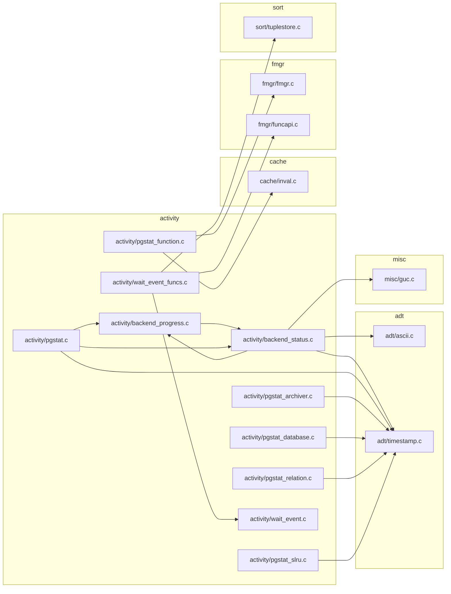
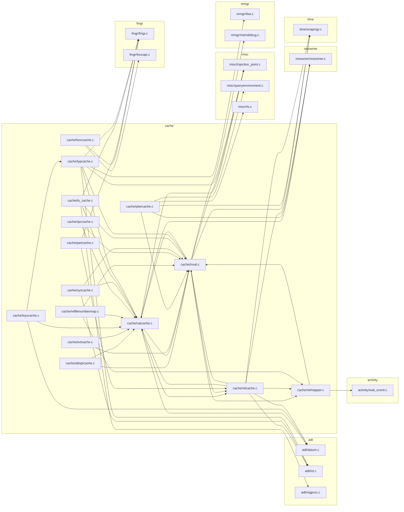
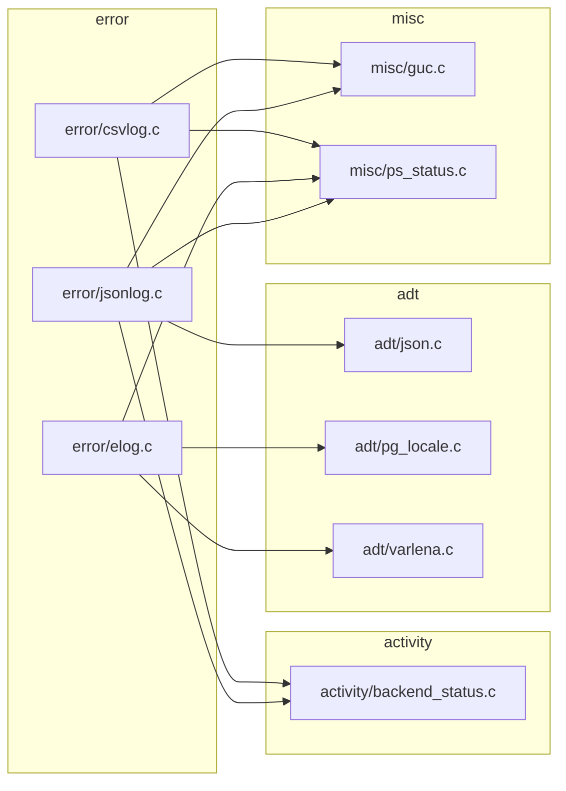
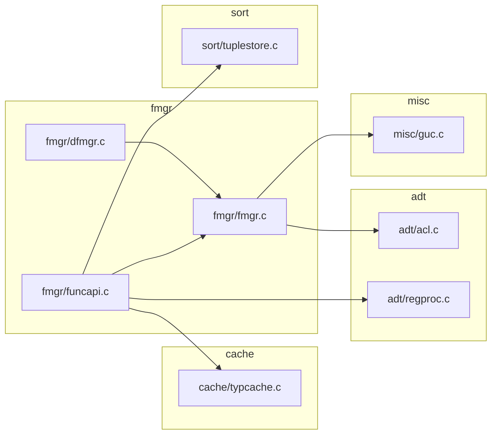
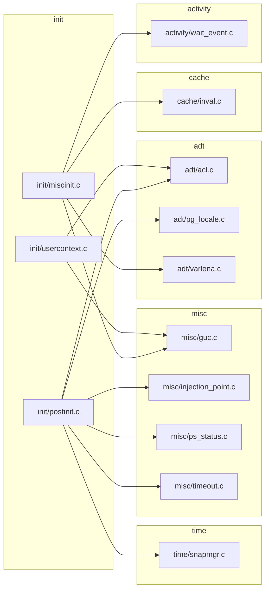
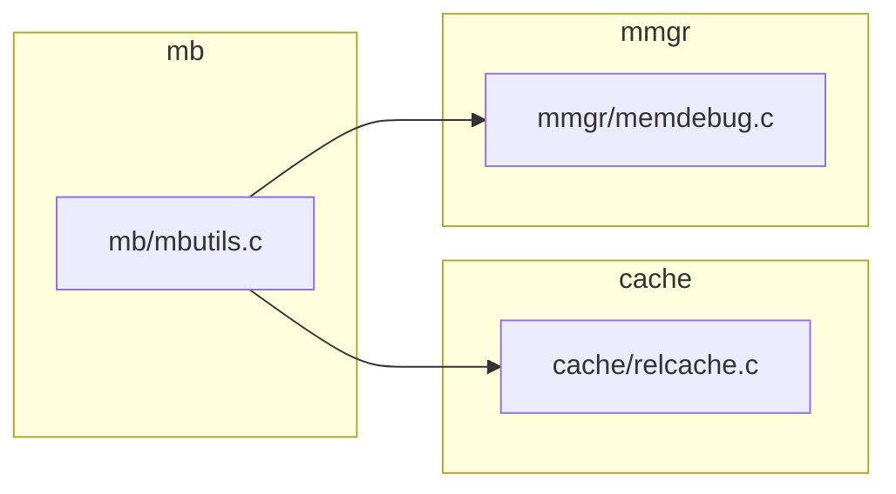
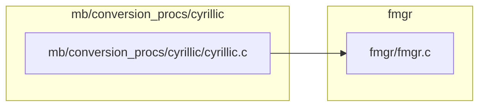
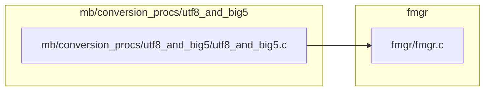
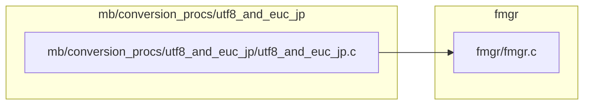
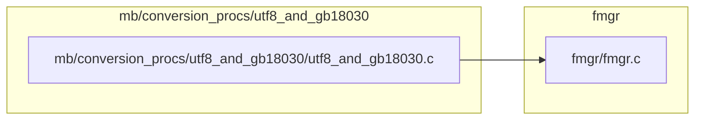

# `utils` — file-level dependencies

Arrows point from the file that does the `#include` to the file
it needs.  Ubiquitous modules (see [README](README.md)) are
omitted.  Node names are relative to the subsystem directory;
external nodes are grouped by their subsystem.

## Internal structure

### from `activity`



### from `adt`

```mermaid
graph LR
    subgraph "activity"
        src_backend_utils_activity_wait_event_c["activity/wait_event.c"]
    end
    subgraph "adt"
        src_backend_utils_adt_acl_c["adt/acl.c"]
        src_backend_utils_adt_array_selfuncs_c["adt/array_selfuncs.c"]
        src_backend_utils_adt_array_typanalyze_c["adt/array_typanalyze.c"]
        src_backend_utils_adt_array_userfuncs_c["adt/array_userfuncs.c"]
        src_backend_utils_adt_arrayfuncs_c["adt/arrayfuncs.c"]
        src_backend_utils_adt_arrayutils_c["adt/arrayutils.c"]
        src_backend_utils_adt_bytea_c["adt/bytea.c"]
        src_backend_utils_adt_cash_c["adt/cash.c"]
        src_backend_utils_adt_date_c["adt/date.c"]
        src_backend_utils_adt_datetime_c["adt/datetime.c"]
        src_backend_utils_adt_datum_c["adt/datum.c"]
        src_backend_utils_adt_dbsize_c["adt/dbsize.c"]
        src_backend_utils_adt_ddlutils_c["adt/ddlutils.c"]
        src_backend_utils_adt_domains_c["adt/domains.c"]
        src_backend_utils_adt_enum_c["adt/enum.c"]
        src_backend_utils_adt_expandeddatum_c["adt/expandeddatum.c"]
        src_backend_utils_adt_expandedrecord_c["adt/expandedrecord.c"]
        src_backend_utils_adt_float_c["adt/float.c"]
        src_backend_utils_adt_format_type_c["adt/format_type.c"]
        src_backend_utils_adt_formatting_c["adt/formatting.c"]
        src_backend_utils_adt_genfile_c["adt/genfile.c"]
        src_backend_utils_adt_geo_ops_c["adt/geo_ops.c"]
        src_backend_utils_adt_geo_spgist_c["adt/geo_spgist.c"]
        src_backend_utils_adt_hbafuncs_c["adt/hbafuncs.c"]
        src_backend_utils_adt_int_c["adt/int.c"]
        src_backend_utils_adt_int8_c["adt/int8.c"]
        src_backend_utils_adt_json_c["adt/json.c"]
        src_backend_utils_adt_jsonb_c["adt/jsonb.c"]
        src_backend_utils_adt_jsonb_gin_c["adt/jsonb_gin.c"]
        src_backend_utils_adt_jsonb_op_c["adt/jsonb_op.c"]
        src_backend_utils_adt_jsonb_util_c["adt/jsonb_util.c"]
        src_backend_utils_adt_jsonbsubs_c["adt/jsonbsubs.c"]
        src_backend_utils_adt_jsonfuncs_c["adt/jsonfuncs.c"]
        src_backend_utils_adt_jsonpath_c["adt/jsonpath.c"]
        src_backend_utils_adt_jsonpath_exec_c["adt/jsonpath_exec.c"]
        src_backend_utils_adt_levenshtein_c["adt/levenshtein.c"]
        src_backend_utils_adt_like_c["adt/like.c"]
        src_backend_utils_adt_like_match_c["adt/like_match.c"]
        src_backend_utils_adt_like_support_c["adt/like_support.c"]
        src_backend_utils_adt_lockfuncs_c["adt/lockfuncs.c"]
        src_backend_utils_adt_mac_c["adt/mac.c"]
        src_backend_utils_adt_mcxtfuncs_c["adt/mcxtfuncs.c"]
        src_backend_utils_adt_misc_c["adt/misc.c"]
        src_backend_utils_adt_multirangetypes_c["adt/multirangetypes.c"]
        src_backend_utils_adt_multirangetypes_selfuncs_c["adt/multirangetypes_selfuncs.c"]
        src_backend_utils_adt_multixactfuncs_c["adt/multixactfuncs.c"]
        src_backend_utils_adt_name_c["adt/name.c"]
        src_backend_utils_adt_network_c["adt/network.c"]
        src_backend_utils_adt_network_selfuncs_c["adt/network_selfuncs.c"]
        src_backend_utils_adt_numeric_c["adt/numeric.c"]
        src_backend_utils_adt_numutils_c["adt/numutils.c"]
        src_backend_utils_adt_oid_c["adt/oid.c"]
        src_backend_utils_adt_oracle_compat_c["adt/oracle_compat.c"]
        src_backend_utils_adt_orderedsetaggs_c["adt/orderedsetaggs.c"]
        src_backend_utils_adt_partitionfuncs_c["adt/partitionfuncs.c"]
        src_backend_utils_adt_pg_dependencies_c["adt/pg_dependencies.c"]
        src_backend_utils_adt_pg_locale_c["adt/pg_locale.c"]
        src_backend_utils_adt_pg_locale_builtin_c["adt/pg_locale_builtin.c"]
        src_backend_utils_adt_pg_locale_icu_c["adt/pg_locale_icu.c"]
        src_backend_utils_adt_pg_locale_libc_c["adt/pg_locale_libc.c"]
        src_backend_utils_adt_pg_lsn_c["adt/pg_lsn.c"]
        src_backend_utils_adt_pg_ndistinct_c["adt/pg_ndistinct.c"]
        src_backend_utils_adt_pg_upgrade_support_c["adt/pg_upgrade_support.c"]
        src_backend_utils_adt_pgstatfuncs_c["adt/pgstatfuncs.c"]
        src_backend_utils_adt_pseudorandomfuncs_c["adt/pseudorandomfuncs.c"]
        src_backend_utils_adt_rangetypes_c["adt/rangetypes.c"]
        src_backend_utils_adt_rangetypes_gist_c["adt/rangetypes_gist.c"]
        src_backend_utils_adt_rangetypes_selfuncs_c["adt/rangetypes_selfuncs.c"]
        src_backend_utils_adt_rangetypes_spgist_c["adt/rangetypes_spgist.c"]
        src_backend_utils_adt_rangetypes_typanalyze_c["adt/rangetypes_typanalyze.c"]
        src_backend_utils_adt_regexp_c["adt/regexp.c"]
        src_backend_utils_adt_regproc_c["adt/regproc.c"]
        src_backend_utils_adt_ri_triggers_c["adt/ri_triggers.c"]
        src_backend_utils_adt_rowtypes_c["adt/rowtypes.c"]
        src_backend_utils_adt_ruleutils_c["adt/ruleutils.c"]
        src_backend_utils_adt_selfuncs_c["adt/selfuncs.c"]
        src_backend_utils_adt_skipsupport_c["adt/skipsupport.c"]
        src_backend_utils_adt_tid_c["adt/tid.c"]
        src_backend_utils_adt_timestamp_c["adt/timestamp.c"]
        src_backend_utils_adt_tsgistidx_c["adt/tsgistidx.c"]
        src_backend_utils_adt_tsquery_c["adt/tsquery.c"]
        src_backend_utils_adt_tsquery_gist_c["adt/tsquery_gist.c"]
        src_backend_utils_adt_tsvector_c["adt/tsvector.c"]
        src_backend_utils_adt_tsvector_op_c["adt/tsvector_op.c"]
        src_backend_utils_adt_uuid_c["adt/uuid.c"]
        src_backend_utils_adt_varbit_c["adt/varbit.c"]
        src_backend_utils_adt_varchar_c["adt/varchar.c"]
        src_backend_utils_adt_varlena_c["adt/varlena.c"]
        src_backend_utils_adt_waitfuncs_c["adt/waitfuncs.c"]
        src_backend_utils_adt_xid_c["adt/xid.c"]
        src_backend_utils_adt_xid8funcs_c["adt/xid8funcs.c"]
        src_backend_utils_adt_xml_c["adt/xml.c"]
    end
    subgraph "cache"
        src_backend_utils_cache_catcache_c["cache/catcache.c"]
        src_backend_utils_cache_inval_c["cache/inval.c"]
        src_backend_utils_cache_partcache_c["cache/partcache.c"]
        src_backend_utils_cache_relcache_c["cache/relcache.c"]
        src_backend_utils_cache_relfilenumbermap_c["cache/relfilenumbermap.c"]
        src_backend_utils_cache_relmapper_c["cache/relmapper.c"]
        src_backend_utils_cache_spccache_c["cache/spccache.c"]
        src_backend_utils_cache_typcache_c["cache/typcache.c"]
    end
    subgraph "fmgr"
        src_backend_utils_fmgr_fmgr_c["fmgr/fmgr.c"]
        src_backend_utils_fmgr_funcapi_c["fmgr/funcapi.c"]
    end
    subgraph "hash"
        src_backend_utils_hash_pg_crc_c["hash/pg_crc.c"]
    end
    subgraph "misc"
        src_backend_utils_misc_guc_c["misc/guc.c"]
        src_backend_utils_misc_rls_c["misc/rls.c"]
        src_backend_utils_misc_tzparser_c["misc/tzparser.c"]
    end
    subgraph "sort"
        src_backend_utils_sort_sortsupport_c["sort/sortsupport.c"]
        src_backend_utils_sort_tuplesort_c["sort/tuplesort.c"]
        src_backend_utils_sort_tuplestore_c["sort/tuplestore.c"]
    end
    subgraph "time"
        src_backend_utils_time_snapmgr_c["time/snapmgr.c"]
    end
    src_backend_utils_adt_acl_c --> src_backend_utils_adt_varlena_c
    src_backend_utils_adt_acl_c --> src_backend_utils_cache_catcache_c
    src_backend_utils_adt_acl_c --> src_backend_utils_cache_inval_c
    src_backend_utils_adt_acl_c --> src_backend_utils_fmgr_funcapi_c
    src_backend_utils_adt_acl_c --> src_backend_utils_time_snapmgr_c
    src_backend_utils_adt_array_selfuncs_c --> src_backend_utils_adt_selfuncs_c
    src_backend_utils_adt_array_selfuncs_c --> src_backend_utils_cache_typcache_c
    src_backend_utils_adt_array_typanalyze_c --> src_backend_utils_adt_datum_c
    src_backend_utils_adt_array_typanalyze_c --> src_backend_utils_cache_typcache_c
    src_backend_utils_adt_array_userfuncs_c --> src_backend_utils_adt_datum_c
    src_backend_utils_adt_array_userfuncs_c --> src_backend_utils_adt_int_c
    src_backend_utils_adt_array_userfuncs_c --> src_backend_utils_cache_typcache_c
    src_backend_utils_adt_array_userfuncs_c --> src_backend_utils_sort_tuplesort_c
    src_backend_utils_adt_arrayfuncs_c --> src_backend_utils_adt_datum_c
    src_backend_utils_adt_arrayfuncs_c --> src_backend_utils_adt_int_c
    src_backend_utils_adt_arrayfuncs_c --> src_backend_utils_adt_selfuncs_c
    src_backend_utils_adt_arrayfuncs_c --> src_backend_utils_cache_typcache_c
    src_backend_utils_adt_arrayfuncs_c --> src_backend_utils_fmgr_funcapi_c
    src_backend_utils_adt_arrayutils_c --> src_backend_utils_adt_int_c
    src_backend_utils_adt_bytea_c --> src_backend_utils_adt_int_c
    src_backend_utils_adt_bytea_c --> src_backend_utils_adt_uuid_c
    src_backend_utils_adt_bytea_c --> src_backend_utils_fmgr_fmgr_c
    src_backend_utils_adt_bytea_c --> src_backend_utils_misc_guc_c
    src_backend_utils_adt_bytea_c --> src_backend_utils_sort_sortsupport_c
    src_backend_utils_adt_cash_c --> src_backend_utils_adt_float_c
    src_backend_utils_adt_cash_c --> src_backend_utils_adt_int_c
    src_backend_utils_adt_cash_c --> src_backend_utils_adt_numeric_c
    src_backend_utils_adt_cash_c --> src_backend_utils_adt_pg_locale_c
    src_backend_utils_adt_cash_c --> src_backend_utils_fmgr_fmgr_c
    src_backend_utils_adt_date_c --> src_backend_utils_adt_datetime_c
    src_backend_utils_adt_date_c --> src_backend_utils_adt_float_c
    src_backend_utils_adt_date_c --> src_backend_utils_adt_int_c
    src_backend_utils_adt_date_c --> src_backend_utils_adt_numeric_c
    src_backend_utils_adt_date_c --> src_backend_utils_adt_skipsupport_c
    src_backend_utils_adt_date_c --> src_backend_utils_adt_timestamp_c
    src_backend_utils_adt_date_c --> src_backend_utils_fmgr_fmgr_c
    src_backend_utils_adt_date_c --> src_backend_utils_sort_sortsupport_c
    src_backend_utils_adt_datetime_c --> src_backend_utils_adt_date_c
    src_backend_utils_adt_datetime_c --> src_backend_utils_adt_int_c
    src_backend_utils_adt_datetime_c --> src_backend_utils_adt_timestamp_c
    src_backend_utils_adt_datetime_c --> src_backend_utils_fmgr_funcapi_c
    src_backend_utils_adt_datetime_c --> src_backend_utils_misc_guc_c
    src_backend_utils_adt_datetime_c --> src_backend_utils_misc_tzparser_c
    src_backend_utils_adt_datetime_c --> src_backend_utils_sort_tuplestore_c
    src_backend_utils_adt_datum_c --> src_backend_utils_adt_expandeddatum_c
    src_backend_utils_adt_datum_c --> src_backend_utils_fmgr_fmgr_c
    src_backend_utils_adt_dbsize_c --> src_backend_utils_adt_acl_c
    src_backend_utils_adt_dbsize_c --> src_backend_utils_adt_numeric_c
    src_backend_utils_adt_dbsize_c --> src_backend_utils_cache_relfilenumbermap_c
    src_backend_utils_adt_dbsize_c --> src_backend_utils_cache_relmapper_c
    src_backend_utils_adt_ddlutils_c --> src_backend_utils_adt_acl_c
    src_backend_utils_adt_ddlutils_c --> src_backend_utils_adt_datetime_c
    src_backend_utils_adt_ddlutils_c --> src_backend_utils_adt_pg_locale_c
    src_backend_utils_adt_ddlutils_c --> src_backend_utils_adt_ruleutils_c
    src_backend_utils_adt_ddlutils_c --> src_backend_utils_adt_timestamp_c
    src_backend_utils_adt_ddlutils_c --> src_backend_utils_adt_varlena_c
    src_backend_utils_adt_ddlutils_c --> src_backend_utils_fmgr_funcapi_c
    src_backend_utils_adt_ddlutils_c --> src_backend_utils_misc_guc_c
    src_backend_utils_adt_domains_c --> src_backend_utils_adt_expandeddatum_c
    src_backend_utils_adt_domains_c --> src_backend_utils_cache_typcache_c
    src_backend_utils_adt_enum_c --> src_backend_utils_cache_typcache_c
    src_backend_utils_adt_expandedrecord_c --> src_backend_utils_adt_datum_c
    src_backend_utils_adt_expandedrecord_c --> src_backend_utils_adt_expandeddatum_c
    src_backend_utils_adt_expandedrecord_c --> src_backend_utils_cache_typcache_c
    src_backend_utils_adt_expandedrecord_c --> src_backend_utils_fmgr_fmgr_c
    src_backend_utils_adt_float_c --> src_backend_utils_adt_int_c
    src_backend_utils_adt_float_c --> src_backend_utils_sort_sortsupport_c
    src_backend_utils_adt_format_type_c --> src_backend_utils_adt_numeric_c
    src_backend_utils_adt_formatting_c --> src_backend_utils_adt_date_c
    src_backend_utils_adt_formatting_c --> src_backend_utils_adt_datetime_c
    src_backend_utils_adt_formatting_c --> src_backend_utils_adt_float_c
    src_backend_utils_adt_formatting_c --> src_backend_utils_adt_int_c
    src_backend_utils_adt_formatting_c --> src_backend_utils_adt_numeric_c
    src_backend_utils_adt_formatting_c --> src_backend_utils_adt_pg_locale_c
    src_backend_utils_adt_genfile_c --> src_backend_utils_adt_acl_c
    src_backend_utils_adt_genfile_c --> src_backend_utils_adt_timestamp_c
    src_backend_utils_adt_genfile_c --> src_backend_utils_fmgr_funcapi_c
    src_backend_utils_adt_geo_ops_c --> src_backend_utils_adt_float_c
    src_backend_utils_adt_geo_spgist_c --> src_backend_utils_adt_float_c
    src_backend_utils_adt_hbafuncs_c --> src_backend_utils_fmgr_funcapi_c
    src_backend_utils_adt_hbafuncs_c --> src_backend_utils_misc_guc_c
    src_backend_utils_adt_hbafuncs_c --> src_backend_utils_sort_tuplestore_c
    src_backend_utils_adt_int_c --> src_backend_utils_fmgr_funcapi_c
    src_backend_utils_adt_int8_c --> src_backend_utils_adt_int_c
    src_backend_utils_adt_int8_c --> src_backend_utils_fmgr_funcapi_c
    src_backend_utils_adt_json_c --> src_backend_utils_adt_date_c
    src_backend_utils_adt_json_c --> src_backend_utils_adt_datetime_c
    src_backend_utils_adt_json_c --> src_backend_utils_adt_jsonfuncs_c
    src_backend_utils_adt_json_c --> src_backend_utils_cache_typcache_c
    src_backend_utils_adt_json_c --> src_backend_utils_fmgr_funcapi_c
    src_backend_utils_adt_jsonb_c --> src_backend_utils_adt_json_c
    src_backend_utils_adt_jsonb_c --> src_backend_utils_adt_jsonfuncs_c
    src_backend_utils_adt_jsonb_c --> src_backend_utils_adt_numeric_c
    src_backend_utils_adt_jsonb_c --> src_backend_utils_cache_typcache_c
    src_backend_utils_adt_jsonb_c --> src_backend_utils_fmgr_funcapi_c
    src_backend_utils_adt_jsonb_gin_c --> src_backend_utils_adt_jsonb_c
    src_backend_utils_adt_jsonb_gin_c --> src_backend_utils_adt_jsonpath_c
    src_backend_utils_adt_jsonb_gin_c --> src_backend_utils_adt_varlena_c
    src_backend_utils_adt_jsonb_op_c --> src_backend_utils_adt_jsonb_c
    src_backend_utils_adt_jsonb_util_c --> src_backend_utils_adt_date_c
    src_backend_utils_adt_jsonb_util_c --> src_backend_utils_adt_datetime_c
    src_backend_utils_adt_jsonb_util_c --> src_backend_utils_adt_datum_c
    src_backend_utils_adt_jsonb_util_c --> src_backend_utils_adt_json_c
    src_backend_utils_adt_jsonb_util_c --> src_backend_utils_adt_jsonb_c
    src_backend_utils_adt_jsonb_util_c --> src_backend_utils_adt_varlena_c
    src_backend_utils_adt_jsonbsubs_c --> src_backend_utils_adt_jsonb_c
    src_backend_utils_adt_jsonfuncs_c --> src_backend_utils_adt_int_c
    src_backend_utils_adt_jsonfuncs_c --> src_backend_utils_adt_json_c
    src_backend_utils_adt_jsonfuncs_c --> src_backend_utils_adt_jsonb_c
    src_backend_utils_adt_jsonfuncs_c --> src_backend_utils_cache_typcache_c
    src_backend_utils_adt_jsonfuncs_c --> src_backend_utils_fmgr_fmgr_c
    src_backend_utils_adt_jsonfuncs_c --> src_backend_utils_fmgr_funcapi_c
    src_backend_utils_adt_jsonfuncs_c --> src_backend_utils_sort_tuplestore_c
    src_backend_utils_adt_jsonpath_c --> src_backend_utils_adt_formatting_c
    src_backend_utils_adt_jsonpath_c --> src_backend_utils_adt_json_c
    src_backend_utils_adt_jsonpath_c --> src_backend_utils_adt_jsonb_c
    src_backend_utils_adt_jsonpath_c --> src_backend_utils_fmgr_fmgr_c
    src_backend_utils_adt_jsonpath_exec_c --> src_backend_utils_adt_date_c
    src_backend_utils_adt_jsonpath_exec_c --> src_backend_utils_adt_datetime_c
    src_backend_utils_adt_jsonpath_exec_c --> src_backend_utils_adt_float_c
    src_backend_utils_adt_jsonpath_exec_c --> src_backend_utils_adt_formatting_c
    src_backend_utils_adt_jsonpath_exec_c --> src_backend_utils_adt_json_c
    src_backend_utils_adt_jsonpath_exec_c --> src_backend_utils_adt_jsonpath_c
    src_backend_utils_adt_jsonpath_exec_c --> src_backend_utils_adt_timestamp_c
    src_backend_utils_adt_jsonpath_exec_c --> src_backend_utils_fmgr_funcapi_c
    src_backend_utils_adt_like_c --> src_backend_utils_adt_like_match_c
    src_backend_utils_adt_like_c --> src_backend_utils_adt_pg_locale_c
    src_backend_utils_adt_like_support_c --> src_backend_utils_adt_datum_c
    src_backend_utils_adt_like_support_c --> src_backend_utils_adt_pg_locale_c
    src_backend_utils_adt_like_support_c --> src_backend_utils_adt_selfuncs_c
    src_backend_utils_adt_like_support_c --> src_backend_utils_adt_varlena_c
    src_backend_utils_adt_lockfuncs_c --> src_backend_utils_fmgr_funcapi_c
    src_backend_utils_adt_mac_c --> src_backend_utils_sort_sortsupport_c
    src_backend_utils_adt_mcxtfuncs_c --> src_backend_utils_fmgr_funcapi_c
    src_backend_utils_adt_mcxtfuncs_c --> src_backend_utils_sort_tuplestore_c
    src_backend_utils_adt_misc_c --> src_backend_utils_activity_wait_event_c
    src_backend_utils_adt_misc_c --> src_backend_utils_adt_ruleutils_c
    src_backend_utils_adt_misc_c --> src_backend_utils_adt_timestamp_c
    src_backend_utils_adt_misc_c --> src_backend_utils_fmgr_funcapi_c
    src_backend_utils_adt_misc_c --> src_backend_utils_sort_tuplestore_c
    src_backend_utils_adt_multirangetypes_c --> src_backend_utils_adt_rangetypes_c
    src_backend_utils_adt_multirangetypes_c --> src_backend_utils_cache_typcache_c
    src_backend_utils_adt_multirangetypes_c --> src_backend_utils_fmgr_funcapi_c
    src_backend_utils_adt_multirangetypes_selfuncs_c --> src_backend_utils_adt_float_c
    src_backend_utils_adt_multirangetypes_selfuncs_c --> src_backend_utils_adt_multirangetypes_c
    src_backend_utils_adt_multirangetypes_selfuncs_c --> src_backend_utils_adt_rangetypes_c
    src_backend_utils_adt_multirangetypes_selfuncs_c --> src_backend_utils_adt_selfuncs_c
    src_backend_utils_adt_multirangetypes_selfuncs_c --> src_backend_utils_cache_typcache_c
    src_backend_utils_adt_multixactfuncs_c --> src_backend_utils_adt_acl_c
    src_backend_utils_adt_multixactfuncs_c --> src_backend_utils_fmgr_funcapi_c
    src_backend_utils_adt_name_c --> src_backend_utils_adt_varlena_c
    src_backend_utils_adt_network_c --> src_backend_utils_misc_guc_c
    src_backend_utils_adt_network_c --> src_backend_utils_sort_sortsupport_c
    src_backend_utils_adt_network_selfuncs_c --> src_backend_utils_adt_selfuncs_c
    src_backend_utils_adt_numeric_c --> src_backend_utils_adt_float_c
    src_backend_utils_adt_numeric_c --> src_backend_utils_adt_int_c
    src_backend_utils_adt_numeric_c --> src_backend_utils_adt_pg_lsn_c
    src_backend_utils_adt_numeric_c --> src_backend_utils_fmgr_fmgr_c
    src_backend_utils_adt_numeric_c --> src_backend_utils_fmgr_funcapi_c
    src_backend_utils_adt_numeric_c --> src_backend_utils_misc_guc_c
    src_backend_utils_adt_numeric_c --> src_backend_utils_sort_sortsupport_c
    src_backend_utils_adt_numutils_c --> src_backend_utils_adt_int_c
    src_backend_utils_adt_oid_c --> src_backend_utils_adt_int_c
    src_backend_utils_adt_oracle_compat_c --> src_backend_utils_adt_formatting_c
    src_backend_utils_adt_oracle_compat_c --> src_backend_utils_adt_int_c
    src_backend_utils_adt_orderedsetaggs_c --> src_backend_utils_sort_tuplesort_c
    src_backend_utils_adt_partitionfuncs_c --> src_backend_utils_fmgr_funcapi_c
    src_backend_utils_adt_pg_dependencies_c --> src_backend_utils_adt_float_c
    src_backend_utils_adt_pg_dependencies_c --> src_backend_utils_adt_int_c
    src_backend_utils_adt_pg_locale_c --> src_backend_utils_cache_relcache_c
    src_backend_utils_adt_pg_locale_builtin_c --> src_backend_utils_adt_pg_locale_c
    src_backend_utils_adt_pg_locale_icu_c --> src_backend_utils_adt_formatting_c
    src_backend_utils_adt_pg_locale_icu_c --> src_backend_utils_adt_pg_locale_c
    src_backend_utils_adt_pg_locale_libc_c --> src_backend_utils_adt_formatting_c
    src_backend_utils_adt_pg_locale_libc_c --> src_backend_utils_adt_pg_locale_c
    src_backend_utils_adt_pg_lsn_c --> src_backend_utils_adt_numeric_c
    src_backend_utils_adt_pg_lsn_c --> src_backend_utils_fmgr_fmgr_c
    src_backend_utils_adt_pg_ndistinct_c --> src_backend_utils_adt_int_c
    src_backend_utils_adt_pg_upgrade_support_c --> src_backend_utils_adt_pg_lsn_c
    src_backend_utils_adt_pgstatfuncs_c --> src_backend_utils_activity_wait_event_c
    src_backend_utils_adt_pgstatfuncs_c --> src_backend_utils_adt_acl_c
    src_backend_utils_adt_pgstatfuncs_c --> src_backend_utils_adt_timestamp_c
    src_backend_utils_adt_pgstatfuncs_c --> src_backend_utils_fmgr_funcapi_c
    src_backend_utils_adt_pgstatfuncs_c --> src_backend_utils_sort_tuplestore_c
    src_backend_utils_adt_pseudorandomfuncs_c --> src_backend_utils_adt_date_c
    src_backend_utils_adt_pseudorandomfuncs_c --> src_backend_utils_adt_numeric_c
    src_backend_utils_adt_pseudorandomfuncs_c --> src_backend_utils_adt_timestamp_c
    src_backend_utils_adt_rangetypes_c --> src_backend_utils_adt_date_c
    src_backend_utils_adt_rangetypes_c --> src_backend_utils_adt_timestamp_c
    src_backend_utils_adt_rangetypes_c --> src_backend_utils_cache_typcache_c
    src_backend_utils_adt_rangetypes_c --> src_backend_utils_fmgr_funcapi_c
    src_backend_utils_adt_rangetypes_c --> src_backend_utils_sort_sortsupport_c
    src_backend_utils_adt_rangetypes_gist_c --> src_backend_utils_adt_datum_c
    src_backend_utils_adt_rangetypes_gist_c --> src_backend_utils_adt_float_c
    src_backend_utils_adt_rangetypes_gist_c --> src_backend_utils_adt_multirangetypes_c
    src_backend_utils_adt_rangetypes_gist_c --> src_backend_utils_adt_rangetypes_c
    src_backend_utils_adt_rangetypes_selfuncs_c --> src_backend_utils_adt_float_c
    src_backend_utils_adt_rangetypes_selfuncs_c --> src_backend_utils_adt_rangetypes_c
    src_backend_utils_adt_rangetypes_selfuncs_c --> src_backend_utils_adt_selfuncs_c
    src_backend_utils_adt_rangetypes_selfuncs_c --> src_backend_utils_cache_typcache_c
    src_backend_utils_adt_rangetypes_spgist_c --> src_backend_utils_adt_datum_c
    src_backend_utils_adt_rangetypes_spgist_c --> src_backend_utils_adt_rangetypes_c
    src_backend_utils_adt_rangetypes_typanalyze_c --> src_backend_utils_adt_float_c
    src_backend_utils_adt_rangetypes_typanalyze_c --> src_backend_utils_adt_multirangetypes_c
    src_backend_utils_adt_rangetypes_typanalyze_c --> src_backend_utils_adt_rangetypes_c
    src_backend_utils_adt_regexp_c --> src_backend_utils_adt_varlena_c
    src_backend_utils_adt_regexp_c --> src_backend_utils_fmgr_funcapi_c
    src_backend_utils_adt_regproc_c --> src_backend_utils_adt_acl_c
    src_backend_utils_adt_regproc_c --> src_backend_utils_adt_varlena_c
    src_backend_utils_adt_ri_triggers_c --> src_backend_utils_adt_acl_c
    src_backend_utils_adt_ri_triggers_c --> src_backend_utils_adt_datum_c
    src_backend_utils_adt_ri_triggers_c --> src_backend_utils_adt_ruleutils_c
    src_backend_utils_adt_ri_triggers_c --> src_backend_utils_cache_inval_c
    src_backend_utils_adt_ri_triggers_c --> src_backend_utils_misc_guc_c
    src_backend_utils_adt_ri_triggers_c --> src_backend_utils_misc_rls_c
    src_backend_utils_adt_ri_triggers_c --> src_backend_utils_time_snapmgr_c
    src_backend_utils_adt_rowtypes_c --> src_backend_utils_adt_datum_c
    src_backend_utils_adt_rowtypes_c --> src_backend_utils_cache_typcache_c
    src_backend_utils_adt_rowtypes_c --> src_backend_utils_fmgr_funcapi_c
    src_backend_utils_adt_ruleutils_c --> src_backend_utils_adt_varlena_c
    src_backend_utils_adt_ruleutils_c --> src_backend_utils_adt_xml_c
    src_backend_utils_adt_ruleutils_c --> src_backend_utils_cache_partcache_c
    src_backend_utils_adt_ruleutils_c --> src_backend_utils_cache_typcache_c
    src_backend_utils_adt_ruleutils_c --> src_backend_utils_fmgr_funcapi_c
    src_backend_utils_adt_ruleutils_c --> src_backend_utils_misc_guc_c
    src_backend_utils_adt_ruleutils_c --> src_backend_utils_time_snapmgr_c
    src_backend_utils_adt_selfuncs_c --> src_backend_utils_adt_acl_c
    src_backend_utils_adt_selfuncs_c --> src_backend_utils_adt_date_c
    src_backend_utils_adt_selfuncs_c --> src_backend_utils_adt_datum_c
    src_backend_utils_adt_selfuncs_c --> src_backend_utils_adt_pg_locale_c
    src_backend_utils_adt_selfuncs_c --> src_backend_utils_adt_timestamp_c
    src_backend_utils_adt_selfuncs_c --> src_backend_utils_cache_spccache_c
    src_backend_utils_adt_selfuncs_c --> src_backend_utils_cache_typcache_c
    src_backend_utils_adt_selfuncs_c --> src_backend_utils_fmgr_fmgr_c
    src_backend_utils_adt_selfuncs_c --> src_backend_utils_time_snapmgr_c
    src_backend_utils_adt_skipsupport_c --> src_backend_utils_cache_relcache_c
    src_backend_utils_adt_tid_c --> src_backend_utils_adt_acl_c
    src_backend_utils_adt_tid_c --> src_backend_utils_adt_varlena_c
    src_backend_utils_adt_tid_c --> src_backend_utils_time_snapmgr_c
    src_backend_utils_adt_timestamp_c --> src_backend_utils_adt_date_c
    src_backend_utils_adt_timestamp_c --> src_backend_utils_adt_datetime_c
    src_backend_utils_adt_timestamp_c --> src_backend_utils_adt_float_c
    src_backend_utils_adt_timestamp_c --> src_backend_utils_adt_int_c
    src_backend_utils_adt_timestamp_c --> src_backend_utils_adt_numeric_c
    src_backend_utils_adt_timestamp_c --> src_backend_utils_adt_skipsupport_c
    src_backend_utils_adt_timestamp_c --> src_backend_utils_fmgr_fmgr_c
    src_backend_utils_adt_timestamp_c --> src_backend_utils_fmgr_funcapi_c
    src_backend_utils_adt_timestamp_c --> src_backend_utils_sort_sortsupport_c
    src_backend_utils_adt_tsgistidx_c --> src_backend_utils_adt_int_c
    src_backend_utils_adt_tsgistidx_c --> src_backend_utils_hash_pg_crc_c
    src_backend_utils_adt_tsquery_c --> src_backend_utils_hash_pg_crc_c
    src_backend_utils_adt_tsquery_gist_c --> src_backend_utils_adt_int_c
    src_backend_utils_adt_tsvector_c --> src_backend_utils_adt_int_c
    src_backend_utils_adt_tsvector_op_c --> src_backend_utils_adt_int_c
    src_backend_utils_adt_tsvector_op_c --> src_backend_utils_adt_regproc_c
    src_backend_utils_adt_tsvector_op_c --> src_backend_utils_fmgr_funcapi_c
    src_backend_utils_adt_uuid_c --> src_backend_utils_adt_skipsupport_c
    src_backend_utils_adt_uuid_c --> src_backend_utils_adt_timestamp_c
    src_backend_utils_adt_uuid_c --> src_backend_utils_misc_guc_c
    src_backend_utils_adt_uuid_c --> src_backend_utils_sort_sortsupport_c
    src_backend_utils_adt_varbit_c --> src_backend_utils_adt_int_c
    src_backend_utils_adt_varbit_c --> src_backend_utils_fmgr_fmgr_c
    src_backend_utils_adt_varchar_c --> src_backend_utils_adt_pg_locale_c
    src_backend_utils_adt_varchar_c --> src_backend_utils_adt_varlena_c
    src_backend_utils_adt_varlena_c --> src_backend_utils_adt_int_c
    src_backend_utils_adt_varlena_c --> src_backend_utils_adt_levenshtein_c
    src_backend_utils_adt_varlena_c --> src_backend_utils_adt_pg_locale_c
    src_backend_utils_adt_varlena_c --> src_backend_utils_fmgr_funcapi_c
    src_backend_utils_adt_varlena_c --> src_backend_utils_misc_guc_c
    src_backend_utils_adt_varlena_c --> src_backend_utils_sort_sortsupport_c
    src_backend_utils_adt_varlena_c --> src_backend_utils_sort_tuplestore_c
    src_backend_utils_adt_waitfuncs_c --> src_backend_utils_activity_wait_event_c
    src_backend_utils_adt_xid_c --> src_backend_utils_adt_int_c
    src_backend_utils_adt_xid8funcs_c --> src_backend_utils_fmgr_funcapi_c
    src_backend_utils_adt_xid8funcs_c --> src_backend_utils_time_snapmgr_c
    src_backend_utils_adt_xml_c --> src_backend_utils_adt_date_c
    src_backend_utils_adt_xml_c --> src_backend_utils_adt_datetime_c
    src_backend_utils_adt_xml_c --> src_backend_utils_fmgr_fmgr_c
```

### from `cache`



### from `error`



### from `fmgr`



### from `init`



### from `mb`



### from `mb/conversion_procs/cyrillic`



### from `mb/conversion_procs/euc2004_sjis2004`


### from `mb/conversion_procs/euc_jp_and_sjis`


### from `mb/conversion_procs/euc_tw_and_big5`


### from `mb/conversion_procs/latin2_and_win1250`


### from `mb/conversion_procs/utf8_and_big5`



### from `mb/conversion_procs/utf8_and_cyrillic`


### from `mb/conversion_procs/utf8_and_euc2004`


### from `mb/conversion_procs/utf8_and_euc_cn`


### from `mb/conversion_procs/utf8_and_euc_jp`



### from `mb/conversion_procs/utf8_and_euc_kr`


### from `mb/conversion_procs/utf8_and_euc_tw`


### from `mb/conversion_procs/utf8_and_gb18030`



### from `mb/conversion_procs/utf8_and_gbk`


### from `mb/conversion_procs/utf8_and_iso8859`

```mermaid
graph LR
    subgraph "fmgr"
        src_backend_utils_fmgr_fmgr_c["fmgr/fmgr.c"]
    end
    subgraph "mb/conversion_procs/utf8_and_iso8859"
        src_backend_utils_mb_conversion_procs_utf8_and_iso8859_utf8_and_iso8859_c["mb/conversion_procs/utf8_and_iso8859/utf8_and_iso8859.c"]
    end
    src_backend_utils_mb_conversion_procs_utf8_and_iso8859_utf8_and_iso8859_c --> src_backend_utils_fmgr_fmgr_c
```

### from `mb/conversion_procs/utf8_and_iso8859_1`

```mermaid
graph LR
    subgraph "fmgr"
        src_backend_utils_fmgr_fmgr_c["fmgr/fmgr.c"]
    end
    subgraph "mb/conversion_procs/utf8_and_iso8859_1"
        src_backend_utils_mb_conversion_procs_utf8_and_iso8859_1_utf8_and_iso8859_1_c["mb/conversion_procs/utf8_and_iso8859_1/utf8_and_iso8859_1.c"]
    end
    src_backend_utils_mb_conversion_procs_utf8_and_iso8859_1_utf8_and_iso8859_1_c --> src_backend_utils_fmgr_fmgr_c
```

### from `mb/conversion_procs/utf8_and_johab`

```mermaid
graph LR
    subgraph "fmgr"
        src_backend_utils_fmgr_fmgr_c["fmgr/fmgr.c"]
    end
    subgraph "mb/conversion_procs/utf8_and_johab"
        src_backend_utils_mb_conversion_procs_utf8_and_johab_utf8_and_johab_c["mb/conversion_procs/utf8_and_johab/utf8_and_johab.c"]
    end
    src_backend_utils_mb_conversion_procs_utf8_and_johab_utf8_and_johab_c --> src_backend_utils_fmgr_fmgr_c
```

### from `mb/conversion_procs/utf8_and_sjis`

```mermaid
graph LR
    subgraph "fmgr"
        src_backend_utils_fmgr_fmgr_c["fmgr/fmgr.c"]
    end
    subgraph "mb/conversion_procs/utf8_and_sjis"
        src_backend_utils_mb_conversion_procs_utf8_and_sjis_utf8_and_sjis_c["mb/conversion_procs/utf8_and_sjis/utf8_and_sjis.c"]
    end
    src_backend_utils_mb_conversion_procs_utf8_and_sjis_utf8_and_sjis_c --> src_backend_utils_fmgr_fmgr_c
```

### from `mb/conversion_procs/utf8_and_sjis2004`

```mermaid
graph LR
    subgraph "fmgr"
        src_backend_utils_fmgr_fmgr_c["fmgr/fmgr.c"]
    end
    subgraph "mb/conversion_procs/utf8_and_sjis2004"
        src_backend_utils_mb_conversion_procs_utf8_and_sjis2004_utf8_and_sjis2004_c["mb/conversion_procs/utf8_and_sjis2004/utf8_and_sjis2004.c"]
    end
    src_backend_utils_mb_conversion_procs_utf8_and_sjis2004_utf8_and_sjis2004_c --> src_backend_utils_fmgr_fmgr_c
```

### from `mb/conversion_procs/utf8_and_uhc`

```mermaid
graph LR
    subgraph "fmgr"
        src_backend_utils_fmgr_fmgr_c["fmgr/fmgr.c"]
    end
    subgraph "mb/conversion_procs/utf8_and_uhc"
        src_backend_utils_mb_conversion_procs_utf8_and_uhc_utf8_and_uhc_c["mb/conversion_procs/utf8_and_uhc/utf8_and_uhc.c"]
    end
    src_backend_utils_mb_conversion_procs_utf8_and_uhc_utf8_and_uhc_c --> src_backend_utils_fmgr_fmgr_c
```

### from `mb/conversion_procs/utf8_and_win`

```mermaid
graph LR
    subgraph "fmgr"
        src_backend_utils_fmgr_fmgr_c["fmgr/fmgr.c"]
    end
    subgraph "mb/conversion_procs/utf8_and_win"
        src_backend_utils_mb_conversion_procs_utf8_and_win_utf8_and_win_c["mb/conversion_procs/utf8_and_win/utf8_and_win.c"]
    end
    src_backend_utils_mb_conversion_procs_utf8_and_win_utf8_and_win_c --> src_backend_utils_fmgr_fmgr_c
```

### from `misc`

```mermaid
graph LR
    subgraph "adt"
        src_backend_utils_adt_acl_c["adt/acl.c"]
        src_backend_utils_adt_bytea_c["adt/bytea.c"]
        src_backend_utils_adt_datetime_c["adt/datetime.c"]
        src_backend_utils_adt_float_c["adt/float.c"]
        src_backend_utils_adt_pg_locale_c["adt/pg_locale.c"]
        src_backend_utils_adt_pg_lsn_c["adt/pg_lsn.c"]
        src_backend_utils_adt_timestamp_c["adt/timestamp.c"]
        src_backend_utils_adt_varlena_c["adt/varlena.c"]
        src_backend_utils_adt_xml_c["adt/xml.c"]
    end
    subgraph "cache"
        src_backend_utils_cache_inval_c["cache/inval.c"]
        src_backend_utils_cache_plancache_c["cache/plancache.c"]
        src_backend_utils_cache_ts_cache_c["cache/ts_cache.c"]
    end
    subgraph "fmgr"
        src_backend_utils_fmgr_fmgr_c["fmgr/fmgr.c"]
        src_backend_utils_fmgr_funcapi_c["fmgr/funcapi.c"]
    end
    subgraph "misc"
        src_backend_utils_misc_conffiles_c["misc/conffiles.c"]
        src_backend_utils_misc_guc_c["misc/guc.c"]
        src_backend_utils_misc_guc_funcs_c["misc/guc_funcs.c"]
        src_backend_utils_misc_guc_internal_h["misc/guc_internal.h"]
        src_backend_utils_misc_guc_tables_c["misc/guc_tables.c"]
        src_backend_utils_misc_help_config_c["misc/help_config.c"]
        src_backend_utils_misc_injection_point_c["misc/injection_point.c"]
        src_backend_utils_misc_pg_config_c["misc/pg_config.c"]
        src_backend_utils_misc_pg_controldata_c["misc/pg_controldata.c"]
        src_backend_utils_misc_ps_status_c["misc/ps_status.c"]
        src_backend_utils_misc_rls_c["misc/rls.c"]
        src_backend_utils_misc_superuser_c["misc/superuser.c"]
        src_backend_utils_misc_timeout_c["misc/timeout.c"]
        src_backend_utils_misc_tzparser_c["misc/tzparser.c"]
    end
    subgraph "sort"
        src_backend_utils_sort_tuplestore_c["sort/tuplestore.c"]
    end
    subgraph "time"
        src_backend_utils_time_snapmgr_c["time/snapmgr.c"]
    end
    src_backend_utils_misc_guc_c --> src_backend_utils_adt_acl_c
    src_backend_utils_misc_guc_c --> src_backend_utils_adt_timestamp_c
    src_backend_utils_misc_guc_c --> src_backend_utils_misc_conffiles_c
    src_backend_utils_misc_guc_c --> src_backend_utils_misc_guc_internal_h
    src_backend_utils_misc_guc_c --> src_backend_utils_misc_guc_tables_c
    src_backend_utils_misc_guc_funcs_c --> src_backend_utils_adt_acl_c
    src_backend_utils_misc_guc_funcs_c --> src_backend_utils_fmgr_funcapi_c
    src_backend_utils_misc_guc_funcs_c --> src_backend_utils_misc_guc_internal_h
    src_backend_utils_misc_guc_funcs_c --> src_backend_utils_misc_guc_tables_c
    src_backend_utils_misc_guc_funcs_c --> src_backend_utils_sort_tuplestore_c
    src_backend_utils_misc_guc_funcs_c --> src_backend_utils_time_snapmgr_c
    src_backend_utils_misc_guc_internal_h --> src_backend_utils_misc_guc_c
    src_backend_utils_misc_guc_tables_c --> src_backend_utils_adt_bytea_c
    src_backend_utils_misc_guc_tables_c --> src_backend_utils_adt_float_c
    src_backend_utils_misc_guc_tables_c --> src_backend_utils_adt_pg_locale_c
    src_backend_utils_misc_guc_tables_c --> src_backend_utils_adt_xml_c
    src_backend_utils_misc_guc_tables_c --> src_backend_utils_cache_inval_c
    src_backend_utils_misc_guc_tables_c --> src_backend_utils_cache_plancache_c
    src_backend_utils_misc_guc_tables_c --> src_backend_utils_cache_ts_cache_c
    src_backend_utils_misc_guc_tables_c --> src_backend_utils_misc_guc_c
    src_backend_utils_misc_guc_tables_c --> src_backend_utils_misc_ps_status_c
    src_backend_utils_misc_guc_tables_c --> src_backend_utils_misc_rls_c
    src_backend_utils_misc_help_config_c --> src_backend_utils_misc_guc_tables_c
    src_backend_utils_misc_injection_point_c --> src_backend_utils_fmgr_fmgr_c
    src_backend_utils_misc_pg_config_c --> src_backend_utils_fmgr_funcapi_c
    src_backend_utils_misc_pg_config_c --> src_backend_utils_sort_tuplestore_c
    src_backend_utils_misc_pg_controldata_c --> src_backend_utils_adt_pg_lsn_c
    src_backend_utils_misc_pg_controldata_c --> src_backend_utils_adt_timestamp_c
    src_backend_utils_misc_pg_controldata_c --> src_backend_utils_fmgr_funcapi_c
    src_backend_utils_misc_ps_status_c --> src_backend_utils_misc_guc_c
    src_backend_utils_misc_rls_c --> src_backend_utils_adt_acl_c
    src_backend_utils_misc_rls_c --> src_backend_utils_adt_varlena_c
    src_backend_utils_misc_superuser_c --> src_backend_utils_cache_inval_c
    src_backend_utils_misc_timeout_c --> src_backend_utils_adt_timestamp_c
    src_backend_utils_misc_tzparser_c --> src_backend_utils_adt_datetime_c
    src_backend_utils_misc_tzparser_c --> src_backend_utils_misc_guc_c
```

### from `mmgr`

```mermaid
graph LR
    subgraph "adt"
        src_backend_utils_adt_int_c["adt/int.c"]
        src_backend_utils_adt_timestamp_c["adt/timestamp.c"]
    end
    subgraph "fmgr"
        src_backend_utils_fmgr_funcapi_c["fmgr/funcapi.c"]
    end
    subgraph "mmgr"
        src_backend_utils_mmgr_alignedalloc_c["mmgr/alignedalloc.c"]
        src_backend_utils_mmgr_aset_c["mmgr/aset.c"]
        src_backend_utils_mmgr_bump_c["mmgr/bump.c"]
        src_backend_utils_mmgr_dsa_c["mmgr/dsa.c"]
        src_backend_utils_mmgr_freepage_c["mmgr/freepage.c"]
        src_backend_utils_mmgr_generation_c["mmgr/generation.c"]
        src_backend_utils_mmgr_mcxt_c["mmgr/mcxt.c"]
        src_backend_utils_mmgr_memdebug_c["mmgr/memdebug.c"]
        src_backend_utils_mmgr_portalmem_c["mmgr/portalmem.c"]
        src_backend_utils_mmgr_slab_c["mmgr/slab.c"]
    end
    subgraph "resowner"
        src_backend_utils_resowner_resowner_c["resowner/resowner.c"]
    end
    subgraph "sort"
        src_backend_utils_sort_tuplestore_c["sort/tuplestore.c"]
    end
    subgraph "time"
        src_backend_utils_time_snapmgr_c["time/snapmgr.c"]
    end
    src_backend_utils_mmgr_alignedalloc_c --> src_backend_utils_mmgr_memdebug_c
    src_backend_utils_mmgr_aset_c --> src_backend_utils_mmgr_memdebug_c
    src_backend_utils_mmgr_bump_c --> src_backend_utils_mmgr_memdebug_c
    src_backend_utils_mmgr_dsa_c --> src_backend_utils_mmgr_freepage_c
    src_backend_utils_mmgr_dsa_c --> src_backend_utils_resowner_resowner_c
    src_backend_utils_mmgr_generation_c --> src_backend_utils_mmgr_memdebug_c
    src_backend_utils_mmgr_mcxt_c --> src_backend_utils_adt_int_c
    src_backend_utils_mmgr_mcxt_c --> src_backend_utils_mmgr_memdebug_c
    src_backend_utils_mmgr_portalmem_c --> src_backend_utils_adt_timestamp_c
    src_backend_utils_mmgr_portalmem_c --> src_backend_utils_fmgr_funcapi_c
    src_backend_utils_mmgr_portalmem_c --> src_backend_utils_sort_tuplestore_c
    src_backend_utils_mmgr_portalmem_c --> src_backend_utils_time_snapmgr_c
    src_backend_utils_mmgr_slab_c --> src_backend_utils_mmgr_memdebug_c
```

### from `resowner`

```mermaid
graph LR
    subgraph "adt"
        src_backend_utils_adt_int_c["adt/int.c"]
    end
    subgraph "resowner"
        src_backend_utils_resowner_resowner_c["resowner/resowner.c"]
    end
    src_backend_utils_resowner_resowner_c --> src_backend_utils_adt_int_c
```

### from `sort`

```mermaid
graph LR
    subgraph "adt"
        src_backend_utils_adt_datum_c["adt/datum.c"]
    end
    subgraph "cache"
        src_backend_utils_cache_relcache_c["cache/relcache.c"]
    end
    subgraph "fmgr"
        src_backend_utils_fmgr_fmgr_c["fmgr/fmgr.c"]
    end
    subgraph "misc"
        src_backend_utils_misc_guc_c["misc/guc.c"]
        src_backend_utils_misc_pg_rusage_c["misc/pg_rusage.c"]
    end
    subgraph "mmgr"
        src_backend_utils_mmgr_memdebug_c["mmgr/memdebug.c"]
    end
    subgraph "resowner"
        src_backend_utils_resowner_resowner_c["resowner/resowner.c"]
    end
    subgraph "sort"
        src_backend_utils_sort_logtape_c["sort/logtape.c"]
        src_backend_utils_sort_sortsupport_c["sort/sortsupport.c"]
        src_backend_utils_sort_tuplesort_c["sort/tuplesort.c"]
        src_backend_utils_sort_tuplesortvariants_c["sort/tuplesortvariants.c"]
        src_backend_utils_sort_tuplestore_c["sort/tuplestore.c"]
    end
    src_backend_utils_sort_logtape_c --> src_backend_utils_mmgr_memdebug_c
    src_backend_utils_sort_sortsupport_c --> src_backend_utils_cache_relcache_c
    src_backend_utils_sort_sortsupport_c --> src_backend_utils_fmgr_fmgr_c
    src_backend_utils_sort_tuplesort_c --> src_backend_utils_cache_relcache_c
    src_backend_utils_sort_tuplesort_c --> src_backend_utils_misc_guc_c
    src_backend_utils_sort_tuplesort_c --> src_backend_utils_misc_pg_rusage_c
    src_backend_utils_sort_tuplesort_c --> src_backend_utils_sort_logtape_c
    src_backend_utils_sort_tuplesort_c --> src_backend_utils_sort_sortsupport_c
    src_backend_utils_sort_tuplesortvariants_c --> src_backend_utils_adt_datum_c
    src_backend_utils_sort_tuplesortvariants_c --> src_backend_utils_misc_guc_c
    src_backend_utils_sort_tuplesortvariants_c --> src_backend_utils_sort_tuplesort_c
    src_backend_utils_sort_tuplestore_c --> src_backend_utils_resowner_resowner_c
```

### from `time`

```mermaid
graph LR
    subgraph "adt"
        src_backend_utils_adt_timestamp_c["adt/timestamp.c"]
    end
    subgraph "cache"
        src_backend_utils_cache_relcache_c["cache/relcache.c"]
    end
    subgraph "misc"
        src_backend_utils_misc_injection_point_c["misc/injection_point.c"]
    end
    subgraph "resowner"
        src_backend_utils_resowner_resowner_c["resowner/resowner.c"]
    end
    subgraph "time"
        src_backend_utils_time_snapmgr_c["time/snapmgr.c"]
    end
    src_backend_utils_time_snapmgr_c --> src_backend_utils_adt_timestamp_c
    src_backend_utils_time_snapmgr_c --> src_backend_utils_cache_relcache_c
    src_backend_utils_time_snapmgr_c --> src_backend_utils_misc_injection_point_c
    src_backend_utils_time_snapmgr_c --> src_backend_utils_resowner_resowner_c
```

## External dependencies

### `src/backend/utils/activity`

```mermaid
graph LR
    subgraph "access"
        src_backend_access_transam_parallel_c["transam/parallel.c"]
        src_backend_access_transam_twophase_rmgr_c["transam/twophase_rmgr.c"]
        src_backend_access_transam_xlog_c["transam/xlog.c"]
    end
    subgraph "catalog"
        src_backend_catalog_catalog_c["catalog.c"]
    end
    subgraph "common"
        src_common_instr_time_c["instr_time.c"]
    end
    subgraph "executor"
        src_backend_executor_instrument_c["instrument.c"]
    end
    subgraph "include/lib"
        src_include_lib_simplehash_h["simplehash.h"]
    end
    subgraph "include/libpq"
        src_include_libpq_libpq_be_h["libpq-be.h"]
    end
    subgraph "include/port"
        src_include_port_win32_msvc_unistd_h["win32_msvc/unistd.h"]
    end
    subgraph "include/replication"
        src_include_replication_worker_internal_h["worker_internal.h"]
    end
    subgraph "include/storage"
        src_include_storage_locktag_h["locktag.h"]
        src_include_storage_procnumber_h["procnumber.h"]
        src_include_storage_spin_h["spin.h"]
        src_include_storage_subsystems_h["subsystems.h"]
    end
    subgraph "include/top"
        src_include_pg_trace_h["pg_trace.h"]
    end
    subgraph "include/utils"
        src_include_utils_guc_hooks_h["guc_hooks.h"]
        src_include_utils_pgstat_internal_h["pgstat_internal.h"]
        src_include_utils_pgstat_kind_h["pgstat_kind.h"]
    end
    subgraph "lib"
        src_backend_lib_dshash_c["dshash.c"]
    end
    subgraph "libpq"
        src_backend_libpq_pqcomm_c["pqcomm.c"]
        src_backend_libpq_pqformat_c["pqformat.c"]
    end
    subgraph "postmaster"
        src_backend_postmaster_pgarch_c["pgarch.c"]
    end
    subgraph "replication"
        src_backend_replication_logical_conflict_c["logical/conflict.c"]
        src_backend_replication_slot_c["slot.c"]
    end
    subgraph "src/backend/utils/activity"
        src_backend_utils_activity_backend_progress_c["activity/backend_progress.c"]
        src_backend_utils_activity_backend_status_c["activity/backend_status.c"]
        src_backend_utils_activity_pgstat_c["activity/pgstat.c"]
        src_backend_utils_activity_pgstat_archiver_c["activity/pgstat_archiver.c"]
        src_backend_utils_activity_pgstat_backend_c["activity/pgstat_backend.c"]
        src_backend_utils_activity_pgstat_bgwriter_c["activity/pgstat_bgwriter.c"]
        src_backend_utils_activity_pgstat_checkpointer_c["activity/pgstat_checkpointer.c"]
        src_backend_utils_activity_pgstat_database_c["activity/pgstat_database.c"]
        src_backend_utils_activity_pgstat_function_c["activity/pgstat_function.c"]
        src_backend_utils_activity_pgstat_io_c["activity/pgstat_io.c"]
        src_backend_utils_activity_pgstat_lock_c["activity/pgstat_lock.c"]
        src_backend_utils_activity_pgstat_relation_c["activity/pgstat_relation.c"]
        src_backend_utils_activity_pgstat_replslot_c["activity/pgstat_replslot.c"]
        src_backend_utils_activity_pgstat_shmem_c["activity/pgstat_shmem.c"]
        src_backend_utils_activity_pgstat_slru_c["activity/pgstat_slru.c"]
        src_backend_utils_activity_pgstat_subscription_c["activity/pgstat_subscription.c"]
        src_backend_utils_activity_pgstat_wal_c["activity/pgstat_wal.c"]
        src_backend_utils_activity_pgstat_xact_c["activity/pgstat_xact.c"]
        src_backend_utils_activity_wait_event_c["activity/wait_event.c"]
    end
    subgraph "storage"
        src_backend_storage_buffer_bufmgr_c["buffer/bufmgr.c"]
        src_backend_storage_file_fd_c["file/fd.c"]
        src_backend_storage_ipc_ipc_c["ipc/ipc.c"]
        src_backend_storage_ipc_procarray_c["ipc/procarray.c"]
        src_backend_storage_ipc_shmem_c["ipc/shmem.c"]
        src_backend_storage_ipc_standby_c["ipc/standby.c"]
        src_backend_storage_lmgr_lmgr_c["lmgr/lmgr.c"]
        src_backend_storage_lmgr_lwlock_c["lmgr/lwlock.c"]
        src_backend_storage_lmgr_proc_c["lmgr/proc.c"]
    end
    src_backend_utils_activity_backend_progress_c --> src_backend_access_transam_parallel_c
    src_backend_utils_activity_backend_progress_c --> src_backend_libpq_pqformat_c
    src_backend_utils_activity_backend_progress_c --> src_backend_storage_lmgr_proc_c
    src_backend_utils_activity_backend_status_c --> src_backend_libpq_pqcomm_c
    src_backend_utils_activity_backend_status_c --> src_backend_storage_ipc_ipc_c
    src_backend_utils_activity_backend_status_c --> src_backend_storage_ipc_procarray_c
    src_backend_utils_activity_backend_status_c --> src_backend_storage_ipc_shmem_c
    src_backend_utils_activity_backend_status_c --> src_backend_storage_lmgr_proc_c
    src_backend_utils_activity_backend_status_c --> src_include_libpq_libpq_be_h
    src_backend_utils_activity_backend_status_c --> src_include_pg_trace_h
    src_backend_utils_activity_backend_status_c --> src_include_storage_procnumber_h
    src_backend_utils_activity_backend_status_c --> src_include_storage_subsystems_h
    src_backend_utils_activity_pgstat_c --> src_backend_lib_dshash_c
    src_backend_utils_activity_pgstat_c --> src_backend_postmaster_pgarch_c
    src_backend_utils_activity_pgstat_c --> src_backend_replication_logical_conflict_c
    src_backend_utils_activity_pgstat_c --> src_backend_storage_file_fd_c
    src_backend_utils_activity_pgstat_c --> src_backend_storage_ipc_ipc_c
    src_backend_utils_activity_pgstat_c --> src_backend_storage_lmgr_lwlock_c
    src_backend_utils_activity_pgstat_c --> src_common_instr_time_c
    src_backend_utils_activity_pgstat_c --> src_include_lib_simplehash_h
    src_backend_utils_activity_pgstat_c --> src_include_port_win32_msvc_unistd_h
    src_backend_utils_activity_pgstat_c --> src_include_storage_locktag_h
    src_backend_utils_activity_pgstat_c --> src_include_utils_guc_hooks_h
    src_backend_utils_activity_pgstat_c --> src_include_utils_pgstat_internal_h
    src_backend_utils_activity_pgstat_c --> src_include_utils_pgstat_kind_h
    src_backend_utils_activity_pgstat_archiver_c --> src_include_utils_pgstat_internal_h
    src_backend_utils_activity_pgstat_backend_c --> src_backend_access_transam_xlog_c
    src_backend_utils_activity_pgstat_backend_c --> src_backend_executor_instrument_c
    src_backend_utils_activity_pgstat_backend_c --> src_backend_storage_buffer_bufmgr_c
    src_backend_utils_activity_pgstat_backend_c --> src_backend_storage_ipc_procarray_c
    src_backend_utils_activity_pgstat_backend_c --> src_backend_storage_lmgr_proc_c
    src_backend_utils_activity_pgstat_backend_c --> src_include_utils_pgstat_internal_h
    src_backend_utils_activity_pgstat_bgwriter_c --> src_include_utils_pgstat_internal_h
    src_backend_utils_activity_pgstat_checkpointer_c --> src_include_utils_pgstat_internal_h
    src_backend_utils_activity_pgstat_database_c --> src_backend_storage_ipc_standby_c
    src_backend_utils_activity_pgstat_database_c --> src_include_utils_pgstat_internal_h
    src_backend_utils_activity_pgstat_function_c --> src_include_utils_pgstat_internal_h
    src_backend_utils_activity_pgstat_io_c --> src_backend_executor_instrument_c
    src_backend_utils_activity_pgstat_io_c --> src_backend_storage_buffer_bufmgr_c
    src_backend_utils_activity_pgstat_io_c --> src_include_utils_pgstat_internal_h
    src_backend_utils_activity_pgstat_lock_c --> src_include_utils_pgstat_internal_h
    src_backend_utils_activity_pgstat_relation_c --> src_backend_access_transam_twophase_rmgr_c
    src_backend_utils_activity_pgstat_relation_c --> src_backend_catalog_catalog_c
    src_backend_utils_activity_pgstat_relation_c --> src_include_utils_pgstat_internal_h
    src_backend_utils_activity_pgstat_replslot_c --> src_backend_replication_slot_c
    src_backend_utils_activity_pgstat_replslot_c --> src_include_utils_pgstat_internal_h
    src_backend_utils_activity_pgstat_shmem_c --> src_backend_storage_ipc_shmem_c
    src_backend_utils_activity_pgstat_shmem_c --> src_include_lib_simplehash_h
    src_backend_utils_activity_pgstat_shmem_c --> src_include_storage_subsystems_h
    src_backend_utils_activity_pgstat_shmem_c --> src_include_utils_pgstat_internal_h
    src_backend_utils_activity_pgstat_slru_c --> src_include_utils_pgstat_internal_h
    src_backend_utils_activity_pgstat_subscription_c --> src_include_replication_worker_internal_h
    src_backend_utils_activity_pgstat_subscription_c --> src_include_utils_pgstat_internal_h
    src_backend_utils_activity_pgstat_wal_c --> src_backend_executor_instrument_c
    src_backend_utils_activity_pgstat_wal_c --> src_include_utils_pgstat_internal_h
    src_backend_utils_activity_pgstat_xact_c --> src_include_utils_pgstat_internal_h
    src_backend_utils_activity_wait_event_c --> src_backend_storage_ipc_shmem_c
    src_backend_utils_activity_wait_event_c --> src_backend_storage_lmgr_lmgr_c
    src_backend_utils_activity_wait_event_c --> src_backend_storage_lmgr_lwlock_c
    src_backend_utils_activity_wait_event_c --> src_include_storage_spin_h
    src_backend_utils_activity_wait_event_c --> src_include_storage_subsystems_h
```

### `src/backend/utils/adt`

```mermaid
graph LR
    subgraph "access"
        src_backend_access_common_detoast_c["common/detoast.c"]
        src_backend_access_common_tupdesc_c["common/tupdesc.c"]
        src_backend_access_gist_gist_c["gist/gist.c"]
        src_backend_access_heap_heaptoast_c["heap/heaptoast.c"]
        src_backend_access_index_amapi_c["index/amapi.c"]
        src_backend_access_index_genam_c["index/genam.c"]
        src_backend_access_table_table_c["table/table.c"]
        src_backend_access_transam_multixact_c["transam/multixact.c"]
        src_backend_access_transam_transam_c["transam/transam.c"]
    end
    subgraph "bootstrap"
        src_backend_bootstrap_bootstrap_c["bootstrap.c"]
    end
    subgraph "catalog"
        src_backend_catalog_catalog_c["catalog.c"]
        src_backend_catalog_heap_c["heap.c"]
        src_backend_catalog_namespace_c["namespace.c"]
        src_backend_catalog_objectaddress_c["objectaddress.c"]
        src_backend_catalog_pg_class_c["pg_class.c"]
        src_backend_catalog_pg_collation_c["pg_collation.c"]
        src_backend_catalog_pg_db_role_setting_c["pg_db_role_setting.c"]
        src_backend_catalog_pg_enum_c["pg_enum.c"]
        src_backend_catalog_pg_largeobject_c["pg_largeobject.c"]
        src_backend_catalog_pg_namespace_c["pg_namespace.c"]
        src_backend_catalog_pg_operator_c["pg_operator.c"]
        src_backend_catalog_pg_proc_c["pg_proc.c"]
        src_backend_catalog_pg_tablespace_c["pg_tablespace.c"]
    end
    subgraph "commands"
        src_backend_commands_proclang_c["proclang.c"]
        src_backend_commands_tablespace_c["tablespace.c"]
        src_backend_commands_vacuum_c["vacuum.c"]
    end
    subgraph "common"
        src_common_cryptohash_c["cryptohash.c"]
        src_common_hashfn_c["hashfn.c"]
        src_common_ip_c["ip.c"]
        src_common_jsonapi_c["jsonapi.c"]
        src_common_keywords_c["keywords.c"]
        src_common_md5_c["md5.c"]
        src_common_pg_prng_c["pg_prng.c"]
        src_common_relpath_c["relpath.c"]
        src_common_sha2_c["sha2.c"]
        src_common_string_c["string.c"]
        src_common_stringinfo_c["stringinfo.c"]
    end
    subgraph "executor"
        src_backend_executor_execExpr_c["execExpr.c"]
    end
    subgraph "foreign"
        src_backend_foreign_foreign_c["foreign.c"]
    end
    subgraph "include/access"
        src_include_access_gin_h["gin.h"]
        src_include_access_htup_h["htup.h"]
        src_include_access_multixact_internal_h["multixact_internal.h"]
        src_include_access_relation_h["relation.h"]
        src_include_access_spgist_h["spgist.h"]
        src_include_access_spgist_private_h["spgist_private.h"]
        src_include_access_stratnum_h["stratnum.h"]
        src_include_access_sysattr_h["sysattr.h"]
        src_include_access_tupmacs_h["tupmacs.h"]
        src_include_access_xlog_internal_h["xlog_internal.h"]
    end
    subgraph "include/catalog"
        src_include_catalog_pg_auth_members_h["pg_auth_members.h"]
        src_include_catalog_pg_authid_h["pg_authid.h"]
        src_include_catalog_pg_database_h["pg_database.h"]
        src_include_catalog_pg_foreign_data_wrapper_h["pg_foreign_data_wrapper.h"]
        src_include_catalog_pg_foreign_server_h["pg_foreign_server.h"]
        src_include_catalog_pg_index_h["pg_index.h"]
        src_include_catalog_pg_language_h["pg_language.h"]
        src_include_catalog_pg_opfamily_h["pg_opfamily.h"]
        src_include_catalog_pg_statistic_h["pg_statistic.h"]
    end
    subgraph "include/common"
        src_include_common_shortest_dec_h["shortest_dec.h"]
    end
    subgraph "include/executor"
        src_include_executor_executor_h["executor.h"]
        src_include_executor_tablefunc_h["tablefunc.h"]
    end
    subgraph "include/lib"
        src_include_lib_qunique_h["qunique.h"]
    end
    subgraph "include/libpq"
        src_include_libpq_libpq_be_h["libpq-be.h"]
    end
    subgraph "include/mb"
        src_include_mb_pg_wchar_h["pg_wchar.h"]
    end
    subgraph "include/nodes"
        src_include_nodes_miscnodes_h["miscnodes.h"]
        src_include_nodes_nodes_h["nodes.h"]
        src_include_nodes_parsenodes_h["parsenodes.h"]
        src_include_nodes_pg_list_h["pg_list.h"]
        src_include_nodes_primnodes_h["primnodes.h"]
        src_include_nodes_subscripting_h["subscripting.h"]
        src_include_nodes_supportnodes_h["supportnodes.h"]
    end
    subgraph "include/optimizer"
        src_include_optimizer_optimizer_h["optimizer.h"]
    end
    subgraph "include/port"
        src_include_port_pg_bswap_h["pg_bswap.h"]
        src_include_port_simd_h["simd.h"]
        src_include_port_win32_arpa_inet_h["win32/arpa/inet.h"]
        src_include_port_win32_netinet_in_h["win32/netinet/in.h"]
        src_include_port_win32_sys_socket_h["win32/sys/socket.h"]
        src_include_port_win32_msvc_sys_file_h["win32_msvc/sys/file.h"]
        src_include_port_win32_msvc_sys_time_h["win32_msvc/sys/time.h"]
        src_include_port_win32_msvc_unistd_h["win32_msvc/unistd.h"]
    end
    subgraph "include/regex"
        src_include_regex_regex_h["regex.h"]
    end
    subgraph "include/storage"
        src_include_storage_large_object_h["large_object.h"]
        src_include_storage_predicate_internals_h["predicate_internals.h"]
    end
    subgraph "include/tcop"
        src_include_tcop_tcopprot_h["tcopprot.h"]
    end
    subgraph "include/top"
        src_include_pgtime_h["pgtime.h"]
        src_include_varatt_h["varatt.h"]
    end
    subgraph "include/utils"
        src_include_utils_array_h["array.h"]
        src_include_utils_arrayaccess_h["arrayaccess.h"]
        src_include_utils_geo_decls_h["geo_decls.h"]
        src_include_utils_hsearch_h["hsearch.h"]
        src_include_utils_inet_h["inet.h"]
        src_include_utils_snapshot_h["snapshot.h"]
    end
    subgraph "lib"
        src_backend_lib_bloomfilter_c["bloomfilter.c"]
        src_backend_lib_hyperloglog_c["hyperloglog.c"]
    end
    subgraph "libpq"
        src_backend_libpq_hba_c["hba.c"]
        src_backend_libpq_pqformat_c["pqformat.c"]
    end
    subgraph "nodes"
        src_backend_nodes_makefuncs_c["makefuncs.c"]
        src_backend_nodes_nodeFuncs_c["nodeFuncs.c"]
    end
    subgraph "parser"
        src_backend_parser_parse_coerce_c["parse_coerce.c"]
        src_backend_parser_parse_expr_c["parse_expr.c"]
        src_backend_parser_parse_node_c["parse_node.c"]
        src_backend_parser_parse_type_c["parse_type.c"]
        src_backend_parser_scansup_c["scansup.c"]
    end
    subgraph "port"
        src_port_dirent_c["dirent.c"]
        src_port_pg_bitutils_c["pg_bitutils.c"]
    end
    subgraph "postmaster"
        src_backend_postmaster_syslogger_c["syslogger.c"]
    end
    subgraph "replication"
        src_backend_replication_slot_c["slot.c"]
    end
    subgraph "rewrite"
        src_backend_rewrite_rewriteHandler_c["rewriteHandler.c"]
    end
    subgraph "src/backend/utils/adt"
        src_backend_utils_adt_acl_c["adt/acl.c"]
        src_backend_utils_adt_amutils_c["adt/amutils.c"]
        src_backend_utils_adt_array_expanded_c["adt/array_expanded.c"]
        src_backend_utils_adt_array_selfuncs_c["adt/array_selfuncs.c"]
        src_backend_utils_adt_array_typanalyze_c["adt/array_typanalyze.c"]
        src_backend_utils_adt_array_userfuncs_c["adt/array_userfuncs.c"]
        src_backend_utils_adt_arrayfuncs_c["adt/arrayfuncs.c"]
        src_backend_utils_adt_arraysubs_c["adt/arraysubs.c"]
        src_backend_utils_adt_arrayutils_c["adt/arrayutils.c"]
        src_backend_utils_adt_ascii_c["adt/ascii.c"]
        src_backend_utils_adt_bool_c["adt/bool.c"]
        src_backend_utils_adt_bytea_c["adt/bytea.c"]
        src_backend_utils_adt_cash_c["adt/cash.c"]
        src_backend_utils_adt_char_c["adt/char.c"]
        src_backend_utils_adt_cryptohashfuncs_c["adt/cryptohashfuncs.c"]
        src_backend_utils_adt_date_c["adt/date.c"]
        src_backend_utils_adt_datetime_c["adt/datetime.c"]
        src_backend_utils_adt_datum_c["adt/datum.c"]
        src_backend_utils_adt_dbsize_c["adt/dbsize.c"]
        src_backend_utils_adt_ddlutils_c["adt/ddlutils.c"]
        src_backend_utils_adt_domains_c["adt/domains.c"]
        src_backend_utils_adt_encode_c["adt/encode.c"]
        src_backend_utils_adt_enum_c["adt/enum.c"]
        src_backend_utils_adt_expandeddatum_c["adt/expandeddatum.c"]
        src_backend_utils_adt_expandedrecord_c["adt/expandedrecord.c"]
        src_backend_utils_adt_float_c["adt/float.c"]
        src_backend_utils_adt_format_type_c["adt/format_type.c"]
        src_backend_utils_adt_formatting_c["adt/formatting.c"]
        src_backend_utils_adt_genfile_c["adt/genfile.c"]
        src_backend_utils_adt_geo_ops_c["adt/geo_ops.c"]
        src_backend_utils_adt_geo_spgist_c["adt/geo_spgist.c"]
        src_backend_utils_adt_hbafuncs_c["adt/hbafuncs.c"]
        src_backend_utils_adt_inet_cidr_ntop_c["adt/inet_cidr_ntop.c"]
        src_backend_utils_adt_inet_net_pton_c["adt/inet_net_pton.c"]
        src_backend_utils_adt_int_c["adt/int.c"]
        src_backend_utils_adt_int8_c["adt/int8.c"]
        src_backend_utils_adt_json_c["adt/json.c"]
        src_backend_utils_adt_jsonb_c["adt/jsonb.c"]
        src_backend_utils_adt_jsonb_gin_c["adt/jsonb_gin.c"]
        src_backend_utils_adt_jsonb_util_c["adt/jsonb_util.c"]
        src_backend_utils_adt_jsonbsubs_c["adt/jsonbsubs.c"]
        src_backend_utils_adt_jsonfuncs_c["adt/jsonfuncs.c"]
        src_backend_utils_adt_jsonpath_c["adt/jsonpath.c"]
        src_backend_utils_adt_jsonpath_exec_c["adt/jsonpath_exec.c"]
        src_backend_utils_adt_like_c["adt/like.c"]
        src_backend_utils_adt_like_support_c["adt/like_support.c"]
        src_backend_utils_adt_lockfuncs_c["adt/lockfuncs.c"]
        src_backend_utils_adt_mac_c["adt/mac.c"]
        src_backend_utils_adt_mac8_c["adt/mac8.c"]
        src_backend_utils_adt_mcxtfuncs_c["adt/mcxtfuncs.c"]
        src_backend_utils_adt_misc_c["adt/misc.c"]
        src_backend_utils_adt_multirangetypes_c["adt/multirangetypes.c"]
        src_backend_utils_adt_multirangetypes_selfuncs_c["adt/multirangetypes_selfuncs.c"]
        src_backend_utils_adt_multixactfuncs_c["adt/multixactfuncs.c"]
        src_backend_utils_adt_name_c["adt/name.c"]
        src_backend_utils_adt_network_c["adt/network.c"]
        src_backend_utils_adt_network_gist_c["adt/network_gist.c"]
        src_backend_utils_adt_network_selfuncs_c["adt/network_selfuncs.c"]
    end
    subgraph "storage"
        src_backend_storage_file_fd_c["file/fd.c"]
        src_backend_storage_ipc_latch_c["ipc/latch.c"]
        src_backend_storage_ipc_procarray_c["ipc/procarray.c"]
        src_backend_storage_ipc_procsignal_c["ipc/procsignal.c"]
        src_backend_storage_lmgr_proc_c["lmgr/proc.c"]
    end
    src_backend_utils_adt_acl_c --> src_backend_bootstrap_bootstrap_c
    src_backend_utils_adt_acl_c --> src_backend_catalog_catalog_c
    src_backend_utils_adt_acl_c --> src_backend_catalog_namespace_c
    src_backend_utils_adt_acl_c --> src_backend_catalog_pg_class_c
    src_backend_utils_adt_acl_c --> src_backend_catalog_pg_largeobject_c
    src_backend_utils_adt_acl_c --> src_backend_catalog_pg_namespace_c
    src_backend_utils_adt_acl_c --> src_backend_catalog_pg_proc_c
    src_backend_utils_adt_acl_c --> src_backend_catalog_pg_tablespace_c
    src_backend_utils_adt_acl_c --> src_backend_commands_proclang_c
    src_backend_utils_adt_acl_c --> src_backend_commands_tablespace_c
    src_backend_utils_adt_acl_c --> src_backend_foreign_foreign_c
    src_backend_utils_adt_acl_c --> src_backend_lib_bloomfilter_c
    src_backend_utils_adt_acl_c --> src_backend_parser_parse_node_c
    src_backend_utils_adt_acl_c --> src_common_hashfn_c
    src_backend_utils_adt_acl_c --> src_include_access_htup_h
    src_backend_utils_adt_acl_c --> src_include_catalog_pg_auth_members_h
    src_backend_utils_adt_acl_c --> src_include_catalog_pg_authid_h
    src_backend_utils_adt_acl_c --> src_include_catalog_pg_database_h
    src_backend_utils_adt_acl_c --> src_include_catalog_pg_foreign_data_wrapper_h
    src_backend_utils_adt_acl_c --> src_include_catalog_pg_foreign_server_h
    src_backend_utils_adt_acl_c --> src_include_catalog_pg_language_h
    src_backend_utils_adt_acl_c --> src_include_lib_qunique_h
    src_backend_utils_adt_acl_c --> src_include_nodes_parsenodes_h
    src_backend_utils_adt_acl_c --> src_include_storage_large_object_h
    src_backend_utils_adt_acl_c --> src_include_utils_array_h
    src_backend_utils_adt_acl_c --> src_include_utils_snapshot_h
    src_backend_utils_adt_acl_c --> src_port_pg_bitutils_c
    src_backend_utils_adt_amutils_c --> src_backend_access_index_amapi_c
    src_backend_utils_adt_amutils_c --> src_backend_catalog_pg_class_c
    src_backend_utils_adt_amutils_c --> src_include_catalog_pg_index_h
    src_backend_utils_adt_array_expanded_c --> src_include_access_tupmacs_h
    src_backend_utils_adt_array_expanded_c --> src_include_utils_array_h
    src_backend_utils_adt_array_selfuncs_c --> src_backend_catalog_pg_operator_c
    src_backend_utils_adt_array_selfuncs_c --> src_include_catalog_pg_statistic_h
    src_backend_utils_adt_array_selfuncs_c --> src_include_utils_array_h
    src_backend_utils_adt_array_typanalyze_c --> src_backend_access_common_detoast_c
    src_backend_utils_adt_array_typanalyze_c --> src_backend_commands_vacuum_c
    src_backend_utils_adt_array_typanalyze_c --> src_include_utils_array_h
    src_backend_utils_adt_array_userfuncs_c --> src_backend_libpq_pqformat_c
    src_backend_utils_adt_array_userfuncs_c --> src_common_pg_prng_c
    src_backend_utils_adt_array_userfuncs_c --> src_include_nodes_supportnodes_h
    src_backend_utils_adt_array_userfuncs_c --> src_include_utils_array_h
    src_backend_utils_adt_array_userfuncs_c --> src_port_pg_bitutils_c
    src_backend_utils_adt_arrayfuncs_c --> src_backend_access_transam_transam_c
    src_backend_utils_adt_arrayfuncs_c --> src_backend_libpq_pqformat_c
    src_backend_utils_adt_arrayfuncs_c --> src_backend_nodes_nodeFuncs_c
    src_backend_utils_adt_arrayfuncs_c --> src_backend_parser_scansup_c
    src_backend_utils_adt_arrayfuncs_c --> src_include_nodes_supportnodes_h
    src_backend_utils_adt_arrayfuncs_c --> src_include_optimizer_optimizer_h
    src_backend_utils_adt_arrayfuncs_c --> src_include_utils_array_h
    src_backend_utils_adt_arrayfuncs_c --> src_include_utils_arrayaccess_h
    src_backend_utils_adt_arrayfuncs_c --> src_port_pg_bitutils_c
    src_backend_utils_adt_arraysubs_c --> src_backend_executor_execExpr_c
    src_backend_utils_adt_arraysubs_c --> src_backend_nodes_makefuncs_c
    src_backend_utils_adt_arraysubs_c --> src_backend_nodes_nodeFuncs_c
    src_backend_utils_adt_arraysubs_c --> src_backend_parser_parse_coerce_c
    src_backend_utils_adt_arraysubs_c --> src_backend_parser_parse_expr_c
    src_backend_utils_adt_arraysubs_c --> src_include_nodes_subscripting_h
    src_backend_utils_adt_arraysubs_c --> src_include_nodes_supportnodes_h
    src_backend_utils_adt_arraysubs_c --> src_include_utils_array_h
    src_backend_utils_adt_arrayutils_c --> src_include_utils_array_h
    src_backend_utils_adt_ascii_c --> src_include_mb_pg_wchar_h
    src_backend_utils_adt_ascii_c --> src_include_port_simd_h
    src_backend_utils_adt_ascii_c --> src_include_varatt_h
    src_backend_utils_adt_bool_c --> src_backend_libpq_pqformat_c
    src_backend_utils_adt_bool_c --> src_common_hashfn_c
    src_backend_utils_adt_bytea_c --> src_backend_access_common_detoast_c
    src_backend_utils_adt_bytea_c --> src_backend_lib_hyperloglog_c
    src_backend_utils_adt_bytea_c --> src_backend_libpq_pqformat_c
    src_backend_utils_adt_bytea_c --> src_common_hashfn_c
    src_backend_utils_adt_bytea_c --> src_include_port_pg_bswap_h
    src_backend_utils_adt_bytea_c --> src_include_varatt_h
    src_backend_utils_adt_bytea_c --> src_port_pg_bitutils_c
    src_backend_utils_adt_cash_c --> src_backend_libpq_pqformat_c
    src_backend_utils_adt_cash_c --> src_include_nodes_miscnodes_h
    src_backend_utils_adt_char_c --> src_backend_libpq_pqformat_c
    src_backend_utils_adt_char_c --> src_include_varatt_h
    src_backend_utils_adt_cryptohashfuncs_c --> src_common_cryptohash_c
    src_backend_utils_adt_cryptohashfuncs_c --> src_common_md5_c
    src_backend_utils_adt_cryptohashfuncs_c --> src_common_sha2_c
    src_backend_utils_adt_cryptohashfuncs_c --> src_include_varatt_h
    src_backend_utils_adt_date_c --> src_backend_libpq_pqformat_c
    src_backend_utils_adt_date_c --> src_backend_parser_scansup_c
    src_backend_utils_adt_date_c --> src_common_hashfn_c
    src_backend_utils_adt_date_c --> src_include_nodes_miscnodes_h
    src_backend_utils_adt_date_c --> src_include_nodes_supportnodes_h
    src_backend_utils_adt_date_c --> src_include_pgtime_h
    src_backend_utils_adt_date_c --> src_include_port_win32_msvc_sys_time_h
    src_backend_utils_adt_date_c --> src_include_utils_array_h
    src_backend_utils_adt_datetime_c --> src_backend_nodes_nodeFuncs_c
    src_backend_utils_adt_datetime_c --> src_backend_parser_scansup_c
    src_backend_utils_adt_datetime_c --> src_common_string_c
    src_backend_utils_adt_datum_c --> src_backend_access_common_detoast_c
    src_backend_utils_adt_datum_c --> src_common_hashfn_c
    src_backend_utils_adt_dbsize_c --> src_backend_catalog_namespace_c
    src_backend_utils_adt_dbsize_c --> src_backend_catalog_pg_tablespace_c
    src_backend_utils_adt_dbsize_c --> src_backend_commands_tablespace_c
    src_backend_utils_adt_dbsize_c --> src_backend_storage_file_fd_c
    src_backend_utils_adt_dbsize_c --> src_include_access_relation_h
    src_backend_utils_adt_dbsize_c --> src_include_catalog_pg_authid_h
    src_backend_utils_adt_dbsize_c --> src_include_catalog_pg_database_h
    src_backend_utils_adt_ddlutils_c --> src_backend_access_index_genam_c
    src_backend_utils_adt_ddlutils_c --> src_backend_access_table_table_c
    src_backend_utils_adt_ddlutils_c --> src_backend_catalog_pg_collation_c
    src_backend_utils_adt_ddlutils_c --> src_backend_catalog_pg_db_role_setting_c
    src_backend_utils_adt_ddlutils_c --> src_backend_catalog_pg_tablespace_c
    src_backend_utils_adt_ddlutils_c --> src_backend_commands_tablespace_c
    src_backend_utils_adt_ddlutils_c --> src_common_relpath_c
    src_backend_utils_adt_ddlutils_c --> src_include_catalog_pg_auth_members_h
    src_backend_utils_adt_ddlutils_c --> src_include_catalog_pg_authid_h
    src_backend_utils_adt_ddlutils_c --> src_include_catalog_pg_database_h
    src_backend_utils_adt_ddlutils_c --> src_include_mb_pg_wchar_h
    src_backend_utils_adt_ddlutils_c --> src_include_utils_array_h
    src_backend_utils_adt_domains_c --> src_common_stringinfo_c
    src_backend_utils_adt_domains_c --> src_include_executor_executor_h
    src_backend_utils_adt_encode_c --> src_include_mb_pg_wchar_h
    src_backend_utils_adt_encode_c --> src_include_port_simd_h
    src_backend_utils_adt_encode_c --> src_include_varatt_h
    src_backend_utils_adt_enum_c --> src_backend_access_index_genam_c
    src_backend_utils_adt_enum_c --> src_backend_access_table_table_c
    src_backend_utils_adt_enum_c --> src_backend_catalog_pg_enum_c
    src_backend_utils_adt_enum_c --> src_backend_libpq_pqformat_c
    src_backend_utils_adt_enum_c --> src_backend_storage_ipc_procarray_c
    src_backend_utils_adt_enum_c --> src_include_utils_array_h
    src_backend_utils_adt_expandeddatum_c --> src_include_varatt_h
    src_backend_utils_adt_expandedrecord_c --> src_backend_access_common_detoast_c
    src_backend_utils_adt_expandedrecord_c --> src_backend_access_common_tupdesc_c
    src_backend_utils_adt_expandedrecord_c --> src_backend_access_heap_heaptoast_c
    src_backend_utils_adt_expandedrecord_c --> src_backend_catalog_heap_c
    src_backend_utils_adt_expandedrecord_c --> src_include_access_htup_h
    src_backend_utils_adt_float_c --> src_backend_libpq_pqformat_c
    src_backend_utils_adt_float_c --> src_include_common_shortest_dec_h
    src_backend_utils_adt_float_c --> src_include_utils_array_h
    src_backend_utils_adt_format_type_c --> src_backend_catalog_namespace_c
    src_backend_utils_adt_format_type_c --> src_include_mb_pg_wchar_h
    src_backend_utils_adt_formatting_c --> src_backend_parser_scansup_c
    src_backend_utils_adt_formatting_c --> src_include_mb_pg_wchar_h
    src_backend_utils_adt_formatting_c --> src_include_nodes_miscnodes_h
    src_backend_utils_adt_formatting_c --> src_include_port_win32_msvc_unistd_h
    src_backend_utils_adt_formatting_c --> src_include_varatt_h
    src_backend_utils_adt_genfile_c --> src_backend_postmaster_syslogger_c
    src_backend_utils_adt_genfile_c --> src_backend_replication_slot_c
    src_backend_utils_adt_genfile_c --> src_backend_storage_file_fd_c
    src_backend_utils_adt_genfile_c --> src_include_access_xlog_internal_h
    src_backend_utils_adt_genfile_c --> src_include_catalog_pg_authid_h
    src_backend_utils_adt_genfile_c --> src_include_mb_pg_wchar_h
    src_backend_utils_adt_genfile_c --> src_include_port_win32_msvc_sys_file_h
    src_backend_utils_adt_genfile_c --> src_include_port_win32_msvc_unistd_h
    src_backend_utils_adt_genfile_c --> src_port_dirent_c
    src_backend_utils_adt_geo_ops_c --> src_backend_libpq_pqformat_c
    src_backend_utils_adt_geo_ops_c --> src_include_nodes_miscnodes_h
    src_backend_utils_adt_geo_ops_c --> src_include_utils_geo_decls_h
    src_backend_utils_adt_geo_ops_c --> src_include_varatt_h
    src_backend_utils_adt_geo_spgist_c --> src_include_access_spgist_h
    src_backend_utils_adt_geo_spgist_c --> src_include_access_spgist_private_h
    src_backend_utils_adt_geo_spgist_c --> src_include_access_stratnum_h
    src_backend_utils_adt_geo_spgist_c --> src_include_utils_geo_decls_h
    src_backend_utils_adt_hbafuncs_c --> src_backend_catalog_objectaddress_c
    src_backend_utils_adt_hbafuncs_c --> src_backend_libpq_hba_c
    src_backend_utils_adt_hbafuncs_c --> src_common_ip_c
    src_backend_utils_adt_hbafuncs_c --> src_include_utils_array_h
    src_backend_utils_adt_inet_cidr_ntop_c --> src_include_port_win32_arpa_inet_h
    src_backend_utils_adt_inet_cidr_ntop_c --> src_include_port_win32_netinet_in_h
    src_backend_utils_adt_inet_cidr_ntop_c --> src_include_port_win32_sys_socket_h
    src_backend_utils_adt_inet_cidr_ntop_c --> src_include_utils_inet_h
    src_backend_utils_adt_inet_net_pton_c --> src_include_port_win32_arpa_inet_h
    src_backend_utils_adt_inet_net_pton_c --> src_include_port_win32_netinet_in_h
    src_backend_utils_adt_inet_net_pton_c --> src_include_port_win32_sys_socket_h
    src_backend_utils_adt_inet_net_pton_c --> src_include_utils_inet_h
    src_backend_utils_adt_int_c --> src_backend_libpq_pqformat_c
    src_backend_utils_adt_int_c --> src_backend_nodes_nodeFuncs_c
    src_backend_utils_adt_int_c --> src_include_nodes_supportnodes_h
    src_backend_utils_adt_int_c --> src_include_optimizer_optimizer_h
    src_backend_utils_adt_int_c --> src_include_utils_array_h
    src_backend_utils_adt_int8_c --> src_backend_libpq_pqformat_c
    src_backend_utils_adt_int8_c --> src_backend_nodes_nodeFuncs_c
    src_backend_utils_adt_int8_c --> src_include_nodes_supportnodes_h
    src_backend_utils_adt_int8_c --> src_include_optimizer_optimizer_h
    src_backend_utils_adt_json_c --> src_backend_libpq_pqformat_c
    src_backend_utils_adt_json_c --> src_common_hashfn_c
    src_backend_utils_adt_json_c --> src_common_stringinfo_c
    src_backend_utils_adt_json_c --> src_include_port_simd_h
    src_backend_utils_adt_json_c --> src_include_utils_array_h
    src_backend_utils_adt_json_c --> src_include_utils_hsearch_h
    src_backend_utils_adt_jsonb_c --> src_backend_libpq_pqformat_c
    src_backend_utils_adt_jsonb_c --> src_common_stringinfo_c
    src_backend_utils_adt_jsonb_c --> src_include_utils_array_h
    src_backend_utils_adt_jsonb_gin_c --> src_backend_catalog_pg_collation_c
    src_backend_utils_adt_jsonb_gin_c --> src_common_hashfn_c
    src_backend_utils_adt_jsonb_gin_c --> src_include_access_gin_h
    src_backend_utils_adt_jsonb_gin_c --> src_include_access_stratnum_h
    src_backend_utils_adt_jsonb_util_c --> src_backend_catalog_pg_collation_c
    src_backend_utils_adt_jsonb_util_c --> src_common_hashfn_c
    src_backend_utils_adt_jsonb_util_c --> src_port_pg_bitutils_c
    src_backend_utils_adt_jsonbsubs_c --> src_backend_executor_execExpr_c
    src_backend_utils_adt_jsonbsubs_c --> src_backend_nodes_nodeFuncs_c
    src_backend_utils_adt_jsonbsubs_c --> src_backend_parser_parse_coerce_c
    src_backend_utils_adt_jsonbsubs_c --> src_backend_parser_parse_expr_c
    src_backend_utils_adt_jsonbsubs_c --> src_include_nodes_subscripting_h
    src_backend_utils_adt_jsonfuncs_c --> src_backend_access_common_tupdesc_c
    src_backend_utils_adt_jsonfuncs_c --> src_backend_catalog_pg_proc_c
    src_backend_utils_adt_jsonfuncs_c --> src_backend_parser_parse_coerce_c
    src_backend_utils_adt_jsonfuncs_c --> src_common_jsonapi_c
    src_backend_utils_adt_jsonfuncs_c --> src_common_string_c
    src_backend_utils_adt_jsonfuncs_c --> src_common_stringinfo_c
    src_backend_utils_adt_jsonfuncs_c --> src_include_mb_pg_wchar_h
    src_backend_utils_adt_jsonfuncs_c --> src_include_nodes_miscnodes_h
    src_backend_utils_adt_jsonfuncs_c --> src_include_nodes_nodes_h
    src_backend_utils_adt_jsonfuncs_c --> src_include_utils_array_h
    src_backend_utils_adt_jsonfuncs_c --> src_include_utils_hsearch_h
    src_backend_utils_adt_jsonpath_c --> src_backend_libpq_pqformat_c
    src_backend_utils_adt_jsonpath_c --> src_backend_nodes_nodeFuncs_c
    src_backend_utils_adt_jsonpath_c --> src_common_stringinfo_c
    src_backend_utils_adt_jsonpath_c --> src_include_executor_tablefunc_h
    src_backend_utils_adt_jsonpath_c --> src_include_nodes_miscnodes_h
    src_backend_utils_adt_jsonpath_c --> src_include_nodes_pg_list_h
    src_backend_utils_adt_jsonpath_c --> src_include_nodes_primnodes_h
    src_backend_utils_adt_jsonpath_exec_c --> src_backend_catalog_pg_collation_c
    src_backend_utils_adt_jsonpath_exec_c --> src_backend_nodes_nodeFuncs_c
    src_backend_utils_adt_jsonpath_exec_c --> src_include_nodes_miscnodes_h
    src_backend_utils_adt_jsonpath_exec_c --> src_include_regex_regex_h
    src_backend_utils_adt_like_c --> src_backend_catalog_pg_collation_c
    src_backend_utils_adt_like_c --> src_include_mb_pg_wchar_h
    src_backend_utils_adt_like_c --> src_include_varatt_h
    src_backend_utils_adt_like_support_c --> src_backend_catalog_pg_collation_c
    src_backend_utils_adt_like_support_c --> src_backend_catalog_pg_operator_c
    src_backend_utils_adt_like_support_c --> src_backend_nodes_makefuncs_c
    src_backend_utils_adt_like_support_c --> src_backend_nodes_nodeFuncs_c
    src_backend_utils_adt_like_support_c --> src_include_catalog_pg_opfamily_h
    src_backend_utils_adt_like_support_c --> src_include_catalog_pg_statistic_h
    src_backend_utils_adt_like_support_c --> src_include_mb_pg_wchar_h
    src_backend_utils_adt_like_support_c --> src_include_nodes_supportnodes_h
    src_backend_utils_adt_lockfuncs_c --> src_include_storage_predicate_internals_h
    src_backend_utils_adt_lockfuncs_c --> src_include_utils_array_h
    src_backend_utils_adt_mac_c --> src_backend_libpq_pqformat_c
    src_backend_utils_adt_mac_c --> src_common_hashfn_c
    src_backend_utils_adt_mac_c --> src_include_port_pg_bswap_h
    src_backend_utils_adt_mac_c --> src_include_utils_inet_h
    src_backend_utils_adt_mac8_c --> src_backend_libpq_pqformat_c
    src_backend_utils_adt_mac8_c --> src_common_hashfn_c
    src_backend_utils_adt_mac8_c --> src_include_nodes_nodes_h
    src_backend_utils_adt_mac8_c --> src_include_utils_inet_h
    src_backend_utils_adt_mcxtfuncs_c --> src_backend_storage_ipc_procarray_c
    src_backend_utils_adt_mcxtfuncs_c --> src_backend_storage_ipc_procsignal_c
    src_backend_utils_adt_mcxtfuncs_c --> src_backend_storage_lmgr_proc_c
    src_backend_utils_adt_mcxtfuncs_c --> src_include_mb_pg_wchar_h
    src_backend_utils_adt_mcxtfuncs_c --> src_include_utils_array_h
    src_backend_utils_adt_mcxtfuncs_c --> src_include_utils_hsearch_h
    src_backend_utils_adt_misc_c --> src_backend_access_table_table_c
    src_backend_utils_adt_misc_c --> src_backend_catalog_pg_tablespace_c
    src_backend_utils_adt_misc_c --> src_backend_commands_tablespace_c
    src_backend_utils_adt_misc_c --> src_backend_parser_parse_type_c
    src_backend_utils_adt_misc_c --> src_backend_parser_scansup_c
    src_backend_utils_adt_misc_c --> src_backend_postmaster_syslogger_c
    src_backend_utils_adt_misc_c --> src_backend_rewrite_rewriteHandler_c
    src_backend_utils_adt_misc_c --> src_backend_storage_file_fd_c
    src_backend_utils_adt_misc_c --> src_backend_storage_ipc_latch_c
    src_backend_utils_adt_misc_c --> src_common_keywords_c
    src_backend_utils_adt_misc_c --> src_include_access_sysattr_h
    src_backend_utils_adt_misc_c --> src_include_nodes_miscnodes_h
    src_backend_utils_adt_misc_c --> src_include_port_win32_msvc_sys_file_h
    src_backend_utils_adt_misc_c --> src_include_port_win32_msvc_unistd_h
    src_backend_utils_adt_misc_c --> src_include_tcop_tcopprot_h
    src_backend_utils_adt_misc_c --> src_port_dirent_c
    src_backend_utils_adt_multirangetypes_c --> src_backend_libpq_pqformat_c
    src_backend_utils_adt_multirangetypes_c --> src_common_hashfn_c
    src_backend_utils_adt_multirangetypes_c --> src_common_stringinfo_c
    src_backend_utils_adt_multirangetypes_c --> src_include_access_tupmacs_h
    src_backend_utils_adt_multirangetypes_c --> src_include_nodes_nodes_h
    src_backend_utils_adt_multirangetypes_c --> src_include_utils_array_h
    src_backend_utils_adt_multirangetypes_c --> src_port_pg_bitutils_c
    src_backend_utils_adt_multirangetypes_selfuncs_c --> src_backend_catalog_pg_operator_c
    src_backend_utils_adt_multirangetypes_selfuncs_c --> src_include_catalog_pg_statistic_h
    src_backend_utils_adt_multixactfuncs_c --> src_backend_access_transam_multixact_c
    src_backend_utils_adt_multixactfuncs_c --> src_include_access_multixact_internal_h
    src_backend_utils_adt_name_c --> src_backend_catalog_namespace_c
    src_backend_utils_adt_name_c --> src_backend_catalog_pg_collation_c
    src_backend_utils_adt_name_c --> src_backend_libpq_pqformat_c
    src_backend_utils_adt_name_c --> src_include_mb_pg_wchar_h
    src_backend_utils_adt_name_c --> src_include_utils_array_h
    src_backend_utils_adt_network_c --> src_backend_lib_hyperloglog_c
    src_backend_utils_adt_network_c --> src_backend_libpq_pqformat_c
    src_backend_utils_adt_network_c --> src_backend_nodes_makefuncs_c
    src_backend_utils_adt_network_c --> src_backend_nodes_nodeFuncs_c
    src_backend_utils_adt_network_c --> src_common_hashfn_c
    src_backend_utils_adt_network_c --> src_common_ip_c
    src_backend_utils_adt_network_c --> src_include_libpq_libpq_be_h
    src_backend_utils_adt_network_c --> src_include_nodes_supportnodes_h
    src_backend_utils_adt_network_c --> src_include_port_win32_arpa_inet_h
    src_backend_utils_adt_network_c --> src_include_port_win32_netinet_in_h
    src_backend_utils_adt_network_c --> src_include_port_win32_sys_socket_h
    src_backend_utils_adt_network_c --> src_include_utils_inet_h
    src_backend_utils_adt_network_gist_c --> src_backend_access_gist_gist_c
    src_backend_utils_adt_network_gist_c --> src_include_access_stratnum_h
    src_backend_utils_adt_network_gist_c --> src_include_port_win32_sys_socket_h
    src_backend_utils_adt_network_gist_c --> src_include_utils_inet_h
    src_backend_utils_adt_network_gist_c --> src_include_varatt_h
    src_backend_utils_adt_network_selfuncs_c --> src_backend_catalog_pg_operator_c
    src_backend_utils_adt_network_selfuncs_c --> src_include_catalog_pg_statistic_h
    src_backend_utils_adt_network_selfuncs_c --> src_include_utils_inet_h
```

```mermaid
graph LR
    subgraph "access"
        src_backend_access_brin_brin_c["brin/brin.c"]
        src_backend_access_common_detoast_c["common/detoast.c"]
        src_backend_access_common_reloptions_c["common/reloptions.c"]
        src_backend_access_gist_gist_c["gist/gist.c"]
        src_backend_access_heap_heaptoast_c["heap/heaptoast.c"]
        src_backend_access_heap_visibilitymap_c["heap/visibilitymap.c"]
        src_backend_access_index_amapi_c["index/amapi.c"]
        src_backend_access_index_genam_c["index/genam.c"]
        src_backend_access_nbtree_nbtree_c["nbtree/nbtree.c"]
        src_backend_access_table_table_c["table/table.c"]
        src_backend_access_table_tableam_c["table/tableam.c"]
        src_backend_access_transam_xlog_c["transam/xlog.c"]
        src_backend_access_transam_xlogprefetcher_c["transam/xlogprefetcher.c"]
    end
    subgraph "catalog"
        src_backend_catalog_catalog_c["catalog.c"]
        src_backend_catalog_heap_c["heap.c"]
        src_backend_catalog_index_c["index.c"]
        src_backend_catalog_namespace_c["namespace.c"]
        src_backend_catalog_partition_c["partition.c"]
        src_backend_catalog_pg_aggregate_c["pg_aggregate.c"]
        src_backend_catalog_pg_class_c["pg_class.c"]
        src_backend_catalog_pg_collation_c["pg_collation.c"]
        src_backend_catalog_pg_constraint_c["pg_constraint.c"]
        src_backend_catalog_pg_depend_c["pg_depend.c"]
        src_backend_catalog_pg_inherits_c["pg_inherits.c"]
        src_backend_catalog_pg_namespace_c["pg_namespace.c"]
        src_backend_catalog_pg_operator_c["pg_operator.c"]
        src_backend_catalog_pg_proc_c["pg_proc.c"]
    end
    subgraph "commands"
        src_backend_commands_extension_c["extension.c"]
        src_backend_commands_tablespace_c["tablespace.c"]
        src_backend_commands_trigger_c["trigger.c"]
        src_backend_commands_vacuum_c["vacuum.c"]
    end
    subgraph "common"
        src_common_hashfn_c["hashfn.c"]
        src_common_ip_c["ip.c"]
        src_common_jsonapi_c["jsonapi.c"]
        src_common_keywords_c["keywords.c"]
        src_common_pg_prng_c["pg_prng.c"]
        src_common_string_c["string.c"]
        src_common_stringinfo_c["stringinfo.c"]
        src_common_unicode_case_c["unicode_case.c"]
        src_common_unicode_category_c["unicode_category.c"]
    end
    subgraph "executor"
        src_backend_executor_nodeAgg_c["nodeAgg.c"]
        src_backend_executor_spi_c["spi.c"]
    end
    subgraph "include/access"
        src_include_access_brin_page_h["brin_page.h"]
        src_include_access_gin_h["gin.h"]
        src_include_access_htup_h["htup.h"]
        src_include_access_relation_h["relation.h"]
        src_include_access_skey_h["skey.h"]
        src_include_access_spgist_h["spgist.h"]
        src_include_access_stratnum_h["stratnum.h"]
        src_include_access_sysattr_h["sysattr.h"]
        src_include_access_tupmacs_h["tupmacs.h"]
        src_include_access_xlogdefs_h["xlogdefs.h"]
    end
    subgraph "include/catalog"
        src_include_catalog_binary_upgrade_h["binary_upgrade.h"]
        src_include_catalog_pg_am_h["pg_am.h"]
        src_include_catalog_pg_authid_h["pg_authid.h"]
        src_include_catalog_pg_database_h["pg_database.h"]
        src_include_catalog_pg_language_h["pg_language.h"]
        src_include_catalog_pg_opclass_h["pg_opclass.h"]
        src_include_catalog_pg_partitioned_table_h["pg_partitioned_table.h"]
        src_include_catalog_pg_propgraph_element_h["pg_propgraph_element.h"]
        src_include_catalog_pg_propgraph_element_label_h["pg_propgraph_element_label.h"]
        src_include_catalog_pg_propgraph_label_h["pg_propgraph_label.h"]
        src_include_catalog_pg_propgraph_label_property_h["pg_propgraph_label_property.h"]
        src_include_catalog_pg_propgraph_property_h["pg_propgraph_property.h"]
        src_include_catalog_pg_statistic_h["pg_statistic.h"]
        src_include_catalog_pg_statistic_ext_h["pg_statistic_ext.h"]
        src_include_catalog_pg_subscription_rel_h["pg_subscription_rel.h"]
        src_include_catalog_pg_trigger_h["pg_trigger.h"]
        src_include_catalog_pg_ts_config_h["pg_ts_config.h"]
        src_include_catalog_pg_ts_dict_h["pg_ts_dict.h"]
    end
    subgraph "include/commands"
        src_include_commands_defrem_h["defrem.h"]
    end
    subgraph "include/common"
        src_include_common_int128_h["int128.h"]
    end
    subgraph "include/executor"
        src_include_executor_executor_h["executor.h"]
    end
    subgraph "include/lib"
        src_include_lib_qunique_h["qunique.h"]
        src_include_lib_simplehash_h["simplehash.h"]
    end
    subgraph "include/mb"
        src_include_mb_pg_wchar_h["pg_wchar.h"]
    end
    subgraph "include/nodes"
        src_include_nodes_miscnodes_h["miscnodes.h"]
        src_include_nodes_nodes_h["nodes.h"]
        src_include_nodes_parsenodes_h["parsenodes.h"]
        src_include_nodes_pathnodes_h["pathnodes.h"]
        src_include_nodes_pg_list_h["pg_list.h"]
        src_include_nodes_supportnodes_h["supportnodes.h"]
    end
    subgraph "include/optimizer"
        src_include_optimizer_cost_h["cost.h"]
        src_include_optimizer_optimizer_h["optimizer.h"]
        src_include_optimizer_paths_h["paths.h"]
    end
    subgraph "include/parser"
        src_include_parser_parsetree_h["parsetree.h"]
    end
    subgraph "include/port"
        src_include_port_pg_bswap_h["pg_bswap.h"]
        src_include_port_win32_sys_socket_h["win32/sys/socket.h"]
        src_include_port_win32_msvc_sys_time_h["win32_msvc/sys/time.h"]
        src_include_port_win32_msvc_unistd_h["win32_msvc/unistd.h"]
    end
    subgraph "include/regex"
        src_include_regex_regex_h["regex.h"]
    end
    subgraph "include/replication"
        src_include_replication_logicallauncher_h["logicallauncher.h"]
        src_include_replication_worker_internal_h["worker_internal.h"]
    end
    subgraph "include/statistics"
        src_include_statistics_extended_stats_internal_h["extended_stats_internal.h"]
        src_include_statistics_statistics_h["statistics.h"]
        src_include_statistics_statistics_format_h["statistics_format.h"]
    end
    subgraph "include/top"
        src_include_pgtime_h["pgtime.h"]
        src_include_varatt_h["varatt.h"]
    end
    subgraph "include/tsearch"
        src_include_tsearch_ts_type_h["ts_type.h"]
    end
    subgraph "include/utils"
        src_include_utils_array_h["array.h"]
        src_include_utils_guc_hooks_h["guc_hooks.h"]
        src_include_utils_hsearch_h["hsearch.h"]
        src_include_utils_index_selfuncs_h["index_selfuncs.h"]
        src_include_utils_inet_h["inet.h"]
        src_include_utils_pg_locale_c_h["pg_locale_c.h"]
    end
    subgraph "lib"
        src_backend_lib_hyperloglog_c["hyperloglog.c"]
        src_backend_lib_ilist_c["ilist.c"]
    end
    subgraph "libpq"
        src_backend_libpq_pqformat_c["pqformat.c"]
    end
    subgraph "nodes"
        src_backend_nodes_makefuncs_c["makefuncs.c"]
        src_backend_nodes_nodeFuncs_c["nodeFuncs.c"]
        src_backend_nodes_value_c["value.c"]
    end
    subgraph "optimizer"
        src_backend_optimizer_util_clauses_c["util/clauses.c"]
        src_backend_optimizer_util_pathnode_c["util/pathnode.c"]
        src_backend_optimizer_util_plancat_c["util/plancat.c"]
    end
    subgraph "parser"
        src_backend_parser_parse_agg_c["parse_agg.c"]
        src_backend_parser_parse_clause_c["parse_clause.c"]
        src_backend_parser_parse_coerce_c["parse_coerce.c"]
        src_backend_parser_parse_func_c["parse_func.c"]
        src_backend_parser_parse_oper_c["parse_oper.c"]
        src_backend_parser_parse_relation_c["parse_relation.c"]
        src_backend_parser_parse_type_c["parse_type.c"]
        src_backend_parser_parser_c["parser.c"]
        src_backend_parser_scansup_c["scansup.c"]
    end
    subgraph "port"
        src_port_pg_bitutils_c["pg_bitutils.c"]
    end
    subgraph "postmaster"
        src_backend_postmaster_bgworker_c["bgworker.c"]
    end
    subgraph "replication"
        src_backend_replication_logical_logical_c["logical/logical.c"]
        src_backend_replication_logical_origin_c["logical/origin.c"]
    end
    subgraph "rewrite"
        src_backend_rewrite_rewriteHandler_c["rewriteHandler.c"]
        src_backend_rewrite_rewriteManip_c["rewriteManip.c"]
        src_backend_rewrite_rewriteSupport_c["rewriteSupport.c"]
    end
    subgraph "src/backend/utils/adt"
        src_backend_utils_adt_network_spgist_c["adt/network_spgist.c"]
        src_backend_utils_adt_numeric_c["adt/numeric.c"]
        src_backend_utils_adt_numutils_c["adt/numutils.c"]
        src_backend_utils_adt_oid_c["adt/oid.c"]
        src_backend_utils_adt_oid8_c["adt/oid8.c"]
        src_backend_utils_adt_oracle_compat_c["adt/oracle_compat.c"]
        src_backend_utils_adt_orderedsetaggs_c["adt/orderedsetaggs.c"]
        src_backend_utils_adt_partitionfuncs_c["adt/partitionfuncs.c"]
        src_backend_utils_adt_pg_dependencies_c["adt/pg_dependencies.c"]
        src_backend_utils_adt_pg_locale_c["adt/pg_locale.c"]
        src_backend_utils_adt_pg_locale_builtin_c["adt/pg_locale_builtin.c"]
        src_backend_utils_adt_pg_locale_icu_c["adt/pg_locale_icu.c"]
        src_backend_utils_adt_pg_locale_libc_c["adt/pg_locale_libc.c"]
        src_backend_utils_adt_pg_lsn_c["adt/pg_lsn.c"]
        src_backend_utils_adt_pg_ndistinct_c["adt/pg_ndistinct.c"]
        src_backend_utils_adt_pg_upgrade_support_c["adt/pg_upgrade_support.c"]
        src_backend_utils_adt_pgstatfuncs_c["adt/pgstatfuncs.c"]
        src_backend_utils_adt_pseudorandomfuncs_c["adt/pseudorandomfuncs.c"]
        src_backend_utils_adt_pseudotypes_c["adt/pseudotypes.c"]
        src_backend_utils_adt_quote_c["adt/quote.c"]
        src_backend_utils_adt_rangetypes_c["adt/rangetypes.c"]
        src_backend_utils_adt_rangetypes_gist_c["adt/rangetypes_gist.c"]
        src_backend_utils_adt_rangetypes_selfuncs_c["adt/rangetypes_selfuncs.c"]
        src_backend_utils_adt_rangetypes_spgist_c["adt/rangetypes_spgist.c"]
        src_backend_utils_adt_rangetypes_typanalyze_c["adt/rangetypes_typanalyze.c"]
        src_backend_utils_adt_regexp_c["adt/regexp.c"]
        src_backend_utils_adt_regproc_c["adt/regproc.c"]
        src_backend_utils_adt_ri_triggers_c["adt/ri_triggers.c"]
        src_backend_utils_adt_rowtypes_c["adt/rowtypes.c"]
        src_backend_utils_adt_ruleutils_c["adt/ruleutils.c"]
        src_backend_utils_adt_selfuncs_c["adt/selfuncs.c"]
        src_backend_utils_adt_skipsupport_c["adt/skipsupport.c"]
        src_backend_utils_adt_tid_c["adt/tid.c"]
        src_backend_utils_adt_timestamp_c["adt/timestamp.c"]
        src_backend_utils_adt_trigfuncs_c["adt/trigfuncs.c"]
        src_backend_utils_adt_tsginidx_c["adt/tsginidx.c"]
        src_backend_utils_adt_tsgistidx_c["adt/tsgistidx.c"]
        src_backend_utils_adt_tsquery_c["adt/tsquery.c"]
        src_backend_utils_adt_tsquery_cleanup_c["adt/tsquery_cleanup.c"]
        src_backend_utils_adt_tsquery_gist_c["adt/tsquery_gist.c"]
        src_backend_utils_adt_tsquery_op_c["adt/tsquery_op.c"]
        src_backend_utils_adt_tsquery_rewrite_c["adt/tsquery_rewrite.c"]
        src_backend_utils_adt_tsquery_util_c["adt/tsquery_util.c"]
        src_backend_utils_adt_tsrank_c["adt/tsrank.c"]
        src_backend_utils_adt_tsvector_c["adt/tsvector.c"]
        src_backend_utils_adt_tsvector_op_c["adt/tsvector_op.c"]
        src_backend_utils_adt_tsvector_parser_c["adt/tsvector_parser.c"]
        src_backend_utils_adt_uuid_c["adt/uuid.c"]
        src_backend_utils_adt_varbit_c["adt/varbit.c"]
        src_backend_utils_adt_varchar_c["adt/varchar.c"]
        src_backend_utils_adt_varlena_c["adt/varlena.c"]
    end
    subgraph "storage"
        src_backend_storage_buffer_bufmgr_c["buffer/bufmgr.c"]
        src_backend_storage_ipc_procarray_c["ipc/procarray.c"]
        src_backend_storage_lmgr_lmgr_c["lmgr/lmgr.c"]
        src_backend_storage_lmgr_proc_c["lmgr/proc.c"]
    end
    subgraph "tsearch"
        src_backend_tsearch_ts_locale_c["ts_locale.c"]
        src_backend_tsearch_ts_utils_c["ts_utils.c"]
    end
    src_backend_utils_adt_network_spgist_c --> src_include_access_spgist_h
    src_backend_utils_adt_network_spgist_c --> src_include_port_win32_sys_socket_h
    src_backend_utils_adt_network_spgist_c --> src_include_utils_inet_h
    src_backend_utils_adt_network_spgist_c --> src_include_varatt_h
    src_backend_utils_adt_numeric_c --> src_backend_lib_hyperloglog_c
    src_backend_utils_adt_numeric_c --> src_backend_libpq_pqformat_c
    src_backend_utils_adt_numeric_c --> src_backend_nodes_nodeFuncs_c
    src_backend_utils_adt_numeric_c --> src_common_hashfn_c
    src_backend_utils_adt_numeric_c --> src_common_pg_prng_c
    src_backend_utils_adt_numeric_c --> src_include_common_int128_h
    src_backend_utils_adt_numeric_c --> src_include_nodes_supportnodes_h
    src_backend_utils_adt_numeric_c --> src_include_optimizer_optimizer_h
    src_backend_utils_adt_numeric_c --> src_include_utils_array_h
    src_backend_utils_adt_numutils_c --> src_port_pg_bitutils_c
    src_backend_utils_adt_oid_c --> src_backend_libpq_pqformat_c
    src_backend_utils_adt_oid_c --> src_backend_nodes_value_c
    src_backend_utils_adt_oid_c --> src_include_nodes_miscnodes_h
    src_backend_utils_adt_oid_c --> src_include_utils_array_h
    src_backend_utils_adt_oid8_c --> src_backend_libpq_pqformat_c
    src_backend_utils_adt_oracle_compat_c --> src_include_mb_pg_wchar_h
    src_backend_utils_adt_oracle_compat_c --> src_include_varatt_h
    src_backend_utils_adt_orderedsetaggs_c --> src_backend_catalog_pg_aggregate_c
    src_backend_utils_adt_orderedsetaggs_c --> src_backend_catalog_pg_operator_c
    src_backend_utils_adt_orderedsetaggs_c --> src_backend_nodes_nodeFuncs_c
    src_backend_utils_adt_orderedsetaggs_c --> src_include_executor_executor_h
    src_backend_utils_adt_orderedsetaggs_c --> src_include_optimizer_optimizer_h
    src_backend_utils_adt_orderedsetaggs_c --> src_include_utils_array_h
    src_backend_utils_adt_partitionfuncs_c --> src_backend_catalog_partition_c
    src_backend_utils_adt_partitionfuncs_c --> src_backend_catalog_pg_class_c
    src_backend_utils_adt_partitionfuncs_c --> src_backend_catalog_pg_inherits_c
    src_backend_utils_adt_pg_dependencies_c --> src_common_jsonapi_c
    src_backend_utils_adt_pg_dependencies_c --> src_common_stringinfo_c
    src_backend_utils_adt_pg_dependencies_c --> src_include_mb_pg_wchar_h
    src_backend_utils_adt_pg_dependencies_c --> src_include_nodes_miscnodes_h
    src_backend_utils_adt_pg_dependencies_c --> src_include_statistics_extended_stats_internal_h
    src_backend_utils_adt_pg_dependencies_c --> src_include_statistics_statistics_format_h
    src_backend_utils_adt_pg_locale_c --> src_backend_catalog_pg_collation_c
    src_backend_utils_adt_pg_locale_c --> src_common_hashfn_c
    src_backend_utils_adt_pg_locale_c --> src_common_string_c
    src_backend_utils_adt_pg_locale_c --> src_include_catalog_pg_database_h
    src_backend_utils_adt_pg_locale_c --> src_include_lib_simplehash_h
    src_backend_utils_adt_pg_locale_c --> src_include_mb_pg_wchar_h
    src_backend_utils_adt_pg_locale_c --> src_include_port_win32_msvc_sys_time_h
    src_backend_utils_adt_pg_locale_c --> src_include_utils_guc_hooks_h
    src_backend_utils_adt_pg_locale_c --> src_include_utils_pg_locale_c_h
    src_backend_utils_adt_pg_locale_builtin_c --> src_backend_catalog_pg_collation_c
    src_backend_utils_adt_pg_locale_builtin_c --> src_common_unicode_case_c
    src_backend_utils_adt_pg_locale_builtin_c --> src_common_unicode_category_c
    src_backend_utils_adt_pg_locale_builtin_c --> src_include_catalog_pg_database_h
    src_backend_utils_adt_pg_locale_icu_c --> src_backend_catalog_pg_collation_c
    src_backend_utils_adt_pg_locale_icu_c --> src_include_catalog_pg_database_h
    src_backend_utils_adt_pg_locale_icu_c --> src_include_mb_pg_wchar_h
    src_backend_utils_adt_pg_locale_libc_c --> src_backend_catalog_pg_collation_c
    src_backend_utils_adt_pg_locale_libc_c --> src_include_catalog_pg_database_h
    src_backend_utils_adt_pg_locale_libc_c --> src_include_mb_pg_wchar_h
    src_backend_utils_adt_pg_lsn_c --> src_backend_libpq_pqformat_c
    src_backend_utils_adt_pg_lsn_c --> src_include_access_xlogdefs_h
    src_backend_utils_adt_pg_ndistinct_c --> src_common_jsonapi_c
    src_backend_utils_adt_pg_ndistinct_c --> src_common_stringinfo_c
    src_backend_utils_adt_pg_ndistinct_c --> src_include_mb_pg_wchar_h
    src_backend_utils_adt_pg_ndistinct_c --> src_include_nodes_miscnodes_h
    src_backend_utils_adt_pg_ndistinct_c --> src_include_statistics_extended_stats_internal_h
    src_backend_utils_adt_pg_ndistinct_c --> src_include_statistics_statistics_format_h
    src_backend_utils_adt_pg_upgrade_support_c --> src_backend_access_table_table_c
    src_backend_utils_adt_pg_upgrade_support_c --> src_backend_catalog_heap_c
    src_backend_utils_adt_pg_upgrade_support_c --> src_backend_catalog_namespace_c
    src_backend_utils_adt_pg_upgrade_support_c --> src_backend_commands_extension_c
    src_backend_utils_adt_pg_upgrade_support_c --> src_backend_replication_logical_logical_c
    src_backend_utils_adt_pg_upgrade_support_c --> src_backend_replication_logical_origin_c
    src_backend_utils_adt_pg_upgrade_support_c --> src_backend_storage_lmgr_lmgr_c
    src_backend_utils_adt_pg_upgrade_support_c --> src_include_access_relation_h
    src_backend_utils_adt_pg_upgrade_support_c --> src_include_catalog_binary_upgrade_h
    src_backend_utils_adt_pg_upgrade_support_c --> src_include_catalog_pg_subscription_rel_h
    src_backend_utils_adt_pg_upgrade_support_c --> src_include_replication_logicallauncher_h
    src_backend_utils_adt_pg_upgrade_support_c --> src_include_replication_worker_internal_h
    src_backend_utils_adt_pg_upgrade_support_c --> src_include_utils_array_h
    src_backend_utils_adt_pgstatfuncs_c --> src_backend_access_transam_xlog_c
    src_backend_utils_adt_pgstatfuncs_c --> src_backend_access_transam_xlogprefetcher_c
    src_backend_utils_adt_pgstatfuncs_c --> src_backend_catalog_catalog_c
    src_backend_utils_adt_pgstatfuncs_c --> src_backend_postmaster_bgworker_c
    src_backend_utils_adt_pgstatfuncs_c --> src_backend_storage_ipc_procarray_c
    src_backend_utils_adt_pgstatfuncs_c --> src_backend_storage_lmgr_proc_c
    src_backend_utils_adt_pgstatfuncs_c --> src_common_ip_c
    src_backend_utils_adt_pgstatfuncs_c --> src_include_catalog_pg_authid_h
    src_backend_utils_adt_pgstatfuncs_c --> src_include_replication_logicallauncher_h
    src_backend_utils_adt_pseudorandomfuncs_c --> src_common_pg_prng_c
    src_backend_utils_adt_pseudotypes_c --> src_backend_libpq_pqformat_c
    src_backend_utils_adt_quote_c --> src_include_varatt_h
    src_backend_utils_adt_rangetypes_c --> src_backend_libpq_pqformat_c
    src_backend_utils_adt_rangetypes_c --> src_backend_nodes_makefuncs_c
    src_backend_utils_adt_rangetypes_c --> src_backend_optimizer_util_clauses_c
    src_backend_utils_adt_rangetypes_c --> src_common_hashfn_c
    src_backend_utils_adt_rangetypes_c --> src_include_access_tupmacs_h
    src_backend_utils_adt_rangetypes_c --> src_include_nodes_miscnodes_h
    src_backend_utils_adt_rangetypes_c --> src_include_nodes_supportnodes_h
    src_backend_utils_adt_rangetypes_c --> src_include_optimizer_cost_h
    src_backend_utils_adt_rangetypes_c --> src_include_optimizer_optimizer_h
    src_backend_utils_adt_rangetypes_c --> src_include_varatt_h
    src_backend_utils_adt_rangetypes_c --> src_port_pg_bitutils_c
    src_backend_utils_adt_rangetypes_gist_c --> src_backend_access_gist_gist_c
    src_backend_utils_adt_rangetypes_gist_c --> src_include_access_stratnum_h
    src_backend_utils_adt_rangetypes_selfuncs_c --> src_backend_catalog_pg_operator_c
    src_backend_utils_adt_rangetypes_selfuncs_c --> src_include_catalog_pg_statistic_h
    src_backend_utils_adt_rangetypes_spgist_c --> src_include_access_spgist_h
    src_backend_utils_adt_rangetypes_spgist_c --> src_include_access_stratnum_h
    src_backend_utils_adt_rangetypes_typanalyze_c --> src_backend_catalog_pg_operator_c
    src_backend_utils_adt_rangetypes_typanalyze_c --> src_backend_commands_vacuum_c
    src_backend_utils_adt_rangetypes_typanalyze_c --> src_include_varatt_h
    src_backend_utils_adt_regexp_c --> src_include_regex_regex_h
    src_backend_utils_adt_regexp_c --> src_include_utils_array_h
    src_backend_utils_adt_regproc_c --> src_backend_catalog_namespace_c
    src_backend_utils_adt_regproc_c --> src_backend_catalog_pg_class_c
    src_backend_utils_adt_regproc_c --> src_backend_catalog_pg_collation_c
    src_backend_utils_adt_regproc_c --> src_backend_catalog_pg_operator_c
    src_backend_utils_adt_regproc_c --> src_backend_catalog_pg_proc_c
    src_backend_utils_adt_regproc_c --> src_backend_parser_parse_type_c
    src_backend_utils_adt_regproc_c --> src_backend_parser_scansup_c
    src_backend_utils_adt_regproc_c --> src_common_stringinfo_c
    src_backend_utils_adt_regproc_c --> src_include_catalog_pg_database_h
    src_backend_utils_adt_regproc_c --> src_include_catalog_pg_ts_config_h
    src_backend_utils_adt_regproc_c --> src_include_catalog_pg_ts_dict_h
    src_backend_utils_adt_regproc_c --> src_include_mb_pg_wchar_h
    src_backend_utils_adt_regproc_c --> src_include_nodes_miscnodes_h
    src_backend_utils_adt_regproc_c --> src_include_nodes_pg_list_h
    src_backend_utils_adt_ri_triggers_c --> src_backend_access_index_amapi_c
    src_backend_utils_adt_ri_triggers_c --> src_backend_access_index_genam_c
    src_backend_utils_adt_ri_triggers_c --> src_backend_access_table_table_c
    src_backend_utils_adt_ri_triggers_c --> src_backend_access_table_tableam_c
    src_backend_utils_adt_ri_triggers_c --> src_backend_catalog_index_c
    src_backend_utils_adt_ri_triggers_c --> src_backend_catalog_pg_collation_c
    src_backend_utils_adt_ri_triggers_c --> src_backend_catalog_pg_constraint_c
    src_backend_utils_adt_ri_triggers_c --> src_backend_catalog_pg_namespace_c
    src_backend_utils_adt_ri_triggers_c --> src_backend_commands_trigger_c
    src_backend_utils_adt_ri_triggers_c --> src_backend_executor_spi_c
    src_backend_utils_adt_ri_triggers_c --> src_backend_lib_ilist_c
    src_backend_utils_adt_ri_triggers_c --> src_backend_parser_parse_coerce_c
    src_backend_utils_adt_ri_triggers_c --> src_backend_parser_parse_relation_c
    src_backend_utils_adt_ri_triggers_c --> src_include_access_skey_h
    src_backend_utils_adt_ri_triggers_c --> src_include_access_sysattr_h
    src_backend_utils_adt_ri_triggers_c --> src_include_executor_executor_h
    src_backend_utils_adt_ri_triggers_c --> src_include_utils_hsearch_h
    src_backend_utils_adt_rowtypes_c --> src_backend_access_common_detoast_c
    src_backend_utils_adt_rowtypes_c --> src_backend_libpq_pqformat_c
    src_backend_utils_adt_ruleutils_c --> src_backend_access_index_amapi_c
    src_backend_utils_adt_ruleutils_c --> src_backend_access_table_table_c
    src_backend_utils_adt_ruleutils_c --> src_backend_catalog_pg_aggregate_c
    src_backend_utils_adt_ruleutils_c --> src_backend_catalog_pg_collation_c
    src_backend_utils_adt_ruleutils_c --> src_backend_catalog_pg_constraint_c
    src_backend_utils_adt_ruleutils_c --> src_backend_catalog_pg_depend_c
    src_backend_utils_adt_ruleutils_c --> src_backend_catalog_pg_operator_c
    src_backend_utils_adt_ruleutils_c --> src_backend_catalog_pg_proc_c
    src_backend_utils_adt_ruleutils_c --> src_backend_commands_tablespace_c
    src_backend_utils_adt_ruleutils_c --> src_backend_executor_spi_c
    src_backend_utils_adt_ruleutils_c --> src_backend_nodes_makefuncs_c
    src_backend_utils_adt_ruleutils_c --> src_backend_nodes_nodeFuncs_c
    src_backend_utils_adt_ruleutils_c --> src_backend_parser_parse_agg_c
    src_backend_utils_adt_ruleutils_c --> src_backend_parser_parse_func_c
    src_backend_utils_adt_ruleutils_c --> src_backend_parser_parse_oper_c
    src_backend_utils_adt_ruleutils_c --> src_backend_parser_parse_relation_c
    src_backend_utils_adt_ruleutils_c --> src_backend_parser_parser_c
    src_backend_utils_adt_ruleutils_c --> src_backend_rewrite_rewriteHandler_c
    src_backend_utils_adt_ruleutils_c --> src_backend_rewrite_rewriteManip_c
    src_backend_utils_adt_ruleutils_c --> src_backend_rewrite_rewriteSupport_c
    src_backend_utils_adt_ruleutils_c --> src_common_keywords_c
    src_backend_utils_adt_ruleutils_c --> src_include_access_relation_h
    src_backend_utils_adt_ruleutils_c --> src_include_catalog_pg_am_h
    src_backend_utils_adt_ruleutils_c --> src_include_catalog_pg_authid_h
    src_backend_utils_adt_ruleutils_c --> src_include_catalog_pg_language_h
    src_backend_utils_adt_ruleutils_c --> src_include_catalog_pg_opclass_h
    src_backend_utils_adt_ruleutils_c --> src_include_catalog_pg_partitioned_table_h
    src_backend_utils_adt_ruleutils_c --> src_include_catalog_pg_propgraph_element_h
    src_backend_utils_adt_ruleutils_c --> src_include_catalog_pg_propgraph_element_label_h
    src_backend_utils_adt_ruleutils_c --> src_include_catalog_pg_propgraph_label_h
    src_backend_utils_adt_ruleutils_c --> src_include_catalog_pg_propgraph_label_property_h
    src_backend_utils_adt_ruleutils_c --> src_include_catalog_pg_propgraph_property_h
    src_backend_utils_adt_ruleutils_c --> src_include_catalog_pg_statistic_ext_h
    src_backend_utils_adt_ruleutils_c --> src_include_catalog_pg_trigger_h
    src_backend_utils_adt_ruleutils_c --> src_include_commands_defrem_h
    src_backend_utils_adt_ruleutils_c --> src_include_mb_pg_wchar_h
    src_backend_utils_adt_ruleutils_c --> src_include_nodes_nodes_h
    src_backend_utils_adt_ruleutils_c --> src_include_nodes_parsenodes_h
    src_backend_utils_adt_ruleutils_c --> src_include_nodes_pathnodes_h
    src_backend_utils_adt_ruleutils_c --> src_include_nodes_pg_list_h
    src_backend_utils_adt_ruleutils_c --> src_include_optimizer_optimizer_h
    src_backend_utils_adt_ruleutils_c --> src_include_parser_parsetree_h
    src_backend_utils_adt_ruleutils_c --> src_include_port_win32_msvc_unistd_h
    src_backend_utils_adt_ruleutils_c --> src_include_utils_array_h
    src_backend_utils_adt_ruleutils_c --> src_include_utils_hsearch_h
    src_backend_utils_adt_selfuncs_c --> src_backend_access_brin_brin_c
    src_backend_utils_adt_selfuncs_c --> src_backend_access_heap_visibilitymap_c
    src_backend_utils_adt_selfuncs_c --> src_backend_access_table_table_c
    src_backend_utils_adt_selfuncs_c --> src_backend_access_table_tableam_c
    src_backend_utils_adt_selfuncs_c --> src_backend_catalog_pg_collation_c
    src_backend_utils_adt_selfuncs_c --> src_backend_catalog_pg_operator_c
    src_backend_utils_adt_selfuncs_c --> src_backend_executor_nodeAgg_c
    src_backend_utils_adt_selfuncs_c --> src_backend_nodes_makefuncs_c
    src_backend_utils_adt_selfuncs_c --> src_backend_nodes_nodeFuncs_c
    src_backend_utils_adt_selfuncs_c --> src_backend_optimizer_util_clauses_c
    src_backend_utils_adt_selfuncs_c --> src_backend_optimizer_util_pathnode_c
    src_backend_utils_adt_selfuncs_c --> src_backend_optimizer_util_plancat_c
    src_backend_utils_adt_selfuncs_c --> src_backend_parser_parse_clause_c
    src_backend_utils_adt_selfuncs_c --> src_backend_parser_parse_relation_c
    src_backend_utils_adt_selfuncs_c --> src_backend_rewrite_rewriteManip_c
    src_backend_utils_adt_selfuncs_c --> src_backend_storage_buffer_bufmgr_c
    src_backend_utils_adt_selfuncs_c --> src_include_access_brin_page_h
    src_backend_utils_adt_selfuncs_c --> src_include_access_gin_h
    src_backend_utils_adt_selfuncs_c --> src_include_access_htup_h
    src_backend_utils_adt_selfuncs_c --> src_include_catalog_pg_statistic_h
    src_backend_utils_adt_selfuncs_c --> src_include_catalog_pg_statistic_ext_h
    src_backend_utils_adt_selfuncs_c --> src_include_lib_simplehash_h
    src_backend_utils_adt_selfuncs_c --> src_include_nodes_pathnodes_h
    src_backend_utils_adt_selfuncs_c --> src_include_optimizer_cost_h
    src_backend_utils_adt_selfuncs_c --> src_include_optimizer_optimizer_h
    src_backend_utils_adt_selfuncs_c --> src_include_optimizer_paths_h
    src_backend_utils_adt_selfuncs_c --> src_include_parser_parsetree_h
    src_backend_utils_adt_selfuncs_c --> src_include_statistics_statistics_h
    src_backend_utils_adt_selfuncs_c --> src_include_utils_array_h
    src_backend_utils_adt_selfuncs_c --> src_include_utils_index_selfuncs_h
    src_backend_utils_adt_skipsupport_c --> src_backend_access_nbtree_nbtree_c
    src_backend_utils_adt_tid_c --> src_backend_access_table_table_c
    src_backend_utils_adt_tid_c --> src_backend_access_table_tableam_c
    src_backend_utils_adt_tid_c --> src_backend_catalog_namespace_c
    src_backend_utils_adt_tid_c --> src_backend_libpq_pqformat_c
    src_backend_utils_adt_tid_c --> src_common_hashfn_c
    src_backend_utils_adt_tid_c --> src_include_access_sysattr_h
    src_backend_utils_adt_tid_c --> src_include_parser_parsetree_h
    src_backend_utils_adt_timestamp_c --> src_backend_libpq_pqformat_c
    src_backend_utils_adt_timestamp_c --> src_backend_nodes_nodeFuncs_c
    src_backend_utils_adt_timestamp_c --> src_backend_parser_scansup_c
    src_backend_utils_adt_timestamp_c --> src_include_common_int128_h
    src_backend_utils_adt_timestamp_c --> src_include_nodes_supportnodes_h
    src_backend_utils_adt_timestamp_c --> src_include_optimizer_optimizer_h
    src_backend_utils_adt_timestamp_c --> src_include_pgtime_h
    src_backend_utils_adt_timestamp_c --> src_include_port_win32_msvc_sys_time_h
    src_backend_utils_adt_timestamp_c --> src_include_utils_array_h
    src_backend_utils_adt_trigfuncs_c --> src_backend_commands_trigger_c
    src_backend_utils_adt_tsginidx_c --> src_backend_tsearch_ts_utils_c
    src_backend_utils_adt_tsginidx_c --> src_include_access_gin_h
    src_backend_utils_adt_tsginidx_c --> src_include_tsearch_ts_type_h
    src_backend_utils_adt_tsginidx_c --> src_include_varatt_h
    src_backend_utils_adt_tsgistidx_c --> src_backend_access_common_reloptions_c
    src_backend_utils_adt_tsgistidx_c --> src_backend_access_gist_gist_c
    src_backend_utils_adt_tsgistidx_c --> src_backend_access_heap_heaptoast_c
    src_backend_utils_adt_tsgistidx_c --> src_backend_tsearch_ts_utils_c
    src_backend_utils_adt_tsgistidx_c --> src_include_lib_qunique_h
    src_backend_utils_adt_tsgistidx_c --> src_port_pg_bitutils_c
    src_backend_utils_adt_tsquery_c --> src_backend_libpq_pqformat_c
    src_backend_utils_adt_tsquery_c --> src_backend_tsearch_ts_locale_c
    src_backend_utils_adt_tsquery_c --> src_backend_tsearch_ts_utils_c
    src_backend_utils_adt_tsquery_c --> src_include_nodes_miscnodes_h
    src_backend_utils_adt_tsquery_c --> src_include_tsearch_ts_type_h
    src_backend_utils_adt_tsquery_c --> src_include_varatt_h
    src_backend_utils_adt_tsquery_cleanup_c --> src_backend_tsearch_ts_utils_c
    src_backend_utils_adt_tsquery_cleanup_c --> src_include_varatt_h
    src_backend_utils_adt_tsquery_gist_c --> src_backend_access_gist_gist_c
    src_backend_utils_adt_tsquery_gist_c --> src_backend_tsearch_ts_utils_c
    src_backend_utils_adt_tsquery_gist_c --> src_include_access_stratnum_h
    src_backend_utils_adt_tsquery_op_c --> src_backend_tsearch_ts_utils_c
    src_backend_utils_adt_tsquery_op_c --> src_include_lib_qunique_h
    src_backend_utils_adt_tsquery_op_c --> src_include_varatt_h
    src_backend_utils_adt_tsquery_rewrite_c --> src_backend_executor_spi_c
    src_backend_utils_adt_tsquery_rewrite_c --> src_backend_tsearch_ts_utils_c
    src_backend_utils_adt_tsquery_util_c --> src_backend_tsearch_ts_utils_c
    src_backend_utils_adt_tsquery_util_c --> src_include_varatt_h
    src_backend_utils_adt_tsrank_c --> src_backend_tsearch_ts_utils_c
    src_backend_utils_adt_tsrank_c --> src_include_utils_array_h
    src_backend_utils_adt_tsvector_c --> src_backend_libpq_pqformat_c
    src_backend_utils_adt_tsvector_c --> src_backend_tsearch_ts_locale_c
    src_backend_utils_adt_tsvector_c --> src_backend_tsearch_ts_utils_c
    src_backend_utils_adt_tsvector_c --> src_include_nodes_miscnodes_h
    src_backend_utils_adt_tsvector_c --> src_include_varatt_h
    src_backend_utils_adt_tsvector_op_c --> src_backend_catalog_namespace_c
    src_backend_utils_adt_tsvector_op_c --> src_backend_commands_trigger_c
    src_backend_utils_adt_tsvector_op_c --> src_backend_executor_spi_c
    src_backend_utils_adt_tsvector_op_c --> src_backend_parser_parse_coerce_c
    src_backend_utils_adt_tsvector_op_c --> src_backend_tsearch_ts_utils_c
    src_backend_utils_adt_tsvector_op_c --> src_include_lib_qunique_h
    src_backend_utils_adt_tsvector_op_c --> src_include_mb_pg_wchar_h
    src_backend_utils_adt_tsvector_op_c --> src_include_utils_array_h
    src_backend_utils_adt_tsvector_parser_c --> src_backend_tsearch_ts_locale_c
    src_backend_utils_adt_tsvector_parser_c --> src_backend_tsearch_ts_utils_c
    src_backend_utils_adt_uuid_c --> src_backend_lib_hyperloglog_c
    src_backend_utils_adt_uuid_c --> src_backend_libpq_pqformat_c
    src_backend_utils_adt_uuid_c --> src_common_hashfn_c
    src_backend_utils_adt_uuid_c --> src_include_port_pg_bswap_h
    src_backend_utils_adt_uuid_c --> src_include_port_win32_msvc_sys_time_h
    src_backend_utils_adt_varbit_c --> src_backend_libpq_pqformat_c
    src_backend_utils_adt_varbit_c --> src_backend_nodes_nodeFuncs_c
    src_backend_utils_adt_varbit_c --> src_include_nodes_supportnodes_h
    src_backend_utils_adt_varbit_c --> src_include_utils_array_h
    src_backend_utils_adt_varbit_c --> src_port_pg_bitutils_c
    src_backend_utils_adt_varchar_c --> src_backend_access_common_detoast_c
    src_backend_utils_adt_varchar_c --> src_backend_catalog_pg_collation_c
    src_backend_utils_adt_varchar_c --> src_backend_libpq_pqformat_c
    src_backend_utils_adt_varchar_c --> src_backend_nodes_nodeFuncs_c
    src_backend_utils_adt_varchar_c --> src_common_hashfn_c
    src_backend_utils_adt_varchar_c --> src_include_mb_pg_wchar_h
    src_backend_utils_adt_varchar_c --> src_include_nodes_supportnodes_h
    src_backend_utils_adt_varchar_c --> src_include_utils_array_h
    src_backend_utils_adt_varlena_c --> src_backend_access_common_detoast_c
```

```mermaid
graph LR
    subgraph "access"
        src_backend_access_common_toast_compression_c["common/toast_compression.c"]
        src_backend_access_table_table_c["table/table.c"]
        src_backend_access_transam_multixact_c["transam/multixact.c"]
        src_backend_access_transam_transam_c["transam/transam.c"]
    end
    subgraph "catalog"
        src_backend_catalog_namespace_c["namespace.c"]
        src_backend_catalog_pg_class_c["pg_class.c"]
        src_backend_catalog_pg_collation_c["pg_collation.c"]
    end
    subgraph "common"
        src_common_hashfn_c["hashfn.c"]
        src_common_stringinfo_c["stringinfo.c"]
        src_common_unicode_category_c["unicode_category.c"]
        src_common_unicode_norm_c["unicode_norm.c"]
    end
    subgraph "executor"
        src_backend_executor_spi_c["spi.c"]
    end
    subgraph "include/access"
        src_include_access_tupmacs_h["tupmacs.h"]
    end
    subgraph "include/common"
        src_include_common_unicode_version_h["unicode_version.h"]
    end
    subgraph "include/executor"
        src_include_executor_tablefunc_h["tablefunc.h"]
    end
    subgraph "include/lib"
        src_include_lib_qunique_h["qunique.h"]
    end
    subgraph "include/mb"
        src_include_mb_pg_wchar_h["pg_wchar.h"]
    end
    subgraph "include/nodes"
        src_include_nodes_execnodes_h["execnodes.h"]
        src_include_nodes_miscnodes_h["miscnodes.h"]
        src_include_nodes_parsenodes_h["parsenodes.h"]
        src_include_nodes_pg_list_h["pg_list.h"]
        src_include_nodes_primnodes_h["primnodes.h"]
        src_include_nodes_supportnodes_h["supportnodes.h"]
    end
    subgraph "include/port"
        src_include_port_pg_bswap_h["pg_bswap.h"]
    end
    subgraph "include/regex"
        src_include_regex_regex_h["regex.h"]
    end
    subgraph "include/storage"
        src_include_storage_predicate_internals_h["predicate_internals.h"]
        src_include_storage_procnumber_h["procnumber.h"]
    end
    subgraph "include/top"
        src_include_varatt_h["varatt.h"]
        src_include_windowapi_h["windowapi.h"]
    end
    subgraph "include/utils"
        src_include_utils_array_h["array.h"]
        src_include_utils_xid8_h["xid8.h"]
    end
    subgraph "lib"
        src_backend_lib_hyperloglog_c["hyperloglog.c"]
    end
    subgraph "libpq"
        src_backend_libpq_pqformat_c["pqformat.c"]
    end
    subgraph "nodes"
        src_backend_nodes_nodeFuncs_c["nodeFuncs.c"]
    end
    subgraph "parser"
        src_backend_parser_scansup_c["scansup.c"]
    end
    subgraph "src/backend/utils/adt"
        src_backend_utils_adt_varlena_c["adt/varlena.c"]
        src_backend_utils_adt_waitfuncs_c["adt/waitfuncs.c"]
        src_backend_utils_adt_windowfuncs_c["adt/windowfuncs.c"]
        src_backend_utils_adt_xid_c["adt/xid.c"]
        src_backend_utils_adt_xid8funcs_c["adt/xid8funcs.c"]
        src_backend_utils_adt_xml_c["adt/xml.c"]
    end
    subgraph "storage"
        src_backend_storage_ipc_procarray_c["ipc/procarray.c"]
        src_backend_storage_lmgr_lwlock_c["lmgr/lwlock.c"]
        src_backend_storage_lmgr_proc_c["lmgr/proc.c"]
    end
    src_backend_utils_adt_varlena_c --> src_backend_access_common_toast_compression_c
    src_backend_utils_adt_varlena_c --> src_backend_catalog_pg_collation_c
    src_backend_utils_adt_varlena_c --> src_backend_lib_hyperloglog_c
    src_backend_utils_adt_varlena_c --> src_backend_libpq_pqformat_c
    src_backend_utils_adt_varlena_c --> src_backend_parser_scansup_c
    src_backend_utils_adt_varlena_c --> src_common_hashfn_c
    src_backend_utils_adt_varlena_c --> src_common_unicode_category_c
    src_backend_utils_adt_varlena_c --> src_common_unicode_norm_c
    src_backend_utils_adt_varlena_c --> src_include_access_tupmacs_h
    src_backend_utils_adt_varlena_c --> src_include_common_unicode_version_h
    src_backend_utils_adt_varlena_c --> src_include_nodes_execnodes_h
    src_backend_utils_adt_varlena_c --> src_include_nodes_pg_list_h
    src_backend_utils_adt_varlena_c --> src_include_port_pg_bswap_h
    src_backend_utils_adt_varlena_c --> src_include_regex_regex_h
    src_backend_utils_adt_waitfuncs_c --> src_backend_storage_ipc_procarray_c
    src_backend_utils_adt_waitfuncs_c --> src_backend_storage_lmgr_proc_c
    src_backend_utils_adt_waitfuncs_c --> src_include_storage_predicate_internals_h
    src_backend_utils_adt_waitfuncs_c --> src_include_utils_array_h
    src_backend_utils_adt_windowfuncs_c --> src_include_nodes_parsenodes_h
    src_backend_utils_adt_windowfuncs_c --> src_include_nodes_supportnodes_h
    src_backend_utils_adt_windowfuncs_c --> src_include_windowapi_h
    src_backend_utils_adt_xid_c --> src_backend_access_transam_multixact_c
    src_backend_utils_adt_xid_c --> src_backend_access_transam_transam_c
    src_backend_utils_adt_xid_c --> src_backend_libpq_pqformat_c
    src_backend_utils_adt_xid_c --> src_common_hashfn_c
    src_backend_utils_adt_xid_c --> src_include_utils_xid8_h
    src_backend_utils_adt_xid8funcs_c --> src_backend_access_transam_transam_c
    src_backend_utils_adt_xid8funcs_c --> src_backend_libpq_pqformat_c
    src_backend_utils_adt_xid8funcs_c --> src_backend_storage_ipc_procarray_c
    src_backend_utils_adt_xid8funcs_c --> src_backend_storage_lmgr_lwlock_c
    src_backend_utils_adt_xid8funcs_c --> src_include_lib_qunique_h
    src_backend_utils_adt_xid8funcs_c --> src_include_storage_procnumber_h
    src_backend_utils_adt_xid8funcs_c --> src_include_utils_xid8_h
    src_backend_utils_adt_xid8funcs_c --> src_include_varatt_h
    src_backend_utils_adt_xml_c --> src_backend_access_table_table_c
    src_backend_utils_adt_xml_c --> src_backend_catalog_namespace_c
    src_backend_utils_adt_xml_c --> src_backend_catalog_pg_class_c
    src_backend_utils_adt_xml_c --> src_backend_executor_spi_c
    src_backend_utils_adt_xml_c --> src_backend_libpq_pqformat_c
    src_backend_utils_adt_xml_c --> src_backend_nodes_nodeFuncs_c
    src_backend_utils_adt_xml_c --> src_common_stringinfo_c
    src_backend_utils_adt_xml_c --> src_include_executor_tablefunc_h
    src_backend_utils_adt_xml_c --> src_include_mb_pg_wchar_h
    src_backend_utils_adt_xml_c --> src_include_nodes_execnodes_h
    src_backend_utils_adt_xml_c --> src_include_nodes_miscnodes_h
    src_backend_utils_adt_xml_c --> src_include_nodes_primnodes_h
    src_backend_utils_adt_xml_c --> src_include_utils_array_h
```

### `src/backend/utils/cache`

```mermaid
graph LR
    subgraph "access"
        src_backend_access_common_reloptions_c["common/reloptions.c"]
        src_backend_access_common_session_c["common/session.c"]
        src_backend_access_common_tupdesc_c["common/tupdesc.c"]
        src_backend_access_hash_hash_c["hash/hash.c"]
        src_backend_access_heap_heaptoast_c["heap/heaptoast.c"]
        src_backend_access_index_genam_c["index/genam.c"]
        src_backend_access_nbtree_nbtree_c["nbtree/nbtree.c"]
        src_backend_access_table_table_c["table/table.c"]
        src_backend_access_table_tableam_c["table/tableam.c"]
        src_backend_access_transam_multixact_c["transam/multixact.c"]
        src_backend_access_transam_parallel_c["transam/parallel.c"]
        src_backend_access_transam_transam_c["transam/transam.c"]
        src_backend_access_transam_xlog_c["transam/xlog.c"]
        src_backend_access_transam_xloginsert_c["transam/xloginsert.c"]
        src_backend_access_transam_xlogreader_c["transam/xlogreader.c"]
    end
    subgraph "bootstrap"
        src_backend_bootstrap_bootstrap_c["bootstrap.c"]
    end
    subgraph "catalog"
        src_backend_catalog_catalog_c["catalog.c"]
        src_backend_catalog_indexing_c["indexing.c"]
        src_backend_catalog_namespace_c["namespace.c"]
        src_backend_catalog_partition_c["partition.c"]
        src_backend_catalog_pg_attrdef_c["pg_attrdef.c"]
        src_backend_catalog_pg_cast_c["pg_cast.c"]
        src_backend_catalog_pg_class_c["pg_class.c"]
        src_backend_catalog_pg_collation_c["pg_collation.c"]
        src_backend_catalog_pg_constraint_c["pg_constraint.c"]
        src_backend_catalog_pg_enum_c["pg_enum.c"]
        src_backend_catalog_pg_namespace_c["pg_namespace.c"]
        src_backend_catalog_pg_operator_c["pg_operator.c"]
        src_backend_catalog_pg_proc_c["pg_proc.c"]
        src_backend_catalog_pg_publication_c["pg_publication.c"]
        src_backend_catalog_pg_range_c["pg_range.c"]
        src_backend_catalog_pg_subscription_c["pg_subscription.c"]
        src_backend_catalog_pg_tablespace_c["pg_tablespace.c"]
        src_backend_catalog_storage_c["storage.c"]
    end
    subgraph "commands"
        src_backend_commands_event_trigger_c["event_trigger.c"]
        src_backend_commands_policy_c["policy.c"]
        src_backend_commands_publicationcmds_c["publicationcmds.c"]
        src_backend_commands_tablespace_c["tablespace.c"]
        src_backend_commands_trigger_c["trigger.c"]
    end
    subgraph "common"
        src_common_hashfn_c["hashfn.c"]
        src_common_pg_prng_c["pg_prng.c"]
        src_common_relpath_c["relpath.c"]
        src_common_stringinfo_c["stringinfo.c"]
    end
    subgraph "include/access"
        src_include_access_attnum_h["attnum.h"]
        src_include_access_cmptype_h["cmptype.h"]
        src_include_access_htup_h["htup.h"]
        src_include_access_relation_h["relation.h"]
        src_include_access_relscan_h["relscan.h"]
        src_include_access_skey_h["skey.h"]
        src_include_access_sysattr_h["sysattr.h"]
        src_include_access_tupdesc_details_h["tupdesc_details.h"]
    end
    subgraph "include/catalog"
        src_include_catalog_binary_upgrade_h["binary_upgrade.h"]
        src_include_catalog_pg_am_h["pg_am.h"]
        src_include_catalog_pg_amop_h["pg_amop.h"]
        src_include_catalog_pg_amproc_h["pg_amproc.h"]
        src_include_catalog_pg_auth_members_h["pg_auth_members.h"]
        src_include_catalog_pg_authid_h["pg_authid.h"]
        src_include_catalog_pg_database_h["pg_database.h"]
        src_include_catalog_pg_event_trigger_h["pg_event_trigger.h"]
        src_include_catalog_pg_index_h["pg_index.h"]
        src_include_catalog_pg_language_h["pg_language.h"]
        src_include_catalog_pg_opclass_h["pg_opclass.h"]
        src_include_catalog_pg_opfamily_h["pg_opfamily.h"]
        src_include_catalog_pg_partitioned_table_h["pg_partitioned_table.h"]
        src_include_catalog_pg_propgraph_label_h["pg_propgraph_label.h"]
        src_include_catalog_pg_propgraph_property_h["pg_propgraph_property.h"]
        src_include_catalog_pg_rewrite_h["pg_rewrite.h"]
        src_include_catalog_pg_shseclabel_h["pg_shseclabel.h"]
        src_include_catalog_pg_statistic_h["pg_statistic.h"]
        src_include_catalog_pg_statistic_ext_h["pg_statistic_ext.h"]
        src_include_catalog_pg_transform_h["pg_transform.h"]
        src_include_catalog_pg_trigger_h["pg_trigger.h"]
        src_include_catalog_pg_ts_config_h["pg_ts_config.h"]
        src_include_catalog_pg_ts_config_map_h["pg_ts_config_map.h"]
        src_include_catalog_pg_ts_dict_h["pg_ts_dict.h"]
        src_include_catalog_pg_ts_parser_h["pg_ts_parser.h"]
        src_include_catalog_pg_ts_template_h["pg_ts_template.h"]
    end
    subgraph "include/commands"
        src_include_commands_defrem_h["defrem.h"]
    end
    subgraph "include/executor"
        src_include_executor_executor_h["executor.h"]
    end
    subgraph "include/lib"
        src_include_lib_qunique_h["qunique.h"]
    end
    subgraph "include/nodes"
        src_include_nodes_miscnodes_h["miscnodes.h"]
        src_include_nodes_parsenodes_h["parsenodes.h"]
        src_include_nodes_pg_list_h["pg_list.h"]
        src_include_nodes_primnodes_h["primnodes.h"]
    end
    subgraph "include/optimizer"
        src_include_optimizer_optimizer_h["optimizer.h"]
    end
    subgraph "include/partitioning"
        src_include_partitioning_partdefs_h["partdefs.h"]
    end
    subgraph "include/port"
        src_include_port_win32_msvc_sys_file_h["win32_msvc/sys/file.h"]
        src_include_port_win32_msvc_unistd_h["win32_msvc/unistd.h"]
    end
    subgraph "include/storage"
        src_include_storage_procnumber_h["procnumber.h"]
        src_include_storage_relfilelocator_h["relfilelocator.h"]
    end
    subgraph "include/top"
        src_include_varatt_h["varatt.h"]
    end
    subgraph "include/utils"
        src_include_utils_array_h["array.h"]
        src_include_utils_guc_hooks_h["guc_hooks.h"]
        src_include_utils_hsearch_h["hsearch.h"]
    end
    subgraph "lib"
        src_backend_lib_dshash_c["dshash.c"]
        src_backend_lib_ilist_c["ilist.c"]
    end
    subgraph "nodes"
        src_backend_nodes_bitmapset_c["bitmapset.c"]
        src_backend_nodes_makefuncs_c["makefuncs.c"]
        src_backend_nodes_nodeFuncs_c["nodeFuncs.c"]
        src_backend_nodes_params_c["params.c"]
    end
    subgraph "parser"
        src_backend_parser_analyze_c["analyze.c"]
    end
    subgraph "partitioning"
        src_backend_partitioning_partbounds_c["partbounds.c"]
    end
    subgraph "port"
        src_port_pg_bitutils_c["pg_bitutils.c"]
    end
    subgraph "rewrite"
        src_backend_rewrite_rewriteDefine_c["rewriteDefine.c"]
        src_backend_rewrite_rewriteHandler_c["rewriteHandler.c"]
        src_backend_rewrite_rowsecurity_c["rowsecurity.c"]
    end
    subgraph "src/backend/utils/cache"
        src_backend_utils_cache_attoptcache_c["cache/attoptcache.c"]
        src_backend_utils_cache_catcache_c["cache/catcache.c"]
        src_backend_utils_cache_evtcache_c["cache/evtcache.c"]
        src_backend_utils_cache_funccache_c["cache/funccache.c"]
        src_backend_utils_cache_inval_c["cache/inval.c"]
        src_backend_utils_cache_lsyscache_c["cache/lsyscache.c"]
        src_backend_utils_cache_partcache_c["cache/partcache.c"]
        src_backend_utils_cache_plancache_c["cache/plancache.c"]
        src_backend_utils_cache_relcache_c["cache/relcache.c"]
        src_backend_utils_cache_relfilenumbermap_c["cache/relfilenumbermap.c"]
        src_backend_utils_cache_relmapper_c["cache/relmapper.c"]
        src_backend_utils_cache_spccache_c["cache/spccache.c"]
        src_backend_utils_cache_syscache_c["cache/syscache.c"]
        src_backend_utils_cache_ts_cache_c["cache/ts_cache.c"]
        src_backend_utils_cache_typcache_c["cache/typcache.c"]
    end
    subgraph "storage"
        src_backend_storage_buffer_bufmgr_c["buffer/bufmgr.c"]
        src_backend_storage_file_fd_c["file/fd.c"]
        src_backend_storage_ipc_dsm_c["ipc/dsm.c"]
        src_backend_storage_ipc_ipc_c["ipc/ipc.c"]
        src_backend_storage_ipc_sinval_c["ipc/sinval.c"]
        src_backend_storage_lmgr_lmgr_c["lmgr/lmgr.c"]
        src_backend_storage_lmgr_lock_c["lmgr/lock.c"]
        src_backend_storage_lmgr_lwlock_c["lmgr/lwlock.c"]
        src_backend_storage_page_itemptr_c["page/itemptr.c"]
        src_backend_storage_smgr_smgr_c["smgr/smgr.c"]
    end
    subgraph "tcop"
        src_backend_tcop_cmdtag_c["cmdtag.c"]
        src_backend_tcop_pquery_c["pquery.c"]
        src_backend_tcop_utility_c["utility.c"]
    end
    src_backend_utils_cache_attoptcache_c --> src_backend_access_common_reloptions_c
    src_backend_utils_cache_attoptcache_c --> src_include_utils_hsearch_h
    src_backend_utils_cache_attoptcache_c --> src_include_varatt_h
    src_backend_utils_cache_catcache_c --> src_backend_access_heap_heaptoast_c
    src_backend_utils_cache_catcache_c --> src_backend_access_index_genam_c
    src_backend_utils_cache_catcache_c --> src_backend_access_table_table_c
    src_backend_utils_cache_catcache_c --> src_backend_catalog_catalog_c
    src_backend_utils_cache_catcache_c --> src_backend_catalog_pg_collation_c
    src_backend_utils_cache_catcache_c --> src_backend_lib_ilist_c
    src_backend_utils_cache_catcache_c --> src_backend_storage_ipc_ipc_c
    src_backend_utils_cache_catcache_c --> src_backend_storage_lmgr_lmgr_c
    src_backend_utils_cache_catcache_c --> src_common_hashfn_c
    src_backend_utils_cache_catcache_c --> src_common_pg_prng_c
    src_backend_utils_cache_catcache_c --> src_include_access_htup_h
    src_backend_utils_cache_catcache_c --> src_include_access_relscan_h
    src_backend_utils_cache_catcache_c --> src_include_access_skey_h
    src_backend_utils_cache_catcache_c --> src_port_pg_bitutils_c
    src_backend_utils_cache_evtcache_c --> src_backend_access_index_genam_c
    src_backend_utils_cache_evtcache_c --> src_backend_commands_trigger_c
    src_backend_utils_cache_evtcache_c --> src_backend_nodes_bitmapset_c
    src_backend_utils_cache_evtcache_c --> src_backend_tcop_cmdtag_c
    src_backend_utils_cache_evtcache_c --> src_include_access_relation_h
    src_backend_utils_cache_evtcache_c --> src_include_catalog_pg_event_trigger_h
    src_backend_utils_cache_evtcache_c --> src_include_nodes_pg_list_h
    src_backend_utils_cache_evtcache_c --> src_include_utils_array_h
    src_backend_utils_cache_evtcache_c --> src_include_utils_hsearch_h
    src_backend_utils_cache_funccache_c --> src_backend_catalog_pg_proc_c
    src_backend_utils_cache_funccache_c --> src_backend_commands_event_trigger_c
    src_backend_utils_cache_funccache_c --> src_backend_commands_trigger_c
    src_backend_utils_cache_funccache_c --> src_backend_storage_page_itemptr_c
    src_backend_utils_cache_funccache_c --> src_common_hashfn_c
    src_backend_utils_cache_funccache_c --> src_include_utils_hsearch_h
    src_backend_utils_cache_inval_c --> src_backend_access_transam_xloginsert_c
    src_backend_utils_cache_inval_c --> src_backend_catalog_catalog_c
    src_backend_utils_cache_inval_c --> src_backend_catalog_pg_constraint_c
    src_backend_utils_cache_inval_c --> src_backend_storage_ipc_sinval_c
    src_backend_utils_cache_inval_c --> src_backend_storage_smgr_smgr_c
    src_backend_utils_cache_inval_c --> src_include_access_htup_h
    src_backend_utils_cache_inval_c --> src_include_storage_procnumber_h
    src_backend_utils_cache_inval_c --> src_include_storage_relfilelocator_h
    src_backend_utils_cache_lsyscache_c --> src_backend_access_hash_hash_c
    src_backend_utils_cache_lsyscache_c --> src_backend_bootstrap_bootstrap_c
    src_backend_utils_cache_lsyscache_c --> src_backend_catalog_namespace_c
    src_backend_utils_cache_lsyscache_c --> src_backend_catalog_pg_cast_c
    src_backend_utils_cache_lsyscache_c --> src_backend_catalog_pg_class_c
    src_backend_utils_cache_lsyscache_c --> src_backend_catalog_pg_collation_c
    src_backend_utils_cache_lsyscache_c --> src_backend_catalog_pg_constraint_c
    src_backend_utils_cache_lsyscache_c --> src_backend_catalog_pg_namespace_c
    src_backend_utils_cache_lsyscache_c --> src_backend_catalog_pg_operator_c
    src_backend_utils_cache_lsyscache_c --> src_backend_catalog_pg_proc_c
    src_backend_utils_cache_lsyscache_c --> src_backend_catalog_pg_publication_c
    src_backend_utils_cache_lsyscache_c --> src_backend_catalog_pg_range_c
    src_backend_utils_cache_lsyscache_c --> src_backend_catalog_pg_subscription_c
    src_backend_utils_cache_lsyscache_c --> src_backend_nodes_makefuncs_c
    src_backend_utils_cache_lsyscache_c --> src_include_access_attnum_h
    src_backend_utils_cache_lsyscache_c --> src_include_access_cmptype_h
    src_backend_utils_cache_lsyscache_c --> src_include_access_htup_h
    src_backend_utils_cache_lsyscache_c --> src_include_catalog_pg_am_h
    src_backend_utils_cache_lsyscache_c --> src_include_catalog_pg_amop_h
    src_backend_utils_cache_lsyscache_c --> src_include_catalog_pg_amproc_h
    src_backend_utils_cache_lsyscache_c --> src_include_catalog_pg_database_h
    src_backend_utils_cache_lsyscache_c --> src_include_catalog_pg_index_h
    src_backend_utils_cache_lsyscache_c --> src_include_catalog_pg_language_h
    src_backend_utils_cache_lsyscache_c --> src_include_catalog_pg_opclass_h
    src_backend_utils_cache_lsyscache_c --> src_include_catalog_pg_opfamily_h
    src_backend_utils_cache_lsyscache_c --> src_include_catalog_pg_propgraph_label_h
    src_backend_utils_cache_lsyscache_c --> src_include_catalog_pg_propgraph_property_h
    src_backend_utils_cache_lsyscache_c --> src_include_catalog_pg_statistic_h
    src_backend_utils_cache_lsyscache_c --> src_include_catalog_pg_transform_h
    src_backend_utils_cache_lsyscache_c --> src_include_nodes_pg_list_h
    src_backend_utils_cache_lsyscache_c --> src_include_utils_array_h
    src_backend_utils_cache_partcache_c --> src_backend_access_hash_hash_c
    src_backend_utils_cache_partcache_c --> src_backend_access_nbtree_nbtree_c
    src_backend_utils_cache_partcache_c --> src_backend_catalog_partition_c
    src_backend_utils_cache_partcache_c --> src_backend_nodes_makefuncs_c
    src_backend_utils_cache_partcache_c --> src_backend_nodes_nodeFuncs_c
    src_backend_utils_cache_partcache_c --> src_backend_partitioning_partbounds_c
    src_backend_utils_cache_partcache_c --> src_include_access_attnum_h
    src_backend_utils_cache_partcache_c --> src_include_access_relation_h
    src_backend_utils_cache_partcache_c --> src_include_catalog_pg_opclass_h
    src_backend_utils_cache_partcache_c --> src_include_catalog_pg_partitioned_table_h
    src_backend_utils_cache_partcache_c --> src_include_nodes_parsenodes_h
    src_backend_utils_cache_partcache_c --> src_include_nodes_pg_list_h
    src_backend_utils_cache_partcache_c --> src_include_nodes_primnodes_h
    src_backend_utils_cache_partcache_c --> src_include_optimizer_optimizer_h
    src_backend_utils_cache_partcache_c --> src_include_partitioning_partdefs_h
    src_backend_utils_cache_plancache_c --> src_backend_access_common_tupdesc_c
    src_backend_utils_cache_plancache_c --> src_backend_access_transam_transam_c
    src_backend_utils_cache_plancache_c --> src_backend_catalog_namespace_c
    src_backend_utils_cache_plancache_c --> src_backend_lib_ilist_c
    src_backend_utils_cache_plancache_c --> src_backend_nodes_nodeFuncs_c
    src_backend_utils_cache_plancache_c --> src_backend_nodes_params_c
    src_backend_utils_cache_plancache_c --> src_backend_parser_analyze_c
    src_backend_utils_cache_plancache_c --> src_backend_rewrite_rewriteHandler_c
    src_backend_utils_cache_plancache_c --> src_backend_storage_lmgr_lmgr_c
    src_backend_utils_cache_plancache_c --> src_backend_tcop_cmdtag_c
    src_backend_utils_cache_plancache_c --> src_backend_tcop_pquery_c
    src_backend_utils_cache_plancache_c --> src_backend_tcop_utility_c
    src_backend_utils_cache_plancache_c --> src_include_executor_executor_h
    src_backend_utils_cache_plancache_c --> src_include_optimizer_optimizer_h
    src_backend_utils_cache_relcache_c --> src_backend_access_common_reloptions_c
    src_backend_utils_cache_relcache_c --> src_backend_access_common_tupdesc_c
    src_backend_utils_cache_relcache_c --> src_backend_access_table_table_c
    src_backend_utils_cache_relcache_c --> src_backend_access_table_tableam_c
    src_backend_utils_cache_relcache_c --> src_backend_access_transam_multixact_c
    src_backend_utils_cache_relcache_c --> src_backend_access_transam_parallel_c
    src_backend_utils_cache_relcache_c --> src_backend_catalog_catalog_c
    src_backend_utils_cache_relcache_c --> src_backend_catalog_indexing_c
    src_backend_utils_cache_relcache_c --> src_backend_catalog_namespace_c
    src_backend_utils_cache_relcache_c --> src_backend_catalog_partition_c
    src_backend_utils_cache_relcache_c --> src_backend_catalog_pg_attrdef_c
    src_backend_utils_cache_relcache_c --> src_backend_catalog_pg_constraint_c
    src_backend_utils_cache_relcache_c --> src_backend_catalog_pg_namespace_c
    src_backend_utils_cache_relcache_c --> src_backend_catalog_pg_proc_c
    src_backend_utils_cache_relcache_c --> src_backend_catalog_pg_publication_c
    src_backend_utils_cache_relcache_c --> src_backend_catalog_pg_subscription_c
    src_backend_utils_cache_relcache_c --> src_backend_catalog_pg_tablespace_c
    src_backend_utils_cache_relcache_c --> src_backend_catalog_storage_c
    src_backend_utils_cache_relcache_c --> src_backend_commands_policy_c
    src_backend_utils_cache_relcache_c --> src_backend_commands_publicationcmds_c
    src_backend_utils_cache_relcache_c --> src_backend_commands_trigger_c
    src_backend_utils_cache_relcache_c --> src_backend_nodes_bitmapset_c
    src_backend_utils_cache_relcache_c --> src_backend_nodes_makefuncs_c
    src_backend_utils_cache_relcache_c --> src_backend_nodes_nodeFuncs_c
    src_backend_utils_cache_relcache_c --> src_backend_rewrite_rewriteDefine_c
    src_backend_utils_cache_relcache_c --> src_backend_rewrite_rowsecurity_c
    src_backend_utils_cache_relcache_c --> src_backend_storage_file_fd_c
    src_backend_utils_cache_relcache_c --> src_backend_storage_lmgr_lmgr_c
    src_backend_utils_cache_relcache_c --> src_backend_storage_lmgr_lock_c
    src_backend_utils_cache_relcache_c --> src_backend_storage_smgr_smgr_c
    src_backend_utils_cache_relcache_c --> src_common_relpath_c
    src_backend_utils_cache_relcache_c --> src_include_access_sysattr_h
    src_backend_utils_cache_relcache_c --> src_include_access_tupdesc_details_h
    src_backend_utils_cache_relcache_c --> src_include_catalog_binary_upgrade_h
    src_backend_utils_cache_relcache_c --> src_include_catalog_pg_am_h
    src_backend_utils_cache_relcache_c --> src_include_catalog_pg_amproc_h
    src_backend_utils_cache_relcache_c --> src_include_catalog_pg_auth_members_h
    src_backend_utils_cache_relcache_c --> src_include_catalog_pg_authid_h
    src_backend_utils_cache_relcache_c --> src_include_catalog_pg_database_h
    src_backend_utils_cache_relcache_c --> src_include_catalog_pg_opclass_h
    src_backend_utils_cache_relcache_c --> src_include_catalog_pg_rewrite_h
    src_backend_utils_cache_relcache_c --> src_include_catalog_pg_shseclabel_h
    src_backend_utils_cache_relcache_c --> src_include_catalog_pg_statistic_ext_h
    src_backend_utils_cache_relcache_c --> src_include_catalog_pg_trigger_h
    src_backend_utils_cache_relcache_c --> src_include_optimizer_optimizer_h
    src_backend_utils_cache_relcache_c --> src_include_port_win32_msvc_sys_file_h
    src_backend_utils_cache_relcache_c --> src_include_port_win32_msvc_unistd_h
    src_backend_utils_cache_relcache_c --> src_include_utils_array_h
    src_backend_utils_cache_relfilenumbermap_c --> src_backend_access_index_genam_c
    src_backend_utils_cache_relfilenumbermap_c --> src_backend_access_table_table_c
    src_backend_utils_cache_relfilenumbermap_c --> src_backend_catalog_pg_class_c
    src_backend_utils_cache_relfilenumbermap_c --> src_backend_catalog_pg_tablespace_c
    src_backend_utils_cache_relfilenumbermap_c --> src_common_relpath_c
    src_backend_utils_cache_relfilenumbermap_c --> src_include_utils_hsearch_h
    src_backend_utils_cache_relmapper_c --> src_backend_access_transam_xlog_c
    src_backend_utils_cache_relmapper_c --> src_backend_access_transam_xloginsert_c
    src_backend_utils_cache_relmapper_c --> src_backend_access_transam_xlogreader_c
    src_backend_utils_cache_relmapper_c --> src_backend_catalog_pg_tablespace_c
    src_backend_utils_cache_relmapper_c --> src_backend_catalog_storage_c
    src_backend_utils_cache_relmapper_c --> src_backend_storage_file_fd_c
    src_backend_utils_cache_relmapper_c --> src_backend_storage_lmgr_lwlock_c
    src_backend_utils_cache_relmapper_c --> src_common_stringinfo_c
    src_backend_utils_cache_relmapper_c --> src_include_port_win32_msvc_unistd_h
    src_backend_utils_cache_spccache_c --> src_backend_access_common_reloptions_c
    src_backend_utils_cache_spccache_c --> src_backend_catalog_pg_tablespace_c
    src_backend_utils_cache_spccache_c --> src_backend_commands_tablespace_c
    src_backend_utils_cache_spccache_c --> src_backend_storage_buffer_bufmgr_c
    src_backend_utils_cache_spccache_c --> src_include_optimizer_optimizer_h
    src_backend_utils_cache_spccache_c --> src_include_utils_hsearch_h
    src_backend_utils_cache_spccache_c --> src_include_varatt_h
    src_backend_utils_cache_syscache_c --> src_backend_storage_lmgr_lmgr_c
    src_backend_utils_cache_syscache_c --> src_backend_storage_lmgr_lock_c
    src_backend_utils_cache_syscache_c --> src_include_access_attnum_h
    src_backend_utils_cache_syscache_c --> src_include_access_htup_h
    src_backend_utils_cache_syscache_c --> src_include_lib_qunique_h
    src_backend_utils_cache_ts_cache_c --> src_backend_access_index_genam_c
    src_backend_utils_cache_ts_cache_c --> src_backend_access_table_table_c
    src_backend_utils_cache_ts_cache_c --> src_backend_catalog_namespace_c
    src_backend_utils_cache_ts_cache_c --> src_include_catalog_pg_ts_config_h
    src_backend_utils_cache_ts_cache_c --> src_include_catalog_pg_ts_config_map_h
    src_backend_utils_cache_ts_cache_c --> src_include_catalog_pg_ts_dict_h
    src_backend_utils_cache_ts_cache_c --> src_include_catalog_pg_ts_parser_h
    src_backend_utils_cache_ts_cache_c --> src_include_catalog_pg_ts_template_h
    src_backend_utils_cache_ts_cache_c --> src_include_commands_defrem_h
    src_backend_utils_cache_ts_cache_c --> src_include_nodes_miscnodes_h
    src_backend_utils_cache_ts_cache_c --> src_include_utils_guc_hooks_h
    src_backend_utils_cache_ts_cache_c --> src_include_utils_hsearch_h
    src_backend_utils_cache_typcache_c --> src_backend_access_common_session_c
    src_backend_utils_cache_typcache_c --> src_backend_access_common_tupdesc_c
    src_backend_utils_cache_typcache_c --> src_backend_access_hash_hash_c
    src_backend_utils_cache_typcache_c --> src_backend_access_nbtree_nbtree_c
    src_backend_utils_cache_typcache_c --> src_backend_access_table_table_c
    src_backend_utils_cache_typcache_c --> src_backend_access_transam_parallel_c
    src_backend_utils_cache_typcache_c --> src_backend_catalog_pg_constraint_c
    src_backend_utils_cache_typcache_c --> src_backend_catalog_pg_enum_c
    src_backend_utils_cache_typcache_c --> src_backend_catalog_pg_operator_c
    src_backend_utils_cache_typcache_c --> src_backend_catalog_pg_range_c
    src_backend_utils_cache_typcache_c --> src_backend_lib_dshash_c
    src_backend_utils_cache_typcache_c --> src_backend_storage_ipc_dsm_c
    src_backend_utils_cache_typcache_c --> src_backend_storage_lmgr_lwlock_c
    src_backend_utils_cache_typcache_c --> src_include_access_relation_h
    src_backend_utils_cache_typcache_c --> src_include_catalog_pg_am_h
    src_backend_utils_cache_typcache_c --> src_include_commands_defrem_h
    src_backend_utils_cache_typcache_c --> src_include_executor_executor_h
    src_backend_utils_cache_typcache_c --> src_include_optimizer_optimizer_h
    src_backend_utils_cache_typcache_c --> src_port_pg_bitutils_c
```

### `src/backend/utils/error`

```mermaid
graph LR
    subgraph "common"
        src_common_ip_c["ip.c"]
        src_common_stringinfo_c["stringinfo.c"]
    end
    subgraph "include/libpq"
        src_include_libpq_libpq_be_h["libpq-be.h"]
        src_include_libpq_libpq_h["libpq.h"]
    end
    subgraph "include/mb"
        src_include_mb_pg_wchar_h["pg_wchar.h"]
    end
    subgraph "include/nodes"
        src_include_nodes_miscnodes_h["miscnodes.h"]
    end
    subgraph "include/port"
        src_include_port_win32_msvc_sys_time_h["win32_msvc/sys/time.h"]
        src_include_port_win32_msvc_unistd_h["win32_msvc/unistd.h"]
    end
    subgraph "include/postmaster"
        src_include_postmaster_proctypelist_h["proctypelist.h"]
    end
    subgraph "include/tcop"
        src_include_tcop_tcopprot_h["tcopprot.h"]
    end
    subgraph "include/utils"
        src_include_utils_guc_hooks_h["guc_hooks.h"]
    end
    subgraph "libpq"
        src_backend_libpq_pqformat_c["pqformat.c"]
    end
    subgraph "postmaster"
        src_backend_postmaster_bgworker_c["bgworker.c"]
        src_backend_postmaster_postmaster_c["postmaster.c"]
        src_backend_postmaster_syslogger_c["syslogger.c"]
    end
    subgraph "src/backend/utils/error"
        src_backend_utils_error_assert_c["error/assert.c"]
        src_backend_utils_error_csvlog_c["error/csvlog.c"]
        src_backend_utils_error_elog_c["error/elog.c"]
        src_backend_utils_error_jsonlog_c["error/jsonlog.c"]
    end
    subgraph "storage"
        src_backend_storage_ipc_ipc_c["ipc/ipc.c"]
        src_backend_storage_lmgr_lock_c["lmgr/lock.c"]
        src_backend_storage_lmgr_proc_c["lmgr/proc.c"]
    end
    src_backend_utils_error_assert_c --> src_include_port_win32_msvc_unistd_h
    src_backend_utils_error_csvlog_c --> src_backend_postmaster_syslogger_c
    src_backend_utils_error_csvlog_c --> src_backend_storage_lmgr_lock_c
    src_backend_utils_error_csvlog_c --> src_backend_storage_lmgr_proc_c
    src_backend_utils_error_csvlog_c --> src_common_stringinfo_c
    src_backend_utils_error_csvlog_c --> src_include_libpq_libpq_be_h
    src_backend_utils_error_csvlog_c --> src_include_tcop_tcopprot_h
    src_backend_utils_error_elog_c --> src_backend_libpq_pqformat_c
    src_backend_utils_error_elog_c --> src_backend_postmaster_bgworker_c
    src_backend_utils_error_elog_c --> src_backend_postmaster_postmaster_c
    src_backend_utils_error_elog_c --> src_backend_postmaster_syslogger_c
    src_backend_utils_error_elog_c --> src_backend_storage_ipc_ipc_c
    src_backend_utils_error_elog_c --> src_backend_storage_lmgr_proc_c
    src_backend_utils_error_elog_c --> src_common_ip_c
    src_backend_utils_error_elog_c --> src_common_stringinfo_c
    src_backend_utils_error_elog_c --> src_include_libpq_libpq_h
    src_backend_utils_error_elog_c --> src_include_mb_pg_wchar_h
    src_backend_utils_error_elog_c --> src_include_nodes_miscnodes_h
    src_backend_utils_error_elog_c --> src_include_port_win32_msvc_sys_time_h
    src_backend_utils_error_elog_c --> src_include_port_win32_msvc_unistd_h
    src_backend_utils_error_elog_c --> src_include_postmaster_proctypelist_h
    src_backend_utils_error_elog_c --> src_include_tcop_tcopprot_h
    src_backend_utils_error_elog_c --> src_include_utils_guc_hooks_h
    src_backend_utils_error_jsonlog_c --> src_backend_postmaster_syslogger_c
    src_backend_utils_error_jsonlog_c --> src_backend_storage_lmgr_lock_c
    src_backend_utils_error_jsonlog_c --> src_backend_storage_lmgr_proc_c
    src_backend_utils_error_jsonlog_c --> src_common_stringinfo_c
    src_backend_utils_error_jsonlog_c --> src_include_libpq_libpq_be_h
    src_backend_utils_error_jsonlog_c --> src_include_tcop_tcopprot_h
```

### `src/backend/utils/fmgr`

```mermaid
graph LR
    subgraph "access"
        src_backend_access_common_detoast_c["common/detoast.c"]
        src_backend_access_common_tupdesc_c["common/tupdesc.c"]
    end
    subgraph "catalog"
        src_backend_catalog_namespace_c["namespace.c"]
        src_backend_catalog_pg_proc_c["pg_proc.c"]
    end
    subgraph "common"
        src_common_stringinfo_c["stringinfo.c"]
    end
    subgraph "executor"
        src_backend_executor_functions_c["functions.c"]
    end
    subgraph "include/access"
        src_include_access_relation_h["relation.h"]
    end
    subgraph "include/catalog"
        src_include_catalog_pg_language_h["pg_language.h"]
    end
    subgraph "include/executor"
        src_include_executor_executor_h["executor.h"]
        src_include_executor_tuptable_h["tuptable.h"]
    end
    subgraph "include/nodes"
        src_include_nodes_miscnodes_h["miscnodes.h"]
    end
    subgraph "include/port"
        src_include_port_win32_dlfcn_h["win32/dlfcn.h"]
    end
    subgraph "include/utils"
        src_include_utils_array_h["array.h"]
        src_include_utils_fmgrtab_h["fmgrtab.h"]
        src_include_utils_hsearch_h["hsearch.h"]
    end
    subgraph "nodes"
        src_backend_nodes_makefuncs_c["makefuncs.c"]
        src_backend_nodes_nodeFuncs_c["nodeFuncs.c"]
    end
    subgraph "src/backend/utils/fmgr"
        src_backend_utils_fmgr_dfmgr_c["fmgr/dfmgr.c"]
        src_backend_utils_fmgr_fmgr_c["fmgr/fmgr.c"]
        src_backend_utils_fmgr_funcapi_c["fmgr/funcapi.c"]
    end
    subgraph "storage"
        src_backend_storage_file_fd_c["file/fd.c"]
        src_backend_storage_ipc_shmem_c["ipc/shmem.c"]
    end
    src_backend_utils_fmgr_dfmgr_c --> src_backend_storage_file_fd_c
    src_backend_utils_fmgr_dfmgr_c --> src_backend_storage_ipc_shmem_c
    src_backend_utils_fmgr_dfmgr_c --> src_common_stringinfo_c
    src_backend_utils_fmgr_dfmgr_c --> src_include_port_win32_dlfcn_h
    src_backend_utils_fmgr_dfmgr_c --> src_include_utils_hsearch_h
    src_backend_utils_fmgr_fmgr_c --> src_backend_access_common_detoast_c
    src_backend_utils_fmgr_fmgr_c --> src_backend_catalog_pg_proc_c
    src_backend_utils_fmgr_fmgr_c --> src_backend_executor_functions_c
    src_backend_utils_fmgr_fmgr_c --> src_backend_nodes_makefuncs_c
    src_backend_utils_fmgr_fmgr_c --> src_backend_nodes_nodeFuncs_c
    src_backend_utils_fmgr_fmgr_c --> src_common_stringinfo_c
    src_backend_utils_fmgr_fmgr_c --> src_include_catalog_pg_language_h
    src_backend_utils_fmgr_fmgr_c --> src_include_nodes_miscnodes_h
    src_backend_utils_fmgr_fmgr_c --> src_include_utils_fmgrtab_h
    src_backend_utils_fmgr_fmgr_c --> src_include_utils_hsearch_h
    src_backend_utils_fmgr_funcapi_c --> src_backend_access_common_tupdesc_c
    src_backend_utils_fmgr_funcapi_c --> src_backend_catalog_namespace_c
    src_backend_utils_fmgr_funcapi_c --> src_backend_catalog_pg_proc_c
    src_backend_utils_fmgr_funcapi_c --> src_backend_nodes_nodeFuncs_c
    src_backend_utils_fmgr_funcapi_c --> src_include_access_relation_h
    src_backend_utils_fmgr_funcapi_c --> src_include_executor_executor_h
    src_backend_utils_fmgr_funcapi_c --> src_include_executor_tuptable_h
    src_backend_utils_fmgr_funcapi_c --> src_include_utils_array_h
```

### `src/backend/utils/hash`

```mermaid
graph LR
    subgraph "common"
        src_common_hashfn_c["hashfn.c"]
    end
    subgraph "include/port"
        src_include_port_pg_crc32c_h["pg_crc32c.h"]
    end
    subgraph "include/storage"
        src_include_storage_spin_h["spin.h"]
    end
    subgraph "include/top"
        src_include_varatt_h["varatt.h"]
    end
    subgraph "lib"
        src_backend_lib_ilist_c["ilist.c"]
    end
    subgraph "port"
        src_port_pg_bitutils_c["pg_bitutils.c"]
    end
    subgraph "src/backend/utils/hash"
        src_backend_utils_hash_dynahash_c["hash/dynahash.c"]
        src_backend_utils_hash_pg_crc_c["hash/pg_crc.c"]
    end
    subgraph "storage"
        src_backend_storage_ipc_shmem_c["ipc/shmem.c"]
    end
    src_backend_utils_hash_dynahash_c --> src_backend_lib_ilist_c
    src_backend_utils_hash_dynahash_c --> src_backend_storage_ipc_shmem_c
    src_backend_utils_hash_dynahash_c --> src_common_hashfn_c
    src_backend_utils_hash_dynahash_c --> src_include_storage_spin_h
    src_backend_utils_hash_dynahash_c --> src_port_pg_bitutils_c
    src_backend_utils_hash_pg_crc_c --> src_include_port_pg_crc32c_h
    src_backend_utils_hash_pg_crc_c --> src_include_varatt_h
```

### `src/backend/utils/init`

```mermaid
graph LR
    subgraph "access"
        src_backend_access_common_session_c["common/session.c"]
        src_backend_access_heap_heapam_c["heap/heapam.c"]
        src_backend_access_index_genam_c["index/genam.c"]
        src_backend_access_table_tableam_c["table/tableam.c"]
        src_backend_access_transam_parallel_c["transam/parallel.c"]
        src_backend_access_transam_xlog_c["transam/xlog.c"]
        src_backend_access_transam_xloginsert_c["transam/xloginsert.c"]
    end
    subgraph "catalog"
        src_backend_catalog_namespace_c["namespace.c"]
        src_backend_catalog_pg_collation_c["pg_collation.c"]
        src_backend_catalog_pg_db_role_setting_c["pg_db_role_setting.c"]
        src_backend_catalog_pg_tablespace_c["pg_tablespace.c"]
    end
    subgraph "common"
        src_common_file_perm_c["file_perm.c"]
    end
    subgraph "include/catalog"
        src_include_catalog_pg_authid_h["pg_authid.h"]
        src_include_catalog_pg_database_h["pg_database.h"]
    end
    subgraph "include/libpq"
        src_include_libpq_libpq_be_h["libpq-be.h"]
        src_include_libpq_libpq_h["libpq.h"]
    end
    subgraph "include/mb"
        src_include_mb_pg_wchar_h["pg_wchar.h"]
    end
    subgraph "include/port"
        src_include_port_win32_arpa_inet_h["win32/arpa/inet.h"]
        src_include_port_win32_grp_h["win32/grp.h"]
        src_include_port_win32_netinet_in_h["win32/netinet/in.h"]
        src_include_port_win32_pwd_h["win32/pwd.h"]
        src_include_port_win32_msvc_sys_file_h["win32_msvc/sys/file.h"]
        src_include_port_win32_msvc_sys_param_h["win32_msvc/sys/param.h"]
        src_include_port_win32_msvc_sys_time_h["win32_msvc/sys/time.h"]
        src_include_port_win32_msvc_unistd_h["win32_msvc/unistd.h"]
        src_include_port_win32_msvc_utime_h["win32_msvc/utime.h"]
    end
    subgraph "include/postmaster"
        src_include_postmaster_proctypelist_h["proctypelist.h"]
    end
    subgraph "include/storage"
        src_include_storage_aio_subsys_h["aio_subsys.h"]
        src_include_storage_pg_shmem_h["pg_shmem.h"]
        src_include_storage_procnumber_h["procnumber.h"]
    end
    subgraph "include/tcop"
        src_include_tcop_tcopprot_h["tcopprot.h"]
    end
    subgraph "include/utils"
        src_include_utils_guc_hooks_h["guc_hooks.h"]
        src_include_utils_pidfile_h["pidfile.h"]
        src_include_utils_portal_h["portal.h"]
    end
    subgraph "libpq"
        src_backend_libpq_auth_c["auth.c"]
        src_backend_libpq_pqcomm_c["pqcomm.c"]
        src_backend_libpq_pqsignal_c["pqsignal.c"]
    end
    subgraph "port"
        src_port_pg_bitutils_c["pg_bitutils.c"]
    end
    subgraph "postmaster"
        src_backend_postmaster_autovacuum_c["autovacuum.c"]
        src_backend_postmaster_interrupt_c["interrupt.c"]
        src_backend_postmaster_postmaster_c["postmaster.c"]
    end
    subgraph "replication"
        src_backend_replication_logical_slotsync_c["logical/slotsync.c"]
        src_backend_replication_slot_c["slot.c"]
        src_backend_replication_walsender_c["walsender.c"]
    end
    subgraph "src/backend/utils/init"
        src_backend_utils_init_globals_c["init/globals.c"]
        src_backend_utils_init_miscinit_c["init/miscinit.c"]
        src_backend_utils_init_postinit_c["init/postinit.c"]
    end
    subgraph "storage"
        src_backend_storage_buffer_bufmgr_c["buffer/bufmgr.c"]
        src_backend_storage_file_fd_c["file/fd.c"]
        src_backend_storage_ipc_ipc_c["ipc/ipc.c"]
        src_backend_storage_ipc_latch_c["ipc/latch.c"]
        src_backend_storage_ipc_pmsignal_c["ipc/pmsignal.c"]
        src_backend_storage_ipc_procarray_c["ipc/procarray.c"]
        src_backend_storage_ipc_procsignal_c["ipc/procsignal.c"]
        src_backend_storage_ipc_sinvaladt_c["ipc/sinvaladt.c"]
        src_backend_storage_lmgr_lmgr_c["lmgr/lmgr.c"]
        src_backend_storage_lmgr_proc_c["lmgr/proc.c"]
        src_backend_storage_smgr_smgr_c["smgr/smgr.c"]
        src_backend_storage_sync_sync_c["sync/sync.c"]
    end
    subgraph "tcop"
        src_backend_tcop_backend_startup_c["backend_startup.c"]
    end
    src_backend_utils_init_globals_c --> src_backend_libpq_pqcomm_c
    src_backend_utils_init_globals_c --> src_backend_postmaster_postmaster_c
    src_backend_utils_init_globals_c --> src_backend_storage_ipc_procsignal_c
    src_backend_utils_init_globals_c --> src_common_file_perm_c
    src_backend_utils_init_globals_c --> src_include_libpq_libpq_be_h
    src_backend_utils_init_globals_c --> src_include_storage_procnumber_h
    src_backend_utils_init_miscinit_c --> src_backend_access_transam_parallel_c
    src_backend_utils_init_miscinit_c --> src_backend_libpq_pqsignal_c
    src_backend_utils_init_miscinit_c --> src_backend_postmaster_autovacuum_c
    src_backend_utils_init_miscinit_c --> src_backend_postmaster_interrupt_c
    src_backend_utils_init_miscinit_c --> src_backend_postmaster_postmaster_c
    src_backend_utils_init_miscinit_c --> src_backend_replication_logical_slotsync_c
    src_backend_utils_init_miscinit_c --> src_backend_storage_file_fd_c
    src_backend_utils_init_miscinit_c --> src_backend_storage_ipc_ipc_c
    src_backend_utils_init_miscinit_c --> src_backend_storage_ipc_latch_c
    src_backend_utils_init_miscinit_c --> src_backend_storage_ipc_pmsignal_c
    src_backend_utils_init_miscinit_c --> src_backend_storage_ipc_procarray_c
    src_backend_utils_init_miscinit_c --> src_backend_storage_lmgr_proc_c
    src_backend_utils_init_miscinit_c --> src_common_file_perm_c
    src_backend_utils_init_miscinit_c --> src_include_catalog_pg_authid_h
    src_backend_utils_init_miscinit_c --> src_include_libpq_libpq_h
    src_backend_utils_init_miscinit_c --> src_include_mb_pg_wchar_h
    src_backend_utils_init_miscinit_c --> src_include_port_win32_arpa_inet_h
    src_backend_utils_init_miscinit_c --> src_include_port_win32_grp_h
    src_backend_utils_init_miscinit_c --> src_include_port_win32_netinet_in_h
    src_backend_utils_init_miscinit_c --> src_include_port_win32_pwd_h
    src_backend_utils_init_miscinit_c --> src_include_port_win32_msvc_sys_file_h
    src_backend_utils_init_miscinit_c --> src_include_port_win32_msvc_sys_param_h
    src_backend_utils_init_miscinit_c --> src_include_port_win32_msvc_sys_time_h
    src_backend_utils_init_miscinit_c --> src_include_port_win32_msvc_unistd_h
    src_backend_utils_init_miscinit_c --> src_include_port_win32_msvc_utime_h
    src_backend_utils_init_miscinit_c --> src_include_postmaster_proctypelist_h
    src_backend_utils_init_miscinit_c --> src_include_storage_pg_shmem_h
    src_backend_utils_init_miscinit_c --> src_include_utils_pidfile_h
    src_backend_utils_init_postinit_c --> src_backend_access_common_session_c
    src_backend_utils_init_postinit_c --> src_backend_access_heap_heapam_c
    src_backend_utils_init_postinit_c --> src_backend_access_index_genam_c
    src_backend_utils_init_postinit_c --> src_backend_access_table_tableam_c
    src_backend_utils_init_postinit_c --> src_backend_access_transam_xlog_c
    src_backend_utils_init_postinit_c --> src_backend_access_transam_xloginsert_c
    src_backend_utils_init_postinit_c --> src_backend_catalog_namespace_c
    src_backend_utils_init_postinit_c --> src_backend_catalog_pg_collation_c
    src_backend_utils_init_postinit_c --> src_backend_catalog_pg_db_role_setting_c
    src_backend_utils_init_postinit_c --> src_backend_catalog_pg_tablespace_c
    src_backend_utils_init_postinit_c --> src_backend_libpq_auth_c
    src_backend_utils_init_postinit_c --> src_backend_postmaster_autovacuum_c
    src_backend_utils_init_postinit_c --> src_backend_postmaster_postmaster_c
    src_backend_utils_init_postinit_c --> src_backend_replication_logical_slotsync_c
    src_backend_utils_init_postinit_c --> src_backend_replication_slot_c
    src_backend_utils_init_postinit_c --> src_backend_replication_walsender_c
    src_backend_utils_init_postinit_c --> src_backend_storage_buffer_bufmgr_c
    src_backend_utils_init_postinit_c --> src_backend_storage_file_fd_c
    src_backend_utils_init_postinit_c --> src_backend_storage_ipc_ipc_c
    src_backend_utils_init_postinit_c --> src_backend_storage_ipc_procarray_c
    src_backend_utils_init_postinit_c --> src_backend_storage_ipc_procsignal_c
    src_backend_utils_init_postinit_c --> src_backend_storage_ipc_sinvaladt_c
    src_backend_utils_init_postinit_c --> src_backend_storage_lmgr_lmgr_c
    src_backend_utils_init_postinit_c --> src_backend_storage_lmgr_proc_c
    src_backend_utils_init_postinit_c --> src_backend_storage_smgr_smgr_c
    src_backend_utils_init_postinit_c --> src_backend_storage_sync_sync_c
    src_backend_utils_init_postinit_c --> src_backend_tcop_backend_startup_c
    src_backend_utils_init_postinit_c --> src_include_catalog_pg_authid_h
    src_backend_utils_init_postinit_c --> src_include_catalog_pg_database_h
    src_backend_utils_init_postinit_c --> src_include_libpq_libpq_be_h
    src_backend_utils_init_postinit_c --> src_include_mb_pg_wchar_h
    src_backend_utils_init_postinit_c --> src_include_port_win32_msvc_unistd_h
    src_backend_utils_init_postinit_c --> src_include_storage_aio_subsys_h
    src_backend_utils_init_postinit_c --> src_include_storage_procnumber_h
    src_backend_utils_init_postinit_c --> src_include_tcop_tcopprot_h
    src_backend_utils_init_postinit_c --> src_include_utils_guc_hooks_h
    src_backend_utils_init_postinit_c --> src_include_utils_portal_h
    src_backend_utils_init_postinit_c --> src_port_pg_bitutils_c
```

### `src/backend/utils/mb`

```mermaid
graph LR
    subgraph "catalog"
        src_backend_catalog_namespace_c["namespace.c"]
    end
    subgraph "common"
        src_common_stringinfo_c["stringinfo.c"]
    end
    subgraph "include/mb"
        src_include_mb_pg_wchar_h["pg_wchar.h"]
    end
    subgraph "include/top"
        src_include_postgres_fe_h["postgres_fe.h"]
        src_include_varatt_h["varatt.h"]
    end
    subgraph "src/backend/utils/mb"
        src_backend_utils_mb_conv_c["mb/conv.c"]
        src_backend_utils_mb_mbutils_c["mb/mbutils.c"]
        src_backend_utils_mb_stringinfo_mb_c["mb/stringinfo_mb.c"]
        src_backend_utils_mb_wstrcmp_c["mb/wstrcmp.c"]
        src_backend_utils_mb_wstrncmp_c["mb/wstrncmp.c"]
    end
    src_backend_utils_mb_conv_c --> src_include_mb_pg_wchar_h
    src_backend_utils_mb_mbutils_c --> src_backend_catalog_namespace_c
    src_backend_utils_mb_mbutils_c --> src_include_mb_pg_wchar_h
    src_backend_utils_mb_mbutils_c --> src_include_varatt_h
    src_backend_utils_mb_stringinfo_mb_c --> src_common_stringinfo_c
    src_backend_utils_mb_stringinfo_mb_c --> src_include_mb_pg_wchar_h
    src_backend_utils_mb_wstrcmp_c --> src_include_mb_pg_wchar_h
    src_backend_utils_mb_wstrcmp_c --> src_include_postgres_fe_h
    src_backend_utils_mb_wstrncmp_c --> src_include_mb_pg_wchar_h
    src_backend_utils_mb_wstrncmp_c --> src_include_postgres_fe_h
```

### `src/backend/utils/mb/conversion_procs/cyrillic`

```mermaid
graph LR
    subgraph "include/mb"
        src_include_mb_pg_wchar_h["pg_wchar.h"]
    end
    subgraph "src/backend/utils/mb/conversion_procs/cyrillic"
        src_backend_utils_mb_conversion_procs_cyrillic_cyrillic_c["mb/conversion_procs/cyrillic/cyrillic.c"]
    end
    src_backend_utils_mb_conversion_procs_cyrillic_cyrillic_c --> src_include_mb_pg_wchar_h
```

### `src/backend/utils/mb/conversion_procs/euc2004_sjis2004`

```mermaid
graph LR
    subgraph "include/mb"
        src_include_mb_pg_wchar_h["pg_wchar.h"]
    end
    subgraph "src/backend/utils/mb/conversion_procs/euc2004_sjis2004"
        src_backend_utils_mb_conversion_procs_euc2004_sjis2004_euc2004_sjis2004_c["mb/conversion_procs/euc2004_sjis2004/euc2004_sjis2004.c"]
    end
    src_backend_utils_mb_conversion_procs_euc2004_sjis2004_euc2004_sjis2004_c --> src_include_mb_pg_wchar_h
```

### `src/backend/utils/mb/conversion_procs/euc_jp_and_sjis`

```mermaid
graph LR
    subgraph "include/mb"
        src_include_mb_pg_wchar_h["pg_wchar.h"]
    end
    subgraph "src/backend/utils/mb/conversion_procs/euc_jp_and_sjis"
        src_backend_utils_mb_conversion_procs_euc_jp_and_sjis_euc_jp_and_sjis_c["mb/conversion_procs/euc_jp_and_sjis/euc_jp_and_sjis.c"]
    end
    src_backend_utils_mb_conversion_procs_euc_jp_and_sjis_euc_jp_and_sjis_c --> src_include_mb_pg_wchar_h
```

### `src/backend/utils/mb/conversion_procs/euc_tw_and_big5`

```mermaid
graph LR
    subgraph "include/mb"
        src_include_mb_pg_wchar_h["pg_wchar.h"]
    end
    subgraph "include/top"
        src_include_postgres_fe_h["postgres_fe.h"]
    end
    subgraph "src/backend/utils/mb/conversion_procs/euc_tw_and_big5"
        src_backend_utils_mb_conversion_procs_euc_tw_and_big5_big5_c["mb/conversion_procs/euc_tw_and_big5/big5.c"]
        src_backend_utils_mb_conversion_procs_euc_tw_and_big5_euc_tw_and_big5_c["mb/conversion_procs/euc_tw_and_big5/euc_tw_and_big5.c"]
    end
    src_backend_utils_mb_conversion_procs_euc_tw_and_big5_big5_c --> src_include_mb_pg_wchar_h
    src_backend_utils_mb_conversion_procs_euc_tw_and_big5_big5_c --> src_include_postgres_fe_h
    src_backend_utils_mb_conversion_procs_euc_tw_and_big5_euc_tw_and_big5_c --> src_include_mb_pg_wchar_h
```

### `src/backend/utils/mb/conversion_procs/latin2_and_win1250`

```mermaid
graph LR
    subgraph "include/mb"
        src_include_mb_pg_wchar_h["pg_wchar.h"]
    end
    subgraph "src/backend/utils/mb/conversion_procs/latin2_and_win1250"
        src_backend_utils_mb_conversion_procs_latin2_and_win1250_latin2_and_win1250_c["mb/conversion_procs/latin2_and_win1250/latin2_and_win1250.c"]
    end
    src_backend_utils_mb_conversion_procs_latin2_and_win1250_latin2_and_win1250_c --> src_include_mb_pg_wchar_h
```

### `src/backend/utils/mb/conversion_procs/utf8_and_big5`

```mermaid
graph LR
    subgraph "include/mb"
        src_include_mb_pg_wchar_h["pg_wchar.h"]
    end
    subgraph "src/backend/utils/mb/conversion_procs/utf8_and_big5"
        src_backend_utils_mb_conversion_procs_utf8_and_big5_utf8_and_big5_c["mb/conversion_procs/utf8_and_big5/utf8_and_big5.c"]
    end
    src_backend_utils_mb_conversion_procs_utf8_and_big5_utf8_and_big5_c --> src_include_mb_pg_wchar_h
```

### `src/backend/utils/mb/conversion_procs/utf8_and_cyrillic`

```mermaid
graph LR
    subgraph "include/mb"
        src_include_mb_pg_wchar_h["pg_wchar.h"]
    end
    subgraph "src/backend/utils/mb/conversion_procs/utf8_and_cyrillic"
        src_backend_utils_mb_conversion_procs_utf8_and_cyrillic_utf8_and_cyrillic_c["mb/conversion_procs/utf8_and_cyrillic/utf8_and_cyrillic.c"]
    end
    src_backend_utils_mb_conversion_procs_utf8_and_cyrillic_utf8_and_cyrillic_c --> src_include_mb_pg_wchar_h
```

### `src/backend/utils/mb/conversion_procs/utf8_and_euc2004`

```mermaid
graph LR
    subgraph "include/mb"
        src_include_mb_pg_wchar_h["pg_wchar.h"]
    end
    subgraph "src/backend/utils/mb/conversion_procs/utf8_and_euc2004"
        src_backend_utils_mb_conversion_procs_utf8_and_euc2004_utf8_and_euc2004_c["mb/conversion_procs/utf8_and_euc2004/utf8_and_euc2004.c"]
    end
    src_backend_utils_mb_conversion_procs_utf8_and_euc2004_utf8_and_euc2004_c --> src_include_mb_pg_wchar_h
```

### `src/backend/utils/mb/conversion_procs/utf8_and_euc_cn`

```mermaid
graph LR
    subgraph "include/mb"
        src_include_mb_pg_wchar_h["pg_wchar.h"]
    end
    subgraph "src/backend/utils/mb/conversion_procs/utf8_and_euc_cn"
        src_backend_utils_mb_conversion_procs_utf8_and_euc_cn_utf8_and_euc_cn_c["mb/conversion_procs/utf8_and_euc_cn/utf8_and_euc_cn.c"]
    end
    src_backend_utils_mb_conversion_procs_utf8_and_euc_cn_utf8_and_euc_cn_c --> src_include_mb_pg_wchar_h
```

### `src/backend/utils/mb/conversion_procs/utf8_and_euc_jp`

```mermaid
graph LR
    subgraph "include/mb"
        src_include_mb_pg_wchar_h["pg_wchar.h"]
    end
    subgraph "src/backend/utils/mb/conversion_procs/utf8_and_euc_jp"
        src_backend_utils_mb_conversion_procs_utf8_and_euc_jp_utf8_and_euc_jp_c["mb/conversion_procs/utf8_and_euc_jp/utf8_and_euc_jp.c"]
    end
    src_backend_utils_mb_conversion_procs_utf8_and_euc_jp_utf8_and_euc_jp_c --> src_include_mb_pg_wchar_h
```

### `src/backend/utils/mb/conversion_procs/utf8_and_euc_kr`

```mermaid
graph LR
    subgraph "include/mb"
        src_include_mb_pg_wchar_h["pg_wchar.h"]
    end
    subgraph "src/backend/utils/mb/conversion_procs/utf8_and_euc_kr"
        src_backend_utils_mb_conversion_procs_utf8_and_euc_kr_utf8_and_euc_kr_c["mb/conversion_procs/utf8_and_euc_kr/utf8_and_euc_kr.c"]
    end
    src_backend_utils_mb_conversion_procs_utf8_and_euc_kr_utf8_and_euc_kr_c --> src_include_mb_pg_wchar_h
```

### `src/backend/utils/mb/conversion_procs/utf8_and_euc_tw`

```mermaid
graph LR
    subgraph "include/mb"
        src_include_mb_pg_wchar_h["pg_wchar.h"]
    end
    subgraph "src/backend/utils/mb/conversion_procs/utf8_and_euc_tw"
        src_backend_utils_mb_conversion_procs_utf8_and_euc_tw_utf8_and_euc_tw_c["mb/conversion_procs/utf8_and_euc_tw/utf8_and_euc_tw.c"]
    end
    src_backend_utils_mb_conversion_procs_utf8_and_euc_tw_utf8_and_euc_tw_c --> src_include_mb_pg_wchar_h
```

### `src/backend/utils/mb/conversion_procs/utf8_and_gb18030`

```mermaid
graph LR
    subgraph "include/mb"
        src_include_mb_pg_wchar_h["pg_wchar.h"]
    end
    subgraph "src/backend/utils/mb/conversion_procs/utf8_and_gb18030"
        src_backend_utils_mb_conversion_procs_utf8_and_gb18030_utf8_and_gb18030_c["mb/conversion_procs/utf8_and_gb18030/utf8_and_gb18030.c"]
    end
    src_backend_utils_mb_conversion_procs_utf8_and_gb18030_utf8_and_gb18030_c --> src_include_mb_pg_wchar_h
```

### `src/backend/utils/mb/conversion_procs/utf8_and_gbk`

```mermaid
graph LR
    subgraph "include/mb"
        src_include_mb_pg_wchar_h["pg_wchar.h"]
    end
    subgraph "src/backend/utils/mb/conversion_procs/utf8_and_gbk"
        src_backend_utils_mb_conversion_procs_utf8_and_gbk_utf8_and_gbk_c["mb/conversion_procs/utf8_and_gbk/utf8_and_gbk.c"]
    end
    src_backend_utils_mb_conversion_procs_utf8_and_gbk_utf8_and_gbk_c --> src_include_mb_pg_wchar_h
```

### `src/backend/utils/mb/conversion_procs/utf8_and_iso8859`

```mermaid
graph LR
    subgraph "include/mb"
        src_include_mb_pg_wchar_h["pg_wchar.h"]
    end
    subgraph "src/backend/utils/mb/conversion_procs/utf8_and_iso8859"
        src_backend_utils_mb_conversion_procs_utf8_and_iso8859_utf8_and_iso8859_c["mb/conversion_procs/utf8_and_iso8859/utf8_and_iso8859.c"]
    end
    src_backend_utils_mb_conversion_procs_utf8_and_iso8859_utf8_and_iso8859_c --> src_include_mb_pg_wchar_h
```

### `src/backend/utils/mb/conversion_procs/utf8_and_iso8859_1`

```mermaid
graph LR
    subgraph "include/mb"
        src_include_mb_pg_wchar_h["pg_wchar.h"]
    end
    subgraph "src/backend/utils/mb/conversion_procs/utf8_and_iso8859_1"
        src_backend_utils_mb_conversion_procs_utf8_and_iso8859_1_utf8_and_iso8859_1_c["mb/conversion_procs/utf8_and_iso8859_1/utf8_and_iso8859_1.c"]
    end
    src_backend_utils_mb_conversion_procs_utf8_and_iso8859_1_utf8_and_iso8859_1_c --> src_include_mb_pg_wchar_h
```

### `src/backend/utils/mb/conversion_procs/utf8_and_johab`

```mermaid
graph LR
    subgraph "include/mb"
        src_include_mb_pg_wchar_h["pg_wchar.h"]
    end
    subgraph "src/backend/utils/mb/conversion_procs/utf8_and_johab"
        src_backend_utils_mb_conversion_procs_utf8_and_johab_utf8_and_johab_c["mb/conversion_procs/utf8_and_johab/utf8_and_johab.c"]
    end
    src_backend_utils_mb_conversion_procs_utf8_and_johab_utf8_and_johab_c --> src_include_mb_pg_wchar_h
```

### `src/backend/utils/mb/conversion_procs/utf8_and_sjis`

```mermaid
graph LR
    subgraph "include/mb"
        src_include_mb_pg_wchar_h["pg_wchar.h"]
    end
    subgraph "src/backend/utils/mb/conversion_procs/utf8_and_sjis"
        src_backend_utils_mb_conversion_procs_utf8_and_sjis_utf8_and_sjis_c["mb/conversion_procs/utf8_and_sjis/utf8_and_sjis.c"]
    end
    src_backend_utils_mb_conversion_procs_utf8_and_sjis_utf8_and_sjis_c --> src_include_mb_pg_wchar_h
```

### `src/backend/utils/mb/conversion_procs/utf8_and_sjis2004`

```mermaid
graph LR
    subgraph "include/mb"
        src_include_mb_pg_wchar_h["pg_wchar.h"]
    end
    subgraph "src/backend/utils/mb/conversion_procs/utf8_and_sjis2004"
        src_backend_utils_mb_conversion_procs_utf8_and_sjis2004_utf8_and_sjis2004_c["mb/conversion_procs/utf8_and_sjis2004/utf8_and_sjis2004.c"]
    end
    src_backend_utils_mb_conversion_procs_utf8_and_sjis2004_utf8_and_sjis2004_c --> src_include_mb_pg_wchar_h
```

### `src/backend/utils/mb/conversion_procs/utf8_and_uhc`

```mermaid
graph LR
    subgraph "include/mb"
        src_include_mb_pg_wchar_h["pg_wchar.h"]
    end
    subgraph "src/backend/utils/mb/conversion_procs/utf8_and_uhc"
        src_backend_utils_mb_conversion_procs_utf8_and_uhc_utf8_and_uhc_c["mb/conversion_procs/utf8_and_uhc/utf8_and_uhc.c"]
    end
    src_backend_utils_mb_conversion_procs_utf8_and_uhc_utf8_and_uhc_c --> src_include_mb_pg_wchar_h
```

### `src/backend/utils/mb/conversion_procs/utf8_and_win`

```mermaid
graph LR
    subgraph "include/mb"
        src_include_mb_pg_wchar_h["pg_wchar.h"]
    end
    subgraph "src/backend/utils/mb/conversion_procs/utf8_and_win"
        src_backend_utils_mb_conversion_procs_utf8_and_win_utf8_and_win_c["mb/conversion_procs/utf8_and_win/utf8_and_win.c"]
    end
    src_backend_utils_mb_conversion_procs_utf8_and_win_utf8_and_win_c --> src_include_mb_pg_wchar_h
```

### `src/backend/utils/misc`

```mermaid
graph LR
    subgraph "access"
        src_backend_access_common_syncscan_c["common/syncscan.c"]
        src_backend_access_common_toast_compression_c["common/toast_compression.c"]
        src_backend_access_common_tupdesc_c["common/tupdesc.c"]
        src_backend_access_table_table_c["table/table.c"]
        src_backend_access_transam_commit_ts_c["transam/commit_ts.c"]
        src_backend_access_transam_slru_c["transam/slru.c"]
        src_backend_access_transam_transam_c["transam/transam.c"]
        src_backend_access_transam_twophase_c["transam/twophase.c"]
        src_backend_access_transam_xlog_c["transam/xlog.c"]
        src_backend_access_transam_xlogprefetcher_c["transam/xlogprefetcher.c"]
        src_backend_access_transam_xlogrecovery_c["transam/xlogrecovery.c"]
        src_backend_access_transam_xlogutils_c["transam/xlogutils.c"]
    end
    subgraph "catalog"
        src_backend_catalog_namespace_c["namespace.c"]
        src_backend_catalog_objectaccess_c["objectaccess.c"]
        src_backend_catalog_pg_class_c["pg_class.c"]
        src_backend_catalog_pg_parameter_acl_c["pg_parameter_acl.c"]
        src_backend_catalog_storage_c["storage.c"]
    end
    subgraph "commands"
        src_backend_commands_async_c["async.c"]
        src_backend_commands_event_trigger_c["event_trigger.c"]
        src_backend_commands_extension_c["extension.c"]
        src_backend_commands_tablespace_c["tablespace.c"]
        src_backend_commands_trigger_c["trigger.c"]
        src_backend_commands_user_c["user.c"]
        src_backend_commands_vacuum_c["vacuum.c"]
    end
    subgraph "common"
        src_common_config_info_c["config_info.c"]
        src_common_controldata_utils_c["controldata_utils.c"]
        src_common_file_utils_c["file_utils.c"]
        src_common_instr_time_c["instr_time.c"]
        src_common_pg_prng_c["pg_prng.c"]
        src_common_scram_common_c["scram-common.c"]
    end
    subgraph "include/access"
        src_include_access_gin_h["gin.h"]
        src_include_access_htup_h["htup.h"]
        src_include_access_xlog_internal_h["xlog_internal.h"]
    end
    subgraph "include/archive"
        src_include_archive_archive_module_h["archive_module.h"]
    end
    subgraph "include/catalog"
        src_include_catalog_pg_authid_h["pg_authid.h"]
        src_include_catalog_pg_control_h["pg_control.h"]
    end
    subgraph "include/libpq"
        src_include_libpq_libpq_h["libpq.h"]
        src_include_libpq_oauth_h["oauth.h"]
        src_include_libpq_protocol_h["protocol.h"]
        src_include_libpq_scram_h["scram.h"]
    end
    subgraph "include/nodes"
        src_include_nodes_parsenodes_h["parsenodes.h"]
        src_include_nodes_pg_list_h["pg_list.h"]
        src_include_nodes_queryjumble_h["queryjumble.h"]
    end
    subgraph "include/optimizer"
        src_include_optimizer_cost_h["cost.h"]
        src_include_optimizer_geqo_h["geqo.h"]
        src_include_optimizer_optimizer_h["optimizer.h"]
        src_include_optimizer_paths_h["paths.h"]
    end
    subgraph "include/port"
        src_include_port_win32_sys_resource_h["win32/sys/resource.h"]
        src_include_port_win32_msvc_sys_time_h["win32_msvc/sys/time.h"]
        src_include_port_win32_msvc_unistd_h["win32_msvc/unistd.h"]
    end
    subgraph "include/postmaster"
        src_include_postmaster_bgworker_internals_h["bgworker_internals.h"]
        src_include_postmaster_proctypelist_h["proctypelist.h"]
    end
    subgraph "include/replication"
        src_include_replication_logicallauncher_h["logicallauncher.h"]
    end
    subgraph "include/storage"
        src_include_storage_block_h["block.h"]
        src_include_storage_io_worker_h["io_worker.h"]
        src_include_storage_large_object_h["large_object.h"]
        src_include_storage_pg_shmem_h["pg_shmem.h"]
        src_include_storage_procnumber_h["procnumber.h"]
        src_include_storage_subsystems_h["subsystems.h"]
    end
    subgraph "include/tcop"
        src_include_tcop_tcopprot_h["tcopprot.h"]
    end
    subgraph "include/utils"
        src_include_utils_array_h["array.h"]
        src_include_utils_guc_hooks_h["guc_hooks.h"]
        src_include_utils_hsearch_h["hsearch.h"]
    end
    subgraph "jit"
        src_backend_jit_jit_c["jit.c"]
    end
    subgraph "lib"
        src_backend_lib_ilist_c["ilist.c"]
    end
    subgraph "libpq"
        src_backend_libpq_auth_c["auth.c"]
        src_backend_libpq_pqformat_c["pqformat.c"]
    end
    subgraph "optimizer"
        src_backend_optimizer_plan_planmain_c["plan/planmain.c"]
    end
    subgraph "parser"
        src_backend_parser_parse_expr_c["parse_expr.c"]
        src_backend_parser_parse_type_c["parse_type.c"]
        src_backend_parser_parser_c["parser.c"]
        src_backend_parser_scansup_c["scansup.c"]
    end
    subgraph "port"
        src_port_dirent_c["dirent.c"]
        src_port_pg_bitutils_c["pg_bitutils.c"]
    end
    subgraph "postmaster"
        src_backend_postmaster_autovacuum_c["autovacuum.c"]
        src_backend_postmaster_bgwriter_c["bgwriter.c"]
        src_backend_postmaster_postmaster_c["postmaster.c"]
        src_backend_postmaster_startup_c["startup.c"]
        src_backend_postmaster_syslogger_c["syslogger.c"]
        src_backend_postmaster_walsummarizer_c["walsummarizer.c"]
        src_backend_postmaster_walwriter_c["walwriter.c"]
    end
    subgraph "replication"
        src_backend_replication_logical_slotsync_c["logical/slotsync.c"]
        src_backend_replication_slot_c["slot.c"]
        src_backend_replication_syncrep_c["syncrep.c"]
    end
    subgraph "src/backend/utils/misc"
        src_backend_utils_misc_conffiles_c["misc/conffiles.c"]
        src_backend_utils_misc_guc_c["misc/guc.c"]
        src_backend_utils_misc_guc_funcs_c["misc/guc_funcs.c"]
        src_backend_utils_misc_guc_tables_c["misc/guc_tables.c"]
        src_backend_utils_misc_help_config_c["misc/help_config.c"]
        src_backend_utils_misc_injection_point_c["misc/injection_point.c"]
        src_backend_utils_misc_pg_config_c["misc/pg_config.c"]
        src_backend_utils_misc_pg_controldata_c["misc/pg_controldata.c"]
        src_backend_utils_misc_pg_rusage_c["misc/pg_rusage.c"]
        src_backend_utils_misc_ps_status_c["misc/ps_status.c"]
        src_backend_utils_misc_queryenvironment_c["misc/queryenvironment.c"]
        src_backend_utils_misc_rls_c["misc/rls.c"]
        src_backend_utils_misc_sampling_c["misc/sampling.c"]
        src_backend_utils_misc_stack_depth_c["misc/stack_depth.c"]
        src_backend_utils_misc_superuser_c["misc/superuser.c"]
        src_backend_utils_misc_timeout_c["misc/timeout.c"]
        src_backend_utils_misc_tzparser_c["misc/tzparser.c"]
    end
    subgraph "storage"
        src_backend_storage_aio_aio_c["aio/aio.c"]
        src_backend_storage_buffer_bufmgr_c["buffer/bufmgr.c"]
        src_backend_storage_file_copydir_c["file/copydir.c"]
        src_backend_storage_file_fd_c["file/fd.c"]
        src_backend_storage_ipc_latch_c["ipc/latch.c"]
        src_backend_storage_ipc_shmem_c["ipc/shmem.c"]
        src_backend_storage_ipc_standby_c["ipc/standby.c"]
        src_backend_storage_lmgr_lwlock_c["lmgr/lwlock.c"]
        src_backend_storage_lmgr_predicate_c["lmgr/predicate.c"]
        src_backend_storage_lmgr_proc_c["lmgr/proc.c"]
        src_backend_storage_page_bufpage_c["page/bufpage.c"]
    end
    subgraph "tcop"
        src_backend_tcop_backend_startup_c["backend_startup.c"]
        src_backend_tcop_dest_c["dest.c"]
    end
    src_backend_utils_misc_conffiles_c --> src_backend_storage_file_fd_c
    src_backend_utils_misc_conffiles_c --> src_common_file_utils_c
    src_backend_utils_misc_conffiles_c --> src_port_dirent_c
    src_backend_utils_misc_guc_c --> src_backend_access_transam_xlog_c
    src_backend_utils_misc_guc_c --> src_backend_catalog_objectaccess_c
    src_backend_utils_misc_guc_c --> src_backend_catalog_pg_parameter_acl_c
    src_backend_utils_misc_guc_c --> src_backend_libpq_pqformat_c
    src_backend_utils_misc_guc_c --> src_backend_parser_scansup_c
    src_backend_utils_misc_guc_c --> src_backend_storage_file_fd_c
    src_backend_utils_misc_guc_c --> src_backend_storage_ipc_shmem_c
    src_backend_utils_misc_guc_c --> src_backend_storage_lmgr_lwlock_c
    src_backend_utils_misc_guc_c --> src_backend_tcop_dest_c
    src_backend_utils_misc_guc_c --> src_include_catalog_pg_authid_h
    src_backend_utils_misc_guc_c --> src_include_libpq_protocol_h
    src_backend_utils_misc_guc_c --> src_include_nodes_parsenodes_h
    src_backend_utils_misc_guc_c --> src_include_port_win32_msvc_unistd_h
    src_backend_utils_misc_guc_c --> src_include_tcop_tcopprot_h
    src_backend_utils_misc_guc_c --> src_include_utils_array_h
    src_backend_utils_misc_guc_c --> src_port_pg_bitutils_c
    src_backend_utils_misc_guc_funcs_c --> src_backend_catalog_objectaccess_c
    src_backend_utils_misc_guc_funcs_c --> src_backend_catalog_pg_parameter_acl_c
    src_backend_utils_misc_guc_funcs_c --> src_backend_parser_parse_type_c
    src_backend_utils_misc_guc_funcs_c --> src_include_catalog_pg_authid_h
    src_backend_utils_misc_guc_funcs_c --> src_include_port_win32_msvc_unistd_h
    src_backend_utils_misc_guc_tables_c --> src_backend_access_common_syncscan_c
    src_backend_utils_misc_guc_tables_c --> src_backend_access_common_toast_compression_c
    src_backend_utils_misc_guc_tables_c --> src_backend_access_transam_commit_ts_c
    src_backend_utils_misc_guc_tables_c --> src_backend_access_transam_slru_c
    src_backend_utils_misc_guc_tables_c --> src_backend_access_transam_twophase_c
    src_backend_utils_misc_guc_tables_c --> src_backend_access_transam_xlogprefetcher_c
    src_backend_utils_misc_guc_tables_c --> src_backend_access_transam_xlogrecovery_c
    src_backend_utils_misc_guc_tables_c --> src_backend_access_transam_xlogutils_c
    src_backend_utils_misc_guc_tables_c --> src_backend_catalog_namespace_c
    src_backend_utils_misc_guc_tables_c --> src_backend_catalog_storage_c
    src_backend_utils_misc_guc_tables_c --> src_backend_commands_async_c
    src_backend_utils_misc_guc_tables_c --> src_backend_commands_event_trigger_c
    src_backend_utils_misc_guc_tables_c --> src_backend_commands_extension_c
    src_backend_utils_misc_guc_tables_c --> src_backend_commands_tablespace_c
    src_backend_utils_misc_guc_tables_c --> src_backend_commands_trigger_c
    src_backend_utils_misc_guc_tables_c --> src_backend_commands_user_c
    src_backend_utils_misc_guc_tables_c --> src_backend_commands_vacuum_c
    src_backend_utils_misc_guc_tables_c --> src_backend_jit_jit_c
    src_backend_utils_misc_guc_tables_c --> src_backend_lib_ilist_c
    src_backend_utils_misc_guc_tables_c --> src_backend_libpq_auth_c
    src_backend_utils_misc_guc_tables_c --> src_backend_optimizer_plan_planmain_c
    src_backend_utils_misc_guc_tables_c --> src_backend_parser_parse_expr_c
    src_backend_utils_misc_guc_tables_c --> src_backend_parser_parser_c
    src_backend_utils_misc_guc_tables_c --> src_backend_postmaster_autovacuum_c
    src_backend_utils_misc_guc_tables_c --> src_backend_postmaster_bgwriter_c
    src_backend_utils_misc_guc_tables_c --> src_backend_postmaster_postmaster_c
    src_backend_utils_misc_guc_tables_c --> src_backend_postmaster_startup_c
    src_backend_utils_misc_guc_tables_c --> src_backend_postmaster_syslogger_c
    src_backend_utils_misc_guc_tables_c --> src_backend_postmaster_walsummarizer_c
    src_backend_utils_misc_guc_tables_c --> src_backend_postmaster_walwriter_c
    src_backend_utils_misc_guc_tables_c --> src_backend_replication_logical_slotsync_c
    src_backend_utils_misc_guc_tables_c --> src_backend_replication_slot_c
    src_backend_utils_misc_guc_tables_c --> src_backend_replication_syncrep_c
    src_backend_utils_misc_guc_tables_c --> src_backend_storage_aio_aio_c
    src_backend_utils_misc_guc_tables_c --> src_backend_storage_buffer_bufmgr_c
    src_backend_utils_misc_guc_tables_c --> src_backend_storage_file_copydir_c
    src_backend_utils_misc_guc_tables_c --> src_backend_storage_file_fd_c
    src_backend_utils_misc_guc_tables_c --> src_backend_storage_ipc_standby_c
    src_backend_utils_misc_guc_tables_c --> src_backend_storage_lmgr_predicate_c
    src_backend_utils_misc_guc_tables_c --> src_backend_storage_lmgr_proc_c
    src_backend_utils_misc_guc_tables_c --> src_backend_storage_page_bufpage_c
    src_backend_utils_misc_guc_tables_c --> src_backend_tcop_backend_startup_c
    src_backend_utils_misc_guc_tables_c --> src_common_file_utils_c
    src_backend_utils_misc_guc_tables_c --> src_common_instr_time_c
    src_backend_utils_misc_guc_tables_c --> src_common_scram_common_c
    src_backend_utils_misc_guc_tables_c --> src_include_access_gin_h
    src_backend_utils_misc_guc_tables_c --> src_include_access_xlog_internal_h
    src_backend_utils_misc_guc_tables_c --> src_include_archive_archive_module_h
    src_backend_utils_misc_guc_tables_c --> src_include_libpq_libpq_h
    src_backend_utils_misc_guc_tables_c --> src_include_libpq_oauth_h
    src_backend_utils_misc_guc_tables_c --> src_include_libpq_scram_h
    src_backend_utils_misc_guc_tables_c --> src_include_nodes_queryjumble_h
    src_backend_utils_misc_guc_tables_c --> src_include_optimizer_cost_h
    src_backend_utils_misc_guc_tables_c --> src_include_optimizer_geqo_h
    src_backend_utils_misc_guc_tables_c --> src_include_optimizer_optimizer_h
    src_backend_utils_misc_guc_tables_c --> src_include_optimizer_paths_h
    src_backend_utils_misc_guc_tables_c --> src_include_postmaster_bgworker_internals_h
    src_backend_utils_misc_guc_tables_c --> src_include_postmaster_proctypelist_h
    src_backend_utils_misc_guc_tables_c --> src_include_replication_logicallauncher_h
    src_backend_utils_misc_guc_tables_c --> src_include_storage_io_worker_h
    src_backend_utils_misc_guc_tables_c --> src_include_storage_large_object_h
    src_backend_utils_misc_guc_tables_c --> src_include_storage_pg_shmem_h
    src_backend_utils_misc_guc_tables_c --> src_include_storage_procnumber_h
    src_backend_utils_misc_guc_tables_c --> src_include_tcop_tcopprot_h
    src_backend_utils_misc_guc_tables_c --> src_include_utils_guc_hooks_h
    src_backend_utils_misc_help_config_c --> src_include_port_win32_msvc_unistd_h
    src_backend_utils_misc_injection_point_c --> src_backend_storage_file_fd_c
    src_backend_utils_misc_injection_point_c --> src_backend_storage_ipc_shmem_c
    src_backend_utils_misc_injection_point_c --> src_backend_storage_lmgr_lwlock_c
    src_backend_utils_misc_injection_point_c --> src_include_nodes_pg_list_h
    src_backend_utils_misc_injection_point_c --> src_include_storage_subsystems_h
    src_backend_utils_misc_injection_point_c --> src_include_utils_hsearch_h
    src_backend_utils_misc_pg_config_c --> src_common_config_info_c
    src_backend_utils_misc_pg_controldata_c --> src_backend_access_transam_transam_c
    src_backend_utils_misc_pg_controldata_c --> src_backend_access_transam_xlog_c
    src_backend_utils_misc_pg_controldata_c --> src_backend_storage_lmgr_lwlock_c
    src_backend_utils_misc_pg_controldata_c --> src_common_controldata_utils_c
    src_backend_utils_misc_pg_controldata_c --> src_include_access_xlog_internal_h
    src_backend_utils_misc_pg_controldata_c --> src_include_catalog_pg_control_h
    src_backend_utils_misc_pg_rusage_c --> src_include_port_win32_sys_resource_h
    src_backend_utils_misc_pg_rusage_c --> src_include_port_win32_msvc_sys_time_h
    src_backend_utils_misc_pg_rusage_c --> src_include_port_win32_msvc_unistd_h
    src_backend_utils_misc_ps_status_c --> src_include_port_win32_msvc_unistd_h
    src_backend_utils_misc_queryenvironment_c --> src_backend_access_common_tupdesc_c
    src_backend_utils_misc_queryenvironment_c --> src_backend_access_table_table_c
    src_backend_utils_misc_rls_c --> src_backend_access_transam_transam_c
    src_backend_utils_misc_rls_c --> src_backend_catalog_namespace_c
    src_backend_utils_misc_rls_c --> src_backend_catalog_pg_class_c
    src_backend_utils_misc_rls_c --> src_include_access_htup_h
    src_backend_utils_misc_sampling_c --> src_common_pg_prng_c
    src_backend_utils_misc_sampling_c --> src_include_storage_block_h
    src_backend_utils_misc_stack_depth_c --> src_include_port_win32_sys_resource_h
    src_backend_utils_misc_stack_depth_c --> src_include_utils_guc_hooks_h
    src_backend_utils_misc_superuser_c --> src_include_catalog_pg_authid_h
    src_backend_utils_misc_timeout_c --> src_backend_storage_ipc_latch_c
    src_backend_utils_misc_timeout_c --> src_include_port_win32_msvc_sys_time_h
    src_backend_utils_misc_tzparser_c --> src_backend_storage_file_fd_c
```

### `src/backend/utils/mmgr`

```mermaid
graph LR
    subgraph "commands"
        src_backend_commands_portalcmds_c["portalcmds.c"]
    end
    subgraph "common"
        src_common_stringinfo_c["stringinfo.c"]
    end
    subgraph "include/mb"
        src_include_mb_pg_wchar_h["pg_wchar.h"]
    end
    subgraph "include/utils"
        src_include_utils_hsearch_h["hsearch.h"]
        src_include_utils_memutils_internal_h["memutils_internal.h"]
        src_include_utils_memutils_memorychunk_h["memutils_memorychunk.h"]
        src_include_utils_relptr_h["relptr.h"]
    end
    subgraph "lib"
        src_backend_lib_ilist_c["ilist.c"]
    end
    subgraph "port"
        src_backend_port_atomics_c["atomics.c"]
        src_port_pg_bitutils_c["pg_bitutils.c"]
    end
    subgraph "src/backend/utils/mmgr"
        src_backend_utils_mmgr_alignedalloc_c["mmgr/alignedalloc.c"]
        src_backend_utils_mmgr_aset_c["mmgr/aset.c"]
        src_backend_utils_mmgr_bump_c["mmgr/bump.c"]
        src_backend_utils_mmgr_dsa_c["mmgr/dsa.c"]
        src_backend_utils_mmgr_freepage_c["mmgr/freepage.c"]
        src_backend_utils_mmgr_generation_c["mmgr/generation.c"]
        src_backend_utils_mmgr_mcxt_c["mmgr/mcxt.c"]
        src_backend_utils_mmgr_portalmem_c["mmgr/portalmem.c"]
        src_backend_utils_mmgr_slab_c["mmgr/slab.c"]
    end
    subgraph "storage"
        src_backend_storage_ipc_dsm_c["ipc/dsm.c"]
        src_backend_storage_ipc_ipc_c["ipc/ipc.c"]
        src_backend_storage_lmgr_lwlock_c["lmgr/lwlock.c"]
    end
    src_backend_utils_mmgr_alignedalloc_c --> src_include_utils_memutils_memorychunk_h
    src_backend_utils_mmgr_aset_c --> src_include_utils_memutils_internal_h
    src_backend_utils_mmgr_aset_c --> src_include_utils_memutils_memorychunk_h
    src_backend_utils_mmgr_aset_c --> src_port_pg_bitutils_c
    src_backend_utils_mmgr_bump_c --> src_backend_lib_ilist_c
    src_backend_utils_mmgr_bump_c --> src_include_utils_memutils_internal_h
    src_backend_utils_mmgr_bump_c --> src_include_utils_memutils_memorychunk_h
    src_backend_utils_mmgr_bump_c --> src_port_pg_bitutils_c
    src_backend_utils_mmgr_dsa_c --> src_backend_port_atomics_c
    src_backend_utils_mmgr_dsa_c --> src_backend_storage_ipc_dsm_c
    src_backend_utils_mmgr_dsa_c --> src_backend_storage_lmgr_lwlock_c
    src_backend_utils_mmgr_dsa_c --> src_port_pg_bitutils_c
    src_backend_utils_mmgr_freepage_c --> src_backend_storage_lmgr_lwlock_c
    src_backend_utils_mmgr_freepage_c --> src_common_stringinfo_c
    src_backend_utils_mmgr_freepage_c --> src_include_utils_relptr_h
    src_backend_utils_mmgr_generation_c --> src_backend_lib_ilist_c
    src_backend_utils_mmgr_generation_c --> src_include_utils_memutils_internal_h
    src_backend_utils_mmgr_generation_c --> src_include_utils_memutils_memorychunk_h
    src_backend_utils_mmgr_generation_c --> src_port_pg_bitutils_c
    src_backend_utils_mmgr_mcxt_c --> src_include_mb_pg_wchar_h
    src_backend_utils_mmgr_mcxt_c --> src_include_utils_memutils_internal_h
    src_backend_utils_mmgr_mcxt_c --> src_include_utils_memutils_memorychunk_h
    src_backend_utils_mmgr_portalmem_c --> src_backend_commands_portalcmds_c
    src_backend_utils_mmgr_portalmem_c --> src_backend_storage_ipc_ipc_c
    src_backend_utils_mmgr_portalmem_c --> src_include_utils_hsearch_h
    src_backend_utils_mmgr_slab_c --> src_backend_lib_ilist_c
    src_backend_utils_mmgr_slab_c --> src_include_utils_memutils_internal_h
    src_backend_utils_mmgr_slab_c --> src_include_utils_memutils_memorychunk_h
```

### `src/backend/utils/resowner`

```mermaid
graph LR
    subgraph "common"
        src_common_hashfn_c["hashfn.c"]
    end
    subgraph "lib"
        src_backend_lib_ilist_c["ilist.c"]
    end
    subgraph "src/backend/utils/resowner"
        src_backend_utils_resowner_resowner_c["resowner/resowner.c"]
    end
    subgraph "storage"
        src_backend_storage_aio_aio_c["aio/aio.c"]
        src_backend_storage_ipc_ipc_c["ipc/ipc.c"]
        src_backend_storage_lmgr_predicate_c["lmgr/predicate.c"]
        src_backend_storage_lmgr_proc_c["lmgr/proc.c"]
    end
    src_backend_utils_resowner_resowner_c --> src_backend_lib_ilist_c
    src_backend_utils_resowner_resowner_c --> src_backend_storage_aio_aio_c
    src_backend_utils_resowner_resowner_c --> src_backend_storage_ipc_ipc_c
    src_backend_utils_resowner_resowner_c --> src_backend_storage_lmgr_predicate_c
    src_backend_utils_resowner_resowner_c --> src_backend_storage_lmgr_proc_c
    src_backend_utils_resowner_resowner_c --> src_common_hashfn_c
```

### `src/backend/utils/sort`

```mermaid
graph LR
    subgraph "access"
        src_backend_access_brin_brin_tuple_c["brin/brin_tuple.c"]
        src_backend_access_gist_gist_c["gist/gist.c"]
        src_backend_access_hash_hash_c["hash/hash.c"]
        src_backend_access_nbtree_nbtree_c["nbtree/nbtree.c"]
    end
    subgraph "catalog"
        src_backend_catalog_index_c["index.c"]
        src_backend_catalog_pg_collation_c["pg_collation.c"]
    end
    subgraph "commands"
        src_backend_commands_tablespace_c["tablespace.c"]
    end
    subgraph "include/access"
        src_include_access_attnum_h["attnum.h"]
        src_include_access_gin_h["gin.h"]
        src_include_access_gin_tuple_h["gin_tuple.h"]
        src_include_access_htup_h["htup.h"]
        src_include_access_itup_h["itup.h"]
    end
    subgraph "include/executor"
        src_include_executor_executor_h["executor.h"]
        src_include_executor_instrument_node_h["instrument_node.h"]
        src_include_executor_tuptable_h["tuptable.h"]
    end
    subgraph "include/lib"
        src_include_lib_sort_template_h["sort_template.h"]
    end
    subgraph "include/top"
        src_include_pg_trace_h["pg_trace.h"]
    end
    subgraph "port"
        src_port_pg_bitutils_c["pg_bitutils.c"]
    end
    subgraph "src/backend/utils/sort"
        src_backend_utils_sort_logtape_c["sort/logtape.c"]
        src_backend_utils_sort_qsort_interruptible_c["sort/qsort_interruptible.c"]
        src_backend_utils_sort_sharedtuplestore_c["sort/sharedtuplestore.c"]
        src_backend_utils_sort_sortsupport_c["sort/sortsupport.c"]
        src_backend_utils_sort_tuplesort_c["sort/tuplesort.c"]
        src_backend_utils_sort_tuplesortvariants_c["sort/tuplesortvariants.c"]
        src_backend_utils_sort_tuplestore_c["sort/tuplestore.c"]
    end
    subgraph "storage"
        src_backend_storage_file_buffile_c["file/buffile.c"]
        src_backend_storage_file_fd_c["file/fd.c"]
        src_backend_storage_file_sharedfileset_c["file/sharedfileset.c"]
        src_backend_storage_ipc_dsm_c["ipc/dsm.c"]
        src_backend_storage_ipc_shmem_c["ipc/shmem.c"]
        src_backend_storage_lmgr_lwlock_c["lmgr/lwlock.c"]
    end
    src_backend_utils_sort_logtape_c --> src_backend_storage_file_buffile_c
    src_backend_utils_sort_logtape_c --> src_backend_storage_file_sharedfileset_c
    src_backend_utils_sort_qsort_interruptible_c --> src_include_lib_sort_template_h
    src_backend_utils_sort_sharedtuplestore_c --> src_backend_storage_file_buffile_c
    src_backend_utils_sort_sharedtuplestore_c --> src_backend_storage_file_fd_c
    src_backend_utils_sort_sharedtuplestore_c --> src_backend_storage_file_sharedfileset_c
    src_backend_utils_sort_sharedtuplestore_c --> src_backend_storage_lmgr_lwlock_c
    src_backend_utils_sort_sharedtuplestore_c --> src_include_access_htup_h
    src_backend_utils_sort_sortsupport_c --> src_backend_access_gist_gist_c
    src_backend_utils_sort_sortsupport_c --> src_backend_access_nbtree_nbtree_c
    src_backend_utils_sort_sortsupport_c --> src_include_access_attnum_h
    src_backend_utils_sort_tuplesort_c --> src_backend_commands_tablespace_c
    src_backend_utils_sort_tuplesort_c --> src_backend_storage_ipc_dsm_c
    src_backend_utils_sort_tuplesort_c --> src_backend_storage_ipc_shmem_c
    src_backend_utils_sort_tuplesort_c --> src_include_access_itup_h
    src_backend_utils_sort_tuplesort_c --> src_include_executor_instrument_node_h
    src_backend_utils_sort_tuplesort_c --> src_include_executor_tuptable_h
    src_backend_utils_sort_tuplesort_c --> src_include_lib_sort_template_h
    src_backend_utils_sort_tuplesort_c --> src_include_pg_trace_h
    src_backend_utils_sort_tuplesort_c --> src_port_pg_bitutils_c
    src_backend_utils_sort_tuplesortvariants_c --> src_backend_access_brin_brin_tuple_c
    src_backend_utils_sort_tuplesortvariants_c --> src_backend_access_hash_hash_c
    src_backend_utils_sort_tuplesortvariants_c --> src_backend_access_nbtree_nbtree_c
    src_backend_utils_sort_tuplesortvariants_c --> src_backend_catalog_index_c
    src_backend_utils_sort_tuplesortvariants_c --> src_backend_catalog_pg_collation_c
    src_backend_utils_sort_tuplesortvariants_c --> src_include_access_gin_h
    src_backend_utils_sort_tuplesortvariants_c --> src_include_access_gin_tuple_h
    src_backend_utils_sort_tuplesortvariants_c --> src_include_executor_executor_h
    src_backend_utils_sort_tuplesortvariants_c --> src_include_pg_trace_h
    src_backend_utils_sort_tuplestore_c --> src_backend_commands_tablespace_c
    src_backend_utils_sort_tuplestore_c --> src_backend_storage_file_buffile_c
    src_backend_utils_sort_tuplestore_c --> src_include_executor_executor_h
    src_backend_utils_sort_tuplestore_c --> src_include_executor_tuptable_h
```

### `src/backend/utils/time`

```mermaid
graph LR
    subgraph "access"
        src_backend_access_transam_subtrans_c["transam/subtrans.c"]
        src_backend_access_transam_transam_c["transam/transam.c"]
    end
    subgraph "include/port"
        src_include_port_pg_lfind_h["pg_lfind.h"]
        src_include_port_win32_msvc_unistd_h["win32_msvc/unistd.h"]
    end
    subgraph "include/utils"
        src_include_utils_hsearch_h["hsearch.h"]
        src_include_utils_snapshot_h["snapshot.h"]
    end
    subgraph "lib"
        src_backend_lib_pairingheap_c["pairingheap.c"]
    end
    subgraph "src/backend/utils/time"
        src_backend_utils_time_combocid_c["time/combocid.c"]
        src_backend_utils_time_snapmgr_c["time/snapmgr.c"]
    end
    subgraph "storage"
        src_backend_storage_file_fd_c["file/fd.c"]
        src_backend_storage_ipc_procarray_c["ipc/procarray.c"]
        src_backend_storage_ipc_shmem_c["ipc/shmem.c"]
        src_backend_storage_lmgr_predicate_c["lmgr/predicate.c"]
        src_backend_storage_lmgr_proc_c["lmgr/proc.c"]
    end
    src_backend_utils_time_combocid_c --> src_backend_storage_ipc_shmem_c
    src_backend_utils_time_combocid_c --> src_include_utils_hsearch_h
    src_backend_utils_time_snapmgr_c --> src_backend_access_transam_subtrans_c
    src_backend_utils_time_snapmgr_c --> src_backend_access_transam_transam_c
    src_backend_utils_time_snapmgr_c --> src_backend_lib_pairingheap_c
    src_backend_utils_time_snapmgr_c --> src_backend_storage_file_fd_c
    src_backend_utils_time_snapmgr_c --> src_backend_storage_ipc_procarray_c
    src_backend_utils_time_snapmgr_c --> src_backend_storage_lmgr_predicate_c
    src_backend_utils_time_snapmgr_c --> src_backend_storage_lmgr_proc_c
    src_backend_utils_time_snapmgr_c --> src_include_port_pg_lfind_h
    src_backend_utils_time_snapmgr_c --> src_include_port_win32_msvc_unistd_h
    src_backend_utils_time_snapmgr_c --> src_include_utils_snapshot_h
```
